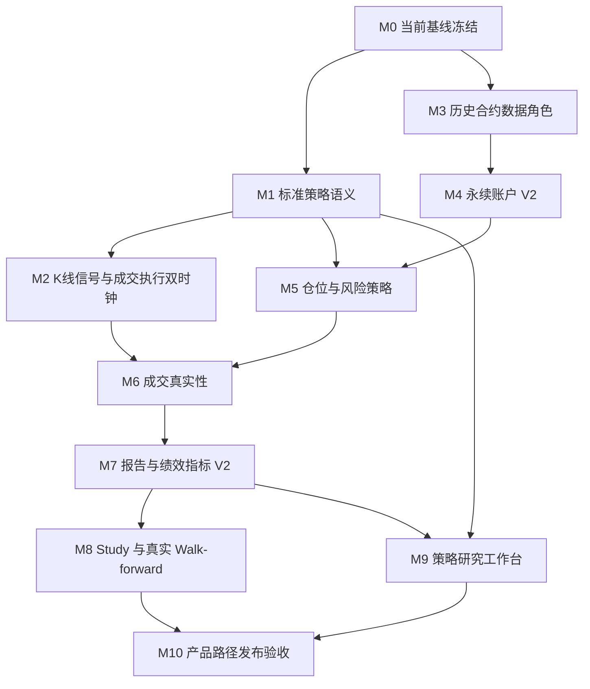

# CandleScope 回测成熟化逐步执行计划

> 状态：`DRAFT_FOR_EXECUTION`
>
> 适用工作树：`H:\program\CandleScope-backtest-foundation`
>
> 适用分支：`codex/backtest-foundation`
>
> 编制日期：2026-08-14
>
> 本文是当前回测闭环完成后的增量施工计划。它不覆盖
> `BACKTEST_PRODUCT_CONTRACT_zh.md` 中已经冻结的无前视、Host 拥有执行真相、不可变身份、
> 精度如实标注和默认关闭原则。
>
> 当前工作树仍有未提交实现。本文的落盘不代表已提交、已合并、已推送、已形成发布候选，
> 也不授权打开任何生产 flag。

关联文档：

- [回测产品合同](BACKTEST_PRODUCT_CONTRACT_zh.md)
- [初始系统执行方案](BACKTEST_SYSTEM_EXECUTION_zh.md)
- [Strategy Provider V1](BACKTEST_STRATEGY_PROVIDER_V1_zh.md)
- [Pine strategy 兼容矩阵](BACKTEST_PINE_STRATEGY_MATRIX_zh.md)
- [发布与回滚手册](BACKTEST_RELEASE_RUNBOOK_zh.md)

## 0. 如何使用本文

本文回答的是“从当前可运行 MVP 到适合 CandleScope 的成熟回测研究模式，应该按什么顺序做”。
执行时必须遵守以下规则：

1. 严格按 `M0 -> M10` 执行；一个阶段未通过退出门禁，不得同时推进下一个阶段。
2. 每个阶段先冻结合同和 golden fixture，再改生产实现，最后补 UI。
3. 每次改变策略语义、账户语义、撮合语义或报告公式，都必须创建新版本标识，不能悄悄改变旧 Run。
4. 每个阶段必须保存测试命令、退出码、运行时 flags、Git SHA、dirty 状态和关键结果 hash。
5. dirty 工作区的 smoke 可以作为开发证据，不能作为发布证据。
6. 回测结果不得直接触发 paper/live；进入 paper/live 必须走另一套部署、权限、风险和观察门禁。
7. 没有对应历史数据时必须失败关闭或明确标记 `UNMODELED`，不得用更粗数据伪造更高精度。

阶段状态只使用：

- `NOT_STARTED`
- `CONTRACT_FROZEN`
- `IMPLEMENTED_PENDING_VALIDATION`
- `VALIDATED_DIRTY_WORKSPACE`
- `VALIDATED_CLEAN_SHA`
- `MERGED_LOCAL`
- `PUSHED`
- `ROLLED_BACK`

## 1. 当前基线与成熟目标

### 1.1 当前已经具备

- 独立回测页面、后台 Run、取消、报告和导出；
- 不可变本地 BAR 快照和 checksum-verified `aggTrade` 档案；
- `SIGNAL`、`TARGET_POSITION`、`ORDER_INTENT` 统一策略输出；
- Market、Limit、Stop、Stop-Limit 与下一事件成交约束；
- 单市场、单账户、线性永续、单向持仓；
- 初始余额、固定滑点、Maker/Taker 手续费、固定周期资金费研究模型；
- 订单、成交、FIFO 完整交易、K 线标记和权益曲线；
- 决策、成交、账本、报告 hash；
- 基础 grid/random Study 和时间窗口切分；
- 后端测试、前端静态门禁和真实浏览器 smoke。

### 1.2 当前不能声称

- 内置 RSI 与 Pine `ta.rsi` 完全一致；
- “RSI 按 K 线决策、订单按真实成交撮合”已经实现；
- 固定资金费等于历史交易所资金费；
- 已建模真实杠杆、维持保证金档位、强平、保险基金或 ADL；
- `aggTrade` 可以还原订单簿排队或交易所逐委托真相；
- 当前 Study 已经完成训练区选参、测试区一次性验证的真正 walk-forward；
- 当前基础胜率/盈亏报告足以证明策略稳健或可上线；
- dirty workspace 的 smoke 等于发布验收。

### 1.3 适合 CandleScope 的成熟目标

成熟目标限定为：

> 一个可信、可复现、可审计的单市场加密货币策略研究工作台；支持标准 K 线策略，支持用同一份
> 成交档案派生 K 线信号并以成交事件执行，能够正确研究线性永续成本和风险，并提供严谨的
> 样本外验证、交易复盘和发布证据。

以下能力不进入本轮成熟化主路径：

- 实盘下单；
- 云端多租户和分布式调度；
- 没有逐委托数据时的 `QUEUE_EXACT`；
- 多市场组合优化；
- 期权和复杂衍生品账户；
- 自动选择“最佳策略”并推荐上线。

## 2. 贯穿所有阶段的 RSI24 金标策略

所有阶段使用同一个简单策略做纵向验收，避免每阶段换策略后无法比较。

### 2.1 冻结策略语义

新增不可变策略修订，不修改现有 `builtin-rsi-reversion-v1`：

```text
strategy_revision_id = builtin-rsi-wilder-long-short-v1
indicator             = Wilder RSI(close, 24)
oversold               = 30
overbought             = 70
trigger_mode           = LEVEL_TARGET_V1
output_mode            = SIGNAL
RSI <= 30              = LONG signal / normalized directional target +1
RSI >= 70              = SHORT signal / normalized directional target -1
30 < RSI < 70          = no new signal, keep prior target
initial direction      = FLAT
warmup output          = forbidden
```

这里明确采用“阈值内目标仓位”，不是“穿越阈值才交易”。如果产品以后需要 cross 版本，必须增加
另一个 revision，例如 `builtin-rsi-wilder-cross-long-short-v1`。

### 2.2 BAR 金标成交语义

1. RSI 只读取已经完结的 K 线 close；
2. 第一笔有效 RSI 之前不产生订单；
3. bar `i` 收盘得到目标仓位；
4. 新 Market 订单最早在 bar `i+1` open 成交；
5. `+1 -> -1` 由 Host 计算目标差额，成交账务同时关闭多头并建立空头剩余数量；
6. 图表显示 `REVERSE_TO_SHORT` 或等价的可审计两腿记录；
7. 重复的相同目标不得继续加仓；
8. 费用、滑点、资金费和最终权益必须与账本逐项对平。

### 2.3 成交档案金标语义

1. 只使用 checksum-verified `aggTrade` 作为权威源；
2. Host 从该成交源确定性派生 24 周期 RSI 所需 K 线；
3. 策略只在派生 K 线关闭事件上运行；
4. 策略看不到下一笔成交；
5. 新 Market 订单最早在 K 线关闭后的第一笔合格成交执行；
6. BAR 与成交模式在相同派生 K 线上必须得到相同 decision hash；
7. fill hash、费用和最终权益允许因执行精度不同而不同；
8. 报告标签保持 `AGGREGATED_TRADE_SEQUENCE`，不得写成 raw trade 或 queue exact。

### 2.4 必备 golden fixture

至少准备以下固定数据：

- 单调上涨：RSI 稳定进入超买；
- 单调下跌：RSI 稳定进入超卖；
- 先跌后涨：覆盖开多、反手空；
- 先涨后跌：覆盖开空、反手多；
- 零涨跌段：冻结 RSI 的除零语义；
- 缺 K、重复 K、乱序 K；
- K 线边界附近多笔同毫秒 `aggTrade`；
- 资金费结算点前后持仓；
- 手续费后由盈利变亏损的边界交易。

Golden 输出必须包含：RSI 序列、目标仓位序列、订单序列、成交序列、交易序列、权益序列和全部 hash。

## 3. 版本与迁移规则

成熟化不能在旧名字下改变历史结果。以下变化必须创建新身份：

| 变化 | 新身份要求 |
| --- | --- |
| RSI 从简单滚动比值改为 Wilder RMA | 新 `strategy_revision_id` |
| 增加 K 线信号 + 成交执行双时钟 | 新 `fidelity_mode` / `fill_model` |
| 引入历史 mark/funding/rules 和保证金 | 新 `account_model` |
| 增加部分成交、延迟或成交量参与 | 新 `fill_model` |
| 新增或修改绩效公式 | 新 `report schema` 和 `metrics_version` |
| 改变 Study 选参/测试语义 | 新 `study schema` 和 `selection_protocol` |
| 改变数据库字段语义 | append-only migration，不改写旧 Run |

建议版本：

```text
account_model      = LINEAR_PERP_ONE_WAY_V2
fidelity_mode      = AGG_TRADE_EXECUTION
fill_model         = TRADE_NEXT_PRINT_PARTICIPATION_V1
report schema      = candlescope.backtest-report/2
study schema       = candlescope.backtest-study/2
selection_protocol = WALK_FORWARD_TRAIN_SELECT_TEST_ONCE_V1
```

旧 `/1` 报告必须继续只读可打开；禁止数据库 migration 重新计算并覆盖旧报告 hash。

## 4. 阶段依赖



M3 与 M1 可以在设计上并行，但实现和合入仍应逐阶段完成，避免一个提交同时改变策略、数据和账务。

### 4.1 阶段总表

| 阶段 | 初始状态 | 核心交付 | 直接依赖 |
| --- | --- | --- | --- |
| M0 | `NOT_STARTED` | 当前实现的可复现基线 | 无 |
| M1 | `NOT_STARTED` | 标准 Wilder RSI24 和策略语义版本化 | M0 |
| M2 | `NOT_STARTED` | K 线信号 + aggTrade 执行双时钟 | M1 |
| M3 | `NOT_STARTED` | mark/index/funding/rules 历史数据角色 | M0 |
| M4 | `NOT_STARTED` | 线性永续账户 V2 | M3 |
| M5 | `NOT_STARTED` | sizing policy 与 Host 风控 | M1、M4 |
| M6 | `NOT_STARTED` | 延迟、参与率和部分成交 | M2、M5 |
| M7 | `NOT_STARTED` | 报告和绩效指标 V2 | M6 |
| M8 | `NOT_STARTED` | 真正的 walk-forward Study V2 | M7 |
| M9 | `NOT_STARTED` | 策略研究工作台 | M1、M7 |
| M10 | `NOT_STARTED` | 恢复、性能、soak、回滚和发布证据 | M8、M9 |
| M11 | `NOT_STARTED` | BOOK_ASSISTED、多市场等可选能力 | M10 |

### 4.2 建议代码落点

以下是实施时的优先落点，不要求在合同阶段提前创建空文件：

| 能力 | 当前/建议模块 |
| --- | --- |
| 策略协议和内置策略 | `backend/app/backtest/strategy/` |
| 数据 role、snapshot 和派生 K 线 | `backend/app/market_dataset/`、`backend/app/simulation/` |
| BAR/成交撮合 | `backend/app/simulation/kernel.py`、`trade_kernel.py` 及版本化后继模块 |
| 永续账户与账本 | `backend/app/simulation/contract_accounting.py` 或独立 V2 模块 |
| Run/Study 编排 | `backend/app/backtest/service.py`、`runtime.py`、`study.py` |
| 报告和导出 | `backend/app/backtest/reports.py` 及新增 metrics 模块 |
| API schema | `backend/app/backtest/schema.py`、`backend/app/api/v1/backtests.py` |
| 回测工作台 | `frontend/src/features/backtest/` |
| golden/合同测试 | `backend/tests/fixtures/backtest/`、`backend/tests/backtest_contract/` |
| 证据与基准 | `docs/evidence/`、`docs/perf-baselines/backtest/` |

## 5. M0：冻结当前实现基线

### 5.1 目标

把当前 dirty workspace 中已经实现的回测闭环整理成一个可复现基线。M0 不增加产品能力。

### 5.2 执行步骤

- [ ] 记录 `git status --short --branch`、基线 SHA、ahead/behind 和所有未跟踪文件。
- [ ] 将用户原有变更与本轮回测变更按路径分类，确认无误删、无跨工作树污染。
- [ ] 校对产品合同、API schema、数据库 schema、前端类型和实际 wire payload。
- [ ] 删除或隔离不能作为发布证据的私有内核 benchmark 声明；文件可保留，但必须标成 microbenchmark。
- [ ] 重跑当前后端回测测试族。
- [ ] 重跑前端 typecheck、lint、回测测试和 build。
- [ ] 用公开 API 跑 BAR 指令策略 smoke。
- [ ] 用真实页面检查开平仓标记、完整交易、权益曲线、手续费和导出。
- [ ] 在用户授权后再形成基线提交；未授权前不得 commit、merge 或 push。

### 5.3 当前门禁命令

```powershell
Set-Location H:\program\CandleScope-backtest-foundation\backend
$backtestFiles = Get-ChildItem -Path tests -Filter 'test_backtest*.py' | ForEach-Object { $_.FullName }
python -m pytest tests/backtest_contract @backtestFiles tests/test_strategy_provider_v1.py tests/test_simulation_kernel.py tests/test_trade_tape.py tests/test_book_assisted.py tests/test_contract_accounting.py tests/test_local_offline_main_profile.py -q

Set-Location H:\program\CandleScope-backtest-foundation\frontend
npm run typecheck
npm run lint -- --quiet
npm run test:backtest
npm run build

Set-Location H:\program\CandleScope-backtest-foundation
git diff --check
git status --short --branch
```

### 5.4 退出门禁

- [ ] 后端、前端和浏览器 smoke 全部通过；
- [ ] 报告 hash 可重算；
- [ ] 所有回测 flags 默认值仍为 `0`；
- [ ] 文档明确 dirty smoke 不是 release evidence；
- [ ] 获得一个经用户确认的基线提交，或明确停留在 `VALIDATED_DIRTY_WORKSPACE`。

### 5.5 回滚

M0 只整理和取证；如果整理过程碰到用户变更，停止并报告重叠，不使用 `reset --hard` 或目录级 checkout。

## 6. M1：标准策略和指标语义

### 6.1 目标

让同一个策略在 CandleScope、Pyne/Pine 参考实现和 golden fixture 上产生一致决策，先解决“策略算的是什么”。

### 6.2 合同先行

- [ ] 在 `BACKTEST_PRODUCT_CONTRACT_zh.md` 增加指标 revision 不可变规则。
- [ ] 为 RSI 冻结 Wilder RMA 公式、初始化、缺失值、零损失、零涨跌和 warmup 语义。
- [ ] 冻结 `LEVEL_TARGET` 与 `CROSS_TARGET` 的区别。
- [ ] 冻结多空反手、重复目标、部分拒单后的下一次目标计算语义。
- [ ] 冻结策略所用价格字段：BAR 策略默认只使用 close，不能隐式改用 mark 或成交价。

### 6.3 实现步骤

- [ ] 新增 `builtin-rsi-wilder-long-short-v1`，保留旧 RSI revision。
- [ ] 将 RSI 状态放入 Provider snapshot/restore，保证暂停恢复后结果 hash 相同。
- [ ] 给 Provider descriptor 增加明确的 signal clock、required features 和 warmup requirement。
- [ ] UI 从 Provider schema 生成长度、超卖、超买、触发模式字段，避免继续硬编码策略参数。
- [ ] 在报告中记录实际 RSI revision、参数、warmup 行数和 reason code。
- [ ] 增加每个决策点的可选 debug trace，但默认不把全量 trace 放入普通报告。

### 6.4 主要文件

- `backend/app/backtest/strategy/builtin.py`
- `backend/app/backtest/strategy/registry.py`
- `backend/app/backtest/strategy/protocol.py`
- `backend/app/backtest/strategy/host_adapter.py`
- `frontend/src/features/backtest/BacktestApp.tsx`
- `frontend/src/features/backtest/backtestTypes.ts`
- `backend/tests/fixtures/backtest/`

### 6.5 必测场景

- [ ] RSI 序列与 Pine `ta.rsi(close, 24)` 固定 fixture 一致；
- [ ] warmup 期间零订单；
- [ ] 超卖开多、超买反手空；
- [ ] 中性区保持，不反复下单；
- [ ] 拒单后 planner 以账户权威仓位重新计算；
- [ ] checkpoint 前后 decision/fill/ledger/report hash 相同；
- [ ] 旧 revision 的历史 Run 结果不变。

### 6.6 退出门禁

- [ ] RSI24 金标策略的目标仓位序列冻结；
- [ ] 至少一个独立参考实现对拍通过；
- [ ] UI、API、报告显示同一 revision 和参数；
- [ ] 旧报告仍可读取；
- [ ] 未引入成交或账户语义变化。

## 7. M2：K 线信号与成交执行双时钟

### 7.1 目标

实现“策略按完结 K 线计算，订单按后续真实 `aggTrade` 执行”，解决 RSI 等 K 线策略不能正确使用成交级撮合的问题。

### 7.2 新精度模式

不要让现有 `AGG_TRADE_TAPE` 暗中改变策略调用频率。新增显式模式：

```text
fidelity_mode    = AGG_TRADE_EXECUTION
source_event_kind = AGG_TRADE
signal_clock     = DERIVED_BAR_CLOSE
signal_interval  = 1m / 5m / ...
execution_clock  = NEXT_AGG_TRADE
bar_builder      = TRADE_DERIVED_COMPLETE_BUCKETS_V1
```

该模式仍只有一个权威源：`aggTrade`。K 线必须由同一份归档确定性派生，不能再混入另一份未经证明一致的 K 线数据。

### 7.3 事件顺序

每个时间桶必须按以下顺序处理：

1. 消费桶内 `aggTrade` 并更新形成中 K 线；
2. 到达桶边界时生成只包含边界以前成交的 `DERIVED_BAR_CLOSE`；
3. Provider 只在该关闭事件上运行；
4. Host 生成订单并标记为边界之后可执行；
5. 第一笔边界后的 `aggTrade` 才能撮合新订单；
6. 同毫秒事件使用冻结 tie-break，不能依赖数据库偶然顺序；
7. 空桶按 gap policy 处理，不得凭空复制 close；
8. 尾部未完结桶不得向策略公开。

为保证 BAR 与双时钟模式可以比较，派生关闭事件必须拥有独立于 raw trade sequence 的
`signal_sequence`（按完整 K 线序号递增）。策略 output/decision hash 使用 signal sequence；
撮合和 fill hash 继续使用权威 `aggTrade` sequence。

### 7.4 实现步骤

- [ ] 抽取/新增纯函数 `TradeBarBuilder`，输入严格排序的聚合成交，输出完整桶。
- [ ] 定义 `DERIVED_BAR_CLOSE` 内部事件和稳定 sequence/tie-break。
- [ ] 定义 canonical `signal_sequence`，避免分页或成交数量改变策略决策身份。
- [ ] 将 Provider 调用从“每笔成交一次”改为“每个信号时钟事件一次”。
- [ ] 保留撮合内核对每笔成交的处理。
- [ ] 将 signal interval、bar builder revision 和时区写入 Run identity。
- [ ] chart API 读取同一派生结果，禁止 UI 另算出不同 K 线。
- [ ] checkpoint 同时保存 bar builder、Provider、planner、订单、账户和成交 cursor。
- [ ] 报告同时列出 signal event count 与 execution event count。

### 7.5 等价性测试

- [ ] 用同一份 `aggTrade` 派生 K 线；
- [ ] BAR 模式读取这些派生 K 线，双时钟模式读取原始 `aggTrade`；
- [ ] 两者 RSI 值、target sequence 和 decision hash 必须相同；
- [ ] 两者 fill hash 可以不同，但每个差异必须能由 fill model 解释；
- [ ] 暂停/恢复、不同分页大小和不同 checkpoint 间隔结果相同；
- [ ] 桶边界同毫秒成交顺序有 golden fixture；
- [ ] 缺档时失败，不降级为 BAR。

### 7.6 退出门禁

- [ ] RSI24 能在“按 K 决策、按成交执行”模式完成；
- [ ] Provider 不再按每笔成交误算 RSI；
- [ ] decision 等价、execution 差异可解释；
- [ ] 页面明确显示信号周期和执行源；
- [ ] 报告标签仍诚实说明 `aggTrade` 不是 raw trade 或队列真相。

## 8. M3：历史合约数据角色

### 8.1 目标

把固定研究参数升级为可版本化的历史 `MARK_INDEX`、`FUNDING` 和 `INSTRUMENT_RULES` 数据角色，为永续账户 V2 提供事实输入。

### 8.2 数据包结构

一个可用于永续回测的 snapshot 应能绑定：

```text
BARS or AGG_TRADE
MARK_INDEX
FUNDING
INSTRUMENT_RULES
```

每个 role 独立记录：内容 hash、覆盖区间、行数、首尾事件、gap、duplicate、out-of-order、provenance 和 retention policy。

### 8.3 实现步骤

- [ ] 定义 mark/index、funding 和 instrument rules 的 canonical schema。
- [ ] 为每种 role 编写本地导入器和 checksum manifest。
- [ ] 冻结同时间戳排序：rules -> mark/index -> funding -> market event。
- [ ] 校验 funding period 唯一、结算时间明确、费率合法。
- [ ] 校验合约 multiplier、tick、step、min notional 和 maintenance tier 生效区间不重叠。
- [ ] preview API 返回每个 role 的真实覆盖和缺失区间。
- [ ] UI 在启动前显示“完整、部分、缺失”；需要的 role 缺失时拒绝 Run。
- [ ] LOCAL_OFFLINE 禁止在线补取这些数据。

### 8.4 数据质量门禁

- [ ] mark/index 时间不倒退；
- [ ] funding 结算不重复；
- [ ] rules timeline 无重叠、无回溯生效；
- [ ] 交易区间内所需 role 完整覆盖；
- [ ] snapshot hash 重算一致；
- [ ] 同一 snapshot 多次迭代事件序列一致；
- [ ] 人为删一行后 preview 和 Run 都失败关闭。

### 8.5 退出门禁

- [ ] 至少一个真实商品、连续七天的四类数据完成校验导入；
- [ ] snapshot 能独立重放且不联网；
- [ ] 缺 role 不再用固定参数冒充历史事实；
- [ ] 数据 manifest 和质量报告可导出。

## 9. M4：线性永续账户 V2

### 9.1 目标

用历史合约数据驱动保证金、未实现盈亏、资金费和强平研究，同时保持旧 `LINEAR_PERP_ONE_WAY_V1` 结果不变。

### 9.2 冻结账户字段

- 初始余额与可用余额；
- 钱包余额、未实现盈亏、权益；
- position qty、entry price、mark price、notional；
- leverage、initial margin、maintenance margin；
- maintenance tier 和合约 multiplier；
- realized PnL、fees、funding；
- liquidation state 和 insolvency state。

资金费模式必须冻结为三选一：

```text
OFF
FIXED_SCENARIO
HISTORICAL_REQUIRED
```

只有 `HISTORICAL_REQUIRED` 强制要求完整 `FUNDING` role；`OFF` 必须明确记录为关闭，
`FIXED_SCENARIO` 必须记录固定费率和周期，并且两者都不得标成历史资金费。

### 9.3 实现步骤

- [ ] 新增 `LINEAR_PERP_ONE_WAY_V2`，不修改 V1 的身份语义。
- [ ] 权威未实现盈亏改由历史 mark 驱动；成交价只用于成交和 entry price。
- [ ] 每个 funding event 按当时仓位、mark、rate 和 multiplier 结算一次。
- [ ] 每次订单受理、成交、mark、funding、rules 变化后重算保证金。
- [ ] 冻结维护保证金档位选择规则。
- [ ] 冻结强平触发时间和强平价格模型；未建模保险基金/ADL 时继续明确标记。
- [ ] 余额不足、风险超限和强平使用不同错误/事件，不混成普通 rejected order。
- [ ] 账本所有变化 append-only；更正只追加 compensating entry。
- [ ] 报告同时展示钱包余额、未实现盈亏、权益、保证金和可用余额。

### 9.4 账务恒等式

每个事件后必须验证：

```text
wallet_balance
= initial_balance
 + cumulative_realized_pnl
 - cumulative_fees
 + cumulative_funding
 + compensating_entries

equity = wallet_balance + unrealized_pnl(mark)
available_balance = equity - initial_margin - frozen_order_margin
```

### 9.5 必测场景

- [ ] 多头/空头开仓、加仓、减仓、平仓、反手；
- [ ] 不同 entry price 的 FIFO 交易与账户平均价同时正确；
- [ ] 正负 funding 对多空方向正确；
- [ ] funding 时刻无仓位时金额为零但 period 仍可审计；
- [ ] rules/maintenance tier 切换；
- [ ] mark 急变触发强平；
- [ ] 手续费导致保证金不足；
- [ ] checkpoint 恢复后账务 hash 一致；
- [ ] V1 历史 fixture 不变。

### 9.6 退出门禁

- [ ] 所有账务恒等式逐事件成立；
- [ ] 历史 funding 和固定 scenario 在身份、报告中严格区分；
- [ ] 强平结果可由事件和规则重算；
- [ ] 缺 mark/rules 的 V2 Run 失败关闭；选择 `HISTORICAL_REQUIRED` 时缺 funding 也失败关闭。

## 10. M5：仓位计算与 Host 风控

### 10.1 目标

把策略方向与下单数量分离。`SIGNAL` 可以表达方向，实际数量由冻结的 Host sizing/risk policy
决定；现有 `TARGET_POSITION` 继续表示绝对目标数量，不能在原协议名字下偷偷改成百分比暴露。

### 10.2 第一批 sizing policy

```text
FIXED_QTY_V1
FIXED_NOTIONAL_V1
EQUITY_PERCENT_V1
RISK_PER_STOP_V1
```

每个 policy 必须写入 Run identity。`RISK_PER_STOP_V1` 没有有效 stop distance 时必须拒绝，不能退化为固定数量。

### 10.3 第一批风险限制

- 最大绝对仓位数量；
- 最大名义价值；
- 最大杠杆；
- 单笔最大风险；
- 最大同时活动订单数；
- 最大累计手续费；
- 最大回撤停止开仓；
- 可选日内损失限制和冷却时间；
- `reduce_only` 永远允许减少风险，但不能反向开仓。

### 10.4 实现步骤

- [ ] 新建 Host `SizingPolicy` 和 `RiskPolicy` 端口。
- [ ] `SIGNAL` 先进入 sizing，得到绝对目标数量，再进入 risk 和订单规划。
- [ ] `TARGET_POSITION` 保持绝对目标数量语义，直接进入 risk 和 instrument rules。
- [ ] `ORDER_INTENT` 保持显式订单数量语义，仍必须经过 risk 和 instrument rules，插件不能绕过。
- [ ] 风险拒单生成结构化 reason、输入快照和规则 revision。
- [ ] planner 使用账户实际仓位和活动订单计算 projected position。
- [ ] UI 提供 policy 选择和条件字段；不适用字段禁用并解释。
- [ ] 报告记录风险拒单、停止原因和最大实际暴露。

### 10.5 必测场景

- [ ] 同一策略在四种 sizing policy 下 decision 相同、订单数量不同；
- [ ] 价格变化时 fixed notional 数量按 step 正确量化；
- [ ] equity percent 使用当时可见权益，不能使用最终权益；
- [ ] 风险限额和 min notional 冲突时明确拒绝；
- [ ] 反手订单同时考虑平旧仓和开新仓所需保证金；
- [ ] reduce-only 不会越过零；
- [ ] checkpoint 后 projected position 不漂移。

### 10.6 退出门禁

- [ ] RSI24 可选择固定 1 张、固定 USDT、权益百分比三种常用仓位；
- [ ] 风险拒单在图表、交易列表和报告中可追踪；
- [ ] 任何策略 Provider 都不能直接改余额或绕过风控。

## 11. M6：成交真实性 V2

### 11.1 目标

在不虚构队列精度的前提下，提高 BAR 和 `aggTrade` 回测的成本与成交可信度。

### 11.2 BAR 模式

- [ ] 保留 `NEXT_BAR_WORST_CASE` 作为默认参考模型；
- [ ] 实现可选 bar volume participation 上限；
- [ ] 超过参与率的订单跨 bar 部分成交；
- [ ] gap、止损/止盈同 bar 冲突继续使用冻结 scenario；
- [ ] 每个 scenario 单独命名和写入身份；
- [ ] 不把 OHLC 路径假设写成历史事实。

### 11.3 `aggTrade` 模式

- [ ] 增加固定毫秒/事件数 latency model；
- [ ] Market 订单从 latency 之后第一笔合格成交开始；
- [ ] 使用成交数量和 participation cap 形成部分成交；
- [ ] 使用 aggressor/maker 标记时，先冻结其来源和解释；
- [ ] Limit 订单只在后续成交穿价后模拟成交；
- [ ] 无 L2 时继续声明没有 spread、depth 和 queue position 真相；
- [ ] 大订单未在区间内完成时保留残单或按冻结 end policy 取消。

### 11.4 订单生命周期

成熟主路径至少支持：

```text
NEW -> ACCEPTED -> OPEN -> PARTIAL -> FILLED
                           -> CANCELLED
                           -> EXPIRED
     -> REJECTED
```

TIF 先增加 `IOC`，`FOK` 和 `POST_ONLY` 只有在相应数据足够时再引入。

### 11.5 成本敏感性矩阵

每个候选策略至少自动生成：

- 基准手续费/滑点；
- 费用各增加 25%；
- 费用各增加 50%；
- latency 增加一个档位；
- participation cap 降低一个档位。

这不是自动调参，而是稳健性检查；结果不得混入主 Run hash。

### 11.6 退出门禁

- [ ] 大订单会部分成交，不再无限吃掉一根 K 或一笔成交；
- [ ] latency 前的成交不能用于 fill；
- [ ] 每一笔 fill 都能追溯到权威市场事件；
- [ ] BAR/aggTrade 报告明确列出未建模机制；
- [ ] 一百万成交事件产品路径达到冻结性能门槛，并包含真实订单、账本和报告写入。

## 12. M7：报告与绩效指标 V2

### 12.1 目标

让报告能够回答“赚了多少、承担了什么风险、结果是否可能只是样本和成本假象”。

### 12.2 指标分组

收益：

- total return；
- annualized return，仅在区间足够且年化有意义时输出；
- realized/unrealized/net PnL；
- benchmark return 和 excess return。

风险：

- max drawdown、drawdown duration；
- volatility；
- downside volatility；
- Sharpe、Sortino、Calmar；
- 最大单笔亏损、最大连续亏损。

交易：

- trade count、win rate；
- gross profit、gross loss、profit factor；
- expectancy、payoff ratio；
- 平均/中位持仓时长；
- turnover、exposure time；
- MAE/MFE；
- long/short 分组表现；
- fees/funding/slippage cost attribution。

质量与可信度：

- 数据覆盖、gap、duplicate、warning；
- fill model、account model、metrics version；
- ambiguity、rejected、partial/unfilled 数；
- suitable/not suitable；
- 样本内/样本外角色；
- 未建模机制。

### 12.3 公式冻结

- [ ] 在文档中写出每个指标公式、采样频率、空值和短区间语义。
- [ ] 权益收益使用 mark-to-market equity，不只使用已平仓交易。
- [ ] 风险自由利率默认值和年化频率写入 Run identity。
- [ ] 零波动、零交易、负权益和不完整区间返回明确 `null/reason`，不输出无穷大。
- [ ] 交易指标与账户指标分开；开放仓位不能被当作完整交易。
- [ ] benchmark 使用同一 snapshot、同一费用假设和同一可交易时间。

### 12.4 报告对账

必须同时满足：

```text
sum(closed trade gross pnl) == account cumulative realized pnl
sum(fill fees) == account cumulative fees
sum(funding events) == account cumulative funding
final equity == final wallet + final unrealized pnl
report hash == recomputed report hash
```

### 12.5 UI

- [ ] 总览卡只展示少量核心指标；
- [ ] 风险、交易、成本、数据质量分区；
- [ ] 权益与回撤同轴/联动；
- [ ] 月度收益热图；
- [ ] 交易表支持多空、盈利/亏损、时间范围和 reason 筛选；
- [ ] 点击交易定位 K 线并显示入场、最大不利/有利波动和退出；
- [ ] 所有图表值可追溯到报告字段，不在浏览器重新发明公式。

### 12.6 退出门禁

- [ ] `/2` 报告 schema 有 golden fixture；
- [ ] 指标与至少一个独立参考计算对拍；
- [ ] 开放仓位、零交易、短样本等边界不误导；
- [ ] `/1` 报告继续可读；
- [ ] CSV/JSON 导出绑定相同报告 hash。

## 13. M8：Study V2 与真正的 Walk-forward

### 13.1 目标

把当前“在测试窗口跑若干参数并按最终权益排序”升级成严格的训练选择、测试一次性验证流程。

### 13.2 冻结流程

每个 fold 严格执行：

1. 冻结 train/test 时间窗以及可选 purge/embargo；
2. 只在 train 窗口运行候选参数；
3. 按预先声明的 objective 和约束选择一个候选；
4. 冻结选中参数和 selection receipt；
5. 在 test 窗口只运行一次；
6. test 结果不得反向改变该 fold 参数；
7. 汇总所有 test 窗口，形成真正 OOS 曲线；
8. 最终 holdout 如果存在，整个研究期间只能揭示一次。

### 13.3 Study 身份

至少冻结：

- hypothesis；
- dataset snapshot；
- fold windows、purge、embargo；
- parameter space；
- sampler 和 seed；
- objective、constraints 和 tie-break；
- candidate budget；
- account/fill/cost models；
- benchmark；
- selection protocol revision。

### 13.4 第一批 objective/constraint

Objective 不默认使用最终权益。建议先支持：

- `NET_RETURN`
- `SHARPE`
- `CALMAR`
- `EXPECTANCY`

约束至少支持：

- 最小完整交易数；
- 最大回撤上限；
- 最低数据覆盖；
- 最大 ambiguity/rejected 比例；
- 成本增加 25% 后仍为正；
- 多空任一侧交易数不足时警告。

### 13.5 稳健性

- [ ] 参数邻域稳定性；
- [ ] 成本/延迟敏感性；
- [ ] trade-order bootstrap 或 block bootstrap；
- [ ] 多次试验数量和 selection bias 警告；
- [ ] train/test 指标落差；
- [ ] 不同市场阶段分组；
- [ ] 与 buy-and-hold/always-flat 基准比较。

### 13.6 数据库和任务模型

- [ ] `Study -> Fold -> TrainTrial -> SelectionReceipt -> TestRun` 显式建模；
- [ ] 不能继续只用一个 `trial.split_id` 表达全部语义；
- [ ] selection receipt append-only 且有 hash；
- [ ] Study 取消后停止规划新 Run，已完成证据保留；
- [ ] worker 崩溃后能从未完成 fold 恢复，不重复揭示 test；
- [ ] 预算上限继续只能收紧。

### 13.7 UI

- [ ] 用户先写 hypothesis，再配置参数空间；
- [ ] 清楚显示 train/test/holdout，不只显示一个“walk-forward”按钮；
- [ ] 参数热图只展示 train 或 OOS 时必须有醒目标识；
- [ ] 展示每 fold 的选中参数和 test 结果；
- [ ] 展示拼接后的 OOS 权益，而不是把所有候选混成一条曲线；
- [ ] 明确提示“回测结果不是实盘批准”。

### 13.8 退出门禁

- [ ] 测试证明 test 数据从未参与参数选择；
- [ ] 同 seed、snapshot 和预算产生相同 selection receipt；
- [ ] OOS 汇总只包含 test Run；
- [ ] 无交易或违反约束的候选不会因最终权益偶然较高而获胜；
- [ ] RSI24 参数空间 Study 能完整展示各 fold 选择和 OOS 结果。

## 14. M9：策略研究工作台

### 14.1 目标

把目前的运行表单升级为日常可用的研究工具，但不把编辑器变成可绕过 Provider 安全边界的任意代码入口。

### 14.2 策略工作流

- [ ] 新建、保存、复制、归档 StrategyRevision；
- [ ] 内置策略参数由 schema 动态生成；
- [ ] Pine/Pyne 源码编辑、静态检查、编译和明确错误定位；
- [ ] 编译产物、依赖、runtime 和源码 hash 绑定 revision；
- [ ] 一键运行小窗口 smoke，再允许长 Run；
- [ ] 显示所需输入、支持的 signal clock、输出模式和不支持能力；
- [ ] 外部模型只引用冻结 artifact，不在 Run 中训练或覆盖。

### 14.3 调试与解释

- [ ] 可选保存有界 signal trace：时间、指标值、reason、目标仓位；
- [ ] RSI 等指标显示在独立 pane；
- [ ] 点击开平仓标记展示触发时可见输入和执行差异；
- [ ] 区分 decision time、order accepted time 和 fill time；
- [ ] 明确显示延迟、滑点、手续费和资金费如何改变结果；
- [ ] 大型 trace 分页读取，不塞入主报告。

### 14.4 Run 对比

- [ ] 只允许数据、账户、精度等关键身份兼容的 Run 做直接比较；
- [ ] 参数差异表；
- [ ] 权益/回撤叠加；
- [ ] 交易差异和成本差异；
- [ ] decision hash 相同但 fill hash 不同时给出精度解释；
- [ ] 支持 clone Run 修改一个参数，生成新不可变身份。

### 14.5 与 K 线回放的研究桥

- [ ] 从异常交易或高回撤窗口创建独立 TrainingRun；
- [ ] 训练完成前隐藏策略结果；
- [ ] 揭盲后对比人工订单与策略订单；
- [ ] 只共享不可变数据引用和只读投影；
- [ ] 不共享账户、cursor、checkpoint 或 UI store；
- [ ] 该桥继续由独立 flag 控制并默认关闭。

### 14.6 浏览器验收旅程

必须用真实页面完成：

1. 选择商品和区间；
2. 创建 RSI24 revision；
3. 选择 BAR 模式并运行；
4. 查看 RSI pane、开平仓、反手和交易详情；
5. 切换到 K 信号 + aggTrade 执行；
6. 对比两次 Run 的 decision/fill 差异；
7. 创建 Study V2；
8. 查看 fold selection 和 OOS 曲线；
9. 导出并验证 manifest/report hash；
10. 重载页面后仍能恢复上述对象。

### 14.7 退出门禁

- [ ] 普通用户无需手写 JSON 即可完成主路径；
- [ ] 高级用户仍可通过统一订单接口研究复杂订单；
- [ ] 所有错误都有可执行的下一步，不只显示内部错误码；
- [ ] 页面不会把近似结果标成精确成交；
- [ ] 真实浏览器控制台零错误，长表和长曲线内存有界。

## 15. M10：可靠性、性能和发布验收

### 15.1 目标

把“功能在工作区跑通”升级为“干净 SHA 上可以重复验证、可以安全关闭和回滚”。

### 15.2 恢复与故障注入

- [ ] BAR、双时钟和 aggTrade Run 都支持 checkpoint/restore；
- [ ] worker 在 decision 前、订单后、部分成交后、funding 后、报告封存前分别故障注入；
- [ ] 重启不重复成交、不重复资金费、不改变 hash；
- [ ] corrupt checkpoint 明确失败，不从头静默重跑后覆盖；
- [ ] 数据文件被替换、截断或 hash 改变时拒绝恢复；
- [ ] Provider 超时/崩溃保留最后安全 checkpoint 和审计事件。

### 15.3 性能工作负载

必须测真实产品路径，不使用只调用 `_enqueue/_match` 的私有微基准代替：

- 20 万 BAR，含活动订单、成交、账本、checkpoint 和报告；
- 100 万/200 万 `aggTrade`，含 RSI 信号时钟和实际持仓；
- 大量部分成交；
- 64 trial Study V2；
- 16 MB 上限附近报告和分页 trace；
- 4 个并发 Run；
- 浏览器长曲线、长交易表和 Run 切换。

每个门槛在首次受控基准后冻结；环境争用导致失败时保留失败证据，不能放宽门槛来制造通过。

### 15.4 发布证据

每个 evidence manifest 至少记录：

```text
schemaVersion
gitSha
gitDirty
branch
runtimeProfile
effectiveFlags
datasetSnapshotHashes
strategyRevision
accountModel
fillModel
reportSchema
commands
exitCodes
duration
decisionHash
fillHash
ledgerHash
reportHash
browserConsoleErrors
artifactPaths
```

建议文件名：

```text
docs/evidence/backtest-maturity-m1-YYYYMMDD.json
...
docs/evidence/backtest-maturity-release-YYYYMMDD.json
```

### 15.5 干净发布候选门禁

- [ ] 独立 review 完成；
- [ ] 后端全量相关测试通过；
- [ ] 前端 typecheck、lint、测试、build 通过；
- [ ] 公开 API smoke 通过；
- [ ] 真实公开路径 1h soak 通过；
- [ ] 4h 浏览器/生命周期 soak 通过；
- [ ] 真实 aggTrade 性能门槛通过；
- [ ] checkpoint/fault injection 通过；
- [ ] detached worktree exact revert 演练通过；
- [ ] 回滚后 live/local/replay/plugin 基本健康；
- [ ] release manifest 绑定干净 SHA；
- [ ] 所有生产 flags 仍默认 `0`。

### 15.6 分阶段启用

即使发布候选通过，也不立即全开：

1. 开发机显式 flags；
2. 本地离线单用户观察；
3. 只开放 BAR；
4. 再开放双时钟/aggTrade；
5. 最后开放 Study；
6. 外部 Provider、回放桥和 BOOK_ASSISTED 分别做独立决策。

每一步都要有立即关闭 flag，不通过前一步不得进入下一步。

## 16. M11：成熟主路径之后的可选能力

以下能力只有在 M10 通过后再排期：

### 16.1 BOOK_ASSISTED

- 连续历史 L2 与成交同步；
- spread、可见 depth 和更合理的市场冲击；
- 仍不得声称自己的真实 queue position；
- 数据断口暂停整个 Run，不回退 aggTrade。

### 16.2 多市场组合

- 单一全局事件时钟；
- 组合现金、保证金和风险；
- 一个强制完整轨道缺数据时整个 Run 暂停；
- 组合级 exposure、correlation 和 drawdown；
- 不能把若干单市场报告简单相加冒充组合结果。

### 16.3 现货账户

- 新 `SPOT_LONG_ONLY_V1`；
- base/quote 双资产余额；
- 不借币时禁止空头；
- 手续费资产和最小下单规则；
- 与永续账户字段严格分离。

### 16.4 更高级研究方法

- purged k-fold；
- combinatorial purged cross-validation；
- Deflated Sharpe Ratio；
- Probability of Backtest Overfitting；
- regime 分层和跨商品验证；
- 模型 artifact 数据血缘与特征可见时间审计。

这些方法只能降低误判风险，不能把历史回测变成未来收益保证。

## 17. 每阶段通用执行模板

每个阶段复制以下清单：

### 17.1 开始前

- [ ] 当前阶段依赖已达到 `VALIDATED_CLEAN_SHA` 或有明确例外记录；
- [ ] 工作树和 SHA 已记录；
- [ ] 用户变更已识别；
- [ ] 产品语义和明确不做已写清；
- [ ] 新 schema/revision 名称已冻结；
- [ ] rollback target 已记录。

### 17.2 实现顺序

- [ ] 合同/ADR；
- [ ] golden fixture；
- [ ] 失败测试；
- [ ] 纯领域实现；
- [ ] 持久化/API；
- [ ] 前端类型和 UI；
- [ ] 兼容读取；
- [ ] 文档和错误说明；
- [ ] focused tests；
- [ ] broader regression；
- [ ] 浏览器验收；
- [ ] 性能/soak；
- [ ] evidence manifest；
- [ ] 独立 review；
- [ ] 用户授权后提交/合并/推送。

### 17.3 证据结论模板

```text
Feature implementation: PASS/FAIL
Contract tests: PASS/FAIL
Regression tests: PASS/FAIL
Browser acceptance: PASS/FAIL/NOT_RUN
Performance gate: PASS/FAIL/NOT_RUN
Soak gate: PASS/FAIL/NOT_RUN
Clean candidate SHA: <sha or NONE>
Local merge: YES/NO
Remote push: YES/NO
Production flags: 0/1
Known limitations: ...
```

## 18. 推荐的实际开工顺序

下一轮实施不要直接从 UI 或高级 Study 开始。建议按以下批次执行：

### 批次 A：先让一个策略算对

1. M0 当前基线冻结；
2. M1 标准 Wilder RSI24 多空策略；
3. 用 BAR fixture 证明下一根开盘成交、反手和账务一致。

完成标志：RSI24 在 CandleScope 与参考实现产生同一目标仓位序列。

### 批次 B：让成交精度可用

1. M2 双时钟；
2. M3 历史合约数据角色；
3. M4 永续账户 V2；
4. M5 sizing/risk；
5. M6 部分成交、延迟和参与率。

完成标志：同一 RSI24 决策在 BAR 与成交执行模式一致，差异只来自明确的成交和成本模型。

### 批次 C：让研究结论可信

1. M7 报告 V2；
2. M8 Study V2；
3. 成本敏感性、参数稳定性和 OOS 汇总。

完成标志：系统能主动说明策略为什么看起来有效、风险在哪里、是否只在训练区有效。

### 批次 D：形成产品和发布证据

1. M9 研究工作台；
2. M10 checkpoint、故障注入、性能、soak 和回滚；
3. 生产 flags 保持默认关闭，另行做启用决策。

完成标志：干净 SHA 上的公开产品路径可重复验证，并能一键停用和精确回滚。

## 19. 最终 Definition of Done

只有同时满足以下条件，才可以称为“适合 CandleScope 的成熟回测模式”：

- [ ] 标准策略语义有独立参考对拍；
- [ ] K 线信号与成交执行时钟明确分离且无前视；
- [ ] 历史 mark/funding/rules 驱动永续账户；
- [ ] 仓位、保证金、风险和强平可解释、可重算；
- [ ] BAR 与 aggTrade 成交模型都有诚实精度标签；
- [ ] 成本、延迟、参与率和部分成交进入 Run identity；
- [ ] 报告含完整收益、风险、交易、成本和数据质量指标；
- [ ] Study 严格执行 train select、test once 和 OOS 汇总；
- [ ] 策略编辑、运行、对比、交易下钻和导出形成页面闭环；
- [ ] 所有关键对象可恢复、可审计、可验证 hash；
- [ ] 干净 SHA 上通过测试、浏览器、性能、soak、故障注入和回滚门禁；
- [ ] 回测结果仍与 paper/live 权限隔离；
- [ ] 生产 flags 的启用有独立、明确的人工决策。

在此之前，应使用更准确的状态描述：

> `可运行回测 MVP / 研究底座，尚未达到成熟研究与生产启用门禁。`
