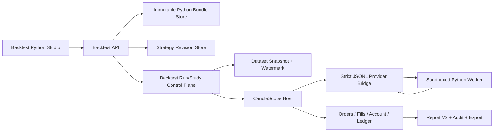
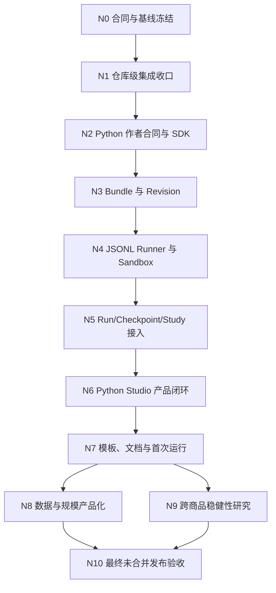

# CandleScope 回测下一阶段（Python First）详细执行方案

> 状态：`CONTRACT_FROZEN`
>
> 适用工作树：`H:\program\CandleScope-backtest-foundation`
>
> 适用分支：`codex/backtest-foundation`
>
> 编制日期：2026-08-15
>
> 本文是施工合同，不是实现报告。N0 冻结后，本工作树可按 N1→N10 顺序实施；
> 仍不授权合并 `main`、推送远端或打开生产开关。
> 当前明确要求：**暂不合并回 `main`，不扩展 Pine/Pyne 语义，不修改任何仓库外运行时，
> 必须让用户只写普通 Python 也能完整使用 CandleScope 的回测数据、撮合、账户、报告和 Study。**

关联基线：

- [回测产品合同](BACKTEST_PRODUCT_CONTRACT_zh.md)
- [回测系统初始执行方案](BACKTEST_SYSTEM_EXECUTION_zh.md)
- [回测成熟化 M0～M11 计划](BACKTEST_MATURITY_EXECUTION_PLAN_zh.md)
- [strategy-provider/1](BACKTEST_STRATEGY_PROVIDER_V1_zh.md)
- [M10 验收结果](evidence/BACKTEST_MATURITY_M10_RESULT_20260815_zh.md)
- [ADR-BACKTEST-012](adr/ADR-BACKTEST-012-python-first.md)
- [N0 冻结记录](evidence/BACKTEST_PYTHON_FIRST_N0_RESULT_20260815_zh.md)

---

## 1. 决策摘要

下一阶段不把 CandleScope 做成另一个 Pine 编辑器，也不把 Python 策略变成可以直接操作数据库、
账户或撮合器的脚本。产品方向冻结为：

> 用户使用标准 Python 编写策略；CandleScope 把它编译、冻结并放入独立进程；Host 逐时钟发送
> 有界 `ObservationFrame`；策略只返回 `SIGNAL`、`TARGET_POSITION` 或 `ORDER_INTENT`；数据、
> watermark、订单校验、成交、费用、资金费、账户、报告、Study、审计和回滚始终由 Host 拥有。

这一方向必须同时满足：

1. **Python 可用**：不懂 Pine/Pyne 也能从创建策略到生成报告完成完整回测。
2. **框架不旁路**：Python 不能直接读取未来数据、写账户、伪造成交或重算权威报告。
3. **运行时隔离**：用户代码永不导入 API/worker 主进程；超时、崩溃、输出污染和资源超限均可终止。
4. **身份可复现**：源码、依赖、Python、SDK、参数、数据和执行模型都进入不可变 Run identity。
5. **失败关闭**：缺数据、缺 sandbox、依赖漂移、状态不兼容、恢复失败时不降级为近似成功。
6. **暂不合并**：全部阶段只在独立分支施工；最终状态最多到
   `VALIDATED_CLEAN_SHA_UNMERGED`，合并需要新的用户授权。

---

## 2. 本轮硬范围

### 2.1 必须完成

- 清理当前回测分支的仓库级集成红灯，使完整后端套件不再因本分支失败；
- 新增仓库内、语言中立的 Python 回测 SDK；
- 新增不可变 Python 策略包、策略 revision 和运行时 identity；
- 新增独立 Python worker 与严格 JSONL `strategy-provider/1` 桥；
- BAR 和 `AGG_TRADE_EXECUTION` 均可使用同一个 Python `BAR_CLOSE` 策略；
- Python 能输出三种既有策略结果，最终全部经过 Host planner/rules/risk；
- 支持 warmup、checkpoint、snapshot/restore、取消、超时、崩溃和显式 resume；
- 提供前端创建/导入、静态检查、smoke、Run、Study、对比、报告和导出闭环；
- 提供纯 Python 示例、CLI/API smoke、真实浏览器验收和 release evidence；
- 生产和高权限开关继续默认 `0`。

### 2.2 暂时冻结

- 不增加 Pine 语法、内置函数、`strategy.*`、`request.*` 或 TradingView 等价范围；
- 不增加 Pyne 语法、指标、订单 DSL、运行时或发布包能力；
- 不修改 `H:\program\pyne-runtime`、`H:\program\CandleScope-pine-interpreter` 等仓库外项目；
- 不发布 Pine/Pyne/Python wheel，不更新外部包仓库；
- 不做 Marketplace、社区策略商店、云端多租户或远程代码执行；
- 不把回测结果接到 paper/live 下单；
- 不开始 `QUEUE_EXACT`；
- 不在缺少连续历史 L2 的情况下推广 `BOOK_ASSISTED`；
- 不在本轮合并 `main`、推送远端或删除 worktree。

### 2.3 唯一允许触碰 Pine/Pyne 路径的例外

允许做**兼容性恢复**，不允许做功能扩展：

- 移除本分支引入但破坏冻结 Plugin Platform v2 合同的 `onBacktestRun` 扩展；
- 恢复相关 manifest/schema/constants/frozen fixtures 的既有合同一致性；
- 保证已有 Pine/Pyne 回测和旧报告继续可读；
- 为“本阶段没有扩展 Pine/Pyne”增加架构/路径门禁。

这类修改只能用于消除回归，不能夹带新的 Pine/Pyne 能力。

---

## 3. 当前基线与准确问题定义

### 3.1 已经具备

- `strategy-provider/1` 生命周期：
  `describe -> prepare -> warmup -> step/onExecutionReport -> snapshot/restore -> close`；
- 严格 sequence、generation、watermark 和 no-lookahead 校验；
- `SIGNAL`、`TARGET_POSITION`、`ORDER_INTENT` 三种输出；
- Host 拥有的 sizing、rules、risk、order、fill、ledger、account、report 和 audit；
- `BAR_APPROX` 与同源 aggTrade 派生 BAR、后续 aggTrade 执行的双时钟路径；
- 不可变数据 snapshot、策略 revision、报告 hash、Study V2 和恢复/回滚；
- 可终止的 `multiprocessing.spawn` Provider 进程边界；
- 本仓库已有 Windows AppContainer、Job Object、最小环境和 JSONL sidecar 启动基础设施。

### 3.2 当前 Python 路径不等于完整 Python 策略

`backend/app/backtest/strategy/python_sidecar.py` 当前只接受：

```python
def predict(feature_a, feature_b):
    return <单个受限表达式>
```

它禁止 import、循环、类、多语句和一般状态，只适合作为小型冻结评分表达式，不能让用户实现：

- 状态化指标；
- 多条件开平仓；
- 订单生命周期响应；
- 自定义 snapshot/restore；
- Market/Limit/Stop/Stop-Limit 意图；
- 一个真实 Python 策略项目。

因此不得把现状宣传为“支持纯 Python 回测”。本轮要新增真正的一等 Python Provider，旧的
`restricted-expression-v1` 保留兼容，但不改名、不偷换语义。

### 3.3 当前生产 worker 只能构造静态 Provider

`IsolatedStrategyProvider` 子进程当前只根据静态 revision id 调用
`build_default_strategy_registry()`，无法安全加载数据库中冻结的用户 Python revision。后续必须引入
不可变 `StrategyExecutionSpec`，但不能把源代码、文件路径或任意 import 直接塞进 Host 进程。

### 3.4 当前仓库级集成尚未通过

M10 相关门禁通过不等于整个分支可集成。当前完整后端套件仍存在由本分支早期
`onBacktestRun` 修改导致的冻结 Plugin Platform 合同漂移。Python First 不依赖这个 activation
event，因此第一阶段必须先移除该错误耦合，再进入新功能实现。

---

## 4. 目标用户旅程

### 4.1 最短闭环

```text
导入/选择数据
  -> 新建 Python 策略
  -> 从模板开始或导入本地策略包
  -> 静态检查
  -> 冻结 revision
  -> 有界 smoke
  -> 创建 BAR 或 aggTrade Run
  -> 查看进度、报告、交易和可信度
  -> 调整一个参数后 Clone
  -> 可选创建 Study V2
  -> 导出带 hash 的结果包
```

### 4.2 普通用户不应接触

- JSON 协议报文；
- 数据库路径；
- worker 端口；
- plugin manifest；
- Pine/Pyne runtime；
- 手写 snapshot hash；
- Host 内部订单、账本和 SQL；
- `PYTHONPATH`、editable install 或在线 `pip install`。

### 4.3 专家模式可以显示

- source/bundle/runtime/dependency/SDK hash；
- capability、signal clock、warmup 和输出模式；
- sandbox profile、资源预算和 reproducibility class；
- decision/fill/ledger/report hash；
- watermark、provider sequence、checkpoint 和恢复 receipt；
- BAR/aggTrade 精度与不能声称的内容。

---

## 5. 目标架构



### 5.1 信任边界

| 区域 | 信任等级 | 能做什么 | 不能做什么 |
| --- | --- | --- | --- |
| API/worker/Host | trusted | 数据、时钟、撮合、账户、持久化、审计 | 导入用户策略模块 |
| JSONL bridge | strict boundary | 校验 schema/sequence/size/timeout | 传递对象引用或 pickle 用户对象 |
| Python runner | trusted wrapper | 加载冻结 bundle、逐帧调用用户策略 | 持有未来 observation |
| 用户策略 | untrusted 或 explicit local-trusted | 计算状态、返回策略输出 | 读取 Host DB、直接成交、访问未来帧 |
| report/UI | read-only projection | 展示 Host 权威结果 | 浏览器重算账务或绩效 |

### 5.2 与 Plugin Platform 的边界

- Python 回测 Provider 是 Backtest 子系统的一等运行时，不是 Plugin Platform activation event；
- 可以复用本仓库 `plugin_host.process`、`plugin_security_v2.sandbox` 的安全启动原语；
- 不复用或修改冻结的 Plugin Manifest activation event 列表；
- 不要求安装 Pyne/Pine 插件；
- 不给用户策略任何通用 Host capability handle；
- 未来若进入 Marketplace，必须另立协议和阶段，不在本文预埋隐式权限。

---

## 6. Python 策略合同

### 6.1 新合同身份

建议新增：

```text
author contract    = candlescope.python-strategy/1
provider protocol  = strategy-provider/1
bundle schema      = candlescope.python-strategy-bundle/1
runtime profile    = python-strategy-runtime/1
wire transport     = strict-jsonl/1
```

`candlescope.python-strategy/1` 是 Python 作者体验；它由 runner 映射到现有语言中立
`strategy-provider/1`。不得复制一套 Python 专用撮合或账户协议。

### 6.2 策略包结构

首版固定为：

```text
my-strategy/
  strategy.json
  strategy.py
  requirements.lock
```

`strategy.json` 至少包含：

```json
{
  "schemaVersion": "candlescope.python-strategy-bundle/1",
  "name": "SMA Cross",
  "entrypoint": "strategy:Strategy",
  "signalClock": "BAR_CLOSE",
  "outputModes": ["TARGET_POSITION"],
  "requiredFeatures": ["open", "high", "low", "close", "volume"],
  "warmup": {"kind": "PARAMETER_MAX", "parameters": ["fast", "slow"]},
  "parameters": [
    {"name": "fast", "type": "integer", "default": 20, "minimum": 2},
    {"name": "slow", "type": "integer", "default": 50, "minimum": 3}
  ],
  "reproducibility": "DETERMINISTIC_CPU_LOCKED"
}
```

规则：

- 只允许一个 entrypoint；
- 路径必须相对策略包根，禁止绝对路径、`..`、符号链接和重解析点；
- bundle 解包后文件数、单文件大小和总大小有冻结上限；
- 所有文本统一 UTF-8、LF；
- manifest、源码和 lock 分别 hash，再形成 bundle hash；
- revision 永远复制到 Host 管理的不可变目录，不保留对用户原文件的运行时引用。

### 6.3 首版 Python SDK

建议新增仓库内包：

```text
packages/candlescope-backtest-sdk/
```

它只提供纯类型、序列化和作者辅助，不包含数据查询、撮合、网络或数据库客户端。

拟议接口：

```python
from candlescope_backtest_sdk import (
    Observation,
    StrategyContext,
    TargetPosition,
)


class Strategy:
    def prepare(self, context: StrategyContext) -> None:
        self.fast = int(context.parameters["fast"])
        self.slow = int(context.parameters["slow"])
        self.closes: list[str] = []

    def warmup(self, observation: Observation) -> None:
        self.closes.append(observation.bar.close)

    def step(self, observation: Observation):
        self.closes.append(observation.bar.close)
        fast = sum(map(float, self.closes[-self.fast:])) / self.fast
        slow = sum(map(float, self.closes[-self.slow:])) / self.slow
        return TargetPosition(quantity="1" if fast > slow else "-1")

    def on_execution_report(self, report) -> None:
        pass

    def snapshot(self) -> dict:
        return {"closes": list(self.closes)}

    def restore(self, payload: dict) -> None:
        self.closes = [str(value) for value in payload["closes"]]

    def close(self) -> None:
        pass
```

以上只是拟议合同示例，必须先以 ADR、JSON Schema 和 SDK/Host 双实现测试冻结后才能编码。

### 6.4 输入边界

Python 每次只能收到当前 `ObservationFrame` 的不可变投影：

- run/revision/generation/sequence；
- event time、watermark、phase；
- market identity；
- 当前完整 BAR；
- 当前时点允许的 feature；
- 只读 account view；
- input hash。

首版只支持 `signalClock=BAR_CLOSE`：

- `BAR_APPROX`：完结 BAR 逐根进入 Provider；
- `AGG_TRADE_EXECUTION`：Host 用同一 aggTrade snapshot 关闭完整 BAR，再调用 Provider；
- Python 不接收形成中尾桶；
- Python 不接收整个未来数组；
- Host 在收到当前输出前不得发送下一 observation。

后续逐 tick/逐成交策略不在本轮范围。

### 6.5 输出边界

Python 可返回：

- `Signal(direction, score, confidence, horizon)`；
- `TargetPosition(quantity)`；
- `OrderIntent(side, type, quantity, limit_price, stop_price, tif, client_tag)`。

约束：

- 数值走十进制字符串，不允许 NaN/Infinity；
- unknown field、重复 key、超长字符串和超大数组拒绝；
- `ORDER_INTENT` 必须经过 Host rules、quantity normalization、risk 和账户检查；
- Provider 不能把“意图已返回”当作 accepted/fill；
- warmup 禁止任何可成交输出；
- 一个 observation 最多返回冻结数量的 intents；
- 输出 sequence 必须精确回显输入 sequence。

### 6.6 状态和恢复

- `snapshot()` 只能返回 JSON 可编码值；
- snapshot 大小受 `BACKTEST_MAX_PROVIDER_STATE_BYTES` 约束；
- runner 对 snapshot 做 canonical hash；
- checkpoint 绑定 provider state、sequence、watermark、source cursor 和 Run identity；
- restore 后先做状态 hash 与 compatibility probe，再继续公开进度；
- 无 snapshot 能力的 Python 策略发生崩溃时整 Run 失败；
- 不允许 Host 猜测或跳过损坏状态。

### 6.7 可复现等级

首版定义：

| 等级 | 条件 | 可用于正式 Study |
| --- | --- | --- |
| `DETERMINISTIC_CPU_LOCKED` | Python/SDK/依赖/CPU 路径锁定，重复 probe hash 相同 | 是 |
| `SEEDED_CPU_LOCKED` | 所有随机入口由 Host seed，重复 probe 相同 | 是 |
| `BEST_EFFORT_LOCAL` | 用户显式 trusted local，重复 probe 未承诺跨机器 | 否，仅单 Run |
| `RECORDED_OUTPUT_ONLY` | 只回放已记录输出 | 否，不执行新策略 |

任何声明 deterministic/seeded 的 revision，在长 Run 前必须对同一前缀运行两次，比较 output、state
和 close hash；不一致即拒绝进入正式 Run/Study。

---

## 7. Python 运行时与安全合同

### 7.1 两个明确模式

#### `SANDBOXED_LOCAL`

- Windows 默认模式；
- AppContainer + Job Object；
- 网络、子进程、Host 私有目录和环境 secrets 默认拒绝；
- 只读策略 bundle、只读 SDK/runtime、独立可清理 scratch；
- max process、memory、CPU、wall time、stderr、message size 全部冻结；
- sandbox 不可用时失败关闭，不自动退化。

#### `TRUSTED_LOCAL`

- 只用于用户明确确认运行自己编写的本地代码；
- 必须单独打开 `BACKTEST_PYTHON_TRUSTED_LOCAL_ENABLED=1`；
- UI 明示“与当前 Windows 用户同权限，不构成安全沙箱”；
- 仍使用独立进程、Job Object、超时、取消和最小环境；
- 不允许作为正式发布默认路径或 Marketplace 路径；
- untrusted bundle 永远不能静默进入该模式。

### 7.2 启动方式

- 使用 `Path(sys.base_prefix) / "python.exe"` 对应的真实解释器；
- 不复制脱离 `pyvenv.cfg` 的 `Scripts/python.exe` 启动器；
- 以参数数组启动，不经 shell；
- 使用 isolated/minimal environment；
- runtime 时禁止联网 `pip install`；
- stdout 只允许协议 JSONL；用户 `print` 重定向到有界 stderr/log；
- stderr 超限、非法 UTF-8、协议噪声或消息超限立即终止进程树。

### 7.3 依赖策略

#### V1 必须支持

- Python 标准库；
- `candlescope-backtest-sdk`；
- 无网络、无安装脚本、无动态下载。

#### V1.1 可选扩展

- 只允许来自 Host 管理的离线 wheelhouse；
- wheel 文件名、tag、METADATA、RECORD、许可和 SHA-256 全部校验；
- `requirements.lock` 只接受完全固定版本和 hash；
- 每个 revision 绑定最终 dependency tree hash；
- 首批最多评估 NumPy；Pandas/Polars/机器学习框架分别做性能和安全决策；
- 依赖扩展不是 Python V1 的阻断项。

### 7.4 不把 AST 白名单冒充安全沙箱

静态分析只用于作者反馈和快速拒绝明显违规内容，不作为安全边界。真正的一般 Python 能力不能靠
`exec` 加删几个 builtin 来隔离。安全声明只能来自 OS sandbox、进程资源边界、严格协议和攻击测试。

---

## 8. 不可变身份与持久化

### 8.1 Python revision identity

至少绑定：

```text
bundle_schema
bundle_hash
manifest_hash
source_hash
requirements_lock_hash
dependency_tree_hash
python_runtime_id
python_runtime_hash
sdk_version
sdk_hash
entrypoint
capabilities_hash
parameter_schema_hash
reproducibility_class
sandbox_profile_id
```

Run identity 继续额外绑定：

```text
dataset_id + data_epoch + snapshot_hash
window + interval + fidelity_mode
account_model + fill_model + cost_model
strategy_revision_id + parameter_hash
Host policy/rules/risk revisions
```

### 8.2 建议新增持久化对象

- `backtest_strategy_bundles`
  - bundle id/hash、manifest/source/lock/runtime/SDK identity、size、created time；
- `backtest_strategy_revisions`
  - 继续使用现有不可变 revision，新增 `PYTHON_SOURCE` language；
- `backtest_strategy_smoke_receipts`
  - 继续复用并扩展 sandbox、runtime、dependency 和 repeat-probe hash；
- `backtest_provider_checkpoints`
  - 若现有 checkpoint 已覆盖则只版本化 payload，不重复建表；
- `backtest_python_runtime_receipts`
  - 启动、sandbox、资源、退出和攻击门禁摘要。

迁移必须 append-only，旧 revision/Run/report 不重写。

---

## 9. API、配置和 UI 合同

### 9.1 新配置建议

全部默认关闭：

```text
BACKTEST_PYTHON_STRATEGY_ENABLED=0
BACKTEST_PYTHON_TRUSTED_LOCAL_ENABLED=0
VITE_BACKTEST_PYTHON_STRATEGY_ENABLED=0
```

预算优先复用现有：

```text
BACKTEST_PROVIDER_STEP_TIMEOUT_MS
BACKTEST_MAX_PROVIDER_STATE_BYTES
BACKTEST_WORKER_MEMORY_MB
BACKTEST_MAX_RUN_SECONDS
```

新增预算建议：

```text
BACKTEST_PYTHON_MAX_BUNDLE_BYTES
BACKTEST_PYTHON_MAX_FILES
BACKTEST_PYTHON_MAX_STDERR_BYTES
BACKTEST_PYTHON_MAX_MESSAGE_BYTES
BACKTEST_PYTHON_MAX_STARTUP_SECONDS
```

所有预算有代码上限，不能仅靠环境变量无限放大。

### 9.2 API 建议

在既有 `/api/v1/backtests` 下增加：

```text
POST   /strategy-bundles/inspect
POST   /strategy-bundles
GET    /strategy-bundles/{bundle_id}
POST   /strategy-revisions/python
POST   /strategy-revisions/{revision_id}/smoke
GET    /strategy-revisions/{revision_id}/runtime-receipt
```

原则：

- inspect 不执行用户代码；
- 创建 bundle/revision 是两步不可变流程；
- API 不接收任意 Host 文件路径；
- 浏览器上传和本地选择最终都复制到 Host 管理区；
- 创建 Run 继续使用通用 `strategy_revision_id`，不增加 Python 专用 Run API；
- Study 继续使用同一 revision/parameter schema，不复制 Python Study。

### 9.3 UI 建议

策略工作台增加 `Python` 卡片：

- 从模板创建；
- 导入策略目录/zip；
- 显示源码、manifest、依赖和 runtime identity；
- 编辑器只提供基础 Python 语法和合同诊断，不追求 IDE；
- 参数由 manifest schema 生成表单；
- 静态检查与 smoke 分开显示；
- sandbox/trust 模式必须显眼；
- 不支持项、修复建议和精度标签在运行前展示；
- 一键 Clone 只生成新 revision，不覆盖旧 revision；
- 报告继续使用通用页面，不做 Python 专用绩效算法。

---

## 10. 阶段依赖



N0～N7 是 Python First 可用闭环；N8/N9 是补 TradingView 产品短板的第二波；N10 只形成
未合并候选，不执行 merge/push。

---

## 11. N0：合同与基线冻结

### 11.1 目标

冻结本文、Python 作者合同、信任模型和当前失败基线；不改生产代码。

### 11.2 任务

1. 用户确认本文范围；
2. 新增 ADR：Python First、Host-owned execution、Plugin Platform 解耦；
3. 冻结 bundle/SDK/wire/runtime/reproducibility 名称；
4. 保存当前分支 SHA、完整后端失败、M10 manifest 和主线/worktree 状态；
5. 列出禁止修改的 Pine/Pyne 与仓库外路径；
6. 冻结 N1 rollback target。

### 11.3 验证

- 文档链接全部存在；
- 每个 N 阶段包含目标、任务、验证、退出条件、提交和回滚；
- 没有把本文写成已实现状态；
- `git diff --check` 通过。

### 11.4 退出条件

- 状态：`CONTRACT_FROZEN`；
- 用户明确批准开始 N1；
- 无生产代码改动。

### 11.5 建议提交

```text
docs(backtest): freeze Python-first productization plan
```

### 11.6 回滚

仅 revert 文档提交；不影响现有回测代码和数据。

---

## 12. N1：仓库级集成收口

### 12.1 目标

在不合并的前提下，让当前回测分支恢复完整仓库一致性，为 Python First 建立可信基线。

### 12.2 任务

1. 移除 `onBacktestRun` 对冻结 Plugin Platform v2 activation event 的修改；
2. Pyne workbench 回退到既有合法 activation/入口，不新增替代语义；
3. Python First 改走 Backtest 内部 `strategy-provider/1`，不经过 plugin activation；
4. 修复测试进程从其他 worktree 导入 SDK 的路径污染；
5. 更新冻结合同和证据时只做真实版本迁移，禁止重写历史 fixture 掩盖漂移；
6. 修复当前尾部空行和过期 release/runbook 状态；
7. 保存完整后端、前端和 diff 证据。

### 12.3 验证

- 先跑两个当前代表失败测试，确认由红转绿；
- Plugin Platform multi-runtime Phase 0～9 合同门禁通过；
- Pyne workbench manifest 原有合同测试通过；
- 后端完整套件 `0 failed / 0 errors`；
- 前端 typecheck、lint、全量测试、build 通过；
- Pine/Pyne 功能矩阵内容未扩大；
- `git diff --check` 通过。

### 12.4 退出条件

- `REGRESSION_BASELINE_GREEN`；
- 当前分支仍未合并、未推送；
- 全部生产 flags 为 `0`。

### 12.5 建议提交

```text
fix(backtest): restore repository integration boundaries
```

### 12.6 回滚

revert N1 独立提交；若完整套件恢复旧红灯则停止，不进入 N2。

---

## 13. N2：Python 作者合同与 SDK

### 13.1 目标

建立不依赖 Pine/Pyne/Plugin SDK 的仓库内 Python 作者 API；本阶段不执行用户代码。

### 13.2 任务

1. 新增 `packages/candlescope-backtest-sdk`；
2. 定义 Observation、Context、三种 Output、ExecutionReport 和 error；
3. 定义 strategy class 生命周期和 snapshot JSON 规则；
4. 新增 bundle/manifest/parameter JSON Schema；
5. Host copy 与 SDK copy 做字段、枚举和 canonical hash 对拍；
6. 新增 SMA、RSI、突破三个纯 Python fixture；
7. 文档说明 Host 拥有什么、策略不能做什么。

### 13.3 验证

- SDK 无后端、数据库、网络和 Plugin Platform import；
- strict duplicate key、unknown field、NaN/Infinity、安全整数边界测试；
- SDK/Host schema 和 golden wire 完全一致；
- wheel/sdist 可在离线临时目录安装并导入；
- 示例只依赖标准库和 SDK；
- Pyne/Pine 路径零 diff。

### 13.4 退出条件

- `PYTHON_AUTHOR_CONTRACT_V1_FROZEN`；
- 尚无用户代码执行路径；
- schema/golden/SDK 形成独立 hash。

### 13.5 建议提交

```text
feat(backtest-sdk): add Python strategy author contract v1
```

### 13.6 回滚

删除未被生产引用的新 SDK/schema；旧回测不受影响。

---

## 14. N3：不可变 Bundle 与 Revision

### 14.1 目标

安全接收、检查、复制、冻结和读取 Python 策略包；仍不在 Run 中执行。

### 14.2 任务

1. 新增 bundle inspector 和不可变 store；
2. 防 zip-slip、绝对路径、symlink/reparse、重复文件名、压缩炸弹；
3. 解析 manifest、AST 和 requirements lock；
4. 静态诊断 import、entrypoint、生命周期签名和输出声明；
5. 新增 `PYTHON_SOURCE` revision compiler；
6. 保存 bundle/runtime/SDK/dependency/capability identity；
7. 增加 API 和只读查询；
8. 增加 append-only schema migration 与 rollback。

### 14.3 验证

- 正常目录和 zip 产生相同 canonical bundle hash；
- 修改任一字节、manifest、lock 或 SDK identity 都产生新 revision；
- 路径穿越、链接、重复、超限、编码错误全部拒绝；
- 创建 revision 后修改原目录不影响冻结内容；
- 数据存在时 rollback 失败关闭，空表可安全回滚；
- 旧 revisions/runs/reports hash 不变。

### 14.4 退出条件

- `PYTHON_BUNDLE_IMMUTABLE`；
- bundle/revision 可创建、复制、归档和读取；
- 无执行或 sandbox 声明。

### 14.5 建议提交

```text
feat(backtest): add immutable Python strategy bundles
```

### 14.6 回滚

先禁用新建；只有无 Python bundle/revision 数据时允许降 schema。存在数据则保留只读兼容。

---

## 15. N4：严格 JSONL Runner 与 Sandbox

### 15.1 目标

在不接入正式 Run 的情况下，用真实独立 Python 解释器完成完整 Provider 生命周期和攻击门禁。

### 15.2 任务

1. 新增 trusted runner 和 user strategy worker；
2. 定义严格 JSONL request/response envelope；
3. stdout 协议与用户日志分离；
4. 使用真实 base-prefix Python 和最小环境；
5. 接入 AppContainer/Job Object `SANDBOXED_LOCAL`；
6. 接入显式 `TRUSTED_LOCAL`，默认关闭并有强警告；
7. 实现 call/startup/runtime timeout、memory、CPU、process、stderr、message budgets；
8. 实现 cancel、crash、EOF、invalid JSON、sequence mismatch 分类；
9. 做双运行 deterministic probe。

### 15.3 安全攻击矩阵

至少覆盖：

- 读取 Host 源码、数据库、用户私有目录和环境 secrets；
- 写安装目录和 Host 数据目录；
- 网络、DNS、loopback；
- `subprocess`、`os.system`、child process；
- 动态 import、site packages、全局 `PYTHONPATH`；
- stdout 噪声、超大 JSON、stderr flood；
- 无限循环、内存分配、CPU 占满；
- runner/worker 被杀和 Host 被重启；
- AppContainer profile/ACL 漂移；
- sandbox 不可用时是否错误退化。

### 15.4 验证

- lifecycle transcript 与 SDK golden 一致；
- 真实 AppContainer 攻击门禁全部通过；
- `TRUSTED_LOCAL` 只有显式双确认和 flag 才能启动；
- kill/cancel 后无残留子进程、端口和临时文件；
- 200k trivial BAR step diagnostic 先记录真实开销，再冻结正式阈值；
- runner 不导入 backend service/repository/database。

### 15.5 退出条件

- `PYTHON_RUNTIME_ISOLATED`；
- sandbox receipt 包含 profile、runtime、limits、bundle 和 transcript hash；
- 尚未注册生产 Run 路径。

### 15.6 建议提交

```text
feat(backtest): add isolated Python strategy runtime
```

### 15.7 回滚

关闭两个 Python flags，终止 runner，保留 bundle/revision 只读数据；旧回测运行时不受影响。

---

## 16. N5：接入 Run、Checkpoint 与 Study

### 16.1 目标

让纯 Python 策略真正使用 CandleScope 的完整回测框架，而不是另建 Python backtester。

### 16.2 任务

1. 新增不可变 `StrategyExecutionSpec`；
2. worker 只根据 spec 加载 Host 管理的 bundle；
3. BAR 与 aggTrade 双时钟接入 Python `BAR_CLOSE`；
4. 三种输出统一进入既有 Host planner/rules/risk；
5. execution report 回传 Python；
6. checkpoint 包含 provider state 和 runtime identity；
7. crash/timeout/storage transient 遵循既有显式恢复合同；
8. 长 Run 前强制 smoke + deterministic probe；
9. Study V2 复用 revision parameter schema；
10. 报告和导出增加 Python runtime evidence，不增加 Python 专用收益算法。

### 16.3 语义对拍

使用同一 SMA/RSI 策略实现三条路径：

- built-in reference；
- Python strategy；
- 独立 golden fixture。

必须证明：

- BAR 下 decision/order/fill/ledger/report hash 一致；
- aggTrade 下 decision hash 与 BAR 同源策略一致；
- fill 差异只来自显式执行模型；
- warmup 不下单；
- checkpoint 前后结果一致；
- 同 seed 重跑一致；
- Python 不能改变 Host fee/funding/risk。

### 16.4 故障矩阵

- prepare 超时；
- warmup 非法输出；
- step 超时/崩溃；
- output sequence 错误；
- snapshot 超限/损坏；
- restore runtime/dependency mismatch；
- provider 在 accepted/fill 之间崩溃；
- Host SQLite busy；
- Run 取消和服务重启；
- 数据 snapshot 被替换或截断。

### 16.5 验证

- Python BAR 端到端 API smoke；
- Python aggTrade 双时钟端到端 API smoke；
- Python Run 创建、执行、取消、失败、显式恢复、报告、导出；
- Python Study 只允许 deterministic/seeded revision；
- 旧 built-in/Pine/Pyne/ONNX 路径相关回归通过；
- 后端完整套件通过。

### 16.6 退出条件

- `PYTHON_BACKTEST_E2E_PASS`；
- 纯 Python 能产生与内置参考一致的完整 Host 报告；
- 仍未启用前端入口和默认生产 flags。

### 16.7 建议提交

```text
feat(backtest): execute Python strategies through Host-owned runs
```

### 16.8 回滚

禁用 Python Provider；Python revisions/reports 保持只读；built-in Run 继续正常。

---

## 17. N6：Python Studio 产品闭环

### 17.1 目标

普通用户不使用 curl/JSON/命令行即可完成纯 Python 回测。

### 17.2 任务

1. 新建 Python 策略入口；
2. 模板/导入/检查/revision/smoke 流程；
3. 参数表单与能力、不支持项展示；
4. sandbox/trust 模式和风险确认；
5. 运行配置、BAR/aggTrade 精度选择；
6. 进度、取消、失败原因、恢复；
7. RSI pane、订单/成交、交易详情、成本和报告；
8. Clone、Compare、Study；
9. 导出 bundle identity、Run manifest 和 report hash；
10. 页面 reload 后 revision/Run/Study 恢复。

### 17.3 UX 强制要求

- 默认模板不要求用户写 manifest；UI 可生成并允许高级查看；
- 第一次运行前显示数据覆盖和 warmup 是否足够；
- smoke 失败显示源码行列、合同原因和下一步；
- `TRUSTED_LOCAL` 不使用含糊的“继续”按钮，必须显示权限事实；
- 结果页明确写明 Python 只产生决策，Host 产生订单/成交/报告；
- 不把 aggTrade 写成 raw trade，不把普通 L2 写成 queue exact；
- 不出现“连接失败”时仍显示假空报告。

### 17.4 验证

- frontend contract/unit tests；
- typecheck、lint、全量 tests、build；
- 真实浏览器完成模板和导入两条路径；
- 浏览器 console 0 errors；
- reload 后状态恢复；
- 禁用 flag 后入口、路由和 DB 副作用均不存在。

### 17.5 退出条件

- `PYTHON_STUDIO_PRODUCT_PATH_PASS`；
- 新用户路径不需要 JSON、Pine、Pyne 或外部仓库；
- 浏览器证据绑定当前干净 SHA。

### 17.6 建议提交

```text
feat(backtest-ui): add Python strategy research workflow
```

### 17.7 回滚

关闭 Vite/Backend Python flags；通用 Backtest UI 和旧报告保持可用。

---

## 18. N7：模板、文档与首次运行

### 18.1 目标

让 Python First 不只是底层能力，而是有可复制的学习和研究入口。

### 18.2 任务：首批模板

- SMA 交叉多空；
- Wilder RSI24 多空；
- Donchian/区间突破；
- 均值回归；
- 买入并持有/始终空仓基准；
- 显式 Market/Limit/Stop/Stop-Limit 示例；
- snapshot/restore 示例；
- Study 参数空间示例。

每个模板必须包含：

- 策略假设；
- signal clock；
- warmup；
- 参数范围；
- 支持的 fidelity；
- 不能声称的内容；
- golden expected hash；
- BAR 与 aggTrade 对比说明。

### 18.3 任务：配套文档

- 10 分钟第一次 Python 回测；
- Python 策略 API；
- 数据和 no-lookahead；
- 输出与 Host 执行；
- sandbox/trusted local；
- 调试和错误代码；
- checkpoint/restore；
- Study V2；
- 从普通 Python 脚本迁移；
- 为什么不能直接访问 DataFrame 全历史或数据库。

### 18.4 验证

- 所有示例在全新离线临时目录运行；
- 不依赖开发机 editable install、全局 `PYTHONPATH` 或网络；
- 每个模板端到端产生可验证报告；
- 文档命令在 PowerShell 逐条执行通过；
- 用户路径在 10 分钟目标内完成一次 BAR 回测。

### 18.5 退出条件

- `PYTHON_FIRST_LOCAL_BETA_READY`；
- 至少 5 个模板和 1 个订单意图示例通过；
- 仍处于独立分支和默认关闭状态。

### 18.6 建议提交

```text
docs(backtest): add Python strategy templates and local beta guide
```

### 18.7 回滚

示例和文档独立 revert；不影响运行时。

---

## 19. N8：数据与规模产品化

### 19.1 目标

补足“数据必须自己折腾”和 20 万 BAR 上限的产品短板，但不牺牲来源和质量合同。

### 19.2 任务

1. 数据目录展示 source/checksum/coverage/gap/revision；
2. CSV 和 Parquet/Arrow 流式导入；
3. 自动识别时间、时区、symbol、interval 和 OHLCV；
4. Binance/OKX BAR、aggTrade、mark、index、funding、rules 本地归档 receipt；
5. 分块 snapshot、指标、Provider feed 和报告；
6. 先把正式 BAR 容量从 20 万提升到经验证的 100 万；
7. 保留内存、时间、报告和 checkpoint 上限；
8. 无 exact resampling 或无来源时失败关闭，不在线补数。

### 19.3 验证

- 100 万 BAR Python reference Run；
- 现有 200 万 aggTrade 产品路径继续通过；
- 峰值内存、总时长、checkpoint、取消和恢复达标；
- 头/中/尾 gap、重复、乱序和 revision 漂移拒绝；
- 同 dataset/revision/parameters 重跑 hash 一致；
- 不以修改上限代替真实性能证据。

### 19.4 退出条件

- `PYTHON_DATA_SCALE_PASS`；
- 100 万 BAR 有正式产品路径证据；
- 仍不声称 TradingView 全市场数据覆盖。

### 19.5 建议提交

```text
perf(backtest): scale immutable Python strategy datasets
```

### 19.6 回滚

保留新数据格式只读；关闭新 ingestion/scale flags；旧 20 万路径继续可用。

---

## 20. N9：跨商品稳健性研究

### 20.1 目标

先做“同一策略跨商品独立验证”，暂不做共享资金的多市场组合账户。

### 20.2 任务

1. Study V2 增加 dataset basket；
2. 每个 symbol 仍生成独立 Run/account/report；
3. 选参只能使用 TRAIN 商品/窗口；
4. OOS 汇总支持跨商品、跨 regime、成本和延迟敏感性；
5. 展示参数稳定区，而不是只展示单点最优；
6. 标识只在单商品、单窗口或低成本假设下有效的策略；
7. 增加 BAR/aggTrade decision/fill 差异矩阵；
8. 组合资金、相关性保证金和跨商品强平继续不实现。

### 20.3 验证

- 至少 10 个冻结数据集；
- 同 seed/basket/budget 选择 receipt 一致；
- test/holdout 商品不参与选参；
- 某商品缺数据时明确失败/跳过合同，不静默缩小样本；
- 汇总可追溯到每个独立 Run hash；
- 不把独立报告相加冒充组合回测。

### 20.4 退出条件

- `CROSS_MARKET_ROBUSTNESS_PASS`；
- Python 策略可以回答“是否只在一个市场有效”；
- `BACKTEST_MULTI_MARKET_ENABLED` 仍为 `0`。

### 20.5 建议提交

```text
feat(backtest): add cross-market Python robustness studies
```

### 20.6 回滚

禁用 basket Study；独立 Run/report 不删除且继续可读。

---

## 21. N10：最终未合并发布验收

### 21.1 目标

生成新的干净 Python First 候选和完整证据，但**不合并、不推送、不启用生产**。

### 21.2 任务与验证门禁

- 完整后端套件，`0 failed / 0 errors`；
- Python SDK/contract/bundle/security/runtime/Run/Study 全套；
- frontend typecheck、lint、全量 tests、build；
- `git diff --check`；
- 独立 full-feature review，不只 review N10 增量；
- exact revert detached worktree；
- schema downgrade/forward compatibility；
- disabled boot：无 Python 路由、DB、worker 和入口；
- BAR API smoke；
- aggTrade 双时钟 API smoke；
- 1h Python API/lifecycle soak；
- 4h Python 浏览器/lifecycle soak；
- crash/timeout/checkpoint/restore/fault injection；
- sandbox attack gate；
- 200k 与 100 万 BAR 性能；
- 200 万 aggTrade 回归；
- live/local/replay/plugin 基本健康；
- release manifest 全部 artifact SHA-256 验证。

### 21.3 Manifest 必须披露

- clean candidate SHA、branch、dirty state；
- Python bundle/runtime/SDK/dependency/sandbox identity；
- 数据 snapshot hashes；
- decision/fill/ledger/report hashes；
- 测试、性能、soak、攻击、rollback 结果；
- 全部生产 flags；
- 已知限制；
- `merged=false`、`pushed=false`、`productionEnabled=false`。

### 21.4 退出条件

唯一允许的最终状态：

```text
Feature implementation: PASS
Repository regression: PASS
Python security boundary: PASS
Browser acceptance: PASS
Performance/soak: PASS
Clean candidate SHA: <sha>
Local merge: NO
Remote push: NO
Production flags: 0
Status: VALIDATED_CLEAN_SHA_UNMERGED
```

### 21.5 建议提交

```text
test(backtest): close Python-first product and release gates
```

证据完成后可再有一个只包含 evidence 文档的 completion commit；不得在未重新取证的情况下修改代码。

### 21.6 回滚

- 精确 revert Python First 提交链；
- 关闭 Python flags；
- 保留历史 reports/revisions/bundles 只读；
- 验证 built-in BAR/aggTrade、local、replay、plugin 健康；
- 不使用 `git reset --hard`，不删除用户数据。

---

## 22. 验证矩阵

| 层 | 必测内容 |
| --- | --- |
| Contract | schema、unknown/duplicate、NaN、hash、SDK/Host parity |
| Bundle | path traversal、symlink、zip bomb、identity、immutability |
| Runtime | handshake、lifecycle、stdout/stderr、timeout、cancel、crash |
| Sandbox | files、network、loopback、child、env secret、memory、CPU |
| Semantics | warmup、watermark、sequence、output kinds、execution report |
| Determinism | repeat probe、snapshot/restore、checkpoint、restart |
| Execution | BAR、aggTrade、Market/Limit/Stop/Stop-Limit、partial fills |
| Accounting | fee、funding、margin、risk、ledger equations |
| Study | train/test/holdout、seed、constraints、OOS、basket |
| Compatibility | old Run/report、built-in、Pine/Pyne current subset、local/replay |
| Frontend | create/import/smoke/run/recover/compare/study/export/reload |
| Release | full suite、build、performance、1h/4h soak、revert、rollback |

---

## 23. 产品和运行指标

首次本地 Beta 至少记录：

- time-to-first-backtest；
- bundle/revision/smoke 成功率；
- Python startup P50/P95；
- step latency P50/P95/P99；
- Run 完成/取消/失败/恢复率；
- failure code 分布；
- peak RSS、provider state 和 report size；
- BAR/aggTrade 每秒处理量；
- deterministic repeat-probe 失败率；
- dataset gap/quality 拒绝率；
- report hash 验证率；
- 浏览器 console、DOM、heap、listener 趋势。

建议产品目标：

- 模板路径 10 分钟内完成第一次 BAR 回测；
- 普通路径零手写 JSON；
- 所有失败有稳定 error code 和下一步；
- 正式证据中 report hash 验证率 100%；
- sandboxed 模式无网络/文件/子进程逃逸；
- 任何生产开关开启前先完成独立观察决策。

---

## 24. 建议提交序列

```text
N0 docs(backtest): freeze Python-first productization plan
N1 fix(backtest): restore repository integration boundaries
N2 feat(backtest-sdk): add Python strategy author contract v1
N3 feat(backtest): add immutable Python strategy bundles
N4 feat(backtest): add isolated Python strategy runtime
N5 feat(backtest): execute Python strategies through Host-owned runs
N6 feat(backtest-ui): add Python strategy research workflow
N7 docs(backtest): add Python strategy templates and local beta guide
N8 perf(backtest): scale immutable Python strategy datasets
N9 feat(backtest): add cross-market Python robustness studies
N10 test(backtest): close Python-first product and release gates
```

每个提交必须独立可验证、可 revert。不得把多个阶段压成一个超大提交，也不得为通过测试删除旧合同。

---

## 25. 硬停止条件

出现任一情况立即停止当前阶段：

- 完整仓库回归出现无法分类的新失败；
- 需要修改仓库外 Pine/Pyne runtime 才能继续；
- 需要把用户代码导入 Host/API/worker 进程；
- 需要把 AST/禁用 builtin 描述成安全沙箱；
- sandbox 不可用却准备自动切换 trusted local；
- Provider 能读取未来 observation 或完整未来数组；
- Python 能直接写账户、订单、成交、账本或报告；
- runtime 时需要联网安装依赖；
- 数据缺口准备退化为在线补数或更粗精度；
- deterministic 声明无法通过重复 probe；
- 代码已改变但仍准备复用旧 M10 release manifest；
- 准备 merge、push、启用生产或删除 worktree，但没有新的用户授权。

---

## 26. 最终 Definition of Done

只有全部满足，才能称为“Python First 回测本地候选完成”：

- [ ] 用户只写普通 Python 即可完成 BAR 和 aggTrade 执行回测；
- [ ] Python 使用同一 `strategy-provider/1` 和 Host-owned execution；
- [ ] Python 不能旁路数据、watermark、rules、risk、account、ledger 或 report；
- [ ] bundle、runtime、SDK、dependency、parameters 和 data identity 不可变；
- [ ] sandboxed 与 trusted-local 模式不混淆、不静默降级；
- [ ] warmup、step、execution report、snapshot/restore 和 close 全生命周期通过；
- [ ] crash、timeout、cancel、restart 和 checkpoint 结果可审计；
- [ ] built-in 与 Python reference 的决策/账务对拍通过；
- [ ] Python Study 严格执行 train-select/test-once/holdout；
- [ ] 前端不要求 JSON、Pine、Pyne 或外部仓库；
- [ ] 完整后端、前端、浏览器、性能、安全、soak、revert、rollback 全绿；
- [ ] Pine/Pyne 能力没有扩张且旧结果继续可读；
- [ ] 所有生产 flags 默认 `0`；
- [ ] release manifest 绑定新干净 SHA；
- [ ] `main` 未合并、远端未推送、生产未启用。

---

## 27. 本文之后的下一步

N0 已冻结为 `CONTRACT_FROZEN`。下一步只启动 N1：先修复仓库级集成边界和完整回归，不并行
启动 SDK、Runner、UI、数据扩容或 M11。N1 达到 `REGRESSION_BASELINE_GREEN` 后，再进入 N2
的合同和 SDK 实现。本文未把后续阶段写成已实现状态。
