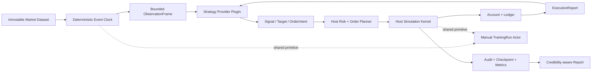

# CandleScope 回测系统详细执行方案

> 状态：`PHASE0_VALIDATED`。执行树：`codex/backtest-foundation` @
> `H:\program\CandleScope-backtest-foundation`。Phase 0 只冻结合同与可执行测试，
> 不注册回测路由或创建业务包。
>
> 编制基线：`main@5df19ae7`，2026-08-14。
>
> 关联开发树：`H:\program\CandleScope-local-offline`，
> `codex/local-offline-mode@d3c2fe37`。该分支相对当前 `main` 为 9 个独有提交、落后
> 189 个提交，且仍有本地重采样和插件包版本等混合未提交变更。不得直接整体合并。
>
> 执行原则：每个 Phase 单独建分支、实现、验证、提交和验收。未满足退出门禁时不得进入
> 下一 Phase；任何一次提交都必须可独立回滚。所有生产入口和高精度模式默认关闭。

## 0. 如何使用本文

本文不是概念说明，而是工程执行清单。每轮实施按以下顺序操作：

1. 从本阶段指定基线创建独立 worktree；
2. 只实现本阶段“任务”中的内容；
3. 执行本阶段“验证”及第 20 节的公共测试门禁；
4. 保存测试、性能、浏览器或回滚证据；
5. 对照“退出标准”逐项签字；
6. 以建议的提交粒度提交，不夹带其他工作树变更；
7. 下一阶段从已验收提交继续，不从脏工作树继续堆叠。

状态只允许使用：

- `NOT_STARTED`：未开始；
- `IMPLEMENTED_PENDING_VALIDATION`：实现完成，但证据不足；
- `VALIDATED`：本阶段门禁通过；
- `MERGED_LOCAL`：已合并到本地 `main`；
- `PUSHED`：已推送远端；
- `ROLLED_BACK`：已执行回滚。

“测试通过”不等于“已合并”，“本地合并”不等于“已推送”，“性能基准通过”也不等于
“生产入口已启用”。

## 1. 最终产品结论

CandleScope 应保留两个不同产品：

| 产品 | 主要用户 | 核心对象 | 谁做决策 | 主要目的 |
| --- | --- | --- | --- | --- |
| K 线回放训练 | 交易员 | `TrainingRun` | 人 | 训练观察、下单和复盘能力 |
| 策略回测研究 | 策略研究者 | `BacktestStudy` / `BacktestRun` | 策略提供器 | 发现、验证、比较和淘汰策略 |

两者不能合并成同一个业务对象或同一套页面状态。它们只复用以下底层能力：

- 不可变市场数据快照和数据质量证明；
- 无未来数据的确定性事件时钟；
- 撮合、订单、成交、费用、资金费、账户和账本原语；
- checkpoint、恢复、状态哈希和审计链；
- 图表、订单标记、权益曲线等只读展示组件；
- 报告中的交易明细与执行证据。

回测核心是 CandleScope Host 的第一方领域模块。插件不拥有市场真相、撮合、账户、绩效指标
或审计结果，只实现策略、脚本语言、模型推理或策略流水线中的可替换计算环节。



## 2. 不可破坏的系统约束

以下约束从 Phase 0 起就是硬门禁：

1. **无未来数据**：策略只能接收 `watermark` 及以前已经公开的数据；插件不能反向查询任意
   时间范围。
2. **宿主拥有执行真相**：插件输出建议，不得直接写订单、成交、持仓、余额或报告。
3. **同输入可重放**：同一数据快照、策略修订、参数、种子、引擎版本和配置必须得到相同的
   决策哈希、成交哈希、账本尾哈希及报告哈希。
4. **当前事件不能反向成交**：策略看到一个事件后新发出的市价单，最早只能在下一个符合
   条件的市场机会成交；禁止用刚看过的价格回填成交。
5. **精度如实标注**：BAR、聚合成交、逐笔成交、盘口辅助和队列级真相分别报告，不能把
   `aggTrade` 或 L2 快照宣传为完美市场回放。
6. **Decimal 记账**：价格、数量、费用、PnL、权益、资金费和保证金不使用二进制浮点作为
   权威值。
7. **不可变身份**：一次 Run 固定唯一 fidelity mode、`dataset_id + data_epoch/snapshot_hash`、
   策略 revision、模型 artifact、引擎版本和全部执行参数；运行中不得混合 BAR/成交模式或
   悄悄切换身份。
8. **参考路径权威**：任何向量化、批处理、快速跳转或 GPU 优化都必须与逐事件参考路径做
   哈希等价验证。
9. **失败关闭**：数据断口、协议越权、未知字段、模型漂移、插件重启后无法恢复、账本不平、
   哈希不一致时，Run 进入明确失败或暂停状态，不能用近似结果继续冒充成功。
10. **研究与上线隔离**：回测输出不能直接触发实盘；从策略研究到 paper/live 必须重新经过
    权限、风险、部署和观察流程。
11. **回放与回测隔离**：`TrainingRun` 的用户控制、隐藏时间、复盘笔记等状态不能污染
    `BacktestRun`；回测批任务也不能占用回放的交互会话配额。
12. **默认关闭**：后端入口、前端入口、成交模式、外部模型、在线学习、批量 Study 均独立
    flag，发布时保持 `0`。

## 3. 第一版范围与明确不做的内容

### 3.1 第一版必须交付

- 单市场、单账户、现货或线性合约中的一个已冻结账户模型；
- `BAR_APPROX` 回测，Pyne 策略适配器，参数化运行；
- Market/Limit/Stop/Stop-Limit 中经账户模型批准的订单集合；
- 手续费、滑点、最小价格步长、最小数量和名义价值约束；
- 可恢复后台 Run、订单/成交/账本、权益曲线和可信度报告；
- 数据、策略、配置、输出的哈希和版本链；
- 独立回测工作台，不复用回放业务 store；
- 明确的样本内/样本外区间和基础 Study 比较。

### 3.2 后续递进交付

- `TRADE_TAPE`；
- mark/index、资金费、动态交易规则；
- ONNX、本地 Python、受限外部 gRPC 模型；
- walk-forward、稳健性和多次试验校正；
- Pine strategy 语义；
- 多市场、组合级风险；
- `BOOK_ASSISTED`。

### 3.3 第一版明确不做

- 真实订单发送、券商或交易所实盘连接；
- 插件直接访问数据库、任意文件、任意网络或 secrets；
- 用普通 L2 快照模拟真实队列位置；
- 缺少逐笔委托/撤单/撮合数据时提供 `QUEUE_EXACT`；
- 用最终 K 线高低点推断唯一的 K 线内部路径；
- 无界参数穷举、自动找“最佳策略”后直接推荐上线；
- 运行中重新训练并覆盖原模型文件；
- 多节点分布式执行、云端调度和租户计费；
- 把回放训练记录自动当作量化策略训练标签。

## 4. 与现有系统的关系

本文与现有的[回放训练产品契约](KLINE_REPLAY_TRAINING_PRODUCT_CONTRACT_zh.md)、
[回放训练执行方案](KLINE_REPLAY_TRAINING_EXECUTION_zh.md)和
[通用插件平台 v2 执行方案](GENERAL_PLUGIN_PLATFORM_V2_EXECUTION_zh.md)并列，不覆盖其中已经冻结
的产品对象和插件安全边界。本地模式基线目前位于未合入 worktree 的
`docs/local-offline-mode.md`，应在 Phase 1 语义移植时一并更新，不能从该脏工作树直接复制结论。

### 4.1 与 K 线回放的关系

应从 `backend/app/replay` 提取或通过端口复用确定性原语，但不能让
`backend/app/backtest` 依赖训练页面、回放控制器或 `TrainingRun` 聚合。

建议边界：

| 能力 | 回放训练 | 回测 | 归属 |
| --- | --- | --- | --- |
| 不可变数据快照 | 使用 | 使用 | `market_dataset` 公共端口 |
| 虚拟事件时钟 | 用户控制 | Job 自动推进 | `simulation` 公共内核 |
| Paper broker/ledger | 人工订单 | 策略意图 | `simulation` 公共内核 |
| checkpoint/hash | 使用 | 使用 | `simulation` 公共内核 |
| 隐藏未来时间 | 产品能力 | 不适用 | replay only |
| 训练笔记/复盘 | 使用 | 不使用 | replay only |
| Study/参数扫描 | 不使用 | 使用 | backtest only |
| 统计检验 | 次要 | 核心 | backtest only |

第一阶段可以用 facade 包装现有 replay broker，等契约稳定后再把真正公共的纯领域代码移动到
`backend/app/simulation`。禁止先做大规模目录搬迁再验证行为。

回放与回测在产品层只通过显式、只读的“研究桥”结合：

1. **从回测进入盲训**：在某个已完成 BacktestRun 上选择一个窗口，创建引用相同不可变数据
   快照的 TrainingRun；训练结束前不显示策略决策、最终收益或未来事件；
2. **训练后对照**：TrainingRun 完成后，把人工订单、策略订单和统一基准投影到同一复盘时间轴，
   比较入场时机、风险暴露、MAE/MFE、费用和回撤；
3. **从训练生成研究问题**：人工交易轨迹可冻结为 `HumanDecisionTrace`，只作为比较基线或待标注
   样本，不能自动冒充可泛化 StrategyRevision；
4. **异常窗口进入训练库**：Study 找到高回撤、连续亏损、流动性恶化或策略分歧区间后，只保存
   数据窗口引用和原因标签，供训练员盲选；
5. **复盘后看策略解释**：策略 signal/reason/confidence 只能在训练揭盲后显示，避免把回测结果
   泄漏给手动训练；
6. **双向 fork 而非共享状态**：桥只创建带 provenance 的新对象；BacktestRun 与 TrainingRun
   永不共享可变订单、账户、cursor、checkpoint 或 UI store。

这条桥的价值是让量化策略成为训练员的可比较“陪练”，让人工失误成为新的研究假设，而不是
把自动回测和手动交易混成一个运行时。

### 4.2 与插件平台的关系

新增贡献点 `strategy-provider/1`，不修改现有 `candlescope.script-runtime/1` 的语义。

- `candlescope.script-runtime/1`：继续负责图表指标的 analyze / batch execute / Render IR；
- `strategy-provider/1`：面向确定性回测会话，接收有界观察并产生策略输出；
- Pyne/Pine/ONNX/Python/gRPC：是 provider adapter；
- BacktestService/SimulationKernel/ReportBuilder：永远属于 Host。

插件 v2 Host 只负责进程、协议、权限、限额和生命周期。回测领域适配器负责把公共 Provider
协议映射到 BacktestRun。插件平台不得导入 `app.backtest` 私有模型，Backtest 也不得直接
导入某个插件包。

### 4.3 与本地模式分支的关系

本地模式分支提供最有价值的数据底座：导入、质量、不可变 revision、项目包、离线计算和
向上整数倍重采样。但当前分支不能直接合并：它落后主线，且未提交变更混入插件 release
文件。

正确整合顺序：

1. 从当前 `main` 建 `codex/backtest-foundation` worktree；
2. 按提交语义移植本地模式 9 个独有提交，不做整枝 merge；
3. 把重采样变更整理成单独提交；
4. 排除 `official-plugin-releases.json`、插件 `pyproject.toml`、release lock、README 等
   与本地数据无关的噪声；
5. 跑 LOCAL_OFFLINE 启动、导入、质量、revision、package、resampling 全门禁；
6. 将本地 BAR 仓储适配到公共 `MarketDatasetSnapshotProvider`；
7. 只有该底座合入并稳定后，Backtest 核心才依赖它。

运行 profile 建议拆分：

| Profile | 启动内容 | 网络 |
| --- | --- | --- |
| `LOCAL_OFFLINE` | 本地查看、导入、质量、静态指标 | 严格禁用 |
| `LOCAL_RESEARCH` | `LOCAL_OFFLINE` + BacktestService + 受限策略 Host | 默认禁用；按 provider grant 精确开放 |
| `LIVE` | 现有在线行情与产品 | 保持现状 |

`LOCAL_OFFLINE` 不应因安装了回测而自动拉起插件 Host。用户显式进入本地研究工作台后才启用
`LOCAL_RESEARCH` 所需服务。

## 5. 目标模块与依赖方向

建议目标目录：

```text
backend/app/
├── market_dataset/
│   ├── models.py                 # DatasetRef、roles、provenance、quality
│   ├── ports.py                  # MarketDatasetSnapshotProvider
│   ├── snapshot.py               # 不可变快照与 canonical hash
│   └── adapters/
│       ├── local_bar.py
│       ├── replay_archive.py
│       └── trade_archive.py
├── simulation/
│   ├── clock.py                  # 确定性事件顺序
│   ├── events.py
│   ├── broker/
│   ├── account/
│   ├── ledger/
│   ├── checkpoint.py
│   └── canonical.py
├── backtest/
│   ├── models.py                 # Study、Run、Revision、Artifact
│   ├── service.py
│   ├── jobs.py
│   ├── repository.py
│   ├── schema.py
│   ├── integrity.py
│   ├── datasets.py
│   ├── strategy/
│   │   ├── protocol.py
│   │   ├── host_adapter.py
│   │   ├── pipeline.py
│   │   └── recovery.py
│   ├── execution/
│   │   ├── bar_model.py
│   │   ├── trade_model.py
│   │   ├── book_assisted.py
│   │   └── instrument_rules.py
│   ├── metrics/
│   │   ├── returns.py
│   │   ├── trades.py
│   │   ├── risk.py
│   │   └── robustness.py
│   └── reports/
│       ├── builder.py
│       ├── schemas.py
│       └── export.py
└── api/v1/
    ├── backtests.py
    └── stream_backtests.py

packages/candlescope-plugin-sdk/
└── strategy_provider_v1/

packages/candlescope-plugin-pyne/
└── strategy_provider/

frontend/src/features/backtest/
├── backtestApi.ts
├── backtestTypes.ts
├── backtestStore.ts
├── BacktestApp.tsx
├── pages/
├── components/
├── reports/
└── __tests__/
```

永久依赖规则：

```text
market_dataset <- 零 replay/backtest/plugin 私有依赖
simulation     <- market_dataset 的公共事件模型，不依赖 FastAPI/React/插件包
backtest       <- simulation + strategy provider port
replay         <- simulation facade；不导入 backtest
plugin_platform domain adapter -> backtest public port
specific plugin packages       -> public SDK only
api/main composition           -> 负责装配，不承载领域逻辑
```

架构测试必须拒绝：

- `app.simulation` 导入 `app.replay`、`app.backtest` 或 FastAPI；
- `app.backtest` 导入 `candlescope-plugin-pyne` 等具体包；
- 插件 SDK 导入任何 `app.*`；
- 前端 backtest store 导入 replay store；
- Provider 代码直接打开 CandleScope SQLite。

## 6. 市场数据快照契约

### 6.1 公共入口

```python
class MarketDatasetSnapshotProvider(Protocol):
    def open(self, ref: DatasetRef) -> MarketDatasetSnapshot: ...
```

`DatasetRef` 至少包含：

- `dataset_id`；
- `data_epoch` 或等价 immutable revision；
- `snapshot_hash`；
- `venue`、`market_type`、`symbol`；
- `start_time_ms`、`end_time_ms`；
- 请求的数据 role；
- 可选的 interval；
- `calendar_id`、时区规则版本；
- 来源和许可/留存策略标识。

`MarketDatasetSnapshot` 必须返回：

- canonical schema/version；
- 实际覆盖区间、行数、首尾序列；
- 每个 role 的内容 hash；
- gap、duplicate、out-of-order、invalid row 统计；
- 数据生成/导入 provenance；
- 精度能力声明；
- 只读、可重复迭代的事件游标；
- 关闭和资源释放接口。

### 6.2 数据 role

| Role | 内容 | BAR MVP | 成交版 | 完整合约版 |
| --- | --- | --- | --- | --- |
| `BARS` | OHLCV 与可选交易数/主动买量 | 必需 | 派生展示 | 可选 |
| `TRADES` | raw trade 或 aggTrade 事件 | 无 | 必需 | 必需 |
| `MARK_INDEX` | mark/index price | 可配置缺省 | 建议 | 合约必需 |
| `FUNDING` | 资金费率与结算事件 | 无 | 可选 | 合约必需 |
| `INSTRUMENT_RULES` | tick/step/minNotional/合约乘数 | 必需 | 必需 | 必需 |
| `ORDER_BOOK` | L2 snapshot/delta | 无 | 无 | `BOOK_ASSISTED` 必需 |
| `CUSTOM_FEATURES` | 已冻结、可审计的外部特征 | 可选 | 可选 | 可选 |

策略不得直接读取 snapshot provider。Backtest Host 根据 Provider 的 `InputPlan` 生成
`ObservationFrame`，并把可见性裁剪在当前 watermark。

### 6.3 数据质量硬门禁

Run 启动前必须完成：

- snapshot hash 与实际内容一致；
- 时间戳严格单调，允许的同毫秒 tie-break 已定义；
- interval、calendar、market identity 一致；
- 规则覆盖完整，或显式固定静态规则版本；
- gap policy 已选择：`REJECT`、`PAUSE` 或研究者明确批准的 `SKIP_WITH_WARNING`；
- 自定义特征记录其生成数据范围，拒绝包含 run 结束时间之后训练出的泄漏 artifact；
- BAR 重采样只允许源 interval 的更大整数倍，且只输出完整连续 bucket；
- 不得在线静默补数。

## 7. 回测精度等级与报告用语

| 模式 | 权威事件 | 能可靠回答 | 不能声称 | 报告标签 |
| --- | --- | --- | --- | --- |
| `BAR_APPROX` | 完结 OHLCV | bar-close 策略、低频近似 | K 线内部唯一顺序、精确止损/限价先后 | `APPROXIMATE` |
| `TRADE_TAPE` | raw trade | 实际成交打印顺序、下一打印机会 | 盘口深度、未成交挂单队列 | `TRADE_SEQUENCE` |
| `AGG_TRADE_TAPE` | 聚合成交 | 聚合打印序列 | raw trade、单笔微观顺序、队列 | `AGGREGATED_TRADE_SEQUENCE` |
| `BOOK_ASSISTED` | trade + 连续 L2 | spread、可见深度和冲击近似 | 自己的真实队列位置 | `BOOK_ASSISTED` |
| `QUEUE_EXACT` | 逐委托、撤单、撮合与优先级 | 队列级历史仿真 | 数据之外的隐藏流动性 | `ORDER_LEVEL_REQUIRED` |

产品页面和导出报告必须同时显示：

- `fidelity_mode`；
- `source_event_kind`，明确 raw/aggregate；
- data quality；
- fill model 与版本；
- ambiguity/warning 数；
- 未被建模的市场机制；
- “适合/不适合解释什么”。

## 8. 领域对象与不可变身份

### 8.1 StrategyRevision

一次可执行策略修订：

- `strategy_revision_id`；
- provider contribution ID 与 installation digest；
- source/artifact hash；
- 编译器、解释器或 runtime 版本；
- 参数 schema；
- `InputPlan`；
- output mode；
- state/reproducibility capabilities；
- 创建时间与来源；
- 可选父 revision。

源码可编辑，但 Run 只引用冻结 revision，永不引用“当前文件”。

### 8.2 ModelArtifact

- `model_artifact_id`；
- 格式：`ONNX`、`PYTHON_WHEEL`、`REMOTE_DESCRIPTOR` 等；
- artifact SHA-256 和可选签名；
- feature schema/version；
- 训练数据 snapshot 列表和最大可见时间；
- 训练代码 revision、seed、超参数；
- 运行环境锁和 opset；
- calibration/validation 摘要；
- 使用限制。

训练流程是：

```text
ModelTrainingJob -> immutable ModelArtifact -> StrategyRevision
                 -> BacktestStudy -> BacktestRun
```

回测期间不得覆盖 artifact。在线学习如后续启用，必须把初始 artifact、每次 update 输入、种子、
更新后 snapshot hash 全部记录，并单独标成 `ONLINE_LEARNING`，不能与普通确定性 Run 混淆。

### 8.3 BacktestStudy

管理一个研究问题，而不是一次执行：

- `study_id`、名称、假设、标签；
- 策略 revision；
- 数据 universe 与 interval；
- train/validation/test 或 walk-forward 切分；
- parameter search space；
- objective 和 guardrails；
- 最大 trials、并发、CPU/内存/时长预算；
- parent study / fork provenance；
- 状态与最佳候选，但不自动批准上线。

### 8.4 BacktestRun

一次 Run 启动后冻结：

- `run_id`、可选 `study_id/trial_id`；
- `strategy_revision_id`、`model_artifact_id`；
- `dataset_snapshot_hashes`；
- `fidelity_mode`；
- 起止时间、warmup 区间、评估区间；
- 参数 canonical JSON/hash；
- initial account、fee、slippage、fill、risk 配置及 hash；
- engine/schema versions；
- seed 与 reproducibility class；
- 状态、进度、watermark、checkpoint；
- warning/failure code；
- decision/fill/ledger/report hashes。

Run 状态机：

```text
DRAFT -> VALIDATING -> QUEUED -> PREPARING -> RUNNING
      -> PAUSING -> PAUSED -> RUNNING
      -> COMPLETING -> COMPLETED
      -> CANCELLING -> CANCELLED
      -> FAILED
```

`COMPLETED` 必须同时满足：事件耗尽、Provider 正常关闭、订单收尾策略完成、账本平衡、指标构建
成功、报告 hash 写入。仅仅 Job 退出不算完成。

## 9. Strategy Provider 公共协议

### 9.1 贡献点声明

建议 manifest 片段：

```json
{
  "id": "pyne-strategy",
  "kind": "strategy-provider/1",
  "entrypoint": "pyne-workbench",
  "activationEvents": ["onBacktestRun"],
  "capabilities": {
    "inputModes": ["BAR_CLOSE"],
    "outputModes": ["SIGNAL", "TARGET_POSITION"],
    "stateModes": ["SESSION_STATEFUL"],
    "reproducibility": ["DETERMINISTIC", "SEEDED"],
    "snapshotRestore": true,
    "maxBatchObservations": 1
  },
  "permissions": [
    {
      "capability": "backtest.observations.consume",
      "scope": {"roles": ["BARS"], "maxSymbols": 1}
    }
  ]
}
```

Provider 不申请 `market-data.query` 来任意拉取历史。Host 只按照已批准的 `InputPlan` 推送观察。

### 9.2 能力维度

| 维度 | 值 |
| --- | --- |
| input | `BAR_CLOSE`、`TRADE_EVENT`、`BOOK_EVENT` |
| output | `SIGNAL`、`TARGET_POSITION`、`ORDER_INTENT` |
| state | `STATELESS`、`SESSION_STATEFUL`、`ONLINE_LEARNING` |
| reproducibility | `DETERMINISTIC`、`SEEDED`、`RECORDED_OUTPUT_ONLY` |

推荐策略流水线：

```text
SignalModel -> PortfolioPolicy -> RiskPolicy -> OrderPlanner -> Host validation
```

神经网络通常只输出 score、direction、confidence、horizon 或 target exposure。不要强迫模型
理解交易所订单细节。只有明确声明 `ORDER_INTENT` 的 provider 才能给出订单意图，最终仍由 Host
做 instrument rule、风险和资金校验。

### 9.3 生命周期

Host 到 Provider 的方法：

1. `describe`：协议、schema、能力、资源要求；
2. `prepare`：下发冻结的 RunContext、InputPlan、参数和 artifact handle；
3. `warmup`：投递评估区间之前的有界数据，输出默认不交易；
4. `step`：投递一个有序 `ObservationFrame`；
5. `onExecutionReport`：返回上一批意图的接受、拒绝、成交和账户摘要；
6. `snapshot`：生成有界、版本化的 provider state blob/hash；
7. `restore`：在相同 installation/artifact/runtime 上恢复；
8. `close`：结束并返回最终状态 hash。

协议要求：

- 每个调用带 `runId`、`providerSessionId`、`generation`、`sequence`、`watermark`；
- 响应必须回显 sequence 和 generation；迟到或旧 generation 响应丢弃并审计；
- JSON 拒绝 duplicate key、NaN、Infinity、未知 required field；
- 每步输入和输出都 canonical hash；
- 超时不能静默重试非幂等 step；
- 恢复只能从已确认 checkpoint 的 provider snapshot + engine snapshot 开始；
- 无 snapshot/restore 能力的 Provider 崩溃时，Run 只能从头重跑或失败；
- `RECORDED_OUTPUT_ONLY` 结果可审计重放，但不声称环境可重新计算相同结果。

### 9.4 ObservationFrame

最少字段：

```json
{
  "schemaVersion": "candlescope.observation/1",
  "runId": "bt_...",
  "sequence": 1042,
  "eventTimeMs": 1760000000000,
  "watermarkMs": 1760000000000,
  "phase": "EVALUATION",
  "market": {"venue": "...", "symbol": "...", "marketType": "..."},
  "bar": null,
  "trade": null,
  "book": null,
  "features": {},
  "accountView": {},
  "pendingOrdersView": [],
  "inputHash": "sha256:..."
}
```

只填充当前 input mode 允许的市场字段。`accountView` 是 Host 生成的只读公共投影，不泄露
内部对象或数据库 ID。

### 9.5 策略输出

三种输出统一封装：

```json
{
  "schemaVersion": "candlescope.strategy-output/1",
  "sequence": 1042,
  "kind": "TARGET_POSITION",
  "payload": {
    "symbol": "BTC-USDT-SWAP",
    "targetExposure": "0.50",
    "confidence": "0.73",
    "horizonEvents": 12,
    "reasonCode": "trend_breakout"
  },
  "stateHash": "sha256:...",
  "outputHash": "sha256:..."
}
```

- `SIGNAL`：方向/分数/置信度/预测期；由 Host pipeline 转换；
- `TARGET_POSITION`：目标仓位或风险暴露；由 Host 规划差量订单；
- `ORDER_INTENT`：side/type/qty/limit/stop/TIF/client tag；Host 可拒绝或改为规范化数量。

Host 返回 `ExecutionReport`，包含 intent 关联、接受/拒绝原因、规范化订单、fills、fees、
position/account delta、ledger tail hash 和 warning。Provider 不能把“意图已发出”当成“已成交”。

## 10. 确定性事件顺序与无前视规则

### 10.1 通用单事件顺序

每个市场事件按固定次序执行：

1. 从不可变 snapshot 读取下一个事件并验证 sequence；
2. 应用该事件的市场状态变化，包括 mark/funding/rules；
3. 用当前事件处理事件到来之前已存在的 pending orders；
4. 更新聚合 K 线并关闭所有在 watermark 处完成的 bar；
5. 生成仅包含 watermark 以前信息的 `ObservationFrame`；
6. 调用 Provider，验证 generation/sequence/hash/schema/资源预算；
7. 将输出经 Portfolio/Risk/OrderPlanner 转换为订单意图；
8. Host 校验 instrument rules、资金、reduce-only、限额并入队；
9. 新订单标记 `eligible_after_sequence = current_sequence + 1`；
10. 写 decision、order、execution report、account/ledger delta；
11. 按策略写 checkpoint，并更新 run progress/hash chain。

第 3 步在策略决策之前，因此旧挂单可以被当前事件成交；第 9 步确保新订单不能反向使用已经
观察到的事件成交。

### 10.2 BAR_APPROX

BAR 模式的默认决策点为 bar close。下一根 bar 才是新订单的最早成交区间。

必须冻结 `bar_fill_policy`：

- 市价单：下一根 bar open 加滑点；
- 限价单：下一根及后续 bar 穿价才可能成交；
- stop：下一根及后续 bar 触发；
- 同一 bar 内 stop/target 都可达：默认 `WORST_CASE`，并记录 ambiguity；
- gap 穿越：按冻结的 gap policy；
- volume participation：未启用时报告为未建模；启用时限制本订单占 bar volume 的比例。

可选的 OHLC 路径假设只能作为 scenario：`O-H-L-C`、`O-L-H-C`、`WORST_CASE`。报告不得把
任一假设写成历史事实。一个可信报告至少给出 worst-case ambiguity 数，后续可同时运行上下界。

### 10.3 TRADE_TAPE

- 原始事件按 `(event_time_ms, source_sequence, stable_tie_break)` 排序；
- 已有订单可在当前 incoming trade 上匹配；
- 当前事件后发出的订单最早匹配下一事件；
- market 单不能凭空以 midpoint 成交；
- 无盘口时，limit fill 只能依据打印穿越和冻结的保守成交规则；
- aggTrade 保留聚合边界，不能拆成虚构 raw trades；
- 数据 gap、sequence reset 或 source kind 改变必须暂停或失败。

### 10.4 BOOK_ASSISTED

- 需要可证明连续的 book snapshot + delta 链；
- snapshot reset 后必须重新同步，gap 期间停止执行；
- 可用于估算 spread、可见深度和 market impact；
- 默认不假设自己的队列位置；limit fill 仍使用保守模型；
- 页面明确显示“盘口辅助，不是队列精确”。

## 11. 账户、订单、撮合与风险模型

首个账户模型必须单独写产品契约，建议先选一个：

- 现货 long-only；或
- 单向持仓的线性永续。

不能同时做多个市场模型却共享模糊字段。账户契约至少冻结：

- base/quote、合约乘数、position mode；
- quantity/price/notional 精度；
- maker/taker fee 和计算基数；
- initial/maintenance margin；
- unrealized PnL 的 mark 来源；
- funding 时间和公式；
- liquidation、bankruptcy 和保险基金是否建模；
- reduce-only、post-only、TIF 语义；
- partial fill、cancel/replace、reject；
- 滑点和市场冲击模型；
- 多币种换算和缺失 FX 的处理。

所有订单、成交和账本记录均 append-only。更正只能追加 compensating record，不能改历史行。
每次账户变化后验证：

- 借贷平衡；
- 可用余额不为非法负数；
- position 与 fills 汇总一致；
- realized/unrealized/fees/funding 对账；
- equity 与 ledger projection 一致；
- `ledger_tail_hash` 链连续。

## 12. SQLite 持久化方案

Backtest 使用独立数据库，默认 `data/backtest.db`，不得与 K 线、replay 或插件 registry 共用
文件。建议表结构：

| 表 | 核心字段 | 关键索引/约束 |
| --- | --- | --- |
| `backtest_schema_meta` | schema_version, migrated_at | 单行版本 |
| `strategy_revisions` | id, provider_id, install_digest, source_hash, capability_json, created_at | source hash；immutable |
| `model_artifacts` | id, format, artifact_hash, feature_schema_hash, training_provenance_json | artifact hash unique |
| `backtest_studies` | id, strategy_revision_id, config_json/hash, state, created_at | state, created_at |
| `backtest_trials` | id, study_id, ordinal, params_json/hash, split_id, run_id | unique(study_id, ordinal) |
| `backtest_runs` | id, study_id, state, fidelity, config_hash, dataset_hash, engine_version, watermark, progress | state/created_at；immutable config |
| `backtest_run_datasets` | run_id, role, dataset_id, data_epoch, snapshot_hash, window | unique(run_id, role, symbol) |
| `backtest_events` | run_id, sequence, kind, event_time, payload_hash, chain_hash | PK(run_id, sequence) |
| `backtest_decisions` | run_id, sequence, input_hash, output_hash, provider_state_hash, payload | unique(run_id, sequence) |
| `backtest_orders` | run_id, order_id, intent_sequence, normalized fields, state | unique(run_id, order_id) |
| `backtest_fills` | run_id, fill_id, order_id, source_sequence, price, qty, fee | source sequence/order |
| `backtest_ledger` | run_id, entry_seq, debit, credit, amount, prev_hash, entry_hash | PK(run_id, entry_seq) |
| `backtest_positions` | run_id, sequence, symbol, projection fields | run/symbol/sequence |
| `backtest_equity_points` | run_id, sequence, event_time, equity, drawdown | run/event_time |
| `backtest_checkpoints` | run_id, sequence, engine_blob, provider_blob, state_hash | unique(run_id, sequence) |
| `backtest_metrics` | run_id, metric_schema, metrics_json/hash | unique(run_id, schema) |
| `backtest_reports` | run_id, report_schema, report_json/hash, generated_at | unique(run_id, schema) |
| `backtest_warnings` | run_id, sequence, code, severity, details_json | run/code |
| `backtest_job_leases` | run_id, owner, generation, expires_at | lease expiry |
| `backtest_audit` | run_id, ordinal, action, actor, details_hash, chain_hash | PK(run_id, ordinal) |

数据库规则：

- migrations 前备份并执行 schema compatibility 探针；
- WAL、busy timeout 和单 Run 单 writer；
- payload 大对象有上限，必要时写 content-addressed artifact store，数据库只存 hash/path；
- checkpoint 先写临时对象并校验 hash，再在同一事务发布引用；
- resume 只读取最后一个完整 checkpoint；
- 删除使用 tombstone + 延迟 GC；报告及审计保留策略独立；
- API 不返回内部文件路径或 provider blob。

## 13. 后端 API 与任务契约

统一前缀 `/api/v1/backtests`。

### 13.1 策略与数据能力

| 方法 | 路径 | 用途 |
| --- | --- | --- |
| GET | `/capabilities` | Host、fidelity、Provider、账户模型能力 |
| GET | `/datasets` | 可用于回测的不可变数据快照 |
| GET | `/strategies` | 已激活的 Strategy Provider/Revision |
| POST | `/strategies/revisions` | 冻结 source/artifact/config 为 revision |
| GET | `/strategies/revisions/{id}` | revision 与 reproducibility 详情 |

### 13.2 Run

| 方法 | 路径 | 用途 |
| --- | --- | --- |
| POST | `/runs/validate` | 纯验证；返回数据、策略、账户、预算问题 |
| POST | `/runs` | 以 idempotency key 创建 Run |
| GET | `/runs` | 分页筛选 |
| GET | `/runs/{id}` | 状态、进度、身份、warning 摘要 |
| POST | `/runs/{id}/pause` | 请求在安全边界暂停 |
| POST | `/runs/{id}/resume` | 从完整 checkpoint 恢复 |
| POST | `/runs/{id}/cancel` | 可撤销取消；不删除审计 |
| POST | `/runs/{id}/fork` | 复制冻结身份，显式修改允许字段 |
| GET | `/runs/{id}/orders` | 分页订单 |
| GET | `/runs/{id}/fills` | 分页成交 |
| GET | `/runs/{id}/equity` | 降采样权益曲线 |
| GET | `/runs/{id}/report` | 可信度报告 |
| GET | `/runs/{id}/export` | JSON/CSV bundle，带 manifest/hash |
| POST | `/runs/{id}/verify` | 重算 hash/ledger/report 一致性 |

### 13.3 Study

| 方法 | 路径 | 用途 |
| --- | --- | --- |
| POST | `/studies/validate` | 检查搜索空间和预算 |
| POST | `/studies` | 创建 Study |
| GET | `/studies/{id}` | trial 状态、OOS 分组、预算 |
| POST | `/studies/{id}/start` | 启动作业 |
| POST | `/studies/{id}/cancel` | 停止创建新 trial，安全收尾运行中 trial |
| GET | `/studies/{id}/compare` | 同口径比较 |

### 13.4 WebSocket/SSE

`/api/v1/stream/backtests/{run_id}` 只推增量控制事件：

- `RUN_STATE`；
- `PROGRESS`；
- `WARNING`；
- `CHECKPOINT`；
- `ACCOUNT_DELTA`；
- `ORDER_DELTA`；
- `REPORT_READY`；
- `TERMINAL`。

大订单表、成交表和权益历史仍走分页 HTTP。连接断开后用 `afterSequence` 补投；超过保留窗口
返回 `RESYNC_REQUIRED`，前端重新拉快照。断开浏览器不能取消后台 Run。

所有 mutation 接口使用 idempotency key、预期 state/generation 和结构化错误码。禁止用自由文本
解析状态。

## 14. 前端回测工作台

独立入口建议为 `/backtest.html` 或主应用中的独立研究路由，但其 feature store 和运行时必须与
replay 分离。

### 14.1 页面结构

1. **研究首页**：Studies、最近 Runs、状态、标签、可信度摘要；
2. **新建 Run 向导**：策略 -> 数据 -> 区间 -> 账户/执行 -> 参数 -> 验证 -> 启动；
3. **Run 监控页**：进度、watermark、Provider、资源、warnings，可暂停/取消；
4. **结果页**：总览、权益/回撤、交易、订单/成交、月度、风险、可信度、审计；
5. **比较页**：相同 OOS 口径下比较多个 Run/Trial；
6. **策略修订页**：源码/artifact hash、参数 schema、能力、历史 Runs；
7. **数据详情页**：snapshot、roles、覆盖、gap、quality、fidelity 能力。

### 14.2 关键组件

- `BacktestRunWizard`；
- `DatasetSnapshotPicker`；
- `StrategyRevisionPicker`；
- `ExecutionModelEditor`；
- `RunValidationPanel`；
- `RunProgressPanel`；
- `CredibilityBanner`；
- `EquityDrawdownChart`；
- `TradeDistributionPanel`；
- `OrderFillTable`；
- `AmbiguityInspector`；
- `ReproducibilityPanel`；
- `StudyTrialMatrix`；
- `RunComparisonTable`。

图表可复用现有市场页面和 replay 的纯展示组件，但数据适配层新建。不得导入 replay controller、
隐藏时间、训练笔记或 paper order CTA。

### 14.3 UX 硬要求

- 启动前展示验证结果，红色错误不可绕过；
- `BAR_APPROX` 始终显示近似标签；
- aggTrade 始终显示“聚合成交”；
- 报告顶部优先显示可信度和 OOS，再显示收益；
- 失败 Run 保留已完成进度、失败码和可导出诊断；
- “最佳”只表示用户选定 objective 下的结果，不显示“建议实盘”；
- 删除 Study/Run 前说明保留与可恢复性；
- 页面刷新、断网、前端崩溃不影响后台 Run。

## 15. 报告、指标与可信度

### 15.1 报告固定分区

1. **身份**：Run/Study、策略 revision、artifact、数据 snapshots、引擎/模型版本、参数 hash；
2. **可信度**：fidelity、quality、gap、ambiguity、未建模机制、reproducibility；
3. **收益风险**：总收益、年化仅在口径成立时、最大回撤、波动、Sharpe/Sortino 及公式版本；
4. **交易**：次数、胜率、平均盈亏、profit factor、期望、持有时长、MAE/MFE；
5. **执行**：订单/成交/拒绝、费用、滑点、换手、volume participation、资金费；
6. **暴露**：gross/net exposure、仓位集中度、空仓比例；
7. **时间切片**：日/月/年、市场 regime、样本内/验证/样本外；
8. **稳健性**：参数邻域、成本压力、延迟压力、不同起点；
9. **审计**：warning、checkpoint、hash chain、重放验证结果。

### 15.2 指标原则

- 每个指标有 `metric_schema_version`、公式、频率、无风险利率和 annualization 假设；
- 无足够样本时返回 `null + reason`，不能返回误导性的 0；
- 现金流、资金费和费用必须进入权益曲线；
- Sharpe 不适用于任意不规则事件收益，必须先冻结采样规则；
- 成交不足、回测窗口过短、单笔收益主导时给 warning；
- 只在独立 OOS 或 walk-forward 汇总中给研究结论；
- Study 记录试验总数，后续引入 Deflated Sharpe Ratio 或等价多重试验校正；
- 比较多个 Run 时先验证数据窗口、成本、账户、fidelity 和指标 schema 可比。

### 15.3 可信度分级

报告可以给结构化等级，但不能把它包装成盈利保证：

| 等级 | 最低条件 |
| --- | --- |
| `RESEARCH_ONLY` | BAR 近似或缺少关键成本/规则 |
| `REPRODUCIBLE_RESEARCH` | 哈希可复验、成本完整、OOS 明确 |
| `MICROSTRUCTURE_AWARE` | trade sequence 且 mark/rules/funding 完整 |
| `BOOK_ASSISTED_RESEARCH` | 连续 L2 通过，但仍非 queue exact |

任何 hard warning 都可以降低等级。产品不提供“可直接实盘”等级。

## 16. 性能、并发与资源预算

BAR 与成交回测是不同工作负载，必须分别定门禁：

- BAR：bar 数 × 指标/策略计算成本；
- Trade：event 数 × pending order/account/ledger 成本；
- Book：event 数 × book 更新与冲击模型成本；
- Study：单 Run 成本 × trials，并受共享资源限制。

实现顺序：

1. 逐事件 reference path；
2. 真实 SQLite + Decimal + 有持仓/订单工作负载的基准；
3. 增量 orders/fills/ledger/hash；
4. 缓存 instrument rules 和账户汇总；
5. 同 clock 的有界批量写；
6. Provider 批处理仅在协议声明支持且保持顺序语义时启用；
7. 向量化/快速跳转作为 accelerator，并持续做 hash equivalence。

禁止优化：

- 把 Decimal 权威账户换成 float；
- 跳过逐笔 liquidation/funding/stop 语义；
- 多线程并发修改同一账户；
- 用期末价直接算替代订单生命周期；
- 因基准困难而放宽数据 gap 或 no-lookahead；
- 用空订单基准代表真实策略工作负载。

初始安全预算建议作为 Phase 0 冻结项，而非直接采用以下示例：

```text
BACKTEST_MAX_ACTIVE_RUNS
BACKTEST_MAX_QUEUED_RUNS
BACKTEST_MAX_EVENTS_PER_RUN
BACKTEST_MAX_WARMUP_EVENTS
BACKTEST_MAX_RUNTIME_SECONDS
BACKTEST_PROVIDER_STEP_TIMEOUT_MS
BACKTEST_PROVIDER_MEMORY_MB
BACKTEST_CHECKPOINT_EVENT_INTERVAL
BACKTEST_CHECKPOINT_VIRTUAL_MS
BACKTEST_MAX_STUDY_TRIALS
BACKTEST_MAX_STUDY_CONCURRENCY
```

每个值都只允许从冻结上限向下收紧，环境变量不能突破上限。

## 17. 插件、模型与安全边界

### 17.1 默认权限

Strategy Provider 默认只得到：

- 当前 Run 的有界 ObservationFrame；
- 自己的只读 artifact handle；
- 自己命名空间的有界临时/持久状态；
- Host 提供的日志与 metric sink；
- snapshot/restore 输出通道。

默认没有：

- CandleScope 数据库或源码路径；
- 任意历史数据查询；
- 账户 secrets；
- live order executor；
- 任意网络；
- 任意本地文件；
- UI 主 realm 或 DOM；
- 启动子进程的产品权限。

### 17.2 外部模型

- **ONNX**：优先的可复现本地推理 adapter；冻结 opset、runtime、线程数和预处理；
- **Python wheel**：独立 venv/sidecar、wheel-only、锁定依赖、资源限额；
- **gRPC/HTTP 模型**：后置；域名 allowlist、TLS、timeout、request hash、response capture；
- **GPU**：设备/runtime/driver 信息写报告；非确定性算子则降为 `RECORDED_OUTPUT_ONLY`；
- **在线学习**：独立高风险 flag，记录每次更新，不允许覆盖初始 artifact。

远程 provider 可能改变或下线，因此其可信结果必须保存完整、脱敏后的输入输出证据；无法证明
重新计算等价时只能归类为 recorded-output replay。

### 17.3 资源与故障

- 每个 Run 独立 provider session 和 generation；
- CPU、内存、消息大小、in-flight、stderr、wall-clock 有界；
- 超时/崩溃进入熔断；
- checkpoint 必须同时包含 engine 和 provider state；
- 插件升级不影响进行中的 Run；Run 固定 installation digest；
- 缺失旧 installation 时旧 Run 仍可读报告，但不能声称可重算；
- cancel 先停止新 step，再等待有界 in-flight，最后安全关闭。

## 18. 分阶段执行计划

每个 Phase 只在上一阶段 `VALIDATED` 后开始。

### Phase 0：基线清理与契约冻结

**目标**：建立干净执行树，冻结第一版账户、数据、Provider、事件顺序和报告契约。

**任务**：

1. 保存当前 main/local worktree 状态和 diff 清单；
2. 从当前 main 建 `codex/backtest-foundation` 独立 worktree；
3. 新增 product contract、ADR、schema 草案和测试矩阵；
4. 冻结第一版账户模型、BAR fill policy、错误码、feature flags 与资源上限；
5. 写 no-lookahead、determinism、fidelity 的 executable contract tests；
6. 建 release evidence 目录和 manifest schema。

**建议文件**：

- `docs/BACKTEST_PRODUCT_CONTRACT_zh.md`；
- `docs/adr/ADR-BACKTEST-*.md`；
- `backend/tests/backtest_contract/`；
- `docs/perf-baselines/backtest/README.md`。

**验证**：架构测试先以预期失败证明缺失实现；文档中的 enum/schema 与测试 fixture 一致；干净
worktree 不包含用户现有脏变更。

**退出标准**：产品、架构、数据、执行、账户、精度和发布负责人均接受契约；所有未决问题有
明确 owner，不存在会改变 Phase 1 数据接口的开放问题。

**建议提交**：`docs(backtest): freeze product and execution contracts`。

**回滚**：删除新 worktree/分支即可，不触碰 main 和 local worktree。

### Phase 1：整合本地不可变数据底座

**目标**：把本地模式的数据管理能力安全移植到当前主线，并形成公共 snapshot port。

**任务**：

1. 逐提交语义移植本地模式 9 个独有提交；
2. 清除插件 release/package 版本噪声；
3. 单独整理和提交整数倍向上重采样；
4. 新建 `app.market_dataset` 公共模型与端口；
5. 为本地 BAR 实现 adapter；
6. 输出 dataset snapshot hash、quality、provenance；
7. 保持 `LOCAL_OFFLINE` 不启动 replay/plugin/backtest。

**验证**：CSV/import idempotency、quality、revision 切换、`.csproject` round-trip、恶意 package
拒绝、重采样 gap/partial/misalignment、offline 零网络、重启持久化、现有 live 回归。

**退出标准**：BAR snapshot 可被只读重复打开；相同 revision hash 相同；不偷偷联网；原始 local
功能和 main 现有功能均通过。

**建议提交**：

1. `feat(local): port immutable local data foundation`；
2. `feat(local): add deterministic upward resampling`；
3. `feat(data): expose immutable market dataset snapshots`。

**回滚**：每个提交独立 revert；profile 默认仍为 LIVE/现有行为，未启用 backtest。

### Phase 2：Backtest 领域、数据库与 API 骨架

**目标**：Run/Study 可创建、验证、排队、查询和取消，但不执行市场策略。

**任务**：

1. 实现领域对象、状态机、错误码和 canonical config hash；
2. 新建独立 `backtest.db` migrations/repository；
3. 实现 job lease、幂等创建、取消和崩溃恢复扫描；
4. 实现 capabilities、validate、runs/studies 基础 API；
5. 加严格 settings 与默认关闭 flags；
6. main 只做条件装配和 shutdown。

**验证**：迁移/降级兼容、并发幂等、非法状态转换、lease 过期、重启恢复、数据库路径隔离、所有
flags 为 0 时零路由/零 worker/零 DB 副作用。

**退出标准**：空 Run 的完整控制面可测试；任何异常均结构化失败；现有 replay/plugin/live 启动
不受影响。

**建议提交**：`feat(backtest): add fail-closed run control plane`。

**回滚**：关 flag，停止 worker；数据库保留可读，不自动删除。

### Phase 3：Strategy Provider/1 插件协议

**目标**：建立语言无关、Host 推送、可恢复的策略协议。

**任务**：

1. SDK 新增 models、validation、canonical encoding 和 conformance fixtures；
2. 插件平台新增 `strategy-provider/1` contribution kind；
3. 实现 backtest domain adapter、session generation、timeout/quotas；
4. 实现 describe/prepare/warmup/step/report/snapshot/restore/close；
5. 提供 deterministic fake provider 和 crash/timeout provider；
6. 写协议文档和兼容矩阵。

**验证**：未知字段、NaN、重复 key、乱序响应、旧 generation、超时、崩溃、snapshot 不兼容、
越权数据请求全部 fail closed；同 fixture hash 一致。

**退出标准**：Fake Provider 能在无执行内核下完整走会话；插件不能拉未来数据或写 Host 状态；
v1 script runtime 无行为变化。

**建议提交**：`feat(plugin-sdk): add strategy provider protocol v1`。

**回滚**：取消 contribution registration；不影响已冻结 v1 runtime。

### Phase 4：确定性 SimulationKernel 与 BAR MVP

**目标**：完成最小可信的单市场 BAR 回测 reference path。

**任务**：

1. 以 facade 复用 replay broker/ledger，或提取纯领域原语；
2. 实现事件时钟、watermark、warmup/evaluation 边界；
3. 实现已冻结的账户和订单模型；
4. 实现 BAR fill policy、fees、slippage、instrument rules；
5. 实现 decision/order/fill/ledger hash chain；
6. 实现 checkpoint + resume；
7. 把 Run worker 接到 Provider。

**验证**：golden scenarios 覆盖 long/flat、limit/stop、gap、同 bar 止盈止损、partial/reject、费用、
破产边界；新订单不能在当前已观察 bar 成交；重跑/暂停恢复/进程重启 hashes 相同；账本平衡。

**退出标准**：一个 fake 策略能从 immutable BAR snapshot 产出可复验完成 Run；所有 ambiguity
进入 warning；没有前端也能通过 API 导出证据。

**建议提交**：`feat(backtest): execute deterministic bar backtests`。

**回滚**：关 `BACKTEST_BAR_ENABLED`；保留控制面和历史报告只读。

### Phase 5：Pyne Strategy Provider 适配器

**目标**：让 Pyne 策略通过新协议运行，不改变现有图表 runtime。

**任务**：

1. 在 `candlescope.pyne-workbench` 增加 strategy provider entrypoint；
2. 冻结 Pyne strategy API、参数、bar-close 语义；
3. 将 Pyne 输出映射到 SIGNAL/TARGET_POSITION；
4. 实现 seed、session state、snapshot/restore；
5. 记录 pyne-runtime、adapter、wheel 和 source hash；
6. 提供示例策略和 golden fixtures。

**验证**：现有 `candlescope.pyne` v1 indicator tests 零回归；相同脚本 batch/reference 与 session
结果一致；语法/runtime 错误结构化；provider crash 恢复；wheel 隔离安装。

**退出标准**：Pyne BAR strategy 完成端到端 Run，且 provider 不生成 Host 成交、不能调用 live。

**建议提交**：`feat(pyne): add isolated backtest strategy provider`。

**回滚**：停用 workbench contribution；图表 Pyne v1 保持可用。

### Phase 6：结果报告与前端 MVP

**目标**：用户能配置、运行、监控、检查和导出 BAR 回测。

**任务**：

1. 实现报告 schema/metrics/export；
2. 新建独立 backtest frontend feature/store；
3. 实现 Run wizard、validation、monitor、result；
4. 展示订单/成交、权益/回撤、ambiguity、identity/hash；
5. 实现断线重连和 `RESYNC_REQUIRED`；
6. 浏览器导出 manifest + JSON/CSV。
7. 在独立 flag 后实现只读研究桥：回测窗口可创建盲训，已完成训练可与策略结果对照。

**验证**：真实页面创建到报告闭环；刷新/断网不取消 Run；大表分页；失败诊断；导出重验；
BAR 近似标签无法隐藏；零 console error；前端不能导入 replay store；研究桥在训练揭盲前不返回
策略决策/收益，且只创建新对象、不共享可变状态。

**退出标准**：BAR + Pyne 形成用户可用但默认关闭的 MVP；盲测用户能解释报告局限。

**建议提交**：`feat(backtest): add bar research workbench and reports`。

**回滚**：关前端入口和 API flag；历史报告仍可通过管理工具读取。

### Phase 7：TRADE_TAPE / AGG_TRADE_TAPE

**目标**：按实际打印序列驱动回测，并如实区分 raw 和 aggregate。

**任务**：

1. 为 replay trade archive 实现 dataset adapter；
2. 冻结 tie-break、gap、market/limit 成交规则；
3. 实现 trade reference loop；
4. 支持 bar 聚合仅作为观察特征；
5. 加 trade workload checkpoint/backpressure；
6. 报告 source event kind 与不支持的队列语义。

**验证**：原始/聚合 fixture 不混淆；下一事件成交规则；pending order 当前事件成交；gap/reset
阻断；百万事件有仓位/订单真实路径基准；checkpoint resume hash 相同；BAR 与 trade 不共用虚假门槛。

**退出标准**：达到 Phase 0 冻结的真实路径性能门；报告不出现“完美/队列精确”。

**建议提交**：`feat(backtest): add trade-sequence execution mode`。

**回滚**：关 `BACKTEST_TRADE_TAPE_ENABLED`，BAR 不受影响。

### Phase 8：Mark、Funding 与动态交易规则

**目标**：使线性合约账户结果在历史规则和结算上可信。

**任务**：

1. 增加 `MARK_INDEX/FUNDING/INSTRUMENT_RULES` adapters；
2. 在统一 event order 中加入生效顺序；
3. 实现 mark-to-market、funding ledger、规则变更；
4. 冻结缺失/重复结算处理；
5. 报告规则覆盖率和 fallback。

**验证**：结算边界、同毫秒 tie-break、规则切换前后、liquidation、funding 对账、缺 mark/funding
阻断、恢复等价。

**退出标准**：目标合约模型不再依赖今天的交易规则解释历史；账本和报告完整对账。

**建议提交**：`feat(backtest): model historical contract accounting`。

**回滚**：关闭 contract mode；不允许自动退化成 BAR 静态规则并继续标成功。

### Phase 9：ONNX、本地 Python 与外部模型适配器

**目标**：支持非脚本模型，同时保持相同 Provider 边界。

**任务**：

1. ONNX adapter + feature schema validator；
2. wheel-only Python sidecar adapter；
3. 后置实现受限 gRPC adapter；
4. artifact registry/provenance；
5. deterministic/seeded/recorded-output 分类；
6. GPU/remote evidence 记录。

**验证**：feature 缺失/错序拒绝；artifact hash；无网默认；域名越权拒绝；远程 timeout；响应
capture；GPU 非确定性降级；模型输出仍需 Host 风险校验。

**退出标准**：至少 ONNX 与本地 Python 各有端到端 fixture；所有报告能说明可复现等级。

**建议提交**：按 adapter 分提交，禁止一次性启用所有高风险能力。

**回滚**：逐 adapter 撤销 grant/activation；已保存 Run 保持只读。

### Phase 10：Study、参数搜索与 Walk-forward

**目标**：从单次回测升级为受预算约束的研究流程。

**任务**：

1. Study/trial scheduler；
2. grid/random 等确定性 sampler；
3. train/validation/test 与 walk-forward 切分；
4. trial budget、并发、取消、公平调度；
5. 同口径比较、稳健性、成本/延迟压力；
6. 记录 trial count 和选择偏差警告。

**验证**：sampler seed；不重叠/不泄漏切分；取消不启动新 trial；并发结果与串行一致；预算不能
突破；比较拒绝不兼容 Run；OOS 排名不使用训练区间。

**退出标准**：Study 可重复生成相同 trials；报告把 in-sample 最佳与 OOS 结果分开。

**建议提交**：`feat(backtest): add budgeted walk-forward studies`。

**回滚**：关 Study flag；单 Run 继续可用。

### Phase 11：Pine Strategy 语义

**目标**：在已冻结的 Pine 兼容范围内支持 strategy，而不是把 indicator 输出猜成交易。

**任务**：

1. 先写 Pine strategy compatibility matrix；
2. 明确 barstate、order、pyramiding、commission、calc timing；
3. 实现 Pine adapter 到 Provider 输出；
4. 对不支持语义静态拒绝；
5. 与公开、合法的小型 golden corpus 对照。

**验证**：indicator v1 零回归；unsupported fail closed；订单时序/no-lookahead；同脚本相同 hash；
不声称完整 TradingView 等价。

**退出标准**：只对 compatibility matrix 内语义标记支持，UI 显示差异与版本。

**建议提交**：`feat(pine): add versioned backtest strategy subset`。

**回滚**：停用 Pine strategy contribution，Pine indicator 不受影响。

### Phase 12：多市场、组合与 BOOK_ASSISTED

**目标**：支持统一全局时钟的多市场组合和盘口辅助执行。

**任务**：

1. global event ordering、同时间 tie-break；
2. portfolio cash/margin/risk；
3. 多市场数据覆盖原子验证；
4. 连续 L2 snapshot/delta adapter；
5. book impact 与保守 limit fill；
6. 页面和报告展示每 track coverage。

**验证**：事件乱序、一个 track gap 整体暂停、组合账本、多币种、同毫秒、L2 reset、book gap、
并发 determinism、明确非 queue-exact。

**退出标准**：所有 track 数据和账户在同一 checkpoint 原子恢复；任何强制数据缺失不局部蒙混。

**建议提交**：多市场和 book-assisted 分为两个独立提交/验收阶段。

**回滚**：分别关闭 multi-market/book flags；单市场模式保持。

### Phase 13：发布、Soak、回滚演练与默认关闭

**目标**：证明功能可发布、可观察、可回滚，但不自动启用。

**任务**：

1. 完整 product scenario 和 blind-boundary audit；
2. BAR/trade/book 分别做真实路径性能基准；
3. 1h/4h browser + backend soak；
4. Provider crash/upgrade/recovery chaos；
5. 磁盘满、DB busy、断电 checkpoint 模拟；
6. 从干净 parent 做 exact revert drill；
7. 生成 release manifest、evidence hashes、operator runbook；
8. 确认所有生产 flags 仍为 0。

**验证**：从 release candidate 的 clean SHA 重跑完整 backend/frontend/plugin 门禁、真实 BAR/trade/
book 基准、1h/4h soak、故障恢复和 exact-parent revert；校验证据文件 hash，并在回滚态证明现有
live/local/replay/plugin 健康及所有 backtest 入口为 0。

**退出标准**：功能、性能、稳定性、升级、回滚、文档和盲审全通过；发布提交 clean；没有把“已
验证”误报成“已启用/已推送”。

**建议提交**：`test(backtest): close product and release gates`。

**回滚**：按 release manifest 的精确 parent/revert 操作；恢复后证明 live/replay/plugin/local
现有路径健康，且 backtest 路由、worker、入口为 0。

## 19. 逐阶段开发操作模板

每一 Phase 开始时执行并记录：

```powershell
git status --short
git branch --show-current
git rev-parse HEAD
git worktree list --porcelain
git log --oneline --decorate -12
```

新阶段 worktree 示例，具体目录和分支须替换：

```powershell
git worktree add H:\program\CandleScope-backtest-phaseN -b codex/backtest-phaseN <accepted-parent-sha>
```

实施结束检查：

```powershell
git status --short
git diff --check
git diff --stat
git diff --name-only
git log -1 --oneline
```

提交前人工确认：

- diff 中只有当前 Phase 文件；
- 没有 `.env`、token、模型私密权重、数据库、归档或大输出；
- 没有夹带 local-offline worktree 的插件 release 版本改动；
- 新 schema 有 migration 和 rollback/compatibility 说明；
- 新 flag 默认 `0`；
- 文档、测试和实现使用相同 enum/version；
- 用户未授权时不 merge、不 push。

## 20. 测试与验证命令矩阵

以下命令以当前仓库结构为基线。阶段实现时应新增更聚焦的脚本，不能只依赖全量测试。

### 20.1 后端

```powershell
Set-Location H:\program\CandleScope\backend
python -m pytest tests -q
python -m ruff check app tests
```

建议新增聚焦命令：

```powershell
python -m pytest tests/backtest_contract tests/test_backtest_* -q
python -m pytest tests/test_market_dataset_* tests/test_simulation_* -q
python -m pytest tests/test_replay_* -q
```

### 20.2 前端

```powershell
Set-Location H:\program\CandleScope\frontend
npm run check:architecture
npm run check:plugins
npm run typecheck
npm run lint
npm test
npm run build
```

建议新增：

```powershell
npm run test:backtest
npm run smoke:backtest
npm run soak:backtest
```

### 20.3 插件 SDK、Pyne 与 Pine

每个 package 使用其锁定环境执行：

```powershell
python -m pytest packages/candlescope-plugin-sdk/tests -q
python -m pytest packages/candlescope-plugin-pyne/tests -q
python -m pytest packages/candlescope-plugin-pine-compat/tests -q
```

并执行：wheel build、Twine/check、隔离离线安装、manifest/probe、旧 v1 runtime 回归和新
Provider conformance。命令以各包现有 release 脚本为准，不在本文硬编码尚未确认的脚本名。

### 20.4 必须新增的测试族

- `no_lookahead`：事件、水位、warmup、feature、训练 artifact；
- `determinism`：重跑、暂停恢复、崩溃恢复、并发/串行；
- `accounting`：账本、fees、funding、margin、liquidation；
- `execution`：BAR ambiguity、trade next-event、book gap；
- `provider_conformance`：schema、lifecycle、timeout、generation、snapshot；
- `data_quality`：gap、duplicate、revision/hash、offline；
- `study_validity`：split、seed、budget、trial count；
- `security`：permission、network、file、DB、secrets；
- `browser_acceptance`：创建、监控、断线、报告、导出；
- `performance`：真实持仓/订单/SQLite/Decimal；
- `rollback`：flag、migration compatibility、exact revert。

## 21. Feature flags 与默认配置

建议独立 flags：

```text
BACKTEST_ENABLED=0
VITE_BACKTEST_ENTRY_ENABLED=0
BACKTEST_BAR_ENABLED=0
BACKTEST_TRADE_TAPE_ENABLED=0
BACKTEST_BOOK_ASSISTED_ENABLED=0
BACKTEST_STUDY_ENABLED=0
BACKTEST_EXTERNAL_PROVIDER_ENABLED=0
BACKTEST_ONLINE_LEARNING_ENABLED=0
BACKTEST_MULTI_MARKET_ENABLED=0
BACKTEST_REPLAY_REVIEW_BRIDGE_ENABLED=0
```

规则：

- `BACKTEST_ENABLED=0` 时不注册 API、不创建 DB、不启动 worker；
- 前端 flag 只控制入口，不是安全边界；后端仍需拒绝；
- 子功能必须同时要求总 flag 和子 flag；
- 未知/非法布尔值启动失败，不能 truthy 猜测；
- 生产启用需要单独授权、观测窗口和回滚负责人；
- 回滚后所有 backtest flags 归零，不改变 replay/local/plugin flags。

## 22. Release manifest 与证据

每个 release candidate 生成机器可读 manifest：

```json
{
  "schemaVersion": "candlescope.backtest-release/1",
  "commit": "full-sha",
  "parent": "full-parent-sha",
  "createdAt": "ISO-8601",
  "flags": {"BACKTEST_ENABLED": "0"},
  "databaseSchema": "...",
  "engineVersion": "...",
  "providerProtocol": "strategy-provider/1",
  "reportSchema": "...",
  "evidence": [
    {"kind": "tests", "path": "...", "sha256": "..."},
    {"kind": "benchmark", "path": "...", "sha256": "..."},
    {"kind": "soak", "path": "...", "sha256": "..."},
    {"kind": "rollback", "path": "...", "sha256": "..."}
  ]
}
```

证据至少包括：

- clean SHA 和完整 test command/result；
- BAR、TRADE、BOOK 各自适用的真实路径基准；
- no-lookahead 与 hash equivalence 结果；
- 浏览器截图/结构化探针/console；
- provider crash/recovery；
- DB migration/compatibility；
- 1h/4h soak；
- exact revert 后的健康检查；
- 全部生产 flags 为 0 的启动证明。

## 23. 回滚运行手册

### 23.1 运行时紧急停用

1. 停止创建新 Study/Run；
2. 将进行中 Run 请求安全暂停，保留 checkpoint；
3. 关闭 backtest 子 flags 和总 flag；
4. 重启后证明无 backtest worker/route/entry；
5. 验证 live、local、replay、plugin 基本健康；
6. 保存故障 Run、日志、DB 和 artifact hashes，不立即删除。

### 23.2 代码回滚

1. 解析 release manifest 的 commit/parent；
2. 在隔离 worktree 验证目标 SHA；
3. 使用非交互 `git revert <release-commit>` 或 manifest 规定的提交序列；
4. 不使用 `git reset --hard` 清除用户工作；
5. 运行 rollback gate；
6. 证明旧数据库至少可忽略/只读，应用能在 flag off 下启动；
7. 单独报告本地 merge、push 和清理状态。

### 23.3 数据库回滚

- 默认不做 destructive down migration；
- 旧代码必须在 flag off 时忽略新表；
- 如需 schema 兼容层，在升级前发布；
- 回滚只切换代码和 flags，保留 DB 快照；
- 只有用户明确授权且校验绝对路径后才清理数据。

## 24. 立即停止实施的硬条件

出现以下任一情况，当前 Phase 不能声明完成：

- 策略能看到 watermark 之后的数据；
- 同 Run 重跑或恢复 hash 不一致且没有被正确降级；
- 账本不平或报告无法从领域记录重算；
- aggTrade 被标为 raw trade，L2 被标为 queue exact；
- Provider 能直接写订单/成交/数据库；
- 本地模式在未授权时联网补数据；
- 新 feature flag 默认开启；
- 回测失败后静默退化到更粗模式；
- 真实有订单工作负载未过性能门，却用空路径基准替代；
- local-offline 的插件版本噪声被夹带进合并；
- 进行中的 Run 因插件升级被悄悄切换 runtime；
- 浏览器刷新导致 Run 取消或重复创建；
- 测试通过但 release SHA、回滚证据或工作区状态不清楚。

## 25. Definition of Done

### 25.1 BAR + Pyne MVP

- [ ] `LOCAL_RESEARCH` 可选择不可变 BAR snapshot；
- [ ] Pyne revision、数据、参数、账户和引擎身份冻结；
- [ ] 无前视 next-bar 语义通过 golden tests；
- [ ] ambiguity 被计数并在 UI/导出显示；
- [ ] pause/resume/crash recovery hashes 一致；
- [ ] 订单、成交、账户、账本和报告可重算；
- [ ] 真实页面从创建到导出闭环；
- [ ] v1 Pyne/Pine indicator、replay、local、live 无回归；
- [ ] 所有入口默认关闭；
- [ ] exact revert drill 通过。

### 25.2 TRADE_TAPE

- [ ] raw 和 aggregate 来源不可混淆；
- [ ] 当前观察后订单只能在下一市场机会成交；
- [ ] gap/reset fail closed；
- [ ] 有持仓/订单/SQLite/Decimal 的真实基准达标；
- [ ] checkpoint reference/optimized hashes 等价；
- [ ] 报告明确无 queue/book 语义。

### 25.3 外部模型

- [ ] artifact/feature/runtime provenance 完整；
- [ ] 网络、文件、资源权限最小化；
- [ ] deterministic/seeded/recorded-output 分类正确；
- [ ] timeout/crash/upgrade/recovery 行为可验证；
- [ ] 模型只给信号/目标/意图，Host 拥有执行。

### 25.4 Study 与研究可信度

- [ ] 数据切分无泄漏；
- [ ] trial sampler 和预算可复现；
- [ ] in-sample 与 OOS 分开；
- [ ] 记录试验次数和选择偏差；
- [ ] 不兼容 Run 被拒绝比较；
- [ ] UI 不把最佳回测宣传成实盘建议。

## 26. 推荐的实际启动顺序

如果现在批准开工，按以下最小风险路线执行：

1. 批准 Phase 0 契约，不写业务功能；
2. 清理并语义移植本地模式 Phase 1；
3. 验收公共 BAR snapshot；
4. 做 Phase 2 控制面和独立 DB；
5. 做 Phase 3 Provider 协议和 fake provider；
6. 做 Phase 4 BAR reference kernel；
7. 做 Phase 5 Pyne adapter；
8. 做 Phase 6 UI/report，形成第一个可用 MVP；
9. 用真实用户策略验证 BAR 局限和工作流；
10. 再决定是否投入 Phase 7 成交回测；
11. 合约、模型、Study、Pine、多市场按证据逐级推进；
12. Phase 13 完成前，所有 production flags 保持关闭。

最关键的第一个里程碑不是“跑出一条收益曲线”，而是：

> **同一不可变数据与策略修订，在没有未来数据、账本可对账、故障可恢复的前提下，重复得到
> 相同的 BAR 回测报告；并且报告主动说明它不知道 K 线内部发生了什么。**

达到这个里程碑后，成交回测、神经网络、Pine 兼容和大规模参数研究才有可靠地基。
