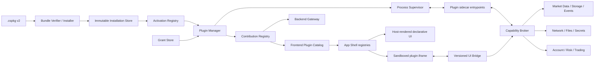

# CandleScope 通用插件平台 v2 执行方案

> 状态：执行中；Phase 0 已完成（`381dd02`），Phase 1 已完成（`d29ad4d`），Phase 2
> 已完成（`d755f27`），Phase 3 已完成（`eb7316b`），Phase 4 已完成（`e20d7c4`），
> Phase 5 已完成（`b77444a`），Phase 6 已完成（`8f18080`），Phase 7 已完成（`151b93a`），
> Phase 8 已完成（`b0efcc4`），Phase 9 已完成实现与技术验收（本阶段提交）。
>
> 基线：`codex/plugin-platform-v1@400e520`，2026-07-22。
>
> 原始方案授权边界：本文只定义目标架构、实施顺序、质量门和回滚边界；实际代码变更仍按
> 用户后续逐阶段授权执行，不授权发布安装包、迁移用户插件或开放 marketplace。

## 1. 结论

“几乎能实现任何功能”不能设计成“插件可以导入 `app.*`、拿到数据库连接、注入 React
组件并任意调用网络”。那种方案短期看起来最自由，长期会失去兼容性、安全边界、升级能力
和故障隔离。

CandleScope 通用插件平台 v2 应采用两层公开契约：

1. **贡献点（Contribution）**：插件声明它给产品增加什么，例如命令、设置、面板、
   图表图层、后台任务、数据提供器或交易适配器；
2. **宿主能力（Capability）**：插件声明它需要宿主允许什么，例如读取 K 线、订阅实时
   数据、使用私有存储、访问指定域名或提交订单。

插件只通过版本化协议和能力代理与 CandleScope 协作。宿主拥有生命周期、数据真相、权限、
渲染、风险控制、审计和最终用户交互。现有 `candlescope.script-runtime/1` 继续作为一个
专门贡献点存在，而不是继续代表整个插件平台。

一句话目标：

> **让插件几乎可以组合出任何产品功能，但不能绕过宿主边界做任何事。**

## 2. “几乎任何功能”的产品定义

### 2.1 目标能力

平台完成后，公开 SDK 应能支持下列插件类型：

| 类型 | 例子 | 主要贡献点 | 主要宿主能力 |
| --- | --- | --- | --- |
| 脚本运行时 | Pyne、Pine Compatibility、新语言 | script runtime | OHLCV batch、Render IR |
| 指标与图表工具 | 订单流图层、信号标记、自定义绘图 | chart layer、command、view | K 线读取、实时订阅、插件存储 |
| 扫描器与研究工具 | 多标的扫描、相关性、因子面板 | job、view、notification | 市场数据查询、受限并发 |
| 工作流工具 | 导入导出、快捷命令、告警编排 | command、menu、settings | 文件选择、通知、命名空间存储 |
| 内容与分析面板 | 新闻、AI 分析、研究笔记 | view、command | 受控网络、用户选择的数据 |
| 数据源与交易所 | 新交易所、专有行情、符号目录 | market-data provider | 受控网络、凭据句柄、Data Engine 写入入口 |
| 自动化服务 | 定时任务、事件驱动策略、告警转发 | job、event subscriber | 公共事件、通知、受控网络 |
| 账户与交易 | Paper broker、券商/交易所执行适配器 | account provider、order executor | secrets、账户、订单意图、风险网关 |

### 2.2 明确不支持

以下行为不属于插件能力，即使插件作者认为它们更方便：

- 导入 CandleScope `app.*`、前端私有模块或依赖源码快照；
- 直接读取或修改 CandleScope SQLite、缓存、DataManager、EventBus、`app.state`；
- 向主页面 JavaScript realm 注入任意代码、修改宿主 DOM 或 monkey patch React；
- 动态注册任意 FastAPI router、读取原始 `Request`/`WebSocket` 对象；
- 绕过能力代理直接读取 secrets、账户或提交订单；
- 绕过宿主网络策略、资源限额、用户授权或审计；
- 内核驱动、系统级常驻服务、屏幕控制等超出 CandleScope 产品边界的能力。

需要这些能力的组件应作为独立应用或随 CandleScope 源码交付的第一方模块，不应伪装成
社区插件。

## 3. 当前 v1 基线与可复用资产

当前实现详见[插件平台 v1 执行记录](PLUGIN_PLATFORM_V1_EXECUTION_zh.md)。v2 不从零开始。

### 3.1 直接复用

- 确定性 `.cspkg`、外层 SHA-256、wheel-only 离线安装；
- 每 bundle 独立 venv、绝对入口、无 shell 启动；
- activation registry、启动握手、descriptor 校验；
- sidecar 超时、消息上限、stderr 上限、惰性重启、熔断和关闭回收；
- 固定行为探针、原子激活、activation history 和回滚；
- fail-closed 路由，不在 sidecar 失败时静默回退；
- JSON-only 前端 descriptor，插件不能借 metadata 注入代码；
- CandleScope 拥有的 `candlescope.render/1`。

### 3.2 不能直接冒充通用平台

- 当前 SDK 只有 `handshake`、`describe`、`analyze`、`executeBatch`、`shutdown`；
- bundle manifest 强制 `candlescope.script-runtime/1` 和 OHLCV analyze/execute 探针；
- Host 虽然与具体脚本语言解耦，但模型仍是脚本分析和 batch 执行；
- 产品路由只接到 Indicator compute/range/WebSocket；
- sidecar 是依赖与故障边界，还不是恶意代码安全沙箱；
- 没有通用权限、宿主回调、插件存储、事件、任务、UI、network/secrets/trading 代理；
- `backend/app/exchanges/plugins` 是进程内私有架构，不是社区 SDK。

因此 v2 必须保留 v1 的成熟底座，同时新增真正通用的控制面、能力面和前端面。

## 4. 设计原则

1. **默认拒绝**：未声明、未协商、未授权或超出 scope 的调用全部失败；
2. **宿主拥有真相**：市场数据、订单、账户、设置、渲染和用户授权由 CandleScope 判定；
3. **静态声明优先**：贡献点和必需权限必须在 manifest 中声明，运行时不能偷偷扩权；
4. **最小权限**：权限包含资源 scope、速率、期限和调用来源，不只是一组布尔值；
5. **惰性激活**：除经过批准的第一方基础服务外，不因“已安装”就自动启动；
6. **前后端双隔离**：后端 sidecar 不进入主进程，任意 UI 不进入宿主 JavaScript realm；
7. **控制面与数据面分离**：生命周期/RPC 与高频行情流使用不同限流和背压语义；
8. **协议版本化**：扩展点、Host API、事件 schema、Render IR 分别演进，不共享私有对象；
9. **升级可回滚**：代码、activation、权限和插件私有数据迁移必须有独立回滚边界；
10. **产品能力不靠副作用**：插件进程技术上能执行 Python，不代表其副作用是受支持能力；
11. **高风险能力后置**：网络、文件、secrets、账户、交易必须在基础隔离已被实际证明后开放；
12. **不以测试数量代替真实证明**：数据流、浏览器 UI、冷启动、崩溃恢复和权限拒绝都需要真实探针。

## 5. 目标架构



### 5.1 组件职责

| 组件 | 唯一职责 | 禁止承担 |
| --- | --- | --- |
| Bundle Verifier | 格式、路径、摘要、签名、兼容性、静态声明校验 | 下载猜测、启动插件、自动授权 |
| Installer | 建 immutable installation、运行离线探针、写 staged activation | 修改业务数据库、静默替换现有 activation |
| Plugin Manager | 解析 activation、grants、贡献点与生命周期 | 直接实现市场数据或交易业务 |
| Supervisor | 进程、RPC、超时、限额、熔断、generation | 理解 Indicator、Exchange 或 React |
| Contribution Registry | 冲突检查、目录投影、按扩展点路由 | 执行插件任意代码 |
| Capability Broker | 权限、scope、quota、审计、宿主 API 调度 | 返回宿主私有对象或原始 secrets |
| Domain Adapter | 将公开 Host API 映射到 Data Engine、alerts、replay 等 | 向插件泄露内部模型 |
| Frontend Host | 原生声明式 UI、iframe 生命周期、MessageChannel | eval 插件代码、把插件组件挂进主 realm |

### 5.2 依赖方向

计划中的依赖规则：

```text
candlescope_plugin_sdk.platform_v2  <- 零 CandleScope 私有依赖
backend/app/plugin_host             <- SDK 模型、进程与传输
backend/app/plugin_platform         <- host + contribution/capability ports
backend/app/*/plugin_adapter        -> 领域模块 + platform ports
backend/app/main.py                 -> 只负责组合与生命周期
frontend/src/features/plugins       -> 安全 catalog、registries、UI bridge
frontend/src/app                    -> 消费 registries，不导入插件资产
```

永久架构门必须拒绝 `plugin_host` 导入 `indicator`、`data_engine`、`exchanges`、FastAPI
或任何具体插件包。领域适配发生在组合层。

## 6. 公开协议族

v2 不覆盖现有协议 ID，而是新增协议族：

| 协议 | 用途 | 最低要求 |
| --- | --- | --- |
| `candlescope.plugin/2` | 通用生命周期、贡献点调用、双向 RPC | 所有 v2 后端 entrypoint |
| `candlescope.host-api/1` | 插件调用宿主能力 | 经 Capability Broker |
| `candlescope.ui-bridge/1` | iframe 与宿主前端通信 | 任意自定义 UI |
| `candlescope.stream/1` | 有界高频数据面 | 行情 provider/consumer 按需协商 |
| `candlescope.script-runtime/1` | 现有脚本 runtime | 作为兼容贡献点继续冻结 |
| `candlescope.render/1` | 宿主拥有的图表输出 | 继续复用并单独版本化 |

### 6.1 通用控制面方法

Host 到插件的基础方法：

- `handshake`：协议、宿主版本、entrypoint、可用 Host API 和 transport 协商；
- `describe`：返回与 manifest 一致的运行时 descriptor；
- `activate`：下发 instance ID、activation generation、已授权 capability handles；
- `invoke`：调用某个已声明 contribution；
- `eventBatch`：投递公共事件批次及 delivery metadata；
- `healthCheck`：只返回结构化、可脱敏状态；
- `deactivate`：停止订阅、任务和未完成调用；
- `prepareUpgrade`：进入 quiescing，拒绝新工作并排空有界请求；
- `shutdown`：完成响应后退出。

插件到 Host 的调用统一进入 `host.call`，参数包含：

- `capabilityHandle`；
- `method`；
- `params`；
- `requestContext`，包括 contribution、用户动作、generation 和 trace ID。

Host 不接受插件自造的 capability ID。handle 短期有效，并绑定 plugin ID、publisher、
installation digest、process instance、generation、权限 scope 和速率策略。

### 6.2 双向 RPC 约束

- 控制面继续使用 UTF-8 JSON-RPC 2.0，但 v2 reader/writer 必须支持并发相关 ID；
- stdout 仍只允许协议帧，日志只能进入 stderr；
- 禁止无限重入：Host 调用插件时，插件可以调用允许的 Host API，但同一资源锁不得形成环；
- 每个方向分别设置最大 in-flight、消息大小、请求超时和取消；
- duplicate JSON key、NaN、Infinity、未知字段和未协商方法继续 fail closed；
- 每个响应携带 generation，旧进程或旧 UI 的迟到结果不得提交；
- 大 payload、文件和高频流不得伪装成普通 RPC。

### 6.3 激活事件与宿主启动顺序

“插件已启用”不代表“应用一启动就拉起进程”。manifest 只能从宿主支持的 activation
events 中选择，例如 `onCommand`、`onView`、`onSchedule`、`onMarketSubscription`。
`onStartup` 默认只允许经过批准的 required first-party service。

通用平台必须按以下 readiness 顺序组合，避免当前脚本 runtime 的早期启动语义被错误套到
所有插件：

1. 初始化宿主 storage、installation/activation/grant metadata；
2. 校验 first-party pinned artifacts，但不向插件发放领域 capability；
3. 启动 Plugin Manager/Host control plane；
4. 启动 Data Engine、alerts、replay 等宿主领域服务；
5. 注册可用的 Capability Broker domain adapters；
6. 激活 required service contributions；
7. 发布安全 catalog，其他插件继续按 activation event 惰性启动。

某个领域未 ready 时，对应 capability 不得出现在 handshake 中。optional 插件只降级自身；
required 插件失败是否中止应用必须由 first-party product policy 明确声明，不能由社区 manifest
自行把插件升级为 required。

## 7. `.cspkg` v2 与 manifest

### 7.1 目标结构

```text
plugin.cspkg
├── manifest.json
├── wheels/
│   └── acme_plugin-1.2.0-py3-none-any.whl
├── web/
│   ├── index.html
│   ├── assets/*.js
│   └── assets/*.css
├── schemas/
│   └── *.json
├── probes/
│   └── *.json
└── sbom/
    └── cyclonedx.json
```

所有条目都必须出现在 manifest 的内容摘要表中。安装器拒绝额外文件、路径穿越、大小写冲突、
符号链接、设备文件、重复 normalized path、超限压缩比和非规范 JSON。

### 7.2 manifest 示例

以下示例展示目标形状，不在 Phase 1 前视为冻结 schema：

```json
{
  "schemaVersion": 2,
  "plugin": {
    "id": "acme.market-scanner",
    "name": "ACME Market Scanner",
    "version": "1.2.0",
    "publisher": "acme",
    "license": "MIT",
    "engines": {
      "candlescope": ">=0.4.0 <0.5.0"
    }
  },
  "backend": {
    "entrypoints": [
      {
        "id": "main",
        "pythonModule": "acme_market_scanner",
        "resourceProfile": "standard",
        "activationEvents": ["onCommand", "onView", "onSchedule"]
      }
    ]
  },
  "frontend": {
    "assetsRoot": "web",
    "surfaces": [
      {
        "id": "scanner",
        "type": "sandbox",
        "entry": "index.html",
        "slot": "side-panel"
      }
    ]
  },
  "contributions": [
    {
      "id": "scan",
      "kind": "command/1",
      "title": "扫描当前市场",
      "entrypoint": "main",
      "configuration": {}
    },
    {
      "id": "scanner-view",
      "kind": "view/1",
      "title": "市场扫描器",
      "entrypoint": "main",
      "configuration": {
        "surfaceId": "scanner",
        "slot": "side-panel"
      }
    },
    {
      "id": "scanner-settings",
      "kind": "settings/1",
      "title": "扫描设置",
      "entrypoint": "main",
      "configuration": {
        "minimumVolume": {
          "type": "number",
          "default": 1000000,
          "minimum": 0
        }
      }
    }
  ],
  "permissions": {
    "required": [
      {
        "id": "market.bars.read",
        "scope": {
          "marketTypes": ["spot"],
          "maxSymbolsPerCall": 50
        }
      },
      {
        "id": "storage.private",
        "scope": {
          "maxBytes": 10485760
        }
      }
    ],
    "optional": [
      {
        "id": "notifications.show",
        "scope": {}
      }
    ]
  },
  "probes": [
    {
      "id": "descriptor",
      "kind": "controlTranscript",
      "sha256": "sha256:0000000000000000000000000000000000000000000000000000000000000000",
      "entrypoint": "main"
    }
  ]
}
```

Phase 1 将 contribution 冻结为统一数组，而不是按 `commands/views/settings` 建多个顶层
分组。`kind` 负责版本化语义，`configuration` 与 permission `scope` 是仅有的有界扩展区；
其余对象继续拒绝未知字段。这样新增贡献类型不需要放宽整个 manifest 的严格解析。

### 7.3 静态声明规则

- contribution ID 在插件内唯一，完整 ID 为 `<plugin-id>.<contribution-id>`；
- plugin `describe` 只能返回 manifest 声明的子集，不能运行时增加权限或入口；
- Host API 的 required/optional 权限分开协商；
- required 权限未授予时插件保持 disabled，不进行“部分启动后报错”；
- optional 权限未授予时对应 feature 不协商，插件必须明确降级；
- 新版本增加 required 权限时保持 staged，必须重新确认；
- 静态 assets、schema、probe、wheel 和 SBOM 均绑定 bundle digest。

## 8. 贡献点目录

贡献点描述“插件给 CandleScope 增加什么”，不等同于权限。

| 贡献点 | 版本目标 | 作用 | 风险级别 |
| --- | --- | --- | --- |
| `command/1` | v2 首批 | 命令、快捷入口、上下文动作 | 低 |
| `settings/1` | v2 首批 | JSON Schema 设置项、原生表单 | 低 |
| `notification/1` | v2 首批 | 通知来源和动作 | 低 |
| `view/1` | v2 首批 | side/bottom/full/settings/modal surface | 中 |
| `chart-layer/1` | v2 首批 | Render IR 图层、marker、object | 中 |
| `event-subscriber/1` | v2 首批 | 订阅版本化公共事件 | 中 |
| `job/1` | v2 首批 | 用户触发或宿主调度的后台任务 | 中 |
| `http-endpoint/1` | Phase 9 | 插件命名空间下的 HTTP/stream handler | 中高 |
| `script-runtime/1` | 兼容 | 承载现有脚本 runtime v1 | 中 |
| `symbol-provider/1` | Phase 10 | 符号发现与 capability descriptor | 高 |
| `market-data-provider/1` | Phase 10 | 历史/实时规范化数据源 | 高 |
| `account-provider/1` | 最后 | 账户、余额、持仓只读投影 | 极高 |
| `order-executor/1` | 最后 | 经宿主风控的下单/撤单执行 | 极高 |

任意 contribution 的调用都必须经过 Contribution Registry。插件不能通过 method 名称碰撞
覆盖宿主或其他插件。

## 9. 权限、信任与沙箱

### 9.1 风险分层

| 层级 | 能力示例 | 默认策略 |
| --- | --- | --- |
| L0 展示 | descriptor、图标、声明式设置 schema | 安装校验后可发现，不启动代码 |
| L1 私有状态 | namespaced storage、通知、主题读取 | 用户启用插件后授权 |
| L2 市场数据 | K 线查询、实时订阅、图表上下文 | 明确 scope、quota、可撤销 |
| L3 外部交互 | network、文件选择、HTTP endpoint | 每类单独授权和审计 |
| L4 凭据/交易 | secret handle、账户、订单、撤单 | 仅签名可信插件，独立高风险确认 |

### 9.2 权限 ID 初始集合

```text
storage.private
settings.plugin.read
settings.plugin.write
notifications.show
chart.context.read
chart.layer.publish
market.symbols.read
market.bars.read
market.bars.subscribe
market.trades.read
market.order-book.read
market.data.provide
events.public.subscribe
jobs.schedule
network.connect
filesystem.open-user-selected
filesystem.save-user-selected
http.endpoint.serve
secrets.use
accounts.read
trade.simulate
trade.submit
trade.cancel
```

权限 scope 至少支持：exchange、market type、symbol pattern、interval、数据类型、域名、
端口、最大历史范围、最大并发、调用速率、存储配额、订单账户和名义价值上限。

### 9.3 Grant Store

权限授权不能写进 activation registry。独立 Grant Store 绑定：

- plugin ID；
- publisher key identity；
- bundle SHA-256；
- plugin major version；
- permission ID、scope 和用户确认版本；
- granted/denied 时间与来源；
- 撤销状态。

升级后若 publisher identity、major version、required permission 或 scope 扩大，旧 grant
不得自动继承。收窄 scope 可以继承，但仍记录新 bundle digest。

### 9.4 后端沙箱

现有独立 venv 和 sidecar 只解决依赖/崩溃隔离。v2 对“可安装社区后端代码”的安全声明
必须额外满足：

- 进程树级终止与 CPU、内存、句柄、文件大小和进程数限制；
- 只读 installation，单独的临时目录和受配额私有数据目录；
- 默认禁止读取 CandleScope 数据库、源码、用户目录和其他插件目录；
- 默认禁止直接网络出口，`network.connect` 只能通过宿主代理；
- 禁止任意子进程，或只允许 manifest 固定且摘要匹配的 helper；
- Windows 使用实际可验证的受限 token/AppContainer、Job Object 和 ACL；
- Linux 后续实现对应的 namespace/cgroup/seccomp 边界；
- 以真实恶意探针证明网络、文件、进程逃逸被拒绝。

如果 Windows 上无法证明直接网络和文件访问已被阻断，平台只能标记为
`local-trusted`，不得宣称支持不可信 marketplace 后端插件，也不得开放 L4 能力。

### 9.5 信任等级

- `first-party-pinned`：随 CandleScope build 固定 publisher、版本、大小、摘要；
- `verified-publisher`：签名链和发布记录通过，仍受全部权限与沙箱限制；
- `local-developer`：用户显式从本地文件安装，UI 持续标记开发模式；
- `ui-only-untrusted`：没有后端 entrypoint，只能运行严格 iframe 和有限 bridge。

未签名或本地开发插件不能请求 `secrets.use`、`accounts.read`、`trade.*`。开发开关也不应
成为生产环境的一键绕过按钮。

## 10. 宿主能力 API

### 10.1 命令、事件和任务

- Command Registry 校验参数/结果 JSON Schema、调用来源和用户动作；
- 公共事件是内部 EventBus 的脱敏投影，不把 Python model 透传给插件；
- 事件包含 schema version、sequence、source quality、finality、generation 和 trace ID；
- 后台任务由宿主调度，支持一次性、固定间隔和用户动作触发；
- 默认禁止每个插件 `onStartup` 常驻，必须使用 activation event 惰性启动；
- 隐藏 view 不等于后台任务继续拥有无限生命周期，manifest 必须明确 service 贡献点；
- 任务并发、运行时间、失败重试和退避由 Host 管理。

### 10.2 设置与存储

- 设置声明使用受限 JSON Schema，由宿主原生渲染；
- 插件只能读取自身设置；读取全局主题、locale 等使用只读公共 capability；
- 首批提供 namespaced KV/document/blob，支持事务、配额、备份和导出；
- 插件不能取得共享 SQLite connection，也不能 `ATTACH` CandleScope 数据库；
- 插件数据目录按 plugin/publisher/major version 隔离；
- 卸载默认保留私有数据，用户可选择删除；删除前必须明确显示不可恢复范围；
- 升级迁移先做快照，探针失败时同时回滚代码 activation 和私有数据。

### 10.3 市场数据 consumer

公共市场数据 API 必须复用现有 Data Engine 真相路径：

```text
Plugin request
  -> Capability Broker
  -> MarketData public adapter
  -> DataManager / Query / backfill ownership
  -> canonical public DTO
  -> bounded plugin stream
```

插件不能直接创建新的 SQLite 真相或私自驱动 BackfillCoordinator。API 至少区分：

- history query 与 realtime subscription；
- forming、closed、corrected；
- source、source quality、coverage、finality；
- 请求目标区间、实际覆盖区间和 backfill 状态；
- live 与 replay context，且二者 capability handle 不可混用。

默认不允许 wildcard 全市场订阅。多标的扫描必须声明数量、频率和数据深度，并接受宿主
公平调度。

### 10.4 图表输出

- `chart-layer/1` 继续使用 CandleScope 拥有的 Render IR；
- 插件只提交声明式 series/collections/object events，不取得 Lightweight Charts 实例；
- Host 校验 pane、scale、ID、时间顺序、点数、颜色和对象预算；
- chart adapter 是唯一写图入口；
- 插件 layer 以 generation 和 chart session identity 隔离；
- symbol/interval 切换后旧输出不能复活；
- 高成本 layer 必须支持 cancel、range delta 或明确声明 batch-only。

### 10.5 网络与文件

- `network.connect` 通过宿主代理，scope 固定 scheme/domain/port；
- 禁止裸 IP、DNS rebinding、重定向越界和私网访问，除非另有更高权限；
- Host 负责代理、TLS 校验、响应大小、超时、速率和审计；
- 插件不能读取系统代理凭据；
- 文件 API 只返回用户通过系统 picker 选择的短期 handle；
- handle 绑定一次操作、路径、读写方向、大小和过期时间；
- 任意路径字符串不构成权限。

### 10.6 secrets、账户和交易

- secrets 默认永不以明文返回插件；
- Host 优先提供签名/认证操作句柄，例如“用 credential X 签署这个受限请求”；
- 账户 provider 只返回宿主 schema 的余额、持仓、订单和时间戳；
- 插件产生的是 `OrderIntent`，不是直接网络请求；
- OrderIntent 依次通过 capability scope、账户选择、风险上限、价格/数量校验、幂等键、
  用户确认或已授权自动化策略、执行 adapter；
- 所有 submit/cancel 都写入不可由插件修改的审计日志；
- 全局 kill switch、逐插件禁用和逐账户撤权必须立即生效；
- Paper broker 先于任何 live executor；
- live trading 不得因“插件已安装”或“旧版本曾授权”自动开启。

## 11. 前端扩展模型

### 11.1 两种 UI 模式

**声明式原生 UI**用于常见场景：

- setting form；
- command palette/menu/toolbar item；
- table/list/detail/status card；
- notification；
- chart layer 和 marker；
- 简单 side panel/bottom panel。

宿主根据 JSON schema 渲染，插件不能提供 JavaScript。这是默认和推荐模式。

**sandbox UI**用于复杂自定义界面：

- bundle 内静态 HTML/CSS/JS；
- 运行在独立 origin 或没有 `allow-same-origin` 的 sandboxed iframe；
- 只允许 `allow-scripts`，默认禁止 popups、top navigation、downloads、forms；
- CSP 默认 `default-src 'none'`、`connect-src 'none'`；
- 不共享宿主 cookie、localStorage、IndexedDB、DOM 或 JS 对象；
- 通过一次性 `MessageChannel` 和 `candlescope.ui-bridge/1` 通信；
- 每条消息校验 channel token、plugin、view、instance、generation、schema 和大小；
- theme/locale/chart context 由 Host 以只读 snapshot 提供；
- hidden/suspended/unmounted 生命周期明确，旧 iframe 消息不得提交。

永远不提供“把插件 React component 动态 import 到 AppShell”的社区能力。

### 11.2 可扩展位置

首批稳定 slot：

```text
commandPalette
topToolbar
chartContextMenu
sidePanel
bottomPanel
settings
modal
fullPage
statusArea
```

每个 slot 有独立尺寸、焦点、快捷键、可访问性、懒加载和资源预算。插件不能使用绝对定位
覆盖宿主关键确认框或交易风险 UI。

### 11.3 前端目录与 API

- `GET /api/v2/plugins/catalog`：只返回安全 descriptor、贡献点、可用状态和授权摘要；
- 管理 API 与 catalog 分离，不暴露 executable、路径、PID、stderr 或 raw grant；
- install/enable/grant/rollback 等管理操作要求本地管理 session、Origin/CSRF 校验和用户动作；
- AppShell 只消费 registries，不为插件 ID 写硬编码分支；
- 插件 view 资源按 installation digest 缓存，升级后不会混用旧 chunk；
- 任意插件 UI 错误由独立 error boundary/iframe failure surface 承担，主图继续工作。

## 12. 高频数据面与背压

普通命令、设置和小批事件使用控制面 RPC。订单簿、逐笔成交或多标的扫描不得通过无限
JSON-RPC 消息堆积。

`candlescope.stream/1` 目标设计：

- Host 创建 Windows named pipe / Unix domain socket，并下发单次连接 token；
- mandatory codec 为有界 canonical JSON batch，性能不足时协商 MessagePack；
- 每个 stream 有 stream ID、generation、sequence、schema、credit window；
- consumer 必须 ack 或归还 credit，Host 不进行无限缓存；
- forming bar 可以 latest-only coalesce；closed/corrected 不得静默丢弃；
- order book 必须声明 snapshot/delta、sequence 和 resync 语义；
- 断线、超时或 sequence gap 后必须显式 resync；
- 超预算时先降采样/拒绝新订阅，再熔断插件，不能拖慢 Data Engine producer；
- codec、batch size 和 shared-memory 方案必须由基准决定，不能在没有实测前宣称性能。

## 13. 安装、激活、升级与回滚

### 13.1 状态分离

```text
installation store  = 已验证、不可变的 bundle 内容
activation registry = 当前选择哪个 installation、entrypoint 和 enabled 状态
grant store          = 用户授予的权限及 scope
data store           = 插件私有持久化与 migration generation
runtime state        = 当前进程、view、stream、task 和健康状态
```

五类状态不能合并成一个 JSON 文件，也不能因为回滚代码自动扩大权限。

### 13.2 安装事务

1. 调用者提供本地 bundle 和固定 SHA-256；
2. verifier 校验所有文件、manifest、schema、平台和签名；
3. 在临时位置建立 venv、静态资源和只读 installation；
4. 对全部 entrypoint 和 contribution 运行离线 descriptor/probe；
5. 计算所需 permissions，与已有 grant 做差异；
6. 有新增 required 权限时保持 staged，等待用户确认；
7. 原子写 installation metadata；
8. activation 只在所有 entrypoint、assets、probe 和 grants 就绪后切换；
9. 首个健康窗口通过后提交；失败则恢复旧 activation；
10. 任何阶段失败都不能留下半激活贡献点。

### 13.3 升级事务

1. 安装新版本但不覆盖旧版本；
2. 检查 publisher、engine、协议、权限差异；
3. 通知旧 generation `prepareUpgrade`，停止新工作；
4. 取消/排空有界调用，关闭 stream 和 view channel；
5. 快照私有数据并运行迁移；
6. 启动新 generation 和完整探针；
7. 原子切换 catalog/registries；
8. 经过健康观察窗后提交；
9. 失败时恢复 activation、grant 视图和数据快照；
10. 旧 generation 的迟到响应全部丢弃。

### 13.4 卸载

- disable、deactivate、uninstall、delete data 是四个不同动作；
- 卸载前停止 jobs、streams、UI channels 和 capability handles；
- 默认保留最近可回滚 installation 和插件私有数据；
- 真正删除前显示路径、大小、版本、是否可恢复；
- required first-party 插件不能被普通社区操作替换或删除。

## 14. 计划中的仓库结构

```text
packages/candlescope-plugin-sdk/
└── src/candlescope_plugin_sdk/
    ├── platform_v2/          # manifest、protocol、permissions、contributions
    └── ...                   # 现有 script runtime v1 顶层兼容导出

backend/app/plugin_host/
├── transport.py             # 双向 RPC、framing、cancel
├── supervisor.py            # 进程、generation、limits、circuit breaker
├── sandbox.py               # OS 级隔离
├── bundle_v2.py
├── installer_v2.py
└── activation.py

backend/app/plugin_platform/
├── manager.py
├── contributions.py
├── capability_broker.py
├── grants.py
├── storage.py
├── events.py
├── streams.py
├── assets.py
├── diagnostics.py
└── adapters/                # 只放公开 port，具体领域组合在 app 层

backend/app/plugin_runtime/  # 保留 script-runtime v1 compatibility adapter

frontend/src/features/plugins/
├── catalog/
├── commands/
├── settings/
├── views/
├── bridge/
├── manager/
└── __tests__/
```

如果实际实现选择不同文件名，依赖方向和职责边界仍是永久门禁。

## 15. 分阶段执行总览

每个阶段使用独立提交，完成退出门后才能进入下一阶段。阶段提交必须可单独 revert。

| 阶段 | 状态 | 交付物 | 解锁能力 |
| --- | --- | --- | --- |
| Phase 0：冻结基线与威胁模型 | 已完成（`381dd02`） | v1 golden、性能基线、攻击面、参考场景 | 可安全动工 |
| Phase 1：SDK/manifest v2 | 已完成（`d29ad4d`） | 通用模型、协议文档、Hello Command | 社区可编译契约 |
| Phase 2：通用 Host 控制面 | 已完成（`d755f27`） | 双向 RPC、generation、通用 supervisor | 后端贡献点运行 |
| Phase 3：Bundle/Installer v2 | 已完成（`eb7316b`） | 多 entrypoint/assets、staging、原子激活 | 可管理安装与回滚 |
| Phase 4：权限与 OS 沙箱 | 已完成（`e20d7c4`） | Grant Store、Broker、隔离、审计 | 可开放受控 Host API |
| Phase 5：核心后端扩展点 | 已完成（`b77444a`） | command/settings/storage/event/job | 最小通用插件平台 |
| Phase 6：市场数据 consumer/图层 | 已完成（`8f18080`） | read/subscribe、Render IR layer | 扫描器、研究、图表工具 |
| Phase 7：声明式前端 | 已完成（`151b93a`） | catalog、manager、native slots | 无任意 JS 的产品 UI |
| Phase 8：Sandbox UI | 已完成（`b0efcc4`） | iframe assets、CSP、UI Bridge | 复杂自定义界面 |
| Phase 9：网络/文件/HTTP gateway | 已完成（`9b4a638`） | 受控外部交互与命名空间 API | 集成型插件 |
| Phase 10：数据提供器 | 已完成（本阶段提交） | symbols/history/realtime provider、stream v1 | 社区交易所/行情源 |
| Phase 11：账户与交易 | 11A 已完成；11B0 安全设计已完成；11B Live 未开始 | secret broker、paper/live executor、risk gate | 高风险交易插件 |
| Phase 12：签名与 Marketplace | 未开始 | publisher、更新、撤销、SBOM | 可分发生态 |
| Phase 13：v1 收敛与 GA | 未开始 | script runtime adapter、兼容周期、正式门禁 | 单一产品插件目录 |

## 16. Phase 0：冻结基线与威胁模型

> 2026-07-22 已完成并独立提交为 `381dd02`。实测环境、冻结哈希、性能 artifact、
> L0～L4 威胁登记、六个参考插件合同和全部回归门禁见
> `PLUGIN_PLATFORM_V2_PHASE0_zh.md`。该记录保留 Phase 0 时点的边界结论。

### 范围

只增加文档、fixture、测试和基准，不改变生产行为。

### 交付

- 冻结 v1 SDK transcript、`.cspkg` install/check/rollback 和 HTTP/range/WS golden；
- 记录零插件、两个官方 runtime、10/50 个 disabled catalog 项的冷启动基线；
- 记录 control RPC、Indicator batch、K 线流、逐笔和 full order book 的真实负载；
- 建立威胁模型：恶意 bundle、依赖投毒、sidecar 逃逸、UI XSS、localhost CSRF、
  数据外传、资源耗尽、凭据盗用、重复下单；
- 冻结 6 个验收参考插件：Hello Command、Market Scanner、Sandbox View、Mock Provider、
  Paper Broker、v1 Script Runtime Adapter；
- 明确支持的 Windows/Python/Node/浏览器矩阵。

### 退出门

- 当前 v1 全量与 package smoke 继续通过；
- 基线脚本在全新用户目录可重复运行并输出机器可读 artifact；
- 威胁模型覆盖每个 L0-L4 权限；
- 本阶段 diff 无生产代码变化。

### 回滚

直接 revert 测试/文档提交，不影响运行时。

## 17. Phase 1：SDK 与 manifest v2

> 2026-07-22 已完成实现与技术验收，并独立提交为 `d29ad4d`。公开协议、冻结哈希、
> wheel smoke、完整回归和未交付边界见 `PLUGIN_PLATFORM_V2_PHASE1_zh.md`。

### 范围

在 `candlescope-plugin-sdk` 中新增 `platform_v2` 命名空间；现有顶层 v1 import、协议 ID 和
wire bytes 不变。

### 交付

- manifest、contribution、permission、descriptor、RPC envelope 的类型模型；
- canonical JSON、重复 key、NaN、未知字段、大小和深度限制；
- `candlescope.plugin/2` 与 `candlescope.host-api/1` 协议文档；
- Hello Command 参考 sidecar 和固定 transcript；
- manifest JSON Schema 与正反例；
- SDK wheel/sdist/package smoke，Python 3.11+ 基线；
- 语言无关 wire fixture，确保未来 TypeScript/Rust SDK 可实现。

### 退出门

- SDK 零 CandleScope 私有依赖；
- v1 SDK tests/transcript byte-for-byte 不变；
- v2 基础生命周期、双向 host.call、取消和 malformed input 全覆盖；
- wheel 在全新 Python 3.12/3.13 venv 中离线安装并重放 transcript；
- schema 与 Python model 的接受/拒绝结果一致。

### 回滚

删除 additive `platform_v2`；v1 用户不受影响。

## 18. Phase 2：通用 Host 控制面

> 2026-07-22 已完成实现与技术验收，并随本阶段独立提交交付。进程/传输内核、内存
> Plugin Manager、真实 Hello Command probe、故障矩阵、完整回归和未交付边界见
> `PLUGIN_PLATFORM_V2_PHASE2_zh.md`。

### 范围

提取脚本无关的进程/传输内核，建立通用 Plugin Manager，但不开放市场数据、网络、文件、
secrets 或 UI。

### 交付

- async 双向 JSON-RPC reader/writer、request cancellation 和 bounded concurrency；
- instance ID、activation generation、迟到结果隔离；
- entrypoint supervisor、health、restart window、circuit breaker；
- contribution registry 和冲突校验；
- Hello Command 仅通过内存 activation 启动；
- `app.plugin_runtime` 通过 compatibility wrapper 使用同一低层内核；
- 架构检查禁止 host core 导入业务模块。

### 退出门

- 现有 Pyne/Pine v1 宿主、HTTP、range、WS golden 不变；
- crash、hang、stdout pollution、oversize、wrong ID、restart storm 全部 fail closed；
- 双向 RPC 并发、取消、重入和 shutdown 无死锁；
- 旧 generation 响应无法更新 registry 或业务结果；
- required entrypoint 失败仍中止启动，optional entrypoint 只降级自身。

### 回滚

compatibility wrapper 可切回原 v1 supervisor；不改变 bundle/registry 格式。

## 19. Phase 3：Bundle、Installer 与 activation v2

> 2026-07-22 已完成实现与技术验收。格式、安装事务、新进程 probe、故障注入、
> CLI、回滚和仍未交付的安全边界见 `PLUGIN_PLATFORM_V2_PHASE3_zh.md`。

### 交付

- `.cspkg` schema v2、多 backend entrypoint、静态 web assets、schema、probe、SBOM；
- immutable installation store 和独立 activation registry v2；
- extend `backend/scripts/candlescope_plugin.py` 的 build/inspect/install/check/enable/disable/
  rollback/uninstall；
- 所有 entrypoint/assets/probes 先验证，再进行第一次 registry mutation；
- deterministic build 和外层固定 SHA-256；
- staged 状态与 restart-required 明确展示；
- v1 bundle 仍由 v1 parser 处理，禁止猜测升级。

### 退出门

- path traversal、zip bomb、extra file、hash mismatch、duplicate ID、platform mismatch 被拒绝；
- 两 entrypoint 中任一失败不会半激活另一项；
- quick repeat 不下载、不重装、不改 registry；
- activation 和 rollback 在模拟掉电点保持原子；
- mixed v1/v2 registry 不互相覆盖；
- install/rollback 后真实新进程探针通过。

### 回滚

停用 v2 registry；v1 activation 文件和官方 runtime 不变。

## 20. Phase 4：权限、审计与 OS 沙箱

> 2026-07-22 已完成实现与技术验收。Grant Store、代际 capability、Host broker、Windows
> AppContainer/Job/ACL、direct network deny、受保护 management router 和资源恶意探针已
> 交付；证据与保留边界见
> [`PLUGIN_PLATFORM_V2_PHASE4_zh.md`](PLUGIN_PLATFORM_V2_PHASE4_zh.md)。v2 registry 和
> management router 仍未接入产品默认启动，publisher identity 仍未签名，默认信任级别继续
> 是 `local-trusted`。

### 交付

- Grant Store、permission diff、required/optional 协商；
- capability handle mint/validate/revoke；
- per-plugin quota、rate limit、trace 和审计；
- Windows Job Object、restricted token/AppContainer、ACL、临时目录和进程树控制；
- 默认 direct network deny，Host 代理尚不开放；
- CLI/management API 只显示授权意图和 scope，不显示 raw secret；Phase 7 已提供 Host 原生页面；
- malicious probe bundle：读取数据库/用户目录、联网、fork、资源耗尽、伪造 handle。

### 退出门

- 未授权/越 scope/旧 generation/revoked handle 调用全部失败；
- 插件进程树可被完整回收；
- 真实 direct egress 和未授权文件读取被 OS 层拒绝；
- CPU、内存、磁盘、stderr、消息和进程数超限只熔断插件；
- localhost 管理 API 经 Origin、CSRF 和本地 session 防护；
- 权限增加后插件保持 staged，拒绝自动继承。

### 停止条件

若不能证明直接网络和文件访问被阻断，停止“untrusted backend/marketplace”宣称。后续只可
在 `first-party-pinned`/`local-trusted` 范围开发，L4 阶段不得开始。

## 21. Phase 5：核心后端扩展点

> 2026-07-22 已完成实现与技术验收。产品组合根、五类核心贡献点、私有 storage、event/job、
> 公开 catalog、受保护 management API 和两个参考插件已交付；证据与保留边界见
> [`PLUGIN_PLATFORM_V2_PHASE5_zh.md`](PLUGIN_PLATFORM_V2_PHASE5_zh.md)。产品 feature flag
> 默认关闭，环境 bootstrap 仍只支持显式 `local-trusted`；截至该阶段 Phase 6–12 能力未提前开放。

### 交付

- `command/1`、`settings/1`、`notification/1`、`event-subscriber/1`、`job/1`；
- namespaced KV/document/blob storage、quota、snapshot 和 migration；
- 版本化公共 app 事件，不直接暴露 DataEventBus；
- lazy activation event、任务调度、取消和退避；
- `/api/v2/plugins/catalog` 与受保护 management API；
- Hello Command 和无 UI 的定时通知参考插件。

### 退出门

- disabled 插件零进程、零订阅、零 job；
- 插件 crash 不影响主图、Data Engine 或其他插件；
- storage 跨插件、跨 publisher 和越 quota 访问被拒绝；
- event queue 有界，慢插件不能阻塞 producer；
- disable/revoke 后 handle、job、event 和迟到响应全部失效；
- 数据迁移失败可恢复旧 snapshot。

### 里程碑

Phase 5 退出门已经达到，因此该阶段实现可称为“最小通用插件平台”。这不等于“完整平台”；
后续能力仍必须按 Phase 6–12 的退出门逐阶段交付。

## 22. Phase 6：市场数据 consumer 与图表图层

> 2026-07-22 已完成实现与技术验收。受 scope 约束的 live symbol/K 线/TradeFlow/partial
> order-book 只读 broker、有界 K 线订阅、marker-only `chart-layer/1` 和 Market Scanner
> 参考插件已交付；证据与保留边界见
> [`PLUGIN_PLATFORM_V2_PHASE6_zh.md`](PLUGIN_PLATFORM_V2_PHASE6_zh.md)。Phase 7 已将安全
> projection 接到原生图表与 AppShell；网络、provider、账户与交易仍未开放。

### 交付

- `market.symbols.read`、`market.bars.read/subscribe`、逐笔/订单簿只读 capability；
- public DTO、coverage/finality/source-quality schema；
- 有界 subscription、sequence、coalesce、cancel、resume/resync；
- `chart-layer/1` 和 Render IR budget；
- Market Scanner 参考插件：多标的只读扫描、私有设置/存储、图表 marker；
- live/replay capability 强隔离。

### 退出门

- source → DataManager → broker → plugin 的数据与直接公开 API 一致；
- closed/corrected 不丢失，forming only latest-coalesce；
- symbol/interval/generation 切换无 cross-wire 和旧结果复活；
- 全市场越权订阅、过深历史、超并发明确拒绝；
- 空数据库/backfill 情况不由插件重复制造请求放大；
- 高负载插件断开后 Data Engine producer 延迟回到基线。

## 23. Phase 7：声明式前端与插件管理器

> 2026-07-22 已完成实现与技术验收，并独立提交为 `151b93a`。严格 `view/1`、公共 UI projection、原生 registry/
> settings/view/status/chart consumer、受保护 Plugin Manager、流式 `.cspkg` 安装与真实浏览器
> Market Scanner 闭环已交付；证据与保留边界见
> [`PLUGIN_PLATFORM_V2_PHASE7_zh.md`](PLUGIN_PLATFORM_V2_PHASE7_zh.md)。插件自定义 JS/iframe、
> network/files、provider、账户、交易与 Marketplace 仍未开放。

### 交付

- 前端安全 catalog validator；
- command palette、toolbar、settings、side/bottom panel、status slot registries；
- JSON Schema 原生设置与表格/列表/详情组件；
- Plugin Manager：安装状态、启用、权限、健康、更新、回滚、数据保留；
- AppShell 消费 registry，不出现 plugin ID 分支；
- reference Market Scanner 使用声明式 UI 完成完整工作流。

### 退出门

- descriptor 无效、重复 contribution、未知 slot 全部 fail closed；
- disabled/uninstalled 插件的 UI、快捷键和 command 立即消失；
- 50 个 installed/disabled 插件不加载插件 JS，也不启动 sidecar；
- Settings、AppShell、主图和 chart adapter 架构门继续通过；
- 真实浏览器完成安装、授权、打开 panel、查询、禁用、回滚；
- 插件 UI 异常不会使 AppShell error boundary 崩溃。

## 24. Phase 8：Sandbox UI 与 UI Bridge

> 2026-07-22 已完成实现与技术验收。digest-addressed asset gateway、opaque-origin/
> `credentialless` iframe、严格 CSP、`candlescope.ui-bridge/1`、Sandbox View reference plugin 与
> 真实浏览器 12/12 隔离探针已交付；证据与保留边界见
> [`PLUGIN_PLATFORM_V2_PHASE8_zh.md`](PLUGIN_PLATFORM_V2_PHASE8_zh.md)。当前 bridge capability 为空，
> network/files/provider/账户/交易/Marketplace 仍未开放。

### 交付

- digest-addressed plugin asset gateway；
- 严格 CSP、sandbox attribute 和独立 origin 策略；
- `candlescope.ui-bridge/1`、MessageChannel、一次性 token、generation；
- view lifecycle、theme、locale、focus、resize、suspend、dispose；
- bridge 只暴露已授权 capability，不提供通用 fetch 或宿主对象；
- Sandbox View reference plugin。

### 退出门

- iframe 无法访问 parent DOM、cookies、localStorage、IndexedDB 或宿主 JS；
- direct fetch/WebSocket、top navigation、popup、download 默认被拒绝；
- origin spoof、channel replay、oversize、旧 iframe message 被拒绝；
- view 隐藏/关闭后订阅和 channel 按契约释放；
- 真实浏览器验证键盘、焦点、主题、可访问性和错误恢复；
- 插件 asset 不能污染主 bundle cache 或 service worker scope。

## 25. Phase 9：受控网络、文件和 HTTP gateway

> 2026-07-22 已完成实现与技术验收。精确 HTTPS/DNS pin、一次性用户文件 handle、loopback
> namespace endpoint、生命周期回收、真实浏览器/Windows AppContainer 证据与保留边界见
> `PLUGIN_PLATFORM_V2_PHASE9_zh.md`。

### 交付

- Host-mediated HTTP client，严格 domain/redirect/private-network policy；
- user-selected file handles；
- plugin namespace 下的声明式 HTTP endpoint/stream gateway；
- body/response/connection/rate limits 和审计；
- 外部调用与 UI/user action trace 关联；
- reference integration plugin，不包含真实凭据。

### 退出门

- direct egress 仍被 OS 层拒绝，只有代理路径成功；
- DNS rebinding、redirect 越 scope、localhost/cloud metadata 访问被拒绝；
- 文件 handle 越路径、复用、过期、方向错误被拒绝；
- 插件 endpoint 不能覆盖宿主路由或其他插件 namespace；
- disable/revoke 后连接及时关闭；
- 响应日志脱敏且不记录 body/secrets。

## 26. Phase 10：公开数据提供器与交易所插件

> 2026-07-23 已完成实现与技术验收。严格 provider DTO、成对贡献、Host-owned ingestion、
> history/realtime/full-depth、Mock `.cspkg`、真实冷库浏览器证据、Binance/OKX parity 与保留边界见
> `PLUGIN_PLATFORM_V2_PHASE10_zh.md`。

### 范围

把当前进程内 exchange plugin 思路投影为公开 sidecar contract，而不是让社区包导入
`app.exchanges`。

### 交付

- `symbol-provider/1`、`market-data-provider/1`；
- canonical symbol/capability/request/event schema；
- history pagination、rate-limit、reconnect、finality、source quality；
- `candlescope.stream/1` 实际 data plane；
- Host adapter 把 provider 输出送入现有 ingestion/normalization/Data Engine 真相路径；
- manifest TTL 的 symbol singleflight cache、exact-owner eviction 与 disable → enable generation 回归；
- Mock Exchange reference plugin；
- 第一阶段不接真实账户和下单。

### 退出门

- provider 不能直接写 cache、SQLite、GapLedger 或 EventBus；
- 历史与实时合并、重复、缺口、乱序、finality/correction 语义通过确定性 fixture；
- backfill pagination 和 rate limit 无请求放大；
- order book snapshot/delta sequence gap 能可靠 resync；
- provider crash/restart 不污染其他 exchange；
- disable 清理 registry/cache，重新启用后新 supervisor generation 可重新注册并接受新订阅；
- 真实冷数据库和真实浏览器只读 smoke 通过；
- 与内置 Binance/OKX 相同 public contract 的 parity matrix 明确，而不是只看单元测试。

## 27. Phase 11：secrets、账户与交易

### 11A：Paper only

> 2026-07-23 已完成实现与技术验收。严格 Paper DTO、first-party pinned 策略门、Host-owned
> ledger/risk/fill、幂等与 unknown recovery、不可变审计、全局 kill switch、真实 `.cspkg`/sidecar、
> 原生 Manager 与浏览器证据见 `PLUGIN_PLATFORM_V2_PHASE11A_zh.md`。

- `secrets.use` 本阶段保持完全不可授予；fixture 不持有任何 credential handle；
- `account-provider/1` 使用 fixture 账户；
- `order-executor/1` 只接 Replay/Paper broker；
- OrderIntent、risk gate、idempotency、audit、kill switch；
- 无前视、重复提交、取消/成交竞态和恢复测试。

### 11B：Live opt-in

> 2026-07-23 已完成 docs-only 的 Phase 11B0 安全架构门。证据清单、三个可选方案、
> 推荐的独立 Live Transaction Broker、迁移/回滚与验收门见
> [`PLUGIN_PLATFORM_V2_PHASE11B0_zh.md`](PLUGIN_PLATFORM_V2_PHASE11B0_zh.md) 和
> [`security/phase11b-live-authority/hardening.md`](security/phase11b-live-authority/hardening.md)。
> 这不表示 Live 已开始；在方案被明确选择并生成绑定 revision 的 implementation plan
> 前，`secrets.use`、`trade.submit`、`trade.cancel` 与认证交易网络继续不可达。

- 仅 `first-party-pinned` 或 `verified-publisher`；
- secret broker 对真实凭据提供不暴露明文的签名/代理能力；
- 每账户、插件、市场、订单类型、最大数量/名义价值/频率 scope；
- 显式 live 模式、醒目标识、全局 kill switch；
- crash/retry 必须依赖幂等键和订单查询，不得盲目重发；
- 完整不可变审计与用户可导出记录。

### 退出门

- Paper 全矩阵通过前不得开始 Live；
- unsigned/local-developer 插件无法获得 L4 handle；
- revoke/disable/kill switch 在下一次网络动作前生效；
- 重连、超时、未知结果和重复 ack 不会产生重复订单；
- 风控/确认 UI 不能由 iframe 覆盖或伪造；
- 无法证明 secrets 不泄漏时保持 paper-only。

## 28. Phase 12：签名、更新与 Marketplace

### 交付

- publisher key、bundle signature、timestamp 和 revocation；
- immutable release、SHA256SUMS、SBOM、依赖/许可证元数据；
- marketplace index 只提供元数据和固定 artifact，不参与权限决定；
- 更新先下载/校验/stage，不因“有新版本”自动激活；
- permission diff、兼容性、迁移、健康观察和 rollback UI；
- 恶意/撤销 publisher kill switch 和离线缓存策略；
- first-party bootstrap 与社区 marketplace 策略继续分离。

### 退出门

- signature、digest、publisher、版本或 transparency record 不一致即拒绝；
- 已发布 artifact 不可原地替换；
- 离线启动只使用已验证缓存；
- update 新增权限时保持 staged；
- marketplace 不可以覆盖同 ID 的 unmanaged/local activation；
- 撤销策略不会误删用户数据，并能阻止下一次启动。

## 29. Phase 13：v1 收敛与正式发布

### 交付

- generic platform 把 v1 script runtime 作为 `script-runtime/1` compatibility contribution；
- Pyne/Pine 现有 `.cspkg`、release digest 和 HTTP/range/WS 契约保持不变；
- `/api/v1/indicators/runtimes` 从统一 catalog 投影，但 wire schema 不变；
- v1 registry 导入是显式、可预览、可回滚操作；
- 至少两个正式版本周期保留 v1 host/installer 回滚路径；
- 文档、SDK 模板、兼容矩阵、故障排查、发布指南完成。

### 正式门

- backend、frontend、SDK、v1 bridge、v2 reference plugins 全量通过；
- 全新用户目录首次安装、quick repeat、升级、权限新增、失败回滚、卸载保留数据通过；
- 真实浏览器验证声明式 UI 和 sandbox UI；
- 真实冷数据库验证 market consumer/provider，不隐藏上游下载成本；
- 故障注入覆盖 crash、hang、network loss、disk full、corrupt registry、stale generation；
- no-plugin 与 v1-only 产品行为没有未经批准的性能/兼容回归；
- security review 未解决的高风险 finding 为零；
- rollback drill 能恢复到仅 v1 runtime 的稳定版本。

## 30. 验证矩阵

| 层 | 必须验证 |
| --- | --- |
| Schema | canonical JSON、未知字段、重复 key、limits、跨 SDK fixture |
| Bundle | digest、签名、路径、压缩、平台、SBOM、extra/missing files |
| Installer | fresh、quick repeat、partial failure、power-loss point、rollback |
| Supervisor | crash、hang、cancel、reentrancy、stderr、process tree、generation |
| Permission | deny、partial grant、scope、revoke、upgrade diff、stale handle |
| Sandbox | filesystem、network、child process、CPU/memory/disk、UI escape |
| Storage | namespace、quota、transaction、migration、snapshot、uninstall |
| Events/Jobs | ordering、drop/coalesce、backpressure、disable、retry、fairness |
| Market data | source、coverage、finality、sequence、resync、backfill amplification |
| Frontend | catalog validation、slot lifecycle、iframe CSP、focus、a11y、error boundary |
| Trading | paper determinism、idempotency、risk、kill switch、audit、unknown result |
| Compatibility | v1 SDK、Pyne/Pine、HTTP/range/WS golden、registry coexistence |
| Performance | cold start、inactive plugins、active plugins、RPC、stream、chart FPS |

## 31. 性能与可观测性门

Phase 0 先测量，再冻结数字；本文不凭空承诺阈值。永久需要的指标包括：

- catalog parse/validation 时间；
- installed、enabled、active、ready、degraded、tripped 数量；
- 每 entrypoint 启动、握手、首调用、RPC p50/p95/p99；
- CPU、RSS、子进程、句柄、临时/私有存储；
- event/stream queue depth、coalesced、dropped、sequence gap、resync；
- permission denied、quota exceeded、network proxy、file handle、secret use；
- view load、bridge latency、iframe crash、suspend/dispose；
- OrderIntent accepted/rejected/unknown、kill switch 和 idempotency conflict。

`/health` 只返回脱敏汇总。详细 PID、路径、stderr、grant scope 和审计只进入受保护的本地
Plugin Manager/diagnostics，不进入普通远程健康端点。

性能验收至少覆盖：

1. 零 v2 插件；
2. 50 个 installed/disabled 插件；
3. 10 个 enabled 但 lazy 的插件；
4. Market Scanner 多标的读取；
5. 高频 trade/order-book stream；
6. 多 iframe 打开/隐藏/恢复；
7. 插件 crash/restart storm；
8. 与 `89m + 多指标 + 深历史` 等现有压力场景叠加。

## 32. 永久停止条件

出现以下任一条件时不得继续扩大能力或发布范围：

- v1 HTTP/range/WS golden 无解释变化；
- installer 可能产生半激活 registry；
- 新权限会被旧 grant 静默继承；
- direct network/filesystem 仍可绕过代理，但产品声称插件受限；
- 插件能取得 raw CandleScope DB、DataManager、EventBus、DOM 或 React 对象；
- 事件/数据面没有有界背压；
- update 数据迁移失败后无法恢复旧数据；
- iframe 能访问宿主 origin 或伪造风险确认 UI；
- Paper 未通过确定性/幂等门就接入 Live；
- unsigned 插件可获得 secrets/trade 权限；
- marketplace artifact 可以原地替换；
- disabled 插件仍持有 job、stream、capability handle 或 UI channel。

## 33. 推荐的首个产品切片

> 本节保留初始交付顺序。首个 Phase 7 切片已经完成，Phase 8 现已在其上追加受隔离的复杂 UI；
> 这不改变首切片应保持只读、无任意 JavaScript 的原始产品风险边界。

不要一次实现 Phase 0～13。首个可交付切片建议止于 Phase 7，并只做一个
**只读 Market Scanner 插件**：

- 一个 command；
- 一个声明式 side panel；
- 一组插件设置；
- namespaced storage；
- 有界多标的 K 线读取；
- 可选通知；
- 不使用任意 JavaScript、直接网络、文件、secrets 或交易。

它能证明平台已经超出“自定义指标 runtime”，同时把最危险的 sandbox UI、数据 provider
和交易能力留在后续独立门禁中。

首切片完成的产品验收：

1. 从固定摘要 `.cspkg` 安装；
2. 展示并授予精确 read/storage scope；
3. 打开面板并扫描宿主数据；
4. 重启后恢复设置和结果摘要；
5. revoke 后下一次读取立即失败；
6. 插件 crash 时主图继续工作；
7. disable 后进程、任务、面板和 handle 全部消失；
8. 升级新增权限时保持 staged；
9. rollback 恢复旧版本和兼容数据；
10. v1 Pyne/Pine 行为完全不变。

## 34. 完成定义

只有同时满足以下条件，才可以称为“几乎能实现任何功能的 CandleScope 插件平台”：

- 贡献点覆盖 backend service、frontend surface、chart、data provider 和受控 trading；
- 插件全部通过公开 SDK/Host API，不依赖 CandleScope 私有源码；
- required/optional permission、scope、grant、revoke、audit 完整；
- 后端 OS 沙箱和前端 iframe 沙箱经过真实攻击探针；
- 安装、升级、权限变化、数据迁移、禁用、回滚和卸载均为事务化；
- 控制面和数据面有界、可取消、可观测、不会拖垮 Data Engine 或浏览器；
- v1 script runtimes 作为兼容贡献点稳定运行；
- signed marketplace 与 local developer 模式边界清晰；
- Paper/Live 交易分层、风控、幂等、kill switch 和审计通过；
- 全套仓库测试、真实 sidecar、真实浏览器、冷数据库、故障注入和回滚演练通过。

在 Phase 13 之前，对外名称应准确反映阶段能力，例如“通用插件平台预览版”，不能提前宣称
“任意功能插件已安全支持”。
