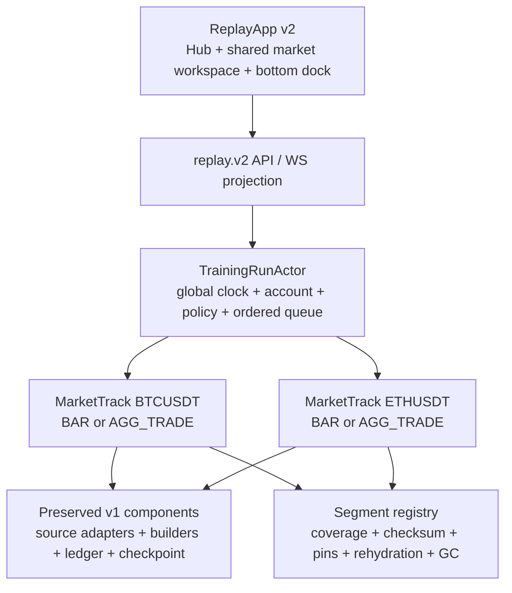
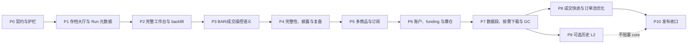

# CandleScope 回放训练 v2 重构执行文档

状态：`PHASE_11_COMMITTED / RELEASE_PENDING`。Phase 10 的 `PHASE_10_PASS` 只对仓库外 `H:\program\CandleScope-release-evidence\<完整 Phase 10 HEAD>\replay-v2\release-manifest.json` 所绑定的 clean HEAD 有效；当前 Phase 11 提交已完成全量测试、生产构建和真实浏览器验收，但没有重新生成该 HEAD 的发布清单，所以不得继承或宣称 Phase 10 的发布 PASS。仓库发布开关继续默认关闭；提交 PASS 不授权生产启用，真实容量、告警、支持清单、观察窗与显式决策仍未完成。

工作树：`H:\program\CandleScope-kline-replay`

分支：`codex/kline-replay-training`

Phase 0 父提交：`2346dba32c0ce9e35dd6941bc4445366da4362a7`（2026-07-21）

Phase 1 父提交：`bb253d0982c36776452c2b1e0a0cf3f1b211162f`（2026-07-21）

Phase 5 父提交：`c6921c9f7f813adabd452e162719baf20d700fb8`（2026-07-21）

Phase 7 父提交：`463bd0ba679d6e10baa0f0958231e96220590ee7`（2026-07-22）

Phase 8 父提交：`41d6fc1049493b1ccaec5c8deb8a64b788277d14`（2026-07-22）

Phase 9 父提交：`ad233cfe5abe49565ffd5852b540a78453498a64`（2026-07-22）

Phase 10 父提交：`afd802a1617daf6a05f25a1b9318fbc3da341b5c`（2026-07-22）

Phase 11 父提交：`382923ecabaab153a47e1d145ca96eb8d9a8cb67`（2026-07-24）

产品真值：[`KLINE_REPLAY_TRAINING_PRODUCT_CONTRACT_zh.md`](KLINE_REPLAY_TRAINING_PRODUCT_CONTRACT_zh.md)

---

## 1. 本轮为什么必须重构

Replay v1 已经建立了一套可靠的确定性历史运行内核，但当前产品层把“回放”做成了一个固定单商品、固定展示周期、简化顶栏、替代式右栏的专用页面。它能证明后端核心可行，却不符合目标训练体验。

v2 的目标不是推倒 v1 重做，而是保留经过验证的安全内核，重构上层领域与工作台：

- 从“创建一个单商品 Session”升级为“创建或加载一个组合级训练存档”；
- 从“看起来像行情页的简化页面”升级为“与实时行情共用完整视觉骨架的 replay 工作台”；
- 从一个 `blind_mode` 布尔值升级为可验证的时间披露策略与完整性模式；
- 从固定 `display_interval` 升级为全局虚拟时钟、基础推进粒度和可切换视图周期的分离；
- 从单商品 Broker 升级为多商品统一账户、按需订阅、资金费、保证金和爆仓；
- 从顺序扫完所有历史事件升级为能够证明何时可跳转、何时必须全量处理、何时必须阻止的快进规划器；
- 从“存了领域日志”升级为可在存档大厅恢复、查看资金曲线、复盘用户操作和安全回收历史数据。

本执行文档只规定迁移顺序、代码边界、测试、退出门槛和回滚。任何产品语义争议先修订产品合同，再进入实现。

---

## 2. 当前基线与历史证据

### 2.1 当前工作树状态

本文重写时已确认：

```text
branch: codex/kline-replay-training
HEAD:   2346dba32c0ce9e35dd6941bc4445366da4362a7
status: clean before documentation edits
main:   2346dba32c0ce9e35dd6941bc4445366da4362a7
```

开始任何代码 Phase 前必须重新确认 branch、HEAD、`git status --short` 和 `git worktree list`；不能把本文记录当作未来事实。

### 2.2 v1 已验证能力，必须保留

| v1 能力 | v2 处理原则 |
|---|---|
| `replay.v1` canonical model、稳定错误码和 Decimal 边界 | 保留并版本化；破坏性字段进入 `replay.v2`，不静默改变 v1 hash。 |
| BAR catalog、coverage、随机起点、不可变 dataset snapshot | 作为 `MarketTrack` 的 BAR adapter；扩展到按需 segment，不绕过覆盖检查。 |
| AGG_TRADE checksum/import/audit、分页读取、pin/release | 作为成交轨道数据源；继续明确 aggregate trade 不是 raw trade。 |
| 单写者 `ReplaySessionActor`、服务端虚拟时钟、幂等 command | 演化为 `TrainingRunActor` 的确定性核心或受其协调的纯组件；禁止并发写账户。 |
| BAR/aggTrade replay bar builder | 变成每个 `MarketTrack` 的可 checkpoint 组件；支持视图周期重建。 |
| `PAPER_LINEAR_V1` Broker、Ledger、Report | 逐阶段扩展，账本守恒和独立重算不能退化。 |
| SQLite commit-before-publish、checkpoint、重启恢复、fork | 迁移为 run 级事务和多轨 checkpoint；恢复后仍只到 `PAUSED`。 |
| HTTP/WS snapshot-to-live、sequence/epoch/resync | 扩展为 `replay.v2` 投影；未知缺口继续 fail closed。 |
| 独立 `ReplayApp`、live/replay 网络隔离、no-lookahead 审计 | 永久保留；“复用完整页面”不等于挂载 live runtime。 |
| 跨进程 golden、1M aggTrade benchmark、4 小时 browser soak、rollback drill | 作为 v2 回归基线；新增组合和产品流程门禁。 |

### 2.3 当前实现与产品合同的差距

| 当前实现 | 目标差距 |
|---|---|
| `ReplaySessionDialog` 只有新建表单 | 缺少存档列表、恢复、版本状态、重新下载和 ReviewMode 入口。 |
| `ReplaySessionConfig` 固定一个 symbol、source 和 display interval | 缺少组合级 Run、MarketTrack、ViewerState 和可切换周期。 |
| `ReplayPageShell` 使用自定义简化顶栏与绘图条 | 没有复用完整 TopBar、周期栏、ChartWorkspace 和 feature surfaces。 |
| `ReplayRightRail` 替换实时自选与市场 dock | 与“保留自选、订单簿/订单流槽位、加入模拟交易 dock”冲突。 |
| `ReplayControlBar` 位于周期栏附近且命令固定 | 缺少底部 dock、展示 K/基础 K/成交事件三套明确控制。 |
| 图表 `onNeedMoreLeft=null` | 缺少开始点之前的 replay-aware backfill。 |
| API 有 create/get-by-id/command/fork/report/journal | 缺少可分页存档列表、轨道管理、订阅、资金曲线和数据恢复 API。 |
| 单商品 Actor/Broker | 缺少全局多商品总序、组合风险和强制 FULL 轨道。 |
| fee/slippage/max leverage 为创建时静态字段 | 缺少版本化规则变更、历史 funding、cross/isolated 和维护保证金阶梯。 |
| `advance_by` 顺序消费事件 | 正确但缺少可解释的 fast-forward planner 和安全加速路径。 |

### 2.4 v1 历史记录如何保留

旧版 2,488 行执行与验收记录的最后提交为：

```text
commit: f70234bf1b36f905c46430cc6241b7335987f8ed
blob:   796ba84041066878be81e74d95b7252a208ef0fa
path:   docs/KLINE_REPLAY_TRAINING_EXECUTION_zh.md
```

需要核对 v1 Phase 0–9 的实际命令、hash 和 rollback evidence 时使用：

```powershell
git show f70234bf1b36f905c46430cc6241b7335987f8ed:docs/KLINE_REPLAY_TRAINING_EXECUTION_zh.md
```

正式性能证据继续以仓库中的 `docs/perf-baselines/replay-*.json` 及 release-evidence 产物为准。本文不复制旧记录，避免两个可修改副本变成双真值。

---

## 3. 执行纪律

1. 只在 `H:\program\CandleScope-kline-replay` 实施本计划。
2. 每次只实现一个 Phase；完成测试、证据、执行记录和独立提交后再进入下一 Phase。
3. 先写契约测试和失败用例，再写最小实现；不能为了过门禁放宽 exact、coverage、hash、账本或 no-lookahead 语义。
4. 默认保持 `REPLAY_ENABLED=0`、`VITE_REPLAY_ENTRY_ENABLED=0`、`RAW_AGG_TRADE_ARCHIVE_ENABLED=0`。
5. v2 增加独立选择开关；未通过 Phase 10 前不得让普通用户路径默认进入 v2。
6. replay 开发实例使用独立端口、SQLite 和 archive；禁止读写主工作树活动数据库。
7. 所有 schema 迁移先加后减；在至少两个可回滚发布窗口内不删除 v1 表和 v1 读取路径。
8. 每个 Phase 都必须提供运行时开关回滚和提交级回滚证据；回滚不得删除存档或历史 archive。
9. 若同一错误无法在当前 Phase 内通过正确修复解决，停止并报告；不得改测试、提高容差或把 exact 改成 best-effort。
10. 产品合同未冻结的 L2 queue model、默认资源预算等不能由实现者私自决定。

### 3.1 固定开发端口与目录

| 服务 | 回放工作树端口 |
|---|---:|
| Vite | `15175` |
| FastAPI | `18082` |

推荐本地目录：

```text
backend/data/replay-dev/source-candlescope.db
backend/data/replay-dev/replay-v1.db
backend/data/replay-dev/replay-v2.db
backend/data/replay-dev/raw_agg_trades/
backend/data/replay-dev/replay_segments/
```

开发早期让 v1/v2 使用不同 replay DB。只有迁移门禁通过后，才允许在可恢复快照上验证同库升级。

### 3.2 建议的新增开关

| 开关 | 默认 | 所有权 |
|---|---:|---|
| `REPLAY_ENABLED` | `0` | 后端总开关，保持权威 |
| `REPLAY_PRODUCT_V2_ENABLED` | `0` | 后端 run/protocol/schema v2 开关 |
| `VITE_REPLAY_ENTRY_ENABLED` | `0` | live 页入口显示 |
| `VITE_REPLAY_PRODUCT_V2_ENABLED` | `0` | replay document 选择 v2 hub/workspace |
| `RAW_AGG_TRADE_ARCHIVE_ENABLED` | `0` | 成交 archive 能力 |
| `REPLAY_HISTORICAL_BOOK_ENABLED` | `0` | Phase 9 可选 verified Binance USD-M 历史 L2；关闭时既有 BOOK Run 明确暂停/降级，不回退成交模型 |
| `REPLAY_HISTORICAL_BOOK_MAX_ARCHIVE_BYTES` | `1099511627776` | 受管历史盘口对象总预算，默认 1 TiB；可收紧不可超过冻结上限，回收只允许显式 dry-run/run 且活动 pin 受保护 |
| `REPLAY_SEGMENT_DOWNLOAD_WORKER_ENABLED` | `0` | 外部 segment 下载生产者开关；Phase 7 不自动启动远程下载 |
| `REPLAY_SEGMENT_AUTO_GC_ENABLED` | `0` | segment 自动 GC 调度开关；Phase 7 只开放显式 dry-run/run |
| `REPLAY_FAST_FORWARD_OPTIMIZATION_ENABLED` | `0` | Phase 8 无账户路径依赖时的有界扫描、状态物化与投影合并；关闭后统一走 `FULL_EVENT_SCAN` |

前端开关从来不是安全边界。v2 直接 URL、API、WS 和后台任务都必须由后端 capability 拒绝。

### 3.3 本地环境与独立启动

首次准备工作树：

```powershell
Set-Location H:\program\CandleScope-kline-replay\backend
if (-not (Test-Path -LiteralPath '.venv')) {
    py -m venv .venv
}
.\.venv\Scripts\python.exe -m pip install -r requirements.txt

Set-Location ..\frontend
npm ci
```

BAR 开发数据使用现有一致性快照工具，不能直接复制正在写入的 SQLite：

```powershell
Set-Location H:\program\CandleScope-kline-replay\backend
$replayDataRoot = 'H:\program\CandleScope-kline-replay\backend\data\replay-dev'
New-Item -ItemType Directory -Force -Path $replayDataRoot | Out-Null
.\.venv\Scripts\python.exe scripts\snapshot_replay_klines.py `
  --source 'H:\program\CandleScope\backend\data\candlescope.db' `
  --destination "$replayDataRoot\source-candlescope.db" `
  --require-quick-check
```

Phase 0 新开关落地后，后端专用启动示例：

```powershell
Set-Location H:\program\CandleScope-kline-replay\backend
$env:PYTHONUTF8 = '1'
$env:PYTHONIOENCODING = 'utf-8'
$env:CANDLE_DATA_DIR = 'H:\program\CandleScope-kline-replay\backend\data\replay-dev'
$env:KLINES_DB_PATH = 'H:\program\CandleScope-kline-replay\backend\data\replay-dev\source-candlescope.db'
$env:REPLAY_DB_PATH = 'H:\program\CandleScope-kline-replay\backend\data\replay-dev\replay-v2.db'
$env:RAW_AGG_TRADE_ARCHIVE_DIR = 'H:\program\CandleScope-kline-replay\backend\data\replay-dev\raw_agg_trades'
$env:REPLAY_ENABLED = '1'
$env:REPLAY_PRODUCT_V2_ENABLED = '1'
$env:RAW_AGG_TRADE_ARCHIVE_ENABLED = '0'
$env:REPLAY_HISTORICAL_BOOK_ENABLED = '0'
$env:REPLAY_SEGMENT_DOWNLOAD_WORKER_ENABLED = '0'
$env:REPLAY_SEGMENT_AUTO_GC_ENABLED = '0'
$env:REPLAY_FAST_FORWARD_OPTIMIZATION_ENABLED = '0'
.\.venv\Scripts\python.exe -m uvicorn app.main:app --reload --host 127.0.0.1 --port 18082
```

另开终端启动前端：

```powershell
Set-Location H:\program\CandleScope-kline-replay\frontend
$env:VITE_API_PROXY_TARGET = 'http://127.0.0.1:18082'
$env:VITE_DEV_PORT = '15175'
$env:VITE_REPLAY_ENTRY_ENABLED = '1'
$env:VITE_REPLAY_PRODUCT_V2_ENABLED = '1'
npm run dev
```

这些 `=1` 只用于当前 Phase 的显式本地验证。完成验证和正式提交前恢复默认关闭，并通过 capability/入口审计证明没有残留默认启用。

---

## 4. 不可妥协的不变量

### 4.1 权威性

- 服务端拥有 VirtualTime、cursor、账户、规则版本、订阅强制状态和公开时间映射。
- 前端只提交带 command ID、expected revision 和 controller lease 的意图。
- 任何账户变更必须先持久化，再 publish；UI optimistic state 不能冒充成交或入金成功。

### 4.2 确定性

- 相同 protocol、config、dataset identities、commands 和 checkpoint 必须得到相同事件序列、ledger、report 和 state hash。
- wall clock、浏览器帧率、播放倍率、网络重连和当前查看周期不进入领域 hash。
- 多商品同时间事件必须使用版本化稳定总序，不能依赖 Python/JS map 顺序或 task 调度。

### 4.3 无未来数据

- replay document 不访问 live 数据源。
- 所有图表、指标、订单流、PnL 和风险只读已经揭示的数据前缀。
- 左侧 backfill 可以读取开始点之前的数据，但不得返回 cursor 之后的数据。
- 时间隐藏在服务端边界完成；真实时间不能先发到浏览器再遮住。

### 4.4 路径依赖不能被快进跳过

有持仓、订单、条件触发、funding、liquidation 或其他路径依赖时，必须逐事件得到等价结果，或明确阻止。任何聚合优化都要有 step-by-step equivalence 证明。

### 4.5 组合时钟不能分叉

任一强制 `FULL` MarketTrack 不能推进时，整个 TrainingRun 暂停。不能出现 BTC 已到 12:05、ETH 仍在 12:04 但账户继续计算的状态。

### 4.6 账本与规则不追溯

- 余额、保证金、费用、funding、已实现 PnL 和 liquidation fee 必须逐项记账且可独立重算。
- 入金或规则变更从其虚拟时刻起生效；不能重写旧成交。
- 任何 Decimal 非有限值、舍入策略漂移或账本不守恒都 fail closed。

### 4.7 数据身份与 GC

- 每条轨道绑定不可变或可确定重建的数据身份。
- 存档引用的数据要么被 pin，要么有可信来源、checksum 和完整 rehydration manifest。
- GC 不得让一个原本可恢复的存档静默变成不可恢复。

### 4.8 实盘硬隔离

replay 模块不得读取交易所私钥、实盘账户、私有下单 client 或任何真实资金接口。模拟“市价/限价”只能进入 replay broker。

---

## 5. 迁移策略

采用“保留 v1 内核、增加 v2 父层、逐步替换产品壳”的策略，而不是一次性重写。

### 5.1 三层边界



### 5.2 v1 兼容策略

- 现有 `replay_session` 记录在大厅中显示为 `LEGACY_V1`。
- Phase 1 先提供只读元数据和兼容恢复入口，不改写 v1 config/hash。
- v1 -> v2 迁移必须创建新 `TrainingRun`，记录 parent legacy session；原 v1 数据保持不变。
- 若 legacy dataset 已丢失且不可重建，显示不可恢复原因；不能伪造为一个空 v2 存档。
- v2 稳定前保留旧 `ReplayApp` 选择开关，便于功能级回滚。

### 5.3 领域对象

#### `TrainingRun`

至少包含：

```text
run_id
protocol_version
status
name
scope(exchange, market_type, settlement_asset)
replay_mode(BAR or AGG_TRADE)
book_mode(OFF or BOOK_ASSISTED_REQUIRED)
virtual_time
integrity_mode
time_disclosure_policy
active_rule_revision
account_state
track_registry
viewer_state
parent_ref
created_at / updated_at / ended_at
state_hash
```

#### `MarketTrack`

至少包含：

```text
track_id
market_identity(exchange, market_type, symbol)
source_kind
base_interval
dataset_refs[]
source_cursor
bar_builder_state
subscription_tier
forced_full_reasons[]
capability_snapshot
track_state_hash
```

`MarketTrack.source_kind` 必须等于所属 `TrainingRun.replay_mode`。v2 core 不允许在同一 Run 中混用 BAR 与 AGG_TRADE；轨道数据不足时拒绝升级，不能自动换 source。

#### `ViewerState`

至少包含：

```text
selected_track_id
display_interval
chart_type
visible_range
pane_layout
rail_layout
semantic_view_revision
```

`ViewerState` 不进入市场和账户确定性 hash；需要复盘的语义化视图事件单独持久化。

### 5.4 单写者方案

首版使用一个 `TrainingRunActor` 作为账户与全局时钟的唯一写者。各 MarketTrack 可以并行预取、校验和解码，但进入领域 reducer 前必须形成稳定有序事件流。不得让每个 symbol actor 并发写同一账户后再补偿。

未来若分片，仍需一个可证明的组合 commit barrier；在没有等价性证据前不做。

---

## 6. 后端目标边界

### 6.1 建议模块所有权

现有 `backend/app/replay/` 保留；新增模块按责任组织：

```text
backend/app/replay/
  training/
    models.py              # TrainingRun / MarketTrack / ViewerState / policies
    actor.py               # global single writer and ordered merge
    service.py             # run lifecycle and capacity ownership
    commands.py            # replay.v2 command validation
    events.py              # replay.v2 domain and projection events
    ordering.py            # stable cross-track total order
    fast_forward.py        # planner and equivalence modes
    review.py              # read-only review cursor and fork
  segments/
    models.py              # immutable segment identity and health
    registry.py            # refs, pins, coverage and usage
    rehydration.py         # trusted restore/download plans
    gc.py                  # dry-run and safe reclaim
  broker/
    margin.py              # cross / isolated
    funding.py             # historical funding settlement
    liquidation.py         # mark + maintenance tiers + events
    instruments.py         # versioned symbol rules
```

这些路径是建议所有权；实施时可在同一责任边界内调整。不得把组合账户逻辑放进 data source，也不得把下载/GC 放进 actor reducer。

### 6.2 replay.v2 API 草案

仓库总 API 仍可位于 `/api/v1`，但 replay wire envelope 使用独立 `protocol: replay.v2`，避免把 API root 版本与领域协议混为一谈。

| 方法 | 路径 | 用途 |
|---|---|---|
| GET | `/api/v1/replay/capabilities` | 返回 v1/v2、数据源、历史面板和资源能力 |
| GET | `/api/v1/replay/runs` | 分页列出轻量存档元数据，含 legacy v1 |
| POST | `/api/v1/replay/runs` | 原子创建 TrainingRun |
| GET | `/api/v1/replay/runs/{run_id}` | 获取恢复 bootstrap 元数据；权威市场 snapshot 仍通过 WS 原子交接 |
| POST | `/api/v1/replay/runs/{run_id}/commands` | 提交 run/track/account/controller 命令 |
| POST | `/api/v1/replay/runs/{run_id}/tracks` | 在 scope 内准备新 MarketTrack |
| PATCH | `/api/v1/replay/runs/{run_id}/tracks/{track_id}` | 修改订阅意图；服务端返回强制 tier |
| GET | `/api/v1/replay/runs/{run_id}/history` | replay-aware 左侧 backfill，只返回公开时间和 revealed boundary 内数据 |
| GET | `/api/v1/replay/runs/{run_id}/equity` | 有界、多分辨率资金曲线 |
| GET | `/api/v1/replay/runs/{run_id}/journal` | 训练日志与规则事件 |
| GET | `/api/v1/replay/runs/{run_id}/report` | 权威报告与 fidelity |
| POST | `/api/v1/replay/runs/{run_id}/review` | 创建只读 review cursor |
| POST | `/api/v1/replay/runs/{run_id}/fork` | 从当前或 review event 创建新存档 |

WS 可继续使用 `/api/v1/stream/replay/{run_id}`，但连接握手必须声明期望 `replay.v2`。v1/v2 payload parser 严格分离；未知协议不得 best-effort 解析。

### 6.3 command 分类

```text
controller: acquire, heartbeat, release, takeover
transport:  play, pause, set_speed, step_event, step_base,
            step_display, advance_by, advance_to, cancel_advance
viewer:     select_track, set_display_interval, set_chart_type,
            record_view_action
track:      add_track, set_subscription_tier, remove_unowned_track
account:    place_order, cancel_order, close_position,
            allocate_isolated_margin
policy:     deposit, withdraw, change_fee_policy,
            change_leverage_cap, change_funding_policy, reveal_time
lifecycle:  save, end, fork, start_review
```

每个命令都要定义：允许状态、controller 要求、expected revision、幂等 key、原子处理边界、是否进入 state hash、是否允许在各 IntegrityMode 使用。

### 6.4 projection 分类

- `RUN_SNAPSHOT`：恢复用完整有界 snapshot；
- `RUN_STATE_CHANGED`：状态、时钟、controller、规则 revision；
- `TRACK_PROJECTION`：每轨已揭示 K 线/价格/capability/cursor；
- `ACCOUNT_PROJECTION`：余额、保证金、持仓、订单、成交和风险；
- `AUDIT_EVENT`：规则变更、入金、解密、强制降级；
- `ADVANCE_PROGRESS`：快进计划、进度、预计剩余和取消结果；
- `RESYNC_REQUIRED`：sequence/epoch/identity 未知缺口。

普通高频轨道更新可合并，但成交、爆仓、状态变化、规则变化、PAUSED、ENDED 和 error 必须立即 flush。

### 6.5 SQLite v2 schema

Phase 1 起只做 additive migration，建议新增：

```text
replay_training_run
replay_market_track
replay_run_rule_revision
replay_run_command_log
replay_run_event
replay_track_checkpoint
replay_account_checkpoint
replay_run_action_event
replay_run_view_event
replay_equity_sample
replay_data_segment
replay_data_segment_pin
replay_rehydration_manifest
```

硬约束：

- run 创建、首轨 dataset ref、初始账户、初始规则和首 checkpoint 同事务；
- command、领域变更、账本、checkpoint 和 publish cursor 使用可证明的 commit boundary；
- segment pin 使用外键或等价的原子引用，GC 不能与新 pin 竞态；
- v1 表不重命名、不删除、不就地改写 JSON；
- schema migration 可重入、可在旧 build 下安全忽略新增表；
- migration 前后都运行 `quick_check`，并保留可恢复文件快照。

---

## 7. 前端目标边界

### 7.1 共享视图，隔离 runtime

当前已经存在 source-neutral `MarketPageFrame` 与 `MarketWorkspaceFrame`，v2 继续把以下层次拆清：

```text
shared visual components / view models
  <- live adapters owned by App
  <- replay adapters owned by ReplayApp
```

优先复用：

- `frontend/src/app/MarketPageFrame.tsx`
- `frontend/src/app/MarketWorkspaceFrame.tsx`
- `frontend/src/app/TopBar.tsx`
- `frontend/src/components/IntervalSelector.*`
- `frontend/src/app/ChartWorkspace.tsx`
- `frontend/src/app/RightMarketRail.tsx`
- `frontend/src/app/StatusBar.tsx`
- 图表、绘图、pane lifecycle、layout preference 和 `SeriesWindowStore` 契约。

需要提取的是纯 props/view-model 合同，不是让 replay 伪造 `useMarketDataRuntime` 类型。

### 7.2 计划新增或替换的产品组件

```text
frontend/src/features/replay/
  hub/
    TrainingHubDialog.tsx
    TrainingRunList.tsx
    TrainingRunCard.tsx
    TrainingCreateWizard.tsx
    ReplayCapabilitySummary.tsx
  workspace/
    ReplayMarketWorkspaceAdapter.tsx
    ReplayRightRailAdapter.tsx
    ReplayCapabilitySurface.tsx
    ReplayPaperTradingDock.tsx
    ReplayBottomControlDock.tsx
  runtime/
    useTrainingRunRuntime.ts
    useReplayTrackRuntime.ts
    useReplayWatchlistRuntime.ts
    useReplayHistoryRuntime.ts
    useReplayCapabilityRuntime.ts
  review/
    ReplayReviewTimeline.tsx
    ReplayEquityCurve.tsx
```

旧 `ReplaySessionDialog`、`ReplayControlBar`、`ReplayRightRail` 在对应新组件通过验收后删除；不能先删旧 UI 再留下不可用空壳。

### 7.3 自选与订阅

- 复用自选分组、排序、宽度和折叠 preference；不复用 live `/subscriptions` 状态。
- 新建 replay-local `NONE/WARM/FULL` store 和 API。
- Watchlist row 必须显示 tier、公开时间下的价格状态和强制 FULL 原因。
- 选中 `NONE/WARM` 商品时先提交原子 track prepare；成功前旧主图继续可见，不能显示 live 或陈旧缓存假装切换成功。

### 7.4 历史 backfill

复用 live 的范围规划、取消、合并、缓存预算和 store delta，但引入 `ReplayHistoryProvider`：

```text
onNeedMoreLeft
  -> plan uncovered older range
  -> GET run-scoped replay history
  -> validate public time + track identity + <= revealed boundary
  -> SeriesWindowStore prepend/replace delta
```

architecture test 必须禁止 replay provider 调用 live Kline API。

### 7.5 capability surface

OI、市场爆仓、mark/index/basis、funding、订单簿和订单流都通过统一 `CapabilityState` 渲染。组件在 `DEGRADED` 时立即清空精确数据；不能保留上一次值配一个小灰点。

### 7.6 页面数据泄漏审计

盲测扫描至少覆盖：

- fetch request/response；
- WebSocket 收发；
- DOM 文本和 data attributes；
- ARIA/accessibility tree；
- URL、history state、window name；
- localStorage、sessionStorage、IndexedDB；
- console/error stack 和导出文件。

---

## 8. 关键算法合同

### 8.1 `STEP_DISPLAY`

输入包含 `display_interval`、`count`、expected run revision 和 expected virtual cursor。服务端根据市场日历与 base events 计算：

1. 当前 cursor 是否位于 display bucket 中间；
2. 若在中间，第一步目标为当前 bucket 的确定性收口边界；
3. 剩余 count 逐个推进完整 display bucket；
4. 中间每个 base event 仍进入 builder、broker、risk 和 ledger；
5. 轨道或账户事件失败时整个命令原子停止在最后已提交事件边界。

### 8.2 多轨事件总序

候选稳定 key：

```text
(actual_event_time_ms, event_phase, market_track_stable_id, source_sequence)
```

`event_phase` 至少冻结 funding settlement、market input、order trigger、risk/liquidation 和 post-event projection 的相对次序。最终 key 必须通过同一时间多商品、不同 source kind、重启恢复和跨进程 golden 证明。

### 8.3 强制 FULL 规则

`forced_full_reasons` 是服务端派生集合，例如：

```text
VIEWED
OPEN_POSITION
OPEN_ORDER
CONDITIONAL_ORDER
PENDING_FUNDING
LIQUIDATION_RISK
REVIEW_REQUIRED
```

实际 tier 为用户意图与强制原因的上界。强制原因变化和 tier 转换必须持久化并参与 run 恢复。

### 8.4 快进计划

规划输入：目标时刻、所有 FULL tracks、账户路径依赖、规则结算点、checkpoint、segment coverage 和资源预算。

规划输出：`CHECKPOINT_JUMP`、`AGGREGATE_SCAN`、`FULL_EVENT_SCAN` 或 `BLOCKED`，以及原因、预计事件数、所需数据段和是否可取消。

每一种优化路径都必须与逐事件 reference runner 比较：最终 cursor、tracks、orders、fills、positions、ledger、funding、liquidation、equity 和 report hash 全相等。

### 8.5 资金曲线

- 权威权益点在账户发生语义变化、固定虚拟采样边界和结束事件时生成。
- 原始点有界存储；长训练按 min/max/last 或等价保形算法生成多分辨率层级。
- 降采样不能用于账本重算，只用于展示。
- ReviewMode 可从曲线点定位到最近领域事件。

---

## 9. 全局验证与证据规则

### 9.1 每个代码 Phase 的最低门禁

```powershell
Set-Location H:\program\CandleScope-kline-replay
git status --short

Set-Location backend
.\.venv\Scripts\python.exe -m ruff check app tests scripts
.\.venv\Scripts\python.exe -m pytest -q

Set-Location ..\frontend
npm run check

Set-Location ..
git diff --check
```

若全仓 ruff 当前基线不允许，则 Phase 0 记录准确的既有范围，之后所有新增/修改 Python 文件必须 ruff clean；不得把新增违规归为历史问题。

### 9.2 必须保留的 v1 回归

- replay.v1 canonical golden；
- BAR 与 AGG_TRADE determinism；
- ledger 独立重算；
- sequence/epoch/resync；
- no-lookahead；
- 1M aggTrade 有界内存与分页；
- 4 小时 browser lifecycle soak；
- feature flag 与旧 build rollback。

### 9.3 v2 新增证据

- 存档大厅真实浏览器流程：新建、失败回滚、暂停、恢复、结束、Review、Fork；
- live/replay 结构与视觉骨架一致性；
- replay 页面全程零 live 数据请求；
- 时间披露 7 档的跨边界泄漏扫描；
- base/display/event 三套控制的 reference equivalence；
- 1、2、4、8 个 FULL tracks 的总序、吞吐、内存和恢复矩阵；
- `NONE` 零读取、`WARM` 有界准备、强制 FULL 风险继续计算；
- cross/isolated、fee、funding、liquidation 账本场景；
- fast-forward 四种计划与逐事件等价/拒绝证据；
- data segment pin、GC dry-run、冷恢复和不可重建保护；
- v1 legacy 只读、迁移和回滚。

### 9.4 性能门槛冻结方式

不在设计文档里拍脑袋写毫秒或轨道上限。每个相关 Phase 先运行真实 fixture baseline，再提交版本化 JSON：

```text
docs/perf-baselines/replay-v2-hub-*.json
docs/perf-baselines/replay-v2-multitrack-*.json
docs/perf-baselines/replay-v2-fast-forward-*.json
docs/perf-baselines/replay-v2-browser-soak-*.json
```

基准必须记录机器、HEAD、dataset hash、参数、p50/p95/max、RSS/heap late-half、queue high-water、page/segment 次数和阈值来源。阈值只允许通过单独文档修订收紧或基于证据调整。

### 9.5 发布证据目录

正式证据写到 Git 外、按 clean HEAD 绑定的目录：

```powershell
$replayHead = (git rev-parse HEAD).Trim()
$evidenceRoot = "H:\program\CandleScope-release-evidence\$replayHead\replay-v2"
New-Item -ItemType Directory -Force -Path $evidenceRoot | Out-Null
```

脚本必须拒绝 dirty worktree、运行中 HEAD 改变和证据目录复用到不同 commit。

---

## 10. Phase 依赖总览



Phase 9 是可选后续能力，不阻塞 v2 core 发布；Phase 10 必须在历史 L2 关闭状态下也完整通过。

---

## 11. Phase 0：冻结 v2 契约、开关与架构护栏

### 目标

把本文和产品合同转成可执行的 protocol/schema/architecture tests，不新增可见 v2 产品流。

### 主要任务

1. 冻结 `replay.v2` 枚举：run/track 状态、source、integrity、time disclosure、subscription tier、capability、fast-forward plan。
2. 新增 v2 canonical fixture 与跨 Python/TypeScript 类型对照。
3. 新增 `REPLAY_PRODUCT_V2_ENABLED` 和 `VITE_REPLAY_PRODUCT_V2_ENABLED`，默认关闭。
4. architecture guard 禁止 `ReplayApp` 导入 live runtime、live subscription、live order book/trade flow/advanced-market hooks。
5. 记录 v1 golden/performance/rollback baseline 的文件 hash；验证现有 v1 tests 不变。
6. 冻结 additive schema migration 原则和 v1 legacy 不改写合同。

### 建议文件

```text
backend/app/replay/training/{models,commands,events}.py
backend/tests/test_replay_v2_contracts.py
backend/tests/fixtures/replay/v2_contract_golden.json
frontend/src/features/replay/replayV2Types.ts
frontend/src/features/replay/__tests__/replayV2Architecture.test.ts
frontend/scripts/check-architecture*.mjs
backend/app/core/config.py
frontend/.env.replay.example
backend/.env.replay.example
```

### 必测

- 所有非法 enum、identifier、Decimal、revision、cursor、time policy 和 tier 拒绝；
- v1 fixture byte/hash 不变；
- 两个 v2 开关默认关闭，直接 URL/API/WS fail closed；
- forged protocol、unknown capability 和 time disclosure 降级拒绝；
- architecture fixtures 对 live value import fail。

### 退出门槛

- 文档中的全部硬枚举有唯一代码定义与 golden；
- 默认构建没有 v2 可见入口或后台任务；
- v1 全量门禁通过；
- rollback 后代码和配置回到 Phase 0 前，v1 DB 未改变。

### 建议提交

```text
chore(replay): freeze replay v2 product and protocol boundaries
```

---

## 12. Phase 1：TrainingRun 存储、存档列表与训练大厅

### 目标

先交付“像游戏存档”的完整入口，但活动训练仍可暂时通过单 MarketTrack adapter 运行。

### 主要任务

1. additive 创建 `replay_training_run`、初始 track/rule/action 表和 schema version。
2. 实现分页 `GET /runs`，只读取轻量元数据，不加载 dataset。
3. 实现原子 `POST /runs`；内部先适配 v1 单轨 source/actor，不复制核心。
4. legacy v1 session 显示 `LEGACY_V1`，提供兼容打开或明确不可恢复状态。
5. 新建 `TrainingHubDialog`、Run list/card、Create wizard 和 capability summary。
6. 创建表单覆盖产品合同字段；尚未实现的 funding/L2/multi-symbol 能力必须 disabled 并解释，不得保存后假装生效。
7. 返回大厅前 checkpoint；controller 失联后自动暂停。

### 必测

- 空列表、数千存档分页、排序、过滤和 blind metadata 脱敏；
- 原子创建每个失败点的事务与 pin 回滚；
- capability epoch 在校验与创建间漂移时拒绝；
- legacy v1 列表、恢复、不可恢复、迁移不改原 hash；
- 浏览器新建/恢复/关闭/刷新，大厅不批量下载 dataset；
- 直接 replay URL 无 opener 正常进入大厅。

### 退出门槛

- 用户不再被迫先填新建表单；已有训练可发现、可继续或得到明确故障解释；
- 存档列表请求的 IO 与存档数据段总量无关；
- v2 开关关闭时旧 ReplayApp 完整可用；
- schema downgrade/old build 忽略新增表，v1 记录不变。

### 回滚

关闭 v2 选择开关回到 v1 UI。新增表保留，不删除用户新建 Run；旧 build 忽略它们。

### 建议提交

```text
feat(replay): add training run saves and replay hub
```

---

## 13. Phase 2：完整实时骨架、能力占位与 replay backfill

### 目标

训练页面结构与实时行情共用组件，同时保持 runtime 和网络完全隔离。

### 主要任务

1. 为 TopBar、IntervalSelector、ChartWorkspace、RightMarketRail、StatusBar 提取 source-neutral props/view models。
2. `AppShell` 与 `ReplayPageShell` 组合同一组件树；禁止复制 CSS 和 DOM 结构。
3. replay 继承主题、图表、pane、rail 宽高与折叠 preference；数据 store 仍隔离。
   指标配置可作为初始模板，绘图/提醒与训练中视图状态必须 run-scoped，blind Run 不导入带真实时间锚点的 live drawing。
4. 自选列表回到右栏；新增 replay-local tier 状态，但本 Phase 可只让主商品 FULL。
5. 模拟交易进入 existing rail dock/tab，替代旧的整栏 `ReplayRightRail`。
6. 控制条迁移到 `ReplayBottomControlDock`；本 Phase 可先接 v1 command。
7. 实现 `ReplayHistoryProvider` 与 `onNeedMoreLeft`，复用 backfill planner/store delta。
   Phase 2 先只读一致性快照并绑定 history epoch；Phase 7 再统一迁入 segment registry，禁止查询活动生产库。
8. OI、市场爆仓、mark/index/basis、funding、订单簿、订单流使用统一 capability surface。
9. 绘图与可本地计算指标只读 revealed prefix；hosted/range/security 未有 replay provider 时明确 disabled。

### 必测

- live/replay component ownership 与关键 DOM slot 一致；
- 1600×1000、常用缩放和窄宽度下 rail/dock/chart 不互相遮挡；
- rail resize、collapse、pane lifecycle、theme 和 drawing parity；
- replay 网络 allowlist 只有 replay endpoints；error/loading/unsupported 同样零 live 请求；
- left backfill 能加载更早数据、去重、取消，且 `max_time <= revealed boundary`；
- backfill 响应绑定 track/history epoch，source identity 漂移时拒绝；
- unsupported 不显示 0，不保留 stale precise values。

### 退出门槛

- 旧自定义 replay 顶栏、假绘图条、替代式整栏和上方控制条不再出现在 v2 路径；
- live 普通 smoke 与 replay smoke 同时通过；
- 视觉差异只剩产品合同允许的 replay 身份、capability、paper dock 和 bottom dock；
- `ReplayApp` 仍可在 live 后端在线时证明零 live market request。

### 回滚

v2 flag 返回旧 shell；共享组件的 props 提取必须保持 live snapshot/interaction tests，单提交可 revert。

### 建议提交

```text
feat(replay): reuse the complete market workspace in replay
```

---

## 14. Phase 3：ViewerState 与 BAR/成交操控语义

### 目标

解除 `display_interval` 与 session identity 绑定，完整实现底部控制坞的三种推进粒度。

### 主要任务

1. 从不可变 run config 移出 `display_interval`，迁移到 `ViewerState`。
2. 实现 `STEP_DISPLAY`、`STEP_BASE`、`STEP_EVENT`、`ADVANCE_BY`、`ADVANCE_TO` 和可取消 progress。
3. BAR 实现当前 display bucket 对齐；基础 K 自动播放持续更新 forming 高周期 K。
4. AGG_TRADE 支持按事件、虚拟时间倍率、基础 K、展示 K 和任意时长推进。
5. display switch 从 revealed base prefix 重建，不消费 source，不改变账户 hash。
6. command payload 绑定提交时 display interval/revision，消除 UI 切换竞态。
7. bottom dock 根据 source capability 显示正确控件，不把不可用操作渲染成可点击。

### 必测

- base=1m 与 view=1m/5m/15m/1h 的 forming/close/alignment matrix；
- 只形成 1m 的 15m 首次 step_display 收口当前 bucket；
- step_display(n) 与逐 base step 的 bar/account/ledger/hash 等价；
- display switch 1m->15m->1h->1m cursor 和领域 hash 不变；
- 同毫秒多成交、长空档、暂停 barrier、command pending 时切周期；
- 速度变化只影响 wall scheduling；跨进程 state hash 一致；
- calendar interval 或不支持日历明确拒绝，不用固定毫秒误算。

### 退出门槛

- 产品合同第 9、10 节控制全部有服务端命令语义；
- 前端不存在“看 15m 就每 15 秒突然出一根”的假连续模型；
- BAR 和 AGG 的 reference equivalence/golden 全部通过；
- v1 step/play/advance 回归不退化。

### 回滚

关闭 v2 后使用 v1 commands；数据库保留 viewer event 但旧 runtime 忽略。

### 建议提交

```text
feat(replay): add aligned bar and trade replay controls
```

---

## 15. Phase 4：时间披露、完整性模式、动作日志与复盘

### 目标

把 blind/cheat/report 从零散字段提升为可审计训练规则，并交付资金曲线与只读 ReviewMode。

### 主要任务

1. 实现 7 档 `TimeDisclosurePolicy` 的服务端 actual->public 映射。
2. 所有 API/WS/report/journal/equity/error/export 只输出允许的公开时间。
3. 实现 `CHALLENGE/PRACTICE/SANDBOX` 与 allowed mutations。
4. 实现 deposit/withdraw、fee/leverage/funding rule revision 和 reveal time 审计事件；先只接已支持规则，未支持项拒绝。
5. 持久化语义化 view actions；高频手势合并或采样。
6. 实现有界多分辨率 equity curve。
7. 实现只读 ReviewMode、事件跳转和从事件 fork。

### 必测

- 7 档策略在 HTTP、WS、DOM、ARIA、storage、console、export 的泄漏扫描；
- manual start 标为 known，不能进入 strict blind；
- Challenge 所有 mutation 拒绝；Practice allowlist；Sandbox 标记；
- rule revision 不追溯，旧 ledger/hash 不变；
- 解密不可逆且进入报告；
- 10 万视图手势不会形成无界 DB/DOM；
- ReviewMode 不改原 run，fork parent/event 精确；
- equity curve 与 ledger checkpoint 独立抽查一致。

### 退出门槛

- 不再存在前端收到 actual time 后只靠 formatter 遮挡的路径；
- 报告能明确区分 strict、practice、sandbox 和所有变更；
- Review/Fork 可从真实浏览器完成并保持原 hash；
- v1 blind no-lookahead 证据继续通过。

### 回滚

v2 关闭后不删除 rule/action/equity 数据；v1 blind session 继续走原映射。解密过的 Run 不能因回滚重新标 strict。

### 建议提交

```text
feat(replay): add audited training integrity and review
```

---

## 16. Phase 5：多商品 MarketTrack、全局时钟与订阅分级

### 目标

让一个 TrainingRun 在同一结算范围内同时训练多个商品，并只加载真正需要的数据。

### 主要任务

1. 实现 `TrainingRunActor` 与稳定跨轨 ordered queue。
2. 现有 BAR/AGG source、builder 和 dataset ref 封装为每轨组件；所有轨道服从 Run 的不可变 replay mode。
3. 实现 `NONE/WARM/FULL` 与 `forced_full_reasons`。
4. 主图选择从 viewer action 升级轨道；准备期间暂停全局时钟并原子切换。
5. Watchlist 显示 replay tier、公开价格和强制原因；不调用 live subscription API。
6. position/open order/conditional/funding/risk 自动强制 FULL。
7. checkpoint 同时绑定 run account、全局 cursor、全部 FULL track cursor 与 hash。
8. 任一强制 FULL 轨道 gap/degraded 时整个 Run 暂停。

### 必测

- 1/2/4/8 轨 BAR 与 1/2/4/8 轨 AGG 两组稳定总序；
- 同毫秒多 symbol 事件跨进程 golden；
- `NONE` 零 repo/archive read，`WARM` 有界，`FULL` 连续；
- 有仓位非主图商品继续 PnL、止损、funding、risk；
- 用户降级强制 FULL 被拒绝并解释；风险解除后 checkpoint 再降级；
- 新 symbol coverage 失败不改变当前 viewer/account；
- 一轨 gap 导致全局暂停，恢复后无重复事件；
- 重启恢复所有 track cursor 和 forced reasons。

### 性能证据

建立 1/2/4/8 FULL tracks 的 CPU、RSS、queue、checkpoint size、projection rate 与 browser heap baseline。资源上限在本 Phase 的证据审阅后冻结。

### 退出门槛

- 用户可在一个存档内切换至少两个同结算商品并组合持仓；
- 非查看商品的风险事件不会遗漏；
- 数据读取量与订阅轨道而不是整个自选列表成比例；
- 单轨 v1 determinism/performance 不出现未解释退化。

### 回滚

v2 flag 关闭；多轨 Run 保留为 v2-only 存档。不得把它强行压成 v1 单 symbol session。

### 建议提交

```text
feat(replay): add deterministic multi-market training runs
```

---

## 17. Phase 6：手续费、funding、逐仓/全仓与爆仓

### 目标

把模拟交易从基础 paper broker 提升到可解释、可重算的合约账户，但绝不超出历史数据能力宣称“交易所完全精确”。

### 主要任务

1. 引入版本化 instrument filters、contract size、price/qty rounding、leverage limit 和 maintenance tiers。
2. 实现 maker/taker fee policy revision。
3. 实现 `CROSS` 与 `ISOLATED` margin、margin allocation/release。
4. 接入历史 mark/index/funding source 与 capability；缺失时 exact 模式拒绝。
5. 实现 funding settlement 账本与重启幂等。
6. 实现 liquidation event、fee、订单撤销和账户状态转换。
7. 未开 book 时实现 `TOUCH_OR_TAPE_V2`：当前已揭示价的立即 taker、后续触价挂单、BAR 保守顺序、AGG tape 量约束。
8. Right rail 提供下单、持仓、订单、成交、账户与风险视图。

### 必测

- price/qty/fee/contract rounding 的 Decimal golden；
- 市价立即使用 current revealed reference，不读下一未来事件；
- limit 下单前历史不能追溯成交；穿价 taker、resting maker fee；
- BAR 同根 TP/SL 最不利可行顺序；AGG 同毫秒稳定顺序与量约束；
- cross/isolated 增减仓、部分平仓、手续费后保证金；
- funding 边界前/时/后、空仓、多商品、重启重复保护；
- maintenance tier 跨档、mark 缺失、爆仓、破产价和 liquidation fee；
- 独立 ledger/report 重算为零差异；
- 模拟账户爆仓与历史市场爆仓 UI/事件不混淆。

### 退出门槛

- 所有现金流都有账本分录与 fidelity；
- 缺历史 mark/funding/tier 时不会按 0 或 last price 静默冒充 exact；
- 有持仓多商品场景在 step/play/fast-forward/restart 后等价；
- 账户 UI 不再是一条无层次长列表。

### 回滚

旧 `PAPER_LINEAR_V1` Run 仍按旧 execution version 恢复；新 Run 固定 `TOUCH_OR_TAPE_V2`。不得用旧 broker 读取新账户后静默改变成交。

### 建议提交

```text
feat(replay): add margin funding and liquidation simulation
```

---

## 18. Phase 7：数据段、按需下载、pin、rehydration 与 GC

### 目标

让 BAR、aggTrade 和后续历史源按商品/范围按需准备，同时保证存档不会被 GC 破坏。

### 主要任务

1. 实现 `replay_data_segment` registry、identity、coverage、checksum、health 和引用。
2. 将现有 BAR snapshot 与 raw aggTrade partition 纳入统一 segment adapter，不改写原始生产表。
3. 实现 run/track 创建与扩展时的 prepare plan、下载进度、quarantine 和取消。
4. 保存 rehydration manifest：可信 URL/源 identity、checksum、schema、range。
5. 实现 pin owner/refcount 与 actor/checkpoint/review 生命周期。
6. 实现 GC dry-run/run、budget、LRU 候选，但不可重建 segment 永不自动回收。
7. 防止 GC 与新 pin、下载 publish、checkpoint 或 ReviewMode 竞态。
8. Hub 显示恢复所需数据、预计大小、进度和失败原因。

### 必测

- 仅打开 Hub 零 segment load；选择商品才读取；
- checksum/schema/range/identity 错误 quarantine；
- 下载中断、重试、幂等 publish、同段并发请求 single-flight；
- pin 与 GC 竞争、active/review/recovery 保护；
- dry-run 与实际释放集合一致；
- 不可重建 segment 永不自动删；
- 可重建冷数据删除后恢复到相同 dataset hash；
- Windows 文件锁、SQLite WAL、进程崩溃和临时文件清理。

### 退出门槛

- 用户切换/订阅商品时实际只准备需要的 source/range；
- 保存存档有明确“已 pin”或“可重建”证明；
- GC 不能制造悬空 dataset ref；
- 存储预算超限时给出安全选择，不自动伤害有仓位 Run。

### 回滚

关闭自动 GC 和下载 worker；registry/manifest 保留。回滚不得删除已下载数据或改变旧 pin。

### 建议提交

```text
feat(replay): add on-demand replay segments and safe gc
```

---

## 19. Phase 8：成交回放快进、订单流与计算优化

### 目标

在保持路径等价的前提下优化长区间 AGG_TRADE 回放，并让成交模式的订单流能力进入完整工作台。

### 主要任务

1. 实现 `FastForwardPlanner` 四种计划及可解释响应。
2. 无路径依赖时支持 checkpoint + aggregate/bar scan + tail trades。
3. 有持仓/订单/funding/risk 时使用 full event scan，提供有界进度与取消。
4. 每轨 page/RecordBatch streaming、bounded prefetch 和 backpressure；禁止全历史 list。
5. AGG_TRADE 接入 replay trade-flow/tape/CVD adapter，明确 aggregate fidelity。
6. BAR order flow 保持 unsupported 或显式 proxy，不能共用精确标签。
7. projection coalescing 不丢成交、爆仓、规则和状态事件。

### 必测

- 四种 planner 选择和原因 golden；
- 无账户路径的优化结果与逐事件 reference 全字段相等；
- 有仓位、limit、stop、funding、liquidation 时不会选择 aggregate skip；
- cancel 后停在完整提交边界，可继续并得到同一 hash；
- 1M、长 1 天/7 天 fixture 的 page、RSS late-half、queue high-water；
- trade flow continuity/resync/degraded 清空；
- BAR 与 AGG capability 标签不混淆；
- 多轨快进总序与重启恢复。

### 退出门槛

- “快进一天”不会傻聚合所有成交，也不会跳过账户路径；
- 每个计划都有用户可见解释和机器可验等价证据；
- AGG 订单流在 gap 时 fail closed，BAR 不伪装逐笔；
- 性能 baseline 在冻结预算内通过。

### 回滚

关闭优化 planner，所有命令回到已验证 `FULL_EVENT_SCAN`；正确性不依赖优化存在。

### 建议提交

```text
perf(replay): add proven fast forward plans and trade flow
```

---

## 20. Phase 9（可选）：历史 L2 与 BOOK_ASSISTED

### 目标

只在有真实、连续、可 pin 的历史订单簿数据后开放盘口回放。该 Phase 不阻塞 v2 core。

### 前置条件

- 明确首个交易所和数据来源；
- snapshot + ordered deltas schema；
- sequence/continuity/resync 合同；
- 存储量、下载、pin、GC 和审计预算；
- 产品侧冻结 queue model 最大宣称范围。

### 主要任务

1. 实现独立 historical book archive，不复用当前 latest-wins live P3A 管线。
2. 校验 snapshot/delta identity、`U/u/pu` 或交易所等价规则。
3. 在 `MarketTrack` 中提供 L2 projection 和 capability。
4. 实现 Run 级 `BOOK_ASSISTED_REQUIRED` execution；所有 FULL 轨道必须满足，且在没有 queue proof 时仍不宣称 queue-exact。
5. gap 时清空 book、暂停依赖它的精确执行并要求 resync。

### 退出门槛

- 创建页只有 exact history capability 时可开启盘口；
- 任一断序不会继续显示旧 book 或撮合；
- BOOK_ASSISTED 与无 book 模型在报告中可区分；
- 关闭 `REPLAY_HISTORICAL_BOOK_ENABLED` 后 v2 core 全部通过。

### 回滚

关闭 book 开关；已创建 book Run 暂停并提示缺少 execution capability，不能静默改成 touch model 继续。

### 建议提交

```text
feat(replay): add verified historical book assistance
```

---

## 21. Phase 10：端到端、性能、迁移与发布收口

### 目标

证明产品合同完整成立，并保持默认关闭，直到生产观察和显式启用决策完成。

### 发布矩阵

#### 产品流程

- live -> Hub -> new BAR -> train -> save -> resume -> end -> report -> review -> fork；
- live -> Hub -> new AGG -> multi-symbol -> orders -> fast-forward -> resume；
- legacy v1 list/open/migrate/unavailable；
- manual/random、7 档 time disclosure、3 种 integrity；
- capability exact/approx/unsupported/loading/degraded；
- data rehydrate 与 GC。

#### 正确性

- BAR/AGG × step/play/speed/pause/advance/restart；
- 1/2/4/8 track cross-process golden；
- account/ledger/report independent audit；
- funding/margin/liquidation；
- fast-forward reference equivalence；
- no-lookahead 与 real-time disclosure leakage scan。

#### 浏览器与可访问性

- live 与 replay 同时打开 4 小时；
- 100 次 create/resume/end/review 生命周期；
- controller takeover、reload、WS overflow/resync；
- keyboard-only Hub/control/order flow；
- focus trap、ARIA、danger confirmation、reduced motion；
- DOM/heap/target/subscriber late-half bounded。

#### 故障

- SQLite busy/write rollback/corrupt checkpoint；
- segment checksum/gap/quarantine/download interruption；
- forced FULL track degraded；
- GC/pin race；
- wrong epoch/protocol/sequence；
- v2 flag disable、AGG disable、book disable、old build rollback。

### 发布退出门槛

1. 产品合同第 17 节全部场景有自动证据或明确人工验收记录。
2. backend 全量、frontend `npm run check`、live smoke、replay smoke、formal benchmark、4h soak、rollback drill 全通过。
3. clean HEAD 与证据目录、golden、baseline、report hashes 一一绑定。
4. v1 存档不丢失，v2 schema 可回滚到旧 build 安全忽略。
5. `REPLAY_ENABLED=0`、`REPLAY_PRODUCT_V2_ENABLED=0`、`VITE_REPLAY_ENTRY_ENABLED=0`、`VITE_REPLAY_PRODUCT_V2_ENABLED=0`、`RAW_AGG_TRADE_ARCHIVE_ENABLED=0`、`REPLAY_HISTORICAL_BOOK_ENABLED=0` 仍是仓库默认值。
6. 生产启用另需真实数据容量、观测窗、告警、支持清单和显式决策；本地 PASS 不等于默认上线。

### 回滚演练

- 运行时关闭 v2：活动 Run checkpoint 并 PAUSED，Hub/entry 消失，live 不受影响；
- 只关闭 AGG：BAR Run 可用，AGG Run 保持存档但明确不可恢复；
- 只关闭 book：core Run 可用，book-dependent Run 暂停；
- 启动旧 build：忽略 v2 新表，v1/live 正常；
- 提交级 `git revert --no-commit`：相对 Phase 父提交 zero diff，untracked 为 0；
- 回滚前后 replay DB aggregate hash、segment pins 和存档数量不减少。

### 建议提交

```text
test(replay): close replay v2 product and release gates
```

---

## 22. Phase 11：实时页启动训练与归档启动上下文

### 目标

把回放入口放回正常实时行情工作流，但不让实时页面拥有回放 runtime：

- 顶栏点击“回放”后打开页面内训练存档弹窗，共用现有 Training Hub；
- 新建训练精确带入当前 `exchange / market_type / symbol / display_interval`；
- 创建时冻结结构化自选分组快照，训练存档之后不再读取实时页 `localStorage`；
- 创建成功后打开独立 `replay.html?session=...`，原实时页面和订阅保持独立；
- 只有主商品创建 `FULL` 轨道；快照内其他商品只展示为 `NONE`，用户激活后才按既有规则创建轨道；
- 直接访问 Hub、旧客户端不传启动上下文、既有 v7 数据库升级都保持兼容。

### 持久化与一致性边界

- 新增 `replay.launch-context.v1` 与 `replay.watchlist-snapshot.v1`；
- replay.training schema additive 升至 v8，启动上下文与 Run 在同一事务写入；
- `context_json` 使用 canonical SHA-256 单独校验，不改变既有 rule hash 语义；
- 旧 Run 在 v7 -> v8 时回填 `DIRECT_HUB` 上下文和空分组；
- 上下文主商品身份与创建请求必须完全一致；前端商品选择使用完整复合身份，不能只按 symbol 匹配；
- 不能作为回放基础周期的临时序列保留稳定身份存在性，但其逐秒计数和闭合边界不能抖动历史目录 epoch；可用历史基础周期变化仍使 epoch fail closed。

### 浏览器退出门槛

1. 实时页当前商品、市场类型和展示周期在弹窗中精确预选。
2. 创建后原实时页仍打开，回放页是独立 target，弹窗正确关闭。
3. 回放页从 Run 归档读取分组快照，不读取 live watchlist storage。
4. 主商品为 `FULL`，未激活快照商品为 `NONE`，不会因展示自选而提前加载数据。
5. 回放 target 的 fetch/WebSocket 只能访问 replay API；开发态 Vite HMR 不计为市场订阅。
6. Chrome popup 返回值与拦截状态必须区分：用户手势中预留隔离页，失败自动关闭，真正被拦截才显示备用链接。
7. 后端全量、前端 `npm run check`、SQLite 上下文 hash/轨道投影和真实浏览器控制台全部通过。

### 回滚

Phase 11 不新增启用开关。关闭既有
`REPLAY_ENABLED`、`REPLAY_PRODUCT_V2_ENABLED`、
`VITE_REPLAY_ENTRY_ENABLED`、`VITE_REPLAY_PRODUCT_V2_ENABLED`
后入口与 v2 runtime 继续不可达；v8 表为 additive，旧 build 可忽略。

---

## 23. 停止条件

出现以下任一情况立即停止当前 Phase，不进入下一阶段：

1. replay 页面在任何状态访问 live market endpoint；
2. 浏览器收到披露策略禁止的 actual time；
3. step/play/advance/restart 得到不同领域 hash；
4. 多轨事件总序依赖 task 调度或运行时容器顺序；
5. 某个 forced FULL 轨道停止但组合时钟继续；
6. 有账户路径时优化快进与逐事件结果不等价；
7. fee/funding/margin/liquidation 不能由账本独立重算；
8. GC 能删除不可重建或仍被引用的数据；
9. schema migration 改写或破坏 v1 记录；
10. old build/flag rollback 会丢存档；
11. 资源随事件、动作日志、DOM 或订阅轨道无界增长；
12. 为了通过测试需要放宽 exact、no-lookahead、checksum、coverage 或 error 语义。

停止后记录最小复现、受影响数据身份、最后可信 checkpoint、是否可回滚和需要用户决定的产品问题。

---

## 24. v2 完成定义

只有同时满足以下条件，才能宣布“回放训练 v2 完成”：

- 存档大厅支持新建、加载、异常说明、报告、Review 和 Fork；
- 训练工作台复用完整实时页面视觉骨架，且 runtime/network 完全 replay-only；
- BAR 与 AGG_TRADE 控制符合基础 K、展示 K、成交事件和虚拟时间语义；
- 开始点前历史可以 replay-aware backfill，未来数据不可见；
- 时间披露和完整性模式由服务端权威执行；
- 一个 Run 可在同一结算范围维护多商品、统一账户和全局虚拟时钟；
- 自选 `NONE/WARM/FULL` 按需加载，风险商品强制 FULL；
- maker/taker fee、funding、cross/isolated、liquidation 和报告 fidelity 可审计；
- 快进能解释并证明安全计划，不跳过路径依赖；
- 交易与训练操作、资金曲线和复盘可持久化；
- segment pin/rehydration/GC 不破坏存档；
- v1 数据、回归、默认关闭和 rollback 保证都没有退化；
- Phase 10 的 clean-HEAD release gates 全部 PASS。

历史 L2/BOOK_ASSISTED 不是 v2 core 完成条件；未完成时保持 capability 关闭和明确不支持。

---

## 25. Phase 执行记录模板

每完成一个 Phase，在文末追加一条记录。不能只写“测试通过”。

```text
Phase:
Date:
Commit:
Parent commit:
Executor:
Scope:
Files changed:
Schema/protocol changes:
Commands run:
Targeted tests:
Global tests:
Golden/state/report hashes:
No-lookahead/time-disclosure evidence:
Ledger/account evidence:
Performance evidence:
Failure injection evidence:
Runtime rollback:
Commit rollback:
Known limitations:
Decision: PASS / BLOCKED / ROLLED_BACK
```

### 前置文档记录

```text
Phase: Product and execution document rewrite
Date: 2026-07-20
Commit: not committed
Baseline: fe326de41a2d25a03fae33c4113ebe74023db3fd
Scope: 只重写 v2 产品合同与执行文档；没有修改 frontend/backend/schema/config，没有启用 feature flag。
Legacy evidence: v1 execution record remains available at commit f70234bf1b36f905c46430cc6241b7335987f8ed.
Decision: 产品合同于 2026-07-21 获用户确认；由下方 Phase 0 记录正式冻结。
```

### Phase 0 执行记录

```text
Phase: 0 - freeze replay v2 product and protocol boundaries
Date: 2026-07-21
Commit: 本 Phase 独立提交，提交号以 Git 历史为准
Parent commit: 2346dba32c0ce9e35dd6941bc4445366da4362a7
Executor: Codex
Scope: 只冻结 replay.v2 protocol/type/golden、默认关闭开关、fail-closed transport、架构护栏和回滚证据；没有 v2 UI、运行时、后台任务、持久化表或 schema migration。
Files changed: backend training contract/config/API/WS/tests/rollback script；frontend type-only contract/architecture tests/env/README；产品合同、执行记录和 v1 baseline manifest。
Schema/protocol changes: 新增 replay.v2 Phase 0 线协议合同；migration_policy=ADDITIVE_ONLY；明确禁止改写 v1 table 和 v1 JSON payload；没有执行数据库迁移。
Commands run:
  backend: .\.venv\Scripts\python.exe -m pytest -q
  backend: .\.venv\Scripts\python.exe -m ruff check app/api/v1/replay.py app/api/v1/stream.py app/core/config.py app/replay/training scripts/verify_replay_v2_phase0_rollback.py tests/test_replay_architecture.py tests/test_replay_v2_contracts.py
  frontend: npm run check
  rollback: .\.venv\Scripts\python.exe scripts\verify_replay_v2_phase0_rollback.py --parent 2346dba32c0ce9e35dd6941bc4445366da4362a7
  repository: git diff --check
Targeted tests: backend replay.v2 contract 30 passed；frontend contract + architecture 41 passed；Phase 0 Python scope Ruff 0 violations。
Global tests: backend 1860 passed、4 个既有 FastAPI on_event deprecation warnings；frontend 2345 passed，architecture/typecheck/ESLint/Vite production build 全部通过。
Global Ruff: app tests scripts 共 36 个父提交既有违规，全部位于本 Phase 未修改的 data_engine/exchanges/indicators/custom-interval 文件；没有把新增违规归入历史基线。
Golden/state/report hashes:
  replay.v2 golden SHA-256 = 979da710a39b74377b1bc3576f3edc949b7b743aadfa5a5dcc78cba56683b52e
  v1 baseline manifest SHA-256 = 2ba2fc4b58f960cc8211c73409000d6cde914aa01583c2128799f0f2be106fb1
  manifest 内逐文件 SHA-256 由自动测试重新计算并一致。
No-lookahead/time-disclosure evidence: source-mode mixing、unknown capability、forged protocol、cursor/revision mismatch 和未经审计的 disclosure reveal 均拒绝；默认 production dist 不含 replay.v2 产品代码。
Ledger/account evidence: 本 Phase 不新增账户或账本路径；backend 全量回归覆盖 v1 现有账本与 actor 行为。
Performance evidence: 本 Phase 无运行时路径和性能变更；v1 failure/backend/browser-soak/perf 证据文件由 baseline manifest 锁定。
Failure injection evidence: 非法 enum/identifier/canonical Decimal/revision/cursor/tier/capability/command/event 拒绝；直接 v2 URL、HTTP 与 WS 均 fail closed。
Runtime rollback: 两端 v2 开关仓库默认值为 0；后端父开关关闭返回 REPLAY_PRODUCT_V2_DISABLED；即使双后端开关开启也返回 REPLAY_PRODUCT_V2_PHASE_0_ONLY，且不创建 service/runtime/background task。
Commit rollback: 在父提交 detached worktree 中打开本 Phase 创建的 v1 sentinel DB，quick_check=ok，sentinel preserved；再次执行 v1 migration 后数据库 SHA-256 前后均为 12da6779e1ba5144448ef8c62f758dbad5e45ddc915ebdd27503b796bcfdcd81。
Known limitations: v2 Hub/runtime/storage/训练流程尚未实现（设计如此，Phase 1 未开始）；历史 L2/BOOK 保持关闭；全仓 Ruff 仍有上述 36 个既有违规。
Decision: PASS；停止在 Phase 0，不进入 Phase 1。
```

### Phase 1 执行记录

```text
Phase: 1 - TrainingRun storage, archive list, and Training Hub
Date: 2026-07-21
Commit: 本 Phase 独立提交，提交号以 Git 历史为准
Parent commit: bb253d0982c36776452c2b1e0a0cf3f1b211162f
Executor: Codex
Scope: 新增 additive replay.training.v1 schema、TrainingRun/track/rule/action/pin 存储、轻量分页存档 API、v1 原子创建适配、LEGACY_V1 兼容迁移、训练大厅和存档返回检查点；未进入 Phase 2 工作台壳层。
Files changed: backend replay training schema/model/store/service/API/tests/rollback script；frontend Hub API/type/model/lifecycle/components/navigation/tests/CSS/README；本执行记录与 Phase 1 证据。
Schema/protocol changes: 新建独立 replay.training.v1 版本表和 replay_training_* 表；不改写 replay.v1 schema、JSON payload 或既有 session hash。创建 TrainingRun 与 v1 session 在同一 SQLite 事务提交，失败整体回滚。
Commands run:
  backend targeted: .\.venv\Scripts\python.exe -m pytest -q tests/test_replay_v2_contracts.py tests/test_replay_v2_training_phase1.py tests/test_replay_v2_training_api.py
  backend full: .\.venv\Scripts\python.exe -m pytest -q
  backend scoped lint: .\.venv\Scripts\python.exe -m ruff check <Phase 1 Python scope>
  backend global lint audit: .\.venv\Scripts\python.exe -m ruff check app tests scripts
  frontend: npm run check
  rollback: .\.venv\Scripts\python.exe scripts\verify_replay_v2_phase1_rollback.py --parent bb253d0982c36776452c2b1e0a0cf3f1b211162f
  browser: Playwright CLI against isolated fixture :18089 and Vite :15189
  repository: git diff --check
Targeted tests: backend Phase 0/1 replay.v2 scope 41 passed；Phase 1 Python scope Ruff 0 violations。
Global tests: backend 1874 passed、4 个既有 FastAPI on_event deprecation warnings；frontend 2354 passed，architecture/typecheck/ESLint/Vite production build 全部通过。
Global Ruff: app tests scripts 仍为父提交既有的 36 个违规，均不在 Phase 1 新增或修改文件中；没有降低规则或把新增违规归入历史基线。
Storage/list evidence: 2,000 条存档分页、筛选与 cursor 测试通过；列表查询只投影轻量摘要，不读取 replay_dataset_ref/blob；blind/HIDE_ALL 卡片不返回真实历史时间。
Atomicity/catalog evidence: v1 session 与 TrainingRun 扩展写入同事务；故障注入无半成品行。提交前按当前 warmup/前向窗口刷新目录 epoch；目录继续漂移时返回 CATALOG_EPOCH_MISMATCH。浏览器显示显式“重新校验能力目录”恢复动作并保留草稿，重新校验后才能创建。
Legacy evidence: 未迁移 replay.v1 session 以 LEGACY_V1 卡片出现；迁移保持 v1 config/hash 不变并幂等，旧存档不被静默改写。
Browser evidence: 无 opener 的 replay.html 直达大厅；首屏网络只有 GET /api/v1/replay/runs?limit=50；能力/目录只在新建流程按需加载，提交前目录预检由前端回归测试覆盖。真实创建后使用 opaque session URL，刷新保持 PAUSED；“存档大厅”先由服务端 checkpoint/release 再导航；卡片恢复为 PAUSED/READY，且可继续同一 session。未请求 live K 线、盘口或实时订阅端点。
Browser noise: 开发服务器仅有既有 slider-vertical CSS 警告和缺失 favicon.ico 的 404；训练大厅产品请求无错误。
Runtime defaults: 前端 VITE_REPLAY_PRODUCT_V2_ENABLED=0；后端 replay 与 v2 双开关默认关闭。v2 关闭时维持精确 v1 组合；旧代码可忽略新增表。
Commit rollback: detached 父提交打开 Phase 1 数据库并再次执行 v1 migration，quick_check=ok；数据库文件 SHA-256 前后均为 a4d0a2efbfdaeafb22ffe6290147a138835b392a8ae5ef147d61f3556897a504。v1 逻辑 hash 前后均为 68d9cdc774c97a42d3cae51e30c3cc23a7183a74c5031cd7965b83a6ad4ba332（2 rows）；training 逻辑 hash 前后均为 88f71014757abfe08eec9bd2d14d4b1776863be78f3594fa0dabf96d012ffa0e（6 rows）；父提交不存在 training schema 模块。
Known limitations: Phase 1 的具体训练仍经 v1 单轨适配器运行；多商品、funding、历史 L2/book-assisted、规则变更和 isolated margin 分别等待后续 Phase，当前均显式关闭且不近似实现；全仓 Ruff 仍有上述 36 个既有违规。
Decision: PASS；停止在 Phase 1，不进入 Phase 2。
```

### Phase 2 执行记录

```text
Phase: 2 - complete shared market workspace, capability surface, and replay history
Date: 2026-07-21
Commit: 本 Phase 独立提交，提交号以 Git 历史为准
Parent commit: 2962e2899f737960b9dbf72598f569ccfd6ac19f
Executor: Codex
Scope: 抽取 live/replay 共用的 TopBar、ChartWorkspace、RightMarketRail 与 StatusBar 壳层；在 v2 路径组合完整绘图工具栏、真实图表 pane、右栏自选/能力/paper dock、底部控制坞和 replay-only history provider；保留 v1 精确 fallback，未进入 Phase 3 ViewerState 或新推进语义。
Files changed: backend frozen-snapshot history codec/store/service/API/smoke isolation/tests；frontend source-neutral market shell、replay workspace/rail/dock/capability/history/preferences、run-scoped drawing lifecycle/tests/CSS；本执行记录、Phase 2 证据和浏览器截图。
Schema/protocol changes: 新增 replay.history.v1 只读响应；页请求绑定 run/session/track、data epoch、history epoch、source identity 和 revealed boundary。数据只从 TrainingRun 已冻结 immutable dataset ref 解码，不查询活动生产行情库；不修改 replay.v1 payload 或现有数据库 schema。
Commands run:
  backend targeted: .\.venv\Scripts\python.exe -m pytest -q tests/test_replay_v2_contracts.py tests/test_replay_v2_training_api.py tests/test_replay_v2_training_history.py tests/test_replay_smoke_fixture.py
  backend full: .\.venv\Scripts\python.exe -m pytest -q
  backend lint: .\.venv\Scripts\python.exe -m ruff check <Phase 2 Python scope>
  frontend: npm run check
  rollback: node scripts/replay-rollback-drill.mjs --out <temporary evidence path>
  commit rollback: detached worktree + git revert --no-commit <Phase 2 commit> + git write-tree 与父提交 tree 比对
  repository: git diff --check
Automated results: targeted backend 40 passed；full backend 1882 passed、4 个既有 FastAPI on_event deprecation warnings；frontend 2366 passed，architecture/typecheck/ESLint/production build 全绿；Phase 2 Ruff scope 0；git diff --check PASS。
Browser evidence: 1600px 完整工作区截图已固化；1280/900/760px 均无页面横向溢出或 chart/rail/dock/status 重叠，760px 右栏按设计隐藏。真实 drawing engine 可画线并在同一 run reload 后恢复；localStorage key 绑定 run/session，未复用 live drawing key。普通 v2 页面请求仅出现 replay capabilities/session/commands/history；live market、klines、orderbook、liquidation 请求为 0。
History/no-lookahead evidence: backend 覆盖非空分页、去重、BAR/AGG_TRADE frozen bundle、blind synthetic timeline、epoch/boundary/source drift fail-closed；frontend 覆盖 in-flight 去重、取消、prepend 去重和协议漂移拒绝。浏览器左拖触发 replay history endpoint；当前完整 warmup prefix 无更老页时稳定返回 has_more=false。单步前 seq=0/revision=1/cursor=946684800000/max_bar=946684740000，单步后 seq=1/revision=2/cursor=946684859999/max_bar=946684800000，始终 max_bar <= cursor。
Runtime defaults: REPLAY_ENABLED=0、REPLAY_PRODUCT_V2_ENABLED=0、VITE_REPLAY_ENTRY_ENABLED=0、VITE_REPLAY_PRODUCT_V2_ENABLED=0；v2 flag 关闭时继续渲染原 ReplayPageShell/ReplayRightRail 组合。
Rollback: feature-flag v1 fallback、旧 build v1 rollback drill 与 Phase 2 单提交 tree revert 均 PASS；反向应用提交后 tree 与父提交 2962e2899f737960b9dbf72598f569ccfd6ac19f 完全一致。
Known limitations: display_interval 仍属于当前 session identity，STEP_DISPLAY/STEP_EVENT/ADVANCE_BY 等 Phase 3 语义尚未实现；Phase 2 仅主商品 FULL。OI、爆仓、mark/index/basis、funding、订单簿、订单流、hosted/range/security 与历史 L2/book-assisted 均明确显示 unavailable/disabled，不以 0 或近似数据替代。
Decision: PASS；停止在 Phase 2，不进入 Phase 3。
```

### Phase 3 执行记录

```text
Phase: 3 - ViewerState, aligned projection, and BAR/AGG_TRADE controls
Date: 2026-07-21
Commit: 本 Phase 独立提交，提交号以 Git 历史为准
Parent commit: 284364ff192a1493d9ac1d953f235f4234257d5f
Executor: Codex
Scope: 将可变 display interval 从不可变 session/run identity 解耦为 ViewerState；实现固定周期投影、STEP_DISPLAY/STEP_BASE/STEP_EVENT/ADVANCE_BY/ADVANCE_TO、可取消 progress 和 capability-aware bottom dock；保留 v1 精确 fallback，未进入 Phase 4 时间披露、完整性模式、动作日志或 ReviewMode。
Files changed: backend ViewerState/schema/store/control adapter/source chunk planner/API/tests；frontend revealed-prefix projection/viewer runtime/API/type/control dock/tests；本执行记录、Phase 3 证据、浏览器截图和 Playwright 临时产物忽略规则。
Schema/protocol changes: replay.training 物理 schema additive 升至 2，新增 viewer_state、viewer_event 和 training_command 表；replay.training.v1 线协议标识保持不变。旧 schema 迁移只补 ViewerState，不改 replay.v1 session/config/hash；history 仍绑定不可变 base interval，展示周期仅由 ViewerState 决定。
Commands run:
  backend targeted: .\.venv\Scripts\python.exe -m pytest -q tests/test_replay_v2_training_phase3.py tests/test_replay_v2_training_history.py tests/test_replay_v2_training_api.py tests/test_replay_v2_contracts.py
  backend full: .\.venv\Scripts\python.exe -m pytest -q
  backend lint: .\.venv\Scripts\python.exe -m ruff check <Phase 3 Python scope>
  backend baseline audits: .\.venv\Scripts\python.exe -m ruff check app tests scripts；.\.venv\Scripts\python.exe -m mypy app
  frontend: npm run check
  browser: Playwright CLI against isolated fixture :18103 and Vite :15203
  rollback: node scripts/replay-rollback-drill.mjs --out <temporary evidence path>
  commit rollback: detached worktree + git revert --no-commit <Phase 3 commit> + git write-tree 与父提交 tree 比对
  repository: git diff --check
Targeted tests: backend Phase 3/history/API/contracts 52 passed；frontend Viewer projection/control/workspace 13 passed；Phase 3 Python scope Ruff 0 violations。
Global tests: backend 1897 passed、4 个既有 FastAPI on_event deprecation warnings；frontend 2375 passed，architecture/typecheck/ESLint/Vite production build 全部通过。
Global baseline audits: 全仓 Ruff 仍有父提交既有的 36 个违规；mypy app 仍有父提交依赖/类型基线的 528 个错误。两者均不在 Phase 3 改动文件引入，Phase 3 修改范围 Ruff 为 0。
Viewer/projection evidence: base=1m 对 1m/5m/15m/1h 的 UTC 固定周期对齐、forming/closed 和首次 15m 收口均由 backend/frontend matrix 覆盖；calendar 或非整数倍周期 fail closed。display switch 从 revealed base prefix 重建，不读取未来 source，不消费事件，也不改变 cursor、domain revision 或 state hash。
Control/equivalence evidence: BAR 的 STEP_DISPLAY 与逐 STEP_BASE 在 cursor/account/ledger/state hash 上等价，STEP_EVENT 明确拒绝；AGG_TRADE 覆盖 STEP_EVENT、STEP_BASE、STEP_DISPLAY、ADVANCE_BY 和任意 ADVANCE_TO。长推进按 32 个 source event 分块，在事件边界持久化 progress/cancel；取消只允许原 client instance。
Race binding evidence: STEP_DISPLAY payload 绑定提交时的 display_interval=15m 与 viewer_revision=4。浏览器在命令 pending 时将 ViewerState 切到 1h/revision=5；推进仍按已绑定 15m 完成，reload 后 source_sequence 从 15 到 30，viewer 保持 1h，证明展示切换不重解释在途领域命令。
Browser evidence: BAR blind run 在 1280x800 下无横向溢出或 chart/dock/status 重叠；BAR dock 不渲染 STEP_EVENT，可用控件均有明确 grain。1m->15m->1h->1m 切换不消费 source；15m STEP_DISPLAY 将 source_sequence 0->15，随后 5 个 base interval ADVANCE_BY 将 30->35。页面业务请求仅命中 replay API，live market 请求 0，console runtime error 0（仅两个既有 slider-vertical 开发警告）。
No-lookahead/hash evidence: 图表和指标只读取已揭示 base prefix 的派生 SeriesWindowStore；展示切换前后 cursor/state hash 不变。最终隔离浏览器 session source_sequence=35、state_hash=sha256:06481569a64f231a9d810d35dc9791ba1f63f08aab0ca62349cbada26a868553、ViewerState=1h/revision=5。
Runtime defaults: REPLAY_ENABLED=0、REPLAY_PRODUCT_V2_ENABLED=0、VITE_REPLAY_ENTRY_ENABLED=0、VITE_REPLAY_PRODUCT_V2_ENABLED=0；v2 关闭时继续使用原 v1 commands 和 ReplayPageShell，旧 runtime 忽略 additive ViewerState 数据。
Rollback: feature-flag v1 fallback、旧 build v1 rollback drill 与 Phase 3 单提交 tree revert 均 PASS；反向应用提交后 tree 与父提交 284364ff192a1493d9ac1d953f235f4234257d5f 完全一致。
Known limitations: Phase 4 的七档时间披露、训练完整性 mutation/action/equity、Review/Fork 尚未实现；Phase 3 仍为单主轨。多轨、funding、历史 L2/book-assisted 和此前明确关闭的能力继续 fail closed，不以近似值替代；全仓 Ruff/mypy 既有基线仍待独立治理。
Decision: PASS；停止在 Phase 3，不进入 Phase 4。
```

### Phase 4 执行记录

```text
Phase: 4 - audited time disclosure, integrity, equity, and Review/Fork
Date: 2026-07-21
Commit: 本 Phase 独立提交，提交号以 Git 历史为准
Parent commit: a3930294bd3f2f6a9b4410aecdc7594e8ee17bb8
Executor: Codex
Scope: 实现 7 档服务端时间披露、CHALLENGE/PRACTICE/SANDBOX、creation-time mutation allowlist、入金/出金/不可逆揭示审计、有界多分辨率权益曲线、语义化视图动作采样，以及只读 Review/事件跳转/精确 checkpoint Fork；保留 v1 精确 fallback，未进入 Phase 5 多商品。
Files changed: backend additive schema、公开时间投影、训练完整性/store/service/API、v1 actor 原子扩展边界、broker 外部资本 ledger、测试；frontend 创建合同、严格解析/API/runtime、权益/审计/Review/Fork 面板、服务端公开时间标签、测试/CSS；本执行记录与 Phase 4 浏览器证据。
Schema/protocol changes: replay.training 物理 schema additive 升至 3，新增 integrity、run action、bounded view action、equity sample、review session 和 run lineage 表；replay.training.v1 线协议标识保持不变。replay.v1 CommandType 冻结集合不变，两个训练 actor 命令位于非传输 InternalCommandType，v1 HTTP/JSON 载荷明确拒绝内部字面量。
Commands run:
  backend targeted: .\.venv\Scripts\python.exe -m pytest tests\test_replay_contracts.py tests\test_replay_v2_contracts.py tests\test_replay_v2_training_phase4.py tests\test_replay_v2_training_api.py -q
  backend full: .\.venv\Scripts\python.exe -m pytest tests -q
  backend lint: .\.venv\Scripts\python.exe -m ruff check <Phase 4 Python scope>
  backend baseline audits: .\.venv\Scripts\python.exe -m ruff check app tests scripts；D:\anaconda\Scripts\mypy.exe app，并在父提交临时 worktree 同机对照
  frontend: npm test；npm run check:architecture；npm run typecheck；npm run lint；npm run build
  browser: Playwright CLI against isolated fixture :18104 and Vite :15204
  rollback: node scripts/replay-rollback-drill.mjs --out <temporary evidence path>
  commit rollback: detached worktree + git revert --no-commit <Phase 4 commit> + git write-tree 与父提交 tree 比对
  repository/database: git diff --check；SQLite PRAGMA quick_check/foreign_key_check
Targeted tests: backend v1/v2 contracts、Phase 4 与 API 共 107 passed；另含 Phase 3 回归的扩大集合 121 passed；Phase 4 Python scope Ruff 0 violations。前端 replay 定向测试 168 passed。
Global tests: backend 1914 passed、4 个既有 FastAPI on_event deprecation warnings；frontend 2380 passed；architecture/typecheck/ESLint/Vite production build 全部通过。
Global baseline audits: 全仓 Ruff 与父提交同为 36 个既有违规；同一 D:\anaconda mypy 环境下父提交与 Phase 4 均为 528 个既有错误。实现过程中识别并消除了本阶段一度新增的 24 个 mypy 错误，没有把新增类型债务归入历史基线。
Time-disclosure evidence: NONE/HIDE_YEAR/HIDE_MONTH/HIDE_DAY/HIDE_HOUR/HIDE_MINUTE/HIDE_ALL 的真实浏览器 HTTP 矩阵在 integrity/equity/journal/report 四个表面全部 200、标签逐项匹配且隐藏 token 扫描为 0。HIDE_ALL 深度流程中，DOM、URL、localStorage、sessionStorage 与公开 API 未出现真实历史毫秒或日期；主面板和控制坞均使用服务端标签 D+1 T+00:00:00。manual hidden start 固定标 START_TIME_KNOWN/strict_eligible=false。
Integrity/ledger evidence: CHALLENGE mutation 拒绝、PRACTICE creation allowlist、SANDBOX 标记、入金/出金与不可逆揭示均由同一 v1 command SQLite 事务提交。故障注入在训练审计投影后抛错，session revision/hash、command log、ledger、action 与 equity 全部回到事务前。入金浏览器证据为 equity 10000 -> 10100；权益 sample 与 ledger/state hash 对齐。新增重启恢复合同覆盖内部资金命令不会扩张 replay.v1 公共 CommandType；真实浏览器在优雅重启后恢复 equity=10100、state_hash=sha256:b3c0ff5a3cba517088f8b3ebd0728d5b8a3a75438b4b8573358d3b4347b63ddc、ledger tail=sha256:4716de5c4d22858e2e7ecfc6f8d14541fa79cd9e724fe11af4751a6eedb6f1ad，degraded_reason=null。动态 fee、leverage cap 与 funding revision 明确返回 REPLAY_POLICY_UNSUPPORTED/applied=false，不伪装成功。
Performance/bounds evidence: 前端 100,000 次可视范围手势采样为 1 条语义命令；后端 10,000 条同 key 动作合并为 1 行且 sample_count=10000。view/action/equity 均有硬上限；权益 EVENT/1M/15M/1H 分辨率上限分别为 2048/4096/2048/2048。隔离浏览器 DB quick_check=ok、foreign_key_check 空。
Review/Fork evidence: Review 事件只呈现公开 DEPOSIT/REVEAL_TIME 名称，不泄露内部 actor 命令；只读跳转与 fork 前后原 run cursor=946684800000、revision=2、state_hash=sha256:73a1e1aa70d02e30295418f61fa957cd08802e3964a3fb0a56fde9e3e2eefe99 保持不变。所选 checkpoint 与 child state_hash 均为 sha256:04725707b6fdf52193c72e2fe9528af2bf12ba2937711890f79754f13811a069，dataset_epoch 均为 sha256:86f95dd8f34cc525efa59da494ab71c9a8f76367f8b8488243ab0a7dc864d278。最终当前代码重启流程再次从公开 DEPOSIT checkpoint 创建 child，父子 state_hash 均为 sha256:b3c0ff5a3cba517088f8b3ebd0728d5b8a3a75438b4b8573358d3b4347b63ddc，dataset_epoch 完全一致，原 run 只增加控制器 revision 而领域 hash 不变。
Browser noise: 产品运行时错误为 0；开发服务仅有缺失 favicon.ico 的 404 与两个既有 slider-vertical CSS 警告。浏览器 QA 直接发现 Review 暴露内部命令名，修复为公开审计事件后再完成成功 Review/Fork。
Runtime defaults: REPLAY_ENABLED=0、REPLAY_PRODUCT_V2_ENABLED=0、VITE_REPLAY_ENTRY_ENABLED=0、VITE_REPLAY_PRODUCT_V2_ENABLED=0；关闭 v2 不删除 integrity/action/equity/review/lineage 数据，旧 build 可忽略 additive schema，已揭示 Run 不会被重新标 strict。
Rollback: feature-flag v1 fallback、旧 build v1 rollback drill 与 Phase 4 单提交 tree revert 均 PASS；反向应用提交后 tree 与父提交 a3930294bd3f2f6a9b4410aecdc7594e8ee17bb8 完全一致。
Known limitations: Phase 4 仍为单主轨；Phase 5 多商品、Phase 6 funding/isolated margin、Phase 9 可选历史 L2/book-assisted 尚未实现。动态 fee/leverage/funding rule revision 继续 fail closed；全仓 Ruff/mypy 既有基线待独立治理。
Decision: PASS；停止在 Phase 4，不进入 Phase 5。
```

### Phase 5 执行记录

```text
Phase: 5 - deterministic multi-market tracks, global clock, and replay tiers
Date: 2026-07-22
Commit: 本 Phase 独立提交，提交号以 Git 历史为准
Parent commit: c6921c9f7f813adabd452e162719baf20d700fb8
Executor: Codex
Scope: 实现 TrainingRun 级串行 actor、跨轨稳定总序、BAR/AGG_TRADE 多轨适配、NONE/WARM/FULL 与 forced-full 状态机、全局 checkpoint、共享结算组合投影、按轨控制权续租、训练自选/切轨/下单 UI 和连续 ordered playback；保留 v1 source/actor/broker 为每轨执行内核，未进入 Phase 6 funding、合约保证金或爆仓模型。
Files changed: backend replay training schema/store/service/API、v1 session 回收边界、稳定排序 actor、离线 8-symbol fixture、benchmark 与测试；frontend 严格 tracks/global-clock/portfolio parser、API/runtime、训练自选、控制坞、纸面交易与测试/CSS；Replay 边界 README 与本执行记录。
Schema/protocol changes: replay.training 物理 schema additive 升至 4，新增 market_track、global_event、global_checkpoint；保留既有 legacy track 兼容表。replay.v2 冻结 command enum 与 replay.v1 公共协议集合均未扩张；新增 GET /runs/{run_id}/tracks 与 /runs/session/{session_id}/tracks 投影，所有多轨命令仍走既有 /runs/{run_id}/commands 严格载荷。
Commands run:
  backend targeted: .\.venv\Scripts\python.exe -m pytest tests\test_replay_v2_training_phase5.py tests\test_replay_v2_multitrack_benchmark.py tests\test_replay_v2_training_api.py tests\test_replay_v2_contracts.py tests\test_replay_smoke_fixture.py -q
  backend full: .\.venv\Scripts\python.exe -m pytest tests -q
  backend lint: .\.venv\Scripts\python.exe -m ruff check <Phase 5 Python scope>
  backend baseline audits: .\.venv\Scripts\python.exe -m ruff check app tests scripts；D:\anaconda\Scripts\mypy.exe app，并在父提交 detached worktree 同机对照
  benchmark: .\.venv\Scripts\python.exe scripts\benchmark_replay_multitrack.py
  frontend targeted: npm run test:replay
  frontend full: npm run check
  browser: Playwright CLI against isolated 8-symbol fixture :18105 and Vite :15205
  rollback: node scripts/replay-rollback-drill.mjs --out <temporary evidence path>
  commit rollback: detached worktree + git revert --no-commit <Phase 5 commit> + git write-tree 与父提交 tree 比对
  repository/database: git diff --check；SQLite PRAGMA quick_check/foreign_key_check；global event/checkpoint SQL audit
Targeted tests: backend Phase 5、benchmark、API、contract 与 fixture 共 63 passed，其中 Phase 5 主文件 22 passed；frontend replay 定向 171 passed。BAR 与 AGG_TRADE 的 2/4/8 FULL 矩阵、1/2/4/8 稳定排序原语、tier 读预算、forced-full、coverage fail-closed、gap/recovery、控制权过期续租、连续播放、组合预留与重启恢复均有独立断言。Phase 5 Python scope Ruff 0 violations。
Global tests: backend 1939 passed、4 个既有 FastAPI on_event deprecation warnings；frontend 2383 passed；architecture/typecheck/ESLint/Vite production build 全部通过。
Global baseline audits: 全仓 Ruff 与父提交同为 36 个既有违规。父提交同机 mypy 为 528 errors/108 files/261 files checked；Phase 5 最终为 524 errors/108 files/262 files checked，新增类型债务为 0，并消除 4 个既有错误。
Stable-order evidence: replay.global-order.v1 的键固定为 actual_event_time_ms/event_phase/market_track_stable_id/source_sequence。真实 8 轨连续播放产生 16 个持久化事件，SQL 顺序严格为两个时间波次、每波 track-1..track-8；(track_id, source_sequence) 全部唯一。最新 global checkpoint sequence=12、VirtualTime=946684924245、8 轨组合 hash=sha256:ecedb398cfc71eacfc5656645468b1a6942d8180b0e478e4766c47ecad025ee9，portfolio fidelity=PAPER_LINEAR_V1_MULTI_TRACK_ADAPTER；SQLite quick_check=ok、foreign_key_check 空。
Ordered-play/controller evidence: 页面等待 17 秒使非主轨 controller lease 过期后，从 UI 改为 60x 仍返回 200；8 轨全部自动续租，forced reason 仅保留选中轨 VIEWED，degraded 均为空。点击播放后 UI 显示“暂停”，global generation=1/tick=2；暂停后 8 轨 VirtualTime 均为 946684924245、source_sequence 均为 2。旧写入曾留下 READY+REVIEW_REQUIRED 的迁移边界，当前同 tier FULL 恢复会同时检查 state/degraded_reason/forced reasons，真实持久化 AVAX 轨成功清锁且有回归测试。
Tier/account evidence: 真实页面按 NONE -> FULL 顺序完成 1/2/4/8 FULL 矩阵，未调用 live subscription API；NONE 不保留活动轨读，WARM 有界，FULL 才参与连续全局推进。非主轨 ETH 限价买单 1 @ 100 使组合 reserved_margin=33.33333334、available_equity=9966.66666666 并强制 FULL；撤单后预留释放且离开主图可降为 WARM。切轨、重载和服务端重启保留 cursor、tier、forced reasons 与组合投影。
Performance evidence: 10,000 iterations/track 的正式基准：1 轨 10,000 projections，wall 1667.302 ms，CPU 1593.750 ms，5997.712/s，queue 1，checkpoint 1000 B，Python peak 358484 B，RSS delta 548864 B；2 轨 20,000，1982.623/1984.375 ms，10087.648/s，queue 2，1669 B，394190 B，172032 B；4 轨 40,000，3498.756/3406.250 ms，11432.634/s，queue 4，3007 B，376146 B，77824 B；8 轨 80,000，6068.401/5953.125 ms，13183.044/s，queue 8，5683 B，324900 B，61440 B。证据 hash=sha256:178e94da14b02f1c4dbe3d9e4339450a7461b9db6093f44a85d15982beca130e。
Browser heap evidence: 同一页面强制 GC 后 1/2/4/8 FULL 的 usedJSHeapSize 分别为 24618980/24636503/24698555/24755355 B，DOM nodes 恒为 490，resource entries 为 214/217/222/231；1 -> 8 增量 136375 B。实际历史起点 token 在 DOM、localStorage、sessionStorage 均为 false；console errors=0，仅两个既有 CSS warning。
Runtime defaults: REPLAY_ENABLED=0、REPLAY_PRODUCT_V2_ENABLED=0、VITE_REPLAY_ENTRY_ENABLED=0、VITE_REPLAY_PRODUCT_V2_ENABLED=0、RAW_AGG_TRADE_ARCHIVE_ENABLED=0、REPLAY_HISTORICAL_BOOK_ENABLED=0。关闭 v2 继续进入原 v1 shell；多轨 Run 保留为 v2-only，不压缩或伪装成单 symbol v1 session。
Rollback: feature-flag v1 fallback、旧 build v1 rollback drill 与 Phase 5 单提交 tree revert 均 PASS；反向应用提交后 tree 与父提交 c6921c9f7f813adabd452e162719baf20d700fb8 完全一致。
Known limitations: Phase 5 共享账户明确标记 PAPER_LINEAR_V1_MULTI_TRACK_ADAPTER；各轨仍由 PAPER_LINEAR_V1 执行，不宣称 Phase 6 的 instrument rounding、maker/taker rule revision、funding settlement、CROSS/ISOLATED maintenance margin 或 liquidation fidelity。历史 L2/book-assisted 继续留给 Phase 9；动态 fee/leverage/funding 仍 fail closed。
Decision: PASS；停止在 Phase 5，不进入 Phase 6。
```

### Phase 6 执行记录

```text
Phase: 6 - versioned contract account, funding, margin, and simulated liquidation
Date: 2026-07-22
Commit: 本 Phase 独立提交，提交号以 Git 历史为准
Parent commit: 6b5ed31c17804751ab795881dd6ef940dcfbe36a
Executor: Codex
Scope: 新 TrainingRun 固定使用内部 TOUCH_OR_TAPE_V2；实现当前已揭示参考价立即 taker、接受后首次触价 maker、BAR 保守顺序与 AGG_TRADE tape volume；增加版本化 instrument/fee policy、Decimal rounding、CROSS/ISOLATED 分配、Sandbox 固定 funding、maintenance margin、模拟账户强平、hash-chained ledger、重启/Fork 重算，以及下单/持仓/订单/成交/账户风险/记录六域侧栏。replay.v1 PAPER_LINEAR_V1 公共协议与旧成交语义保持不变。
Files changed: backend broker 私有执行模式、training account/schema v5/store/service/API、合约 golden 与 Phase 6 回归；frontend create contract、严格 portfolio parser、账户/风险侧栏、控制标签、能力边界、完整性文案、测试/CSS/README；本执行记录。
Schema/protocol changes: replay.training 物理 schema additive 升至 5，新增 contract_account、instrument_rule、fee_policy、contract_order、contract_fill、contract_ledger、funding_settlement、liquidation_event；旧 Run 迁移标记为 PAPER_LINEAR_V1_MULTI_TRACK_ADAPTER，不重解释旧成交。replay.v1 ExecutionModel enum 与 replay.v2 冻结 public command enum 均未扩张；新 adapter 继续以 replay.v1 public config 持久化 PAPER_LINEAR_V1，仅 broker 私有 execution mode 和 training projection 使用 TOUCH_OR_TAPE_V2。
Commands run:
  backend replay: .\.venv\Scripts\python.exe -m pytest <all test_replay*.py> -q
  backend full: .\.venv\Scripts\python.exe -m pytest tests -q
  backend static: .\.venv\Scripts\python.exe -m compileall -q app\replay app\api\v1\replay.py；.\.venv\Scripts\python.exe -m ruff check <Phase 6 Python scope>
  benchmark: .\.venv\Scripts\python.exe scripts\benchmark_replay_multitrack.py
  frontend replay: npm run test:replay
  frontend full: npm run check
  browser: Playwright CLI against isolated 8-symbol offline fixture :18106 and Vite :15206
  rollback: node scripts\replay-rollback-drill.mjs --out <temporary evidence path>
  commit rollback: detached worktree + git revert --no-commit <Phase 6 commit> + git write-tree 与父提交 tree 比对
Targeted tests: backend 全部 replay 测试 459 passed，其中 Phase 6 主文件 11 passed；frontend replay 173 passed。覆盖 Decimal rounding/阶梯维持保证金、maker/taker fee、v2 当前参考价立即成交且 v1 仍延迟、挂单不回溯、BAR 止盈止损保守顺序、AGG tape volume、fee/rule revision、funding 边界与重启幂等、多商品 funding、逐仓分配/释放、模拟强平和 Fork 重算。
Global tests: backend 1950 passed、4 个既有 FastAPI on_event deprecation warnings；frontend 2385 passed；architecture/typecheck/ESLint/Vite production build 全部通过。Phase 6 Python scope Ruff 0 violations，compileall PASS。
Execution evidence: 离线真实页面在 source_sequence 不前进时提交 0.02 ADAUSDT MARKET BUY，同一已揭示游标立即产生 TAKER / MARKET_REVEALED_REFERENCE，成交价 481.54815、configured fee 0.00481549；底部明确显示 TOUCH_OR_TAPE_V2 / EXACT_BAR / NO_BOOK_QUEUE。旧 PAPER_LINEAR_V1 对照测试仍等待下一 source event，未被新语义重写。
Account/funding evidence: Sandbox + ISOLATED + SANDBOX_FIXED 原子创建成功，track-1 显式分配 2000 USDT 后 available equity 为 8000；成交后 margin used=3.210321、equity=9999.99518451。历史 funding/mark 未绑定时 HISTORICAL_EXACT 创建 fail closed；Sandbox 固定 funding 使用版本化策略和唯一 settlement boundary，专项测试证明跨重启不重复记账。
Liquidation/fidelity evidence: CROSS/ISOLATED maintenance 与模拟强平沿正常 cancel/close/fee/ledger 路径执行，账户状态区分 ACTIVE/LIQUIDATING/BANKRUPT；UI 独立标记“模拟账户强平”，不冒充“历史市场爆仓”。mark=REVEALED_PRICE_PROXY_NOT_HISTORICAL_MARK、funding=AVAILABLE_APPROX_SANDBOX_FIXED、liquidation=AVAILABLE_APPROX_SIMULATED_ACCOUNT，不宣称交易所历史权威精度。
Restart/database evidence: 对真实 fixture 后端执行 graceful shutdown 并以同一 SQLite 重启；2000 USDT 逐仓分配、1 条订单/成交、费用、持仓与 TOUCH_OR_TAPE_V2 投影完整恢复。schema_version=5、quick_check=ok、foreign_key_check 空；1 account、1 rule、1 fee policy、1 order、1 fill、3 ledger entries，ledger reconciliation delta=0。
Browser evidence: 新建页展示 Phase 6 account/funding 边界，Sandbox 后才启用 SANDBOX_FIXED，HISTORICAL_EXACT 保持 disabled；六个账户页签、逐仓分配、立即 taker 成交、fidelity、模拟强平分域和重启恢复均经真实浏览器操作验证。最终 console errors=0，仅 2 个既有非标准 slider-vertical CSS warning；截图保存在 output/playwright/phase6-20260722。
Performance evidence: Phase 5 稳定全局排序基准的 deterministic evidence hash 仍为 sha256:178e94da14b02f1c4dbe3d9e4339450a7461b9db6093f44a85d15982beca130e；本机 8 轨 80,000 projections wall 3351.392 ms、23870.678/s、queue high-water 8、checkpoint 5683 B，未出现顺序或资源上限回归。
Runtime defaults: REPLAY_ENABLED=0、REPLAY_PRODUCT_V2_ENABLED=0、VITE_REPLAY_ENTRY_ENABLED=0、VITE_REPLAY_PRODUCT_V2_ENABLED=0、RAW_AGG_TRADE_ARCHIVE_ENABLED=0、REPLAY_HISTORICAL_BOOK_ENABLED=0。关闭 v2 继续使用原 v1 shell/PAPER_LINEAR_V1；旧 build 可忽略 additive schema v5。
Rollback: 干净 Phase 6 代码树上执行 feature-flag/v1 old-build drill PASS；baseline c9a1ddbfe316c68c91787b69c783baeeb0670a9f 的 replay route 为 404，graceful shutdown 状态为 shutdown_pause，最终演练内旧 build 运行前后 replay DB SHA-256 均为 e34457045633a7384f1acaf3a725279d68737ba6165e3bbb2b1b9b7629c7382。Phase 6 单提交反向应用后的 tree 为 7344bd30bebc88179a942167ae3c739489365eea，与父提交 tree 完全一致。
Known limitations: HISTORICAL_EXACT funding 因缺对齐的交易所历史 mark/index/funding 继续 fail closed；Sandbox fixed funding、proxy mark 与模拟强平均为明确 APPROX。历史 L2/盘口排队仍留给 Phase 9；当前 TOUCH_OR_TAPE_V2 不声称 queue position、partial queue 或交易所真实 liquidation engine parity。
Decision: PASS；停止在 Phase 6，不进入 Phase 7。
```

### Phase 7 执行记录

```text
Phase: 7 - on-demand replay segments, rehydration, pin lifecycle, and safe GC
Date: 2026-07-22
Commit: 本 Phase 独立提交，提交号以 Git 历史为准
Parent commit: 463bd0ba679d6e10baa0f0958231e96220590ee7
Executor: Codex
Scope: 新增统一 replay data segment registry，把既有不可变 BAR snapshot 与 raw aggTrade partition manifest 作为 adapter 纳入同一身份、checksum、coverage、health 和引用模型；Run create/fork/attach 在原事务内注册 archive/actor 引用。新增受信 manifest 校验、外部 prepare single-flight/progress/cancel/retry/quarantine、显式 GC dry-run/run、两阶段 rename、崩溃恢复、同 hash rehydration，以及 Hub 提交前按需 prepare plan。未启用自动远程下载或自动 GC，也未进入 Phase 8 快进优化。
Files changed: backend additive schema v6、segment manager/adapter、training store/service/API/config、10k registry benchmark、契约/竞态/崩溃/路径安全测试；frontend 严格 prepare-plan parser、API/lifecycle、Hub 能力边界与测试/README；本执行记录。原始 K 线表、raw aggTrade partition 和 replay.v1 公共协议均未改写。
Schema/protocol changes: replay.training 物理 schema additive 升至 6，新增 replay_data_segment、replay_data_segment_ref、replay_data_prepare_job、replay_data_gc_audit 及 LRU/identity/ref/single-flight/audit 索引。新增 replay.data.segment.v1、replay.data.prepare.v1、replay.data.rehydration.v1、replay.data.gc.v1 内部/管理合同；replay.v1 与冻结的 replay.v2 command enum 不扩张。
Commands run:
  backend targeted: python -m pytest -q tests/test_replay_v2_training_phase7.py tests/test_replay_v2_segment_benchmark.py
  backend full: python -m pytest -q
  backend static: python -m compileall -q app scripts；python -m ruff check <Phase 7 Python scope>
  backend baseline audits: python -m ruff check .；python -m mypy app，并在父提交临时 worktree 同机对照
  benchmark: python scripts/benchmark_replay_segments.py --segments 10000 --iterations 20 --p95-budget-ms 1500 --json-out ../output/playwright/phase7-final-20260722/phase7-segment-benchmark.json
  frontend targeted: npm run test:replay
  frontend full: npm run check
  browser: Playwright CLI wrapper against isolated offline fixture :18108 and Vite :15208
  repository/database: git diff --check；SQLite PRAGMA quick_check/foreign_key_check；segment/ref/audit SQL audit；WAL/SHM 与端口释放检查
  rollback: 待本提交创建后在干净树执行 replay-rollback-drill.mjs 与 detached worktree tree-revert 比对
Targeted tests: Phase 7 主文件与 10k benchmark 共 19 passed；frontend replay 176 passed。覆盖 create/fork/attach 原子注册、同内容去重、actor/checkpoint/review 生命周期、BAR/aggTrade adapter、single-flight/cancel/retry、manifest schema/origin/checksum/epoch/size/identity/range 错误、checksum quarantine、进程中断、Windows 文件锁、GC/pin 竞争、dry-run 精确集合、不可重建保护、同 hash 恢复、崩溃恢复、非规范路径、目录替换不递归删除、极小 Decimal 持仓保护与 no-lookahead HTTP 脱敏。
Global tests: backend 1969 passed、4 个既有 FastAPI on_event deprecation warnings；frontend 2388 passed；architecture/typecheck/ESLint/Vite production build 全部通过。Phase 7 Python scope Ruff 0 violations，compileall PASS。
Global baseline audits: 全仓 Ruff 与父提交同为 36 个既有违规；同机 mypy 父提交与 Phase 7 均为 536 errors/108 files，checked files 从 263 增至 264，新增 segments.py 不增加错误归属。
Registry/pin evidence: Run create 在同一 SQLite 事务内写入 checksum-bound EMBEDDED_ARCHIVE/READY segment、RUN_ARCHIVE 与 ACTOR refs、READY prepare receipt；相同不可变数据去重 segment 但保留独立 Run refs。return-to-Hub 释放 ACTOR，重新 command 在兼容性检查后激活；checkpoint ref 以每 Run/segment 一个稳定 latest key 记录已提交证明并立即 released，重复 checkpoint 不增长 ref 表；Review/Recovery 与 open position 始终保护。旧 schema v5 pin 启动迁移只补缺失 RUN_ARCHIVE，不会把已释放 actor ref 重新激活。
Prepare/rehydration evidence: 外部 producer 必须发布 replay-owned root 内的非 symlink 普通文件，schema/origin/checksum/schema version/dataset epoch/size/source identity/range 与绝对 trusted-file locator 全部匹配后才原子 publish；失败进入 quarantine，partial/temp 不可引用。并发同 identity single-flight，cancel 不 publish，重启把中断 job 标为 PROCESS_RESTART_INTERRUPTED 后可重试。可重建冷段 GC 后按保留 manifest 恢复，checksum 与 dataset hash 完全相同。
GC safety evidence: dry-run 由单批 registry/ref/job 读取生成 LRU 候选与 canonical plan hash；run 先重算 hash，再在事务 claim 中重验 generation、storage、rebuildable、prepare、actor/review/recovery、活动 Run 与持仓保护。目标字节最小为 1，不能用 0 表示“全部”。删除采用 owned path 精确格式、普通文件探针和两阶段 rename；Windows sharing violation 恢复 READY；缺失/目录/符号链接进入 quarantine，意外目录与哨兵文件不递归删除。不可重建、嵌入式、有仓位或活动引用 segment 的自动回收集合始终为空。
Performance evidence: 10,000 个真实 replay-owned 普通文件、20 次单批 registry + 确定性 GC plan：p50 736.826 ms、p95 842.475 ms、max 847.188 ms，低于 1500 ms 预算；candidate/protected=10000/0，estimated bytes=40960000，plan hash=sha256:4049ab4f826b3023d3e4af647529d88c3f5bc198ceb5f849f695ff80543d99df，deterministic evidence hash=sha256:ec22475cb36921c008c11df455080487a28ddc981088aad88b6f8ab933eae7e2。
Browser/API evidence: Hub 首屏动态请求只有 GET /runs?limit=50，segment/history load 为 0；打开新建后才请求 capability/catalog/prepare-plan，商品参数变化清除旧 plan，POST create 前重新规划。AVAXUSDT 创建返回 201；全局和 hidden Run registry 的真实 range/source 均 redacted，trusted file/URL 永不公开。GC dry-run 对活动的 EMBEDDED_ARCHIVE/non-rebuildable 段返回 0 candidate、1 protected，理由精确为 ACTIVE_ACTOR/NON_REBUILDABLE/STORAGE_NOT_REPLAY_OWNED；download/auto-GC flags 均 false。workspace console errors=0；开发 Hub 仅 favicon 404 与两个既有 slider-vertical CSS warning。证据与截图在 output/playwright/phase7-final-20260722。
Database evidence: 隔离 fixture 优雅关停后 training schema_version=6、quick_check=ok、foreign_key_check 空、1 segment、2 refs、dangling refs=0、1 GC audit；最终 SQLite 连接关闭后 WAL/SHM 均不存在，DB SHA-256=c84df965fb0a751ea068983c7145e7a5bb79a84e907480331eddfb2253e1a11d，:18108/:15208 均释放。
Runtime defaults: REPLAY_ENABLED=0、REPLAY_PRODUCT_V2_ENABLED=0、VITE_REPLAY_ENTRY_ENABLED=0、VITE_REPLAY_PRODUCT_V2_ENABLED=0、RAW_AGG_TRADE_ARCHIVE_ENABLED=0、REPLAY_HISTORICAL_BOOK_ENABLED=0、REPLAY_SEGMENT_DOWNLOAD_WORKER_ENABLED=0、REPLAY_SEGMENT_AUTO_GC_ENABLED=0。关闭 worker/auto-GC 保留 registry/manifest/ref/audit，不删除已准备对象；旧 build 可忽略 additive schema v6。
Rollback: 干净 Phase 7 提交上执行 feature-flag/v1 old-build drill PASS；baseline c9a1ddbfe316c68c91787b69c783baeeb0670a9f 的 replay route 为 404，graceful shutdown 状态为 shutdown_pause，演练内旧 build 运行前后 replay DB SHA-256 均为 817de9be0579bbf414de1294b60ca47fd69d3af058952c226cef7effe451dd28。Phase 7 整提交反向应用后的 tree 为 c8cf7e1ed82a665005a66597949306eee8fa45ab，与父提交 463bd0ba679d6e10baa0f0958231e96220590ee7 的 tree 完全一致。
Known limitations: 当前 BAR 与 raw aggTrade 都是已有本地不可变数据的 adapter；外部 producer/prepare job/rehydration seam 已验证，但没有声称通用 HTTP/S3 下载策略或自动调度已经上线。自动 GC 不运行，只有显式 dry-run/run 管理 API；存储预算策略仍需部署方决定。Phase 8 fast-forward/成交订单流与 Phase 9 历史 L2/book-assisted 尚未实现。
Decision: PASS；停止在 Phase 7，不进入 Phase 8。
```

### Phase 8 执行记录

```text
Phase: 8 - proven fast-forward planning, bounded exact scans, and aggregate trade flow
Date: 2026-07-22
Commit: 本 Phase 独立提交，提交号以 Git 历史为准
Parent commit: 41d6fc1049493b1ccaec5c8deb8a64b788277d14
Executor: Codex
Scope: 新增 FastForwardPlanner 的 CHECKPOINT_JUMP/AGGREGATE_SCAN/FULL_EVENT_SCAN/BLOCKED 四态解释合同。无订单、持仓、funding、risk、book 或多轨依赖时，AGGREGATE_SCAN 仍逐个应用不可变 source event 与 reducer/event-chain，只省略中间重复状态物化并合并普通投影，尾部逐事件发布后发精确 reset；存在路径依赖统一走 FULL_EVENT_SCAN。新增有界 chunk/page、进度/取消/提交边界、短期 terminal progress 读取，以及 replay-only AGG trade Tape/Window CVD；BAR 明确 UNSUPPORTED_SOURCE_MODE。Phase 9 历史 L2/book-assisted 未进入。
Files changed: backend planner、受信内部快进命令、actor 精确扫描/恢复、training service/API、raw trade revealed page、trade-flow adapter、配置/benchmark/offline browser fixture 与 Phase 8 回归；frontend 严格 trade-flow parser/hook/API、订单流页签、能力标签、快进计划展示、测试/CSS/README；本执行记录。replay.v1 公共命令 enum、schema v6 与历史 L2 路径均未改写。
Schema/protocol changes: SQLite schema 仍为 replay.training v6，无迁移。新增 replay.fast-forward.plan.v1、replay.fast-forward.equivalence.v1 与 replay.trade-flow.v1 响应；FAST_FORWARD_EMPTY_ACCOUNT 只允许 training 内部调用，不进入 public replay.v1/v2 command enum。新增 GET /runs/{run_id}/fast-forward-plan 与 /trade-flow；未知字段、cursor/epoch/gap/Decimal 全部 fail closed。
Commands run:
  backend targeted: python -m pytest -q tests/test_replay_v2_training_phase8.py tests/test_replay_recovery.py::<two recovery cases>
  backend expanded: python -m pytest -q <Phase 5 + Phase 8>；python -m pytest -q <actor core + Phase 8>
  backend full: python -m pytest -q
  backend static: python -m compileall -q app scripts；python -m ruff check <Phase 8 Python scope>
  backend baseline audits: python -m ruff check .；python -m mypy app，并在父提交 detached worktree 同机对照
  benchmark equivalence: python scripts/benchmark_replay_fast_forward.py --trades 10000 --span-days 7 --page-rows 5000 --chunk-events 4096 --tail-events 32
  benchmark 1 day: python scripts/benchmark_replay_fast_forward.py --trades 100000 --span-days 1 --skip-reference
  benchmark 1M/7 day: python scripts/benchmark_replay_fast_forward.py --trades 1000000 --span-days 7 --skip-reference
  frontend full: npm run check
  browser: Playwright CLI wrapper against isolated verified-aggTrade fixture :18109 and Vite :15209
  repository/database: git diff --check；SQLite PRAGMA quick_check/foreign_key_check；WAL/SHM、端口、截图与证据 hash 检查
  rollback: node frontend/scripts/replay-rollback-drill.mjs --out output/playwright/phase8-final-20260722/phase8-rollback.json --timeout-ms 120000
  commit rollback: detached worktree + git revert --no-commit <Phase 8 commit> + git write-tree 与父提交 tree 比对
Targeted tests: Phase 8 主文件 12 passed；连同两个旧 checkpoint recovery 路径为 14 passed；Phase 5 + Phase 8 扩大集合 33 passed，actor core + Phase 8 扩大集合 51 passed。覆盖四态 planner、关闭开关、无账户路径与 reference 全字段等价、projection coalescing、持仓/订单/funding/risk/multi-track 依赖、取消/续跑/hash、多轨波次、trade-flow continuity/resync/degraded 与 terminal progress 竞态。
Global tests: backend 1982 passed、4 个既有 FastAPI on_event deprecation warnings；frontend 2392 passed；architecture/typecheck/ESLint/Vite production build 全部通过。Phase 8 Python scope Ruff 0 violations，compileall PASS。
Global baseline audits: 全仓 Ruff 与父提交同为 36 个既有违规。父提交 mypy 为 536 errors/108 files，Phase 8 为 520 errors/108 files/266 source files；新增类型债务为 0，并在本阶段修改范围内消除 16 个既有错误。
Equivalence evidence: 10,000 trades/7 天同数据双路径：AGGREGATE_SCAN 3.896277 s、2566.55 events/s、102 projection events；FULL_EVENT_SCAN 85.689005 s、116.7 events/s、10005 projection events。cursor、source-event-chain state hash、component hash、report hash 全部相等，等价/资源检查全通过；deterministic evidence hash=sha256:facd895b0beecd235177aea45a297d973908a03edc7e122fed5e8af03b096b85。
Performance evidence: 100,000 trades/1 天为 27.375770 s、3652.87 events/s、3 page calls、queue high-water 1、late-half RSS +327680 B。1,000,000 trades/7 天为 405.582381 s、2465.59 events/s、245 chunks、39 page calls、page max 50000、queue high-water 1、coalesced projections 992160、published projection events 8088、late-half RSS +6385664 B、peak RSS 139403264 B；全部 1,000,000 source events 完成且 acceptance PASS，evidence hash=sha256:8bbcc8909eba249ed9968556e53f55e154d2eadf5d715b6ddaf4562294980512。
Browser/API evidence: verified offline AGG Run 先经 BAR/tape parity 才创建。揭示后页面显示 SELL/BUY aggregate tape、Window CVD、AVAILABLE_EXACT tape / AVAILABLE_APPROX aggressor / AGGREGATE_TRADE_NOT_RAW_TRADE；快进后显示 AGGREGATE_SCAN、EXACT_REDUCER_SCAN/NO_PATH_DEPENDENCIES 与 VERIFIED_BY_EXACT_REDUCER_PATH。terminal progress 轮询返回 200。独立 BAR Run 显示 UNSUPPORTED_SOURCE_MODE 且不发 trade-flow 请求，不把缺失历史显示为 0。两页无意外 console error；每个新页只有 favicon 404 与两个既有 slider-vertical CSS warning。动态请求只到 127.0.0.1；证据与截图在 output/playwright/phase8-final-20260722，evidence JSON SHA-256=90d9526fdfb9bb59b717ad2f9fdd28de2062ed50d1dfb83f5b789ce8ceb78abf。
Database evidence: 隔离 fixture 优雅关停后 training schema_version=6、quick_check=ok、foreign_key_check 空、2 runs、2 sessions、2 segments、4 refs；WAL/SHM 均不存在。replay.db 1507328 B，SHA-256=9283d7c3118478b508bfae4d0427d66bc8800885fbe6921d8d4ef13efa6c1220，:18109/:15209 均释放。fixture 所有 upstream 地址锁到拒绝连接的 127.0.0.1:9，没有公共网络请求。
Runtime defaults: REPLAY_ENABLED=0、REPLAY_PRODUCT_V2_ENABLED=0、VITE_REPLAY_ENTRY_ENABLED=0、VITE_REPLAY_PRODUCT_V2_ENABLED=0、RAW_AGG_TRADE_ARCHIVE_ENABLED=0、REPLAY_HISTORICAL_BOOK_ENABLED=0、REPLAY_SEGMENT_DOWNLOAD_WORKER_ENABLED=0、REPLAY_SEGMENT_AUTO_GC_ENABLED=0、REPLAY_FAST_FORWARD_OPTIMIZATION_ENABLED=0。优化关闭时 planner 返回 FULL_EVENT_SCAN/OPTIMIZATION_DISABLED，正确性不依赖优化路径。
Rollback: 干净 Phase 8 提交上执行 feature-flag/v1 old-build drill PASS；baseline c9a1ddbfe316c68c91787b69c783baeeb0670a9f 的 replay route 为 404，graceful shutdown 状态为 shutdown_pause，同一次演练内关闭开关和旧 build 运行前后的 replay DB 聚合 SHA-256 均保持完全一致。Phase 8 整提交反向应用后的 tree 为 59c32929972255a17b1a840afff1406e44757fa0，与父提交 41d6fc1049493b1ccaec5c8deb8a64b788277d14 的 tree 完全一致；最终证据路径为 output/playwright/phase8-final-20260722/phase8-rollback.json。
Known limitations: CHECKPOINT_JUMP 的 exact identity/hash 分支已冻结并有 planner golden，但当前服务尚不主动提供前向 checkpoint candidate，不能把它宣传成已命中的运行时加速。多 FULL 轨因全局排序继续 FULL_EVENT_SCAN。AGG Tape 只在 aggregate-record fidelity 精确，主动方/CVD 是 buyer-maker 推断；BAR 不提供逐笔订单流。Phase 9 历史 L2、queue model 与 BOOK_ASSISTED 未开始。
Decision: PASS；停止在 Phase 8，不进入 Phase 9。
```

### Phase 9 执行记录

```text
Phase: 9 - verified historical L2 archive and continuity-gated book assistance
Date: 2026-07-22
Commit: 本 Phase 独立提交，提交号以 Git 历史为准
Parent commit: ad233cfe5abe49565ffd5852b540a78453498a64
Executor: Codex
Scope: 新增与 live latest-wins 订单簿完全隔离的 replay-owned 历史 L2 路径。首个且唯一 adapter 固定为 Binance USD-M operator capture：一个完整 snapshot 加有序 diff-depth；导入前严格校验 schema、来源合同 URL、exchange/market/symbol/range/dataset epoch、文件 SHA-256、唯一 snapshot、snapshot bridge、ordinal/time 单调、U/u/pu 连续性、非负 Decimal、每帧与最终驻留深度。受信原件必须位于受管目录外，校验后复制到 replay-owned objects；Run create 在同一事务 pin exact checksum/range/generation，并提供 inventory、显式 GC dry-run/run、pin 保护、同 checksum rehydration 与审计。MarketTrack 暴露 AVAILABLE_EXACT/DEGRADED L2 projection；gap/对象漂移/开关关闭会清空所有旧盘口、把整个 BOOK_ASSISTED Run 暂停并要求显式 resync，不会静默退回 touch/tape 继续成交。
Execution boundary: Run 通过 book_mode=BOOK_ASSISTED_REQUIRED 声明连续历史 L2 是执行能力前置条件，但账户/成交内核继续使用 TOUCH_OR_TAPE_V2。报告 fidelity 固定为 BOOK_ASSISTED_CONTINUITY_GATED_NO_QUEUE，queue_exact=false；当前 L2 用于精确盘口投影、连续性门禁与报告区分，不把揭示价触及时的 taker 或后续触价 maker 冒充交易所真实 queue position/partial queue fill。
Source contract: https://developers.binance.com/en/docs/products/derivatives-trading-usds-futures/websocket-market-streams/How-to-manage-a-local-order-book-correctly
Files changed: backend 新增 historical_book manager、schema v7、配置/CLI import/100k benchmark/offline smoke fixture、training service/storage/API/model 集成与 Phase 9 回归；frontend 新增创建计划严格 parser/门禁、动态 ORDER_BOOK capability、盘口页、queue/fidelity 标签、resync 与命令失败后先清空再权威刷新；README、本执行记录。未复用 live P3A full-order-book 状态，未修改 replay.v1 公共协议或成交模型。
Schema/protocol changes: replay.training schema 由 v6 additive 升级到 v7；新增 replay_historical_book_archive/ref/projection/event/gc_audit。冻结 replay.historical-book.archive.v1、replay.historical-book.binance-usdm.v1、replay.historical-book.gc.v1 与 BINANCE_USDM_DIFF_DEPTH_CAPTURE_V1。新增 inventory、GC dry-run/run、rehydrate、run resync API；未知字段、不可验证来源、覆盖不足、checksum/identity/sequence/depth 漂移全部 fail closed。
Storage budget: REPLAY_HISTORICAL_BOOK_MAX_ARCHIVE_BYTES 默认与冻结上限均为 1099511627776（1 TiB），部署可收紧。没有后台自动 L2 下载或自动 L2 GC；只有显式 dry-run/run，活动 archive ref 永不成为候选，可信外部原件校验失败时也不回收受管对象。投影只返回每侧前 20 档；内部按 archive max_depth_levels 保存完整 book，forward cache 最多 32 tracks，backward seek 强制重建，archive generation/checksum 变化、gap、GC、rehydrate、resync 都失效缓存。
Commands run:
  backend targeted: python -m pytest -q tests/test_replay_v2_training_phase9.py tests/test_replay_smoke_fixture.py
  backend phase matrix: python -m pytest -q tests/test_replay_v2_training_phase{1,3,4,5,6,7,8,9}.py tests/test_replay_smoke_fixture.py
  backend full: python -m pytest -q tests
  backend static: python -m compileall -q <Phase 9 Python scope>；python -m ruff check <Phase 9 Python scope>
  backend baseline audits: python -m ruff check .；D:\anaconda\python.exe -m mypy app；父提交 detached worktree 同机对照
  benchmark: python scripts/benchmark_replay_historical_book.py --frames 100000 --out ../output/playwright/phase9-final-20260722/phase9-historical-book-100k.json
  frontend full: npm run check
  browser: Playwright CLI wrapper against isolated offline verified-book fixture :18110 and Vite :15210
  feature-off restart: copied验收库 + REPLAY_HISTORICAL_BOOK_ENABLED=0 on :18111，在线与 graceful shutdown 后双重查询
  repository/database: git diff --check；SQLite PRAGMA quick_check/foreign_key_check；归档 pu gap、hash、WAL/SHM 与端口检查
  commit rollback: detached worktree + git revert --no-commit <Phase 9 commit> + git write-tree，与父 tree f0696eae35883574a059421e32308ec0712688ab 比对
Targeted tests: Phase 9 + smoke 19 passed；Phase 1–9 + smoke 119 passed。覆盖默认关闭仍可建普通 Run、exact archive import/pin/projection/report、单 FULL 盘口轨的 ordered PLAY/PAUSE、全深度预算、forward cache/backward rebuild、断序全 Run 清空、可信源 resync、multi-track fail closed、BAR/OFF 保持无盘口、显式 GC pin 保护/回收/rehydration/audit、关闭开关重启与关机后持久化一致性、严格 HTTP plan/create/inventory/GC/resync 合同。
Global tests: backend 1997 passed、4 个既有 FastAPI on_event deprecation warnings；frontend 2394 passed；architecture/typecheck/ESLint/Vite production build 全部通过。Phase 9 Python scope Ruff 0 violations、compileall PASS、git diff --check PASS。
Global baseline audits: 全仓 Ruff 与父提交同为 36 个既有违规。父提交 mypy 为 520 errors/108 files/266 source files，Phase 9 为 520 errors/108 files/267 source files；新增 historical_book 模块单独为 0 issues，新增类型债务为 0。
Performance evidence: 100,000 deltas + 1 snapshot，archive 9,752,576 B。full verify 23.183698 s、verified import 23.261565 s、初始 snapshot projection 0.029562 s、冷端点重建 23.613435 s、同端点缓存重复 0.003329 s；Python heap 峰值 2,210,886 B。frame count/final sequence/import identity/book uncrossed/deterministic repeat/queue_exact=false/heap budget 全通过，deterministic evidence hash=sha256:3d67fb5f90d8c68f31c862753f9adef2b647770e6c85e29512e06c7834032b21；benchmark JSON SHA-256=67e1d61ac959d20cd30bd666909c9a08586511463b6caf211117ee4084b46822。当前只冻结正确性与 512 MiB heap 上限，未冻结墙钟性能阈值。
Browser/API evidence: 创建页在精确 plan 前禁用 BOOK，verified fixture 计划返回 AVAILABLE_EXACT、VERIFIED_BINANCE_USDM_DIFF_DEPTH、pinnable=true、queue_exact=false 后才允许创建。实际 Run 5ceab8aa0b3743a4b9951a1e1d9ccef1 显示 ORDER_BOOK AVAILABLE_EXACT、BOOK_ASSISTED_CONTINUITY_GATED_NO_QUEUE、Queue exact 否与真实 bid/ask。两次主动篡改受管 delta 后命令均 409；第二次证明无需 reload 就立即显示 CLEARED、旧买卖盘消失、Run 暂停，随后两次 resync 均 200 并恢复 exact，继续推进基础 K 为 200。console 只有该预期 409 resource error 与两个既有 slider-vertical warning；一个 tab 生命周期 trade-flow abort 随即重试 200；动态请求全部在 127.0.0.1。截图和请求证据位于 output/playwright/phase9-final-20260722。
Database evidence: 正常 fixture 优雅关停后 training schema_version=7，replay.db/klines.db/cache_behavior.sqlite 全部 quick_check=ok、foreign_key_check 空，WAL/SHM 不存在，:18110/:15210 无监听。受管 archive 与目录外可信源均为 425,984 B、SHA-256=cc4bb32aa64485dec437fb05acddc1186586c56a5a2c1ee50f968faee122c705；1 snapshot + 4000 deltas、pu gaps=0、1 active ref、最终 READY。replay.db 2,609,152 B，SHA-256=584b578f46e05a69a25bf9706e221b8859cab3ace97cc465d799d4030a82d98c。fixture 所有 upstream 固定到拒绝连接的 127.0.0.1:9。
Runtime defaults: REPLAY_ENABLED=0、REPLAY_PRODUCT_V2_ENABLED=0、VITE_REPLAY_ENTRY_ENABLED=0、VITE_REPLAY_PRODUCT_V2_ENABLED=0、RAW_AGG_TRADE_ARCHIVE_ENABLED=0、REPLAY_HISTORICAL_BOOK_ENABLED=0、REPLAY_SEGMENT_DOWNLOAD_WORKER_ENABLED=0、REPLAY_SEGMENT_AUTO_GC_ENABLED=0、REPLAY_FAST_FORWARD_OPTIMIZATION_ENABLED=0。默认最大历史盘口预算为 1 TiB，但关闭开关时不导入、不投影，也不自动删除既有对象。
Rollback: 在正常验收库副本上以 REPLAY_HISTORICAL_BOOK_ENABLED=0 真实重启：v1 core BAR/AGG_TRADE capability 仍 available；既有 BOOK Run 为 PAUSED/UNAVAILABLE，track 为 DEGRADED，projection 为 DISABLED 且 bids/asks=[]，写入 FEATURE_DISABLED，fallback_applied=false；优雅关停后该 fail-closed 状态仍持久，quick_check=ok、foreign_key_check 空、WAL/SHM 无残留、:18111 无监听。最终提交级反向应用门禁以父 tree f0696eae35883574a059421e32308ec0712688ab 为唯一接受值；最终机器证据位于 output/playwright/phase9-final-20260722/phase9-evidence.json。
Known limitations: 仓库没有生产 Binance 历史 L2 capture、下载器或官方归档可供上线，本阶段只验证 schema/导入/运行合同和合成 verified fixture；生产启用前必须由 operator 提供真实连续捕获并通过同一 importer。BOOK_ASSISTED 不含 queue model，不改善或冒充真实 maker queue fill。100k 冷校验/导入/重建约各 23 s，尚未冻结墙钟 SLO；超大生产范围应先做分段/index/checkpoint 性能设计。自动 L2 GC/下载未上线。Phase 10 发布收口、迁移矩阵、生产观察与显式启用决策尚未开始。
Decision: PASS；停止在 Phase 9，不进入 Phase 10。
```

### Phase 10 执行记录

```text
Phase: 10 - end-to-end product, performance, migration, and release closure
Date: 2026-07-22
Commit: 本 Phase 独立提交，提交号以 Git 历史和外部 release-manifest 的完整 git_head 为准
Parent commit: afd802a1617daf6a05f25a1b9318fbc3da341b5c
Executor: Codex
Scope: 冻结产品合同第 17 节 28 场景到逐项自动证据；扩展既有真实浏览器 soak 为 replay.v2 clean-HEAD 4 小时/100 次 create-return-resume-end-report-review 生命周期，同时验证 live 隔离、controller/reload/resync、订单成交、六边界 no-lookahead、DOM/heap/target/subscriber 后半程上界、键盘 Hub/控制/下单、危险确认焦点陷阱、ARIA、Escape 焦点恢复和 reduced motion。扩展回滚演练覆盖活动 v2 Run checkpoint、同时关闭 core/v2、保留 archive、旧 build 忽略 v2 新表且 DB 字节不变；新增全量检查、正式基准和最终发布清单工具。未启用任何生产开关，未接入真实资金或生产历史 L2。
Files changed: backend Phase 10 release common/check/benchmark/verifier scripts 与回归；frontend v1 smoke 外部输出、v2 soak/rollback、发布可观测字段、危险对话框可访问性与 reduced-motion、package scripts/tests；28 场景 acceptance JSON、README 与本执行记录。
Schema/protocol changes: 无领域数据库 schema 或 replay.v1/v2 wire 变更。新增的 replay.v2.release-acceptance/checks/benchmark/manifest、replay-v2-browser-soak 与 replay-v2-rollback-drill 都是发布证据 schema，不进入产品运行时协议。
Commands run:
  pre-commit targeted: python -m pytest -q backend/tests/test_replay_v2_training_phase10.py；npm run typecheck；npm run test:replay；node --check replay-smoke/replay-soak/replay-rollback-drill
  clean-HEAD full: python backend/scripts/run_replay_v2_release_checks.py --npm <npm.cmd> --out <external HEAD>/replay-v2/checks.json
  clean-HEAD benchmark: python backend/scripts/benchmark_replay_v2_release.py --out <external HEAD>/replay-v2/benchmark.json
  clean-HEAD v1 browser: npm run smoke:replay -- --out <external HEAD>/replay-v2/replay-v1-smoke.json
  clean-HEAD v2 browser harness: npm run smoke:replay:v2 -- --out <external HEAD>/replay-v2/replay-v2-smoke.json
  clean-HEAD v2 formal soak: node scripts/replay-soak.mjs --product-v2 --duration-ms 14400000 --cycles 100 --projection-events 1000000 --sample-ms 60000 --out <external HEAD>/replay-v2/replay-v2-soak.json
  clean-HEAD rollback: node scripts/replay-v2-rollback-drill.mjs --product-v2 --baseline c9a1ddbfe316c68c91787b69c783baeeb0670a9f --out <external HEAD>/replay-v2/replay-v2-rollback.json
  clean-HEAD final: python backend/scripts/verify_replay_v2_release.py --evidence-dir <external HEAD>/replay-v2 --out <external HEAD>/replay-v2/release-manifest.json
  visual audit: Playwright CLI wrapper against the isolated v2 fixture, with snapshot/screenshot artifacts outside tracked source
  repository: git diff --check；scoped Python static checks；detached git revert --no-commit in final verifier
Targeted evidence: Phase 10 后端 5 passed；replay 前端 183 passed；TypeScript 与 Node 脚本语法通过。28 个 scenario id 必须严格为 1..28，每项 source path/needle 必须在当前 HEAD 存在，五类 release gate 必须全部被覆盖。
Global evidence: 提交前顺序执行 backend 2002 passed（4 个既有 FastAPI deprecation warnings）与 frontend 2395 passed，architecture/typecheck/ESLint/production build 全部通过。clean-HEAD `checks.json` 再次记录两端命令、返回码、时长和 stdout/stderr SHA-256；任一命令非零、工作树脏或 HEAD 漂移均不生成 PASS 清单。最终计数和所有日志 hash 以外部 manifest 绑定的 artifact 为准。
Performance evidence: formal aggregator 固定运行 v1 BAR 43,200 + AGG_TRADE 1,000,000 frozen-baseline、v2 1/2/4/8 轨各 10,000 iterations、10,000 segment GC、1,000,000 trade/7-day full-reference fast-forward equivalence、100,000 historical-book frames；五项必须分别满足已有 correctness/resource acceptance 后才写 benchmark passed=true。
Browser/accessibility evidence: 正式 soak 必须为 mode=release-4h、duration>=14,400,000 ms、cycles>=100、projectionEvents>=1,000,000；每个 archive cycle 必须 return-to-Hub checkpoint/release、PAUSED 恢复、ENDED、report、read-only review 且原 state hash 不变。Hub 创建、下单、Space play/pause、ArrowRight step 使用真实键盘事件；结束确认验证对话框描述、焦点环、Escape 恢复；CDP emulation 验证 prefers-reduced-motion 生效。短 harness 不能替代正式 soak。
No-lookahead/network evidence: 正式 soak 对 HTTP、WebSocket、DOM、localStorage、IndexedDB 和未揭示导出进行同一 forbidden-time/path 扫描；replay target 不得请求 live market endpoint，live target 不得建立 replay WebSocket。任一边界、控制恢复或运行时异常失败即停止。
Rollback evidence: v2 活动 session 优雅关停必须持久化 PAUSED/shutdown_pause，并保留 replay_training_run 到同 adapter session/state hash；关闭 REPLAY_ENABLED、REPLAY_PRODUCT_V2_ENABLED、VITE_REPLAY_ENTRY_ENABLED、VITE_REPLAY_PRODUCT_V2_ENABLED 后 capability/persistence/entry 均关闭但 live 正常。旧 baseline build replay route=404，运行前后 replay DB 文件集合/size/SHA-256 完全一致。最终 verifier 在一次性 detached worktree 执行 git revert --no-commit，并要求 working tree 与 index 相对 Phase 父提交均 zero diff、untracked=0。
Runtime defaults: REPLAY_ENABLED=0、REPLAY_PRODUCT_V2_ENABLED=0、VITE_REPLAY_ENTRY_ENABLED=0、VITE_REPLAY_PRODUCT_V2_ENABLED=0、RAW_AGG_TRADE_ARCHIVE_ENABLED=0、REPLAY_HISTORICAL_BOOK_ENABLED=0。final verifier 从 backend config、frontend strict flag source、README 与全量测试交叉验证。
Evidence binding: 所有发布 artifact 必须位于仓库外含完整 git_head 的目录；每份 JSON 自带相同 release_evidence.git_head/git_dirty=false。release-manifest 重新计算 artifact bytes/SHA-256、执行提交回滚并再次确认 clean HEAD；它是 PASS 的唯一权威。
Known limitations: 没有生产历史 L2 数据、自动 L2 下载或真实 queue model；本地基准与离线浏览器 fixture 不能代替真实数据容量、监控告警、支持清单和生产观察窗。BOOK_ASSISTED 仍只声明连续性门禁且 queue_exact=false。发布开关保持关闭，生产启用需要另一个明确决策。
Decision: 仅当外部同 HEAD release-manifest.json 为 passed=true 时 PASS；完成后停止在 Phase 10，不自动启用生产，也不进入未定义的下一 Phase。
```

### Phase 11 执行记录

```text
Phase: 11 - live-page launcher and archived launch context
Date: 2026-07-25
Commit: 当前 Phase 11 提交（以 Git HEAD 为准）
Parent commit: 382923ecabaab153a47e1d145ca96eb8d9a8cb67
Executor: Codex
Scope: 在实时行情顶栏增加懒加载页面内 ReplayLauncherDialog，共用 Training Hub 的新建/加载流程；新建训练带入完整市场身份、显示周期和结构化自选快照，成功后打开独立 replay.html target。回放自选只读取 Run 归档，主轨 FULL，其他快照项目 NONE。未把 replay runtime、历史 bars 或 live subscription 所有权放入实时页面。
Files changed: backend launch-context/watchlist 模型、training schema v8/store/API/catalog 指纹与 Phase 11/catalog 回归；frontend live launcher、共享 Hub modal presentation、App/TopBar wiring、完整商品身份选择、Run 归档自选、严格 parser/CSS/测试；产品合同入口旅程修订与本执行记录。
Schema/protocol changes: replay.training schema 由 7 additive 升至 8，新增 replay_training_launch_context；冻结 replay.launch-context.v1 与 replay.watchlist-snapshot.v1。旧 create payload 的 launch_context 仍可省略并合成 DIRECT_HUB；旧 v7 Run 回填空分组。上下文 hash 与 rule hash 分离。
Commands run:
  backend targeted: python -m pytest backend/tests/test_replay_catalog.py -q；Phase 1/11 与 Phase 1–11 replay training matrix
  backend full: python -m pytest backend/tests -q
  frontend targeted: npx tsx --test "src/features/replay-launcher/**/*.test.{ts,tsx}" "src/features/replay/**/*.test.{ts,tsx}"
  frontend full: npm run check
  browser: Playwright CLI + Chrome 150，隔离 replay DB、只读历史源快照、live :15176 / backend :18083
  database: SQLite mode=ro 查询最新 Run、启动上下文 canonical hash 和 market-track 投影
  repository: git diff --check、默认开关和最终差异审查
Targeted tests: backend Phase 1 + Phase 11 共 16 passed，`test_replay_v2_training_*.py` matrix 145 passed，catalog 7 passed；frontend Phase 11 专项 3 passed，replay/launcher matrix 187 passed。
Global tests: backend 2020 passed、4 个既有 FastAPI on_event deprecation warnings；frontend 2410 passed，architecture/typecheck/ESLint/Vite production build 全部通过。
Browser evidence: 实时页从 localStorage 恢复 binance/spot/BTCUSDT/15m 和“主流币/OKX 观察”两个分组；弹窗商品值为 binance:spot:BTCUSDT，基础/显示周期为 1m/15m。创建后 live URL 和 15m 状态不变，modalClosed=true；独立 replay target 恢复 15m，主轨 BTCUSDT=FULL、ETHUSDT=NONE，归档分组完整。回放 target 只请求 replay capabilities/session/commands/viewer/tracks/integrity/equity 和 replay WebSocket；另有 Vite HMR 根 WebSocket，无 live market API。最新回放页 console errors=0。
Database evidence: 最新 Run 的 exchange/market/symbol/base/display 为 binance/spot/BTCUSDT/1m/15m；replay_training_launch_context source=LIVE_PAGE，两个结构化分组和连字符 OKX 商品完整保存；stored_hash 与重新计算 canonical hash 一致。replay_training_market_track 只有 stable_ordinal=1 的 BTCUSDT FULL，没有为快照项目提前创建轨道。
Defects caught by acceptance: 修复 symbol-only 下拉导致 spot BTCUSDT 错显为 futures；修复不可作为回放 base 的临时 1s 序列使 catalog epoch 每秒抖动、live create 永久 409；修复 noopener 成功开页却返回 null 导致误报 popup blocked。三项均补了自动回归。
Final-review hardening: 开关关闭时不再构造或读取 live launch context；市场身份允许 OKX 等安全连字符但仍拒绝控制字符；launcher 关闭后恢复原焦点；缺失、损坏或 hash 不符的归档启动上下文明确 503 fail-closed；旧存档异步迁移也同步预留 replay target；重复的最长分组 ID 改为有界唯一 fallback。均有自动回归覆盖。
Runtime defaults: REPLAY_ENABLED=0、REPLAY_PRODUCT_V2_ENABLED=0、VITE_REPLAY_ENTRY_ENABLED=0、VITE_REPLAY_PRODUCT_V2_ENABLED=0、RAW_AGG_TRADE_ARCHIVE_ENABLED=0、REPLAY_HISTORICAL_BOOK_ENABLED=0、REPLAY_SEGMENT_DOWNLOAD_WORKER_ENABLED=0、REPLAY_SEGMENT_AUTO_GC_ENABLED=0、REPLAY_FAST_FORWARD_OPTIMIZATION_ENABLED=0。
Known limitations: 本 Phase 只闭合 live -> Hub -> archived Run -> isolated replay 入口，不新增历史 funding/mark、生产 L2、queue model、自动下载/GC 或生产启用。自选快照上限为 32 分组/100 项；跨交易所或不同市场类型项目仍显示 NONE，首个多商品闭环的既有同结算范围门禁不变。未生成当前 HEAD 的 clean-HEAD release manifest，也未重跑 Phase 10 正式 4h soak/发布聚合，因此不构成新版本发布授权。
Decision: PASS（提交与验收）；停止在 Phase 11，等待显式后续 Phase 或 release 决策。
```
