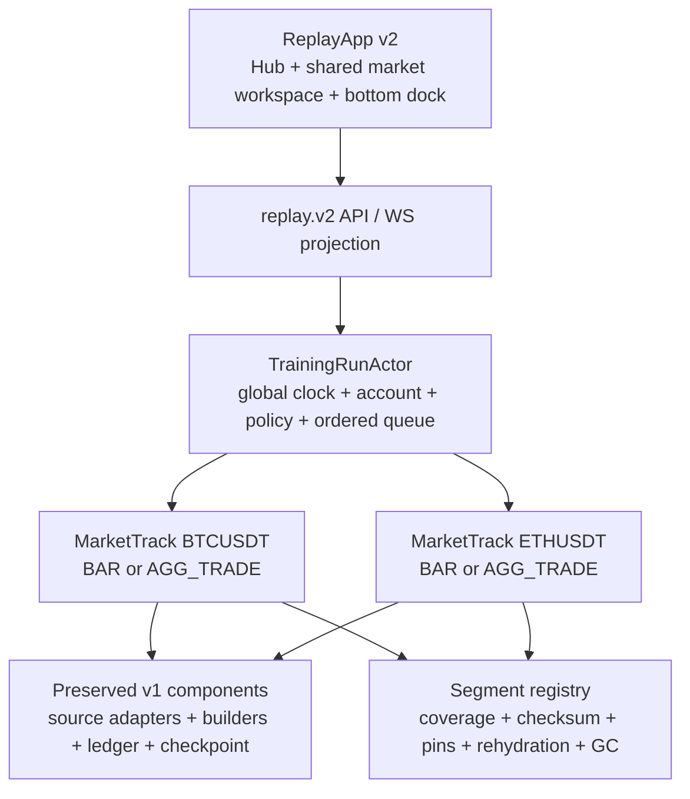
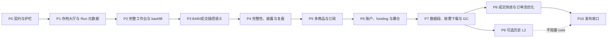

# CandleScope 回放训练 v2 重构执行文档

状态：`PHASE_0_PASS`。产品合同已于 2026-07-21 确认并冻结；Phase 0 契约、默认关闭开关、架构护栏和回滚证据已经完成，Phase 1 尚未开始，Replay v1/v2 均保持默认关闭。

工作树：`H:\program\CandleScope-kline-replay`

分支：`codex/kline-replay-training`

Phase 0 父提交：`2346dba32c0ce9e35dd6941bc4445366da4362a7`（2026-07-21）

产品真值：[`KLINE_REPLAY_TRAINING_PRODUCT_CONTRACT_zh.md`](KLINE_REPLAY_TRAINING_PRODUCT_CONTRACT_zh.md)

---

## 1. 本轮为什么必须重构

Replay v1 已经建立了一套可靠的确定性历史运行内核，但当前产品层把“回放”做成了一个固定单商品、固定展示周期、简化顶栏、替代式右栏的专用页面。它能证明后端核心可行，却不符合目标训练体验。

v2 的目标不是推倒 v1 重做，而是保留经过验证的安全内核，重构上层领域与工作台：

- 从“创建一个单商品 Session”升级为“创建或加载一个组合级训练存档”；
- 从“看起来像行情页的简化页面”升级为“与实时行情共用完整视觉骨架的 replay 工作台”；
- 从一个 `blind_mode` 布尔值升级为可验证的时间披露策略与完整性模式；
- 从固定 `display_interval` 升级为全局虚拟时钟、基础推进粒度和可切换视图周期的分离；
- 从单商品 Broker 升级为多商品统一账户、按需订阅、资金费、保证金和爆仓；
- 从顺序扫完所有历史事件升级为能够证明何时可跳转、何时必须全量处理、何时必须阻止的快进规划器；
- 从“存了领域日志”升级为可在存档大厅恢复、查看资金曲线、复盘用户操作和安全回收历史数据。

本执行文档只规定迁移顺序、代码边界、测试、退出门槛和回滚。任何产品语义争议先修订产品合同，再进入实现。

---

## 2. 当前基线与历史证据

### 2.1 当前工作树状态

本文重写时已确认：

```text
branch: codex/kline-replay-training
HEAD:   2346dba32c0ce9e35dd6941bc4445366da4362a7
status: clean before documentation edits
main:   2346dba32c0ce9e35dd6941bc4445366da4362a7
```

开始任何代码 Phase 前必须重新确认 branch、HEAD、`git status --short` 和 `git worktree list`；不能把本文记录当作未来事实。

### 2.2 v1 已验证能力，必须保留

| v1 能力 | v2 处理原则 |
|---|---|
| `replay.v1` canonical model、稳定错误码和 Decimal 边界 | 保留并版本化；破坏性字段进入 `replay.v2`，不静默改变 v1 hash。 |
| BAR catalog、coverage、随机起点、不可变 dataset snapshot | 作为 `MarketTrack` 的 BAR adapter；扩展到按需 segment，不绕过覆盖检查。 |
| AGG_TRADE checksum/import/audit、分页读取、pin/release | 作为成交轨道数据源；继续明确 aggregate trade 不是 raw trade。 |
| 单写者 `ReplaySessionActor`、服务端虚拟时钟、幂等 command | 演化为 `TrainingRunActor` 的确定性核心或受其协调的纯组件；禁止并发写账户。 |
| BAR/aggTrade replay bar builder | 变成每个 `MarketTrack` 的可 checkpoint 组件；支持视图周期重建。 |
| `PAPER_LINEAR_V1` Broker、Ledger、Report | 逐阶段扩展，账本守恒和独立重算不能退化。 |
| SQLite commit-before-publish、checkpoint、重启恢复、fork | 迁移为 run 级事务和多轨 checkpoint；恢复后仍只到 `PAUSED`。 |
| HTTP/WS snapshot-to-live、sequence/epoch/resync | 扩展为 `replay.v2` 投影；未知缺口继续 fail closed。 |
| 独立 `ReplayApp`、live/replay 网络隔离、no-lookahead 审计 | 永久保留；“复用完整页面”不等于挂载 live runtime。 |
| 跨进程 golden、1M aggTrade benchmark、4 小时 browser soak、rollback drill | 作为 v2 回归基线；新增组合和产品流程门禁。 |

### 2.3 当前实现与产品合同的差距

| 当前实现 | 目标差距 |
|---|---|
| `ReplaySessionDialog` 只有新建表单 | 缺少存档列表、恢复、版本状态、重新下载和 ReviewMode 入口。 |
| `ReplaySessionConfig` 固定一个 symbol、source 和 display interval | 缺少组合级 Run、MarketTrack、ViewerState 和可切换周期。 |
| `ReplayPageShell` 使用自定义简化顶栏与绘图条 | 没有复用完整 TopBar、周期栏、ChartWorkspace 和 feature surfaces。 |
| `ReplayRightRail` 替换实时自选与市场 dock | 与“保留自选、订单簿/订单流槽位、加入模拟交易 dock”冲突。 |
| `ReplayControlBar` 位于周期栏附近且命令固定 | 缺少底部 dock、展示 K/基础 K/成交事件三套明确控制。 |
| 图表 `onNeedMoreLeft=null` | 缺少开始点之前的 replay-aware backfill。 |
| API 有 create/get-by-id/command/fork/report/journal | 缺少可分页存档列表、轨道管理、订阅、资金曲线和数据恢复 API。 |
| 单商品 Actor/Broker | 缺少全局多商品总序、组合风险和强制 FULL 轨道。 |
| fee/slippage/max leverage 为创建时静态字段 | 缺少版本化规则变更、历史 funding、cross/isolated 和维护保证金阶梯。 |
| `advance_by` 顺序消费事件 | 正确但缺少可解释的 fast-forward planner 和安全加速路径。 |

### 2.4 v1 历史记录如何保留

旧版 2,488 行执行与验收记录的最后提交为：

```text
commit: f70234bf1b36f905c46430cc6241b7335987f8ed
blob:   796ba84041066878be81e74d95b7252a208ef0fa
path:   docs/KLINE_REPLAY_TRAINING_EXECUTION_zh.md
```

需要核对 v1 Phase 0–9 的实际命令、hash 和 rollback evidence 时使用：

```powershell
git show f70234bf1b36f905c46430cc6241b7335987f8ed:docs/KLINE_REPLAY_TRAINING_EXECUTION_zh.md
```

正式性能证据继续以仓库中的 `docs/perf-baselines/replay-*.json` 及 release-evidence 产物为准。本文不复制旧记录，避免两个可修改副本变成双真值。

---

## 3. 执行纪律

1. 只在 `H:\program\CandleScope-kline-replay` 实施本计划。
2. 每次只实现一个 Phase；完成测试、证据、执行记录和独立提交后再进入下一 Phase。
3. 先写契约测试和失败用例，再写最小实现；不能为了过门禁放宽 exact、coverage、hash、账本或 no-lookahead 语义。
4. 默认保持 `REPLAY_ENABLED=0`、`VITE_REPLAY_ENTRY_ENABLED=0`、`RAW_AGG_TRADE_ARCHIVE_ENABLED=0`。
5. v2 增加独立选择开关；未通过 Phase 10 前不得让普通用户路径默认进入 v2。
6. replay 开发实例使用独立端口、SQLite 和 archive；禁止读写主工作树活动数据库。
7. 所有 schema 迁移先加后减；在至少两个可回滚发布窗口内不删除 v1 表和 v1 读取路径。
8. 每个 Phase 都必须提供运行时开关回滚和提交级回滚证据；回滚不得删除存档或历史 archive。
9. 若同一错误无法在当前 Phase 内通过正确修复解决，停止并报告；不得改测试、提高容差或把 exact 改成 best-effort。
10. 产品合同未冻结的 L2 queue model、默认资源预算等不能由实现者私自决定。

### 3.1 固定开发端口与目录

| 服务 | 回放工作树端口 |
|---|---:|
| Vite | `15175` |
| FastAPI | `18082` |

推荐本地目录：

```text
backend/data/replay-dev/source-candlescope.db
backend/data/replay-dev/replay-v1.db
backend/data/replay-dev/replay-v2.db
backend/data/replay-dev/raw_agg_trades/
backend/data/replay-dev/replay_segments/
```

开发早期让 v1/v2 使用不同 replay DB。只有迁移门禁通过后，才允许在可恢复快照上验证同库升级。

### 3.2 建议的新增开关

| 开关 | 默认 | 所有权 |
|---|---:|---|
| `REPLAY_ENABLED` | `0` | 后端总开关，保持权威 |
| `REPLAY_PRODUCT_V2_ENABLED` | `0` | 后端 run/protocol/schema v2 开关 |
| `VITE_REPLAY_ENTRY_ENABLED` | `0` | live 页入口显示 |
| `VITE_REPLAY_PRODUCT_V2_ENABLED` | `0` | replay document 选择 v2 hub/workspace |
| `RAW_AGG_TRADE_ARCHIVE_ENABLED` | `0` | 成交 archive 能力 |
| `REPLAY_HISTORICAL_BOOK_ENABLED` | `0` | 可选历史 L2，Phase 9 前不存在 |

前端开关从来不是安全边界。v2 直接 URL、API、WS 和后台任务都必须由后端 capability 拒绝。

### 3.3 本地环境与独立启动

首次准备工作树：

```powershell
Set-Location H:\program\CandleScope-kline-replay\backend
if (-not (Test-Path -LiteralPath '.venv')) {
    py -m venv .venv
}
.\.venv\Scripts\python.exe -m pip install -r requirements.txt

Set-Location ..\frontend
npm ci
```

BAR 开发数据使用现有一致性快照工具，不能直接复制正在写入的 SQLite：

```powershell
Set-Location H:\program\CandleScope-kline-replay\backend
$replayDataRoot = 'H:\program\CandleScope-kline-replay\backend\data\replay-dev'
New-Item -ItemType Directory -Force -Path $replayDataRoot | Out-Null
.\.venv\Scripts\python.exe scripts\snapshot_replay_klines.py `
  --source 'H:\program\CandleScope\backend\data\candlescope.db' `
  --destination "$replayDataRoot\source-candlescope.db" `
  --require-quick-check
```

Phase 0 新开关落地后，后端专用启动示例：

```powershell
Set-Location H:\program\CandleScope-kline-replay\backend
$env:PYTHONUTF8 = '1'
$env:PYTHONIOENCODING = 'utf-8'
$env:CANDLE_DATA_DIR = 'H:\program\CandleScope-kline-replay\backend\data\replay-dev'
$env:KLINES_DB_PATH = 'H:\program\CandleScope-kline-replay\backend\data\replay-dev\source-candlescope.db'
$env:REPLAY_DB_PATH = 'H:\program\CandleScope-kline-replay\backend\data\replay-dev\replay-v2.db'
$env:RAW_AGG_TRADE_ARCHIVE_DIR = 'H:\program\CandleScope-kline-replay\backend\data\replay-dev\raw_agg_trades'
$env:REPLAY_ENABLED = '1'
$env:REPLAY_PRODUCT_V2_ENABLED = '1'
$env:RAW_AGG_TRADE_ARCHIVE_ENABLED = '0'
$env:REPLAY_HISTORICAL_BOOK_ENABLED = '0'
.\.venv\Scripts\python.exe -m uvicorn app.main:app --reload --host 127.0.0.1 --port 18082
```

另开终端启动前端：

```powershell
Set-Location H:\program\CandleScope-kline-replay\frontend
$env:VITE_API_PROXY_TARGET = 'http://127.0.0.1:18082'
$env:VITE_DEV_PORT = '15175'
$env:VITE_REPLAY_ENTRY_ENABLED = '1'
$env:VITE_REPLAY_PRODUCT_V2_ENABLED = '1'
npm run dev
```

这些 `=1` 只用于当前 Phase 的显式本地验证。完成验证和正式提交前恢复默认关闭，并通过 capability/入口审计证明没有残留默认启用。

---

## 4. 不可妥协的不变量

### 4.1 权威性

- 服务端拥有 VirtualTime、cursor、账户、规则版本、订阅强制状态和公开时间映射。
- 前端只提交带 command ID、expected revision 和 controller lease 的意图。
- 任何账户变更必须先持久化，再 publish；UI optimistic state 不能冒充成交或入金成功。

### 4.2 确定性

- 相同 protocol、config、dataset identities、commands 和 checkpoint 必须得到相同事件序列、ledger、report 和 state hash。
- wall clock、浏览器帧率、播放倍率、网络重连和当前查看周期不进入领域 hash。
- 多商品同时间事件必须使用版本化稳定总序，不能依赖 Python/JS map 顺序或 task 调度。

### 4.3 无未来数据

- replay document 不访问 live 数据源。
- 所有图表、指标、订单流、PnL 和风险只读已经揭示的数据前缀。
- 左侧 backfill 可以读取开始点之前的数据，但不得返回 cursor 之后的数据。
- 时间隐藏在服务端边界完成；真实时间不能先发到浏览器再遮住。

### 4.4 路径依赖不能被快进跳过

有持仓、订单、条件触发、funding、liquidation 或其他路径依赖时，必须逐事件得到等价结果，或明确阻止。任何聚合优化都要有 step-by-step equivalence 证明。

### 4.5 组合时钟不能分叉

任一强制 `FULL` MarketTrack 不能推进时，整个 TrainingRun 暂停。不能出现 BTC 已到 12:05、ETH 仍在 12:04 但账户继续计算的状态。

### 4.6 账本与规则不追溯

- 余额、保证金、费用、funding、已实现 PnL 和 liquidation fee 必须逐项记账且可独立重算。
- 入金或规则变更从其虚拟时刻起生效；不能重写旧成交。
- 任何 Decimal 非有限值、舍入策略漂移或账本不守恒都 fail closed。

### 4.7 数据身份与 GC

- 每条轨道绑定不可变或可确定重建的数据身份。
- 存档引用的数据要么被 pin，要么有可信来源、checksum 和完整 rehydration manifest。
- GC 不得让一个原本可恢复的存档静默变成不可恢复。

### 4.8 实盘硬隔离

replay 模块不得读取交易所私钥、实盘账户、私有下单 client 或任何真实资金接口。模拟“市价/限价”只能进入 replay broker。

---

## 5. 迁移策略

采用“保留 v1 内核、增加 v2 父层、逐步替换产品壳”的策略，而不是一次性重写。

### 5.1 三层边界



### 5.2 v1 兼容策略

- 现有 `replay_session` 记录在大厅中显示为 `LEGACY_V1`。
- Phase 1 先提供只读元数据和兼容恢复入口，不改写 v1 config/hash。
- v1 -> v2 迁移必须创建新 `TrainingRun`，记录 parent legacy session；原 v1 数据保持不变。
- 若 legacy dataset 已丢失且不可重建，显示不可恢复原因；不能伪造为一个空 v2 存档。
- v2 稳定前保留旧 `ReplayApp` 选择开关，便于功能级回滚。

### 5.3 领域对象

#### `TrainingRun`

至少包含：

```text
run_id
protocol_version
status
name
scope(exchange, market_type, settlement_asset)
replay_mode(BAR or AGG_TRADE)
book_mode(OFF or BOOK_ASSISTED_REQUIRED)
virtual_time
integrity_mode
time_disclosure_policy
active_rule_revision
account_state
track_registry
viewer_state
parent_ref
created_at / updated_at / ended_at
state_hash
```

#### `MarketTrack`

至少包含：

```text
track_id
market_identity(exchange, market_type, symbol)
source_kind
base_interval
dataset_refs[]
source_cursor
bar_builder_state
subscription_tier
forced_full_reasons[]
capability_snapshot
track_state_hash
```

`MarketTrack.source_kind` 必须等于所属 `TrainingRun.replay_mode`。v2 core 不允许在同一 Run 中混用 BAR 与 AGG_TRADE；轨道数据不足时拒绝升级，不能自动换 source。

#### `ViewerState`

至少包含：

```text
selected_track_id
display_interval
chart_type
visible_range
pane_layout
rail_layout
semantic_view_revision
```

`ViewerState` 不进入市场和账户确定性 hash；需要复盘的语义化视图事件单独持久化。

### 5.4 单写者方案

首版使用一个 `TrainingRunActor` 作为账户与全局时钟的唯一写者。各 MarketTrack 可以并行预取、校验和解码，但进入领域 reducer 前必须形成稳定有序事件流。不得让每个 symbol actor 并发写同一账户后再补偿。

未来若分片，仍需一个可证明的组合 commit barrier；在没有等价性证据前不做。

---

## 6. 后端目标边界

### 6.1 建议模块所有权

现有 `backend/app/replay/` 保留；新增模块按责任组织：

```text
backend/app/replay/
  training/
    models.py              # TrainingRun / MarketTrack / ViewerState / policies
    actor.py               # global single writer and ordered merge
    service.py             # run lifecycle and capacity ownership
    commands.py            # replay.v2 command validation
    events.py              # replay.v2 domain and projection events
    ordering.py            # stable cross-track total order
    fast_forward.py        # planner and equivalence modes
    review.py              # read-only review cursor and fork
  segments/
    models.py              # immutable segment identity and health
    registry.py            # refs, pins, coverage and usage
    rehydration.py         # trusted restore/download plans
    gc.py                  # dry-run and safe reclaim
  broker/
    margin.py              # cross / isolated
    funding.py             # historical funding settlement
    liquidation.py         # mark + maintenance tiers + events
    instruments.py         # versioned symbol rules
```

这些路径是建议所有权；实施时可在同一责任边界内调整。不得把组合账户逻辑放进 data source，也不得把下载/GC 放进 actor reducer。

### 6.2 replay.v2 API 草案

仓库总 API 仍可位于 `/api/v1`，但 replay wire envelope 使用独立 `protocol: replay.v2`，避免把 API root 版本与领域协议混为一谈。

| 方法 | 路径 | 用途 |
|---|---|---|
| GET | `/api/v1/replay/capabilities` | 返回 v1/v2、数据源、历史面板和资源能力 |
| GET | `/api/v1/replay/runs` | 分页列出轻量存档元数据，含 legacy v1 |
| POST | `/api/v1/replay/runs` | 原子创建 TrainingRun |
| GET | `/api/v1/replay/runs/{run_id}` | 获取恢复 bootstrap 元数据；权威市场 snapshot 仍通过 WS 原子交接 |
| POST | `/api/v1/replay/runs/{run_id}/commands` | 提交 run/track/account/controller 命令 |
| POST | `/api/v1/replay/runs/{run_id}/tracks` | 在 scope 内准备新 MarketTrack |
| PATCH | `/api/v1/replay/runs/{run_id}/tracks/{track_id}` | 修改订阅意图；服务端返回强制 tier |
| GET | `/api/v1/replay/runs/{run_id}/history` | replay-aware 左侧 backfill，只返回公开时间和 revealed boundary 内数据 |
| GET | `/api/v1/replay/runs/{run_id}/equity` | 有界、多分辨率资金曲线 |
| GET | `/api/v1/replay/runs/{run_id}/journal` | 训练日志与规则事件 |
| GET | `/api/v1/replay/runs/{run_id}/report` | 权威报告与 fidelity |
| POST | `/api/v1/replay/runs/{run_id}/review` | 创建只读 review cursor |
| POST | `/api/v1/replay/runs/{run_id}/fork` | 从当前或 review event 创建新存档 |

WS 可继续使用 `/api/v1/stream/replay/{run_id}`，但连接握手必须声明期望 `replay.v2`。v1/v2 payload parser 严格分离；未知协议不得 best-effort 解析。

### 6.3 command 分类

```text
controller: acquire, heartbeat, release, takeover
transport:  play, pause, set_speed, step_event, step_base,
            step_display, advance_by, advance_to, cancel_advance
viewer:     select_track, set_display_interval, set_chart_type,
            record_view_action
track:      add_track, set_subscription_tier, remove_unowned_track
account:    place_order, cancel_order, close_position,
            allocate_isolated_margin
policy:     deposit, withdraw, change_fee_policy,
            change_leverage_cap, change_funding_policy, reveal_time
lifecycle:  save, end, fork, start_review
```

每个命令都要定义：允许状态、controller 要求、expected revision、幂等 key、原子处理边界、是否进入 state hash、是否允许在各 IntegrityMode 使用。

### 6.4 projection 分类

- `RUN_SNAPSHOT`：恢复用完整有界 snapshot；
- `RUN_STATE_CHANGED`：状态、时钟、controller、规则 revision；
- `TRACK_PROJECTION`：每轨已揭示 K 线/价格/capability/cursor；
- `ACCOUNT_PROJECTION`：余额、保证金、持仓、订单、成交和风险；
- `AUDIT_EVENT`：规则变更、入金、解密、强制降级；
- `ADVANCE_PROGRESS`：快进计划、进度、预计剩余和取消结果；
- `RESYNC_REQUIRED`：sequence/epoch/identity 未知缺口。

普通高频轨道更新可合并，但成交、爆仓、状态变化、规则变化、PAUSED、ENDED 和 error 必须立即 flush。

### 6.5 SQLite v2 schema

Phase 1 起只做 additive migration，建议新增：

```text
replay_training_run
replay_market_track
replay_run_rule_revision
replay_run_command_log
replay_run_event
replay_track_checkpoint
replay_account_checkpoint
replay_run_action_event
replay_run_view_event
replay_equity_sample
replay_data_segment
replay_data_segment_pin
replay_rehydration_manifest
```

硬约束：

- run 创建、首轨 dataset ref、初始账户、初始规则和首 checkpoint 同事务；
- command、领域变更、账本、checkpoint 和 publish cursor 使用可证明的 commit boundary；
- segment pin 使用外键或等价的原子引用，GC 不能与新 pin 竞态；
- v1 表不重命名、不删除、不就地改写 JSON；
- schema migration 可重入、可在旧 build 下安全忽略新增表；
- migration 前后都运行 `quick_check`，并保留可恢复文件快照。

---

## 7. 前端目标边界

### 7.1 共享视图，隔离 runtime

当前已经存在 source-neutral `MarketPageFrame` 与 `MarketWorkspaceFrame`，v2 继续把以下层次拆清：

```text
shared visual components / view models
  <- live adapters owned by App
  <- replay adapters owned by ReplayApp
```

优先复用：

- `frontend/src/app/MarketPageFrame.tsx`
- `frontend/src/app/MarketWorkspaceFrame.tsx`
- `frontend/src/app/TopBar.tsx`
- `frontend/src/components/IntervalSelector.*`
- `frontend/src/app/ChartWorkspace.tsx`
- `frontend/src/app/RightMarketRail.tsx`
- `frontend/src/app/StatusBar.tsx`
- 图表、绘图、pane lifecycle、layout preference 和 `SeriesWindowStore` 契约。

需要提取的是纯 props/view-model 合同，不是让 replay 伪造 `useMarketDataRuntime` 类型。

### 7.2 计划新增或替换的产品组件

```text
frontend/src/features/replay/
  hub/
    TrainingHubDialog.tsx
    TrainingRunList.tsx
    TrainingRunCard.tsx
    TrainingCreateWizard.tsx
    ReplayCapabilitySummary.tsx
  workspace/
    ReplayMarketWorkspaceAdapter.tsx
    ReplayRightRailAdapter.tsx
    ReplayCapabilitySurface.tsx
    ReplayPaperTradingDock.tsx
    ReplayBottomControlDock.tsx
  runtime/
    useTrainingRunRuntime.ts
    useReplayTrackRuntime.ts
    useReplayWatchlistRuntime.ts
    useReplayHistoryRuntime.ts
    useReplayCapabilityRuntime.ts
  review/
    ReplayReviewTimeline.tsx
    ReplayEquityCurve.tsx
```

旧 `ReplaySessionDialog`、`ReplayControlBar`、`ReplayRightRail` 在对应新组件通过验收后删除；不能先删旧 UI 再留下不可用空壳。

### 7.3 自选与订阅

- 复用自选分组、排序、宽度和折叠 preference；不复用 live `/subscriptions` 状态。
- 新建 replay-local `NONE/WARM/FULL` store 和 API。
- Watchlist row 必须显示 tier、公开时间下的价格状态和强制 FULL 原因。
- 选中 `NONE/WARM` 商品时先提交原子 track prepare；成功前旧主图继续可见，不能显示 live 或陈旧缓存假装切换成功。

### 7.4 历史 backfill

复用 live 的范围规划、取消、合并、缓存预算和 store delta，但引入 `ReplayHistoryProvider`：

```text
onNeedMoreLeft
  -> plan uncovered older range
  -> GET run-scoped replay history
  -> validate public time + track identity + <= revealed boundary
  -> SeriesWindowStore prepend/replace delta
```

architecture test 必须禁止 replay provider 调用 live Kline API。

### 7.5 capability surface

OI、市场爆仓、mark/index/basis、funding、订单簿和订单流都通过统一 `CapabilityState` 渲染。组件在 `DEGRADED` 时立即清空精确数据；不能保留上一次值配一个小灰点。

### 7.6 页面数据泄漏审计

盲测扫描至少覆盖：

- fetch request/response；
- WebSocket 收发；
- DOM 文本和 data attributes；
- ARIA/accessibility tree；
- URL、history state、window name；
- localStorage、sessionStorage、IndexedDB；
- console/error stack 和导出文件。

---

## 8. 关键算法合同

### 8.1 `STEP_DISPLAY`

输入包含 `display_interval`、`count`、expected run revision 和 expected virtual cursor。服务端根据市场日历与 base events 计算：

1. 当前 cursor 是否位于 display bucket 中间；
2. 若在中间，第一步目标为当前 bucket 的确定性收口边界；
3. 剩余 count 逐个推进完整 display bucket；
4. 中间每个 base event 仍进入 builder、broker、risk 和 ledger；
5. 轨道或账户事件失败时整个命令原子停止在最后已提交事件边界。

### 8.2 多轨事件总序

候选稳定 key：

```text
(actual_event_time_ms, event_phase, market_track_stable_id, source_sequence)
```

`event_phase` 至少冻结 funding settlement、market input、order trigger、risk/liquidation 和 post-event projection 的相对次序。最终 key 必须通过同一时间多商品、不同 source kind、重启恢复和跨进程 golden 证明。

### 8.3 强制 FULL 规则

`forced_full_reasons` 是服务端派生集合，例如：

```text
VIEWED
OPEN_POSITION
OPEN_ORDER
CONDITIONAL_ORDER
PENDING_FUNDING
LIQUIDATION_RISK
REVIEW_REQUIRED
```

实际 tier 为用户意图与强制原因的上界。强制原因变化和 tier 转换必须持久化并参与 run 恢复。

### 8.4 快进计划

规划输入：目标时刻、所有 FULL tracks、账户路径依赖、规则结算点、checkpoint、segment coverage 和资源预算。

规划输出：`CHECKPOINT_JUMP`、`AGGREGATE_SCAN`、`FULL_EVENT_SCAN` 或 `BLOCKED`，以及原因、预计事件数、所需数据段和是否可取消。

每一种优化路径都必须与逐事件 reference runner 比较：最终 cursor、tracks、orders、fills、positions、ledger、funding、liquidation、equity 和 report hash 全相等。

### 8.5 资金曲线

- 权威权益点在账户发生语义变化、固定虚拟采样边界和结束事件时生成。
- 原始点有界存储；长训练按 min/max/last 或等价保形算法生成多分辨率层级。
- 降采样不能用于账本重算，只用于展示。
- ReviewMode 可从曲线点定位到最近领域事件。

---

## 9. 全局验证与证据规则

### 9.1 每个代码 Phase 的最低门禁

```powershell
Set-Location H:\program\CandleScope-kline-replay
git status --short

Set-Location backend
.\.venv\Scripts\python.exe -m ruff check app tests scripts
.\.venv\Scripts\python.exe -m pytest -q

Set-Location ..\frontend
npm run check

Set-Location ..
git diff --check
```

若全仓 ruff 当前基线不允许，则 Phase 0 记录准确的既有范围，之后所有新增/修改 Python 文件必须 ruff clean；不得把新增违规归为历史问题。

### 9.2 必须保留的 v1 回归

- replay.v1 canonical golden；
- BAR 与 AGG_TRADE determinism；
- ledger 独立重算；
- sequence/epoch/resync；
- no-lookahead；
- 1M aggTrade 有界内存与分页；
- 4 小时 browser lifecycle soak；
- feature flag 与旧 build rollback。

### 9.3 v2 新增证据

- 存档大厅真实浏览器流程：新建、失败回滚、暂停、恢复、结束、Review、Fork；
- live/replay 结构与视觉骨架一致性；
- replay 页面全程零 live 数据请求；
- 时间披露 7 档的跨边界泄漏扫描；
- base/display/event 三套控制的 reference equivalence；
- 1、2、4、8 个 FULL tracks 的总序、吞吐、内存和恢复矩阵；
- `NONE` 零读取、`WARM` 有界准备、强制 FULL 风险继续计算；
- cross/isolated、fee、funding、liquidation 账本场景；
- fast-forward 四种计划与逐事件等价/拒绝证据；
- data segment pin、GC dry-run、冷恢复和不可重建保护；
- v1 legacy 只读、迁移和回滚。

### 9.4 性能门槛冻结方式

不在设计文档里拍脑袋写毫秒或轨道上限。每个相关 Phase 先运行真实 fixture baseline，再提交版本化 JSON：

```text
docs/perf-baselines/replay-v2-hub-*.json
docs/perf-baselines/replay-v2-multitrack-*.json
docs/perf-baselines/replay-v2-fast-forward-*.json
docs/perf-baselines/replay-v2-browser-soak-*.json
```

基准必须记录机器、HEAD、dataset hash、参数、p50/p95/max、RSS/heap late-half、queue high-water、page/segment 次数和阈值来源。阈值只允许通过单独文档修订收紧或基于证据调整。

### 9.5 发布证据目录

正式证据写到 Git 外、按 clean HEAD 绑定的目录：

```powershell
$replayHead = (git rev-parse HEAD).Trim()
$evidenceRoot = "H:\program\CandleScope-release-evidence\$replayHead\replay-v2"
New-Item -ItemType Directory -Force -Path $evidenceRoot | Out-Null
```

脚本必须拒绝 dirty worktree、运行中 HEAD 改变和证据目录复用到不同 commit。

---

## 10. Phase 依赖总览



Phase 9 是可选后续能力，不阻塞 v2 core 发布；Phase 10 必须在历史 L2 关闭状态下也完整通过。

---

## 11. Phase 0：冻结 v2 契约、开关与架构护栏

### 目标

把本文和产品合同转成可执行的 protocol/schema/architecture tests，不新增可见 v2 产品流。

### 主要任务

1. 冻结 `replay.v2` 枚举：run/track 状态、source、integrity、time disclosure、subscription tier、capability、fast-forward plan。
2. 新增 v2 canonical fixture 与跨 Python/TypeScript 类型对照。
3. 新增 `REPLAY_PRODUCT_V2_ENABLED` 和 `VITE_REPLAY_PRODUCT_V2_ENABLED`，默认关闭。
4. architecture guard 禁止 `ReplayApp` 导入 live runtime、live subscription、live order book/trade flow/advanced-market hooks。
5. 记录 v1 golden/performance/rollback baseline 的文件 hash；验证现有 v1 tests 不变。
6. 冻结 additive schema migration 原则和 v1 legacy 不改写合同。

### 建议文件

```text
backend/app/replay/training/{models,commands,events}.py
backend/tests/test_replay_v2_contracts.py
backend/tests/fixtures/replay/v2_contract_golden.json
frontend/src/features/replay/replayV2Types.ts
frontend/src/features/replay/__tests__/replayV2Architecture.test.ts
frontend/scripts/check-architecture*.mjs
backend/app/core/config.py
frontend/.env.replay.example
backend/.env.replay.example
```

### 必测

- 所有非法 enum、identifier、Decimal、revision、cursor、time policy 和 tier 拒绝；
- v1 fixture byte/hash 不变；
- 两个 v2 开关默认关闭，直接 URL/API/WS fail closed；
- forged protocol、unknown capability 和 time disclosure 降级拒绝；
- architecture fixtures 对 live value import fail。

### 退出门槛

- 文档中的全部硬枚举有唯一代码定义与 golden；
- 默认构建没有 v2 可见入口或后台任务；
- v1 全量门禁通过；
- rollback 后代码和配置回到 Phase 0 前，v1 DB 未改变。

### 建议提交

```text
chore(replay): freeze replay v2 product and protocol boundaries
```

---

## 12. Phase 1：TrainingRun 存储、存档列表与训练大厅

### 目标

先交付“像游戏存档”的完整入口，但活动训练仍可暂时通过单 MarketTrack adapter 运行。

### 主要任务

1. additive 创建 `replay_training_run`、初始 track/rule/action 表和 schema version。
2. 实现分页 `GET /runs`，只读取轻量元数据，不加载 dataset。
3. 实现原子 `POST /runs`；内部先适配 v1 单轨 source/actor，不复制核心。
4. legacy v1 session 显示 `LEGACY_V1`，提供兼容打开或明确不可恢复状态。
5. 新建 `TrainingHubDialog`、Run list/card、Create wizard 和 capability summary。
6. 创建表单覆盖产品合同字段；尚未实现的 funding/L2/multi-symbol 能力必须 disabled 并解释，不得保存后假装生效。
7. 返回大厅前 checkpoint；controller 失联后自动暂停。

### 必测

- 空列表、数千存档分页、排序、过滤和 blind metadata 脱敏；
- 原子创建每个失败点的事务与 pin 回滚；
- capability epoch 在校验与创建间漂移时拒绝；
- legacy v1 列表、恢复、不可恢复、迁移不改原 hash；
- 浏览器新建/恢复/关闭/刷新，大厅不批量下载 dataset；
- 直接 replay URL 无 opener 正常进入大厅。

### 退出门槛

- 用户不再被迫先填新建表单；已有训练可发现、可继续或得到明确故障解释；
- 存档列表请求的 IO 与存档数据段总量无关；
- v2 开关关闭时旧 ReplayApp 完整可用；
- schema downgrade/old build 忽略新增表，v1 记录不变。

### 回滚

关闭 v2 选择开关回到 v1 UI。新增表保留，不删除用户新建 Run；旧 build 忽略它们。

### 建议提交

```text
feat(replay): add training run saves and replay hub
```

---

## 13. Phase 2：完整实时骨架、能力占位与 replay backfill

### 目标

训练页面结构与实时行情共用组件，同时保持 runtime 和网络完全隔离。

### 主要任务

1. 为 TopBar、IntervalSelector、ChartWorkspace、RightMarketRail、StatusBar 提取 source-neutral props/view models。
2. `AppShell` 与 `ReplayPageShell` 组合同一组件树；禁止复制 CSS 和 DOM 结构。
3. replay 继承主题、图表、pane、rail 宽高与折叠 preference；数据 store 仍隔离。
   指标配置可作为初始模板，绘图/提醒与训练中视图状态必须 run-scoped，blind Run 不导入带真实时间锚点的 live drawing。
4. 自选列表回到右栏；新增 replay-local tier 状态，但本 Phase 可只让主商品 FULL。
5. 模拟交易进入 existing rail dock/tab，替代旧的整栏 `ReplayRightRail`。
6. 控制条迁移到 `ReplayBottomControlDock`；本 Phase 可先接 v1 command。
7. 实现 `ReplayHistoryProvider` 与 `onNeedMoreLeft`，复用 backfill planner/store delta。
   Phase 2 先只读一致性快照并绑定 history epoch；Phase 7 再统一迁入 segment registry，禁止查询活动生产库。
8. OI、市场爆仓、mark/index/basis、funding、订单簿、订单流使用统一 capability surface。
9. 绘图与可本地计算指标只读 revealed prefix；hosted/range/security 未有 replay provider 时明确 disabled。

### 必测

- live/replay component ownership 与关键 DOM slot 一致；
- 1600×1000、常用缩放和窄宽度下 rail/dock/chart 不互相遮挡；
- rail resize、collapse、pane lifecycle、theme 和 drawing parity；
- replay 网络 allowlist 只有 replay endpoints；error/loading/unsupported 同样零 live 请求；
- left backfill 能加载更早数据、去重、取消，且 `max_time <= revealed boundary`；
- backfill 响应绑定 track/history epoch，source identity 漂移时拒绝；
- unsupported 不显示 0，不保留 stale precise values。

### 退出门槛

- 旧自定义 replay 顶栏、假绘图条、替代式整栏和上方控制条不再出现在 v2 路径；
- live 普通 smoke 与 replay smoke 同时通过；
- 视觉差异只剩产品合同允许的 replay 身份、capability、paper dock 和 bottom dock；
- `ReplayApp` 仍可在 live 后端在线时证明零 live market request。

### 回滚

v2 flag 返回旧 shell；共享组件的 props 提取必须保持 live snapshot/interaction tests，单提交可 revert。

### 建议提交

```text
feat(replay): reuse the complete market workspace in replay
```

---

## 14. Phase 3：ViewerState 与 BAR/成交操控语义

### 目标

解除 `display_interval` 与 session identity 绑定，完整实现底部控制坞的三种推进粒度。

### 主要任务

1. 从不可变 run config 移出 `display_interval`，迁移到 `ViewerState`。
2. 实现 `STEP_DISPLAY`、`STEP_BASE`、`STEP_EVENT`、`ADVANCE_BY`、`ADVANCE_TO` 和可取消 progress。
3. BAR 实现当前 display bucket 对齐；基础 K 自动播放持续更新 forming 高周期 K。
4. AGG_TRADE 支持按事件、虚拟时间倍率、基础 K、展示 K 和任意时长推进。
5. display switch 从 revealed base prefix 重建，不消费 source，不改变账户 hash。
6. command payload 绑定提交时 display interval/revision，消除 UI 切换竞态。
7. bottom dock 根据 source capability 显示正确控件，不把不可用操作渲染成可点击。

### 必测

- base=1m 与 view=1m/5m/15m/1h 的 forming/close/alignment matrix；
- 只形成 1m 的 15m 首次 step_display 收口当前 bucket；
- step_display(n) 与逐 base step 的 bar/account/ledger/hash 等价；
- display switch 1m->15m->1h->1m cursor 和领域 hash 不变；
- 同毫秒多成交、长空档、暂停 barrier、command pending 时切周期；
- 速度变化只影响 wall scheduling；跨进程 state hash 一致；
- calendar interval 或不支持日历明确拒绝，不用固定毫秒误算。

### 退出门槛

- 产品合同第 9、10 节控制全部有服务端命令语义；
- 前端不存在“看 15m 就每 15 秒突然出一根”的假连续模型；
- BAR 和 AGG 的 reference equivalence/golden 全部通过；
- v1 step/play/advance 回归不退化。

### 回滚

关闭 v2 后使用 v1 commands；数据库保留 viewer event 但旧 runtime 忽略。

### 建议提交

```text
feat(replay): add aligned bar and trade replay controls
```

---

## 15. Phase 4：时间披露、完整性模式、动作日志与复盘

### 目标

把 blind/cheat/report 从零散字段提升为可审计训练规则，并交付资金曲线与只读 ReviewMode。

### 主要任务

1. 实现 7 档 `TimeDisclosurePolicy` 的服务端 actual->public 映射。
2. 所有 API/WS/report/journal/equity/error/export 只输出允许的公开时间。
3. 实现 `CHALLENGE/PRACTICE/SANDBOX` 与 allowed mutations。
4. 实现 deposit/withdraw、fee/leverage/funding rule revision 和 reveal time 审计事件；先只接已支持规则，未支持项拒绝。
5. 持久化语义化 view actions；高频手势合并或采样。
6. 实现有界多分辨率 equity curve。
7. 实现只读 ReviewMode、事件跳转和从事件 fork。

### 必测

- 7 档策略在 HTTP、WS、DOM、ARIA、storage、console、export 的泄漏扫描；
- manual start 标为 known，不能进入 strict blind；
- Challenge 所有 mutation 拒绝；Practice allowlist；Sandbox 标记；
- rule revision 不追溯，旧 ledger/hash 不变；
- 解密不可逆且进入报告；
- 10 万视图手势不会形成无界 DB/DOM；
- ReviewMode 不改原 run，fork parent/event 精确；
- equity curve 与 ledger checkpoint 独立抽查一致。

### 退出门槛

- 不再存在前端收到 actual time 后只靠 formatter 遮挡的路径；
- 报告能明确区分 strict、practice、sandbox 和所有变更；
- Review/Fork 可从真实浏览器完成并保持原 hash；
- v1 blind no-lookahead 证据继续通过。

### 回滚

v2 关闭后不删除 rule/action/equity 数据；v1 blind session 继续走原映射。解密过的 Run 不能因回滚重新标 strict。

### 建议提交

```text
feat(replay): add audited training integrity and review
```

---

## 16. Phase 5：多商品 MarketTrack、全局时钟与订阅分级

### 目标

让一个 TrainingRun 在同一结算范围内同时训练多个商品，并只加载真正需要的数据。

### 主要任务

1. 实现 `TrainingRunActor` 与稳定跨轨 ordered queue。
2. 现有 BAR/AGG source、builder 和 dataset ref 封装为每轨组件；所有轨道服从 Run 的不可变 replay mode。
3. 实现 `NONE/WARM/FULL` 与 `forced_full_reasons`。
4. 主图选择从 viewer action 升级轨道；准备期间暂停全局时钟并原子切换。
5. Watchlist 显示 replay tier、公开价格和强制原因；不调用 live subscription API。
6. position/open order/conditional/funding/risk 自动强制 FULL。
7. checkpoint 同时绑定 run account、全局 cursor、全部 FULL track cursor 与 hash。
8. 任一强制 FULL 轨道 gap/degraded 时整个 Run 暂停。

### 必测

- 1/2/4/8 轨 BAR 与 1/2/4/8 轨 AGG 两组稳定总序；
- 同毫秒多 symbol 事件跨进程 golden；
- `NONE` 零 repo/archive read，`WARM` 有界，`FULL` 连续；
- 有仓位非主图商品继续 PnL、止损、funding、risk；
- 用户降级强制 FULL 被拒绝并解释；风险解除后 checkpoint 再降级；
- 新 symbol coverage 失败不改变当前 viewer/account；
- 一轨 gap 导致全局暂停，恢复后无重复事件；
- 重启恢复所有 track cursor 和 forced reasons。

### 性能证据

建立 1/2/4/8 FULL tracks 的 CPU、RSS、queue、checkpoint size、projection rate 与 browser heap baseline。资源上限在本 Phase 的证据审阅后冻结。

### 退出门槛

- 用户可在一个存档内切换至少两个同结算商品并组合持仓；
- 非查看商品的风险事件不会遗漏；
- 数据读取量与订阅轨道而不是整个自选列表成比例；
- 单轨 v1 determinism/performance 不出现未解释退化。

### 回滚

v2 flag 关闭；多轨 Run 保留为 v2-only 存档。不得把它强行压成 v1 单 symbol session。

### 建议提交

```text
feat(replay): add deterministic multi-market training runs
```

---

## 17. Phase 6：手续费、funding、逐仓/全仓与爆仓

### 目标

把模拟交易从基础 paper broker 提升到可解释、可重算的合约账户，但绝不超出历史数据能力宣称“交易所完全精确”。

### 主要任务

1. 引入版本化 instrument filters、contract size、price/qty rounding、leverage limit 和 maintenance tiers。
2. 实现 maker/taker fee policy revision。
3. 实现 `CROSS` 与 `ISOLATED` margin、margin allocation/release。
4. 接入历史 mark/index/funding source 与 capability；缺失时 exact 模式拒绝。
5. 实现 funding settlement 账本与重启幂等。
6. 实现 liquidation event、fee、订单撤销和账户状态转换。
7. 未开 book 时实现 `TOUCH_OR_TAPE_V2`：当前已揭示价的立即 taker、后续触价挂单、BAR 保守顺序、AGG tape 量约束。
8. Right rail 提供下单、持仓、订单、成交、账户与风险视图。

### 必测

- price/qty/fee/contract rounding 的 Decimal golden；
- 市价立即使用 current revealed reference，不读下一未来事件；
- limit 下单前历史不能追溯成交；穿价 taker、resting maker fee；
- BAR 同根 TP/SL 最不利可行顺序；AGG 同毫秒稳定顺序与量约束；
- cross/isolated 增减仓、部分平仓、手续费后保证金；
- funding 边界前/时/后、空仓、多商品、重启重复保护；
- maintenance tier 跨档、mark 缺失、爆仓、破产价和 liquidation fee；
- 独立 ledger/report 重算为零差异；
- 模拟账户爆仓与历史市场爆仓 UI/事件不混淆。

### 退出门槛

- 所有现金流都有账本分录与 fidelity；
- 缺历史 mark/funding/tier 时不会按 0 或 last price 静默冒充 exact；
- 有持仓多商品场景在 step/play/fast-forward/restart 后等价；
- 账户 UI 不再是一条无层次长列表。

### 回滚

旧 `PAPER_LINEAR_V1` Run 仍按旧 execution version 恢复；新 Run 固定 `TOUCH_OR_TAPE_V2`。不得用旧 broker 读取新账户后静默改变成交。

### 建议提交

```text
feat(replay): add margin funding and liquidation simulation
```

---

## 18. Phase 7：数据段、按需下载、pin、rehydration 与 GC

### 目标

让 BAR、aggTrade 和后续历史源按商品/范围按需准备，同时保证存档不会被 GC 破坏。

### 主要任务

1. 实现 `replay_data_segment` registry、identity、coverage、checksum、health 和引用。
2. 将现有 BAR snapshot 与 raw aggTrade partition 纳入统一 segment adapter，不改写原始生产表。
3. 实现 run/track 创建与扩展时的 prepare plan、下载进度、quarantine 和取消。
4. 保存 rehydration manifest：可信 URL/源 identity、checksum、schema、range。
5. 实现 pin owner/refcount 与 actor/checkpoint/review 生命周期。
6. 实现 GC dry-run/run、budget、LRU 候选，但不可重建 segment 永不自动回收。
7. 防止 GC 与新 pin、下载 publish、checkpoint 或 ReviewMode 竞态。
8. Hub 显示恢复所需数据、预计大小、进度和失败原因。

### 必测

- 仅打开 Hub 零 segment load；选择商品才读取；
- checksum/schema/range/identity 错误 quarantine；
- 下载中断、重试、幂等 publish、同段并发请求 single-flight；
- pin 与 GC 竞争、active/review/recovery 保护；
- dry-run 与实际释放集合一致；
- 不可重建 segment 永不自动删；
- 可重建冷数据删除后恢复到相同 dataset hash；
- Windows 文件锁、SQLite WAL、进程崩溃和临时文件清理。

### 退出门槛

- 用户切换/订阅商品时实际只准备需要的 source/range；
- 保存存档有明确“已 pin”或“可重建”证明；
- GC 不能制造悬空 dataset ref；
- 存储预算超限时给出安全选择，不自动伤害有仓位 Run。

### 回滚

关闭自动 GC 和下载 worker；registry/manifest 保留。回滚不得删除已下载数据或改变旧 pin。

### 建议提交

```text
feat(replay): add on-demand replay segments and safe gc
```

---

## 19. Phase 8：成交回放快进、订单流与计算优化

### 目标

在保持路径等价的前提下优化长区间 AGG_TRADE 回放，并让成交模式的订单流能力进入完整工作台。

### 主要任务

1. 实现 `FastForwardPlanner` 四种计划及可解释响应。
2. 无路径依赖时支持 checkpoint + aggregate/bar scan + tail trades。
3. 有持仓/订单/funding/risk 时使用 full event scan，提供有界进度与取消。
4. 每轨 page/RecordBatch streaming、bounded prefetch 和 backpressure；禁止全历史 list。
5. AGG_TRADE 接入 replay trade-flow/tape/CVD adapter，明确 aggregate fidelity。
6. BAR order flow 保持 unsupported 或显式 proxy，不能共用精确标签。
7. projection coalescing 不丢成交、爆仓、规则和状态事件。

### 必测

- 四种 planner 选择和原因 golden；
- 无账户路径的优化结果与逐事件 reference 全字段相等；
- 有仓位、limit、stop、funding、liquidation 时不会选择 aggregate skip；
- cancel 后停在完整提交边界，可继续并得到同一 hash；
- 1M、长 1 天/7 天 fixture 的 page、RSS late-half、queue high-water；
- trade flow continuity/resync/degraded 清空；
- BAR 与 AGG capability 标签不混淆；
- 多轨快进总序与重启恢复。

### 退出门槛

- “快进一天”不会傻聚合所有成交，也不会跳过账户路径；
- 每个计划都有用户可见解释和机器可验等价证据；
- AGG 订单流在 gap 时 fail closed，BAR 不伪装逐笔；
- 性能 baseline 在冻结预算内通过。

### 回滚

关闭优化 planner，所有命令回到已验证 `FULL_EVENT_SCAN`；正确性不依赖优化存在。

### 建议提交

```text
perf(replay): add proven fast forward plans and trade flow
```

---

## 20. Phase 9（可选）：历史 L2 与 BOOK_ASSISTED

### 目标

只在有真实、连续、可 pin 的历史订单簿数据后开放盘口回放。该 Phase 不阻塞 v2 core。

### 前置条件

- 明确首个交易所和数据来源；
- snapshot + ordered deltas schema；
- sequence/continuity/resync 合同；
- 存储量、下载、pin、GC 和审计预算；
- 产品侧冻结 queue model 最大宣称范围。

### 主要任务

1. 实现独立 historical book archive，不复用当前 latest-wins live P3A 管线。
2. 校验 snapshot/delta identity、`U/u/pu` 或交易所等价规则。
3. 在 `MarketTrack` 中提供 L2 projection 和 capability。
4. 实现 Run 级 `BOOK_ASSISTED_REQUIRED` execution；所有 FULL 轨道必须满足，且在没有 queue proof 时仍不宣称 queue-exact。
5. gap 时清空 book、暂停依赖它的精确执行并要求 resync。

### 退出门槛

- 创建页只有 exact history capability 时可开启盘口；
- 任一断序不会继续显示旧 book 或撮合；
- BOOK_ASSISTED 与无 book 模型在报告中可区分；
- 关闭 `REPLAY_HISTORICAL_BOOK_ENABLED` 后 v2 core 全部通过。

### 回滚

关闭 book 开关；已创建 book Run 暂停并提示缺少 execution capability，不能静默改成 touch model 继续。

### 建议提交

```text
feat(replay): add verified historical book assistance
```

---

## 21. Phase 10：端到端、性能、迁移与发布收口

### 目标

证明产品合同完整成立，并保持默认关闭，直到生产观察和显式启用决策完成。

### 发布矩阵

#### 产品流程

- live -> Hub -> new BAR -> train -> save -> resume -> end -> report -> review -> fork；
- live -> Hub -> new AGG -> multi-symbol -> orders -> fast-forward -> resume；
- legacy v1 list/open/migrate/unavailable；
- manual/random、7 档 time disclosure、3 种 integrity；
- capability exact/approx/unsupported/loading/degraded；
- data rehydrate 与 GC。

#### 正确性

- BAR/AGG × step/play/speed/pause/advance/restart；
- 1/2/4/8 track cross-process golden；
- account/ledger/report independent audit；
- funding/margin/liquidation；
- fast-forward reference equivalence；
- no-lookahead 与 real-time disclosure leakage scan。

#### 浏览器与可访问性

- live 与 replay 同时打开 4 小时；
- 100 次 create/resume/end/review 生命周期；
- controller takeover、reload、WS overflow/resync；
- keyboard-only Hub/control/order flow；
- focus trap、ARIA、danger confirmation、reduced motion；
- DOM/heap/target/subscriber late-half bounded。

#### 故障

- SQLite busy/write rollback/corrupt checkpoint；
- segment checksum/gap/quarantine/download interruption；
- forced FULL track degraded；
- GC/pin race；
- wrong epoch/protocol/sequence；
- v2 flag disable、AGG disable、book disable、old build rollback。

### 发布退出门槛

1. 产品合同第 17 节全部场景有自动证据或明确人工验收记录。
2. backend 全量、frontend `npm run check`、live smoke、replay smoke、formal benchmark、4h soak、rollback drill 全通过。
3. clean HEAD 与证据目录、golden、baseline、report hashes 一一绑定。
4. v1 存档不丢失，v2 schema 可回滚到旧 build 安全忽略。
5. `REPLAY_ENABLED=0`、`REPLAY_PRODUCT_V2_ENABLED=0`、`VITE_REPLAY_ENTRY_ENABLED=0`、`VITE_REPLAY_PRODUCT_V2_ENABLED=0`、`RAW_AGG_TRADE_ARCHIVE_ENABLED=0`、`REPLAY_HISTORICAL_BOOK_ENABLED=0` 仍是仓库默认值。
6. 生产启用另需真实数据容量、观测窗、告警、支持清单和显式决策；本地 PASS 不等于默认上线。

### 回滚演练

- 运行时关闭 v2：活动 Run checkpoint 并 PAUSED，Hub/entry 消失，live 不受影响；
- 只关闭 AGG：BAR Run 可用，AGG Run 保持存档但明确不可恢复；
- 只关闭 book：core Run 可用，book-dependent Run 暂停；
- 启动旧 build：忽略 v2 新表，v1/live 正常；
- 提交级 `git revert --no-commit`：相对 Phase 父提交 zero diff，untracked 为 0；
- 回滚前后 replay DB aggregate hash、segment pins 和存档数量不减少。

### 建议提交

```text
test(replay): close replay v2 product and release gates
```

---

## 22. 停止条件

出现以下任一情况立即停止当前 Phase，不进入下一阶段：

1. replay 页面在任何状态访问 live market endpoint；
2. 浏览器收到披露策略禁止的 actual time；
3. step/play/advance/restart 得到不同领域 hash；
4. 多轨事件总序依赖 task 调度或运行时容器顺序；
5. 某个 forced FULL 轨道停止但组合时钟继续；
6. 有账户路径时优化快进与逐事件结果不等价；
7. fee/funding/margin/liquidation 不能由账本独立重算；
8. GC 能删除不可重建或仍被引用的数据；
9. schema migration 改写或破坏 v1 记录；
10. old build/flag rollback 会丢存档；
11. 资源随事件、动作日志、DOM 或订阅轨道无界增长；
12. 为了通过测试需要放宽 exact、no-lookahead、checksum、coverage 或 error 语义。

停止后记录最小复现、受影响数据身份、最后可信 checkpoint、是否可回滚和需要用户决定的产品问题。

---

## 23. v2 完成定义

只有同时满足以下条件，才能宣布“回放训练 v2 完成”：

- 存档大厅支持新建、加载、异常说明、报告、Review 和 Fork；
- 训练工作台复用完整实时页面视觉骨架，且 runtime/network 完全 replay-only；
- BAR 与 AGG_TRADE 控制符合基础 K、展示 K、成交事件和虚拟时间语义；
- 开始点前历史可以 replay-aware backfill，未来数据不可见；
- 时间披露和完整性模式由服务端权威执行；
- 一个 Run 可在同一结算范围维护多商品、统一账户和全局虚拟时钟；
- 自选 `NONE/WARM/FULL` 按需加载，风险商品强制 FULL；
- maker/taker fee、funding、cross/isolated、liquidation 和报告 fidelity 可审计；
- 快进能解释并证明安全计划，不跳过路径依赖；
- 交易与训练操作、资金曲线和复盘可持久化；
- segment pin/rehydration/GC 不破坏存档；
- v1 数据、回归、默认关闭和 rollback 保证都没有退化；
- Phase 10 的 clean-HEAD release gates 全部 PASS。

历史 L2/BOOK_ASSISTED 不是 v2 core 完成条件；未完成时保持 capability 关闭和明确不支持。

---

## 24. Phase 执行记录模板

每完成一个 Phase，在文末追加一条记录。不能只写“测试通过”。

```text
Phase:
Date:
Commit:
Parent commit:
Executor:
Scope:
Files changed:
Schema/protocol changes:
Commands run:
Targeted tests:
Global tests:
Golden/state/report hashes:
No-lookahead/time-disclosure evidence:
Ledger/account evidence:
Performance evidence:
Failure injection evidence:
Runtime rollback:
Commit rollback:
Known limitations:
Decision: PASS / BLOCKED / ROLLED_BACK
```

### 前置文档记录

```text
Phase: Product and execution document rewrite
Date: 2026-07-20
Commit: not committed
Baseline: fe326de41a2d25a03fae33c4113ebe74023db3fd
Scope: 只重写 v2 产品合同与执行文档；没有修改 frontend/backend/schema/config，没有启用 feature flag。
Legacy evidence: v1 execution record remains available at commit f70234bf1b36f905c46430cc6241b7335987f8ed.
Decision: 产品合同于 2026-07-21 获用户确认；由下方 Phase 0 记录正式冻结。
```

### Phase 0 执行记录

```text
Phase: 0 - freeze replay v2 product and protocol boundaries
Date: 2026-07-21
Commit: 本 Phase 独立提交，提交号以 Git 历史为准
Parent commit: 2346dba32c0ce9e35dd6941bc4445366da4362a7
Executor: Codex
Scope: 只冻结 replay.v2 protocol/type/golden、默认关闭开关、fail-closed transport、架构护栏和回滚证据；没有 v2 UI、运行时、后台任务、持久化表或 schema migration。
Files changed: backend training contract/config/API/WS/tests/rollback script；frontend type-only contract/architecture tests/env/README；产品合同、执行记录和 v1 baseline manifest。
Schema/protocol changes: 新增 replay.v2 Phase 0 线协议合同；migration_policy=ADDITIVE_ONLY；明确禁止改写 v1 table 和 v1 JSON payload；没有执行数据库迁移。
Commands run:
  backend: .\.venv\Scripts\python.exe -m pytest -q
  backend: .\.venv\Scripts\python.exe -m ruff check app/api/v1/replay.py app/api/v1/stream.py app/core/config.py app/replay/training scripts/verify_replay_v2_phase0_rollback.py tests/test_replay_architecture.py tests/test_replay_v2_contracts.py
  frontend: npm run check
  rollback: .\.venv\Scripts\python.exe scripts\verify_replay_v2_phase0_rollback.py --parent 2346dba32c0ce9e35dd6941bc4445366da4362a7
  repository: git diff --check
Targeted tests: backend replay.v2 contract 30 passed；frontend contract + architecture 41 passed；Phase 0 Python scope Ruff 0 violations。
Global tests: backend 1860 passed、4 个既有 FastAPI on_event deprecation warnings；frontend 2345 passed，architecture/typecheck/ESLint/Vite production build 全部通过。
Global Ruff: app tests scripts 共 36 个父提交既有违规，全部位于本 Phase 未修改的 data_engine/exchanges/indicators/custom-interval 文件；没有把新增违规归入历史基线。
Golden/state/report hashes:
  replay.v2 golden SHA-256 = 979da710a39b74377b1bc3576f3edc949b7b743aadfa5a5dcc78cba56683b52e
  v1 baseline manifest SHA-256 = 2ba2fc4b58f960cc8211c73409000d6cde914aa01583c2128799f0f2be106fb1
  manifest 内逐文件 SHA-256 由自动测试重新计算并一致。
No-lookahead/time-disclosure evidence: source-mode mixing、unknown capability、forged protocol、cursor/revision mismatch 和未经审计的 disclosure reveal 均拒绝；默认 production dist 不含 replay.v2 产品代码。
Ledger/account evidence: 本 Phase 不新增账户或账本路径；backend 全量回归覆盖 v1 现有账本与 actor 行为。
Performance evidence: 本 Phase 无运行时路径和性能变更；v1 failure/backend/browser-soak/perf 证据文件由 baseline manifest 锁定。
Failure injection evidence: 非法 enum/identifier/canonical Decimal/revision/cursor/tier/capability/command/event 拒绝；直接 v2 URL、HTTP 与 WS 均 fail closed。
Runtime rollback: 两端 v2 开关仓库默认值为 0；后端父开关关闭返回 REPLAY_PRODUCT_V2_DISABLED；即使双后端开关开启也返回 REPLAY_PRODUCT_V2_PHASE_0_ONLY，且不创建 service/runtime/background task。
Commit rollback: 在父提交 detached worktree 中打开本 Phase 创建的 v1 sentinel DB，quick_check=ok，sentinel preserved；再次执行 v1 migration 后数据库 SHA-256 前后均为 12da6779e1ba5144448ef8c62f758dbad5e45ddc915ebdd27503b796bcfdcd81。
Known limitations: v2 Hub/runtime/storage/训练流程尚未实现（设计如此，Phase 1 未开始）；历史 L2/BOOK 保持关闭；全仓 Ruff 仍有上述 36 个既有违规。
Decision: PASS；停止在 Phase 0，不进入 Phase 1。
```
