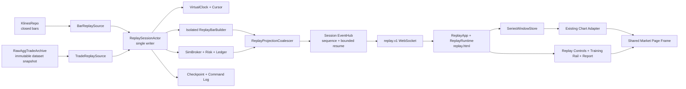

# CandleScope K 线回放与模拟交易训练执行文档

状态：设计与阶段边界已冻结；前端固定采用独立回放页面，尚未开始功能实现。

工作树：`H:\program\CandleScope-kline-replay`

分支：`codex/kline-replay-training`

基线提交：`c9a1ddbfe316c68c91787b69c783baeeb0670a9f`（2026-07-18）

本文是 K 线回放、成交驱动回放和模拟交易训练功能的主执行文档。后续实现必须按 Phase 顺序推进；每个 Phase 都要独立验证、独立提交、独立回滚。没有达到当前 Phase 的退出门槛时，不得开始下一 Phase。

---

## 1. 本文解决什么问题

目标不是在浏览器里做一个“定时向右加 K 线”的动画，而是建设一个可验证、可暂停、可恢复、可倍速、可快进、可模拟下单，并且不会偷看未来的确定性历史市场运行时。

前端产品形态固定为：用户从普通实时行情页点击带“新页面”提示的回放入口，浏览器打开专用回放页面。回放页面复用实时行情的视觉骨架、图表和绘图能力，但拥有独立组合根，只挂载 replay runtime；不在实时行情页面内切换 live/replay source。

系统最终提供两种市场事件源，但只维护一套回放核心：

1. **BAR 回放**
   - 从本地可信历史 K 线中选择最小可用基础周期；
   - 一次 `step` 只推进一个基础周期；
   - 展示周期可以大于基础周期，例如基础周期 1m、展示周期 5m；
   - 每推进一根 1m，正在形成的 5m K 线随之更新，第五根 1m 到达后才收盘。
2. **AGG_TRADE 回放**
   - 严格按 `(trade_time_ms, agg_trade_id)` 顺序消费历史聚合成交；
   - 后端通过隔离的 replay bar builder 生成临时 K 线；
   - 支持真实历史时间轴上的暂停、播放、倍速和快速推进；
   - 不把临时 K 线写回生产 K 线表。

两个模式共用：

- 一个服务端虚拟时钟；
- 一个单写者 Session Actor；
- 一套 command/event 协议；
- 一套模拟订单、持仓、费用、PnL 和账本；
- 一套 checkpoint、恢复、报告和训练日志；
- 一套前端 `ReplayRuntime` 和播放控制界面。

---

## 2. 如何执行本文

### 2.1 固定执行纪律

1. 只在 `H:\program\CandleScope-kline-replay` 修改回放相关文件。
2. 开始任一 Phase 前，先确认工作树干净，或确认现有改动全部属于当前 Phase。
3. 先写失败测试，再写最小实现，再跑本 Phase 测试，最后跑全局门禁。
4. 每完成一个 Phase，填写文末执行记录，并提交一个可独立回滚的 checkpoint。
5. 默认保持 `REPLAY_ENABLED=0` 和 `VITE_REPLAY_ENTRY_ENABLED=0`；只有 Phase 7 本地闭环时才允许开发环境为专门验证显式开启，完成后恢复关闭。
6. 不共享主工作树正在使用的 SQLite 文件、回放数据库或原始成交归档。
7. 不为了演示而放宽完整性检查、未来数据隔离、命令幂等或账本守恒。
8. 文档中标为“新建”的路径允许在实施时按同一模块内聚原则小幅调整，但模块所有权、协议语义和退出门槛不得改变；若必须改变，先更新本文并说明原因。

### 2.2 每个 Phase 开始前执行

```powershell
Set-Location H:\program\CandleScope-kline-replay
git branch --show-current
git status --short
git log -1 --oneline
```

预期：

```text
codex/kline-replay-training
c9a1ddb feat(frontend): add liquidation indicator
```

### 2.3 新工作树本地环境初始化

当前新工作树没有独立 `.venv`、`node_modules` 和本地市场数据。第一次执行 Phase 0 时完成以下初始化；这些目录均不提交 Git。

```powershell
Set-Location H:\program\CandleScope-kline-replay\backend
py -m venv .venv
.\.venv\Scripts\python.exe -m pip install --upgrade pip
.\.venv\Scripts\python.exe -m pip install -r requirements.txt

Set-Location H:\program\CandleScope-kline-replay\frontend
npm ci
```

到 Phase 8 才安装 Parquet 可选依赖：

```powershell
Set-Location H:\program\CandleScope-kline-replay\backend
.\.venv\Scripts\python.exe -m pip install -r requirements-parquet.txt
```

### 2.4 独立开发端口与独立数据目录

为避免与主工作树 `15173/18080`、其他工作树 `15174/18081` 冲突，本工作树固定使用：

| 服务 | 端口 |
|---|---:|
| Vite | `15175` |
| FastAPI | `18082` |

开发数据必须复制到本工作树或使用专用 fixture。禁止让回放开发实例直接读写主工作树正在使用的 `candlescope.db`，也不要在主后端可能写入时用普通文件复制制造不一致快照。

```powershell
$replayData = 'H:\program\CandleScope-kline-replay\backend\data\replay-dev'
New-Item -ItemType Directory -Force -Path $replayData | Out-Null

# Phase 0 新增该脚本后，用 SQLite online-backup API 生成一致快照并执行 quick_check。
Set-Location H:\program\CandleScope-kline-replay\backend
.\.venv\Scripts\python.exe scripts\snapshot_replay_klines.py `
  --source 'H:\program\CandleScope\backend\data\candlescope.db' `
  --destination "$replayData\source-candlescope.db" `
  --require-quick-check
```

快照脚本必须拒绝 source 与 destination 指向同一文件，目标已存在时默认拒绝覆盖，并使用临时目标 + 原子替换发布。Phase 0 之前只使用测试 fixture，不直接复制活动数据库。

启动后端：

```powershell
Set-Location H:\program\CandleScope-kline-replay\backend
$env:PYTHONUTF8 = '1'
$env:KLINES_DB_PATH = 'H:\program\CandleScope-kline-replay\backend\data\replay-dev\source-candlescope.db'
$env:REPLAY_DB_PATH = 'H:\program\CandleScope-kline-replay\backend\data\replay-dev\replay.db'
$env:RAW_AGG_TRADE_ARCHIVE_DIR = 'H:\program\CandleScope-kline-replay\backend\data\replay-dev\raw_agg_trades'
$env:REPLAY_ENABLED = '1'
.\.venv\Scripts\python.exe -m uvicorn app.main:app --reload --host 127.0.0.1 --port 18082
```

另开终端启动前端：

```powershell
Set-Location H:\program\CandleScope-kline-replay\frontend
$env:VITE_API_PROXY_TARGET = 'http://127.0.0.1:18082'
$env:VITE_DEV_PORT = '15175'
$env:VITE_REPLAY_ENTRY_ENABLED = '1'
npm run dev
```

`VITE_REPLAY_ENTRY_ENABLED=1` 只在 Phase 7 本地闭环或专门的 replay smoke 中使用；Phase 0-6 的普通开发启动仍保持 `0`。后端 `REPLAY_ENABLED` 始终是权威开关。

---

## 3. 当前仓库基线与已确认边界

### 3.1 可直接复用的现有能力

- `backend/app/data_engine/storage/klines_repo.py`
  - 已提供 `query_bars`、`get_bounds`、`list_series`、`scan_gaps` 等 K 线查询能力；
  - BAR 回放通过新 adapter 使用这些契约，不直接写 SQL。
- `backend/app/data_engine/bar_aggregator/`
  - 聚合器本身不依赖交易所、存储和 API；
  - 已有 `on_market_event`、`ingest_bar_input`、`seed_active_bar`、`aggregate_batch` 等入口；
  - 回放必须创建隔离实例，不能复用在线 runtime 的活动 target 或 active bar。
- `backend/app/data_engine/storage/raw_trade_archive.py`
  - 已有可替换的 `RawAggTradeArchive` 抽象；
  - 当前 Parquet 实现按 `(trade_time_ms, agg_trade_id)` 排序和去重；
  - `coverage()` 可以在给出期望 ID 边界时做精确完整性判断。
- `frontend/src/features/market-data/feed/seriesDataFeed.ts`
- `frontend/src/features/market-data/window/seriesWindowStore.ts`
  - 当前主图的权威数据路径是 `REST/WS -> SeriesDataFeed -> SeriesWindowStore delta -> chart adapter renderer`；
  - 回放要复用 `SeriesWindowStore` 的 `replace/append/tick` 增量语义，不能另建第二套图表数据真值。
- `frontend/src/app/App.tsx`
  - 是现有实时行情 feature runtime 的组合根，继续只负责 live 页面；
  - 回放入口可以在这里接入，但不得在此挂载 replay runtime 或保存 replay bars。
- `frontend/src/app/AppShell.tsx`
- `frontend/src/app/ChartWorkspace.tsx`
  - 已提供可复用的顶部栏、周期栏、主图、绘图工具、右侧栏和状态栏骨架；
  - Phase 6 把纯布局部分提取为 slot-based shared frame，由 live shell 与 replay shell 分别组合，不能复制两套图表页面结构。

### 3.2 现有能力不能被误用的地方

1. `TradeFlowEngine` 是在线追加成交管线，不承载回放状态机。
2. `DataManager EventBus` 是在线市场数据总线，不承载某个用户的私有 replay session。
3. 当前 `RawAggTradeArchive.scan_range()` 会把最多一百万行物化成列表，不能直接承担长时成交回放；Phase 8 必须增加 cursor/page 或 RecordBatch 读取边界。
4. 当前 raw aggTrade 归档默认关闭，而且新工作树没有历史原始成交；不能在 Phase 7 宣称成交回放已经可用。
5. 当前 P3A order book 不落历史，也不是 gap-free full depth；不能用于历史盘口或精确撮合回放。
6. `aggTrade` 是聚合成交，不等于每一条原始撮合；它能驱动 OHLCV 和 tape-level 模拟，但不能证明 aggregate 内部 fill 顺序或盘口排队位置。
7. `chartDatasetKey` 当前只有 `exchange-marketType-symbol-interval`；不扩展 source/session/data epoch 就会把在线缓存和回放缓存混在一起。
8. `useMarketDataRuntime` 当前会建立在线 REST/WS、预取和 warm-cache 行为；专用 `ReplayApp` 不得挂载它，也不得通过短暂 mount/unmount 取得 live 数据。
9. 当前 `ChartWorkspace` 和 `AppShell` 直接依赖 live watchlist/order book runtime；回放不能传入伪 live runtime 迁就类型，必须提取共享布局槽位并提供 replay 专属右侧栏。

### 3.3 已有文档给出的强制继承契约

`docs/TRADE_FLOW_P2A_BACKEND_zh.md` 已规定：

- 回放先调用 archive `coverage()`；
- 数据不完整时，精确模式必须拒绝，或显式标为 best-effort；
- 按 `(trade_time_ms, agg_trade_id)` 读取；
- 使用独立 replay bar builder；
- 临时 K 线不能污染生产 K 线主链；
- 不把回放状态机放进实时 `TradeFlowEngine`。

`docs/ORDER_BOOK_P3A_BACKEND_zh.md` 已规定：

- 当前原始盘口不落库；
- 没有历史查询和完整订单簿回放能力；
- 成交驱动 K 线回放继续依赖 `RawAggTradeArchive`，不依赖 P3A 盘口。

本文继承这些边界，不重新解释或削弱它们。

---

## 4. 产品范围、首个闭环与非目标

### 4.1 v1 必须交付

- 创建、恢复、结束一个 replay session；
- 从实时行情 TopBar 以新页面打开专用 replay entry，原 live 页面保持独立；
- 回放页面复用同一市场工作区骨架，但不挂载任何 live market runtime；
- 随机或手动选择合格历史起点；
- BAR 和 AGG_TRADE 两种输入源共用同一核心；
- 播放、暂停、单步、倍速、按虚拟时长快速推进；
- 服务端权威虚拟时钟和 cursor；
- 只显示已经揭示的数据；
- 基础周期与展示周期分离；
- 模拟市价、限价、止损市价、止盈市价、撤单和平仓；
- 虚拟余额、持仓、已实现/未实现 PnL、手续费和逐项账本；
- 断线重连、checkpoint 和后端重启后以暂停状态恢复；
- 训练日志、结束报告、数据与执行保真度标签；
- blind mode：结束前不把真实历史日期发给浏览器；
- BAR 模式完整闭环先交付，AGG_TRADE 模式在同一分支后续 Phase 接入。

### 4.2 首个纵向切片

Phase 7 的首个可用闭环固定为：

```text
source_kind       = BAR
base_interval     = 本地连续覆盖中最小的可信周期，首测使用 1m
display_interval  = 1m / 5m / 15m
execution_model   = PAPER_LINEAR_V1
account_mode      = one-way 单净持仓
data_quality      = EXACT_BAR_COVERAGE
```

`PAPER_LINEAR_V1` 是明确标注的训练模型：允许做多/做空、杠杆、费用和逐日盯市，但不冒充某家交易所的历史账户、盘口排队、资金费率或强平引擎。

### 4.3 v1 非目标

- 不连接真实下单 API，不读取交易 API key；
- 不声称达到交易所级撮合、盘口队列或历史滑点复原；
- 不用当前 latest-wins order book 做历史 L2 回放；
- 不在 v1 实现多人协作、云同步或排行榜；
- 不在 v1 实现实时报价页内的 live/replay 原地切换、跨窗口 store 同步或 opener 控制；回放固定使用独立页面；
- 不支持任意时间倒放；
- 不允许带活动订单/持仓的 session 静默跳回过去并改写账本；
- 不在 Phase 7 支持依赖在线历史查询的服务端指标或 Pyne `security()`；
- 不为了成交回放修改在线 TradeFlow 的事件顺序或消费者语义；
- 不把 replay 临时 K 线写入 `candlescope.db` 的生产 K 线表；
- 不在没有 mark price、funding、instrument rules 和 margin tier 历史覆盖时宣称“Binance Futures 精确模拟”。

---

## 5. 不可妥协的不变量

### 5.1 单一核心

BAR 和 AGG_TRADE 只是 `ReplayMarketSource` 的两个实现。播放、命令、订单、账本、checkpoint、事件流和 UI 不允许复制成两套。

### 5.2 服务端权威

- 虚拟时钟、session state、order state、position、ledger 和 event sequence 的真值都在后端 Session Actor；
- 浏览器只发送带幂等 ID 的 command，并消费 snapshot/delta；
- 浏览器 `setInterval` 不能直接决定市场推进；
- 多标签页冲突通过 `expected_revision` 和单 controller lease 解决。

### 5.3 确定性

以下输入相同时，最终 `state_hash` 必须完全一致：

- dataset manifest / `data_epoch`；
- replay core version；
- execution model version；
- session config；
- random seed；
- 有序 command log。

播放到 T、单步到 T、100x 播放到 T、`advance_by` 到 T 和 checkpoint 恢复后推进到 T，必须得到相同订单、成交、账本、K 线和 state hash。

### 5.4 无未来数据

任意时刻，以下位置都不得出现 `event_time > virtual_time` 的市场数据：

- replay HTTP snapshot；
- replay WebSocket message；
- 前端 `SeriesWindowStore`；
- React bars read model；
- 指标输入；
- alerts、advanced market data、order book、watchlist warm cache；
- 导出内容和训练报告中的过程数据。

### 5.5 事件不能因快进而跳过

`advance_by(1h)` 不是把 cursor 时间戳直接加一小时。后端必须顺序消费这一小时内每个基础 bar 或每条成交，执行订单触发、成交、费用、PnL、止盈止损和 bar builder；只允许合并前端投影，不允许跳过核心事件。

### 5.6 不追溯成交

订单只允许由下单 command 被接受后的下一条合格市场事件触发。已经展示给用户的 bar/trade 永远不能反过来成交一张新订单。

### 5.7 账本守恒

- 金额、价格、数量和费用的权威计算使用 `Decimal` 或按 instrument scale 的定点整数；
- 账本中禁止二进制浮点累计；
- 每个 fill 必须对应费用和 position/cash 变更；
- `equity = cash + realized_component + unrealized_component - reserved` 的模型定义必须唯一并测试；
- 任一 command 失败时不能留下半笔订单或半笔账。

### 5.8 完整性 fail closed

- EXACT 模式遇到 K 线 gap、aggTrade ID gap、checksum 失败、manifest 变化或 archive degraded，创建 session 或继续恢复必须失败；
- BEST_EFFORT 必须由用户显式选择，并持续显示水印；
- 随机训练默认只从 EXACT eligible windows 抽样。

### 5.9 与在线链路隔离

- replay package 不向在线 `DataManager EventBus` 发布 session 事件；
- replay 不获取 live subscription lease；
- `replay.html` 由独立 `ReplayApp` 启动，不能 mount `useMarketDataRuntime`、advanced market、order book、watchlist、watchlist full-cache、live alerts 或在线 indicator runtime；
- 回放页面生命周期内不得产生 live Kline REST/WS、advanced market WS、order book WS、liquidation WS、watchlist price/full-cache WS，也不得用真实当前价格覆盖 replay state；
- 原实时行情页面是另一个 browser document，可以继续运行 live source；“live 副作用为零”的验收范围是回放页面及其 worker、timer、storage 和网络连接，不是把用户其他实时行情标签页强制停掉；
- live 页面与 replay 页面不共享 React store、runtime singleton、controller、bars 或可变缓存；关闭 replay 页面不触发 live source 恢复流程，也不应改变原 live 页面；
- 入口使用 `noopener,noreferrer`，不得依赖 `window.opener`、跨窗口对象引用或把 session config/真实历史时间写入共享 localStorage/BroadcastChannel。

### 5.10 真实交易硬隔离

回放 package、前端 replay feature 和 replay API 不得 import 或调用任何私有交易、签名请求、API key、真实订单 adapter。后端增加架构测试，发现这类依赖直接失败。

---

## 6. 目标架构



### 6.1 后端模块所有权

建议新增：

```text
backend/app/replay/
  __init__.py
  constants.py
  errors.py
  models.py
  canonical.py
  catalog.py
  dataset.py
  clock.py
  commands.py
  events.py
  actor.py
  checkpoints.py
  projection.py
  service.py
  runtime.py
  sources/
    __init__.py
    base.py
    bar_source.py
    trade_source.py
  bars/
    __init__.py
    builder.py
  broker/
    __init__.py
    models.py
    execution.py
    risk.py
    ledger.py
    report.py
  storage/
    __init__.py
    sqlite_store.py
    schema.py
```

现有 bootstrap 只负责构造和生命周期：

```text
backend/app/data_engine/runtime.py
backend/app/main.py
backend/app/api/v1/replay.py
backend/app/api/v1/stream.py
backend/app/api/v1/stream_replay.py
backend/app/core/config.py
```

约束：

- `app.replay` 可以依赖 K 线 repo、raw archive 和纯 bar aggregator 契约；
- `app.replay` 不依赖 `DataManager`；
- `DataEngineRuntime` 可以拥有 `ReplayService | None` 的生命周期并暴露 `app.state.replay_service`；
- replay shutdown 必须在 archive/storage 被关闭前暂停 actor、落 checkpoint、排空持久化队列；
- replay 构造失败且 `REPLAY_ENABLED=1` 时启动失败；关闭时明确暴露 disabled，不静默降级。

### 6.2 前端模块所有权

建议新增：

```text
frontend/replay.html
frontend/src/replay-main.tsx
frontend/src/app/MarketPageFrame.tsx
frontend/src/app/MarketWorkspaceFrame.tsx
frontend/src/features/market-data/marketDataRuntimeContract.ts
frontend/src/features/replay/
  README.md
  ReplayApp.tsx
  ReplayPageShell.tsx
  replayEntry.ts
  useReplayEntryCapability.ts
  replayTypes.ts
  replayParser.ts
  replayApi.ts
  replayStreamController.ts
  replayStore.ts
  replaySeriesProjection.ts
  useReplayRuntime.ts
  useReplayIndicatorRuntime.ts
  replayShortcuts.ts
  components/
    ReplayTopBar.tsx
    ReplaySessionDialog.tsx
    ReplayControlBar.tsx
    ReplayRightRail.tsx
    ReplayOrderTicket.tsx
    ReplayPositionPanel.tsx
    ReplayOrdersPanel.tsx
    ReplayReportPanel.tsx
    ReplayFidelityBadge.tsx
    ReplayStatusBar.tsx
```

需要调整的组合点：

```text
frontend/src/app/App.tsx
frontend/src/app/AppShell.tsx
frontend/src/app/appShellContracts.ts
frontend/src/app/appShellViewModel.ts
frontend/src/app/TopBar.tsx
frontend/src/app/ChartWorkspace.tsx
frontend/src/features/chart-session/chartDatasetKey.ts
frontend/vite.config.js
```

页面 bootstrap 固定为两个独立入口：

```text
index.html  -> src/main.tsx        -> App / live runtimes only
replay.html -> src/replay-main.tsx -> ReplayApp / replay runtimes only
```

约束：

- 不为了两个页面引入运行时 source router，也不在同一 React 组件里按 URL 条件调用 live/replay hooks；两个组合根各自拥有固定 hook 列表；
- `MarketPageFrame` 只负责 `TopBar -> IntervalSelector -> optional ReplayControlBar -> workspace -> StatusBar` 的布局槽位，不拥有数据源；
- `MarketWorkspaceFrame` 复用主图、drawing toolbar、export surface 和可调整右侧栏位置，但右侧栏内容由 live/replay shell 注入；
- live `AppShell` 继续注入 watchlist + order book；`ReplayPageShell` 注入 training account + order ticket + position/orders/fills；
- live 与 replay runtime 都实现独立提取的 `MarketDataRuntimeContract`，最终图表仍只消费一份 runtime contract 和一个 `SeriesWindowStore`；
- `ReplayApp` 对 live runtime modules 的 value import 由 architecture check 禁止；只允许从无副作用的共享 types、chart adapter、drawing、settings 和纯计算模块取依赖；
- Vite 必须把 `index.html` 与 `replay.html` 都纳入 build/smoke；生产静态服务若提供 `/replay` 友好路径，只能重写到 `replay.html`，不能落回 live `index.html`；
- URL 只允许携带 opaque `session_id`、公开页面状态和 synthetic time 信息；不得携带 actual start/end、dataset 文件名、controller credential 或其他 blind mapping。

---

## 7. 核心领域协议

### 7.1 ReplaySessionConfig

创建后不可变的字段：

```json
{
  "protocol": "replay.v1",
  "source_kind": "bar",
  "exchange": "binance",
  "market_type": "spot",
  "symbol": "BTCUSDT",
  "base_interval": "1m",
  "display_interval": "5m",
  "start_policy": "random_eligible",
  "requested_start_ms": null,
  "warmup_bars": 500,
  "horizon_ms": 604800000,
  "random_seed": 20260718,
  "quality_mode": "exact",
  "blind_mode": true,
  "initial_equity": "10000.00",
  "quote_asset": "USDT",
  "execution_model": "paper_linear_v1",
  "fee_model": { "maker_bps": "2.0", "taker_bps": "4.0" },
  "slippage_model": { "kind": "fixed_bps", "market_bps": "1.0" },
  "max_leverage": "5",
  "pause_on_controller_loss": true
}
```

规则：

- `base_interval` 不是简单读取“交易所声明的最小周期”，而是交易所支持周期与本地连续可信覆盖的交集中的最小值；
- `display_interval >= base_interval`，并且必须能按现有 interval policy 明确聚合；
- random start 只在满足 warmup、horizon、closed-bar、gap、instrument-rule 覆盖的 eligible windows 中抽样；
- 后端返回最终解析后的 config，不让前端猜默认值；
- session 创建后，身份、数据源、起点、seed、execution model 和 fee model 不可原地修改；变化时创建新 session 或 fork。

### 7.2 ReplaySessionState

公开状态：

```text
INITIALIZING -> PAUSED -> PLAYING -> PAUSED -> ENDED
                         |          |
                         +-------> ERROR
```

`RECOVERED_PAUSED` 是后端重启恢复后的公开原因，不是自动播放状态。

禁止转换：

- `ENDED -> PLAYING`；
- `ERROR -> PLAYING`，除非错误类型明确可恢复且完成 dataset revalidation；
- `PLAYING -> seek_to`，必须先原子暂停；
- 活动账本 session 无 disposition 的向后 seek。

每次有效 command 增加 `revision`。每个公开 event 增加单调 `sequence`。两者用途不同，不能混用。

### 7.3 Command envelope

所有变更走同一个 actor queue：

```json
{
  "protocol": "replay.v1",
  "command_id": "01J...",
  "client_instance_id": "browser-tab-uuid",
  "expected_revision": 42,
  "type": "step",
  "payload": { "count": 1 }
}
```

v1 command：

```text
acquire_controller
release_controller
play
pause
set_speed
step
advance_by
seek_to
place_order
cancel_order
close_position
add_journal_note
reveal_history
end_session
```

幂等规则：

- `(session_id, command_id)` 唯一；
- 同 ID、同 canonical payload 重试返回原结果；
- 同 ID、不同 payload 返回 `409 COMMAND_ID_REUSED`；
- `expected_revision` 不匹配返回 `409 REVISION_CONFLICT` 和最新 snapshot hint；
- 领域校验失败不增加 revision，不留下部分写入；
- command log 记录 accepted/rejected、错误码、接受时 cursor、结果 sequence，但 state hash 只纳入已接受且影响领域状态的命令。

### 7.4 播放语义

| Command | 精确定义 |
|---|---|
| `play` | 从当前 cursor 按虚拟时间差调度后续市场事件 |
| `pause` | actor 完成当前原子事件后停止；ack 后不得再出现更晚市场事件 |
| `set_speed` | 设置 `virtual_elapsed / wall_elapsed`；不改变事件顺序 |
| `step(count=N)` | PAUSED 下消费恰好 N 个 source event；BAR 为 N 根基础 K，AGG_TRADE 为 N 条聚合成交 |
| `advance_by(ms)` | 顺序消费至目标虚拟时间，内部事件全部执行，投影可合并；完成后 PAUSED |
| `seek_to(ms)` | 从 checkpoint 重建视图；影响账本时必须显式 reset 或 fork |

1x 表示按真实历史时间流速播放。基础 1m 的 BAR 模式下，60x 约等于每秒一根 1m；UI 同时显示倍速和等效 bar cadence，避免误解。

允许速度集合初始固定为：

```text
1x, 5x, 15x, 30x, 60x, 120x, 300x, 600x, MAX
```

`MAX` 仍处理全部核心事件，只关闭 wall-clock 等待，并把前端普通市场投影限制在最多 30 次/秒。订单成交、暂停 ack、session 结束、错误和最终 snapshot 不得被投影合并掉。

### 7.5 Cursor

公共 cursor 至少包含：

```json
{
  "virtual_time_ms": 1710000000000,
  "source_sequence": 12345,
  "last_base_bar_open_ms": 1709999940000,
  "last_trade_time_ms": null,
  "last_agg_trade_id": null,
  "at_end": false
}
```

AGG_TRADE 的唯一稳定位置是 `(trade_time_ms, agg_trade_id)`，不能只用时间戳；同一毫秒可能有多条成交。

blind mode 下，公开 `virtual_time_ms` 和 bar/trade/order 时间全部是 synthetic public time；实际历史时间只存在于后端 dataset cursor 和受保护的 replay 存储中。

### 7.6 Replay event envelope

```json
{
  "type": "replay.delta",
  "protocol": "replay.v1",
  "session_id": "...",
  "sequence": 120,
  "revision": 42,
  "virtual_time_ms": 1710000000000,
  "state_hash": "sha256:...",
  "data_epoch": "sha256:...",
  "data": {}
}
```

事件种类：

```text
replay.snapshot
replay.status
replay.bar.replace
replay.bar.append
replay.bar.tick
replay.order
replay.fill
replay.position
replay.account
replay.journal
replay.warning
replay.resync_required
replay.ended
```

要求：

- snapshot 自洽，能从空前端 store 完整恢复；
- delta 只引用已经存在或本消息创建的实体；
- WebSocket transport coalescing 不改变领域 sequence；若合并多个内部 event，必须带 `sequence_from/sequence_to`；
- ring buffer 无法补齐 `after_sequence` 时 fail closed，发送 resync_required 并由客户端重新拉 snapshot；
- parser 遇到未知 protocol、非法 Decimal、倒退 sequence、错误 session/data epoch 时丢弃消息并重同步，不能尽力猜测。

### 7.7 状态哈希

使用 canonical JSON：字段排序固定、整数时间戳、Decimal 规范字符串、无 NaN/Infinity、UTF-8、明确 schema version。

hash 包含：

- cursor；
- active/closed bars 的权威 builder state；
- open orders、fills、position；
- cash、margin、realized/unrealized PnL、fees；
- accepted domain command position；
- blind/reveal 审计状态；
- dataset/core/execution versions。

hash 不包含：

- wall-clock 时间；
- WebSocket 连接数；
- UI 面板状态；
- 投影 coalescing 批次；
- 诊断 counters。

---

## 8. 数据集、随机起点与时间隐藏

### 8.1 BAR dataset snapshot

创建 BAR session 时：

1. 用 `list_series/get_bounds/scan_gaps` 找到候选序列；
2. 计算 `warmup_start .. replay_end`；
3. 只读取已收盘基础 K 线；
4. 校验时间对齐、唯一性、连续性、OHLC 关系、非负 volume；
5. 将有界范围读取为 session 的不可变 `BarDatasetSnapshot`；
6. 对 identity、interval、rows、source bounds、schema version 做内容哈希，得到 `data_epoch`；
7. session 后续只读该 snapshot，不随在线 DB backfill 变化。

首版限制：单 session 最大 horizon 30 天、warmup 最大 5000 根基础 K。超过限制返回明确错误，不隐式截断。

### 8.2 AGG_TRADE dataset snapshot

成交量大，不能整段载入内存。需要 archive 提供不暴露 Parquet 路径的不可变 snapshot handle：

```text
ReplayTradeDatasetRef
  dataset_epoch
  identity
  start/end time
  expected first/last aggregate ID
  immutable object manifests + checksums
  completeness
  source quality
```

活动 session pin 住 dataset generation；离线 compaction/retention 不能删除仍被 pin 的对象。恢复 session 时重新验证 manifest 和 checksum，不一致则进入 `ERROR_DATASET_MISMATCH`。

### 8.3 Eligible window

一个窗口只有同时满足以下条件才可进入随机池：

- identity 和 base interval 明确；
- start 对齐基础周期边界；
- start 前有足够 warmup；
- start 后有完整 horizon；
- 整段没有 K 线 gap 或 aggregate ID gap；
- 所有 BAR 数据已收盘；
- execution model 所需 instrument filter、费用和规则有明确 snapshot；
- source 没有 sticky degraded marker；
- 数据质量满足请求的 exact/best-effort 模式。

随机算法由后端执行，使用稳定 PRNG、seed 和 catalog version。相同 seed 与 catalog epoch 选择相同起点。默认按合格基础时间点均匀采样，不按收益、波动或后来结果加权。

### 8.4 Blind mode

仅在 UI 上隐藏标签不够，因为浏览器网络面板仍能看到真实时间。blind mode 必须由后端做时间映射：

```text
public_time = synthetic_origin + (actual_time - actual_replay_start)
```

要求：

- session 运行期间 API/WS 不返回 actual start/end/time；
- dataset ref、错误文本和日志 payload 不包含可推断日期的文件名；
- K 线、成交、订单和报告草稿使用 synthetic public time；
- 后端内部和 replay DB 保留实际时间映射；
- `reveal_history` 是不可逆审计命令；只有该命令成功后才单独返回真实区间；
- 结束 session 只让 reveal 选项可用，不自动把真实日期塞进结束响应、report 或导出；
- reveal 状态进入 revision、command log 和 state hash。

blind mode 防止直接日期泄漏，但不能防止用户凭价格形态猜年份；UI 需要明确说明这一限制。

---

## 9. ReplayBarBuilder 语义

### 9.1 BAR 输入

创建 session 时，virtual time 位于 `replay_start_ms`，图上只放入 start 之前的 warmup closed bars。

处理一根基础 bar 的固定阶段：

1. 到达 `base_bar.open_time`；
2. 处理上一 cursor 后已接受、可在 open 执行的订单；
3. 使用本 bar 的 O/H/L/C 做保守触发判定；
4. 更新 broker mark 和账本；
5. 将基础 bar 输入隔离 builder；
6. 产生展示周期 `append/tick/close`；
7. virtual time 到达该基础 bar close；
8. 计算 state hash 并发布投影。

基础 1m、展示 5m 时，前四根 1m 都是同一根 5m 的 `tick`，第五根才把 5m 变为 closed 并允许下一根 append。

### 9.2 AGG_TRADE 输入

每条 aggregate trade：

1. 校验严格大于上一 cursor 的 `(trade_time_ms, agg_trade_id)`；
2. 处理可由此 trade 成交的订单；
3. 更新 mark、position unrealized PnL；
4. 输入隔离 builder；
5. 必要时关闭跨过的 bar，并处理无成交空档策略；
6. 发布必须事件或合并普通图表投影。

同一 aggregate 内没有逐 fill 顺序，因此 builder 可用其 price/quantity 生成 OHLCV，但 execution fidelity 必须标为 `AGG_TRADE_TAPE`，不能标为 `RAW_TRADE`。

### 9.3 空档规则

必须在 Phase 3 冻结并测试，不允许不同 source 自行解释：

- 24/7 crypto 标准 interval 中没有成交时，是否生成 `O=H=L=C=previous_close, volume=0` 的 synthetic bar，由 catalog/source policy 明确决定；
- 若生产 K 线源本身没有该 bar，EXACT BAR parity 默认把它视为 gap，不私自补；
- trade-driven builder 若按交易所 K 线定义需要补空 bar，必须标记 `synthetic=true`；
- synthetic bar 可以更新图表时间轴，但是否允许触发订单必须为 false。

### 9.4 与在线聚合器关系

- 使用 `BarAggregator` 的隔离实例或薄 adapter；
- 禁止注册进在线 target registry；
- 禁止发布到在线 EventBus；
- 不共享 active bar；
- 用同一组 trade fixtures 对比 replay builder 与现有标准 interval 聚合结果；
- 如果为了 replay 修改公共聚合器，必须先证明在线 `test_bar_aggregator_contracts.py` 全部不变。

---

## 10. 模拟交易模型

### 10.1 v1 订单类型

```text
MARKET
LIMIT
STOP_MARKET
TAKE_PROFIT_MARKET
```

公共字段：

```text
order_id, client_order_id, side, quantity, reduce_only,
order_type, limit_price, stop_price, status,
accepted_source_sequence, created_public_time, model_version
```

初版为 one-way 净持仓；不实现 hedge mode。止盈止损可以通过 reduce-only 子单组成 bracket，但每张子单仍是独立账本实体。

### 10.2 BAR_CONSERVATIVE_V1

- MARKET：在下一根基础 bar open 成交，再应用 taker fee 和配置滑点；
- LIMIT：只有下单后的后续基础 bar 覆盖价格才可成交；
- buy limit 需要 `low <= limit`，sell limit 需要 `high >= limit`；
- 为避免虚构更优价，普通穿越按 limit price 成交；gap 规则单独测试并采用对训练者不利的保守价格；
- STOP/TP：只有后续基础 bar 触发；
- 同一 bar 同时触及止损和止盈时，按最不利顺序处理并记录 `AMBIGUOUS_INTRABAR_WORST_CASE`；
- 同一 bar 同时触及 entry 和 exit 时，先按保守规则确认 entry 是否可发生，再按不利路径处理 exit；
- BAR 模式不模拟盘口队列、真实 partial fill 或 bar 内精确路径。

### 10.3 AGG_TRADE_TAPE_V1

- MARKET：从 command 后第一条合格成交开始，按 tape quantity 有界 partial fill，并应用滑点；
- passive buy limit 默认要求后续 trade price **严格低于** limit，sell limit 默认要求严格高于 limit；相等价格不能证明排队轮到本订单；
- fill quantity 不得超过该 tape event 可用 quantity 和剩余 order quantity；
- aggregate trade 只给出聚合数量，不能声称恢复内部 fills；
- 没有 L2 时不估算 queue position；
- 所有报告持续显示 `execution_fidelity=AGG_TRADE_TAPE`。

### 10.4 PAPER_LINEAR_V1 账户

支持：

- quote currency 初始权益；
- 多/空单净持仓；
- entry price、position quantity、notional；
- realized/unrealized PnL；
- maker/taker fee；
- max leverage、max position notional、max order quantity；
- reduce-only；
- margin reservation 和下单前风险拒绝；
- 平仓交易统计。

明确不支持：

- 历史 funding；
- 交易所 maintenance margin tier；
- 真实 insurance fund/ADL；
- cross-account 多资产抵押；
- 盘口冲击和真实强平队列。

UI 必须写“训练账户 / PAPER_LINEAR_V1”，不能写“Binance 模拟合约账户”。

### 10.5 原子处理顺序

单个 source event 内固定为：

```text
validate source order
-> activate eligible commands
-> evaluate risk/order triggers
-> create fills
-> post fee/cash/margin ledger entries
-> update position
-> update mark/unrealized PnL
-> update bars
-> assert invariants
-> persist required transaction/checkpoint marker
-> publish event batch
```

任何一步失败，整个 source event 的领域状态回滚，session 进入可诊断 ERROR；不能发布半成品 delta。

---

## 11. 存储模型

### 11.1 独立数据库

新增：

```text
REPLAY_DB_PATH=<CANDLE_DATA_DIR>/replay.db
```

不得把 replay session 表塞进 K 线主库。建议表：

```text
replay_schema_version
replay_session
replay_dataset_ref
replay_command_log
replay_order
replay_fill
replay_ledger_entry
replay_checkpoint
replay_journal_entry
replay_report
```

### 11.2 事务边界

- 一个 command 的持久化结果是一个事务；
- 一个产生 fill/ledger 或其他必须持久化领域变化的 source event 是一个事务；无领域变化的高频 market event 可只推进内存并由 checkpoint 覆盖，崩溃后从最近 checkpoint 确定性重放；
- checkpoint 先写临时 payload/hash，再原子标记 active；
- event 只有事务提交后才可发布；
- command response 只有提交后才返回 accepted；
- SQLite busy 采用有界重试，耗尽后 sticky degraded 并暂停 session；
- 不允许“内存继续播放、数据库悄悄落后”。

### 11.3 Checkpoint

checkpoint 至少保存：

- schema/core/execution versions；
- dataset epoch 和 source cursor；
- virtual clock；
- bar builder active/closed tail state；
- orders、position、account、ledger tail hash；
- command log offset；
- full state hash。

初始预算：每 10,000 个 source event 或每 5 分钟虚拟时间产生一个候选 checkpoint，取先到者；高频 trade 模式还要有最小 wall-clock 间隔，避免写放大。最终值在 Phase 2 基准后固化为配置。

保留最近 32 个 checkpoint 和初始 checkpoint；清理不得删除 session 正在引用或 report 审计需要的 checkpoint。

### 11.4 后端重启

启动时：

1. 找到非 ENDED session；
2. 校验 dataset ref/data epoch；
3. 加载最近有效 checkpoint；
4. 重放 checkpoint 后 command/source tail；
5. 对比 state hash；
6. 以 `PAUSED + RECOVERED_AFTER_RESTART` 暴露；
7. 等待用户重新获取 controller；
8. 不自动恢复 PLAYING。

---

## 12. HTTP 与 WebSocket API

### 12.1 HTTP

```http
GET    /api/v1/replay/capabilities
GET    /api/v1/replay/catalog
POST   /api/v1/replay/sessions
GET    /api/v1/replay/sessions/{session_id}
POST   /api/v1/replay/sessions/{session_id}/commands
POST   /api/v1/replay/sessions/{session_id}/fork
GET    /api/v1/replay/sessions/{session_id}/report
GET    /api/v1/replay/sessions/{session_id}/journal
```

所有响应包含 `protocol=replay.v1`。错误使用稳定 code，不让前端解析 detail 文本。

必须定义的错误码：

```text
REPLAY_DISABLED
SESSION_NOT_FOUND
SESSION_ENDED
CONTROLLER_CONFLICT
REVISION_CONFLICT
COMMAND_ID_REUSED
INVALID_STATE_TRANSITION
UNSUPPORTED_SOURCE
UNSUPPORTED_INTERVAL
UNSUPPORTED_EXECUTION_MODEL
NO_ELIGIBLE_WINDOW
DATA_GAP
DATASET_INCOMPLETE
DATASET_MISMATCH
ARCHIVE_DISABLED
ARCHIVE_DEGRADED
SCAN_LIMIT_EXCEEDED
SEEK_REQUIRES_FORK_OR_RESET
ORDER_REJECTED
RISK_LIMIT_EXCEEDED
PERSISTENCE_DEGRADED
```

### 12.2 WebSocket

```http
WS /api/v1/stream/replay/{session_id}?after_sequence=<n>
```

流程：

1. 校验 feature flag、session 和 controller/viewer 权限；
2. `accept()`；
3. 能从 bounded event buffer 补齐时发送缺失 delta；
4. 不能补齐时先发送完整 `replay.snapshot`，并带 `reset=true`；
5. 后续按 sequence 推送；
6. 慢客户端超过预算时发送 `replay.resync_required` 并以 1013 关闭；
7. controller heartbeat 超时且 `pause_on_controller_loss=true` 时，actor 原子暂停。

### 12.3 Snapshot-to-live 原子交接

获取 snapshot 和注册 event subscriber 必须在同一 actor 边界完成：

```text
capture sequence N + snapshot
-> register subscriber after N
-> send snapshot N
-> send N+1...
```

不能先 HTTP 拉 snapshot、过一段时间再盲连 WS，否则会丢事件。HTTP snapshot 仅用于显式 resync；正常连接由 WS 原子发送首个 snapshot。

---

## 13. 前端无未来数据与页面隔离

### 13.1 Dataset key

扩展为结构化 key 后再序列化：

```text
sourceKind + exchange + marketType + symbol + interval
+ replaySessionId? + dataEpoch? + publicTimelineEpoch?
```

live 与 replay、不同 replay session、同一 session 不同 dataset epoch 不能命中同一缓存。

### 13.2 页面 bootstrap 与组合根

live/replay 在 React root 之前就由不同 HTML entry 分开，不做运行时 source switch：

```text
live browser document
  index.html -> main.tsx -> App -> live MarketDataRuntime -> live shell

replay browser document
  replay.html?session=<opaque-id>
  -> replay-main.tsx -> ReplayApp -> ReplayRuntime -> replay shell
```

`ReplayRuntime` 将 replay snapshot/delta 转为 `SeriesWindowStore` 的结构更新。普通 trade event 不直接进入 React；只有 bar/position/order/account read model 按预算刷新。

`ReplayApp` 初次 mount 时只能处于 `LOADING_CAPABILITIES`、`CONFIGURING`、`CONNECTING_SESSION`、`ACTIVE` 或明确错误态。任何失败都留在 replay 页面，禁止回退渲染 live bars，也禁止为了填充空白短暂挂载 live App。

### 13.3 replay 页面禁止的 runtime 与副作用

回放页面不得 mount、构造或启动：

- `useMarketDataRuntime` 的 Kline REST、Kline WS、background prefetch；
- `useAdvancedMarketDataRuntime` 的 market/liquidation history 与 WS；
- `useOrderBookRuntime` 的 order book WS；
- watchlist price subscription 和 full-cache sockets；
- 在线 indicator WS/range request；
- 任何以真实当前价格覆盖 replay `lastPrice` 的 ref 更新；
- live alerts 对当前图表 source 的订阅。

这不是 CSS 隐藏约束，而是 composition/import/network 约束：`ReplayApp` 不得创建上述 runtime；architecture check 扫描 value imports，browser smoke 拦截 live HTTP/WS，二者任一发现即失败。共享 module 若有 import-time timer、socket、singleton store 或 storage migration，也不得被 replay entry 引入。

原 live 页面允许继续实时运行，但两个页面不能共享可变 store 或通过 `window.opener` 相互写入。回放页关闭后不执行“恢复 live source”，只销毁 replay controller、timer、worker 和 connection。

### 13.4 指标策略

Phase 7：

- 只允许从当前 replay `SeriesWindowStore` 的已揭示 OHLCV 计算的本地 built-in 指标；
- 禁用后端 hosted indicator stream、range history 和 Pyne `security()`；
- UI 显示“回放中仅使用已揭示数据”的状态；
- 回放页面使用专用 `useReplayIndicatorRuntime` 或纯本地 provider；原 live 页维持自己的 indicator dataset，两个页面不复用可变缓存。

后续若恢复服务端指标，必须给 indicator request 增加 `source_kind/replay_session_id/as_of_sequence/data_epoch`，由 replay-aware provider 提供数据；禁止调用普通 Kline history endpoint 取得 cursor 之后的数据。

### 13.5 Blind mode 前端约束

- 只接收 synthetic timestamp；
- 图表时间轴显示 `D+N / HH:mm` 或训练日编号；
- TopBar、StatusBar、export、tooltip 不出现真实日期；
- localStorage/IndexedDB 不保存实际时间映射；
- session end/reveal 后由单独动作展示真实日期，而不是预先藏在 DOM。

即使 session 已 ENDED，report/export 在 `reveal_history` 前仍保持 synthetic time。

### 13.6 新页面与跨窗口边界

- live TopBar 使用普通可聚焦链接打开 `replay.html`，属性固定为 `target="_blank" rel="noopener noreferrer"`；
- 禁止先异步创建 session 再调用 `window.open()`，避免弹窗拦截和创建成功但页面未打开；session 必须在 replay 页面内创建；
- replay page title 固定包含“K 线回放”，页面首次可交互时焦点进入配置标题或第一个错误摘要；
- 创建成功后用 `history.replaceState` 写入 opaque `session_id`，刷新同一 URL 必须恢复该 session，并以服务端返回的 PAUSED/当前状态为准；
- 不把完整 session config、actual time mapping、bars、orders 或 controller token 放入 URL、`window.name`、shared localStorage、BroadcastChannel 或 opener message；
- 用户直接访问 `replay.html`、从书签恢复或没有 opener 时，功能必须完整；结束页可以提供“关闭此页”和普通 live 链接，但不能依赖控制原始标签页。

---

## 14. UI 交互定义

### 14.1 入口

live TopBar 增加有可见文字的 `K 线回放 ↗` 入口，并明确会打开新页面。不能只放图标、只靠颜色或只在 tooltip 里说明。

入口行为：

1. enabled 时渲染 `<a href="/replay.html" target="_blank" rel="noopener noreferrer">`；不得先 await capability/session API 再 `window.open()`；
2. frontend entry flag 关闭时隐藏入口；后端 capability 明确不可用时可渲染不可点击按钮，并在旁边或可访问说明中给出稳定原因；
3. live 页面若为了入口状态请求 `/api/v1/replay/capabilities`，只允许做一次有界、可取消的轻量查询，不得创建 ReplayRuntime、session 或 replay store；
4. 点击后原 live 图表、socket、watchlist 和交互状态保持不变；
5. replay 页面加载期间显示明确的“正在加载回放能力/配置”骨架，不渲染任何 live K 线或实时行情摘要；
6. 只有 replay 页面内 session 创建成功并收到首个原子 snapshot 后，才从配置态进入回放工作区；创建失败时留在配置页并显示可恢复错误。

### 14.2 Session dialog

Session dialog 位于 replay 页面，不覆盖 live 页面。字段按两层组织，避免把所有领域参数平铺成一个超长表单。

默认层：

- source：BAR / AGG_TRADE；
- exchange、market type、symbol；
- display interval；
- 随机起点 / 手动起点；
- 训练 horizon；
- blind mode；
- 初始权益。

“高级设置”折叠层：

- 后端解析或只读展示的 base interval；
- warmup bars、seed；
- exact / best-effort；
- 费用、滑点、最大杠杆；
- execution model 与其他 capability 允许的高级项。

规则：

- 不可用选项由 capabilities/catalog 响应禁用并给出具体原因，例如“本地没有连续 aggTrade archive”，不能点击提交后才泛化报错；
- Phase 7 若只开放 BAR/EXACT，AGG_TRADE 和 BEST_EFFORT 保持 disabled 或不展示，不能伪装成可用；
- 主按钮固定为“开始回放”，提交前在按钮附近持续显示 source/data/execution fidelity 摘要和 best-effort 警告；
- 创建返回的 resolved config 才是权威值；前端不得假设 base interval、fee 或 seed 默认值；
- session 创建后 symbol、exchange、market type、base interval、source、seed 和 execution model 只读；变化时结束/保留当前 session，并新建 session 或 fork。

### 14.3 Replay control bar

放在 IntervalSelector 与 ChartWorkspace 之间，仅 replay active 时显示：

```text
[结束] [后退/跳转] [单步] [播放/暂停] [前进 5m] [速度]
[虚拟时间] [进度] [BAR_1M] [PAPER_LINEAR_V1] [EXACT]
```

约束：

- 空格：播放/暂停；
- 右箭头：单步；
- Shift+右箭头：快速推进一个可配置窗口；
- 输入框、Monaco、drawing text edit 聚焦时不响应快捷键；
- command pending 时按钮显示 pending，不做乐观市场推进；
- pause ack 前 UI 可以显示“正在暂停”，但不能假装已经暂停；
- seek 涉及账本时弹出“fork / reset / cancel”，默认 cancel。

### 14.4 ReplayRightRail 与 Paper trading panel

“页面布局和实时行情一致”指复用同一页面骨架与右侧栏位置，不是复制实时侧栏内容。ReplayRightRail 替换 live watchlist + order book，至少显示：

- 可用权益、reserved margin、equity、realized/unrealized PnL、fees；
- 当前净持仓、entry、mark、liquidation 字段是否受支持；
- order ticket；
- open orders；
- fills；
- closed trades；
- fidelity warning。

下单价格和数量在前端只做提示，后端 risk engine 再权威校验。前端不预生成成交。

回放页不显示实时 watchlist price、实时 order book、Mark/Index/Basis、liquidation tape 或 live alert。BAR v1 没有历史 L2 时，订单簿位置直接用于训练账户/委托/成交，不能放一个“暂不可用”的实时订单簿占位诱导用户期待历史盘口。

### 14.5 Session 结束与报告

结束时先暂停并 flush：

1. 取消或按用户选择保留未成交订单状态到报告；
2. 可选按最后已揭示 mark 强制平仓，必须记录为 `SESSION_END_MARK_CLOSE`，不能冒充历史成交；
3. 固化 report hash；
4. 展示真实日期的 reveal 选项；
5. 导出 JSON/CSV 摘要。

报告固定留在 replay 页面。结束后提供“关闭此回放页”和普通“打开实时行情”链接；不得调用 opener 聚焦、刷新或改写原 live 页面。若用户选择继续查看报告，任何 replay controller lease 已释放或保持明确 viewer-only 状态。

报告至少包含：

- session/data/core/execution versions；
- fidelity 与 warnings；
- 初始/最终 equity；
- realized PnL、fees、max drawdown；
- 交易数、胜率、平均盈亏、profit factor；
- order/fill 列表；
- command/journal 时间线；
- ambiguous bar 数量；
- gap/best-effort 状态；
- state/report hash。

### 14.6 回放页模式标识与可访问性

- document title、TopBar 和 StatusBar 都要出现文字 `K 线回放` / `REPLAY`，不能只依赖主题色；
- TopBar 的 symbol/session identity 在 ACTIVE 后为只读，点击时解释“新建回放以更换市场”，不能打开 live symbol search 并原地改数据集；
- replay TopBar 只展示回放 OHLCV 和已揭示价格；没有 replay dataset 支持时，不渲染 Mark/Index/Basis 空壳；
- StatusBar 显示 session connection、PAUSED/PLAYING、bar count、source、quality、fidelity 和 controller 状态，禁止出现 `Connected to Binance` 或 `Live (WebSocket)`；
- 新页面入口、播放控制、速度、结束、下单和错误恢复都有可访问名称、可见 focus、键盘顺序和非颜色状态文本；
- session dialog 打开时管理焦点并提供错误摘要；快捷键不得抢占 input、textarea、select、Monaco 或 drawing text editor。

---

## 15. 初始配置与资源预算

Phase 0 先作为安全上限写入配置，Phase 2/8 基准后允许收紧，不允许无证据放宽：

| 配置 | 初始值 | 含义 |
|---|---:|---|
| `REPLAY_ENABLED` | `0` | 总开关 |
| `VITE_REPLAY_ENTRY_ENABLED` | `0` | 是否展示/启用 live TopBar 回放入口；`replay.html` 仍可构建，只控制入口可见性，不替代后端 capability 与权限校验 |
| `REPLAY_DB_PATH` | `<DATA_DIR>/replay.db` | 独立状态库 |
| `REPLAY_MAX_ACTIVE_SESSIONS` | `8` | 进程活动 session 上限 |
| `REPLAY_COMMAND_QUEUE_SIZE` | `256` | 每 session command queue |
| `REPLAY_EVENT_BUFFER_SIZE` | `10000` | 可恢复领域 event ring |
| `REPLAY_MAX_EMIT_FPS` | `30` | 高速普通投影上限 |
| `REPLAY_MAX_WARMUP_BARS` | `5000` | session warmup 上限 |
| `REPLAY_MAX_BAR_DATASET_ROWS` | `100000` | 单 BAR dataset snapshot 行数上限 |
| `REPLAY_MAX_HORIZON_DAYS` | `30` | BAR session 默认硬上限 |
| `REPLAY_TRADE_PAGE_ROWS` | `50000` | 成交分页读取上限 |
| `REPLAY_CHECKPOINT_EVENT_INTERVAL` | `10000` | checkpoint 事件间隔 |
| `REPLAY_CHECKPOINT_VIRTUAL_MS` | `300000` | checkpoint 虚拟时间间隔 |
| `REPLAY_EVENT_SUBSCRIBER_QUEUE` | `256` | 单 WS subscriber 有界队列 |
| `REPLAY_CONTROLLER_TTL_SECONDS` | `10` | controller heartbeat 租约 |
| `REPLAY_IDLE_TTL_SECONDS` | `3600` | 无 controller 的 session idle TTL |

所有 queue 都必须有 overflow 策略和诊断 counter；禁止无界 `asyncio.Queue`、无界 list 和按全部历史增长的浏览器数组。前端 entry flag 不是安全边界：即使直接访问 `replay.html`，后端 `REPLAY_ENABLED=0` 或 capability 不允许时也必须 fail closed。

---

## 16. 全局验证命令

每个 Phase 至少跑本阶段测试；提交前跑：

```powershell
Set-Location H:\program\CandleScope-kline-replay\backend
.\.venv\Scripts\python.exe -m compileall app tests -q
.\.venv\Scripts\python.exe -m pytest -q

Set-Location H:\program\CandleScope-kline-replay\frontend
npm run check

Set-Location H:\program\CandleScope-kline-replay
git diff --check
git status --short
```

Phase 7 起增加：

```powershell
Set-Location H:\program\CandleScope-kline-replay\frontend
npm run smoke:replay -- --url http://127.0.0.1:15175/
npm run smoke -- --url http://127.0.0.1:15175/
```

`smoke:replay` 由 Phase 7 新增；普通 `smoke` 负责证明 live 模式没有回归。

---

## 17. Phase 依赖总览

| Phase | 交付物 | 依赖 | 默认可见性 |
|---|---|---|---|
| 0 | 契约、feature flag、环境与架构护栏 | 无 | 关闭 |
| 1 | Catalog、BAR dataset snapshot、eligible windows | 0 | 关闭 |
| 2 | Actor、虚拟时钟、command/event、checkpoint | 1 | 关闭 |
| 3 | BAR source、隔离 builder、形成中展示 K 线 | 2 | 关闭 |
| 4 | SimBroker、risk、ledger、report domain | 3 | 关闭 |
| 5 | SQLite、HTTP、WS、恢复与诊断 | 4 | API 可本地开启 |
| 6 | 独立 replay entry、ReplayRuntime、页面级 live 隔离 | 5 | hidden flag |
| 7 | BAR 端到端训练 UI、blind、报告、smoke | 6 | 本地显式开启 |
| 8 | 历史 aggTrade 导入、分页 reader、Trade source | 7 | capability 灰度 |
| 9 | 确定性/性能/故障 soak、回滚演练、v1 收口 | 8 | 默认仍关闭，验收后决定 |

---

## 18. Phase 0：冻结契约、开关与架构护栏

### 目标

在没有可见功能的情况下，先固定协议、模块所有权、配置和禁止依赖，避免后续边写 UI 边改核心语义。

### 涉及文件

```text
新增 backend/app/replay/constants.py
新增 backend/app/replay/models.py
新增 backend/app/replay/errors.py
新增 backend/tests/test_replay_contracts.py
新增 backend/tests/test_replay_architecture.py
修改 backend/app/core/config.py
新增 frontend/src/features/replay/README.md
新增 frontend/src/features/replay/replayTypes.ts
修改 frontend/scripts/check-architecture.mjs
新增 backend/.env.replay.example
新增 frontend/.env.replay.example
新增 backend/scripts/snapshot_replay_klines.py
```

### 逐步任务

- [x] **0.1** 初始化本工作树独立 Python/Node 依赖，记录版本。
- [x] **0.2** 在 `constants.py` 固定 `replay.v1`、source kind、quality、execution fidelity、session state 和 command/event 名称。
- [x] **0.3** 在 `models.py` 只定义纯领域 value objects；不引入 FastAPI、SQLite、DataManager 或 WebSocket。
- [x] **0.4** 为 ID、revision、sequence、时间戳、Decimal string 建立显式校验。
- [x] **0.5** 在 `errors.py` 建立稳定错误码到 HTTP status 的映射，但领域错误本身不依赖 FastAPI。
- [x] **0.6** 在 backend config 增加第 15 节除 `VITE_*` 外的 replay 配置，逐项做正数/范围校验；未知 execution/source 值启动失败。
- [x] **0.7** 新建 backend/frontend `.env.replay.example`，默认 `REPLAY_ENABLED=0`、`VITE_REPLAY_ENTRY_ENABLED=0`，不得包含本机绝对路径或真实数据，并写明前端 flag 不是授权边界。
- [x] **0.8** 在 replay README 写明 allowed/forbidden dependency、公共 runtime contract，以及 `index.html -> App`、`replay.html -> ReplayApp` 的独立组合根边界。
- [x] **0.9** 扩展前端 architecture check：replay component 不直接 import services；runtime 文件不含 JSX；live `App` 不保存 replay bars；`ReplayApp` 不 value-import live market/advanced/orderbook/watchlist/alerts runtime 或私有交易模块。
- [x] **0.10** 后端 architecture test 扫描 `app/replay` import graph，禁止 DataManager、在线 EventBus、私有 exchange trading/signing/API-key 依赖。
- [x] **0.11** 固定 canonical JSON 和 Decimal 序列化样例，生成 golden fixture。
- [x] **0.12** 新增安全 K 线快照脚本：SQLite online backup、source/destination identity 防护、默认不覆盖、临时文件原子发布、`PRAGMA quick_check`、失败清理临时文件。
- [x] **0.13** 在本文执行记录写入实际环境版本和最终配置默认值。

### 测试

```text
backend/tests/test_replay_contracts.py
  - protocol literal 与 enum round-trip
  - 非法时间、NaN、负 sequence、非法 Decimal 拒绝
  - canonical payload/hash golden
  - 配置边界与 unknown value fail closed

backend/tests/test_replay_architecture.py
  - replay package 不依赖 DataManager/EventBus/private trading
  - domain model 不依赖 FastAPI/SQLite
```

前端：

```text
replayTypes compile contract
check-architecture 新规则自测 fixture，包括 ReplayApp 禁止 live runtime import
```

### 退出门槛

- 全部新增测试通过；
- `REPLAY_ENABLED=0` 时应用行为与基线一致；
- 没有 router、数据库 schema 或可见 UI 变更；
- canonical fixture 已冻结，后续协议破坏会触发测试。

### 回滚

删除 feature-local 文件和 config 项即可；没有数据迁移和可见行为。

### 建议提交

```text
chore(replay): freeze replay v1 contracts and architecture boundaries
```

---

## 19. Phase 1：Catalog、BAR 数据快照与随机窗口

### 目标

从现有 K 线仓储中只选出真正可回放的连续历史，创建有内容哈希的不可变 session dataset。

### 涉及文件

```text
新增 backend/app/replay/catalog.py
新增 backend/app/replay/dataset.py
新增 backend/app/replay/sources/base.py
新增 backend/app/replay/sources/bar_source.py
新增 backend/tests/test_replay_catalog.py
新增 backend/tests/test_replay_bar_dataset.py
新增 backend/tests/fixtures/replay/*.json
复用 backend/app/data_engine/storage/klines_repo.py
复用 backend/app/data_engine/interval_policy.py
```

### 逐步任务

- [ ] **1.1** 定义 `ReplayMarketSource`：`snapshot_ref()`、`peek()`、`next()`、`advance_until()`、`cursor()`、`exhausted()`。
- [ ] **1.2** 定义 `ReplayCatalogEntry`：identity、base intervals、bounds、gap summary、eligible windows、quality、catalog epoch、限制原因。
- [ ] **1.3** 使用 repo contract 查询 series，不在 replay 模块写裸 SQL。
- [ ] **1.4** 只接受 closed bars；将最后形成中 K 线排除。
- [ ] **1.5** 校验 open time 对齐、唯一性、严格递增、OHLC 合法和非负 volume。
- [ ] **1.6** 将 exchange native interval 与本地连续 coverage 取交集，选择最小可信 base interval。
- [ ] **1.7** 依据 warmup/horizon/gaps 切出 eligible windows；避免逐请求全库扫描，缓存 catalog 结果并绑定 source fingerprint。
- [ ] **1.8** 用稳定 PRNG 实现 `random_eligible`；添加固定 seed golden test。
- [ ] **1.9** 手动 start 不合格时返回具体 gap/boundary 原因，不自动挪到另一个时间。
- [ ] **1.10** 创建 `BarDatasetSnapshot`，读取有界全范围并计算 `data_epoch`。
- [ ] **1.11** 确认创建后修改源 DB/fixture 不影响已创建 snapshot。
- [ ] **1.12** 为 session 数量和 snapshot 总内存加预算；超预算拒绝新 session，不回收活动 session 的数据。
- [ ] **1.13** 记录 source provenance：repo backend、identity、row count、first/last open、gap result、hash schema。

### 测试

```text
backend/tests/test_replay_catalog.py
  - 连续/有 gap/末尾 forming/周期不对齐
  - warmup 或 horizon 不足
  - 相同 seed/catalog epoch 选中相同起点
  - no eligible window 稳定错误

backend/tests/test_replay_bar_dataset.py
  - snapshot 内容哈希稳定
  - DB 后续写入不改变活动 snapshot
  - source rows 乱序/重复/OHLC 非法拒绝
  - 30 天/5000 warmup/内存预算
```

### 退出门槛

- 任一 exact session 的 warmup 到 horizon 全段连续；
- random 不可能抽到 gap 或 forming bar；
- 相同 fixture/seed 的起点和 data epoch 稳定；
- replay 未写生产 K 线 DB；
- catalog 查询有界并有诊断耗时/缓存命中指标。

### 回滚

移除 catalog/source factory；只读源数据，无 schema 回滚。

### 建议提交

```text
feat(replay): add deterministic bar dataset catalog
```

---

## 20. Phase 2：Session Actor、虚拟时钟、命令与 checkpoint

### 目标

实现不依赖 UI 和 broker 的确定性播放内核，证明不同推进方式到同一 cursor 时状态一致。

### 涉及文件

```text
新增 backend/app/replay/clock.py
新增 backend/app/replay/commands.py
新增 backend/app/replay/events.py
新增 backend/app/replay/actor.py
新增 backend/app/replay/checkpoints.py
新增 backend/app/replay/projection.py
新增 backend/tests/test_replay_clock.py
新增 backend/tests/test_replay_actor.py
新增 backend/tests/test_replay_commands.py
新增 backend/tests/test_replay_checkpoints.py
新增 backend/tests/test_replay_determinism.py
```

### 逐步任务

- [ ] **2.1** 实现每 session 一个 `asyncio` actor task 和有界 command queue。
- [ ] **2.2** 所有 source event、command 和 lifecycle transition 只在 actor 内修改状态。
- [ ] **2.3** 实现 PAUSED/PLAYING/ENDED/ERROR 状态机和非法转换测试。
- [ ] **2.4** 实现 controller lease、heartbeat、显式 takeover 和 TTL 自动暂停。
- [ ] **2.5** 实现 `play/pause/set_speed/step/advance_by`。
- [ ] **2.6** `pause` 在当前原子事件后 ack；用 barrier 测试 ack 后无更晚事件。
- [ ] **2.7** `advance_by` 顺序处理全部 event，只合并 projection。
- [ ] **2.8** `seek_to` 在没有交易状态时可从 checkpoint 重建；存在订单/持仓/账本变化时默认返回 `SEEK_REQUIRES_FORK_OR_RESET`。
- [ ] **2.9** 实现 `command_id + expected_revision` 幂等和并发冲突。
- [ ] **2.10** 实现领域 sequence 与 transport coalescing 的分离。
- [ ] **2.11** 实现 checkpoint codec、版本、checksum 和 state hash 校验。
- [ ] **2.12** 实现 actor shutdown：停止接收命令、暂停、flush、checkpoint、退出 task；每一步有 timeout。
- [ ] **2.13** 给 queue high-water、events processed、projection coalesced、pause latency、checkpoint latency 加诊断。
- [ ] **2.14** 用 1x、60x、MAX、step、advance 和 checkpoint restore 跑同一 fixture，对比 state hash。

### 测试

```text
test_replay_clock.py
  - 相同时间、多事件、长空档、速度切换
test_replay_commands.py
  - command 幂等、revision conflict、ID reuse
test_replay_actor.py
  - 状态机、controller loss、pause barrier、shutdown
test_replay_checkpoints.py
  - codec/hash/损坏 fallback/版本不兼容
test_replay_determinism.py
  - play == step == advance == restore+play
```

### 性能基准

- 用 43,200 根 1m BAR fixture 跑 MAX；
- 记录 events/s、p50/p95 command ack、checkpoint size/latency、峰值 RSS；
- 普通 projection 发出不超过 30 次/秒；
- command queue 和 subscriber queue 在压力下保持有界。

本 Phase 只记录基线，不凭空宣称生产容量；若峰值内存随已处理事件数线性增长，立即停止。

### 退出门槛

- 五种推进路径 state hash 完全一致；
- pause ack 后零个越界事件；
- 所有 queue 有界且 overflow 可诊断；
- checkpoint 损坏不会静默恢复错误状态；
- actor shutdown 无残留 task。

### 回滚

feature flag 关闭且 runtime 尚未接入 main；删除 actor package 不影响在线服务。

### 建议提交

```text
feat(replay): add deterministic session actor and virtual clock
```

---

## 21. Phase 3：BAR source 与隔离 K 线构建器

### 目标

让基础 K 线按 source event 推进，并正确生成展示周期的形成中/收盘 K 线。

### 涉及文件

```text
新增 backend/app/replay/bars/builder.py
完善 backend/app/replay/sources/bar_source.py
必要时小幅扩展 backend/app/data_engine/bar_aggregator/
新增 backend/tests/test_replay_bar_source.py
新增 backend/tests/test_replay_bar_builder.py
新增 backend/tests/test_replay_bar_parity.py
回归 backend/tests/test_bar_aggregator_contracts.py
回归 backend/tests/test_interval_policy_consistency.py
```

### 逐步任务

- [ ] **3.1** 定义 builder 输入/输出，不暴露在线 aggregator mutable state。
- [ ] **3.2** session 创建时装入 start 之前 warmup closed bars，cursor 不越过 start。
- [ ] **3.3** 一次 BAR step 恰好消费一根 base bar。
- [ ] **3.4** 实现 base=display 的 append/close。
- [ ] **3.5** 实现 base<display 的 active-bar tick 与最终 close。
- [ ] **3.6** 验证 custom interval 的对齐；无法精确聚合则 capabilities 禁用。
- [ ] **3.7** 冻结 gap/empty-bar/synthetic 规则并在 payload 标注。
- [ ] **3.8** 切换 display interval 时从同一已揭示 base events 重建，不读取 cursor 之后的数据。
- [ ] **3.9** builder snapshot/restore 后 active bar 完全一致。
- [ ] **3.10** 用固定 base rows 对比现有 interval aggregation 的 closed bar parity。
- [ ] **3.11** 证明隔离 builder 没有向 DataManager/EventBus 注册或发布。
- [ ] **3.12** 形成中 bar 的 `time`、volume 和 close 更新只走 `SeriesWindowStore.tick` 所需语义。

### 测试矩阵

```text
base/display: 1m/1m, 1m/5m, 1m/15m, 1m/1h
边界: UTC 日切、月切、精确周期边界、最后一根
输入: 正常、gap、重复、乱序、forming source、zero volume
恢复: 每个子周期位置 checkpoint 后恢复
```

### 退出门槛

- 一次 step 的最小颗粒严格等于 base interval；
- 任意时刻 builder 只含已揭示 base data；
- 所有 closed display bars 与参考聚合一致；
- active bar restore hash 一致；
- 在线 bar aggregator 回归全部通过。

### 回滚

ReplayBarBuilder 仅由 replay feature 使用；关闭 feature flag 即可。若修改公共 aggregator，必须能单独 revert 且 replay adapter 有兼容 fallback。

### 建议提交

```text
feat(replay): build replay bars from revealed base events
```

---

## 22. Phase 4：SimBroker、Risk 与 Ledger

### 目标

实现 `PAPER_LINEAR_V1 + BAR_CONSERVATIVE_V1`，让订单、成交、持仓和资金在所有推进方式下确定且守恒。

### 涉及文件

```text
新增 backend/app/replay/broker/models.py
新增 backend/app/replay/broker/execution.py
新增 backend/app/replay/broker/risk.py
新增 backend/app/replay/broker/ledger.py
新增 backend/app/replay/broker/report.py
新增 backend/tests/test_replay_orders.py
新增 backend/tests/test_replay_execution_bar.py
新增 backend/tests/test_replay_risk.py
新增 backend/tests/test_replay_ledger.py
新增 backend/tests/test_replay_report.py
新增 backend/tests/test_replay_broker_determinism.py
```

### 逐步任务

- [ ] **4.1** 所有价格/数量/费用输入转为 Decimal，并按 instrument filters 校验 scale。
- [ ] **4.2** 建立 order 状态机：NEW/OPEN/PARTIALLY_FILLED/FILLED/CANCELED/REJECTED/EXPIRED。
- [ ] **4.3** 实现 market/limit/stop-market/take-profit-market/reduce-only。
- [ ] **4.4** 记录 `accepted_source_sequence`，禁止当前或过去 event 成交。
- [ ] **4.5** 实现 BAR conservative fill 和 gap price 规则。
- [ ] **4.6** 实现同 bar entry/SL/TP ambiguity 的最不利排序和 warning。
- [ ] **4.7** 实现 one-way net position 的增仓、减仓、反手和平均 entry。
- [ ] **4.8** 每个 fill 生成不可变 ledger entries；费用单独记账。
- [ ] **4.9** 实现 order quantity/notional/leverage/equity/reduce-only 风险校验。
- [ ] **4.10** 失败 command 和失败 source transaction 不留下任何部分状态。
- [ ] **4.11** 每个 source event 后执行 ledger invariants；违反即 session ERROR。
- [ ] **4.12** 把 broker state 纳入 checkpoint 和 state hash。
- [ ] **4.13** 实现报告 domain，但先不做 HTTP/UI。
- [ ] **4.14** 随机生成 command/bar 序列做 property-style 守恒测试。

### 必测场景

```text
market next-open
limit 未触发/正常触发/gap
stop 与 TP 同 bar
entry 与 exit 同 bar
partial close/full close/reversal
reduce-only 超量
手续费导致权益变化
余额不足/超过杠杆
重复 command
pause/restore 后继续成交
advance_by 内部触发订单
session end mark close 的特殊标记
```

### 退出门槛

- 10,000 组随机序列无账本不守恒；
- 同一命令流的 step/play/advance/restore fill 和 ledger 完全一致；
- 新订单从不使用已经揭示的 bar 成交；
- ambiguity 全部显式标记；
- UI/API 尚未接入，不存在前端伪成交。

### 回滚

broker 是 replay actor 的可选 feature-local component；回滚后可保留纯播放，不迁移生产数据。

### 建议提交

```text
feat(replay): add conservative paper broker and ledger
```

---

## 23. Phase 5：持久化、HTTP、WebSocket 与恢复

### 目标

把内核作为独立 `ReplayService` 接入 FastAPI，提供稳定协议、断线重同步和重启恢复。

### 涉及文件

```text
新增 backend/app/replay/storage/schema.py
新增 backend/app/replay/storage/sqlite_store.py
新增 backend/app/replay/service.py
新增 backend/app/replay/runtime.py
新增 backend/app/api/v1/replay.py
新增 backend/app/api/v1/stream_replay.py
修改 backend/app/api/v1/stream.py
修改 backend/app/data_engine/runtime.py
修改 backend/app/main.py
新增 backend/tests/test_replay_store.py
新增 backend/tests/test_replay_service.py
新增 backend/tests/test_replay_api.py
新增 backend/tests/test_replay_stream.py
新增 backend/tests/test_replay_recovery.py
新增 backend/tests/test_replay_shutdown.py
```

### 逐步任务

- [ ] **5.1** 建立独立 replay schema 和显式 schema version；迁移只作用于 `REPLAY_DB_PATH`。
- [ ] **5.2** 实现 command/source event 的 SQLite 事务边界。
- [ ] **5.3** SQLite busy 有界重试；耗尽后暂停并 sticky degraded。
- [ ] **5.4** 实现 `ReplayService` 的 create/get/command/fork/report/journal/shutdown。
- [ ] **5.5** `DataEngineRuntime` 只拥有 service 生命周期并暴露 `app.state.replay_service`，不把 service 注入 DataManager。
- [ ] **5.6** `REPLAY_ENABLED=0` 时 router 返回稳定 disabled capability，不能创建 session；不启动 actor/store writer。
- [ ] **5.7** 实现第 12 节 HTTP 路由、错误码和 request limits。
- [ ] **5.8** 实现 session EventHub、bounded replay buffer 和 WS snapshot-to-live 原子交接。
- [ ] **5.9** 实现 after_sequence resume、buffer miss snapshot reset、慢客户端 1013。
- [ ] **5.10** WebSocket disconnect/heartbeat 触发 controller TTL 暂停。
- [ ] **5.11** 后端重启恢复为 PAUSED，校验 dataset/state hash。
- [ ] **5.12** main shutdown 顺序：拒绝新 session -> pause actors -> flush/checkpoint -> close replay store -> 后续 data runtime storage。
- [ ] **5.13** `/debug/snapshot` 增加 replay 节点：sessions、queues、events、coalescing、checkpoint、persistence、dataset pins、degraded reason。
- [ ] **5.14** API snapshot 在 blind mode 不泄露 actual time/file path。
- [ ] **5.15** OpenAPI schema 和 JSON examples 与 parser fixture 同步。

### 测试

```text
test_replay_api.py
  - disabled/validation/conflict/error mapping/blind redaction
test_replay_stream.py
  - atomic snapshot handoff/resume/slow client/wrong epoch
test_replay_store.py
  - migration/transaction/busy/degraded/idempotency
test_replay_recovery.py
  - restart/hash/dataset mismatch/corrupt checkpoint
test_replay_shutdown.py
  - bounded shutdown/flush order/no leaked task
```

### 退出门槛

- HTTP/WS 契约有严格测试；
- 断线重连后 snapshot state hash 与 actor 一致；
- 重启后不自动播放；
- persistence 失败不继续无记录播放；
- disabled 模式不打开 replay DB、不启动 task；
- 在线 API/WS 回归全部通过。

### 回滚

设置 `REPLAY_ENABLED=0` 并重启。`replay.db` 保留，不删除用户训练记录；router 保留 disabled capability 或随提交 revert。生产 K 线 schema 不受影响。

### 建议提交

```text
feat(replay): expose persistent replay sessions over replay v1
```

---

## 24. Phase 6：独立回放页面、ReplayRuntime 与页面隔离

### 目标

建立独立 `replay.html -> ReplayApp` 组合根，让 replay snapshot/delta 进入现有 chart data hot path，同时证明回放页面从首个 mount 到销毁都没有 live 数据副作用。

### 涉及文件

```text
新增 frontend/replay.html
新增 frontend/src/replay-main.tsx
新增 frontend/src/app/MarketPageFrame.tsx
新增 frontend/src/app/MarketWorkspaceFrame.tsx
新增 frontend/src/features/market-data/marketDataRuntimeContract.ts
新增 frontend/src/features/replay/ReplayApp.tsx
新增 frontend/src/features/replay/ReplayPageShell.tsx
新增 frontend/src/features/replay/replayEntry.ts
新增 frontend/src/features/replay/replayParser.ts
新增 frontend/src/features/replay/replayApi.ts
新增 frontend/src/features/replay/replayStreamController.ts
新增 frontend/src/features/replay/replayStore.ts
新增 frontend/src/features/replay/replaySeriesProjection.ts
新增 frontend/src/features/replay/useReplayRuntime.ts
修改 frontend/src/app/AppShell.tsx
修改 frontend/src/app/appShellContracts.ts
修改 frontend/src/app/ChartWorkspace.tsx
修改 frontend/src/features/chart-session/chartDatasetKey.ts
修改 frontend/vite.config.js
修改 frontend/package.json
新增 frontend/src/features/replay/__tests__/*.test.ts
```

### 逐步任务

- [ ] **6.1** 对所有 replay HTTP/WS payload 做 unknown-first 严格 parser；组件不接触 raw JSON。
- [ ] **6.2** parser 校验 protocol/session/sequence/revision/data epoch/Decimal/time。
- [ ] **6.3** stream controller 实现 connect、atomic snapshot、resume、backoff、resync 和 generation guard。
- [ ] **6.4** `ReplayStore` 维护 session/order/account read models，但 K 线真值仍写入 `SeriesWindowStore`。
- [ ] **6.5** 将 bar replace/append/tick 映射到现有 store delta，不在 React 中每事件复制全 bars。
- [ ] **6.6** 高速 projection 最多按 30 FPS 刷新普通 UI；fill/error/pause/ended 立即 flush。
- [ ] **6.7** 扩展 dataset key，加入 source/session/data epoch/public timeline epoch。
- [ ] **6.8** 从 live hook 文件提取无副作用 `MarketDataRuntimeContract`；live runtime 和 ReplayRuntime 分别实现，不让 replay import live hook。
- [ ] **6.9** 提取 `MarketPageFrame` / `MarketWorkspaceFrame` 布局槽位，现有 live `AppShell` 适配后视觉结构、runtime 所有权和普通 smoke 不变。
- [ ] **6.10** 新增 `replay.html`、`replay-main.tsx` 和 Vite multi-page build；`index.html` 仍只指向 live App。
- [ ] **6.11** `ReplayApp` 使用固定 hook 列表，只创建 ReplayRuntime、replay store 和无副作用共享图表能力；不创建 live/advanced/orderbook/watchlist/alerts runtime。
- [ ] **6.12** `ReplayApp` 启动状态 fail closed：capability/session/首个 snapshot 失败时显示 replay 错误或配置态，绝不回退 live cache、mock bars 或 live App。
- [ ] **6.13** 首个原子 snapshot 成功后才向 `SeriesWindowStore` 发布；连接 generation 改变时清理 crosshair、lastPrice、indicator request 和 visible-range pending state。
- [ ] **6.14** architecture test 证明 replay entry 无 live runtime value import；网络测试证明从首次 document request 起不产生 live Kline/market/orderbook/liquidation/watchlist 请求。
- [ ] **6.15** 实现 `?session=<opaque-id>` 恢复入口；刷新、重连和旧 replay generation callback 都必须 generation-safe，恢复状态以服务端 snapshot 为准。
- [ ] **6.16** 测试直接访问、无 opener、session 不存在、capability disabled 和错误 production rewrite，不允许落回 live index。

### 测试

```text
replayParser.test.ts
replayStreamController.test.ts
replayStore.test.ts
replaySeriesProjection.test.ts
replayEntry.test.ts
replayPageIsolation.test.ts
marketPageFrame.test.tsx
replayNoLookaheadPolicy.test.ts
replayDatasetKey.test.ts
replayRuntimeLifecycle.test.ts
```

### 退出门槛

- replay bars 通过 `SeriesWindowStore` delta 驱动现有图表；
- `replay.html` 与 `index.html` 都能独立 build，错误路由不会把 replay URL 落回 live App；
- 回放页面从首次 mount 起 live runtime 构造数、live HTTP 请求和 live socket 数均为零；
- source/session/epoch 缓存完全隔离；
- 100x/large batch 不导致每 trade 一次 React render；
- 丢序、错 epoch、迟到 callback 均 fail closed 并可恢复；
- 原 live `AppShell` 视觉结构和普通 `npm run smoke` 不回归；
- `npm run check` 通过。

### 回滚

live TopBar 入口仍 hidden。回滚可移除 `replay.html` build entry 和 ReplayApp feature-local 文件；`index.html -> App` 从未依赖 ReplayRuntime，现有 live runtime 保持原契约。后端 flag 关闭时直接访问残留 replay URL 只显示 `REPLAY_DISABLED`，不能降级成 live 页面。

### 建议提交

```text
feat(frontend): add isolated replay page runtime
```

---

## 25. Phase 7：BAR 回放 UI、blind mode 与端到端闭环

### 目标

交付第一个真正可训练的 BAR 回放闭环，并证明不偷看未来、可以模拟交易、可以结束并生成可信报告。

### 涉及文件

```text
新增 frontend/src/features/replay/components/*
新增 frontend/src/features/replay/replayShortcuts.ts
新增 frontend/src/features/replay/useReplayIndicatorRuntime.ts
新增 frontend/src/features/replay/useReplayEntryCapability.ts
扩展 frontend/src/features/replay/ReplayApp.tsx
扩展 frontend/src/features/replay/ReplayPageShell.tsx
修改 frontend/src/app/App.tsx
修改 frontend/src/app/AppShell.tsx
修改 frontend/src/app/appShellContracts.ts
修改 frontend/src/app/appShellViewModel.ts
修改 frontend/src/app/TopBar.tsx
修改 frontend/src/app/view-models/topBarViewModel.ts
修改 frontend/src/index.css
新增 frontend/scripts/replay-smoke.mjs
修改 frontend/package.json
新增 backend/tests/test_replay_no_lookahead.py
新增 frontend/src/features/replay/__tests__/replayUiModel.test.ts
新增 frontend/src/features/replay/__tests__/replayShortcuts.test.ts
```

### 逐步任务

- [ ] **7.1** 用独立、只读、可取消的 `useReplayEntryCapability` 给 live TopBar 增加有文字的 `K 线回放 ↗` 新页面入口；enabled 时使用 `target="_blank" rel="noopener noreferrer"`，flag/capability 不可用时隐藏或显示具体禁用原因，且该 hook 不创建 replay session/runtime/store。
- [ ] **7.2** 在 replay 页面完成分层 session dialog、loading/error/empty states 和 capabilities 驱动的禁用原因；提交前持续显示 fidelity 摘要。
- [ ] **7.3** 完成 control bar：play/pause/step/advance/speed/progress/fidelity。
- [ ] **7.4** 完成 command pending、revision conflict、controller takeover 和断线恢复反馈。
- [ ] **7.5** 完成 ReplayRightRail：training account、order ticket、open orders、position、fills、closed trades；不渲染 live watchlist/order book。
- [ ] **7.6** 完成 conservative ambiguity warning，不把它藏在 tooltip 深处。
- [ ] **7.7** 完成 keyboard shortcuts 和输入焦点冲突保护。
- [ ] **7.8** 完成 blind synthetic timeline，检查 tooltip/export/DOM/local storage/network payload。
- [ ] **7.9** replay 中只挂载 `useReplayIndicatorRuntime`，仅用 revealed bars 做本地指标；hosted/range/security 指标入口明确 disabled。
- [ ] **7.10** session ACTIVE 后 symbol/exchange/market/base interval/source/seed 为只读；修改动作引导新建 session 或 fork，不提供 live watchlist/symbol search 原地改 dataset。
- [ ] **7.11** 完成 end/reveal/report/journal 流程；ENDED 后仍需显式 `reveal_history` 才返回真实日期。
- [ ] **7.12** 完成 JSON/CSV report export，含 fidelity、warnings、hash。
- [ ] **7.13** replay document title、TopBar 和 StatusBar 增加文字模式标识；移除 live Mark/Index/Basis、`Connected to Binance` 和 `Live (WebSocket)` 文案。
- [ ] **7.14** 新增 replay browser smoke，从 live TopBar 打开新页面，验证 URL、`window.opener === null`，并使用固定后端 fixture/session，不依赖真实 Binance 网络。
- [ ] **7.15** smoke 覆盖创建随机 session、step、5m active bar、下单、成交、pause、advance、重连、结束、报告。
- [ ] **7.16** 对 replay page 单独做浏览器网络拦截，证明没有未来 Kline 和任何 live WS/REST；检查 store 最大时间不超过 cursor。
- [ ] **7.17** 打开、刷新、结束和关闭 replay page 均不改变原 live page 的 symbol/interval/bars/socket；普通 `npm run smoke` 仍通过。
- [ ] **7.18** 直接访问/书签恢复 `replay.html?session=...`，无 opener 时恢复为 PAUSED 或服务端权威状态；错误 session 留在 replay 错误态。

### 端到端强制场景

1. live TopBar 点击 `K 线回放 ↗` 打开 `replay.html` 新页面，原 live chart 连续运行且新页 `window.opener === null`；
2. 新页随机 exact 1m/5m blind session 创建成功，首个 snapshot 前没有 live/mock bars 闪现；
3. 初始仅有 warmup，真实起点未泄露；
4. 连续 step 4 次只有一根 forming 5m tick；
5. 第 5 次 step 后 5m close；
6. 下 market order 后不会用当前已见 bar 成交；
7. 下一 bar open 成交并扣费；
8. 设置 SL/TP，同 bar 双触发走最不利路径并显示 warning；
9. 60x 播放再 pause，ack 后 cursor 不前进；
10. `advance_by(1h)` 与逐步推进的 state hash 相同；
11. WS 断开后 controller TTL 自动暂停；刷新带 session URL 后 state/hash 收敛且不需要 opener；
12. 结束后报告数值与 ledger 汇总一致；
13. reveal 前网络/DOM/存储/URL 无真实日期，reveal 后显示真实区间；
14. 关闭 replay page 后原 live chart 的 identity、bars、socket 和缓存未被改写，且 replay controller/worker/timer 全部释放。

### 退出门槛

- 上述 14 个场景全部自动化或有可复验记录；
- 浏览器观测证明 replay page 无未来数据和 live source 泄漏，同时原 live page 连续性不受影响；
- report 与 ledger 独立重算一致；
- blind redaction 测试通过；
- backend 全测、`npm run check`、`smoke:replay`、普通 `smoke` 通过；
- 只有开发环境显式 `VITE_REPLAY_ENTRY_ENABLED=1` 且后端 capability 确认 `REPLAY_ENABLED=1` 时入口才可用。

### 回滚

后端 `REPLAY_ENABLED=0`，前端 entry flag/能力隐藏 live TopBar 入口，直接访问 replay page 显示 disabled。保留 replay.db 供以后恢复；`index.html -> App` 不依赖 replay UI，回滚不需要重建或恢复 live source。

### 建议提交

```text
feat(replay): deliver bar replay training workflow
```

---

## 26. Phase 8：历史 aggTrade 数据与成交驱动回放

### 目标

在不改变 replay actor/broker/UI 的前提下，接入历史 aggTrade dataset、分页读取和成交驱动 K 线。

### 涉及文件

```text
新增 backend/app/replay/sources/trade_source.py
新增 backend/app/replay/sources/trade_reader.py
扩展 backend/app/data_engine/storage/raw_trade_archive.py
新增 backend/scripts/import_binance_public_agg_trades.py
新增 backend/scripts/audit_replay_trade_archive.py
新增 backend/tests/test_replay_trade_reader.py
新增 backend/tests/test_replay_trade_source.py
新增 backend/tests/test_replay_trade_import.py
新增 backend/tests/test_replay_trade_bar_parity.py
新增 backend/tests/test_replay_execution_tape.py
新增 backend/tests/test_replay_trade_determinism.py
扩展 frontend/src/features/replay/components/ReplaySessionDialog.tsx
扩展 frontend replay parser/capability tests
```

### 逐步任务

- [ ] **8.1** 安装 `requirements-parquet.txt`，确认关闭 archive 时仍无强制 PyArrow import。
- [ ] **8.2** 定义 `PagedReplayTradeReader`，cursor 为 `(trade_time_ms, agg_trade_id)`，结果包含 next cursor/exhausted/data epoch。
- [ ] **8.3** 保留现有 `scan_range()` 兼容；新增分页/RecordBatch 入口，不能让长 session 全量 list materialize。
- [ ] **8.4** 分页边界处理同毫秒多 ID、retry overlap、重复 ID、最后一页和 page size=1。
- [ ] **8.5** 构建 immutable dataset ref、manifest checksum 和 pin/release 生命周期。
- [ ] **8.6** importer 只从 Binance 官方 public data 获取；下载 `.CHECKSUM`，先校验 SHA-256，再解压和解析。
- [ ] **8.7** importer 校验文件日期/identity/schema/ID 范围/时间单调/first-last trade IDs/价格数量。
- [ ] **8.8** importer 通过 archive writer abstraction 写入，不能让 replay source 依赖 ZIP/CSV/Parquet 路径。
- [ ] **8.9** import 可重入：重复文件不会重复数据；checksum/schema 冲突进入 quarantine 并 fail closed。
- [ ] **8.10** audit script 输出按日 coverage、ID gaps、重复、checksum、degraded marker 和 eligible windows。
- [ ] **8.11** exact session 创建前使用 expected ID bounds 做 coverage；未知边界不宣称 complete。
- [ ] **8.12** 实现 `TradeReplaySource`，严格拒绝 cursor 倒退、重复和缺口。
- [ ] **8.13** 每条 aggregate trade 驱动隔离 builder，生成 temporary Kline stream。
- [ ] **8.14** 与同区间可信 exchange Kline 对比 OHLCV；定义允许的 quantity/rounding 差异，差异超界拒绝 release。
- [ ] **8.15** 实现 `AGG_TRADE_TAPE_V1` partial fill 和 strict-cross limit。
- [ ] **8.16** 验证 play/step/advance/MAX/restore 的 trade cursor、bars、fills、ledger hash 一致。
- [ ] **8.17** 高速时每条 trade 仍进入 actor/broker/builder，但前端普通 projection 最多 30 FPS。
- [ ] **8.18** capabilities 只有在 archive enabled、dataset exact、reader 可用时才开放 AGG_TRADE；否则显示具体原因。
- [ ] **8.19** blind mode 不泄露 archive date partition、actual trade time 或 dataset 文件名。
- [ ] **8.20** 增加一段小型、可提交、脱敏/合成的 aggTrade fixture；真实大数据不提交 Git。

### 数据导入验收流程

```powershell
Set-Location H:\program\CandleScope-kline-replay\backend

.\.venv\Scripts\python.exe scripts\import_binance_public_agg_trades.py `
  --market-type futures `
  --symbol BTCUSDT `
  --start 2026-06-01 `
  --end 2026-06-02 `
  --archive-dir .\data\replay-dev\raw_agg_trades `
  --require-checksum

.\.venv\Scripts\python.exe scripts\audit_replay_trade_archive.py `
  --exchange binance `
  --market-type futures `
  --symbol BTCUSDT `
  --start 2026-06-01 `
  --end 2026-06-02 `
  --require-exact
```

脚本具体参数在实现时可以调整，但必须保留：显式 identity、显式日期范围、显式 archive dir、checksum 强制开关和 exact 审计。

### 测试矩阵

```text
分页: 同毫秒多 ID、page=1/2/50000、重复文件、重叠 retry
完整性: 首尾缺失、内部 gap、unknown expected IDs、degraded marker
导入: checksum 错、schema 错、日期错、重复导入、quarantine
聚合: 1m/5m/15m、空分钟、UTC 边界、最后 forming bar
执行: market partial、strict-cross limit、stop/TP、数量不足
确定性: step/play/advance/MAX/restore
性能: 至少 100 万 aggregate trades 的有界内存基准
```

### 退出门槛

- 100 万成交基准的峰值内存不随总历史全量物化；
- source cursor 严格单调且无静默 gap；
- exact 区间 K 线 parity 达到 Phase 8 预先冻结的数值容差；
- tape fill 不声称 queue/exchange exact；
- 两种 source 共用同一 actor、broker、API、WS 和 UI；
- BAR 模式全量回归通过。

### 回滚

capabilities 关闭 `AGG_TRADE`，保留 BAR 模式。Raw archive 新分页接口保持向后兼容；大数据文件保留在独立本地目录，不自动删除。

### 建议提交

```text
feat(replay): add paged aggregate-trade replay source
```

---

## 27. Phase 9：确定性、故障、性能与发布收口

### 目标

证明 v1 在长时间、高倍速、断线、重启、存储故障以及 replay 页面反复打开/刷新/关闭下仍可信，并完成真实回滚演练。

### 涉及文件

```text
新增 backend/scripts/benchmark_replay.py
新增 backend/scripts/audit_replay_determinism.py
新增 frontend/scripts/replay-soak.mjs
新增 frontend/scripts/replay-rollback-drill.ps1
修改 frontend/package.json
新增 docs/perf-baselines/replay-*.json
更新 README.md
更新 backend/README.md
更新 docs/KLINE_REPLAY_TRAINING_EXECUTION_zh.md 执行记录
```

### 逐步任务

- [ ] **9.1** 冻结 BAR 与 AGG_TRADE golden sessions，包括 config、command log、最终 state/report hash。
- [ ] **9.2** 建立跨进程重复运行审计，不能只在同一 Python 进程比较。
- [ ] **9.3** 运行 pause/step/play/advance/MAX/checkpoint/restart 等价矩阵。
- [ ] **9.4** 注入 WS 丢包、乱序、断线、慢客户端和重复消息。
- [ ] **9.5** 注入 SQLite busy、磁盘写失败、损坏 checkpoint、dataset 变化和 archive degraded。
- [ ] **9.6** 验证所有故障 fail closed、暂停、保留诊断并可安全重试。
- [ ] **9.7** 运行 BAR 4 小时 browser soak：播放/暂停/切速/下单/重连循环。
- [ ] **9.8** 运行 AGG_TRADE 至少 100 万事件 soak，采集吞吐、RSS、队列高水位、checkpoint、投影率和浏览器 heap。
- [ ] **9.9** 保持一个 live 页面连续运行，执行 replay 页面打开 -> 创建/恢复 -> 刷新 -> 结束/关闭 100 次，检查 replay socket/task/worker/controller/store 泄漏和 live 页面状态漂移。
- [ ] **9.10** 运行 blind redaction 自动审计：HTTP、WS、DOM、localStorage、IndexedDB、export。
- [ ] **9.11** 运行账本独立重算和 report hash 审计。
- [ ] **9.12** 执行 feature flag 回滚：活动 replay 自动暂停并保存，live TopBar 入口消失，已打开 replay 页面进入 disabled/paused fail-closed 状态，原 live 页面不受影响。
- [ ] **9.13** 执行旧 build 回滚：新 `replay.db` 被忽略但不损坏，生产 K 线/设置正常。
- [ ] **9.14** 更新 README：能力、局限、数据准备、端口、配置、故障恢复和禁用方法。
- [ ] **9.15** 明确 v1 不支持的 fidelity：RAW_TRADE、L2_BOOK、EXCHANGE_FUTURES_EXACT。
- [ ] **9.16** 仅在全部门槛通过后讨论默认开启；本地完成不等于生产观察窗完成。

### 发布硬门槛

#### 正确性

- 所有 golden state/report hash 稳定；
- 账本独立重算零差异；
- cursor 后未来数据泄漏为零；
- blind reveal 前真实时间泄漏为零；
- exact mode 静默 gap 为零；
- 跨页面 live/replay 可变 store、cache 和 storage 污染为零。

#### 性能

- 普通前端 projection 不超过 30 FPS；
- command/pause/fill 关键事件不因 coalescing 延迟到下一普通批次；
- actor、subscriber、parser、SeriesWindowStore 内存保持有界；
- 4 小时 BAR soak 和 100 万 trade soak 无持续 heap/RSS 单调增长；
- 具体吞吐与内存阈值写入基准 JSON 后再冻结，不伪造数字。

#### 故障与回滚

- controller 丢失自动暂停；
- WS resync 后 hash 收敛；
- 后端重启恢复为 PAUSED；
- persistence/dataset 事故 fail closed；
- `REPLAY_ENABLED=0` 可在一次重启内完整停用；
- 停用不会删除 replay.db 或影响 live 数据。

### 退出门槛

- 全局验证、两套 smoke、soak、故障注入和回滚演练全部有保存的证据；
- README 与实际 capability 一致；
- 所有已知限制在 UI 和 report 可见；
- v1 完成定义全部满足。

### 回滚

部署设置 `REPLAY_ENABLED=0`，前端关闭入口，保留数据库和归档。若分页 archive 改动出现问题，只关闭 AGG_TRADE capability，BAR replay 可独立保留。

### 建议提交

```text
test(replay): close replay v1 quality and rollback gates
```

---

## 28. 全局测试矩阵

### 28.1 Source × 操作

| Source | Step | Play | Pause | Speed | Advance | Seek/Fork | Restore |
|---|---:|---:|---:|---:|---:|---:|---:|
| BAR 1m | 必测 | 必测 | 必测 | 必测 | 必测 | 必测 | 必测 |
| BAR 1m -> 5m | 必测 | 必测 | 必测 | 必测 | 必测 | 必测 | 必测 |
| AGG_TRADE -> 1m | Phase 8 | Phase 8 | Phase 8 | Phase 8 | Phase 8 | Phase 8 | Phase 8 |

### 28.2 Order × Source

| Order | BAR conservative | AGG_TRADE tape |
|---|---:|---:|
| Market | next base open | next eligible tape event |
| Limit | high/low conservative | strict cross + bounded partial |
| Stop market | bar trigger + worst case | ordered trade trigger |
| Take profit market | bar trigger + worst case | ordered trade trigger |
| Reduce-only | 必测 | 必测 |
| Cancel | source event 前后边界 | 同毫秒多 ID 边界 |

### 28.3 Lifecycle

```text
live page -> click replay link -> new replay document, opener null
direct replay URL -> configuring or recovered paused
create -> initial snapshot
create failure -> replay configuring/error remains, live page unchanged
play -> pause
play -> controller disconnect -> auto pause
pause -> step
pause -> advance
pause -> seek without trades
pause -> seek with trades -> reject/fork/reset
active -> backend restart -> recovered paused
active -> dataset mismatch -> error
active -> persistence degraded -> paused error
active -> end -> immutable report
ended -> play reject
replay page refresh -> atomic snapshot/resume, no stale generation callback
replay page close -> controller/timer/worker released, live page unchanged
```

---

## 29. 停止条件

出现任一情况，立即停止推进当前 Phase，修复或回滚：

- 浏览器收到 cursor 之后的市场数据；
- replay 页面从首次 mount 起出现 live Kline/market/orderbook/liquidation/watchlist HTTP 或 socket；
- replay 页面启动、错误或恢复过程中闪现 live/mock bars，或 production replay URL 落回 live `index.html`；
- exact 模式在 gap/unknown coverage 下继续；
- `advance_by` 跳过订单触发或账本事件；
- 新订单使用已经展示的 bar/trade 成交；
- 播放路径与 step/restore 的 state hash 不一致；
- 金额使用 float 累计导致账本漂移；
- 订单/账本写入不是原子事务；
- persistence 失败后内存继续无记录播放；
- replay 临时 K 线写入生产 K 线表；
- replay source 依赖 Parquet 文件布局而不是 archive reader 契约；
- aggTrade 被标为 raw fill 或 exchange-exact；
- 当前 P3A order book 被用于历史精确撮合；
- blind mode 在网络、DOM 或本地存储泄露真实日期；
- 每条 trade 引起一次 React render；
- 任意 queue/list 随总事件数无界增长；
- 旧 replay generation 的迟到 callback 污染当前 store，或 replay 页面改写原 live 页的可变状态；
- 无法明确回滚当前 Phase；
- 为通过演示而关闭测试、扩大容差或改成 best-effort 默认。

---

## 30. v1 最终完成定义

只有全部满足才可把 v1 标为完成：

- [ ] BAR 和 AGG_TRADE 共享一个 actor/clock/broker/protocol/UI；
- [ ] BAR 最小步进、形成中展示 K 线和周期收盘语义正确；
- [ ] AGG_TRADE 严格按 `(trade_time_ms, agg_trade_id)` 分页推进；
- [ ] play/pause/speed/step/advance/restore 确定性等价；
- [ ] 模拟订单、持仓、费用、PnL 和账本守恒；
- [ ] fill fidelity 持续可见且没有过度承诺；
- [ ] random start 只从合格窗口选择且 seed 可复现；
- [ ] no-lookahead 网络、store 和指标测试通过；
- [ ] blind mode 真正从后端映射时间；
- [ ] WS 断线、慢客户端和后端重启可恢复；
- [ ] persistence/dataset 错误 fail closed；
- [ ] report 可由 ledger 独立重算并带 hash；
- [ ] 独立 replay entry 不挂载 live runtime，打开/刷新/关闭 replay 页面无跨页面 socket、cache、storage 和状态污染；
- [ ] 全局 backend/frontend checks 通过；
- [ ] BAR 4 小时 soak 和 AGG_TRADE 100 万事件基准通过；
- [ ] feature flag 和旧 build 回滚演练通过；
- [ ] 文档、UI capability 和实际实现一致；
- [ ] 未宣称 RAW_TRADE、L2_BOOK 或 EXCHANGE_FUTURES_EXACT。

---

## 31. 后续增强，不阻塞 v1

这些能力必须作为新阶段单独设计，不能偷偷并入 v1：

1. **RAW_TRADE fidelity**：新增逐笔撮合 archive，而不是给 aggTrade 改名。
2. **历史 L2 / BOOK_ASSISTED**：采集并验证 snapshot + ordered deltas，处理 `U/u/pu`、断序、重同步、数据体积和 pinning。
3. **Binance USD-M 精确账户模型**：需要历史 mark price、funding、instrument filters、maintenance margin tiers、fees 和 liquidation semantics。
4. **场景化随机训练**：趋势、震荡、突破、新闻波动标签必须只基于 start 前可用特征或离线标签，并防止结果泄漏。
5. **课程与评分**：策略纪律、风险预算、错误复盘、截图和教练批注。
6. **多资产组合**：统一虚拟时钟、跨 symbol dataset epoch 和组合账本。
7. **云同步/分享**：需要用户身份、权限、隐私和 report 签名，不属于当前本地单用户 runtime。

---

## 32. 参考资料

仓库内：

- `docs/KLINE_VIEWPORT_PIPELINE_EXECUTION_zh.md`
- `docs/TRADE_FLOW_P2A_BACKEND_zh.md`
- `docs/ORDER_BOOK_P3A_BACKEND_zh.md`
- `frontend/DRAWING_ENGINE_V2_REBUILD_EXECUTION_zh.md`
- `frontend/FRONTEND_TYPESCRIPT_MIGRATION_EXECUTION_zh.md`
- `frontend/src/features/market-data/README.md`
- `backend/app/data_engine/bar_aggregator/README.md`

外部官方数据入口：

- Binance public data：`https://github.com/binance/binance-public-data/`
- Binance USD-M aggTrades REST 文档：`https://developers.binance.com/en/docs/catalog/core-trading-derivatives-trading-usd-s-m-futures/api/rest-api/market-data#compressed-aggregate-trades-list`

实现时若官方 schema、下载目录或限制发生变化，先更新 importer contract 和 fixture，再改代码；不能通过宽松解析静默兼容未知格式。

---

## 33. Phase 执行记录模板

每完成一个 Phase，在本文末尾追加：

```text
Phase:
Date:
Commit:
Executor:
Scope:
Files changed:
Commands run:
Tests passed:
Golden/state hashes:
Performance evidence:
No-lookahead evidence:
Failure injection evidence:
Rollback exercised:
Known limitations:
Decision: PASS / BLOCKED / ROLLED BACK
```

不要只写“测试通过”。必须写实际命令、结果摘要、hash/报告路径、未完成事项和回滚证据。

### 当前执行记录

```text
Phase: Design baseline
Date: 2026-07-18
Commit: not committed
Executor: Codex + user design direction
Scope: 只新增并修订执行文档；已冻结独立 replay 页面、共享布局骨架和页面级 live 隔离；未实现 replay 代码、未修改 schema、未启用 feature
Worktree: H:\program\CandleScope-kline-replay
Branch: codex/kline-replay-training
Baseline: c9a1ddbfe316c68c91787b69c783baeeb0670a9f
Decision: 等待修订文档确认后从 Phase 0 开始
```

```text
Phase: 0 - 冻结契约、开关与架构护栏
Date: 2026-07-18
Commit: this Phase 0 checkpoint; subject chore(replay): freeze replay v1 contracts and architecture boundaries
Executor: Codex
Scope: 冻结 replay.v1 纯领域协议、canonical/hash、稳定错误码、默认关闭配置、安全资源上限、双端依赖边界与 SQLite 一致快照工具；未新增 replay router、schema、运行时或可见 UI。
Files changed: backend/app/replay/{constants,models,canonical,errors}.py；backend/app/core/config.py；backend/scripts/snapshot_replay_klines.py；backend/tests/test_replay_*.py；backend/tests/test_snapshot_replay_klines.py；backend/tests/fixtures/replay/canonical_v1.json；backend/.env.replay.example；frontend/src/features/replay/{README.md,replayTypes.ts}；frontend/scripts/check-architecture*.mjs；frontend/.env.replay.example；本文。
Environment: Python 3.13.9；pip 26.1.2；SQLite 3.50.4；Node v22.14.0；npm 10.9.2；Git 2.47.0.windows.2。
Configuration defaults: REPLAY_ENABLED=0；REPLAY_DB_PATH=<DATA_DIR>/replay.db；MAX_ACTIVE_SESSIONS=8；COMMAND_QUEUE_SIZE=256；EVENT_BUFFER_SIZE=10000；MAX_EMIT_FPS=30；MAX_WARMUP_BARS=5000；MAX_BAR_DATASET_ROWS=100000；MAX_HORIZON_DAYS=30；TRADE_PAGE_ROWS=50000；CHECKPOINT_EVENT_INTERVAL=10000；CHECKPOINT_VIRTUAL_MS=300000；EVENT_SUBSCRIBER_QUEUE=256；CONTROLLER_TTL_SECONDS=10；IDLE_TTL_SECONDS=3600；VITE_REPLAY_ENTRY_ENABLED=0。
Commands run: py -m venv .venv；python -m pip install --upgrade pip；python -m pip install -r requirements.txt；npm ci；python -m pytest -q tests/test_replay_contracts.py tests/test_replay_architecture.py tests/test_snapshot_replay_klines.py；node --test scripts/check-architecture.test.mjs；npm run check:architecture；npm run typecheck；python -m compileall app tests -q；python -m pytest -q；npm run check；git diff --check；默认配置与 app route 审计命令。
Tests passed: Phase 0 backend 63 passed；frontend architecture fixtures 19 passed；backend global 1095 passed, 8 skipped, 4 existing deprecation warnings；frontend global 1853 passed, lint/typecheck/build passed，Vite production build 393 modules。
Golden/state hashes: canonical replay.v1 fixture sha256:f68cf4bca50a4d95e8e30fc1d221bdf76664f0e1af35a34a263527c5ebd34e93。
Performance evidence: 本阶段无 replay runtime，性能基准不适用；全量 backend gate 43.82s，最终 frontend gate 137.7s；未新增无界 queue/list。
No-lookahead evidence: 本阶段没有 market source、HTTP/WS replay route 或 replay page；默认审计 replay_enabled=false、replay_routes=[]、REPLAY_DB_PATH 与 KLINES_DB_PATH 不同；前后端 architecture fixtures 对 live runtime/DataManager/EventBus/private trading 依赖 fail closed。
Failure injection evidence: 非法 source/execution/protocol/ID/revision/sequence/time/Decimal/float/config 上限均拒绝；ReplayApp 实际目录 advanced-market-data/liquidations 等 value import fixture 被拒绝；快照同源同目标、目标已存在、损坏 SQLite 均拒绝且不发布/不遗留临时文件。
Rollback exercised: PASS；在系统临时目录创建 detached disposable worktree，执行 git revert --no-commit HEAD 后，working tree 与 index 相对 HEAD^ 均为 zero diff；父提交 c9a1ddbfe316c68c91787b69c783baeeb0670a9f；随后移除临时 worktree。
Known limitations: 按 Phase 边界尚无 catalog、dataset、actor、broker、persistence、API、ReplayApp 或可见入口；npm ci 报告锁文件当前有 7 个 advisory（3 low、3 moderate、1 high），未用 npm audit fix 自动改锁文件；Vite 保留既有 >500 kB chunk warning。
Decision: PASS
```
