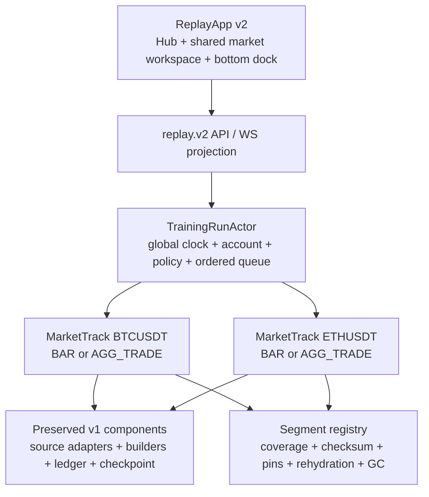

# CandleScope 回放训练 v2 重构执行文档

状态：`PHASE_17_COMMITTED / PHASE_18_CODE_COMPLETE / RELEASE_RESULT_EXTERNAL_MANIFEST / PRODUCTION_HOLD`。Phase 10 的 `PHASE_10_PASS` 只对仓库外 `H:\program\CandleScope-release-evidence\<完整 Phase 10 HEAD>\replay-v2\release-manifest.json` 所绑定的 clean HEAD 有效；Phase 11–17 已独立提交，Phase 18 代码、迁移、存储治理、真实来源和发布合同已完成提交前门禁。Phase 18 的最终完成状态只读取仓库外 `<完整 Phase 18 HEAD>\replay-v2\release-manifest.json`，本文不嵌入提交后的结果，避免为了记录证据改变 HEAD 并使 4 小时证据失效。任何旧发布清单都不得继承到新 HEAD；即使 implementation manifest PASS，生产决策仍因缺少 BOOK/account 生产 capture 与运维观察窗保持 HOLD，所有发布开关默认关闭。

工作树：`H:\program\CandleScope-kline-replay`

分支：`codex/kline-replay-training`

Phase 0 父提交：`2346dba32c0ce9e35dd6941bc4445366da4362a7`（2026-07-21）

Phase 1 父提交：`bb253d0982c36776452c2b1e0a0cf3f1b211162f`（2026-07-21）

Phase 5 父提交：`c6921c9f7f813adabd452e162719baf20d700fb8`（2026-07-21）

Phase 7 父提交：`463bd0ba679d6e10baa0f0958231e96220590ee7`（2026-07-22）

Phase 8 父提交：`41d6fc1049493b1ccaec5c8deb8a64b788277d14`（2026-07-22）

Phase 9 父提交：`ad233cfe5abe49565ffd5852b540a78453498a64`（2026-07-22）

Phase 10 父提交：`afd802a1617daf6a05f25a1b9318fbc3da341b5c`（2026-07-22）

Phase 11 父提交：`382923ecabaab153a47e1d145ca96eb8d9a8cb67`（2026-07-24）

Phase 12 父提交：`5c095a27bd08802a92004a9fdeb6d68e247e393b`（2026-07-25）

Phase 13 父提交：`37833c641c230b1a82b27cfdbf4e2e17382a6755`（2026-07-26）

Phase 14 父提交：`bc4883fb9c380104aa5739c33fb37dd95336383f`（2026-07-26）

Phase 15 父提交：`5c38d27627fa9e1766ded216754c3406b833397a`（2026-07-26）

Phase 16 父提交：`f6cbc99c8fb1036550d2461ba888a8bed16f8941`（2026-07-26）

Phase 17 父提交：`24f105d97f410671682c39695e90c810b1628889`（2026-07-26）

产品真值：[`KLINE_REPLAY_TRAINING_PRODUCT_CONTRACT_zh.md`](KLINE_REPLAY_TRAINING_PRODUCT_CONTRACT_zh.md)

---

## 1. 本轮为什么必须重构

Replay v1 已经建立了一套可靠的确定性历史运行内核，但当前产品层把“回放”做成了一个固定单商品、固定展示周期、简化顶栏、替代式右栏的专用页面。它能证明后端核心可行，却不符合目标训练体验。

v2 的目标不是推倒 v1 重做，而是保留经过验证的安全内核，重构上层领域与工作台：

- 从“创建一个单商品 Session”升级为“创建或加载一个组合级训练存档”；
- 从“看起来像行情页的简化页面”升级为“与实时行情共用完整视觉骨架的 replay 工作台”；
- 从一个 `blind_mode` 布尔值升级为可验证的时间披露策略与完整性模式；
- 从固定 `display_interval` 升级为全局虚拟时钟、基础推进粒度和可切换视图周期的分离；
- 从单商品 Broker 升级为多商品统一账户、按需订阅、资金费、保证金和爆仓；
- 从顺序扫完所有历史事件升级为能够证明何时可跳转、何时必须全量处理、何时必须阻止的快进规划器；
- 从“存了领域日志”升级为可在存档大厅恢复、查看资金曲线、复盘用户操作和安全回收历史数据。

本执行文档只规定迁移顺序、代码边界、测试、退出门槛和回滚。任何产品语义争议先修订产品合同，再进入实现。

---

## 2. 当前基线与历史证据

### 2.1 当前工作树状态

本文重写时已确认：

```text
branch: codex/kline-replay-training
HEAD:   2346dba32c0ce9e35dd6941bc4445366da4362a7
status: clean before documentation edits
main:   2346dba32c0ce9e35dd6941bc4445366da4362a7
```

开始任何代码 Phase 前必须重新确认 branch、HEAD、`git status --short` 和 `git worktree list`；不能把本文记录当作未来事实。

### 2.2 v1 已验证能力，必须保留

| v1 能力 | v2 处理原则 |
|---|---|
| `replay.v1` canonical model、稳定错误码和 Decimal 边界 | 保留并版本化；破坏性字段进入 `replay.v2`，不静默改变 v1 hash。 |
| BAR catalog、coverage、随机起点、不可变 dataset snapshot | 作为 `MarketTrack` 的 BAR adapter；扩展到按需 segment，不绕过覆盖检查。 |
| AGG_TRADE checksum/import/audit、分页读取、pin/release | 作为成交轨道数据源；继续明确 aggregate trade 不是 raw trade。 |
| 单写者 `ReplaySessionActor`、服务端虚拟时钟、幂等 command | 演化为 `TrainingRunActor` 的确定性核心或受其协调的纯组件；禁止并发写账户。 |
| BAR/aggTrade replay bar builder | 变成每个 `MarketTrack` 的可 checkpoint 组件；支持视图周期重建。 |
| `PAPER_LINEAR_V1` Broker、Ledger、Report | 逐阶段扩展，账本守恒和独立重算不能退化。 |
| SQLite commit-before-publish、checkpoint、重启恢复、fork | 迁移为 run 级事务和多轨 checkpoint；恢复后仍只到 `PAUSED`。 |
| HTTP/WS snapshot-to-live、sequence/epoch/resync | 扩展为 `replay.v2` 投影；未知缺口继续 fail closed。 |
| 独立 `ReplayApp`、live/replay 网络隔离、no-lookahead 审计 | 永久保留；“复用完整页面”不等于挂载 live runtime。 |
| 跨进程 golden、1M aggTrade benchmark、4 小时 browser soak、rollback drill | 作为 v2 回归基线；新增组合和产品流程门禁。 |

### 2.3 当前实现与产品合同的差距

| 当前实现 | 目标差距 |
|---|---|
| `ReplaySessionDialog` 只有新建表单 | 缺少存档列表、恢复、版本状态、重新下载和 ReviewMode 入口。 |
| `ReplaySessionConfig` 固定一个 symbol、source 和 display interval | 缺少组合级 Run、MarketTrack、ViewerState 和可切换周期。 |
| `ReplayPageShell` 使用自定义简化顶栏与绘图条 | 没有复用完整 TopBar、周期栏、ChartWorkspace 和 feature surfaces。 |
| `ReplayRightRail` 替换实时自选与市场 dock | 与“保留自选、订单簿/订单流槽位、加入模拟交易 dock”冲突。 |
| `ReplayControlBar` 位于周期栏附近且命令固定 | 缺少底部 dock、展示 K/基础 K/成交事件三套明确控制。 |
| 图表 `onNeedMoreLeft=null` | 缺少开始点之前的 replay-aware backfill。 |
| API 有 create/get-by-id/command/fork/report/journal | 缺少可分页存档列表、轨道管理、订阅、资金曲线和数据恢复 API。 |
| 单商品 Actor/Broker | 缺少全局多商品总序、组合风险和强制 FULL 轨道。 |
| fee/slippage/max leverage 为创建时静态字段 | 缺少版本化规则变更、历史 funding、cross/isolated 和维护保证金阶梯。 |
| `advance_by` 顺序消费事件 | 正确但缺少可解释的 fast-forward planner 和安全加速路径。 |

### 2.4 v1 历史记录如何保留

旧版 2,488 行执行与验收记录的最后提交为：

```text
commit: f70234bf1b36f905c46430cc6241b7335987f8ed
blob:   796ba84041066878be81e74d95b7252a208ef0fa
path:   docs/KLINE_REPLAY_TRAINING_EXECUTION_zh.md
```

需要核对 v1 Phase 0–9 的实际命令、hash 和 rollback evidence 时使用：

```powershell
git show f70234bf1b36f905c46430cc6241b7335987f8ed:docs/KLINE_REPLAY_TRAINING_EXECUTION_zh.md
```

正式性能证据继续以仓库中的 `docs/perf-baselines/replay-*.json` 及 release-evidence 产物为准。本文不复制旧记录，避免两个可修改副本变成双真值。

---

## 3. 执行纪律

1. 只在 `H:\program\CandleScope-kline-replay` 实施本计划。
2. 每次只实现一个 Phase；完成测试、证据、执行记录和独立提交后再进入下一 Phase。
3. 先写契约测试和失败用例，再写最小实现；不能为了过门禁放宽 exact、coverage、hash、账本或 no-lookahead 语义。
4. 默认保持 `REPLAY_ENABLED=0`、`VITE_REPLAY_ENTRY_ENABLED=0`、`RAW_AGG_TRADE_ARCHIVE_ENABLED=0`。
5. v2 增加独立选择开关；未通过 Phase 10 前不得让普通用户路径默认进入 v2。
6. replay 开发实例使用独立端口、SQLite 和 archive；禁止读写主工作树活动数据库。
7. 所有 schema 迁移先加后减；在至少两个可回滚发布窗口内不删除 v1 表和 v1 读取路径。
8. 每个 Phase 都必须提供运行时开关回滚和提交级回滚证据；回滚不得删除存档或历史 archive。
9. 若同一错误无法在当前 Phase 内通过正确修复解决，停止并报告；不得改测试、提高容差或把 exact 改成 best-effort。
10. 产品合同未冻结的 L2 queue model、默认资源预算等不能由实现者私自决定。

### 3.1 固定开发端口与目录

| 服务 | 回放工作树端口 |
|---|---:|
| Vite | `15175` |
| FastAPI | `18082` |

推荐本地目录：

```text
backend/data/replay-dev/source-candlescope.db
backend/data/replay-dev/replay-v1.db
backend/data/replay-dev/replay-v2.db
backend/data/replay-dev/raw_agg_trades/
backend/data/replay-dev/replay_segments/
```

开发早期让 v1/v2 使用不同 replay DB。只有迁移门禁通过后，才允许在可恢复快照上验证同库升级。

### 3.2 建议的新增开关

| 开关 | 默认 | 所有权 |
|---|---:|---|
| `REPLAY_ENABLED` | `0` | 后端总开关，保持权威 |
| `REPLAY_PRODUCT_V2_ENABLED` | `0` | 后端 run/protocol/schema v2 开关 |
| `VITE_REPLAY_ENTRY_ENABLED` | `0` | live 页入口显示 |
| `VITE_REPLAY_PRODUCT_V2_ENABLED` | `0` | replay document 选择 v2 hub/workspace |
| `RAW_AGG_TRADE_ARCHIVE_ENABLED` | `0` | 成交 archive 能力 |
| `REPLAY_HISTORICAL_BOOK_ENABLED` | `0` | Phase 9 可选 verified Binance USD-M 历史 L2；关闭时既有 BOOK Run 明确暂停/降级，不回退成交模型 |
| `REPLAY_HISTORICAL_BOOK_MAX_ARCHIVE_BYTES` | `1099511627776` | 受管历史盘口对象总预算，默认 1 TiB；可收紧不可超过冻结上限，回收只允许显式 dry-run/run 且活动 pin 受保护 |
| `REPLAY_SEGMENT_DOWNLOAD_WORKER_ENABLED` | `0` | 外部 segment 下载生产者开关；Phase 7 不自动启动远程下载 |
| `REPLAY_SEGMENT_AUTO_GC_ENABLED` | `0` | segment 自动 GC 调度开关；Phase 7 只开放显式 dry-run/run |
| `REPLAY_FAST_FORWARD_OPTIMIZATION_ENABLED` | `0` | Phase 8 无账户路径依赖时的有界扫描、状态物化与投影合并；关闭后统一走 `FULL_EVENT_SCAN` |

前端开关从来不是安全边界。v2 直接 URL、API、WS 和后台任务都必须由后端 capability 拒绝。

### 3.3 本地环境与独立启动

首次准备工作树：

```powershell
Set-Location H:\program\CandleScope-kline-replay\backend
if (-not (Test-Path -LiteralPath '.venv')) {
    py -m venv .venv
}
.\.venv\Scripts\python.exe -m pip install -r requirements.txt

Set-Location ..\frontend
npm ci
```

BAR 开发数据使用现有一致性快照工具，不能直接复制正在写入的 SQLite：

```powershell
Set-Location H:\program\CandleScope-kline-replay\backend
$replayDataRoot = 'H:\program\CandleScope-kline-replay\backend\data\replay-dev'
New-Item -ItemType Directory -Force -Path $replayDataRoot | Out-Null
.\.venv\Scripts\python.exe scripts\snapshot_replay_klines.py `
  --source 'H:\program\CandleScope\backend\data\candlescope.db' `
  --destination "$replayDataRoot\source-candlescope.db" `
  --require-quick-check
```

Phase 0 新开关落地后，后端专用启动示例：

```powershell
Set-Location H:\program\CandleScope-kline-replay\backend
$env:PYTHONUTF8 = '1'
$env:PYTHONIOENCODING = 'utf-8'
$env:CANDLE_DATA_DIR = 'H:\program\CandleScope-kline-replay\backend\data\replay-dev'
$env:KLINES_DB_PATH = 'H:\program\CandleScope-kline-replay\backend\data\replay-dev\source-candlescope.db'
$env:REPLAY_DB_PATH = 'H:\program\CandleScope-kline-replay\backend\data\replay-dev\replay-v2.db'
$env:RAW_AGG_TRADE_ARCHIVE_DIR = 'H:\program\CandleScope-kline-replay\backend\data\replay-dev\raw_agg_trades'
$env:REPLAY_ENABLED = '1'
$env:REPLAY_PRODUCT_V2_ENABLED = '1'
$env:RAW_AGG_TRADE_ARCHIVE_ENABLED = '0'
$env:REPLAY_HISTORICAL_BOOK_ENABLED = '0'
$env:REPLAY_SEGMENT_DOWNLOAD_WORKER_ENABLED = '0'
$env:REPLAY_SEGMENT_AUTO_GC_ENABLED = '0'
$env:REPLAY_FAST_FORWARD_OPTIMIZATION_ENABLED = '0'
.\.venv\Scripts\python.exe -m uvicorn app.main:app --reload --host 127.0.0.1 --port 18082
```

另开终端启动前端：

```powershell
Set-Location H:\program\CandleScope-kline-replay\frontend
$env:VITE_API_PROXY_TARGET = 'http://127.0.0.1:18082'
$env:VITE_DEV_PORT = '15175'
$env:VITE_REPLAY_ENTRY_ENABLED = '1'
$env:VITE_REPLAY_PRODUCT_V2_ENABLED = '1'
npm run dev
```

这些 `=1` 只用于当前 Phase 的显式本地验证。完成验证和正式提交前恢复默认关闭，并通过 capability/入口审计证明没有残留默认启用。

---

## 4. 不可妥协的不变量

### 4.1 权威性

- 服务端拥有 VirtualTime、cursor、账户、规则版本、订阅强制状态和公开时间映射。
- 前端只提交带 command ID、expected revision 和 controller lease 的意图。
- 任何账户变更必须先持久化，再 publish；UI optimistic state 不能冒充成交或入金成功。

### 4.2 确定性

- 相同 protocol、config、dataset identities、commands 和 checkpoint 必须得到相同事件序列、ledger、report 和 state hash。
- wall clock、浏览器帧率、播放倍率、网络重连和当前查看周期不进入领域 hash。
- 多商品同时间事件必须使用版本化稳定总序，不能依赖 Python/JS map 顺序或 task 调度。

### 4.3 无未来数据

- replay document 不访问 live 数据源。
- 所有图表、指标、订单流、PnL 和风险只读已经揭示的数据前缀。
- 左侧 backfill 可以读取开始点之前的数据，但不得返回 cursor 之后的数据。
- 时间隐藏在服务端边界完成；真实时间不能先发到浏览器再遮住。

### 4.4 路径依赖不能被快进跳过

有持仓、订单、条件触发、funding、liquidation 或其他路径依赖时，必须逐事件得到等价结果，或明确阻止。任何聚合优化都要有 step-by-step equivalence 证明。

### 4.5 组合时钟不能分叉

任一强制 `FULL` MarketTrack 不能推进时，整个 TrainingRun 暂停。不能出现 BTC 已到 12:05、ETH 仍在 12:04 但账户继续计算的状态。

### 4.6 账本与规则不追溯

- 余额、保证金、费用、funding、已实现 PnL 和 liquidation fee 必须逐项记账且可独立重算。
- 入金或规则变更从其虚拟时刻起生效；不能重写旧成交。
- 任何 Decimal 非有限值、舍入策略漂移或账本不守恒都 fail closed。

### 4.7 数据身份与 GC

- 每条轨道绑定不可变或可确定重建的数据身份。
- 存档引用的数据要么被 pin，要么有可信来源、checksum 和完整 rehydration manifest。
- GC 不得让一个原本可恢复的存档静默变成不可恢复。

### 4.8 实盘硬隔离

replay 模块不得读取交易所私钥、实盘账户、私有下单 client 或任何真实资金接口。模拟“市价/限价”只能进入 replay broker。

---

## 5. 迁移策略

采用“保留 v1 内核、增加 v2 父层、逐步替换产品壳”的策略，而不是一次性重写。

### 5.1 三层边界



### 5.2 v1 兼容策略

- 现有 `replay_session` 记录在大厅中显示为 `LEGACY_V1`。
- Phase 1 先提供只读元数据和兼容恢复入口，不改写 v1 config/hash。
- v1 -> v2 迁移必须创建新 `TrainingRun`，记录 parent legacy session；原 v1 数据保持不变。
- 若 legacy dataset 已丢失且不可重建，显示不可恢复原因；不能伪造为一个空 v2 存档。
- v2 稳定前保留旧 `ReplayApp` 选择开关，便于功能级回滚。

### 5.3 领域对象

#### `TrainingRun`

至少包含：

```text
run_id
protocol_version
status
name
scope(exchange, market_type, settlement_asset)
replay_mode(BAR or AGG_TRADE)
book_mode(OFF or BOOK_ASSISTED_REQUIRED)
virtual_time
integrity_mode
time_disclosure_policy
active_rule_revision
account_state
track_registry
viewer_state
parent_ref
created_at / updated_at / ended_at
state_hash
```

#### `MarketTrack`

至少包含：

```text
track_id
market_identity(exchange, market_type, symbol)
source_kind
base_interval
dataset_refs[]
source_cursor
bar_builder_state
subscription_tier
forced_full_reasons[]
capability_snapshot
track_state_hash
```

`MarketTrack.source_kind` 必须等于所属 `TrainingRun.replay_mode`。v2 core 不允许在同一 Run 中混用 BAR 与 AGG_TRADE；轨道数据不足时拒绝升级，不能自动换 source。

#### `ViewerState`

至少包含：

```text
selected_track_id
display_interval
chart_type
visible_range
pane_layout
rail_layout
semantic_view_revision
```

`ViewerState` 不进入市场和账户确定性 hash；需要复盘的语义化视图事件单独持久化。

### 5.4 单写者方案

首版使用一个 `TrainingRunActor` 作为账户与全局时钟的唯一写者。各 MarketTrack 可以并行预取、校验和解码，但进入领域 reducer 前必须形成稳定有序事件流。不得让每个 symbol actor 并发写同一账户后再补偿。

未来若分片，仍需一个可证明的组合 commit barrier；在没有等价性证据前不做。

---

## 6. 后端目标边界

### 6.1 建议模块所有权

现有 `backend/app/replay/` 保留；新增模块按责任组织：

```text
backend/app/replay/
  training/
    models.py              # TrainingRun / MarketTrack / ViewerState / policies
    actor.py               # global single writer and ordered merge
    service.py             # run lifecycle and capacity ownership
    commands.py            # replay.v2 command validation
    events.py              # replay.v2 domain and projection events
    ordering.py            # stable cross-track total order
    fast_forward.py        # planner and equivalence modes
    review.py              # read-only review cursor and fork
  segments/
    models.py              # immutable segment identity and health
    registry.py            # refs, pins, coverage and usage
    rehydration.py         # trusted restore/download plans
    gc.py                  # dry-run and safe reclaim
  broker/
    margin.py              # cross / isolated
    funding.py             # historical funding settlement
    liquidation.py         # mark + maintenance tiers + events
    instruments.py         # versioned symbol rules
```

这些路径是建议所有权；实施时可在同一责任边界内调整。不得把组合账户逻辑放进 data source，也不得把下载/GC 放进 actor reducer。

### 6.2 replay.v2 API 草案

仓库总 API 仍可位于 `/api/v1`，但 replay wire envelope 使用独立 `protocol: replay.v2`，避免把 API root 版本与领域协议混为一谈。

| 方法 | 路径 | 用途 |
|---|---|---|
| GET | `/api/v1/replay/capabilities` | 返回 v1/v2、数据源、历史面板和资源能力 |
| GET | `/api/v1/replay/runs` | 分页列出轻量存档元数据，含 legacy v1 |
| POST | `/api/v1/replay/runs` | 原子创建 TrainingRun |
| GET | `/api/v1/replay/runs/{run_id}` | 获取恢复 bootstrap 元数据；权威市场 snapshot 仍通过 WS 原子交接 |
| POST | `/api/v1/replay/runs/{run_id}/commands` | 提交 run/track/account/controller 命令 |
| POST | `/api/v1/replay/runs/{run_id}/tracks` | 在 scope 内准备新 MarketTrack |
| PATCH | `/api/v1/replay/runs/{run_id}/tracks/{track_id}` | 修改订阅意图；服务端返回强制 tier |
| GET | `/api/v1/replay/runs/{run_id}/history` | replay-aware 左侧 backfill，只返回公开时间和 revealed boundary 内数据 |
| GET | `/api/v1/replay/runs/{run_id}/equity` | 有界、多分辨率资金曲线 |
| GET | `/api/v1/replay/runs/{run_id}/journal` | 训练日志与规则事件 |
| GET | `/api/v1/replay/runs/{run_id}/report` | 权威报告与 fidelity |
| POST | `/api/v1/replay/runs/{run_id}/review` | 创建只读 review cursor |
| POST | `/api/v1/replay/runs/{run_id}/fork` | 从当前或 review event 创建新存档 |

WS 可继续使用 `/api/v1/stream/replay/{run_id}`，但连接握手必须声明期望 `replay.v2`。v1/v2 payload parser 严格分离；未知协议不得 best-effort 解析。

### 6.3 command 分类

```text
controller: acquire, heartbeat, release, takeover
transport:  play, pause, set_speed, step_event, step_base,
            step_display, advance_by, advance_to, cancel_advance
viewer:     select_track, set_display_interval, set_chart_type,
            record_view_action
track:      add_track, set_subscription_tier, remove_unowned_track
account:    place_order, cancel_order, close_position,
            allocate_isolated_margin
policy:     deposit, withdraw, change_fee_policy,
            change_leverage_cap, change_funding_policy, reveal_time
lifecycle:  save, end, fork, start_review
```

每个命令都要定义：允许状态、controller 要求、expected revision、幂等 key、原子处理边界、是否进入 state hash、是否允许在各 IntegrityMode 使用。

### 6.4 projection 分类

- `RUN_SNAPSHOT`：恢复用完整有界 snapshot；
- `RUN_STATE_CHANGED`：状态、时钟、controller、规则 revision；
- `TRACK_PROJECTION`：每轨已揭示 K 线/价格/capability/cursor；
- `ACCOUNT_PROJECTION`：余额、保证金、持仓、订单、成交和风险；
- `AUDIT_EVENT`：规则变更、入金、解密、强制降级；
- `ADVANCE_PROGRESS`：快进计划、进度、预计剩余和取消结果；
- `RESYNC_REQUIRED`：sequence/epoch/identity 未知缺口。

普通高频轨道更新可合并，但成交、爆仓、状态变化、规则变化、PAUSED、ENDED 和 error 必须立即 flush。

### 6.5 SQLite v2 schema

Phase 1 起只做 additive migration，建议新增：

```text
replay_training_run
replay_market_track
replay_run_rule_revision
replay_run_command_log
replay_run_event
replay_track_checkpoint
replay_account_checkpoint
replay_run_action_event
replay_run_view_event
replay_equity_sample
replay_data_segment
replay_data_segment_pin
replay_rehydration_manifest
```

硬约束：

- run 创建、首轨 dataset ref、初始账户、初始规则和首 checkpoint 同事务；
- command、领域变更、账本、checkpoint 和 publish cursor 使用可证明的 commit boundary；
- segment pin 使用外键或等价的原子引用，GC 不能与新 pin 竞态；
- v1 表不重命名、不删除、不就地改写 JSON；
- schema migration 可重入、可在旧 build 下安全忽略新增表；
- migration 前后都运行 `quick_check`，并保留可恢复文件快照。

---

## 7. 前端目标边界

### 7.1 共享视图，隔离 runtime

当前已经存在 source-neutral `MarketPageFrame` 与 `MarketWorkspaceFrame`，v2 继续把以下层次拆清：

```text
shared visual components / view models
  <- live adapters owned by App
  <- replay adapters owned by ReplayApp
```

优先复用：

- `frontend/src/app/MarketPageFrame.tsx`
- `frontend/src/app/MarketWorkspaceFrame.tsx`
- `frontend/src/app/TopBar.tsx`
- `frontend/src/components/IntervalSelector.*`
- `frontend/src/app/ChartWorkspace.tsx`
- `frontend/src/app/RightMarketRail.tsx`
- `frontend/src/app/StatusBar.tsx`
- 图表、绘图、pane lifecycle、layout preference 和 `SeriesWindowStore` 契约。

需要提取的是纯 props/view-model 合同，不是让 replay 伪造 `useMarketDataRuntime` 类型。

### 7.2 计划新增或替换的产品组件

```text
frontend/src/features/replay/
  hub/
    TrainingHubDialog.tsx
    TrainingRunList.tsx
    TrainingRunCard.tsx
    TrainingCreateWizard.tsx
    ReplayCapabilitySummary.tsx
  workspace/
    ReplayMarketWorkspaceAdapter.tsx
    ReplayRightRailAdapter.tsx
    ReplayCapabilitySurface.tsx
    ReplayPaperTradingDock.tsx
    ReplayBottomControlDock.tsx
  runtime/
    useTrainingRunRuntime.ts
    useReplayTrackRuntime.ts
    useReplayWatchlistRuntime.ts
    useReplayHistoryRuntime.ts
    useReplayCapabilityRuntime.ts
  review/
    ReplayReviewTimeline.tsx
    ReplayEquityCurve.tsx
```

旧 `ReplaySessionDialog`、`ReplayControlBar`、`ReplayRightRail` 在对应新组件通过验收后删除；不能先删旧 UI 再留下不可用空壳。

### 7.3 自选与订阅

- 复用自选分组、排序、宽度和折叠 preference；不复用 live `/subscriptions` 状态。
- 新建 replay-local `NONE/WARM/FULL` store 和 API。
- Watchlist row 必须显示 tier、公开时间下的价格状态和强制 FULL 原因。
- 选中 `NONE/WARM` 商品时先提交原子 track prepare；成功前旧主图继续可见，不能显示 live 或陈旧缓存假装切换成功。

### 7.4 历史 backfill

复用 live 的范围规划、取消、合并、缓存预算和 store delta，但引入 `ReplayHistoryProvider`：

```text
onNeedMoreLeft
  -> plan uncovered older range
  -> GET run-scoped replay history
  -> validate public time + track identity + <= revealed boundary
  -> SeriesWindowStore prepend/replace delta
```

architecture test 必须禁止 replay provider 调用 live Kline API。

### 7.5 capability surface

OI、市场爆仓、mark/index/basis、funding、订单簿和订单流都通过统一 `CapabilityState` 渲染。组件在 `DEGRADED` 时立即清空精确数据；不能保留上一次值配一个小灰点。

### 7.6 页面数据泄漏审计

盲测扫描至少覆盖：

- fetch request/response；
- WebSocket 收发；
- DOM 文本和 data attributes；
- ARIA/accessibility tree；
- URL、history state、window name；
- localStorage、sessionStorage、IndexedDB；
- console/error stack 和导出文件。

---

## 8. 关键算法合同

### 8.1 `STEP_DISPLAY`

输入包含 `display_interval`、`count`、expected run revision 和 expected virtual cursor。服务端根据市场日历与 base events 计算：

1. 当前 cursor 是否位于 display bucket 中间；
2. 若在中间，第一步目标为当前 bucket 的确定性收口边界；
3. 剩余 count 逐个推进完整 display bucket；
4. 中间每个 base event 仍进入 builder、broker、risk 和 ledger；
5. 轨道或账户事件失败时整个命令原子停止在最后已提交事件边界。

### 8.2 多轨事件总序

候选稳定 key：

```text
(actual_event_time_ms, event_phase, market_track_stable_id, source_sequence)
```

`event_phase` 至少冻结 funding settlement、market input、order trigger、risk/liquidation 和 post-event projection 的相对次序。最终 key 必须通过同一时间多商品、不同 source kind、重启恢复和跨进程 golden 证明。

### 8.3 强制 FULL 规则

`forced_full_reasons` 是服务端派生集合，例如：

```text
VIEWED
OPEN_POSITION
OPEN_ORDER
CONDITIONAL_ORDER
PENDING_FUNDING
LIQUIDATION_RISK
REVIEW_REQUIRED
```

实际 tier 为用户意图与强制原因的上界。强制原因变化和 tier 转换必须持久化并参与 run 恢复。

### 8.4 快进计划

规划输入：目标时刻、所有 FULL tracks、账户路径依赖、规则结算点、checkpoint、segment coverage 和资源预算。

规划输出：`CHECKPOINT_JUMP`、`AGGREGATE_SCAN`、`FULL_EVENT_SCAN` 或 `BLOCKED`，以及原因、预计事件数、所需数据段和是否可取消。

每一种优化路径都必须与逐事件 reference runner 比较：最终 cursor、tracks、orders、fills、positions、ledger、funding、liquidation、equity 和 report hash 全相等。

### 8.5 资金曲线

- 权威权益点在账户发生语义变化、固定虚拟采样边界和结束事件时生成。
- 原始点有界存储；长训练按 min/max/last 或等价保形算法生成多分辨率层级。
- 降采样不能用于账本重算，只用于展示。
- ReviewMode 可从曲线点定位到最近领域事件。

---

## 9. 全局验证与证据规则

### 9.1 每个代码 Phase 的最低门禁

```powershell
Set-Location H:\program\CandleScope-kline-replay
git status --short

Set-Location backend
.\.venv\Scripts\python.exe -m ruff check app tests scripts
.\.venv\Scripts\python.exe -m pytest -q

Set-Location ..\frontend
npm run check

Set-Location ..
git diff --check
```

若全仓 ruff 当前基线不允许，则 Phase 0 记录准确的既有范围，之后所有新增/修改 Python 文件必须 ruff clean；不得把新增违规归为历史问题。

### 9.2 必须保留的 v1 回归

- replay.v1 canonical golden；
- BAR 与 AGG_TRADE determinism；
- ledger 独立重算；
- sequence/epoch/resync；
- no-lookahead；
- 1M aggTrade 有界内存与分页；
- 4 小时 browser lifecycle soak；
- feature flag 与旧 build rollback。

### 9.3 v2 新增证据

- 存档大厅真实浏览器流程：新建、失败回滚、暂停、恢复、结束、Review、Fork；
- live/replay 结构与视觉骨架一致性；
- replay 页面全程零 live 数据请求；
- 时间披露 7 档的跨边界泄漏扫描；
- base/display/event 三套控制的 reference equivalence；
- 1、2、4、8 个 FULL tracks 的总序、吞吐、内存和恢复矩阵；
- `NONE` 零读取、`WARM` 有界准备、强制 FULL 风险继续计算；
- cross/isolated、fee、funding、liquidation 账本场景；
- fast-forward 四种计划与逐事件等价/拒绝证据；
- data segment pin、GC dry-run、冷恢复和不可重建保护；
- v1 legacy 只读、迁移和回滚。

### 9.4 性能门槛冻结方式

不在设计文档里拍脑袋写毫秒或轨道上限。每个相关 Phase 先运行真实 fixture baseline，再提交版本化 JSON：

```text
docs/perf-baselines/replay-v2-hub-*.json
docs/perf-baselines/replay-v2-multitrack-*.json
docs/perf-baselines/replay-v2-fast-forward-*.json
docs/perf-baselines/replay-v2-browser-soak-*.json
```

基准必须记录机器、HEAD、dataset hash、参数、p50/p95/max、RSS/heap late-half、queue high-water、page/segment 次数和阈值来源。阈值只允许通过单独文档修订收紧或基于证据调整。

### 9.5 发布证据目录

正式证据写到 Git 外、按 clean HEAD 绑定的目录：

```powershell
$replayHead = (git rev-parse HEAD).Trim()
$evidenceRoot = "H:\program\CandleScope-release-evidence\$replayHead\replay-v2"
New-Item -ItemType Directory -Force -Path $evidenceRoot | Out-Null
```

脚本必须拒绝 dirty worktree、运行中 HEAD 改变和证据目录复用到不同 commit。

---

## 10. Phase 依赖总览

```mermaid
flowchart LR
    P0["P0 契约与护栏"] --> P1["P1 存档大厅与 Run 元数据"]
    P1 --> P2["P2 完整工作台与 backfill"]
    P2 --> P3["P3 BAR/成交操控语义"]
    P3 --> P4["P4 完整性、披露与复盘"]
    P4 --> P5["P5 多商品与订阅"]
    P5 --> P6["P6 账户、funding 与爆仓"]
    P6 --> P7["P7 数据段、按需下载与 GC"]
    P7 --> P8["P8 成交快进与订单流优化"]
    P8 --> P10["P10 发布收口"]
    P7 --> P9["P9 可选历史 L2"]
    P9 -.->|不阻塞 core| P10
    P10 --> P11["P11 实时页入口与启动归档"]
    P11 --> P12["P12 起点与七级时间披露收口"]
    P12 --> P13["P13 四种推进基准与完整控制"]
    P13 --> P14["P14 分段历史与自动准备"]
    P14 --> P15["P15 真正的 checkpoint 快进"]
    P15 --> P16["P16 交易所级账户 fidelity"]
    P16 --> P17["P17 规则变更与完整复盘"]
    P17 --> P18["P18 存储、真实数据与发布收口"]
```



Phase 9 是可选历史 L2 基础，不单独授权发布；Phase 10 是旧基线的发布证明，Phase 11–17 的新增能力必须在 Phase 18 重新聚合，不能沿用旧 clean-HEAD PASS。

---

## 11. Phase 0：冻结 v2 契约、开关与架构护栏

### 目标

把本文和产品合同转成可执行的 protocol/schema/architecture tests，不新增可见 v2 产品流。

### 主要任务

1. 冻结 `replay.v2` 枚举：run/track 状态、source、integrity、time disclosure、subscription tier、capability、fast-forward plan。
2. 新增 v2 canonical fixture 与跨 Python/TypeScript 类型对照。
3. 新增 `REPLAY_PRODUCT_V2_ENABLED` 和 `VITE_REPLAY_PRODUCT_V2_ENABLED`，默认关闭。
4. architecture guard 禁止 `ReplayApp` 导入 live runtime、live subscription、live order book/trade flow/advanced-market hooks。
5. 记录 v1 golden/performance/rollback baseline 的文件 hash；验证现有 v1 tests 不变。
6. 冻结 additive schema migration 原则和 v1 legacy 不改写合同。

### 建议文件

```text
backend/app/replay/training/{models,commands,events}.py
backend/tests/test_replay_v2_contracts.py
backend/tests/fixtures/replay/v2_contract_golden.json
frontend/src/features/replay/replayV2Types.ts
frontend/src/features/replay/__tests__/replayV2Architecture.test.ts
frontend/scripts/check-architecture*.mjs
backend/app/core/config.py
frontend/.env.replay.example
backend/.env.replay.example
```

### 必测

- 所有非法 enum、identifier、Decimal、revision、cursor、time policy 和 tier 拒绝；
- v1 fixture byte/hash 不变；
- 两个 v2 开关默认关闭，直接 URL/API/WS fail closed；
- forged protocol、unknown capability 和 time disclosure 降级拒绝；
- architecture fixtures 对 live value import fail。

### 退出门槛

- 文档中的全部硬枚举有唯一代码定义与 golden；
- 默认构建没有 v2 可见入口或后台任务；
- v1 全量门禁通过；
- rollback 后代码和配置回到 Phase 0 前，v1 DB 未改变。

### 建议提交

```text
chore(replay): freeze replay v2 product and protocol boundaries
```

---

## 12. Phase 1：TrainingRun 存储、存档列表与训练大厅

### 目标

先交付“像游戏存档”的完整入口，但活动训练仍可暂时通过单 MarketTrack adapter 运行。

### 主要任务

1. additive 创建 `replay_training_run`、初始 track/rule/action 表和 schema version。
2. 实现分页 `GET /runs`，只读取轻量元数据，不加载 dataset。
3. 实现原子 `POST /runs`；内部先适配 v1 单轨 source/actor，不复制核心。
4. legacy v1 session 显示 `LEGACY_V1`，提供兼容打开或明确不可恢复状态。
5. 新建 `TrainingHubDialog`、Run list/card、Create wizard 和 capability summary。
6. 创建表单覆盖产品合同字段；尚未实现的 funding/L2/multi-symbol 能力必须 disabled 并解释，不得保存后假装生效。
7. 返回大厅前 checkpoint；controller 失联后自动暂停。

### 必测

- 空列表、数千存档分页、排序、过滤和 blind metadata 脱敏；
- 原子创建每个失败点的事务与 pin 回滚；
- capability epoch 在校验与创建间漂移时拒绝；
- legacy v1 列表、恢复、不可恢复、迁移不改原 hash；
- 浏览器新建/恢复/关闭/刷新，大厅不批量下载 dataset；
- 直接 replay URL 无 opener 正常进入大厅。

### 退出门槛

- 用户不再被迫先填新建表单；已有训练可发现、可继续或得到明确故障解释；
- 存档列表请求的 IO 与存档数据段总量无关；
- v2 开关关闭时旧 ReplayApp 完整可用；
- schema downgrade/old build 忽略新增表，v1 记录不变。

### 回滚

关闭 v2 选择开关回到 v1 UI。新增表保留，不删除用户新建 Run；旧 build 忽略它们。

### 建议提交

```text
feat(replay): add training run saves and replay hub
```

---

## 13. Phase 2：完整实时骨架、能力占位与 replay backfill

### 目标

训练页面结构与实时行情共用组件，同时保持 runtime 和网络完全隔离。

### 主要任务

1. 为 TopBar、IntervalSelector、ChartWorkspace、RightMarketRail、StatusBar 提取 source-neutral props/view models。
2. `AppShell` 与 `ReplayPageShell` 组合同一组件树；禁止复制 CSS 和 DOM 结构。
3. replay 继承主题、图表、pane、rail 宽高与折叠 preference；数据 store 仍隔离。
   指标配置可作为初始模板，绘图/提醒与训练中视图状态必须 run-scoped，blind Run 不导入带真实时间锚点的 live drawing。
4. 自选列表回到右栏；新增 replay-local tier 状态，但本 Phase 可只让主商品 FULL。
5. 模拟交易进入 existing rail dock/tab，替代旧的整栏 `ReplayRightRail`。
6. 控制条迁移到 `ReplayBottomControlDock`；本 Phase 可先接 v1 command。
7. 实现 `ReplayHistoryProvider` 与 `onNeedMoreLeft`，复用 backfill planner/store delta。
   Phase 2 先只读一致性快照并绑定 history epoch；Phase 7 再统一迁入 segment registry，禁止查询活动生产库。
8. OI、市场爆仓、mark/index/basis、funding、订单簿、订单流使用统一 capability surface。
9. 绘图与可本地计算指标只读 revealed prefix；hosted/range/security 未有 replay provider 时明确 disabled。

### 必测

- live/replay component ownership 与关键 DOM slot 一致；
- 1600×1000、常用缩放和窄宽度下 rail/dock/chart 不互相遮挡；
- rail resize、collapse、pane lifecycle、theme 和 drawing parity；
- replay 网络 allowlist 只有 replay endpoints；error/loading/unsupported 同样零 live 请求；
- left backfill 能加载更早数据、去重、取消，且 `max_time <= revealed boundary`；
- backfill 响应绑定 track/history epoch，source identity 漂移时拒绝；
- unsupported 不显示 0，不保留 stale precise values。

### 退出门槛

- 旧自定义 replay 顶栏、假绘图条、替代式整栏和上方控制条不再出现在 v2 路径；
- live 普通 smoke 与 replay smoke 同时通过；
- 视觉差异只剩产品合同允许的 replay 身份、capability、paper dock 和 bottom dock；
- `ReplayApp` 仍可在 live 后端在线时证明零 live market request。

### 回滚

v2 flag 返回旧 shell；共享组件的 props 提取必须保持 live snapshot/interaction tests，单提交可 revert。

### 建议提交

```text
feat(replay): reuse the complete market workspace in replay
```

---

## 14. Phase 3：ViewerState 与 BAR/成交操控语义

### 目标

解除 `display_interval` 与 session identity 绑定，完整实现底部控制坞的三种推进粒度。

### 主要任务

1. 从不可变 run config 移出 `display_interval`，迁移到 `ViewerState`。
2. 实现 `STEP_DISPLAY`、`STEP_BASE`、`STEP_EVENT`、`ADVANCE_BY`、`ADVANCE_TO` 和可取消 progress。
3. BAR 实现当前 display bucket 对齐；基础 K 自动播放持续更新 forming 高周期 K。
4. AGG_TRADE 支持按事件、虚拟时间倍率、基础 K、展示 K 和任意时长推进。
5. display switch 从 revealed base prefix 重建，不消费 source，不改变账户 hash。
6. command payload 绑定提交时 display interval/revision，消除 UI 切换竞态。
7. bottom dock 根据 source capability 显示正确控件，不把不可用操作渲染成可点击。

### 必测

- base=1m 与 view=1m/5m/15m/1h 的 forming/close/alignment matrix；
- 只形成 1m 的 15m 首次 step_display 收口当前 bucket；
- step_display(n) 与逐 base step 的 bar/account/ledger/hash 等价；
- display switch 1m->15m->1h->1m cursor 和领域 hash 不变；
- 同毫秒多成交、长空档、暂停 barrier、command pending 时切周期；
- 速度变化只影响 wall scheduling；跨进程 state hash 一致；
- calendar interval 或不支持日历明确拒绝，不用固定毫秒误算。

### 退出门槛

- 产品合同第 9、10 节控制全部有服务端命令语义；
- 前端不存在“看 15m 就每 15 秒突然出一根”的假连续模型；
- BAR 和 AGG 的 reference equivalence/golden 全部通过；
- v1 step/play/advance 回归不退化。

### 回滚

关闭 v2 后使用 v1 commands；数据库保留 viewer event 但旧 runtime 忽略。

### 建议提交

```text
feat(replay): add aligned bar and trade replay controls
```

---

## 15. Phase 4：时间披露、完整性模式、动作日志与复盘

### 目标

把 blind/cheat/report 从零散字段提升为可审计训练规则，并交付资金曲线与只读 ReviewMode。

### 主要任务

1. 实现 7 档 `TimeDisclosurePolicy` 的服务端 actual->public 映射。
2. 所有 API/WS/report/journal/equity/error/export 只输出允许的公开时间。
3. 实现 `CHALLENGE/PRACTICE/SANDBOX` 与 allowed mutations。
4. 实现 deposit/withdraw、fee/leverage/funding rule revision 和 reveal time 审计事件；先只接已支持规则，未支持项拒绝。
5. 持久化语义化 view actions；高频手势合并或采样。
6. 实现有界多分辨率 equity curve。
7. 实现只读 ReviewMode、事件跳转和从事件 fork。

### 必测

- 7 档策略在 HTTP、WS、DOM、ARIA、storage、console、export 的泄漏扫描；
- manual start 标为 known，不能进入 strict blind；
- Challenge 所有 mutation 拒绝；Practice allowlist；Sandbox 标记；
- rule revision 不追溯，旧 ledger/hash 不变；
- 解密不可逆且进入报告；
- 10 万视图手势不会形成无界 DB/DOM；
- ReviewMode 不改原 run，fork parent/event 精确；
- equity curve 与 ledger checkpoint 独立抽查一致。

### 退出门槛

- 不再存在前端收到 actual time 后只靠 formatter 遮挡的路径；
- 报告能明确区分 strict、practice、sandbox 和所有变更；
- Review/Fork 可从真实浏览器完成并保持原 hash；
- v1 blind no-lookahead 证据继续通过。

### 回滚

v2 关闭后不删除 rule/action/equity 数据；v1 blind session 继续走原映射。解密过的 Run 不能因回滚重新标 strict。

### 建议提交

```text
feat(replay): add audited training integrity and review
```

---

## 16. Phase 5：多商品 MarketTrack、全局时钟与订阅分级

### 目标

让一个 TrainingRun 在同一结算范围内同时训练多个商品，并只加载真正需要的数据。

### 主要任务

1. 实现 `TrainingRunActor` 与稳定跨轨 ordered queue。
2. 现有 BAR/AGG source、builder 和 dataset ref 封装为每轨组件；所有轨道服从 Run 的不可变 replay mode。
3. 实现 `NONE/WARM/FULL` 与 `forced_full_reasons`。
4. 主图选择从 viewer action 升级轨道；准备期间暂停全局时钟并原子切换。
5. Watchlist 显示 replay tier、公开价格和强制原因；不调用 live subscription API。
6. position/open order/conditional/funding/risk 自动强制 FULL。
7. checkpoint 同时绑定 run account、全局 cursor、全部 FULL track cursor 与 hash。
8. 任一强制 FULL 轨道 gap/degraded 时整个 Run 暂停。

### 必测

- 1/2/4/8 轨 BAR 与 1/2/4/8 轨 AGG 两组稳定总序；
- 同毫秒多 symbol 事件跨进程 golden；
- `NONE` 零 repo/archive read，`WARM` 有界，`FULL` 连续；
- 有仓位非主图商品继续 PnL、止损、funding、risk；
- 用户降级强制 FULL 被拒绝并解释；风险解除后 checkpoint 再降级；
- 新 symbol coverage 失败不改变当前 viewer/account；
- 一轨 gap 导致全局暂停，恢复后无重复事件；
- 重启恢复所有 track cursor 和 forced reasons。

### 性能证据

建立 1/2/4/8 FULL tracks 的 CPU、RSS、queue、checkpoint size、projection rate 与 browser heap baseline。资源上限在本 Phase 的证据审阅后冻结。

### 退出门槛

- 用户可在一个存档内切换至少两个同结算商品并组合持仓；
- 非查看商品的风险事件不会遗漏；
- 数据读取量与订阅轨道而不是整个自选列表成比例；
- 单轨 v1 determinism/performance 不出现未解释退化。

### 回滚

v2 flag 关闭；多轨 Run 保留为 v2-only 存档。不得把它强行压成 v1 单 symbol session。

### 建议提交

```text
feat(replay): add deterministic multi-market training runs
```

---

## 17. Phase 6：手续费、funding、逐仓/全仓与爆仓

### 目标

把模拟交易从基础 paper broker 提升到可解释、可重算的合约账户，但绝不超出历史数据能力宣称“交易所完全精确”。

### 主要任务

1. 引入版本化 instrument filters、contract size、price/qty rounding、leverage limit 和 maintenance tiers。
2. 实现 maker/taker fee policy revision。
3. 实现 `CROSS` 与 `ISOLATED` margin、margin allocation/release。
4. 接入历史 mark/index/funding source 与 capability；缺失时 exact 模式拒绝。
5. 实现 funding settlement 账本与重启幂等。
6. 实现 liquidation event、fee、订单撤销和账户状态转换。
7. 未开 book 时实现 `TOUCH_OR_TAPE_V2`：当前已揭示价的立即 taker、后续触价挂单、BAR 保守顺序、AGG tape 量约束。
8. Right rail 提供下单、持仓、订单、成交、账户与风险视图。

### 必测

- price/qty/fee/contract rounding 的 Decimal golden；
- 市价立即使用 current revealed reference，不读下一未来事件；
- limit 下单前历史不能追溯成交；穿价 taker、resting maker fee；
- BAR 同根 TP/SL 最不利可行顺序；AGG 同毫秒稳定顺序与量约束；
- cross/isolated 增减仓、部分平仓、手续费后保证金；
- funding 边界前/时/后、空仓、多商品、重启重复保护；
- maintenance tier 跨档、mark 缺失、爆仓、破产价和 liquidation fee；
- 独立 ledger/report 重算为零差异；
- 模拟账户爆仓与历史市场爆仓 UI/事件不混淆。

### 退出门槛

- 所有现金流都有账本分录与 fidelity；
- 缺历史 mark/funding/tier 时不会按 0 或 last price 静默冒充 exact；
- 有持仓多商品场景在 step/play/fast-forward/restart 后等价；
- 账户 UI 不再是一条无层次长列表。

### 回滚

旧 `PAPER_LINEAR_V1` Run 仍按旧 execution version 恢复；新 Run 固定 `TOUCH_OR_TAPE_V2`。不得用旧 broker 读取新账户后静默改变成交。

### 建议提交

```text
feat(replay): add margin funding and liquidation simulation
```

---

## 18. Phase 7：数据段、按需下载、pin、rehydration 与 GC

### 目标

让 BAR、aggTrade 和后续历史源按商品/范围按需准备，同时保证存档不会被 GC 破坏。

### 主要任务

1. 实现 `replay_data_segment` registry、identity、coverage、checksum、health 和引用。
2. 将现有 BAR snapshot 与 raw aggTrade partition 纳入统一 segment adapter，不改写原始生产表。
3. 实现 run/track 创建与扩展时的 prepare plan、下载进度、quarantine 和取消。
4. 保存 rehydration manifest：可信 URL/源 identity、checksum、schema、range。
5. 实现 pin owner/refcount 与 actor/checkpoint/review 生命周期。
6. 实现 GC dry-run/run、budget、LRU 候选，但不可重建 segment 永不自动回收。
7. 防止 GC 与新 pin、下载 publish、checkpoint 或 ReviewMode 竞态。
8. Hub 显示恢复所需数据、预计大小、进度和失败原因。

### 必测

- 仅打开 Hub 零 segment load；选择商品才读取；
- checksum/schema/range/identity 错误 quarantine；
- 下载中断、重试、幂等 publish、同段并发请求 single-flight；
- pin 与 GC 竞争、active/review/recovery 保护；
- dry-run 与实际释放集合一致；
- 不可重建 segment 永不自动删；
- 可重建冷数据删除后恢复到相同 dataset hash；
- Windows 文件锁、SQLite WAL、进程崩溃和临时文件清理。

### 退出门槛

- 用户切换/订阅商品时实际只准备需要的 source/range；
- 保存存档有明确“已 pin”或“可重建”证明；
- GC 不能制造悬空 dataset ref；
- 存储预算超限时给出安全选择，不自动伤害有仓位 Run。

### 回滚

关闭自动 GC 和下载 worker；registry/manifest 保留。回滚不得删除已下载数据或改变旧 pin。

### 建议提交

```text
feat(replay): add on-demand replay segments and safe gc
```

---

## 19. Phase 8：成交回放快进、订单流与计算优化

### 目标

在保持路径等价的前提下优化长区间 AGG_TRADE 回放，并让成交模式的订单流能力进入完整工作台。

### 主要任务

1. 实现 `FastForwardPlanner` 四种计划及可解释响应。
2. 无路径依赖时支持 checkpoint + aggregate/bar scan + tail trades。
3. 有持仓/订单/funding/risk 时使用 full event scan，提供有界进度与取消。
4. 每轨 page/RecordBatch streaming、bounded prefetch 和 backpressure；禁止全历史 list。
5. AGG_TRADE 接入 replay trade-flow/tape/CVD adapter，明确 aggregate fidelity。
6. BAR order flow 保持 unsupported 或显式 proxy，不能共用精确标签。
7. projection coalescing 不丢成交、爆仓、规则和状态事件。

### 必测

- 四种 planner 选择和原因 golden；
- 无账户路径的优化结果与逐事件 reference 全字段相等；
- 有仓位、limit、stop、funding、liquidation 时不会选择 aggregate skip；
- cancel 后停在完整提交边界，可继续并得到同一 hash；
- 1M、长 1 天/7 天 fixture 的 page、RSS late-half、queue high-water；
- trade flow continuity/resync/degraded 清空；
- BAR 与 AGG capability 标签不混淆；
- 多轨快进总序与重启恢复。

### 退出门槛

- “快进一天”不会傻聚合所有成交，也不会跳过账户路径；
- 每个计划都有用户可见解释和机器可验等价证据；
- AGG 订单流在 gap 时 fail closed，BAR 不伪装逐笔；
- 性能 baseline 在冻结预算内通过。

### 回滚

关闭优化 planner，所有命令回到已验证 `FULL_EVENT_SCAN`；正确性不依赖优化存在。

### 建议提交

```text
perf(replay): add proven fast forward plans and trade flow
```

---

## 20. Phase 9（可选）：历史 L2 与 BOOK_ASSISTED

### 目标

只在有真实、连续、可 pin 的历史订单簿数据后开放盘口回放。该 Phase 不阻塞 v2 core。

### 前置条件

- 明确首个交易所和数据来源；
- snapshot + ordered deltas schema；
- sequence/continuity/resync 合同；
- 存储量、下载、pin、GC 和审计预算；
- 产品侧冻结 queue model 最大宣称范围。

### 主要任务

1. 实现独立 historical book archive，不复用当前 latest-wins live P3A 管线。
2. 校验 snapshot/delta identity、`U/u/pu` 或交易所等价规则。
3. 在 `MarketTrack` 中提供 L2 projection 和 capability。
4. 实现 Run 级 `BOOK_ASSISTED_REQUIRED` execution；所有 FULL 轨道必须满足，且在没有 queue proof 时仍不宣称 queue-exact。
5. gap 时清空 book、暂停依赖它的精确执行并要求 resync。

### 退出门槛

- 创建页只有 exact history capability 时可开启盘口；
- 任一断序不会继续显示旧 book 或撮合；
- BOOK_ASSISTED 与无 book 模型在报告中可区分；
- 关闭 `REPLAY_HISTORICAL_BOOK_ENABLED` 后 v2 core 全部通过。

### 回滚

关闭 book 开关；已创建 book Run 暂停并提示缺少 execution capability，不能静默改成 touch model 继续。

### 建议提交

```text
feat(replay): add verified historical book assistance
```

---

## 21. Phase 10：端到端、性能、迁移与发布收口

### 目标

证明产品合同完整成立，并保持默认关闭，直到生产观察和显式启用决策完成。

### 发布矩阵

#### 产品流程

- live -> Hub -> new BAR -> train -> save -> resume -> end -> report -> review -> fork；
- live -> Hub -> new AGG -> multi-symbol -> orders -> fast-forward -> resume；
- legacy v1 list/open/migrate/unavailable；
- manual/random、7 档 time disclosure、3 种 integrity；
- capability exact/approx/unsupported/loading/degraded；
- data rehydrate 与 GC。

#### 正确性

- BAR/AGG × step/play/speed/pause/advance/restart；
- 1/2/4/8 track cross-process golden；
- account/ledger/report independent audit；
- funding/margin/liquidation；
- fast-forward reference equivalence；
- no-lookahead 与 real-time disclosure leakage scan。

#### 浏览器与可访问性

- live 与 replay 同时打开 4 小时；
- 100 次 create/resume/end/review 生命周期；
- controller takeover、reload、WS overflow/resync；
- keyboard-only Hub/control/order flow；
- focus trap、ARIA、danger confirmation、reduced motion；
- DOM/heap/target/subscriber late-half bounded。

#### 故障

- SQLite busy/write rollback/corrupt checkpoint；
- segment checksum/gap/quarantine/download interruption；
- forced FULL track degraded；
- GC/pin race；
- wrong epoch/protocol/sequence；
- v2 flag disable、AGG disable、book disable、old build rollback。

### 发布退出门槛

1. 产品合同第 17 节全部场景有自动证据或明确人工验收记录。
2. backend 全量、frontend `npm run check`、live smoke、replay smoke、formal benchmark、4h soak、rollback drill 全通过。
3. clean HEAD 与证据目录、golden、baseline、report hashes 一一绑定。
4. v1 存档不丢失，v2 schema 可回滚到旧 build 安全忽略。
5. `REPLAY_ENABLED=0`、`REPLAY_PRODUCT_V2_ENABLED=0`、`VITE_REPLAY_ENTRY_ENABLED=0`、`VITE_REPLAY_PRODUCT_V2_ENABLED=0`、`RAW_AGG_TRADE_ARCHIVE_ENABLED=0`、`REPLAY_HISTORICAL_BOOK_ENABLED=0` 仍是仓库默认值。
6. 生产启用另需真实数据容量、观测窗、告警、支持清单和显式决策；本地 PASS 不等于默认上线。

### 回滚演练

- 运行时关闭 v2：活动 Run checkpoint 并 PAUSED，Hub/entry 消失，live 不受影响；
- 只关闭 AGG：BAR Run 可用，AGG Run 保持存档但明确不可恢复；
- 只关闭 book：core Run 可用，book-dependent Run 暂停；
- 启动旧 build：忽略 v2 新表，v1/live 正常；
- 提交级 `git revert --no-commit`：相对 Phase 父提交 zero diff，untracked 为 0；
- 回滚前后 replay DB aggregate hash、segment pins 和存档数量不减少。

### 建议提交

```text
test(replay): close replay v2 product and release gates
```

---

## 22. Phase 11：实时页启动训练与归档启动上下文

### 目标

把回放入口放回正常实时行情工作流，但不让实时页面拥有回放 runtime：

- 顶栏点击“回放”后打开页面内训练存档弹窗，共用现有 Training Hub；
- 新建训练精确带入当前 `exchange / market_type / symbol / display_interval`；
- 创建时冻结结构化自选分组快照，训练存档之后不再读取实时页 `localStorage`；
- 创建成功后打开独立 `replay.html?session=...`，原实时页面和订阅保持独立；
- 只有主商品创建 `FULL` 轨道；快照内其他商品只展示为 `NONE`，用户激活后才按既有规则创建轨道；
- 直接访问 Hub、旧客户端不传启动上下文、既有 v7 数据库升级都保持兼容。

### 持久化与一致性边界

- 新增 `replay.launch-context.v1` 与 `replay.watchlist-snapshot.v1`；
- replay.training schema additive 升至 v8，启动上下文与 Run 在同一事务写入；
- `context_json` 使用 canonical SHA-256 单独校验，不改变既有 rule hash 语义；
- 旧 Run 在 v7 -> v8 时回填 `DIRECT_HUB` 上下文和空分组；
- 上下文主商品身份与创建请求必须完全一致；前端商品选择使用完整复合身份，不能只按 symbol 匹配；
- 不能作为回放基础周期的临时序列保留稳定身份存在性，但其逐秒计数和闭合边界不能抖动历史目录 epoch；可用历史基础周期变化仍使 epoch fail closed。

### 浏览器退出门槛

1. 实时页当前商品、市场类型和展示周期在弹窗中精确预选。
2. 创建后原实时页仍打开，回放页是独立 target，弹窗正确关闭。
3. 回放页从 Run 归档读取分组快照，不读取 live watchlist storage。
4. 主商品为 `FULL`，未激活快照商品为 `NONE`，不会因展示自选而提前加载数据。
5. 回放 target 的 fetch/WebSocket 只能访问 replay API；开发态 Vite HMR 不计为市场订阅。
6. Chrome popup 返回值与拦截状态必须区分：用户手势中预留隔离页，失败自动关闭，真正被拦截才显示备用链接。
7. 后端全量、前端 `npm run check`、SQLite 上下文 hash/轨道投影和真实浏览器控制台全部通过。

### 回滚

Phase 11 不新增启用开关。关闭既有
`REPLAY_ENABLED`、`REPLAY_PRODUCT_V2_ENABLED`、
`VITE_REPLAY_ENTRY_ENABLED`、`VITE_REPLAY_PRODUCT_V2_ENABLED`
后入口与 v2 runtime 继续不可达；v8 表为 additive，旧 build 可忽略。

---

## 23. Phase 12：起点选择与七级时间披露收口

### 背景审计

Phase 4 已有七级服务端 `actual -> public` 投影、盲化 synthetic timeline、完整性标签和 reveal 审计；Phase 11 已把实时页身份与自选快照原子归档。但当前链路仍有三个不能带入后续阶段的缺口：

1. `random_seed` 由前端固定为 `42` 后提交，盲化 run 的公开 adapter config 与 active rule 仍可携带它；拿到同一 catalog 的客户端可据此重建随机起点。
2. Hub 的手动起点仍是毫秒数字输入，没有 UTC 日期时间选择、最早合格起点、随机候选窗口说明和 eligible-range 校验；盲/非盲 catalog 在策略变化时也不会立即同步。
3. 训练图表、订单、成交和日志只按 `blind_mode` 布尔值显示“全部相对时间”。服务端虽然有七级标签，但轴、十字线、ARIA 和导出没有使用同一个权威投影。

### 范围与实现计划

1. 随机种子改为服务端生成的非负 JavaScript-safe 53-bit 值；客户端字段只为兼容旧请求而可选，服务端不得采用客户端值。
2. replay.training schema additive 升级，原子保存开始方式、种子来源、私有权威种子、实际数据起点/终点、dataset epoch 和 canonical selection commitment。既有 v8 Run、legacy migration 和 Review Fork 都必须有确定的回填/复制语义。
3. 盲化且未 reveal 时，公开 snapshot、integrity、report、journal、错误和列表不得返回权威种子或实际起点；私有 adapter config 与 start-selection 记录保留恢复所需真值。
4. Hub 使用 UTC `datetime-local`，展示历史最早值、最早/最晚合格起点、候选窗口数量和“使用最早合格起点”动作；手动值必须命中 compact eligible range 且按 base interval 对齐。
5. 随机且隐藏时间时只读取 blind catalog，只展示候选数量；手动开始或 `NONE` 策略可读取非盲 catalog。开始方式或披露策略变化必须取消旧请求并重新绑定 catalog epoch。
6. 新增有界、只读、run-scoped 的公开时间批量投影；请求只携带已经公开的 actor timeline，响应逐点返回服务端生成的七级标签，禁止返回实际时间旁路。
7. 图表时间轴、十字线、当前时间、订单、成交、盘口、日志、ARIA live region 和训练报告导出统一消费公开时间投影。标签尚未到达时只能降级为更严格的纯相对时间，不能本地猜测隐藏日历字段。
8. 训练报告携带有界 public-time index；未 reveal 的 JSON/CSV 只含 synthetic timeline 与允许标签，reveal 后才允许 actual history。

### 测试与退出门槛

- 七级策略逐一覆盖当前时间、历史 BAR、订单/成交/日志、图表 formatter、ARIA、JSON/CSV；每一级只出现允许的低位时间单位。
- HTTP、WebSocket、DOM、URL、`localStorage`、`IndexedDB`、console、错误 envelope 和未揭示导出扫描不到实际起点、服务端种子或被隐藏的日历片段。
- 两个同请求 Run 使用注入的不同服务端种子能得到相应确定起点；重启恢复、Fork 和 schema v8 -> v9 后 selection commitment 不漂移。
- 手动 UTC 输入、最早按钮、gap、错位、边界、catalog epoch 变化和 blind/non-blind 切换都有前后端契约测试。
- backend 全量、frontend `npm run check`、真实浏览器七级矩阵、SQLite `quick_check/foreign_key_check`、默认开关和提交级回滚全部 PASS 后独立提交。

### 回滚

新 start-selection 表和报告字段均为 additive。回滚运行时代码后旧 build 忽略新表；不得删除已生成种子或把已 reveal Run 重新标为 strict。

---

## 24. Phase 13：完整控制合同与四种推进基准

### 背景审计

Phase 3 已提供 `STEP_DISPLAY/STEP_BASE/STEP_EVENT/ADVANCE_BY/ADVANCE_TO` 的第一版适配，但 UI 与协议仍以命令名而不是统一推进基准表达。Phase 13 冻结四个公开 advance basis：

- `DISPLAY_BAR`：当前展示周期收口后再推进完整展示 K；
- `BASE_BAR`：按交易所支持的最小历史 K 连续推进；
- `SOURCE_EVENT`：按 BAR 或 aggTrade 源事件推进；
- `VIRTUAL_TIME`：按服务端虚拟时间推进。

仓库审计确认：

1. `ReplayV2Command` 已绑定 expected run revision、virtual cursor 和 source sequence；`STEP_DISPLAY` 还绑定提交时的 display interval/viewer revision，Phase 3 的对齐算法和切周期竞态证据可复用。
2. `PLAY` 当前 payload 为空，`SET_SPEED` 只有无单位的 `speed`。TOUCH_OR_TAPE 运行即使只有一条 FULL 轨也进入 ordered playback；其数值速度被解释为历史虚拟时间倍率。BAR base=1m 的 1× 因而可能约 60 秒才产生一根基础 K，不符合“每秒几根 K”的产品语义。
3. 控制坞只有固定的下一展示 K、下一基础 K、下一成交和“前进 5 个基础 K”；用户不能选择基准、任意正整数或看见服务端允许范围。前端根据 source 字段猜能力，没有服务端公开控制 capability。
4. 单 FULL 轨可以精确消费一个 BAR 或 aggTrade source event；多 FULL 轨在同毫秒可能形成必须原子提交的稳定 cohort。当前全局推进会一次消费整个 cohort，不能诚实把它宣称为“恰好一个 SOURCE_EVENT”。Phase 13 在多轨明确禁用该基准，不把 cohort 偷换成 event。
5. BAR 虚拟时长必须为 base interval 的整数倍；AGG_TRADE 的事件时间是连续毫秒时间，既有 500ms 精确推进属于产品合同，必须保留。两种 source 的差异由服务端 capability 明示。

### 冻结合同与实现计划

1. 新增 additive `advance_basis` enum 与 canonical `advance` 命令，冻结 `replay.advance.v1`。`DISPLAY_BAR/BASE_BAR/SOURCE_EVENT` 使用有界正整数 `count`；`VIRTUAL_TIME` 使用正整数 `duration_ms`。DISPLAY payload 必须携带提交时的 display interval/viewer revision。
2. `advance_to` 的绝对目标继续由 command envelope 绑定 expected cursor/revision；BAR 检查目标差值为 base 整数倍，AGG 保留有界任意正毫秒目标。Phase 3 的 `step_* / advance_by` 作为兼容 alias 保留，但服务端结果统一返回 canonical basis、请求单位、目标和 legacy alias，不再成为新 UI 合同。
3. global clock 公开 `replay.playback.v1` profile：basis、rate、display binding、支持基准、最大 count 和虚拟时长 quantum。BAR 的自动播放只允许 DISPLAY_BAR、BASE_BAR 或单轨 SOURCE_EVENT，rate 单位为每秒多少个离散单位；AGG 可额外选择 VIRTUAL_TIME，rate 单位为历史虚拟时间倍率。
4. canonical `play` 与播放中的 `set_speed` 必须携带同一 basis/profile；速度只改变壁钟调度，不进入领域 hash。暂停在已提交 source-event/cohort 边界形成 barrier；刷新读取服务端 global clock，不能由浏览器本地计时推进。
5. 单轨 SOURCE_EVENT 对 BAR 与 AGG 都精确消费 `count` 个源事件；多轨 capability 删除 SOURCE_EVENT，直接命令也 409 fail-closed。DISPLAY/BASE/VIRTUAL_TIME 多轨继续通过稳定全局事件序推进。
6. 控制坞改为服务端 capability 驱动的基准选择、正整数单位/时长输入、一次推进、播放/暂停和速率；快速按钮也提交 canonical advance。BAR 文案明确离散 K，AGG 文案明确聚合成交而非 raw trade。
7. 不新增数据库 schema；命令日志继续保存完整 canonical payload，旧 v1 command enum、actor config、存档和默认关闭开关不改写。

### 退出门槛

- 1m/15m forming bar、1m -> 15m 切换后首次推进、暂停/恢复、重启、逐次推进与批量推进的领域状态 hash 完全一致。
- 四种 basis 在 BAR/AGG、display switch、同毫秒事件、空档和 session end 上有 reference matrix；BAR SOURCE_EVENT=BASE source event，AGG SOURCE_EVENT=aggregate trade。
- BAR base/display 每秒速率与 AGG virtual-time 倍率使用可控 wall-clock 测试证明单位正确；不同 rate 的最终 cursor/account/ledger/state hash 相同。
- 多 FULL 轨 SOURCE_EVENT capability 不出现且直接请求明确拒绝；其余基准保持全局 cursor 与稳定总序，不发生部分轨推进。
- UI 只显示当前 source 可证明的基准和单位；超限、非整数倍、日历不确定性全部 fail closed。
- 后端全量、frontend `npm run check`、真实浏览器 BAR/AGG 控制矩阵、暂停 barrier、SQLite command/result 恢复、默认开关和 reverse-apply 全部 PASS，独立 commit 后才进入 Phase 14。

### 执行记录（2026-07-26）

1. 后端冻结了 `replay.advance.v1` 与 `replay.playback.v1`，四种 basis、正整数/count 或 duration 合同、BAR base quantum、AGG 毫秒虚拟时间、单 FULL 轨 SOURCE_EVENT 以及多 FULL 轨明确拒绝均由同一 capability 与执行路径驱动。旧 `step_* / advance_by / advance_to / speed` 仍可读取和执行，但结果带 canonical plan 与 `legacy_alias`。
2. ordered actor 持有服务端 playback profile；BAR 离散速率按每秒单位调度，AGG 虚拟时间按历史时间倍率调度。`set_speed` 的 canonical profile 变更不进入 adapter/domain hash；pause 在已提交事件边界串行化并保留重启后的 PAUSED 默认 profile。
3. 控制坞和键盘快捷键只提交 canonical `advance/play/pause/set_speed`；服务端 capability 决定可选 basis、速率单位、最大 count 和 quantum。规范 advance 的四种 basis 均进入统一进度与取消通道，BAR/AGG 文案分别明确“源 K”和“聚合成交”，未把 aggTrade 宣称为 raw fill。
4. 自动化证据：Phase 13/合同定向后端 `32 passed`，Phase 3/5 兼容矩阵 `39 passed`，后端全量 `2036 passed`；前端 replay 定向 `195 passed`，最终 `npm run check` 的 architecture、typecheck、lint、`2417 passed` 与 production build 全部通过。变更后端文件的 Ruff 检查通过。
5. 真实 headed Chromium 使用隔离数据库与本地 BAR/AGG 冻结归档验收。BAR 浏览器请求为 `play {basis: BASE_BAR, rate: 1}`，pause barrier 落在 `tick=15 / source_sequence=15 / virtual_time_ms=1700002139999`；暂停后相隔 1.2 秒的两次服务端读取三者完全一致。BAR 的 DISPLAY_BAR 15m 推进保留 viewer revision；AGG 的 SOURCE_EVENT 精确消费一条聚合成交，随后 VIRTUAL_TIME 1ms 精确推进 1ms。页面只有既有 favicon 404 与两个非标准 slider CSS warning，没有应用异常。
6. 浏览器截图保存在 ignored evidence 目录 `output/playwright/phase13-20260726/`。SQLite `quick_check=ok`、`foreign_key_check` 零行，training schema 仍为 v9；命令表持久化了 canonical DISPLAY_BAR、SOURCE_EVENT、VIRTUAL_TIME、play 与 pause 的请求/结果，重读可恢复 `replay.advance.v1` plan 和 global clock。
7. 仓库默认 `REPLAY_ENABLED=0`、`REPLAY_PRODUCT_V2_ENABLED=0`、segment worker/auto-GC、fast-forward optimization、historical book 与前端 v2 flag 均保持关闭。最终 diff check、提交级 reverse-apply 与独立 Phase 13 commit 是本阶段最后交付动作。

---

## 25. Phase 14：分段历史与自动准备

### 背景审计

Phase 7 已实现 `replay.data.segment.v1`：不可变 identity/checksum、prepare job、进度、取消、进程中断恢复、single-flight、quarantine、可信 rehydration、引用 pin、plan-hash GC 与 Windows 文件锁恢复均有测试。Phase 3 也已有 replay-only history endpoint 与前端 before-page provider；它只读取冻结 `replay_dataset_ref`，不会回退到 live/生产查询。

当前不能直接宣称产品合同完成：

1. `warmup_bars` 同时决定指标初始化和用户能向左看的历史。用户无法表达“指标只预热 200 根，但图上允许看 7 天”或“加载当前连续段全部历史”。
2. segment 的 BAR/AGG bundle 实际包含 warmup rows，但 manifest range 仍从 `actual_replay_start_ms` 开始，未声明完整冻结覆盖；GC、容量与历史边界解释因此少算左侧数据。
3. history page 会把全部冻结 warmup 当作可见历史，没有 run-scoped 的用户选择边界；Fork、重启和多轨也没有独立持久化该策略。
4. Hub prepare plan 只给一个合计 rows/bytes，无法区分 indicator、visible history 和 forward cache，也不能说明 `ALL_AVAILABLE` 是否因 gap 或数据集预算 fail closed。
5. `NONE/WARM/FULL` 的执行路径已经分别为“不创建 adapter / 创建后释放 / 连续维护”，但 history endpoint 没有显式 tier 门禁，相关零读取与不推进语义缺少端到端证明。
6. ReplayCatalog 的公开 warmup 上限是指标安全预算；大可见历史不能偷偷扩大该字段。服务端必须先用客户端绑定的 selection catalog 选定真实起点，再以同一 source fingerprint 构建更大的冻结范围；任一 source/catalog 漂移都拒绝。

### 冻结合同与实现计划

1. create wire canonical 化为三个正交字段：
   - `indicator_warmup_bars`：受现有 `max_warmup_bars` 限制；
   - `visible_history_lookback`：`{mode: DURATION, duration_ms}` 或 `{mode: ALL_AVAILABLE, duration_ms: null}`；
   - `forward_cache_ms`：保持起点之后的冻结窗口。
   旧客户端 `warmup_bars` 继续作为严格兼容 alias；响应、规则与新 UI 只写 canonical 字段。
2. `DURATION` 必须为 base interval 的正整数倍；`ALL_AVAILABLE` 定义为“所选起点所在、无 gap 的连续历史段起点”，不跨缺口伪造连续覆盖。实际有效 warmup 为 indicator 与 visible rows 的较大值；总 rows 超过 `max_bar_dataset_rows` 时 plan 与 create 都明确阻止，不静默截断。
3. 新增 replay.training additive data-policy schema，原子保存 indicator、visible mode/duration、实际可见边界、实际 replay 起点、effective warmup、forward cache 与 policy hash。v9 既有 Run 确定回填为 `DURATION = legacy warmup * base interval`；Fork 精确复制，旧 build 安全忽略。
4. selection 分两步但保持一个权威结果：先用请求 `catalog_epoch + server seed/manual start` 选定窗口，再用扩大后的 effective warmup 重建；第二次必须保持 source fingerprint 和已选起点，不能重新随机或接受漂移。adapter 继续只拥有一个冻结 snapshot。
5. segment manifest range 改为完整 snapshot coverage（warmup start 到 forward end），并携带 data-policy role/count；Run、dataset epoch、start-selection commitment 与领域 state hash 不因 history before-page 读取而变化。
6. history 升级为严格 `replay.history.v2`：返回 public history boundary 与 canonical policy，只显示边界之后的 closed bars；盲化 Run 的边界映射到 synthetic timeline。`NONE` 在加载 dataset 前拒绝，WARM 可准备/读取但不推进，FULL 才进入全局时钟。
7. Hub 显示三项输入、分项 rows/bytes、连续历史定义、budget block reason、worker/GC 开关和 fail-closed 策略；catalog 仍只按 indicator warmup 选择，选择商品本身零历史读取。
8. BAR 与 AGG 共用冻结 K 线左侧历史；AGG 的成交源仍只覆盖 forward replay 窗口，不把历史 K 伪装成旧成交/order-flow。provider 的下载、校验、取消、retry、single-flight、quarantine 与 rehydrate 继续由 Phase 7 内核负责。

### 测试与退出门槛

- manual/random × BAR/AGG × DURATION/ALL_AVAILABLE 的 selection、effective rows、gap、预算、catalog/source drift 均有 reference matrix；同 seed 与同输入重启后边界和 policy hash 不漂移。
- indicator 大于 visible、visible 大于 indicator、1m/15m 展示、最早连续边界与超预算均证明：可见页严格到边界，指标所需隐藏 prefix 不被 UI 泄露。
- before-page 读取前后 Run identity、start-selection hash、dataset epoch、cursor、account/ledger 与领域 state hash 完全一致；切周期只重建 projection。
- `NONE` 数据集读取计数为 0；`WARM` 完成 immutable prepare 后 cursor 不前进且 actor 释放；forced/selected/position `FULL` 连续维护。
- provider 中断、checksum/schema/identity/range 错误、retry、并发 single-flight、取消与重启恢复复用 Phase 7 真实文件/SQLite 测试，并增加 canonical data-policy/manifest 集成证据。
- Hub 严格 parser、三输入交互、分项估算、错误说明、catalog rebind 与提交 payload 全覆盖；真实浏览器完成左侧 backfill、NONE/WARM/FULL 与 BAR/AGG 可见边界验收。
- 后端全量、frontend `npm run check`、SQLite v9 additive migration/quick/foreign-key、默认开关、clean browser console/network、reverse-apply 全部 PASS，独立 commit 后才进入 Phase 15。

### 回滚

data-policy 表与 history v2 都是 additive replay.v2 所有物；training schema version 保持 v9，回滚到 Phase 13 时旧 build 忽略新增 data-policy 表并继续使用 adapter snapshot。不得删除扩大后的 segment、改写 v1 session 或把 `ALL_AVAILABLE` 降级成截断历史。

### 执行记录（2026-07-26）

1. create 合同已拆分为 `indicator_warmup_bars`、严格 `visible_history_lookback` 和 `forward_cache_ms`。服务端先以客户端绑定的 selection catalog 唯一选定起点，再锁定相同 source fingerprint/起点扩展冻结窗口；旧 `warmup_bars` 只在入站边界作为 alias 接受，canonical 响应、规则和新 UI 不再输出旧字段。
2. 新增 additive `replay_training_data_policy` 与 `replay.data-policy.v1`，持久化实际历史边界、三个数据角色、effective warmup 和 policy hash；training schema 仍为 v9，使 Phase 13 旧 build 可安全忽略该表。旧 v9 Run 确定回填，Fork 和多轨精确复制或绑定策略，segment manifest/range 覆盖完整冻结 warmup 到 forward end。
3. history 已升级为严格 `replay.history.v2`，公开边界和 policy 与 dataset/session/track epoch、policy hash 共同校验；指标隐藏 prefix 不会泄露，盲化 Run 只返回 synthetic boundary。`NONE` 在读取 dataset 前 409，`WARM` 可准备和分页但不推进，`FULL` 才参加全局时钟。额外修复了 secondary WARM track 应校验自身冻结 dataset epoch 而非错误套用 primary epoch 的真实浏览器缺陷。
4. Hub 新建页独立展示三项数据策略、indicator/visible/effective/forward 分项 rows 与 bytes、连续段语义、预算阻止原因和默认关闭的 worker/GC；选择商品与公开 catalog 仍只受 indicator warmup 影响，不会因可见历史选择提前下载数据。
5. 自动门禁：Phase 5/history/Phase 14 定向后端 `37 passed`，变更 Python 文件 Ruff 全部通过；最终后端全量 `2044 passed`，仅 4 个既有 FastAPI `on_event` 弃用警告。第一次全量曾有一个无关 gap-ledger 并发用例因 2 秒调度等待超时；该原用例连续复跑 10 次为 10/10 通过，随后未改代码的完整套件 2044/2044 通过，未掩盖或放宽测试。前端 replay `198 passed`；最终 `npm run check` 的 architecture、typecheck、ESLint、`2420 passed` 与 production build 全部通过。
6. headed Chromium 隔离验收同时覆盖 BAR `DURATION` 与 AGG_TRADE `ALL_AVAILABLE`、三输入/prepare plan、隐藏 indicator prefix、左侧 history backfill、`NONE -> WARM -> NONE -> FULL`、secondary WARM epoch 和 defaults-off worker/GC。BAR policy 为 indicator=6、visible=4、effective=6，页面只显示 4 根允许公开的历史；AGG policy 的 visible/effective 均为 6。预期的 NONE history 409 响应体确认 `HISTORY_SUBSCRIPTION_REQUIRED` 后从错误集合剔除；最终应用 console errors=0、page errors=0，427 个请求没有非 replay API/WebSocket。截图位于 ignored `output/playwright/phase14-20260726/`。
7. 浏览器运行库优雅关闭后 `replay.db` 与 `candlescope.db` 均 `quick_check=ok`、`foreign_key_check` 零行；training schema=9 且 data-policy 表存在。验收库含 4 runs、6 sessions、4 policies、6 segments、16 refs，覆盖 DURATION 与 ALL_AVAILABLE；`replay.db` 为 1,155,072 B、SHA-256=`13EB43393C4773A035EEE652A60EC0CB5550AD25ABE0CDAE1404ADE60996DF03`，无 WAL/SHM，后端和 Vite 端口均已释放。
8. 回滚门禁在独立 detached worktree 的 Phase 13 父提交 `bc4883f` 上运行 `test_replay_v2_training_phase13.py`，5/5 通过且 worktree 正常清理；完整 Phase 14 staged diff 通过 `git apply --reverse --check --whitespace=error-all`。默认 `REPLAY_ENABLED=0`、`REPLAY_PRODUCT_V2_ENABLED=0`、前端 v2、segment worker/auto-GC、fast-forward optimization、raw agg archive 与 historical book 开关均保持关闭。
9. 本阶段没有交付真正 checkpoint skip、历史 mark/index/funding/spec/tier、规则时点变更、完整语义复盘或生产 GC/发布授权；这些严格属于 Phase 15–18。Decision：实现、自动回归、真实浏览器、数据库、父基线和完整反向补丁均 PASS；独立 commit 成功后才进入 Phase 15，release 继续 HOLD。

---

## 26. Phase 15：真正的 checkpoint 快进

### 背景审计

Phase 8 冻结了四态 planner、进度/取消和 exact reducer reference，但其 `AGGREGATE_SCAN` 对每一条 BAR/aggTrade 仍调用 source、broker/bar-builder、event-chain 与 actor commit；它只合并普通投影，不能称为真正跳转。现有 `checkpoint_identity_match` 从未连接可用 candidate，`estimated_events/max_events` 也没有真实来源。

仓库已有可复用的正确性基础：

1. BAR 与 AGG source 都能按已验证 sequence 定位；BAR 为内存 O(1)，AGG 为 manifest/cursor 定位且只保留有界 page，不必重放前缀。
2. actor state hash 已绑定 dataset/session/execution identity、cursor、完整 source-event chain、domain command position、披露状态和 reducer component state；revision/投影事件数量不会伪装成领域等价。
3. 非命令内部 mutation 可以把完整 checkpoint 与 checksum 原子写入 SQLite，恢复会优先使用有效 checkpoint，并能从旧 checkpoint 的 mutation tail 再应用内部 checkpoint。
4. BAR snapshot 和 aggTrade generation 都有 immutable data epoch/source checksum；TrainingRun 有 active rule revision/hash、segment pin 与 dataset identity。
5. 现有 planner 已对多 FULL 轨、funding、非 ACTIVE risk、BOOK、open order/position 和 degraded state 退回 `FULL_EVENT_SCAN/BLOCKED`，但还没有防止规则漂移、summary 腐坏、domain mutation 或“已成交后恢复初始账户摘要”。
6. v2 command 只有完成结果，没有 durable RUNNING advance intent；若 checkpoint jump 已提交而 HTTP/进程在外层结果落库前中断，必须能从当前可信 checkpoint 幂等续跑，而不是要求客户端猜测结果。

### 冻结合同与实现计划

1. 新增 `replay.period-summary.v1` 与 `replay.period-summary.algorithm.v1`。每个 summary 绑定：run/session、source kind、data epoch、snapshot-ref hash、session-config hash、execution version、active rule revision/hash、base cursor/domain position/event-chain/component hash、结束 cursor/time/event-chain、压缩前 component checksum、算法版本和 canonical summary hash。
2. summary 是 replay-owned、可删除重建的派生缓存，不是新的市场事实。显式 prepare 从当前可信 actor checkpoint 建立最多 64 个累计 candidate，逐事件 exact reducer 只发生在准备阶段；每 64 个事件让出事件循环，取消或失败时不发布半成品。单个解压状态和总压缩缓存分别受 64 MiB / 128 MiB 硬预算约束，超限不截断、不降精度。
3. prepare 成本、summary bytes/count/source events 与 build proof 单独展示；不得把它计作 checkpoint jump 的执行成绩。未 prepare、候选不足或优化开关关闭时仍可使用 Phase 8 `AGGREGATE_SCAN/FULL_EVENT_SCAN`，正确性不依赖缓存。
4. 单 FULL 轨、PAUSED、身份/规则一致、funding/book 关闭、账户风险正常且没有活动订单/持仓/条件单/强平路径时，planner 才查询 candidate。当前 domain position 必须与 summary base 相同；当前 cursor 必须位于 base 与 candidate end 之间。规则、source、config、algorithm、hash、blob 或预算任一漂移都拒绝复用并明确回到 reference path。
5. actor 在自己的 single-writer mailbox 内再次校验 controller/revision、summary hash、身份、base lineage、无活动交易路径、结束 source cursor 和 component checksum；然后 O(1) 定位 source、恢复 exact component、设置累计 event-chain/clock，发布一个 reset snapshot，并把内部 `summary_jump` checkpoint commit-before-publish。最后不足一个 summary period 的 head/tail 仍逐事件 exact reducer，可取消且只停在完整 actor commit boundary。
6. 新增 durable advance intent：外层 v2 command、初始 cursor/state、目标、plan/summary identity 和状态先落库；summary jump 或 tail 已提交后即使响应丢失/进程重启，同一 command id 也从当前 checkpoint 继续并原子写入唯一完成结果。不同 payload 复用 command id 仍 409。
7. `CHECKPOINT_JUMP` 的结果分别报告 `summary_skipped_events`、`tail_reducer_events`、summary/build proof、观察到的 cursor/state/component/report hash 和 `VERIFIED_BY_CHECKPOINT_SUMMARY_TAIL`；不能继续使用 Phase 8 的 `VERIFIED_BY_EXACT_REDUCER_PATH` 文案冒充真实跳转。
8. Hub/工作台提供 replay-only summary 状态、显式准备/重建动作、身份/预算/失败说明和当前 fast-forward plan；不访问 live endpoint，不公开盲化 Run 的实际时间或 component payload。优化与自动准备均不改变仓库默认关闭状态。
9. replay.training schema version 保持 v9；summary set/candidate/advance intent 均为 additive 表，Phase 14 build 安全忽略。关闭优化时不读取或执行 summary，旧存档和 v1 actor 不改写。

### 测试与退出门槛

- BAR 与 AGG 分别证明：prepare exact scan -> candidate -> O(1) summary jump -> exact tail 的 cursor、source-event chain、component、account/ledger、report 和领域 state hash与独立 `FULL_EVENT_SCAN` reference 完全一致；执行路径实际 reducer 调用显著少于 source event 数。
- candidate 的 source/config/execution/rule/base lineage、range、algorithm、summary hash、压缩 blob 与 component checksum 任一篡改都拒绝；当前已越界、规则 revision 变化、domain mutation、活动/历史未被 summary 基线包含的交易状态均不能覆盖账户历史。
- open/conditional order、position、funding、risk/liquidation、BOOK、多 FULL track、degraded segment 和 summary 预算失败都走明确 reference/BLOCKED 路径；不允许静默近似。
- summary jump 前、原子提交后、tail 中途三处取消/故障，以及优雅重启/强制恢复/同 command id 重试均停在可信 checkpoint，最终可续跑到相同 hash；corrupt newest checkpoint 仍按既有规则回退或 fail closed。
- prepare single-flight、并发调用、请求取消、进程重启、派生缓存替换和 SQLite quick/foreign-key 均通过；64 candidate、128 MiB 总预算和解压上限可观测且严格执行。
- 使用本机只读真实 BAR 存储和 checksum-bound aggTrade archive 分别冻结 1 天/7 天证据；分开记录 prepare 与 execute 的 wall/CPU/RSS/read bytes、reducer calls、tail events 和 DB bytes。合成数据只做边界测试，不能替代最终性能结论。
- 前端 strict parser、准备/失败/引用路径、盲化时间、进度取消和默认关闭全覆盖；真实浏览器验证 prepare -> `CHECKPOINT_JUMP` -> reload/retry，同时 network 仍为 replay-only、console/page errors 为 0。
- scoped Ruff、后端全量、frontend `npm run check`、提交级 reverse-apply、Phase 14 detached baseline 和独立 commit 全部 PASS，才进入 Phase 16。

### 回滚

关闭 `REPLAY_FAST_FORWARD_OPTIMIZATION_ENABLED` 后 planner 不读取 summary，所有 advance 使用既有 exact reference；additive summary/intent 表和已提交 checkpoint 保留，不删除缓存、不逆写 actor 或 v1 schema。回滚到 Phase 14 必须能从 summary-jump 后的普通 actor checkpoint 恢复同一存档；旧 build 不需要理解 summary 表。

### 执行记录（2026-07-26）

1. 新增 `replay.period-summary.v1`、累计 build proof、严格 zlib/canonical component codec、BAR/AGG 可定位 source、actor mailbox 内 `summary_jump` 和 durable `replay.advance-intent.v1`。prepare 只发布完整 READY set；candidate 最多 64 个，单状态解压上限 64 MiB，总压缩预算 128 MiB。source/config/execution/rule/generation/base lineage、event-chain、component/blob/summary hash 任一不一致均拒绝，优化关闭时 summary storage 读取计数为 0。
2. 真正命中的路径先 O(1) 恢复 exact component/source cursor/event-chain，再只处理精确 tail；结果明确给出 `summary_skipped_events`、`tail_reducer_events`、build/summary proof 和 `VERIFIED_BY_CHECKPOINT_SUMMARY_TAIL`。活动交易路径、规则/身份漂移、BOOK/funding/risk/multi-FULL 等仍走 explainable reference/BLOCKED，不把近似称为 exact。
3. response loss、最新 durable cursor 丢失、summary 已提交后取消、tail 取消、caller cancel、commit failure、corrupt candidate/checkpoint、相同 command 重试与重启恢复均有真实 SQLite/actor 回归。恢复会为原 durable client 重建 controller，按可信 checkpoint/cursor 继续；不同 payload 复用 command id 仍 fail closed。
4. 真实浏览器首次暴露了旧 stream causal gate 与新 summary skip 的协议缺口：一个 reset snapshot 合法跨越多个 source event，且隐藏投影前缀后首个可见 tail delta 缺少新的 causal floor。最终实现只接受 reason/state/sequence/revision/cursor 全部精确匹配的 `fast_forward_summary_jump`、`fast_forward_coalesced_prefix` 和 `fast_forward_complete` 原子 reset；隐藏前缀与可见 tail 之间 commit 后才发布 reset，普通伪造、倒退和不连续 snapshot 仍 resync/fail closed。对应前后端 stream 回归覆盖 PAUSED、ENDED、同 revision 最终收敛和非法变体。
5. 自动门禁最终为：Phase 15 主文件 `13 passed`；actor/stream/trade source 与 Phase 5/8/10–15 扩大矩阵 `146 passed`；前端 Phase 15 + stream 定向 `28 passed`；后端全量 `2058 passed`，仅 4 个既有 FastAPI `on_event` 弃用警告；frontend `npm run check` 的 architecture、两个 TypeScript project、ESLint、`2429 passed` 与 production build 全部通过。变更 Python scope Ruff、compileall、Git whitespace 均 PASS。
6. 本机只读真实 BAR SQLite 的 1 天/7 天证据分别处理 1,440/10,080 个 source event，summary skip 1,408/10,048，tail 均为 32，12/12 checks 全部通过。prepare/jump/reference wall 分别为 1,819/1,774/424 ms 与 30,223/11,776/3,759 ms；result SHA-256 分别为 `ca6a9ce345c11f669f57f950c8f1565c8c3b8a23a917870f9927ece984a5e6b2`、`78d0b7faf4c2d9c292ce4b06649df18fb82fa0b300bf2358bd24fbd3499110f4`。
7. Binance 官方 checksum-bound BTCUSDT aggTrades 2024-03-01 至 2024-03-07 共 2,287,203 行，ID 160040775–162327977，无 gap/duplicate，archive audit SHA-256=`51c17e4abbbe7b5ba8dd12e9f1d528f114502da2ee62377cfd0b19d0a74e7adf`。1 天/7 天 summary skip 为 292,488/2,287,171，tail 均 32；prepare 62,869/494,598 ms，jump 4,984/26,613 ms，完整 reference 77,970/849,056 ms，12/12 checks 全部通过。result SHA-256 分别为 `f3654496f8f32ef46b9e6435d206e4c9c4e2cb86681309927386731cfd760cb2`、`5aa40be187d5cc4f83dc2ab7be08e20735d39259cc3d470c7169b348465307b6`；prepare 成本未伪装成 execute 成绩。
8. headed Chromium 最终在全新库完成 UI create -> EMPTY -> 显式 prepare -> READY -> plan -> 实际 `CHECKPOINT_JUMP` -> reload -> 同 command retry。READY 为 2 candidates/168 source events/12,190 compressed bytes/77 ms；实际 cursor=#150，页面显示最终 `VERIFIED_BY_CHECKPOINT_SUMMARY_TAIL`，retry 200 且 revision/state hash 不变。419 个请求没有非 replay API，console/page errors 均为 0；机器输出包含显式 `PHASE15_PASS`，runner 也会把 Playwright `### Error` 或缺少 PASS token 当作失败。截图 SHA-256=`ffb3305a59154a181c2255cd46e41051328c54248e36dc277461285de740c952`，证据位于 ignored `output/playwright/phase15-20260726/`。
9. 最终浏览器 `replay.db` 为 1,179,648 B、SHA-256=`b4e50064db9581d66c68926a0f12b22970a6342c4b998f591f53bc2ed863db89`，training schema=9，包含 1 run/session、1 READY set、2 candidates、1 COMPLETED intent/command；与 `candlescope.db` 均 `quick_check=ok`、foreign-key 零行、无 WAL/SHM，`:18087/:15180` 已释放。Phase 14 v9 旧库从 0 个 Phase 15 表原位新增 3 个表且版本仍为 9；PREPARING build 重启后确定转为 `FAILED/PROCESS_RESTARTED`，两项迁移证据数据库亦 quick/FK/WAL 门禁通过。
10. detached Phase 14 父提交 `5c38d27` 的 Phase 14 回归 8/8 通过并清理 worktree；完整 staged patch 通过 `git apply --reverse --check --whitespace=error-all`。默认 replay/v2、frontend entry/v2、segment worker/GC、raw archive、historical book 和 fast-forward optimization 开关继续关闭。Decision：实现、真实数据、全量回归、浏览器、SQLite、父基线和反向补丁均 PASS；Phase 15 独立提交成功后才进入 Phase 16，release 继续 HOLD。

---

## 27. Phase 16：交易所级账户 fidelity

### 背景审计

Phase 6 已有 `TOUCH_OR_TAPE_V2`、Decimal fee policy、CROSS/ISOLATED、逐仓分配、沙盒固定 funding、maintenance tier、模拟强平和 hash-chained cash ledger；11 个后端基线与 20 个 Hub/market-track 前端基线在 Phase 15 HEAD 通过。但它仍不是历史账户 exact：

1. `instrument_rule_from_broker_config()` 由首根价格精度、训练金额和用户杠杆合成 filters/tier；没有交易所当时的 contract size、数量/价格过滤、max leverage、maintenance bracket 或规则生效点。
2. position mark、未实现盈亏、maintenance 与强平触发仍使用已揭示 BAR close/aggTrade 代理；portfolio 固定报告 `AVAILABLE_APPROX_SIMULATION_RULES`、`REVEALED_PRICE_PROXY_NOT_HISTORICAL_MARK`。
3. `HISTORICAL_EXACT` 在创建服务和前端被硬拒绝；当前 SQLite funding history 只有费率，不能证明与同一存档的 mark、index、spec 和 tier 对齐。
4. 账户同步挂在 adapter mutation summary 上，多事件命令只保证最终 adapter commit；独立 mark/funding/rule 事件尚未进入 TrainingRun 稳定总序，也没有自己的 durable cursor/chain。
5. fees/funding/liquidation 虽有账本行，但没有一个生产级独立 auditor 从原始规则、持仓、settlement 和完整 ledger chain 重算全部账户结果；v1 adapter report 也没有绑定账户 archive proof。
6. `SIMULATED_LIQUIDATION` 与 `MARKET_LIQUIDATIONS` 已是不同 capability key，但 Right Rail、导出和报告仍需持续显示数据源与 modelled-account 边界，不能把模拟强平称作历史市场爆仓。
7. Binance 官方公共接口证明了为什么不能自动升级：funding history 给出结算时间、费率和对应 mark；mark/index 历史接口只给 K 线；`exchangeInfo` 明确是 current rules，notional/leverage bracket 又是签名 USER_DATA。它们可用于 `APPROX` 或采集校验，不能单独重建过去的逐事件 mark、spec/tier 版本链。

### 冻结合同与实现计划

1. 增加默认关闭的 `REPLAY_ACCOUNT_HISTORY_ENABLED=0` 和独立容量上限。exact 唯一入口是 operator-captured、replay-owned 的不可变 SQLite archive：`replay.account-history.archive.v1` / `replay.account-history.linear.v1`。首版只支持 one-way、linear、quote-settled 合约；inverse、multi-asset/portfolio margin、hedge-mode 双向仓位、options 与 ADL 明确 `UNSUPPORTED_SOURCE_MODE`。
2. archive 必须精确声明 exchange/market/symbol/settlement asset、range、dataset epoch、source/provenance、`capture_mode=OPERATOR_CAPTURED`、公式/舍入版本、mark 最大间隔，并包含严格列顺序的 `instrument_rule`、`mark_index_event` 和 `funding_event`。导入器只接受显式 operator verification；public K-line proxy、synthetic/derived/reconstructed K-line 即使内部 hash 自洽也拒绝升级为 exact。所有数值是 canonical Decimal；sequence/time 单调、rule 区间连续、mark/index 覆盖无超限 gap、funding mark 与同一历史链一致，且 file SHA-256、逐事件 hash chain、row count 和 declared range 全部验证后才复制进 replay-owned object store。
3. 新建 `account_data_mode = APPROX_PROXY | HISTORICAL_EXACT` 与 opaque `account_history_ref(archive_id,dataset_epoch,checksum)`。Hub plan 返回能力、覆盖、bytes 和 ref；create 必须回传同一 ref，防止 plan/create TOCTOU。exact 首版要求 MANUAL start；RANDOM、缺 ref、ref 漂移、任一必需 component 不完整均拒绝，绝不自动退回 proxy。`funding_mode=HISTORICAL_EXACT` 只能与 exact account archive 组合；funding OFF 仍可使用 exact mark/spec/tier。
4. registry/ref/projection/audit 表都是 additive replay.v2 所有物。Run/Track 绑定复制并 pin 已验证 object，保存 archive generation/checksum、bound range、rule/mark/funding cursor 和 input-chain hash；进程恢复重新验证对象与 cursor。feature 被关闭、对象消失/篡改、gap、规则或范围不匹配时，相关 FULL track 与整个 Run 进入 `DEGRADED/PAUSED`，清空 exact capability，禁止 proxy fallback。
5. 冻结同毫秒总序为：规则生效 `phase=10` -> 已有市场 source event `phase=20` -> mark/index `phase=30` -> funding settlement `phase=40` -> 模拟风险/强平。推进器把 account-only 时刻加入 global wave，所有 FULL tracks 先对齐同一虚拟时钟；每个 archive event 只在 durable cursor 之后应用一次。响应丢失/重启会先补齐至当前 adapter cursor，不能让后续市场事件越过未提交账户事件。
6. exact mark 不写回 replay.v1 broker 内核；training account 以 position quantity/entry/realized cash 为基础，按 pinned contract size 与权威 mark 重算 notional、unrealized PnL、initial/reserved/maintenance margin、equity 和 risk ratio。下一次 adapter projection 也必须重新套用同一权威 mark，不能被 proxy 覆盖。
7. 下单前由服务端 active historical rule 二次校验 price tick、quantity step、min/max quantity、min/max notional、contract size 与有效杠杆上限；训练上限与交易所规则取较小者。规则只从 effective virtual time 向后生效，旧 fill 保留原 rule revision；配置 fee policy 仍明确标为用户配置 exact，不伪装成用户在交易所的历史 VIP fee。
8. historical funding 使用真实 settlement time、该时刻仓位、archive funding rate/mark、contract size 与冻结舍入公式，按 `(run,track,settlement)` 幂等入账；缺一项立即暂停。sandbox funding 保持独立 `AVAILABLE_APPROX_SANDBOX_FIXED`，OFF 不产生现金流。
9. CROSS/ISOLATED liquidation 使用 exact mark 与 active maintenance tier，但名称固定为“模拟账户强平”。平仓继续经过 touch/tape 或下一阶段 book-assisted 执行，所以 fidelity 为 `HISTORICAL_EXACT_INPUTS_MODELLED_ACCOUNT`，不声称重建交易所保险基金、ADL、真实排队或用户私有账户。历史市场爆仓流继续使用独立 `MARKET_LIQUIDATIONS` capability；没有独立 feed 时永远是 `UNSUPPORTED_NO_HISTORY`。
10. 增加独立 account auditor：从初始资本、完整 ledger chain、fill fee revisions、funding rows、liquidation rows、active rules、positions 与 authoritative marks 重算 cash/equity/margin/maintenance/status；输出零差异、proof hash 和失败字段。Run report、Right Rail 与导出同时展示 archive proof、component fidelity、auditor 结果以及“模拟账户强平 / 历史市场爆仓”两条互不混用的通道。
11. exact Run 添加商品或把商品升级为 WARM/FULL 前，必须先找到覆盖同一 range 的 archive 并原子绑定；有仓位/订单/风险的轨道仍强制 FULL。Phase 15 summary 不理解账户历史 timeline，因此 `HISTORICAL_EXACT` Run 一律不选择 checkpoint skip，先保持逐事件/account-event reference path。
12. Phase 16 不改变历史 L2 的连续性或 queue 结论：`BOOK_ASSISTED_REQUIRED` 仍由独立 book archive 管理；即使账户输入 exact，没有 queue proof 也只能是 `TOUCH_OR_TAPE_V2` 或 `BOOK_ASSISTED_CONTINUITY_GATED_NO_QUEUE`。Phase 17 才负责盘口产品闭环。

### 测试与退出门槛

- archive verifier 对合法 fixture 给出稳定 identity/proof；列漂移、非 canonical Decimal、sequence/time gap、mark stale gap、缺 index、rule/tier 断档、funding/mark 不一致、event-chain/file checksum 篡改和超预算全部 quarantine/fail closed。
- plan -> create 绑定同一 opaque ref；默认 flag off、随机开始、旧 ref、覆盖不足、不同 symbol/settlement、公共 K 线 proxy archive 均不能创建 exact，且 approximate 旧 Run 行为与 Phase 6 golden 不变。
- BAR 与 AGG 分别证明 rule -> market -> mark/index -> funding 的同毫秒稳定顺序、无未来读取、account-only wave、暂停/继续、倍速/快进、response loss、进程重启和相同 command retry 等价；多 FULL 商品不能分叉时钟。
- price/qty/notional/contract-size/leverage 过滤和规则跨版本生效有 Decimal golden；旧订单/fill 不追溯，费用 revision、maker/taker 角色与 ledger chain 可重算。
- CROSS/ISOLATED 增减仓、部分平仓、多商品、maintenance 跨档、funding 前/时/后、强平、liquidation fee、破产与重启重复保护全部由独立 auditor 得到零差异；任一输入被删除或篡改后立即 DEGRADED，不沿用旧 mark。
- simulated liquidation 与 historical market liquidation 在 schema/capability/UI/report/CSV 中名称、来源、颜色和 fidelity 不同；BOOK/queue 仍不升级。
- exact archive pin、fork/Review 支持边界、migration、SQLite quick/foreign-key/WAL、容量与 1/2/4/8 FULL positioned track 性能有证据；不允许用空账户或 proxy 数据替代。
- scoped Ruff、Phase 6/8/10–16 回归、后端全量、frontend `npm run check`、真实 headed browser 的 exact create -> 下单 -> funding -> simulated liquidation -> reload/audit，以及提交级 reverse-apply、Phase 15 detached baseline 和独立 commit 全部 PASS，才进入 Phase 17。

### 回滚

关闭 `REPLAY_ACCOUNT_HISTORY_ENABLED` 后禁止新建/推进 exact Run，已有 exact Run 显式 DEGRADED/PAUSED；approximate、sandbox、v1 adapter、Phase 15 summary 和历史 book 行为不变。archive registry/ref/projection/audit 表及已 pin 对象保留，不删除缓存、不逆写账本。完整 Phase 16 commit 必须能反向回到 Phase 15 树。

### 执行记录（2026-07-26）

1. 新增默认关闭的 `REPLAY_ACCOUNT_HISTORY_ENABLED=0`、默认 128 GiB 独立预算、严格 operator importer 与 replay-owned object store。冻结 `replay.account-history.archive.v1` / `replay.account-history.linear.v1`，只接受 `OPERATOR_VERIFIED_CAPTURE` 的 one-way linear quote-settled 单结算资产归档；公共 K 线代理、derived/synthetic/reconstructed 来源、identity/range/Decimal/规则连续性/mark-index gap/funding/事件链/file checksum 任一不合格均拒绝或 quarantine。物理 training schema 保持 additive v9，新建 archive/ref/projection/applied-event/audit、账户绑定、规则、funding、global event 与 liquidation 等表；未改写 replay.v1 schema/hash。
2. `account_data_mode=APPROX_PROXY | HISTORICAL_EXACT`、opaque `AccountHistoryRef`、plan/create TOCTOU 绑定和 exact-only MANUAL 起点已贯通 API、Hub 与报告。`HISTORICAL_EXACT` 不允许 Sandbox funding 或隐式 proxy fallback；对象消失、feature off、checksum/generation/cursor/coverage 漂移会把 Run fail closed 为 DEGRADED/PAUSED。商品新增或升级 FULL 前必须先绑定同范围 exact archive；Phase 15 summary 对 exact account 一律保持 reference path。
3. 账户时序按 rule=10 -> market=20 -> mark/index=30 -> funding=40 -> risk 冻结，并把 account-only 时刻加入单一组合虚拟时钟。权威 mark/rule/funding 不写回 v1 broker：training account 按 pinned contract size、历史 filters、leverage/tier、CROSS/ISOLATED 与 Decimal 公式重算；funding 以 `(run, track, settlement)` 幂等入账；强平仍明确为 `HISTORICAL_EXACT_INPUTS_MODELLED_ACCOUNT`，与独立 `MARKET_LIQUIDATIONS/UNSUPPORTED_NO_HISTORY` 通道分离。
4. 独立 auditor 会重新打开不可变 archive，从初始权益、fills、maker/taker fee revisions、realized PnL、ledger、funding、逐仓分配、规则/tier、marks、positions 与 liquidation rows 重算账户，而不是信任运行时投影；projection/ledger/archive 任一篡改都得到字段级差异并 fail closed。Right Rail 增加显式“重新运行独立账户审计”，JSON/CSV/report 同时保存 archive proof、auditor proof、账户输入 fidelity 与两类爆仓域。
5. correctness 回归覆盖 BAR/AGG_TRADE、规则同刻顺序、response loss/retry/restart、多 FULL 单时钟、规则跨版本、contract size、price/qty/notional/leverage filters、maker/taker fee、CROSS/ISOLATED、部分平仓、funding 前/时/后、maintenance tier、破产价、liquidation fee、重复保护、archive pin/fork/review/migration、对象与投影篡改及 feature-off。修正了重复 contract-size realized PnL 缩放、破产价分母遗漏 contract size、rule hash 口径和 audit 前 archive guard。
6. 新增正式 `backend/scripts/import_replay_account_history.py`，浏览器 fixture 先用该 CLI 导入归档；CLI 回归验证 public inventory 不泄露 trusted path，而 SQLite 保存 `trusted_origin=OPERATOR_VERIFIED_CAPTURE`。合法浏览器 archive 为 905,216 B、2 条 rule、3,739 条 mark、534 条 funding、4,275 条总事件，checksum=`sha256:506745c6417ca366e1d5917f0b7fbe711f436cb957a3acc41fd6f6ebf691cf16`，proof=`sha256:7c0f7091ff990365a6f4d06bba101c543abb426a4a755c3fcc767516001f4634`。
7. 1/2/4/8 个 positioned FULL track、每档 20 次真实 `ReplayService + SQLite + Decimal + auditor` 容量门禁全部 PASS。step p50/p95/max 分别为 48.623/58.147/58.556、79.527/96.471/98.029、147.942/163.188/171.290、274.724/300.174/303.676 ms；冻结 p95 上限 500 ms。最大 RSS 增量 6,746,112 B，低于 64 MiB；语义、账本、funding、global order、SQLite quick/FK 全绿。ignored evidence 的 canonical evidence hash=`sha256:9d4434ae60d7d66bfb7ebc82ff5e4ffc71ea4f04afc91a005722c580478803e6`。
8. headed Chromium 在 1440×900、全新 replay/candlescope DB、拒绝连接的 upstream 环境完成页面 Hub exact create -> UI MARKET long 0.2 -> 历史 funding `-6` -> 后续 exact mark 模拟强平 -> reload -> 显式独立 audit -> report。机器结果为 `PHASE16_PASS`：1 次强平、auditor `PASS`、`VERIFIED_PINNED_ARCHIVE`、427 个动态请求、非 replay API=0、意外 HTTP=0、console/page error=0。截图 SHA-256=`5157a672134a4b1fc56212cf12b495cf38759f85e3fb82efe6a79309482b7417`，flow log SHA-256=`96d469f25e1ce33d8085f3551ba35b09bbf30a8efd8462da047efaf26f1eb87e`，证据位于 ignored `output/playwright/phase16-20260726/`。
9. 真实浏览器揭示并修复两个运行时契约缺口：后端实际 exact capability 包含 historical mark/index、instrument rule 与 exact-input/modelled-account 状态，严格前端 parser/golden 已同步；精确账户的 `advance(BASE_BAR)` 是不可取消离散推进，前端不再错误轮询不存在的 advance job 或展示取消按钮，只有 `advance_by`、`advance_to`、`advance(VIRTUAL_TIME)` 进入 progress/cancel 合同。后者补入纯函数回归，最终浏览器不再产生 `/advances/{id}` 404。
10. 最终浏览器 `replay.db` 为 954,368 B、SHA-256=`b895718beb235c80e3feea113a50115e02f239ad156b3d53afd500dc35bb26c3`，training schema=9，包含 1 Run、2 orders、2 fills、1 historical funding、1 completed modelled liquidation、7 global events 和 5 次 auditor PASS/零差异；`replay.db` 与 33,603-row `candlescope.db` 均 `quick_check=ok`、foreign-key 零行、无 WAL/SHM，`:18088/:15181` 均释放。
11. 自动门禁最终为：Phase 6 + Phase 16 + capacity `27 passed`；Phase 13 workspace/Phase 16 frontend `14 passed`；后端全量受控复跑 `2076 passed`，仅 4 条既有 FastAPI `on_event` 弃用警告；frontend 最终 `npm run check` 的 architecture、两个 TypeScript project、ESLint、`2435 passed` 与 production build 全部通过。首次后端全量的既有 100 ms shutdown 边界抖动经隔离 10/10 与完整复跑消失；既有 drawing 1 ms 文案竞态隔离 20/20 通过，最终默认并发全量连续两次通过。Phase 16 Python scope Ruff、compileall、Git whitespace 均 PASS；全仓 Ruff 仍是父提交已有的 36 项，未借本阶段改动。
12. Phase 15 父提交 `f6cbc99c8fb1036550d2461ba888a8bed16f8941` 的 detached Phase 15 回归 13/13 通过并清理 worktree。默认 replay/v2、frontend entry/v2、segment worker/GC、raw archive、historical book、summary optimization 和 account history 开关继续关闭；128 GiB 只是关闭能力的容量上限，不触发导入、下载或 GC。完整 485,354 B staged patch 通过 `git apply --reverse --check --whitespace=error-all`，第一次封存 SHA-256=`ed22b10ad640dd07a3afe609bccd9b4f022958976733b74c716a31d89b6c5b34`；加入本结果行后的最终 patch 再次执行同一门禁。Decision：实现、自动回归、容量、真实浏览器、SQLite、父基线和 reverse-apply 均 PASS；Phase 16 独立提交成功后才进入 Phase 17，release 继续 HOLD。

---

## 28. Phase 17：规则变更与完整复盘

### 背景审计（Phase 16 HEAD）

Phase 4 已有完整性模式、资金调整审计、多分辨率权益曲线、`replay_run_view_event` 和 checkpoint 型 Review/Fork 骨架；Phase 6 已有 fee、leverage、sandbox funding 的服务端命令与 Decimal 账本；Phase 11–16 又补齐归档启动上下文、多轨全局时钟、真正快进和精确账户输入。但逐层审计确认这些能力仍不能组成“完整复盘”：

| 链路 | 当前事实 | Phase 17 必须关闭的缺口 |
|---|---|---|
| 规则变更 | 三类命令在后端存在；fee 与 instrument rule 有版本表，funding 只改账户行并写零现金 ledger。前端只用一句文字说明，没有 Run Rules 操作面板或完整历史。 | funding 没有独立 revision history；规则动作未统一进入 integrity/review；leverage 直接复制并改写 instrument rule，会把用户上限混同为交易所规则；缺少前/时/后、重启与 Fork 证明。 |
| 视图动作 | `replay_run_view_event` 对每个 `semantic_key` 只保留最后一行，10,000 次 viewport 会合并成 1 行。 | 该表只能表达“当前最后值”，不能恢复中间商品、周期、tier、绘图或 viewport；旧行 LRU 删除也不能用于关键语义事件。 |
| ViewerState | 商品、周期和 tier 已有不可变 `replay_training_viewer_event` revision。 | Review 没有读取 revision 历史，也没有把 ViewerState 与账户/图表同步到同一 review cursor。 |
| 绘图 | 绘图文档由浏览器 IndexedDB/localStorage 和 session-lifetime store 管理，scope 仍以 adapter session 为基底。 | 原 Run 的绘图没有服务端审计、内容 hash、重启连续性或 Review 只读投影；Fork 也不会继承选定时刻的绘图。 |
| ReviewMode | `start_review` 只枚举 core 当前仍 active 的 initial + 最近 checkpoint；`replay_review_session` 只记录一次选择。 | core 默认只保留 initial + 32 个 recent checkpoint；Review 不含订单/持仓/rule/view/drawing 投影，没有可推进的独立 review cursor，也不是真正的只读播放器。 |
| Fork | 单轨 approximate Run 可从活动 core checkpoint Fork。 | 多轨明确 409；Phase 16 exact account 明确 409；Fork 复制父 Run 当前 active rule/view，而不是选中事件的 as-of 状态；这些例外违反“从这里继续只能创建新 Run”的产品合同。 |
| 自动事件 | fills、funding、liquidation、equity 与 source/global event 都持久化。 | 它们尚未合并为稳定 review 总序，最大回撤、开平仓、资金费和爆仓不能成为同步跳转目标。 |

这次实现不得用扩大 core recent-checkpoint 数量来伪装完整历史，也不得让 Review 临时 seek 原 actor。core checkpoint 仍服务恢复；Review 使用独立、additive、run-owned 的时间线和内容寻址快照。历史 L2 继续沿用 Phase 9 的连续性门禁与 `queue_exact=false`，本 Phase 不新增 queue-position 或 partial-fill 宣称。

### 冻结产品与协议合同

1. 新增 `replay.run-rules.v1`。服务端返回当前 fee policy、用户 leverage cap、funding policy、逐轨不可变 instrument rule，以及按统一语义序排列的历史。每个 revision 必须包含 `command_id / old / new / reason / effective cursor / public time / policy hash / fidelity`。
2. 规则只在服务端接受命令时的**当前组合 VirtualTime** 原子生效。本 Phase 不接受客户端回填过去时刻，也不实现未来预约生效；旧 fill、fee、funding、maintenance、liquidation 和 ledger 永不重写。响应重试由 command ID 幂等。
3. `CHALLENGE` 全部拒绝；`PRACTICE` 仅允许创建时 allowlist；`SANDBOX` 仍受安全校验。`HISTORICAL_EXACT` 的归档 instrument rule 永不被用户改写：leverage change 是独立 user-cap overlay，实际允许值为 `min(exchange rule, user cap)`；自定义 funding 只允许 sandbox approximate account，不能污染 exact archive fidelity。
4. 新增 `replay.review.timeline.v1`。所有关键领域动作、订单、成交、资金费、爆仓、规则 revision、ViewerState revision、用户标记和绘图文档提交进入不可变总序；viewport 等手势进入独立 sampled 类别。event ID、sequence、cursor、state hash、rule/view revision 和内容 hash 均由服务端产生。
5. core actor 每次已接受命令的 durable checkpoint 在同一 SQLite 事务被内容寻址保存为 review anchor；多轨 frame 引用同一全局时刻每条活动轨的 anchor。core recent ring 后续淘汰不影响 Review/Fork。直接规则/view 命令复用最近 exact anchor，并以自身 timeline sequence 区分。
6. Review session 拥有持久、独立的 `review_cursor` 和选中 event；jump/previous/next/play 只更新 review session。每次操作前后都核对原 Run 的 cursor、state hash、账户 hash、ledger tail 与 ViewerState revision 未变，否则 fail closed。
7. 每个选择返回一个严格投影：已揭示图表 prefix、组合/持仓/订单/fill/ledger、当前规则集合、权益、ViewerState、关键语义动作和绘图文档。真实时间仍只经 Phase 12 服务端公开投影输出；Review 响应、DOM、ARIA、浏览器存储与导出不得形成新泄漏。
8. “从这里继续”总是创建新的 child TrainingRun。单轨、多轨、approx 和 exact-account 都从选中 frame 的 actor anchors、规则/账户/view/drawing as-of 状态构建；child 记录 parent run/event/timeline sequence/dataset identities。原 Run 不恢复、不 seek、不追加“继续”命令。
9. 绘图以 run-scoped canonical document record 记录，不上传 pointer move。浏览器在权威 drawing document commit 后 debounce，发送内容 hash 与有界 canonical snapshot；相同内容去重。Review 使用独立只读 drawing scope，退出后恢复原 active scope；Fork 把选中 hash 复制为 child 初始文档。
10. 高频 viewport 只保存服务端有界样本：每 Run 最多 2,048 个 viewport bucket，重复 key/bucket 增加 sample count 并更新最后值。关键语义事件不进入该 LRU；关键事件硬上限 8,192，drawing/review artifact 原始总预算 128 MiB。接近上限时 UI 提前提示；达到上限后新关键动作 fail closed，不能静默丢弃后继续标记“可完整复盘”。
11. review actor anchor 使用独立 512 MiB/Run 硬预算并记录 byte count。只有关键命令和全局 checkpoint 保存 anchor；普通 source tick 不逐条复制。开/平仓、fill、funding、liquidation、最大回撤和手工标记必须映射到可重建 frame；市场-only 采样可按多分辨率压缩，但关键事件不可删除。
12. schema 继续采用 additive replay.training v9 表，Phase 16 binary 可安全忽略。新表和 segment refs 归 Review/Fork 使用；Phase 18 才提供用户可见存储管理和 GC，Phase 17 不自动删除已有复盘证据。

### 实现顺序

1. 先加 additive schema、严格模型、hash/预算帮助器和旧 v9 确定回填；为 core store 增加 transaction-local review capture hook，不改变 replay.v1 公共协议。
2. 修正规则模型：fee/leverage/funding 独立版本、统一动作审计、as-of 查询和 exact-rule/user-cap 分离；交付后端 rules API 与边界测试。
3. 建立不可变 review timeline、actor-anchor registry、自动领域事件索引、view/drawing 语义记录和独立 review cursor；所有响应执行 public-time/redaction 检查。
4. 实现 as-of 投影与单/多轨、approx/exact Fork；增加 lineage、账户独立审计与原 Run immutability proof。
5. 前端交付 Run Rules 面板、规则历史、ReviewMode 时间线/只读同步视图/Fork，以及 drawing document recorder 和 viewport 状态；错误与预算必须用户可见。
6. 完成定向、全量、容量、迁移、真实浏览器、no-lookahead、数据库、父基线和 reverse-apply 门禁，写执行记录并独立 commit 后才进入 Phase 18。

### 必测与退出门槛

- fee/leverage/funding 在生效边界前/时/后的 fill、fee、funding、maintenance 与 ledger golden；暂停、重启、快进和重复 command 结果相同且旧账本字节/hash 不变。
- exact-account leverage overlay 不改 archive rule hash；custom funding 拒绝且无半写；approx sandbox funding revision 可恢复。
- 100,000 次 viewport/drawing offer 后 viewport 行数和内存有界；关键商品/周期/tier/drawing commit 数、sequence 和 hash 不丢，超预算明确 fail closed。
- ReviewMode 可定位开仓、fill、平仓、funding、爆仓、最大回撤、规则变更和手工标记，并同步恢复图表、持仓、订单、规则 revision、ViewerState 与绘图；原 Run 的 cursor/state/account/ledger/view hash 全程不变。
- 从任一可见 review event 继续都只创建 child；单轨、多轨和 exact-account child 的数据 identity、global ordering、账户 auditor、规则/账本和选中 state hash 一致，原 Run 无新增领域命令。
- 关闭 replay/v2、historical book 或 account-history 开关仍按既有合同 fail closed；Review 不能借开关变化回退 live/approx。
- 后端全量、frontend `npm run check`、真实 headed Chromium 的 rules -> trade -> advance -> drawing/viewport -> reload -> Review jumps -> multi/exact Fork、SQLite quick/FK/WAL、no-live/no-lookahead、容量、detached Phase 16 baseline、提交级 reverse-apply全部 PASS。
- 独立 Phase 17 commit 后状态才可更新为 `PHASE_17_COMMITTED`；未生成 Phase 18 clean-HEAD manifest，release 继续 HOLD。

### 执行记录（2026-07-26）

1. additive replay.training v9 新增 run-rules revision、review timeline/event-anchor/actor-anchor、独立 cursor、drawing/marker、viewport sample 与 fork-lineage 表；旧 v9 数据库确定回填 initial frame，Phase 16 binary 可忽略新表。core durable write 通过同一 SQLite 事务的 review capture hook 生成内容寻址 anchor，market-only source tick 不复制 anchor，recent checkpoint ring 淘汰和进程重启后仍可 Review/Fork。
2. fee、user leverage-cap overlay 与 sandbox funding 形成独立 revision chain；逐轨 exchange instrument rule 和 exact-account archive hash 保持不可变，实际杠杆取 exchange rule 与 user cap 较小值。CHALLENGE、exact custom funding、过期 revision、重复/冲突 command、预算越界都 fail closed 且无半写；旧 fill、fee、funding、maintenance、liquidation 和 ledger hash 不被重写。
3. 服务端不可变总序现已覆盖 command、rule、order、fill、position、funding、liquidation、最大回撤、ViewerState、marker 和 drawing。Review cursor 的 previous/next/jump/play 只更新独立 review session；每次投影核对原 Run cursor/state/account/ledger/view proof。单轨、多轨、approx、exact-account 和已 pin historical-book Run 均只从选中 as-of frame 创建 child，复制 dataset/book/account identity、规则、账户、viewer 与 drawing，并记录 parent event lineage；原 actor 不 seek、不恢复、不追加继续命令。
4. run-scoped drawing recorder 只在权威文档 commit 后 debounce 上传 canonical snapshot。后端严格验证根/实体/geometry/style keys、kind 对应、safe integer、Decimal wrapper、重复 ID、二进制 float、私有/actual/archive 字段、嵌套节点、entity/freehand/2 MiB request 与 128 MiB artifact 预算；hash mismatch 和所有非法输入统一返回 `REVIEW_DRAWING_INVALID`，事务不留下 document 或 timeline 半写。非 secure WSL 浏览器 origin 缺少 WebCrypto 时使用已用标准 UTF-8 vectors 交叉验证的确定性 SHA-256 fallback。
5. 前端交付 Run Rules 操作面板和完整历史、预算提示、marker、drawing/viewport recorder、严格 public parser、ReviewMode 时间线与持久游标、closed-prefix 图表、只读组合/工具栏、不可变证明和 Fork 结果。Review 页面不挂载下单动作，也不回退 live/private trading runtime；退出后恢复活动 Run 的 drawing scope。
6. 后端定向 Phase 17 + training API 为 `24 passed`；其中 100,000 次 viewport offer 在 2.15 s 内聚合为最多 2,048 行、sample count 保真，并同时验证 critical-event、artifact 与 512 MiB anchor 预算回滚。anchor ring 淘汰/重启、same-cursor as-of、规则边界、funding/liquidation/max-drawdown、book pin、exact overlay、迁移和 drawing 原子边界均通过。后端全量为 `2090 passed`，仅 4 条既有 FastAPI `on_event` 弃用警告。
7. 前端 Phase 17 定向为 `6 passed`；完整 `npm run check` 的 architecture、两个 TypeScript project、ESLint、`2441 passed` 与 production build 全部通过。变更 Python scope Ruff、compileall、Git whitespace 均 PASS。
8. fresh `runtime-pass14` 的真实 headed Chromium 返回 `PHASE17_PASS`：approx 多轨 Run 完成三类规则 r2、真实下单/fill、推进、marker、drawing r1、reload、Review previous/next/jump 与 2-track Fork；exact futures Run 完成 independent account audit 和 exact Fork。共 1,247 个网络请求，non-replay API、live market traffic、unexpected HTTP、console error、page error 均为 0；multi child 与 exact Review/Fork 均生成 1440×900 证据图。
9. 浏览器最终 `replay.db` 为 1,904,640 B、SHA-256=`804f428b16c53f254e60783c5de7d07b225bbacdb77ee38365e83a198aeb3db1`；`quick_check=ok`、`integrity_check=ok`、foreign-key 零行、WAL checkpoint=`0|0|0`，关闭后无 WAL/SHM，验收端口全部释放。
10. detached Phase 16 父提交 `24f105d97f410671682c39695e90c810b1628889` 的 Phase 16 主回归 `15 passed`，worktree 已在确认 clean 后移除。默认 replay/v2、frontend entry/v2、raw archive、historical book、segment worker/GC、summary optimization 和 account history 开关继续关闭；本阶段不执行自动 GC，也不把历史 L2 连续性升级为 queue exact。Decision：实现、容量、全量回归、真实浏览器、SQLite、no-live/no-lookahead 与父基线均 PASS；Phase 17 独立提交后才进入 Phase 18，release 继续 HOLD。
11. 完整 staged Phase 17 patch 通过 `git diff --cached --check` 与 `git apply --reverse --check --whitespace=error-all`；加入本结果行并重新暂存后，再对最终 staged patch 执行同一门禁。独立提交是进入 Phase 18 的唯一边界，旧 Phase 10 release manifest 不继承。

---

## 29. Phase 18：存储管理、真实数据与发布收口

### 背景审计与范围冻结（2026-07-26）

Phase 18 开始时的仓库事实如下；后续实现不得用 UI 文案掩盖这些差异：

| 领域 | Phase 17 HEAD 已有能力 | Phase 18 必须闭合的缺口 |
|---|---|---|
| BAR / AGG segment | replay-owned object、checksum/epoch、ref pin、quarantine、dry-run plan hash、执行时重算、可信 manifest 重水化、恢复审计 | 缺少总存储硬预算、统一用户可见保护理由和预算压力告警 |
| 历史 BOOK | 1 TiB 上限、连续性校验、active pin、dry-run/run/rehydrate、执行时重算；`queue_exact=false` | 只有 Binance USD-M operator capture 合同；没有生产 capture/download，不能冒充 queue exact，也不能阻塞 BAR/AGG core |
| exact account history | 128 GiB 上限、外部可信源、checksum/proof、active pin、模型与覆盖校验；schema 已允许 `EVICTED` | 没有 GC dry-run/run/rehydrate/audit，导致 `EVICTED` 只是未闭合的 schema 状态 |
| Review/Fork 证据 | 每 Run 512 MiB anchor、128 MiB artifact、8,192 critical events、2,048 viewport buckets；原 Run/Fork 证明不可变 | 没有大厅级占用摘要；本 Phase 不允许自动删除 Review 证据 |
| 发布工具 | Phase 10 clean-HEAD checks、正式 benchmark、4h/100-cycle browser soak、rollback drill、artifact hash manifest | 只证明 Phase 10 HEAD；验收矩阵未覆盖 Phase 11–18，soak 仍是合成市场数据，rollback 尚未证明新存储治理不减 archive/pin/ledger/aggregate hash |

Phase 18 只实现以下范围：

1. 新增 `REPLAY_SEGMENT_MAX_ARCHIVE_BYTES`，默认安全上限 1 TiB，可由环境变量收紧但不可越过代码冻结上限；segment publish 前必须在锁内复核预算，超限不 publish、不留下 READY 半成品。
2. exact-account 增加与 BOOK 同构但协议独立的 `replay.account-history.gc.v1`：dry-run、plan hash、执行时全量重算、active pin/path/symlink/trusted-source/checksum 保护、原子 EVICTED、checksum-bound rehydrate 与 additive audit。
3. 新增只读 `replay.storage.inventory.v1` 聚合接口和训练大厅内按需打开的存储治理面板。响应不得包含本地路径、trusted source locator、actual time、真实起止范围或私有字段。
4. 面板按 segment、BOOK、account-history 分别执行 GC，不提供跨类别“全部清理”；用户必须先看到 dry-run、勾选确认并提交同一个 71 字符 plan hash。409 `*_GC_PLAN_CHANGED` 必须清除旧计划并要求重新预演。
5. Review/Fork 只展示每 Run 聚合用量、上限和 `RUN_ARCHIVE_EVIDENCE` / `REVIEW_OPEN` / `FORK_LINEAGE` 等保护理由；Phase 18 不新增 Review GC。
6. 扩展真实来源验证、容量、告警、4h 浏览器 soak、rollback observation、支持矩阵、acceptance 与 release manifest。所有正式 artifact 位于仓库外且绑定 Phase 18 完整 clean HEAD。

不在本 Phase 的范围：真实资金、自动开启任一生产开关、从公开 K 线推导 exact account、生产 BOOK capture/download、maker queue model、跨类别非原子 GC、删除不可重建数据或删除 Review/Fork 证据。

### 冻结的存储治理协议

`GET /api/v1/replay/runs/storage` 返回唯一顶层协议 `replay.storage.inventory.v1`：

- `decision` 只允许 `HOLD` 或 `ENABLE`，并带 `default_flags_enabled=false`、可机器检查的 `reason_codes` 和 evidence requirements；运行时库存本身永远不能把决策从 HOLD 自动升级成 ENABLE。
- `categories` 固定为 `segments`、`historical_books`、`account_history`、`review_evidence`。每类必须给出 `local_bytes`、`max_bytes`、`pressure_bps`、READY/EVICTED/QUARANTINED/pinned 计数、bounded items 和 protection reasons。
- segment/BOOK/account item 只暴露 opaque id、公开 identity、health、byte size、generation、active ref count、recoverability 和 protection reasons；不得暴露 range、path、trusted origin locator、actual timestamp、checksum 或 dataset epoch。
- Review item 只暴露 opaque run id、Run 状态、anchor/artifact bytes、timeline/viewport counts、各自上限与保护理由；不返回事件内容、时间或 checkpoint。
- `support_matrix` 由服务端权威生成，不由前端猜测。BAR、AGG_TRADE、BOOK_ASSISTED、HISTORICAL_EXACT_ACCOUNT 分别声明 source contract、exchange/market、fidelity、observed identities、required flags、production readiness、限制和证据状态。
- `alerts` 只允许 `INFO/WARNING/CRITICAL`，至少覆盖 feature 默认关闭、预算达到 80%/95%、quarantine/degraded、不可重建保护和缺失真实来源证据；告警不包含 actual time。

GC 保持三套独立协议：

- segment：既有 `replay.data.gc.v1`；
- BOOK：既有 `replay.historical-book.gc.v1`；
- account：新增 `replay.account-history.gc.v1`。

三者的 RUN 都必须在同一 manager lock 内重新生成计划并精确匹配 plan hash。候选在 claim 前再次核对 generation、health、active refs、owned regular-file 边界和可信重建源；任一漂移只 skip 或 409，不得删错对象。文件删除失败必须恢复可用状态或明确 quarantine，不能留下“数据库声称 EVICTED、文件却处于未知状态”的半写。可信外部源永不删除。

### 真实来源与支持矩阵

1. BAR 核心只声明数据库中实际通过 catalog 连续性与 closed-bar 校验的 exchange/market/symbol/interval；正式 real-source lane 从只读 CandleScope K 线库复制有界连续片段到隔离数据库，记录源文件 SHA-256、表 schema、选中 identity、行数、连续性和输出 aggregate hash，不修改源库。
2. AGG_TRADE 生产支持只声明 Binance USD-M futures 官方 `data.binance.vision` 日归档；ZIP 与官方 CHECKSUM 都必须验证，importer 继续拒绝 spot、非 Binance、非 HTTPS、缺 checksum、缺 ID 连续性或 K 线不一致。正式证据至少包含一个真实官方日归档及其导入/回放/重启/GC/rehydrate hash。
3. BOOK 只声明 Binance USD-M operator-captured snapshot + ordered diff-depth，fidelity 固定为 `BOOK_ASSISTED_CONTINUITY_GATED_NO_QUEUE`。如果没有生产 capture 证据，production readiness 必须为 HOLD；这不阻塞 BAR/AGG 技术完成。
4. HISTORICAL_EXACT_ACCOUNT 只声明 operator-captured `LINEAR_QUOTE_SETTLED_V1 / ONE_WAY / SINGLE_QUOTE`；缺少真实规则、mark/index、funding 全覆盖时必须 HOLD，绝不降级成公开 K 线代理。
5. 真实多商品浏览器 lane 至少在 BAR 数据上完成两商品、统一账户、订单/fill、持仓、资金曲线、快进、重启、Review/Fork、segment GC 保护与重水化。AGG 真实来源单独验证逐笔路径；BOOK/account 的合成 fixture 只能证明实现合同，不能升级生产支持。

### 用户界面与操作边界

1. 训练大厅初始仍只加载轻量 Run 列表；用户点击“存储管理”后才请求 inventory，关闭面板即取消未完成请求。
2. 每一类别展示用量、预算、压力、状态计数、支持 fidelity 和每个对象的保护理由。路径、真实区间和 checksum 即使后端误发，严格 parser 也必须拒绝整个响应。
3. GC 预演输入有界；面板必须逐项展示候选、预计回收字节和 protected 条目。RUN 按钮在 plan hash、显式确认或计划输入任一不一致时禁用。
4. RUN/rehydrate 后重新拉取 inventory；plan-changed、pin appeared、checksum/path failure、预算不足都以服务端错误码显示，不乐观删除 UI 行。
5. `review_evidence` 没有 GC 控件；用户只能看到“存档证据受保护”和预算状态。

### 实现顺序

1. 先完成 additive schema、segment 总预算、account GC/rehydrate/audit、保护竞态与迁移测试。
2. 建立严格脱敏 inventory assembler、支持矩阵和预算/健康告警；完成 API contract、no-path/no-actual-time、bounded response 测试。
3. 实现前端 strict parser、API boundary、Hub lifecycle 和 StorageGovernancePanel；完成 lazy-load、取消、dry-run→confirm→run、409 stale-plan 和无 Review 删除入口测试。
4. 扩展 benchmark、真实 BAR/官方 AGG source profile、正式 soak、rollback drill、acceptance matrix 和 release verifier；先短程验证 harness，再提交 Phase 18。
5. Phase 18 commit 后只在 clean HEAD 上运行全量 release suite、真实来源容量、4h/100-cycle soak 与 commit rollback observation。任何 artifact 失败都保持 HOLD，修复后必须新 commit 并从 clean-HEAD 证据起点重跑。

### 实现与提交前门禁结果（2026-07-26）

1. segment manager 新增冻结的 1 TiB 总预算；external prepare 和 rehydrate 都在 GC lock 内重算已占用字节，预算或数据库 publish 失败会清理临时/最终文件并把 job/segment 明确置错，不产生 READY 半写。可信重建源拒绝 symlink、replay-owned 内部路径和身份/checksum 漂移。
2. exact account 新增独立 `replay.account-history.gc.v1` dry-run/run/rehydrate。RUN 在 manager lock 内重算 plan hash，以 health/generation/active ref 原子 claim，文件先移入 `.trash` 后才提交 EVICTED；pin 或事务漂移会还原文件和 READY。启动恢复会校验 byte size 与 SHA-256 后恢复中断 claim；外部可信原件从不删除。replay.training 仍为 additive v9，新增旧 binary 可忽略的 GC audit 表。
3. 新增 `replay.storage.inventory.v1` 与 Hub StorageGovernancePanel。inventory 每类最多 200 项、observed identity 最多 100 项，返回 category budget/pressure/health/pin/protection、支持矩阵和 HOLD 原因；不得返回 path、trusted locator、checksum、dataset epoch、actual time 或真实 range。前端递归拒绝这些字段，初始 Hub 不请求 storage，关闭面板取消请求；stale plan 清除确认，Review evidence 没有删除入口。
4. 真实 BAR release profile 对只读 CandleScope SQLite 执行两次整文件 SHA-256、`quick_check`、schema/OHLC/closed-boundary/连续性校验，选中 Binance spot BTCUSDT 与 ETHUSDT 各 4,000 根连续 1m；提交前源文件为 456,822,784 B，SHA-256=`6ca25d6b62ecfebc831bd9ec2449d68da2abe57b1fd1928c0056f40401f8c0b3`。正式 v2 4 小时 soak 未提供该 profile 时直接拒绝运行；短 harness 可继续使用隔离合成源。
5. 官方 AGG release profile 实际下载 Binance Vision `BTCUSDT-aggTrades-2026-07-24.zip`，官方 SHA-256=`f4c402e575ddaf0104369b8ff737fba58f6e68e542039c56afcec03e274caf1c`；955,309 条 aggregate trade、ID 3,391,998,908..3,392,954,216 连续，导入 10 个 checksum-bound Parquet 对象，freeze/validate 得到 exact dataset epoch=`sha256:6bcc14eb22a9e9b3c1b62f95f565a8b55ac0382d9249e440d467c305f7cd0928`。该真实证据只升级 BAR/AGG 实现门禁，不升级 BOOK queue 或 exact account 生产支持。
6. 10,000 segment 本机门禁为 GC p50/p95/max=`546.817/550.883/550.883 ms`，inventory p50/p95/max=`50.274/51.452/51.452 ms`，均低于 1,500 ms 冻结上限；inventory object/item=`10000/200` 且 `truncated=true`。exact account 1/2/4/8 持仓轨、每轨 8 次推进的 p95=`72.296/104.202/177.573/359.183 ms`，均低于 500 ms；每例 auditor、ledger、funding、SQLite quick/FK 和 64 MiB RSS 门禁通过。
7. 自动回归：Phase 18 后端 8 passed；Phase 10/18、segment benchmark、smoke fixture 合集 25 passed；后端最终全量 2,098 passed，只有 4 条既有 FastAPI `on_event` 弃用警告。首轮全量准确捕获训练包显式白名单缺少 `storage_governance.py`，补入后对应 27/27 和隔离全量均通过；一次并行工具中断遗留的 pytest 进程经 PID/命令行核对清理，随后启用 180 秒 faulthandler 的独立全量在 150.95 s 正常完成。变更 Python scope Ruff、compileall 和 Node 脚本语法均通过。
8. 前端 Phase 18/Hub/Phase 12/16 定向 30 passed；最终 `npm run check` 的 architecture、两个 TypeScript project、ESLint、2,445 tests 和 Vite production build 全部通过。acceptance matrix 从 Phase 10 的 28 项扩展为连续 1..40，新增 storage 与 real_source gate；formal benchmark 加入 10k bounded inventory 和 1/2/4/8 exact-account capacity。
9. rollback drill 现同时快照 replay schema、16 张存储/引用/Review/ledger/GC 表计数、active refs 和 run/session/ledger 语义 hash；关闭开关、disabled restart、旧 baseline 运行中与关停后必须与首次 graceful shutdown 快照逐字段相等，并继续要求 replay DB 文件集合/大小/SHA-256 完全相同。
10. Phase 18 独立提交后，最终 clean-HEAD suite 固定生成 checks、formal benchmark、real-source validation、v1 smoke、v2 short smoke、真实 BAR 的 4h/100-cycle/1M projection soak、v2 storage-preserving rollback 与 release manifest。每份 artifact 都必须在仓库外包含同一完整 HEAD；任一失败都不得复用旧 artifact。仓库文件只记录这一门禁合同，最终 PASS/HOLD 事实以外部 manifest 为唯一权威。
11. 后续 clean-HEAD formal benchmark 准确捕获 exact-account 4 轨一次 `556.642 ms` 的长尾。排查确认常态路径会在每个 30 秒账户 mark 波为每条 FULL 轨分别持久化 `ADVANCE_BY`，并把 8 个样本的所谓 p95 实际算成 max。修复后，纯账户波只持久应用权威 mark/rule/funding，并在下一个市场/目标屏障统一对齐；若中间 mark 触发模拟强平，则以该账户波的精确 VirtualTime 立即强制对齐后再 cancel/close。未写入全局序列的账户事件继续由既有幂等恢复查询修复，取消只在屏障提交后生效。SQLite 仍保持 `synchronous=FULL`，WAL 自动 checkpoint 从 16,384 页收紧为 256 页以摊平合并；重复 actor ref 激活不再制造脏写，直接交易在租约已自然过期且无人占用时安全重获同一客户端控制权。
12. 正式 exact-account 容量门禁改为 20 个样本后计算真实 p95，仍报告 max，500 ms 冻结上限和 64 MiB RSS 上限均未放宽；临时数据库根由 release aggregator 显式放在仓库外同 HEAD 证据盘并写入 artifact，避免 Windows 系统 TEMP 的新文件扫描污染 release 盘测量。5 轮独立的 1/2/4/8 持仓轨复验全部 PASS，p95 范围分别为 `41.37–67.40 / 52.91–80.80 / 117.93–137.52 / 220.33–247.10 ms`。新增回归证明中间账户 mark 不产生 adapter `ADVANCE_BY`、全局顺序仍完整、精确强平时间不退化；提交前后端 `2,105 passed`，前端 `2,460 passed`，architecture/typecheck/ESLint/Vite build 全通过。该修复提交后的 formal benchmark、4h soak 与最终 manifest 仍必须从零重跑，不能继承此前 artifact。
13. 首次绑定 `ec8c5f7cfca41e7dccc0196e94ce3af4d0f36c1b` 的正式 4 小时 soak 在启动约 12 小时后仍无成功或失败 artifact：Chrome CDP 只剩 `about:blank`，后端已持续 GC 且无训练 Run/Session，harness Node 进程几乎不再消耗 CPU。现有进程树和端口经只读核对后按精确 PID 终止，失败临时目录保留作现场证据。根因是 `readJson` 的 `fetch`/响应体读取、HTTP readiness/shutdown 与 CDP connect/command 都没有硬截止；target 消失时 WebSocket close/error 也不会拒绝 pending Promise。修复为 abort 加独立 `Promise.race` 的 HTTP 整体截止、5 秒 readiness/shutdown 单次截止、CDP connect/command 截止和断连全量 reject；即使底层实现忽略 abort 也会按时失败并进入 `.failed.json` 与清理路径。新增 fetch 卡死、body 卡死、connect 卡死、command 卡死、target 消失和正常响应回归，定向套件连续 50/50 轮通过；完整 frontend architecture/typecheck/ESLint、`2,466 tests` 与 production build 全部通过。该 harness 修复形成新 HEAD 后，所有旧 HEAD artifact 继续作废，正式 checks、真实来源、smoke、benchmark、4 小时 soak、rollback 与 manifest 必须全量重建。
14. 绑定 `c0770fb37d1f37e583b6d28f4b80ace40061ee70` 的正式 soak 正确运行至 cycle 24 后以 `Timed out waiting for post-fill pause ack` 失败并完成清理，失败 artifact 保留完整浏览器、HTTP 与服务端诊断：前端 pause 处于 pending，adapter 已到一个 PAUSED 波次，但 TrainingRun 全局时钟仍为 PLAYING，连续 120 秒的 tracks 投影不变化。根因是有序播放在 actor serialization lock 内执行整个高倍速 `_advance_full_tracks_to` 批次；PAUSE 虽在等待锁前设置 stop event，推进器却只识别手动 advance job 的 cancel，因此只能等整批完成。修复把该 stop event 显式传入全局推进器，并只在 `pending_global_events` 为空的已提交 market/account 波次屏障检查；取消时执行账户审计，既不暴露半提交波次，也把暂停等待收敛到当前原子波次。新增回归把第一波提交前挂起、让第二波永久等待，证明 PAUSE 先发 stop、释放第一波后 1 秒内成功、只推进一个 source sequence 且随后游标稳定。Phase 13 文件 `6 passed`，Phase 5/13/17/18 扩大矩阵 `52 passed`，变更范围 Ruff 与 whitespace PASS；后端全量逐项受控重跑 `2,106 passed`、4 条既有弃用警告、145.65 秒。该修复形成新 HEAD 后，`c0770fb` 的 checks、真实来源、smoke、benchmark 和失败 soak 只作为排障证据，正式发布 artifact 必须再次全部绑定新 clean HEAD。
15. `a7454bba6e536c739d2fca65757295704433ef33` 的 clean-HEAD checks 在后端全量准确捕获一个既有 30 ms controller TTL 回归断言抖动：直接交易已经成功，但训练层随后完成 account finalize、强平核对、checkpoint 和投影读取后，测试再取 snapshot 时租约已合法再次自然过期，因此结果为 `1 failed, 2,105 passed`。同一用例独立重复在第 8/30 轮复现，证明原断言依赖机器墙钟，不能作为“是否重获控制权”的权威证据。修复不延长生产 TTL、不注入额外 heartbeat，也不改变控制协议；测试改为查询 durable `replay_command_log`，严格要求第二次 accepted `acquire_controller` 紧邻并先于 `place_order`、同一客户端累计获得两次租约。成功下单与该持久顺序共同证明真实重获，而允许无心跳租约按 TTL 到期。新断言连续 `50/50`，Phase 5 + actor 租约矩阵 `68 passed`，Ruff/compileall/whitespace PASS；提交前后端全量 `2,106 passed`、4 条既有弃用警告、150.34 秒。该测试门禁修复形成新 HEAD 后，`a7454bb` 的失败 checks 日志仅作排障证据，所有正式 artifact 再次从零重建。

### 最终退出门槛

1. 仓库默认开关保持关闭，直到真实数据 soak、容量预算、监控告警、支持交易所/市场/周期清单和 rollback observation 全部 PASS。
2. 重新运行并扩展 Phase 10 clean-HEAD release suite，绑定 Phase 18 完整 HEAD；旧 manifest 不可复用。
3. BAR、AGG、BOOK 分别有精确 capability/support/fidelity 清单；BOOK 可继续默认关闭且不得阻塞 BAR/AGG core。
4. 真实多商品持仓、订单、funding、快进、重启、Review/Fork、下载/rehydration/GC 和 4h 浏览器 soak 全部通过。
5. rollback 后存档数、pin、archive、账本和数据库 aggregate hash 不减少；旧 build 安全忽略 additive schema。
6. 形成显式 `ENABLE / HOLD` 决策；本地测试通过本身不等于生产启用。

退出判定分两层：

- `PHASE18_IMPLEMENTATION_PASS`：上述实现、迁移、定向/全量测试、真实来源验证、4h soak、回滚保全和 clean-HEAD artifact 均成功，Phase 18 可以独立完成。
- `PRODUCTION_ENABLE`：只有真实生产数据供给、容量告警接入、operator 支持责任与观察窗也完成时才允许 ENABLE。若代码和 release gates 全部 PASS，但生产 BOOK/account 数据或运维观察尚缺，Phase 18 仍可完成，最终决策必须明确为 `HOLD`，所有默认开关保持关闭。

Phase 18 完成并独立提交后，才允许结束 Phase 11–18 Goal。

---

## 30. 停止条件

出现以下任一情况立即停止当前 Phase，不进入下一阶段：

1. replay 页面在任何状态访问 live market endpoint；
2. 浏览器收到披露策略禁止的 actual time；
3. step/play/advance/restart 得到不同领域 hash；
4. 多轨事件总序依赖 task 调度或运行时容器顺序；
5. 某个 forced FULL 轨道停止但组合时钟继续；
6. 有账户路径时优化快进与逐事件结果不等价；
7. fee/funding/margin/liquidation 不能由账本独立重算；
8. GC 能删除不可重建或仍被引用的数据；
9. schema migration 改写或破坏 v1 记录；
10. old build/flag rollback 会丢存档；
11. 资源随事件、动作日志、DOM 或订阅轨道无界增长；
12. 为了通过测试需要放宽 exact、no-lookahead、checksum、coverage 或 error 语义。

停止后记录最小复现、受影响数据身份、最后可信 checkpoint、是否可回滚和需要用户决定的产品问题。

---

## 31. v2 完成定义

只有同时满足以下条件，才能宣布“回放训练 v2 完成”：

- 存档大厅支持新建、加载、异常说明、报告、Review 和 Fork；
- 训练工作台复用完整实时页面视觉骨架，且 runtime/network 完全 replay-only；
- BAR 与 AGG_TRADE 控制符合基础 K、展示 K、成交事件和虚拟时间语义；
- 开始点前历史可以 replay-aware backfill，未来数据不可见；
- 时间披露和完整性模式由服务端权威执行；
- 一个 Run 可在同一结算范围维护多商品、统一账户和全局虚拟时钟；
- 自选 `NONE/WARM/FULL` 按需加载，风险商品强制 FULL；
- maker/taker fee、funding、cross/isolated、liquidation 和报告 fidelity 可审计；
- 快进能解释并证明安全计划，不跳过路径依赖；
- 交易与训练操作、资金曲线和复盘可持久化；
- segment pin/rehydration/GC 不破坏存档；
- v1 数据、回归、默认关闭和 rollback 保证都没有退化；
- Phase 12–17 的各自独立提交与门禁全部 PASS；
- Phase 18 对完整 HEAD 重建的 clean-HEAD release gates、真实数据容量、告警、支持清单和回滚观察全部 PASS。

历史 L2/BOOK_ASSISTED 不是 v2 core 完成条件；未完成时保持 capability 关闭和明确不支持。

---

## 32. Phase 执行记录模板

每完成一个 Phase，在文末追加一条记录。不能只写“测试通过”。

```text
Phase:
Date:
Commit:
Parent commit:
Executor:
Scope:
Files changed:
Schema/protocol changes:
Commands run:
Targeted tests:
Global tests:
Golden/state/report hashes:
No-lookahead/time-disclosure evidence:
Ledger/account evidence:
Performance evidence:
Failure injection evidence:
Runtime rollback:
Commit rollback:
Known limitations:
Decision: PASS / BLOCKED / ROLLED_BACK
```

### 前置文档记录

```text
Phase: Product and execution document rewrite
Date: 2026-07-20
Commit: not committed
Baseline: fe326de41a2d25a03fae33c4113ebe74023db3fd
Scope: 只重写 v2 产品合同与执行文档；没有修改 frontend/backend/schema/config，没有启用 feature flag。
Legacy evidence: v1 execution record remains available at commit f70234bf1b36f905c46430cc6241b7335987f8ed.
Decision: 产品合同于 2026-07-21 获用户确认；由下方 Phase 0 记录正式冻结。
```

### Phase 0 执行记录

```text
Phase: 0 - freeze replay v2 product and protocol boundaries
Date: 2026-07-21
Commit: 本 Phase 独立提交，提交号以 Git 历史为准
Parent commit: 2346dba32c0ce9e35dd6941bc4445366da4362a7
Executor: Codex
Scope: 只冻结 replay.v2 protocol/type/golden、默认关闭开关、fail-closed transport、架构护栏和回滚证据；没有 v2 UI、运行时、后台任务、持久化表或 schema migration。
Files changed: backend training contract/config/API/WS/tests/rollback script；frontend type-only contract/architecture tests/env/README；产品合同、执行记录和 v1 baseline manifest。
Schema/protocol changes: 新增 replay.v2 Phase 0 线协议合同；migration_policy=ADDITIVE_ONLY；明确禁止改写 v1 table 和 v1 JSON payload；没有执行数据库迁移。
Commands run:
  backend: .\.venv\Scripts\python.exe -m pytest -q
  backend: .\.venv\Scripts\python.exe -m ruff check app/api/v1/replay.py app/api/v1/stream.py app/core/config.py app/replay/training scripts/verify_replay_v2_phase0_rollback.py tests/test_replay_architecture.py tests/test_replay_v2_contracts.py
  frontend: npm run check
  rollback: .\.venv\Scripts\python.exe scripts\verify_replay_v2_phase0_rollback.py --parent 2346dba32c0ce9e35dd6941bc4445366da4362a7
  repository: git diff --check
Targeted tests: backend replay.v2 contract 30 passed；frontend contract + architecture 41 passed；Phase 0 Python scope Ruff 0 violations。
Global tests: backend 1860 passed、4 个既有 FastAPI on_event deprecation warnings；frontend 2345 passed，architecture/typecheck/ESLint/Vite production build 全部通过。
Global Ruff: app tests scripts 共 36 个父提交既有违规，全部位于本 Phase 未修改的 data_engine/exchanges/indicators/custom-interval 文件；没有把新增违规归入历史基线。
Golden/state/report hashes:
  replay.v2 golden SHA-256 = 979da710a39b74377b1bc3576f3edc949b7b743aadfa5a5dcc78cba56683b52e
  v1 baseline manifest SHA-256 = 2ba2fc4b58f960cc8211c73409000d6cde914aa01583c2128799f0f2be106fb1
  manifest 内逐文件 SHA-256 由自动测试重新计算并一致。
No-lookahead/time-disclosure evidence: source-mode mixing、unknown capability、forged protocol、cursor/revision mismatch 和未经审计的 disclosure reveal 均拒绝；默认 production dist 不含 replay.v2 产品代码。
Ledger/account evidence: 本 Phase 不新增账户或账本路径；backend 全量回归覆盖 v1 现有账本与 actor 行为。
Performance evidence: 本 Phase 无运行时路径和性能变更；v1 failure/backend/browser-soak/perf 证据文件由 baseline manifest 锁定。
Failure injection evidence: 非法 enum/identifier/canonical Decimal/revision/cursor/tier/capability/command/event 拒绝；直接 v2 URL、HTTP 与 WS 均 fail closed。
Runtime rollback: 两端 v2 开关仓库默认值为 0；后端父开关关闭返回 REPLAY_PRODUCT_V2_DISABLED；即使双后端开关开启也返回 REPLAY_PRODUCT_V2_PHASE_0_ONLY，且不创建 service/runtime/background task。
Commit rollback: 在父提交 detached worktree 中打开本 Phase 创建的 v1 sentinel DB，quick_check=ok，sentinel preserved；再次执行 v1 migration 后数据库 SHA-256 前后均为 12da6779e1ba5144448ef8c62f758dbad5e45ddc915ebdd27503b796bcfdcd81。
Known limitations: v2 Hub/runtime/storage/训练流程尚未实现（设计如此，Phase 1 未开始）；历史 L2/BOOK 保持关闭；全仓 Ruff 仍有上述 36 个既有违规。
Decision: PASS；停止在 Phase 0，不进入 Phase 1。
```

### Phase 1 执行记录

```text
Phase: 1 - TrainingRun storage, archive list, and Training Hub
Date: 2026-07-21
Commit: 本 Phase 独立提交，提交号以 Git 历史为准
Parent commit: bb253d0982c36776452c2b1e0a0cf3f1b211162f
Executor: Codex
Scope: 新增 additive replay.training.v1 schema、TrainingRun/track/rule/action/pin 存储、轻量分页存档 API、v1 原子创建适配、LEGACY_V1 兼容迁移、训练大厅和存档返回检查点；未进入 Phase 2 工作台壳层。
Files changed: backend replay training schema/model/store/service/API/tests/rollback script；frontend Hub API/type/model/lifecycle/components/navigation/tests/CSS/README；本执行记录与 Phase 1 证据。
Schema/protocol changes: 新建独立 replay.training.v1 版本表和 replay_training_* 表；不改写 replay.v1 schema、JSON payload 或既有 session hash。创建 TrainingRun 与 v1 session 在同一 SQLite 事务提交，失败整体回滚。
Commands run:
  backend targeted: .\.venv\Scripts\python.exe -m pytest -q tests/test_replay_v2_contracts.py tests/test_replay_v2_training_phase1.py tests/test_replay_v2_training_api.py
  backend full: .\.venv\Scripts\python.exe -m pytest -q
  backend scoped lint: .\.venv\Scripts\python.exe -m ruff check <Phase 1 Python scope>
  backend global lint audit: .\.venv\Scripts\python.exe -m ruff check app tests scripts
  frontend: npm run check
  rollback: .\.venv\Scripts\python.exe scripts\verify_replay_v2_phase1_rollback.py --parent bb253d0982c36776452c2b1e0a0cf3f1b211162f
  browser: Playwright CLI against isolated fixture :18089 and Vite :15189
  repository: git diff --check
Targeted tests: backend Phase 0/1 replay.v2 scope 41 passed；Phase 1 Python scope Ruff 0 violations。
Global tests: backend 1874 passed、4 个既有 FastAPI on_event deprecation warnings；frontend 2354 passed，architecture/typecheck/ESLint/Vite production build 全部通过。
Global Ruff: app tests scripts 仍为父提交既有的 36 个违规，均不在 Phase 1 新增或修改文件中；没有降低规则或把新增违规归入历史基线。
Storage/list evidence: 2,000 条存档分页、筛选与 cursor 测试通过；列表查询只投影轻量摘要，不读取 replay_dataset_ref/blob；blind/HIDE_ALL 卡片不返回真实历史时间。
Atomicity/catalog evidence: v1 session 与 TrainingRun 扩展写入同事务；故障注入无半成品行。提交前按当前 warmup/前向窗口刷新目录 epoch；目录继续漂移时返回 CATALOG_EPOCH_MISMATCH。浏览器显示显式“重新校验能力目录”恢复动作并保留草稿，重新校验后才能创建。
Legacy evidence: 未迁移 replay.v1 session 以 LEGACY_V1 卡片出现；迁移保持 v1 config/hash 不变并幂等，旧存档不被静默改写。
Browser evidence: 无 opener 的 replay.html 直达大厅；首屏网络只有 GET /api/v1/replay/runs?limit=50；能力/目录只在新建流程按需加载，提交前目录预检由前端回归测试覆盖。真实创建后使用 opaque session URL，刷新保持 PAUSED；“存档大厅”先由服务端 checkpoint/release 再导航；卡片恢复为 PAUSED/READY，且可继续同一 session。未请求 live K 线、盘口或实时订阅端点。
Browser noise: 开发服务器仅有既有 slider-vertical CSS 警告和缺失 favicon.ico 的 404；训练大厅产品请求无错误。
Runtime defaults: 前端 VITE_REPLAY_PRODUCT_V2_ENABLED=0；后端 replay 与 v2 双开关默认关闭。v2 关闭时维持精确 v1 组合；旧代码可忽略新增表。
Commit rollback: detached 父提交打开 Phase 1 数据库并再次执行 v1 migration，quick_check=ok；数据库文件 SHA-256 前后均为 a4d0a2efbfdaeafb22ffe6290147a138835b392a8ae5ef147d61f3556897a504。v1 逻辑 hash 前后均为 68d9cdc774c97a42d3cae51e30c3cc23a7183a74c5031cd7965b83a6ad4ba332（2 rows）；training 逻辑 hash 前后均为 88f71014757abfe08eec9bd2d14d4b1776863be78f3594fa0dabf96d012ffa0e（6 rows）；父提交不存在 training schema 模块。
Known limitations: Phase 1 的具体训练仍经 v1 单轨适配器运行；多商品、funding、历史 L2/book-assisted、规则变更和 isolated margin 分别等待后续 Phase，当前均显式关闭且不近似实现；全仓 Ruff 仍有上述 36 个既有违规。
Decision: PASS；停止在 Phase 1，不进入 Phase 2。
```

### Phase 2 执行记录

```text
Phase: 2 - complete shared market workspace, capability surface, and replay history
Date: 2026-07-21
Commit: 本 Phase 独立提交，提交号以 Git 历史为准
Parent commit: 2962e2899f737960b9dbf72598f569ccfd6ac19f
Executor: Codex
Scope: 抽取 live/replay 共用的 TopBar、ChartWorkspace、RightMarketRail 与 StatusBar 壳层；在 v2 路径组合完整绘图工具栏、真实图表 pane、右栏自选/能力/paper dock、底部控制坞和 replay-only history provider；保留 v1 精确 fallback，未进入 Phase 3 ViewerState 或新推进语义。
Files changed: backend frozen-snapshot history codec/store/service/API/smoke isolation/tests；frontend source-neutral market shell、replay workspace/rail/dock/capability/history/preferences、run-scoped drawing lifecycle/tests/CSS；本执行记录、Phase 2 证据和浏览器截图。
Schema/protocol changes: 新增 replay.history.v1 只读响应；页请求绑定 run/session/track、data epoch、history epoch、source identity 和 revealed boundary。数据只从 TrainingRun 已冻结 immutable dataset ref 解码，不查询活动生产行情库；不修改 replay.v1 payload 或现有数据库 schema。
Commands run:
  backend targeted: .\.venv\Scripts\python.exe -m pytest -q tests/test_replay_v2_contracts.py tests/test_replay_v2_training_api.py tests/test_replay_v2_training_history.py tests/test_replay_smoke_fixture.py
  backend full: .\.venv\Scripts\python.exe -m pytest -q
  backend lint: .\.venv\Scripts\python.exe -m ruff check <Phase 2 Python scope>
  frontend: npm run check
  rollback: node scripts/replay-rollback-drill.mjs --out <temporary evidence path>
  commit rollback: detached worktree + git revert --no-commit <Phase 2 commit> + git write-tree 与父提交 tree 比对
  repository: git diff --check
Automated results: targeted backend 40 passed；full backend 1882 passed、4 个既有 FastAPI on_event deprecation warnings；frontend 2366 passed，architecture/typecheck/ESLint/production build 全绿；Phase 2 Ruff scope 0；git diff --check PASS。
Browser evidence: 1600px 完整工作区截图已固化；1280/900/760px 均无页面横向溢出或 chart/rail/dock/status 重叠，760px 右栏按设计隐藏。真实 drawing engine 可画线并在同一 run reload 后恢复；localStorage key 绑定 run/session，未复用 live drawing key。普通 v2 页面请求仅出现 replay capabilities/session/commands/history；live market、klines、orderbook、liquidation 请求为 0。
History/no-lookahead evidence: backend 覆盖非空分页、去重、BAR/AGG_TRADE frozen bundle、blind synthetic timeline、epoch/boundary/source drift fail-closed；frontend 覆盖 in-flight 去重、取消、prepend 去重和协议漂移拒绝。浏览器左拖触发 replay history endpoint；当前完整 warmup prefix 无更老页时稳定返回 has_more=false。单步前 seq=0/revision=1/cursor=946684800000/max_bar=946684740000，单步后 seq=1/revision=2/cursor=946684859999/max_bar=946684800000，始终 max_bar <= cursor。
Runtime defaults: REPLAY_ENABLED=0、REPLAY_PRODUCT_V2_ENABLED=0、VITE_REPLAY_ENTRY_ENABLED=0、VITE_REPLAY_PRODUCT_V2_ENABLED=0；v2 flag 关闭时继续渲染原 ReplayPageShell/ReplayRightRail 组合。
Rollback: feature-flag v1 fallback、旧 build v1 rollback drill 与 Phase 2 单提交 tree revert 均 PASS；反向应用提交后 tree 与父提交 2962e2899f737960b9dbf72598f569ccfd6ac19f 完全一致。
Known limitations: display_interval 仍属于当前 session identity，STEP_DISPLAY/STEP_EVENT/ADVANCE_BY 等 Phase 3 语义尚未实现；Phase 2 仅主商品 FULL。OI、爆仓、mark/index/basis、funding、订单簿、订单流、hosted/range/security 与历史 L2/book-assisted 均明确显示 unavailable/disabled，不以 0 或近似数据替代。
Decision: PASS；停止在 Phase 2，不进入 Phase 3。
```

### Phase 3 执行记录

```text
Phase: 3 - ViewerState, aligned projection, and BAR/AGG_TRADE controls
Date: 2026-07-21
Commit: 本 Phase 独立提交，提交号以 Git 历史为准
Parent commit: 284364ff192a1493d9ac1d953f235f4234257d5f
Executor: Codex
Scope: 将可变 display interval 从不可变 session/run identity 解耦为 ViewerState；实现固定周期投影、STEP_DISPLAY/STEP_BASE/STEP_EVENT/ADVANCE_BY/ADVANCE_TO、可取消 progress 和 capability-aware bottom dock；保留 v1 精确 fallback，未进入 Phase 4 时间披露、完整性模式、动作日志或 ReviewMode。
Files changed: backend ViewerState/schema/store/control adapter/source chunk planner/API/tests；frontend revealed-prefix projection/viewer runtime/API/type/control dock/tests；本执行记录、Phase 3 证据、浏览器截图和 Playwright 临时产物忽略规则。
Schema/protocol changes: replay.training 物理 schema additive 升至 2，新增 viewer_state、viewer_event 和 training_command 表；replay.training.v1 线协议标识保持不变。旧 schema 迁移只补 ViewerState，不改 replay.v1 session/config/hash；history 仍绑定不可变 base interval，展示周期仅由 ViewerState 决定。
Commands run:
  backend targeted: .\.venv\Scripts\python.exe -m pytest -q tests/test_replay_v2_training_phase3.py tests/test_replay_v2_training_history.py tests/test_replay_v2_training_api.py tests/test_replay_v2_contracts.py
  backend full: .\.venv\Scripts\python.exe -m pytest -q
  backend lint: .\.venv\Scripts\python.exe -m ruff check <Phase 3 Python scope>
  backend baseline audits: .\.venv\Scripts\python.exe -m ruff check app tests scripts；.\.venv\Scripts\python.exe -m mypy app
  frontend: npm run check
  browser: Playwright CLI against isolated fixture :18103 and Vite :15203
  rollback: node scripts/replay-rollback-drill.mjs --out <temporary evidence path>
  commit rollback: detached worktree + git revert --no-commit <Phase 3 commit> + git write-tree 与父提交 tree 比对
  repository: git diff --check
Targeted tests: backend Phase 3/history/API/contracts 52 passed；frontend Viewer projection/control/workspace 13 passed；Phase 3 Python scope Ruff 0 violations。
Global tests: backend 1897 passed、4 个既有 FastAPI on_event deprecation warnings；frontend 2375 passed，architecture/typecheck/ESLint/Vite production build 全部通过。
Global baseline audits: 全仓 Ruff 仍有父提交既有的 36 个违规；mypy app 仍有父提交依赖/类型基线的 528 个错误。两者均不在 Phase 3 改动文件引入，Phase 3 修改范围 Ruff 为 0。
Viewer/projection evidence: base=1m 对 1m/5m/15m/1h 的 UTC 固定周期对齐、forming/closed 和首次 15m 收口均由 backend/frontend matrix 覆盖；calendar 或非整数倍周期 fail closed。display switch 从 revealed base prefix 重建，不读取未来 source，不消费事件，也不改变 cursor、domain revision 或 state hash。
Control/equivalence evidence: BAR 的 STEP_DISPLAY 与逐 STEP_BASE 在 cursor/account/ledger/state hash 上等价，STEP_EVENT 明确拒绝；AGG_TRADE 覆盖 STEP_EVENT、STEP_BASE、STEP_DISPLAY、ADVANCE_BY 和任意 ADVANCE_TO。长推进按 32 个 source event 分块，在事件边界持久化 progress/cancel；取消只允许原 client instance。
Race binding evidence: STEP_DISPLAY payload 绑定提交时的 display_interval=15m 与 viewer_revision=4。浏览器在命令 pending 时将 ViewerState 切到 1h/revision=5；推进仍按已绑定 15m 完成，reload 后 source_sequence 从 15 到 30，viewer 保持 1h，证明展示切换不重解释在途领域命令。
Browser evidence: BAR blind run 在 1280x800 下无横向溢出或 chart/dock/status 重叠；BAR dock 不渲染 STEP_EVENT，可用控件均有明确 grain。1m->15m->1h->1m 切换不消费 source；15m STEP_DISPLAY 将 source_sequence 0->15，随后 5 个 base interval ADVANCE_BY 将 30->35。页面业务请求仅命中 replay API，live market 请求 0，console runtime error 0（仅两个既有 slider-vertical 开发警告）。
No-lookahead/hash evidence: 图表和指标只读取已揭示 base prefix 的派生 SeriesWindowStore；展示切换前后 cursor/state hash 不变。最终隔离浏览器 session source_sequence=35、state_hash=sha256:06481569a64f231a9d810d35dc9791ba1f63f08aab0ca62349cbada26a868553、ViewerState=1h/revision=5。
Runtime defaults: REPLAY_ENABLED=0、REPLAY_PRODUCT_V2_ENABLED=0、VITE_REPLAY_ENTRY_ENABLED=0、VITE_REPLAY_PRODUCT_V2_ENABLED=0；v2 关闭时继续使用原 v1 commands 和 ReplayPageShell，旧 runtime 忽略 additive ViewerState 数据。
Rollback: feature-flag v1 fallback、旧 build v1 rollback drill 与 Phase 3 单提交 tree revert 均 PASS；反向应用提交后 tree 与父提交 284364ff192a1493d9ac1d953f235f4234257d5f 完全一致。
Known limitations: Phase 4 的七档时间披露、训练完整性 mutation/action/equity、Review/Fork 尚未实现；Phase 3 仍为单主轨。多轨、funding、历史 L2/book-assisted 和此前明确关闭的能力继续 fail closed，不以近似值替代；全仓 Ruff/mypy 既有基线仍待独立治理。
Decision: PASS；停止在 Phase 3，不进入 Phase 4。
```

### Phase 4 执行记录

```text
Phase: 4 - audited time disclosure, integrity, equity, and Review/Fork
Date: 2026-07-21
Commit: 本 Phase 独立提交，提交号以 Git 历史为准
Parent commit: a3930294bd3f2f6a9b4410aecdc7594e8ee17bb8
Executor: Codex
Scope: 实现 7 档服务端时间披露、CHALLENGE/PRACTICE/SANDBOX、creation-time mutation allowlist、入金/出金/不可逆揭示审计、有界多分辨率权益曲线、语义化视图动作采样，以及只读 Review/事件跳转/精确 checkpoint Fork；保留 v1 精确 fallback，未进入 Phase 5 多商品。
Files changed: backend additive schema、公开时间投影、训练完整性/store/service/API、v1 actor 原子扩展边界、broker 外部资本 ledger、测试；frontend 创建合同、严格解析/API/runtime、权益/审计/Review/Fork 面板、服务端公开时间标签、测试/CSS；本执行记录与 Phase 4 浏览器证据。
Schema/protocol changes: replay.training 物理 schema additive 升至 3，新增 integrity、run action、bounded view action、equity sample、review session 和 run lineage 表；replay.training.v1 线协议标识保持不变。replay.v1 CommandType 冻结集合不变，两个训练 actor 命令位于非传输 InternalCommandType，v1 HTTP/JSON 载荷明确拒绝内部字面量。
Commands run:
  backend targeted: .\.venv\Scripts\python.exe -m pytest tests\test_replay_contracts.py tests\test_replay_v2_contracts.py tests\test_replay_v2_training_phase4.py tests\test_replay_v2_training_api.py -q
  backend full: .\.venv\Scripts\python.exe -m pytest tests -q
  backend lint: .\.venv\Scripts\python.exe -m ruff check <Phase 4 Python scope>
  backend baseline audits: .\.venv\Scripts\python.exe -m ruff check app tests scripts；D:\anaconda\Scripts\mypy.exe app，并在父提交临时 worktree 同机对照
  frontend: npm test；npm run check:architecture；npm run typecheck；npm run lint；npm run build
  browser: Playwright CLI against isolated fixture :18104 and Vite :15204
  rollback: node scripts/replay-rollback-drill.mjs --out <temporary evidence path>
  commit rollback: detached worktree + git revert --no-commit <Phase 4 commit> + git write-tree 与父提交 tree 比对
  repository/database: git diff --check；SQLite PRAGMA quick_check/foreign_key_check
Targeted tests: backend v1/v2 contracts、Phase 4 与 API 共 107 passed；另含 Phase 3 回归的扩大集合 121 passed；Phase 4 Python scope Ruff 0 violations。前端 replay 定向测试 168 passed。
Global tests: backend 1914 passed、4 个既有 FastAPI on_event deprecation warnings；frontend 2380 passed；architecture/typecheck/ESLint/Vite production build 全部通过。
Global baseline audits: 全仓 Ruff 与父提交同为 36 个既有违规；同一 D:\anaconda mypy 环境下父提交与 Phase 4 均为 528 个既有错误。实现过程中识别并消除了本阶段一度新增的 24 个 mypy 错误，没有把新增类型债务归入历史基线。
Time-disclosure evidence: NONE/HIDE_YEAR/HIDE_MONTH/HIDE_DAY/HIDE_HOUR/HIDE_MINUTE/HIDE_ALL 的真实浏览器 HTTP 矩阵在 integrity/equity/journal/report 四个表面全部 200、标签逐项匹配且隐藏 token 扫描为 0。HIDE_ALL 深度流程中，DOM、URL、localStorage、sessionStorage 与公开 API 未出现真实历史毫秒或日期；主面板和控制坞均使用服务端标签 D+1 T+00:00:00。manual hidden start 固定标 START_TIME_KNOWN/strict_eligible=false。
Integrity/ledger evidence: CHALLENGE mutation 拒绝、PRACTICE creation allowlist、SANDBOX 标记、入金/出金与不可逆揭示均由同一 v1 command SQLite 事务提交。故障注入在训练审计投影后抛错，session revision/hash、command log、ledger、action 与 equity 全部回到事务前。入金浏览器证据为 equity 10000 -> 10100；权益 sample 与 ledger/state hash 对齐。新增重启恢复合同覆盖内部资金命令不会扩张 replay.v1 公共 CommandType；真实浏览器在优雅重启后恢复 equity=10100、state_hash=sha256:b3c0ff5a3cba517088f8b3ebd0728d5b8a3a75438b4b8573358d3b4347b63ddc、ledger tail=sha256:4716de5c4d22858e2e7ecfc6f8d14541fa79cd9e724fe11af4751a6eedb6f1ad，degraded_reason=null。动态 fee、leverage cap 与 funding revision 明确返回 REPLAY_POLICY_UNSUPPORTED/applied=false，不伪装成功。
Performance/bounds evidence: 前端 100,000 次可视范围手势采样为 1 条语义命令；后端 10,000 条同 key 动作合并为 1 行且 sample_count=10000。view/action/equity 均有硬上限；权益 EVENT/1M/15M/1H 分辨率上限分别为 2048/4096/2048/2048。隔离浏览器 DB quick_check=ok、foreign_key_check 空。
Review/Fork evidence: Review 事件只呈现公开 DEPOSIT/REVEAL_TIME 名称，不泄露内部 actor 命令；只读跳转与 fork 前后原 run cursor=946684800000、revision=2、state_hash=sha256:73a1e1aa70d02e30295418f61fa957cd08802e3964a3fb0a56fde9e3e2eefe99 保持不变。所选 checkpoint 与 child state_hash 均为 sha256:04725707b6fdf52193c72e2fe9528af2bf12ba2937711890f79754f13811a069，dataset_epoch 均为 sha256:86f95dd8f34cc525efa59da494ab71c9a8f76367f8b8488243ab0a7dc864d278。最终当前代码重启流程再次从公开 DEPOSIT checkpoint 创建 child，父子 state_hash 均为 sha256:b3c0ff5a3cba517088f8b3ebd0728d5b8a3a75438b4b8573358d3b4347b63ddc，dataset_epoch 完全一致，原 run 只增加控制器 revision 而领域 hash 不变。
Browser noise: 产品运行时错误为 0；开发服务仅有缺失 favicon.ico 的 404 与两个既有 slider-vertical CSS 警告。浏览器 QA 直接发现 Review 暴露内部命令名，修复为公开审计事件后再完成成功 Review/Fork。
Runtime defaults: REPLAY_ENABLED=0、REPLAY_PRODUCT_V2_ENABLED=0、VITE_REPLAY_ENTRY_ENABLED=0、VITE_REPLAY_PRODUCT_V2_ENABLED=0；关闭 v2 不删除 integrity/action/equity/review/lineage 数据，旧 build 可忽略 additive schema，已揭示 Run 不会被重新标 strict。
Rollback: feature-flag v1 fallback、旧 build v1 rollback drill 与 Phase 4 单提交 tree revert 均 PASS；反向应用提交后 tree 与父提交 a3930294bd3f2f6a9b4410aecdc7594e8ee17bb8 完全一致。
Known limitations: Phase 4 仍为单主轨；Phase 5 多商品、Phase 6 funding/isolated margin、Phase 9 可选历史 L2/book-assisted 尚未实现。动态 fee/leverage/funding rule revision 继续 fail closed；全仓 Ruff/mypy 既有基线待独立治理。
Decision: PASS；停止在 Phase 4，不进入 Phase 5。
```

### Phase 5 执行记录

```text
Phase: 5 - deterministic multi-market tracks, global clock, and replay tiers
Date: 2026-07-22
Commit: 本 Phase 独立提交，提交号以 Git 历史为准
Parent commit: c6921c9f7f813adabd452e162719baf20d700fb8
Executor: Codex
Scope: 实现 TrainingRun 级串行 actor、跨轨稳定总序、BAR/AGG_TRADE 多轨适配、NONE/WARM/FULL 与 forced-full 状态机、全局 checkpoint、共享结算组合投影、按轨控制权续租、训练自选/切轨/下单 UI 和连续 ordered playback；保留 v1 source/actor/broker 为每轨执行内核，未进入 Phase 6 funding、合约保证金或爆仓模型。
Files changed: backend replay training schema/store/service/API、v1 session 回收边界、稳定排序 actor、离线 8-symbol fixture、benchmark 与测试；frontend 严格 tracks/global-clock/portfolio parser、API/runtime、训练自选、控制坞、纸面交易与测试/CSS；Replay 边界 README 与本执行记录。
Schema/protocol changes: replay.training 物理 schema additive 升至 4，新增 market_track、global_event、global_checkpoint；保留既有 legacy track 兼容表。replay.v2 冻结 command enum 与 replay.v1 公共协议集合均未扩张；新增 GET /runs/{run_id}/tracks 与 /runs/session/{session_id}/tracks 投影，所有多轨命令仍走既有 /runs/{run_id}/commands 严格载荷。
Commands run:
  backend targeted: .\.venv\Scripts\python.exe -m pytest tests\test_replay_v2_training_phase5.py tests\test_replay_v2_multitrack_benchmark.py tests\test_replay_v2_training_api.py tests\test_replay_v2_contracts.py tests\test_replay_smoke_fixture.py -q
  backend full: .\.venv\Scripts\python.exe -m pytest tests -q
  backend lint: .\.venv\Scripts\python.exe -m ruff check <Phase 5 Python scope>
  backend baseline audits: .\.venv\Scripts\python.exe -m ruff check app tests scripts；D:\anaconda\Scripts\mypy.exe app，并在父提交 detached worktree 同机对照
  benchmark: .\.venv\Scripts\python.exe scripts\benchmark_replay_multitrack.py
  frontend targeted: npm run test:replay
  frontend full: npm run check
  browser: Playwright CLI against isolated 8-symbol fixture :18105 and Vite :15205
  rollback: node scripts/replay-rollback-drill.mjs --out <temporary evidence path>
  commit rollback: detached worktree + git revert --no-commit <Phase 5 commit> + git write-tree 与父提交 tree 比对
  repository/database: git diff --check；SQLite PRAGMA quick_check/foreign_key_check；global event/checkpoint SQL audit
Targeted tests: backend Phase 5、benchmark、API、contract 与 fixture 共 63 passed，其中 Phase 5 主文件 22 passed；frontend replay 定向 171 passed。BAR 与 AGG_TRADE 的 2/4/8 FULL 矩阵、1/2/4/8 稳定排序原语、tier 读预算、forced-full、coverage fail-closed、gap/recovery、控制权过期续租、连续播放、组合预留与重启恢复均有独立断言。Phase 5 Python scope Ruff 0 violations。
Global tests: backend 1939 passed、4 个既有 FastAPI on_event deprecation warnings；frontend 2383 passed；architecture/typecheck/ESLint/Vite production build 全部通过。
Global baseline audits: 全仓 Ruff 与父提交同为 36 个既有违规。父提交同机 mypy 为 528 errors/108 files/261 files checked；Phase 5 最终为 524 errors/108 files/262 files checked，新增类型债务为 0，并消除 4 个既有错误。
Stable-order evidence: replay.global-order.v1 的键固定为 actual_event_time_ms/event_phase/market_track_stable_id/source_sequence。真实 8 轨连续播放产生 16 个持久化事件，SQL 顺序严格为两个时间波次、每波 track-1..track-8；(track_id, source_sequence) 全部唯一。最新 global checkpoint sequence=12、VirtualTime=946684924245、8 轨组合 hash=sha256:ecedb398cfc71eacfc5656645468b1a6942d8180b0e478e4766c47ecad025ee9，portfolio fidelity=PAPER_LINEAR_V1_MULTI_TRACK_ADAPTER；SQLite quick_check=ok、foreign_key_check 空。
Ordered-play/controller evidence: 页面等待 17 秒使非主轨 controller lease 过期后，从 UI 改为 60x 仍返回 200；8 轨全部自动续租，forced reason 仅保留选中轨 VIEWED，degraded 均为空。点击播放后 UI 显示“暂停”，global generation=1/tick=2；暂停后 8 轨 VirtualTime 均为 946684924245、source_sequence 均为 2。旧写入曾留下 READY+REVIEW_REQUIRED 的迁移边界，当前同 tier FULL 恢复会同时检查 state/degraded_reason/forced reasons，真实持久化 AVAX 轨成功清锁且有回归测试。
Tier/account evidence: 真实页面按 NONE -> FULL 顺序完成 1/2/4/8 FULL 矩阵，未调用 live subscription API；NONE 不保留活动轨读，WARM 有界，FULL 才参与连续全局推进。非主轨 ETH 限价买单 1 @ 100 使组合 reserved_margin=33.33333334、available_equity=9966.66666666 并强制 FULL；撤单后预留释放且离开主图可降为 WARM。切轨、重载和服务端重启保留 cursor、tier、forced reasons 与组合投影。
Performance evidence: 10,000 iterations/track 的正式基准：1 轨 10,000 projections，wall 1667.302 ms，CPU 1593.750 ms，5997.712/s，queue 1，checkpoint 1000 B，Python peak 358484 B，RSS delta 548864 B；2 轨 20,000，1982.623/1984.375 ms，10087.648/s，queue 2，1669 B，394190 B，172032 B；4 轨 40,000，3498.756/3406.250 ms，11432.634/s，queue 4，3007 B，376146 B，77824 B；8 轨 80,000，6068.401/5953.125 ms，13183.044/s，queue 8，5683 B，324900 B，61440 B。证据 hash=sha256:178e94da14b02f1c4dbe3d9e4339450a7461b9db6093f44a85d15982beca130e。
Browser heap evidence: 同一页面强制 GC 后 1/2/4/8 FULL 的 usedJSHeapSize 分别为 24618980/24636503/24698555/24755355 B，DOM nodes 恒为 490，resource entries 为 214/217/222/231；1 -> 8 增量 136375 B。实际历史起点 token 在 DOM、localStorage、sessionStorage 均为 false；console errors=0，仅两个既有 CSS warning。
Runtime defaults: REPLAY_ENABLED=0、REPLAY_PRODUCT_V2_ENABLED=0、VITE_REPLAY_ENTRY_ENABLED=0、VITE_REPLAY_PRODUCT_V2_ENABLED=0、RAW_AGG_TRADE_ARCHIVE_ENABLED=0、REPLAY_HISTORICAL_BOOK_ENABLED=0。关闭 v2 继续进入原 v1 shell；多轨 Run 保留为 v2-only，不压缩或伪装成单 symbol v1 session。
Rollback: feature-flag v1 fallback、旧 build v1 rollback drill 与 Phase 5 单提交 tree revert 均 PASS；反向应用提交后 tree 与父提交 c6921c9f7f813adabd452e162719baf20d700fb8 完全一致。
Known limitations: Phase 5 共享账户明确标记 PAPER_LINEAR_V1_MULTI_TRACK_ADAPTER；各轨仍由 PAPER_LINEAR_V1 执行，不宣称 Phase 6 的 instrument rounding、maker/taker rule revision、funding settlement、CROSS/ISOLATED maintenance margin 或 liquidation fidelity。历史 L2/book-assisted 继续留给 Phase 9；动态 fee/leverage/funding 仍 fail closed。
Decision: PASS；停止在 Phase 5，不进入 Phase 6。
```

### Phase 6 执行记录

```text
Phase: 6 - versioned contract account, funding, margin, and simulated liquidation
Date: 2026-07-22
Commit: 本 Phase 独立提交，提交号以 Git 历史为准
Parent commit: 6b5ed31c17804751ab795881dd6ef940dcfbe36a
Executor: Codex
Scope: 新 TrainingRun 固定使用内部 TOUCH_OR_TAPE_V2；实现当前已揭示参考价立即 taker、接受后首次触价 maker、BAR 保守顺序与 AGG_TRADE tape volume；增加版本化 instrument/fee policy、Decimal rounding、CROSS/ISOLATED 分配、Sandbox 固定 funding、maintenance margin、模拟账户强平、hash-chained ledger、重启/Fork 重算，以及下单/持仓/订单/成交/账户风险/记录六域侧栏。replay.v1 PAPER_LINEAR_V1 公共协议与旧成交语义保持不变。
Files changed: backend broker 私有执行模式、training account/schema v5/store/service/API、合约 golden 与 Phase 6 回归；frontend create contract、严格 portfolio parser、账户/风险侧栏、控制标签、能力边界、完整性文案、测试/CSS/README；本执行记录。
Schema/protocol changes: replay.training 物理 schema additive 升至 5，新增 contract_account、instrument_rule、fee_policy、contract_order、contract_fill、contract_ledger、funding_settlement、liquidation_event；旧 Run 迁移标记为 PAPER_LINEAR_V1_MULTI_TRACK_ADAPTER，不重解释旧成交。replay.v1 ExecutionModel enum 与 replay.v2 冻结 public command enum 均未扩张；新 adapter 继续以 replay.v1 public config 持久化 PAPER_LINEAR_V1，仅 broker 私有 execution mode 和 training projection 使用 TOUCH_OR_TAPE_V2。
Commands run:
  backend replay: .\.venv\Scripts\python.exe -m pytest <all test_replay*.py> -q
  backend full: .\.venv\Scripts\python.exe -m pytest tests -q
  backend static: .\.venv\Scripts\python.exe -m compileall -q app\replay app\api\v1\replay.py；.\.venv\Scripts\python.exe -m ruff check <Phase 6 Python scope>
  benchmark: .\.venv\Scripts\python.exe scripts\benchmark_replay_multitrack.py
  frontend replay: npm run test:replay
  frontend full: npm run check
  browser: Playwright CLI against isolated 8-symbol offline fixture :18106 and Vite :15206
  rollback: node scripts\replay-rollback-drill.mjs --out <temporary evidence path>
  commit rollback: detached worktree + git revert --no-commit <Phase 6 commit> + git write-tree 与父提交 tree 比对
Targeted tests: backend 全部 replay 测试 459 passed，其中 Phase 6 主文件 11 passed；frontend replay 173 passed。覆盖 Decimal rounding/阶梯维持保证金、maker/taker fee、v2 当前参考价立即成交且 v1 仍延迟、挂单不回溯、BAR 止盈止损保守顺序、AGG tape volume、fee/rule revision、funding 边界与重启幂等、多商品 funding、逐仓分配/释放、模拟强平和 Fork 重算。
Global tests: backend 1950 passed、4 个既有 FastAPI on_event deprecation warnings；frontend 2385 passed；architecture/typecheck/ESLint/Vite production build 全部通过。Phase 6 Python scope Ruff 0 violations，compileall PASS。
Execution evidence: 离线真实页面在 source_sequence 不前进时提交 0.02 ADAUSDT MARKET BUY，同一已揭示游标立即产生 TAKER / MARKET_REVEALED_REFERENCE，成交价 481.54815、configured fee 0.00481549；底部明确显示 TOUCH_OR_TAPE_V2 / EXACT_BAR / NO_BOOK_QUEUE。旧 PAPER_LINEAR_V1 对照测试仍等待下一 source event，未被新语义重写。
Account/funding evidence: Sandbox + ISOLATED + SANDBOX_FIXED 原子创建成功，track-1 显式分配 2000 USDT 后 available equity 为 8000；成交后 margin used=3.210321、equity=9999.99518451。历史 funding/mark 未绑定时 HISTORICAL_EXACT 创建 fail closed；Sandbox 固定 funding 使用版本化策略和唯一 settlement boundary，专项测试证明跨重启不重复记账。
Liquidation/fidelity evidence: CROSS/ISOLATED maintenance 与模拟强平沿正常 cancel/close/fee/ledger 路径执行，账户状态区分 ACTIVE/LIQUIDATING/BANKRUPT；UI 独立标记“模拟账户强平”，不冒充“历史市场爆仓”。mark=REVEALED_PRICE_PROXY_NOT_HISTORICAL_MARK、funding=AVAILABLE_APPROX_SANDBOX_FIXED、liquidation=AVAILABLE_APPROX_SIMULATED_ACCOUNT，不宣称交易所历史权威精度。
Restart/database evidence: 对真实 fixture 后端执行 graceful shutdown 并以同一 SQLite 重启；2000 USDT 逐仓分配、1 条订单/成交、费用、持仓与 TOUCH_OR_TAPE_V2 投影完整恢复。schema_version=5、quick_check=ok、foreign_key_check 空；1 account、1 rule、1 fee policy、1 order、1 fill、3 ledger entries，ledger reconciliation delta=0。
Browser evidence: 新建页展示 Phase 6 account/funding 边界，Sandbox 后才启用 SANDBOX_FIXED，HISTORICAL_EXACT 保持 disabled；六个账户页签、逐仓分配、立即 taker 成交、fidelity、模拟强平分域和重启恢复均经真实浏览器操作验证。最终 console errors=0，仅 2 个既有非标准 slider-vertical CSS warning；截图保存在 output/playwright/phase6-20260722。
Performance evidence: Phase 5 稳定全局排序基准的 deterministic evidence hash 仍为 sha256:178e94da14b02f1c4dbe3d9e4339450a7461b9db6093f44a85d15982beca130e；本机 8 轨 80,000 projections wall 3351.392 ms、23870.678/s、queue high-water 8、checkpoint 5683 B，未出现顺序或资源上限回归。
Runtime defaults: REPLAY_ENABLED=0、REPLAY_PRODUCT_V2_ENABLED=0、VITE_REPLAY_ENTRY_ENABLED=0、VITE_REPLAY_PRODUCT_V2_ENABLED=0、RAW_AGG_TRADE_ARCHIVE_ENABLED=0、REPLAY_HISTORICAL_BOOK_ENABLED=0。关闭 v2 继续使用原 v1 shell/PAPER_LINEAR_V1；旧 build 可忽略 additive schema v5。
Rollback: 干净 Phase 6 代码树上执行 feature-flag/v1 old-build drill PASS；baseline c9a1ddbfe316c68c91787b69c783baeeb0670a9f 的 replay route 为 404，graceful shutdown 状态为 shutdown_pause，最终演练内旧 build 运行前后 replay DB SHA-256 均为 e34457045633a7384f1acaf3a725279d68737ba6165e3bbb2b1b9b7629c7382。Phase 6 单提交反向应用后的 tree 为 7344bd30bebc88179a942167ae3c739489365eea，与父提交 tree 完全一致。
Known limitations: HISTORICAL_EXACT funding 因缺对齐的交易所历史 mark/index/funding 继续 fail closed；Sandbox fixed funding、proxy mark 与模拟强平均为明确 APPROX。历史 L2/盘口排队仍留给 Phase 9；当前 TOUCH_OR_TAPE_V2 不声称 queue position、partial queue 或交易所真实 liquidation engine parity。
Decision: PASS；停止在 Phase 6，不进入 Phase 7。
```

### Phase 7 执行记录

```text
Phase: 7 - on-demand replay segments, rehydration, pin lifecycle, and safe GC
Date: 2026-07-22
Commit: 本 Phase 独立提交，提交号以 Git 历史为准
Parent commit: 463bd0ba679d6e10baa0f0958231e96220590ee7
Executor: Codex
Scope: 新增统一 replay data segment registry，把既有不可变 BAR snapshot 与 raw aggTrade partition manifest 作为 adapter 纳入同一身份、checksum、coverage、health 和引用模型；Run create/fork/attach 在原事务内注册 archive/actor 引用。新增受信 manifest 校验、外部 prepare single-flight/progress/cancel/retry/quarantine、显式 GC dry-run/run、两阶段 rename、崩溃恢复、同 hash rehydration，以及 Hub 提交前按需 prepare plan。未启用自动远程下载或自动 GC，也未进入 Phase 8 快进优化。
Files changed: backend additive schema v6、segment manager/adapter、training store/service/API/config、10k registry benchmark、契约/竞态/崩溃/路径安全测试；frontend 严格 prepare-plan parser、API/lifecycle、Hub 能力边界与测试/README；本执行记录。原始 K 线表、raw aggTrade partition 和 replay.v1 公共协议均未改写。
Schema/protocol changes: replay.training 物理 schema additive 升至 6，新增 replay_data_segment、replay_data_segment_ref、replay_data_prepare_job、replay_data_gc_audit 及 LRU/identity/ref/single-flight/audit 索引。新增 replay.data.segment.v1、replay.data.prepare.v1、replay.data.rehydration.v1、replay.data.gc.v1 内部/管理合同；replay.v1 与冻结的 replay.v2 command enum 不扩张。
Commands run:
  backend targeted: python -m pytest -q tests/test_replay_v2_training_phase7.py tests/test_replay_v2_segment_benchmark.py
  backend full: python -m pytest -q
  backend static: python -m compileall -q app scripts；python -m ruff check <Phase 7 Python scope>
  backend baseline audits: python -m ruff check .；python -m mypy app，并在父提交临时 worktree 同机对照
  benchmark: python scripts/benchmark_replay_segments.py --segments 10000 --iterations 20 --p95-budget-ms 1500 --json-out ../output/playwright/phase7-final-20260722/phase7-segment-benchmark.json
  frontend targeted: npm run test:replay
  frontend full: npm run check
  browser: Playwright CLI wrapper against isolated offline fixture :18108 and Vite :15208
  repository/database: git diff --check；SQLite PRAGMA quick_check/foreign_key_check；segment/ref/audit SQL audit；WAL/SHM 与端口释放检查
  rollback: 待本提交创建后在干净树执行 replay-rollback-drill.mjs 与 detached worktree tree-revert 比对
Targeted tests: Phase 7 主文件与 10k benchmark 共 19 passed；frontend replay 176 passed。覆盖 create/fork/attach 原子注册、同内容去重、actor/checkpoint/review 生命周期、BAR/aggTrade adapter、single-flight/cancel/retry、manifest schema/origin/checksum/epoch/size/identity/range 错误、checksum quarantine、进程中断、Windows 文件锁、GC/pin 竞争、dry-run 精确集合、不可重建保护、同 hash 恢复、崩溃恢复、非规范路径、目录替换不递归删除、极小 Decimal 持仓保护与 no-lookahead HTTP 脱敏。
Global tests: backend 1969 passed、4 个既有 FastAPI on_event deprecation warnings；frontend 2388 passed；architecture/typecheck/ESLint/Vite production build 全部通过。Phase 7 Python scope Ruff 0 violations，compileall PASS。
Global baseline audits: 全仓 Ruff 与父提交同为 36 个既有违规；同机 mypy 父提交与 Phase 7 均为 536 errors/108 files，checked files 从 263 增至 264，新增 segments.py 不增加错误归属。
Registry/pin evidence: Run create 在同一 SQLite 事务内写入 checksum-bound EMBEDDED_ARCHIVE/READY segment、RUN_ARCHIVE 与 ACTOR refs、READY prepare receipt；相同不可变数据去重 segment 但保留独立 Run refs。return-to-Hub 释放 ACTOR，重新 command 在兼容性检查后激活；checkpoint ref 以每 Run/segment 一个稳定 latest key 记录已提交证明并立即 released，重复 checkpoint 不增长 ref 表；Review/Recovery 与 open position 始终保护。旧 schema v5 pin 启动迁移只补缺失 RUN_ARCHIVE，不会把已释放 actor ref 重新激活。
Prepare/rehydration evidence: 外部 producer 必须发布 replay-owned root 内的非 symlink 普通文件，schema/origin/checksum/schema version/dataset epoch/size/source identity/range 与绝对 trusted-file locator 全部匹配后才原子 publish；失败进入 quarantine，partial/temp 不可引用。并发同 identity single-flight，cancel 不 publish，重启把中断 job 标为 PROCESS_RESTART_INTERRUPTED 后可重试。可重建冷段 GC 后按保留 manifest 恢复，checksum 与 dataset hash 完全相同。
GC safety evidence: dry-run 由单批 registry/ref/job 读取生成 LRU 候选与 canonical plan hash；run 先重算 hash，再在事务 claim 中重验 generation、storage、rebuildable、prepare、actor/review/recovery、活动 Run 与持仓保护。目标字节最小为 1，不能用 0 表示“全部”。删除采用 owned path 精确格式、普通文件探针和两阶段 rename；Windows sharing violation 恢复 READY；缺失/目录/符号链接进入 quarantine，意外目录与哨兵文件不递归删除。不可重建、嵌入式、有仓位或活动引用 segment 的自动回收集合始终为空。
Performance evidence: 10,000 个真实 replay-owned 普通文件、20 次单批 registry + 确定性 GC plan：p50 736.826 ms、p95 842.475 ms、max 847.188 ms，低于 1500 ms 预算；candidate/protected=10000/0，estimated bytes=40960000，plan hash=sha256:4049ab4f826b3023d3e4af647529d88c3f5bc198ceb5f849f695ff80543d99df，deterministic evidence hash=sha256:ec22475cb36921c008c11df455080487a28ddc981088aad88b6f8ab933eae7e2。
Browser/API evidence: Hub 首屏动态请求只有 GET /runs?limit=50，segment/history load 为 0；打开新建后才请求 capability/catalog/prepare-plan，商品参数变化清除旧 plan，POST create 前重新规划。AVAXUSDT 创建返回 201；全局和 hidden Run registry 的真实 range/source 均 redacted，trusted file/URL 永不公开。GC dry-run 对活动的 EMBEDDED_ARCHIVE/non-rebuildable 段返回 0 candidate、1 protected，理由精确为 ACTIVE_ACTOR/NON_REBUILDABLE/STORAGE_NOT_REPLAY_OWNED；download/auto-GC flags 均 false。workspace console errors=0；开发 Hub 仅 favicon 404 与两个既有 slider-vertical CSS warning。证据与截图在 output/playwright/phase7-final-20260722。
Database evidence: 隔离 fixture 优雅关停后 training schema_version=6、quick_check=ok、foreign_key_check 空、1 segment、2 refs、dangling refs=0、1 GC audit；最终 SQLite 连接关闭后 WAL/SHM 均不存在，DB SHA-256=c84df965fb0a751ea068983c7145e7a5bb79a84e907480331eddfb2253e1a11d，:18108/:15208 均释放。
Runtime defaults: REPLAY_ENABLED=0、REPLAY_PRODUCT_V2_ENABLED=0、VITE_REPLAY_ENTRY_ENABLED=0、VITE_REPLAY_PRODUCT_V2_ENABLED=0、RAW_AGG_TRADE_ARCHIVE_ENABLED=0、REPLAY_HISTORICAL_BOOK_ENABLED=0、REPLAY_SEGMENT_DOWNLOAD_WORKER_ENABLED=0、REPLAY_SEGMENT_AUTO_GC_ENABLED=0。关闭 worker/auto-GC 保留 registry/manifest/ref/audit，不删除已准备对象；旧 build 可忽略 additive schema v6。
Rollback: 干净 Phase 7 提交上执行 feature-flag/v1 old-build drill PASS；baseline c9a1ddbfe316c68c91787b69c783baeeb0670a9f 的 replay route 为 404，graceful shutdown 状态为 shutdown_pause，演练内旧 build 运行前后 replay DB SHA-256 均为 817de9be0579bbf414de1294b60ca47fd69d3af058952c226cef7effe451dd28。Phase 7 整提交反向应用后的 tree 为 c8cf7e1ed82a665005a66597949306eee8fa45ab，与父提交 463bd0ba679d6e10baa0f0958231e96220590ee7 的 tree 完全一致。
Known limitations: 当前 BAR 与 raw aggTrade 都是已有本地不可变数据的 adapter；外部 producer/prepare job/rehydration seam 已验证，但没有声称通用 HTTP/S3 下载策略或自动调度已经上线。自动 GC 不运行，只有显式 dry-run/run 管理 API；存储预算策略仍需部署方决定。Phase 8 fast-forward/成交订单流与 Phase 9 历史 L2/book-assisted 尚未实现。
Decision: PASS；停止在 Phase 7，不进入 Phase 8。
```

### Phase 8 执行记录

```text
Phase: 8 - proven fast-forward planning, bounded exact scans, and aggregate trade flow
Date: 2026-07-22
Commit: 本 Phase 独立提交，提交号以 Git 历史为准
Parent commit: 41d6fc1049493b1ccaec5c8deb8a64b788277d14
Executor: Codex
Scope: 新增 FastForwardPlanner 的 CHECKPOINT_JUMP/AGGREGATE_SCAN/FULL_EVENT_SCAN/BLOCKED 四态解释合同。无订单、持仓、funding、risk、book 或多轨依赖时，AGGREGATE_SCAN 仍逐个应用不可变 source event 与 reducer/event-chain，只省略中间重复状态物化并合并普通投影，尾部逐事件发布后发精确 reset；存在路径依赖统一走 FULL_EVENT_SCAN。新增有界 chunk/page、进度/取消/提交边界、短期 terminal progress 读取，以及 replay-only AGG trade Tape/Window CVD；BAR 明确 UNSUPPORTED_SOURCE_MODE。Phase 9 历史 L2/book-assisted 未进入。
Files changed: backend planner、受信内部快进命令、actor 精确扫描/恢复、training service/API、raw trade revealed page、trade-flow adapter、配置/benchmark/offline browser fixture 与 Phase 8 回归；frontend 严格 trade-flow parser/hook/API、订单流页签、能力标签、快进计划展示、测试/CSS/README；本执行记录。replay.v1 公共命令 enum、schema v6 与历史 L2 路径均未改写。
Schema/protocol changes: SQLite schema 仍为 replay.training v6，无迁移。新增 replay.fast-forward.plan.v1、replay.fast-forward.equivalence.v1 与 replay.trade-flow.v1 响应；FAST_FORWARD_EMPTY_ACCOUNT 只允许 training 内部调用，不进入 public replay.v1/v2 command enum。新增 GET /runs/{run_id}/fast-forward-plan 与 /trade-flow；未知字段、cursor/epoch/gap/Decimal 全部 fail closed。
Commands run:
  backend targeted: python -m pytest -q tests/test_replay_v2_training_phase8.py tests/test_replay_recovery.py::<two recovery cases>
  backend expanded: python -m pytest -q <Phase 5 + Phase 8>；python -m pytest -q <actor core + Phase 8>
  backend full: python -m pytest -q
  backend static: python -m compileall -q app scripts；python -m ruff check <Phase 8 Python scope>
  backend baseline audits: python -m ruff check .；python -m mypy app，并在父提交 detached worktree 同机对照
  benchmark equivalence: python scripts/benchmark_replay_fast_forward.py --trades 10000 --span-days 7 --page-rows 5000 --chunk-events 4096 --tail-events 32
  benchmark 1 day: python scripts/benchmark_replay_fast_forward.py --trades 100000 --span-days 1 --skip-reference
  benchmark 1M/7 day: python scripts/benchmark_replay_fast_forward.py --trades 1000000 --span-days 7 --skip-reference
  frontend full: npm run check
  browser: Playwright CLI wrapper against isolated verified-aggTrade fixture :18109 and Vite :15209
  repository/database: git diff --check；SQLite PRAGMA quick_check/foreign_key_check；WAL/SHM、端口、截图与证据 hash 检查
  rollback: node frontend/scripts/replay-rollback-drill.mjs --out output/playwright/phase8-final-20260722/phase8-rollback.json --timeout-ms 120000
  commit rollback: detached worktree + git revert --no-commit <Phase 8 commit> + git write-tree 与父提交 tree 比对
Targeted tests: Phase 8 主文件 12 passed；连同两个旧 checkpoint recovery 路径为 14 passed；Phase 5 + Phase 8 扩大集合 33 passed，actor core + Phase 8 扩大集合 51 passed。覆盖四态 planner、关闭开关、无账户路径与 reference 全字段等价、projection coalescing、持仓/订单/funding/risk/multi-track 依赖、取消/续跑/hash、多轨波次、trade-flow continuity/resync/degraded 与 terminal progress 竞态。
Global tests: backend 1982 passed、4 个既有 FastAPI on_event deprecation warnings；frontend 2392 passed；architecture/typecheck/ESLint/Vite production build 全部通过。Phase 8 Python scope Ruff 0 violations，compileall PASS。
Global baseline audits: 全仓 Ruff 与父提交同为 36 个既有违规。父提交 mypy 为 536 errors/108 files，Phase 8 为 520 errors/108 files/266 source files；新增类型债务为 0，并在本阶段修改范围内消除 16 个既有错误。
Equivalence evidence: 10,000 trades/7 天同数据双路径：AGGREGATE_SCAN 3.896277 s、2566.55 events/s、102 projection events；FULL_EVENT_SCAN 85.689005 s、116.7 events/s、10005 projection events。cursor、source-event-chain state hash、component hash、report hash 全部相等，等价/资源检查全通过；deterministic evidence hash=sha256:facd895b0beecd235177aea45a297d973908a03edc7e122fed5e8af03b096b85。
Performance evidence: 100,000 trades/1 天为 27.375770 s、3652.87 events/s、3 page calls、queue high-water 1、late-half RSS +327680 B。1,000,000 trades/7 天为 405.582381 s、2465.59 events/s、245 chunks、39 page calls、page max 50000、queue high-water 1、coalesced projections 992160、published projection events 8088、late-half RSS +6385664 B、peak RSS 139403264 B；全部 1,000,000 source events 完成且 acceptance PASS，evidence hash=sha256:8bbcc8909eba249ed9968556e53f55e154d2eadf5d715b6ddaf4562294980512。
Browser/API evidence: verified offline AGG Run 先经 BAR/tape parity 才创建。揭示后页面显示 SELL/BUY aggregate tape、Window CVD、AVAILABLE_EXACT tape / AVAILABLE_APPROX aggressor / AGGREGATE_TRADE_NOT_RAW_TRADE；快进后显示 AGGREGATE_SCAN、EXACT_REDUCER_SCAN/NO_PATH_DEPENDENCIES 与 VERIFIED_BY_EXACT_REDUCER_PATH。terminal progress 轮询返回 200。独立 BAR Run 显示 UNSUPPORTED_SOURCE_MODE 且不发 trade-flow 请求，不把缺失历史显示为 0。两页无意外 console error；每个新页只有 favicon 404 与两个既有 slider-vertical CSS warning。动态请求只到 127.0.0.1；证据与截图在 output/playwright/phase8-final-20260722，evidence JSON SHA-256=90d9526fdfb9bb59b717ad2f9fdd28de2062ed50d1dfb83f5b789ce8ceb78abf。
Database evidence: 隔离 fixture 优雅关停后 training schema_version=6、quick_check=ok、foreign_key_check 空、2 runs、2 sessions、2 segments、4 refs；WAL/SHM 均不存在。replay.db 1507328 B，SHA-256=9283d7c3118478b508bfae4d0427d66bc8800885fbe6921d8d4ef13efa6c1220，:18109/:15209 均释放。fixture 所有 upstream 地址锁到拒绝连接的 127.0.0.1:9，没有公共网络请求。
Runtime defaults: REPLAY_ENABLED=0、REPLAY_PRODUCT_V2_ENABLED=0、VITE_REPLAY_ENTRY_ENABLED=0、VITE_REPLAY_PRODUCT_V2_ENABLED=0、RAW_AGG_TRADE_ARCHIVE_ENABLED=0、REPLAY_HISTORICAL_BOOK_ENABLED=0、REPLAY_SEGMENT_DOWNLOAD_WORKER_ENABLED=0、REPLAY_SEGMENT_AUTO_GC_ENABLED=0、REPLAY_FAST_FORWARD_OPTIMIZATION_ENABLED=0。优化关闭时 planner 返回 FULL_EVENT_SCAN/OPTIMIZATION_DISABLED，正确性不依赖优化路径。
Rollback: 干净 Phase 8 提交上执行 feature-flag/v1 old-build drill PASS；baseline c9a1ddbfe316c68c91787b69c783baeeb0670a9f 的 replay route 为 404，graceful shutdown 状态为 shutdown_pause，同一次演练内关闭开关和旧 build 运行前后的 replay DB 聚合 SHA-256 均保持完全一致。Phase 8 整提交反向应用后的 tree 为 59c32929972255a17b1a840afff1406e44757fa0，与父提交 41d6fc1049493b1ccaec5c8deb8a64b788277d14 的 tree 完全一致；最终证据路径为 output/playwright/phase8-final-20260722/phase8-rollback.json。
Known limitations: CHECKPOINT_JUMP 的 exact identity/hash 分支已冻结并有 planner golden，但当前服务尚不主动提供前向 checkpoint candidate，不能把它宣传成已命中的运行时加速。多 FULL 轨因全局排序继续 FULL_EVENT_SCAN。AGG Tape 只在 aggregate-record fidelity 精确，主动方/CVD 是 buyer-maker 推断；BAR 不提供逐笔订单流。Phase 9 历史 L2、queue model 与 BOOK_ASSISTED 未开始。
Decision: PASS；停止在 Phase 8，不进入 Phase 9。
```

### Phase 9 执行记录

```text
Phase: 9 - verified historical L2 archive and continuity-gated book assistance
Date: 2026-07-22
Commit: 本 Phase 独立提交，提交号以 Git 历史为准
Parent commit: ad233cfe5abe49565ffd5852b540a78453498a64
Executor: Codex
Scope: 新增与 live latest-wins 订单簿完全隔离的 replay-owned 历史 L2 路径。首个且唯一 adapter 固定为 Binance USD-M operator capture：一个完整 snapshot 加有序 diff-depth；导入前严格校验 schema、来源合同 URL、exchange/market/symbol/range/dataset epoch、文件 SHA-256、唯一 snapshot、snapshot bridge、ordinal/time 单调、U/u/pu 连续性、非负 Decimal、每帧与最终驻留深度。受信原件必须位于受管目录外，校验后复制到 replay-owned objects；Run create 在同一事务 pin exact checksum/range/generation，并提供 inventory、显式 GC dry-run/run、pin 保护、同 checksum rehydration 与审计。MarketTrack 暴露 AVAILABLE_EXACT/DEGRADED L2 projection；gap/对象漂移/开关关闭会清空所有旧盘口、把整个 BOOK_ASSISTED Run 暂停并要求显式 resync，不会静默退回 touch/tape 继续成交。
Execution boundary: Run 通过 book_mode=BOOK_ASSISTED_REQUIRED 声明连续历史 L2 是执行能力前置条件，但账户/成交内核继续使用 TOUCH_OR_TAPE_V2。报告 fidelity 固定为 BOOK_ASSISTED_CONTINUITY_GATED_NO_QUEUE，queue_exact=false；当前 L2 用于精确盘口投影、连续性门禁与报告区分，不把揭示价触及时的 taker 或后续触价 maker 冒充交易所真实 queue position/partial queue fill。
Source contract: https://developers.binance.com/en/docs/products/derivatives-trading-usds-futures/websocket-market-streams/How-to-manage-a-local-order-book-correctly
Files changed: backend 新增 historical_book manager、schema v7、配置/CLI import/100k benchmark/offline smoke fixture、training service/storage/API/model 集成与 Phase 9 回归；frontend 新增创建计划严格 parser/门禁、动态 ORDER_BOOK capability、盘口页、queue/fidelity 标签、resync 与命令失败后先清空再权威刷新；README、本执行记录。未复用 live P3A full-order-book 状态，未修改 replay.v1 公共协议或成交模型。
Schema/protocol changes: replay.training schema 由 v6 additive 升级到 v7；新增 replay_historical_book_archive/ref/projection/event/gc_audit。冻结 replay.historical-book.archive.v1、replay.historical-book.binance-usdm.v1、replay.historical-book.gc.v1 与 BINANCE_USDM_DIFF_DEPTH_CAPTURE_V1。新增 inventory、GC dry-run/run、rehydrate、run resync API；未知字段、不可验证来源、覆盖不足、checksum/identity/sequence/depth 漂移全部 fail closed。
Storage budget: REPLAY_HISTORICAL_BOOK_MAX_ARCHIVE_BYTES 默认与冻结上限均为 1099511627776（1 TiB），部署可收紧。没有后台自动 L2 下载或自动 L2 GC；只有显式 dry-run/run，活动 archive ref 永不成为候选，可信外部原件校验失败时也不回收受管对象。投影只返回每侧前 20 档；内部按 archive max_depth_levels 保存完整 book，forward cache 最多 32 tracks，backward seek 强制重建，archive generation/checksum 变化、gap、GC、rehydrate、resync 都失效缓存。
Commands run:
  backend targeted: python -m pytest -q tests/test_replay_v2_training_phase9.py tests/test_replay_smoke_fixture.py
  backend phase matrix: python -m pytest -q tests/test_replay_v2_training_phase{1,3,4,5,6,7,8,9}.py tests/test_replay_smoke_fixture.py
  backend full: python -m pytest -q tests
  backend static: python -m compileall -q <Phase 9 Python scope>；python -m ruff check <Phase 9 Python scope>
  backend baseline audits: python -m ruff check .；D:\anaconda\python.exe -m mypy app；父提交 detached worktree 同机对照
  benchmark: python scripts/benchmark_replay_historical_book.py --frames 100000 --out ../output/playwright/phase9-final-20260722/phase9-historical-book-100k.json
  frontend full: npm run check
  browser: Playwright CLI wrapper against isolated offline verified-book fixture :18110 and Vite :15210
  feature-off restart: copied验收库 + REPLAY_HISTORICAL_BOOK_ENABLED=0 on :18111，在线与 graceful shutdown 后双重查询
  repository/database: git diff --check；SQLite PRAGMA quick_check/foreign_key_check；归档 pu gap、hash、WAL/SHM 与端口检查
  commit rollback: detached worktree + git revert --no-commit <Phase 9 commit> + git write-tree，与父 tree f0696eae35883574a059421e32308ec0712688ab 比对
Targeted tests: Phase 9 + smoke 19 passed；Phase 1–9 + smoke 119 passed。覆盖默认关闭仍可建普通 Run、exact archive import/pin/projection/report、单 FULL 盘口轨的 ordered PLAY/PAUSE、全深度预算、forward cache/backward rebuild、断序全 Run 清空、可信源 resync、multi-track fail closed、BAR/OFF 保持无盘口、显式 GC pin 保护/回收/rehydration/audit、关闭开关重启与关机后持久化一致性、严格 HTTP plan/create/inventory/GC/resync 合同。
Global tests: backend 1997 passed、4 个既有 FastAPI on_event deprecation warnings；frontend 2394 passed；architecture/typecheck/ESLint/Vite production build 全部通过。Phase 9 Python scope Ruff 0 violations、compileall PASS、git diff --check PASS。
Global baseline audits: 全仓 Ruff 与父提交同为 36 个既有违规。父提交 mypy 为 520 errors/108 files/266 source files，Phase 9 为 520 errors/108 files/267 source files；新增 historical_book 模块单独为 0 issues，新增类型债务为 0。
Performance evidence: 100,000 deltas + 1 snapshot，archive 9,752,576 B。full verify 23.183698 s、verified import 23.261565 s、初始 snapshot projection 0.029562 s、冷端点重建 23.613435 s、同端点缓存重复 0.003329 s；Python heap 峰值 2,210,886 B。frame count/final sequence/import identity/book uncrossed/deterministic repeat/queue_exact=false/heap budget 全通过，deterministic evidence hash=sha256:3d67fb5f90d8c68f31c862753f9adef2b647770e6c85e29512e06c7834032b21；benchmark JSON SHA-256=67e1d61ac959d20cd30bd666909c9a08586511463b6caf211117ee4084b46822。当前只冻结正确性与 512 MiB heap 上限，未冻结墙钟性能阈值。
Browser/API evidence: 创建页在精确 plan 前禁用 BOOK，verified fixture 计划返回 AVAILABLE_EXACT、VERIFIED_BINANCE_USDM_DIFF_DEPTH、pinnable=true、queue_exact=false 后才允许创建。实际 Run 5ceab8aa0b3743a4b9951a1e1d9ccef1 显示 ORDER_BOOK AVAILABLE_EXACT、BOOK_ASSISTED_CONTINUITY_GATED_NO_QUEUE、Queue exact 否与真实 bid/ask。两次主动篡改受管 delta 后命令均 409；第二次证明无需 reload 就立即显示 CLEARED、旧买卖盘消失、Run 暂停，随后两次 resync 均 200 并恢复 exact，继续推进基础 K 为 200。console 只有该预期 409 resource error 与两个既有 slider-vertical warning；一个 tab 生命周期 trade-flow abort 随即重试 200；动态请求全部在 127.0.0.1。截图和请求证据位于 output/playwright/phase9-final-20260722。
Database evidence: 正常 fixture 优雅关停后 training schema_version=7，replay.db/klines.db/cache_behavior.sqlite 全部 quick_check=ok、foreign_key_check 空，WAL/SHM 不存在，:18110/:15210 无监听。受管 archive 与目录外可信源均为 425,984 B、SHA-256=cc4bb32aa64485dec437fb05acddc1186586c56a5a2c1ee50f968faee122c705；1 snapshot + 4000 deltas、pu gaps=0、1 active ref、最终 READY。replay.db 2,609,152 B，SHA-256=584b578f46e05a69a25bf9706e221b8859cab3ace97cc465d799d4030a82d98c。fixture 所有 upstream 固定到拒绝连接的 127.0.0.1:9。
Runtime defaults: REPLAY_ENABLED=0、REPLAY_PRODUCT_V2_ENABLED=0、VITE_REPLAY_ENTRY_ENABLED=0、VITE_REPLAY_PRODUCT_V2_ENABLED=0、RAW_AGG_TRADE_ARCHIVE_ENABLED=0、REPLAY_HISTORICAL_BOOK_ENABLED=0、REPLAY_SEGMENT_DOWNLOAD_WORKER_ENABLED=0、REPLAY_SEGMENT_AUTO_GC_ENABLED=0、REPLAY_FAST_FORWARD_OPTIMIZATION_ENABLED=0。默认最大历史盘口预算为 1 TiB，但关闭开关时不导入、不投影，也不自动删除既有对象。
Rollback: 在正常验收库副本上以 REPLAY_HISTORICAL_BOOK_ENABLED=0 真实重启：v1 core BAR/AGG_TRADE capability 仍 available；既有 BOOK Run 为 PAUSED/UNAVAILABLE，track 为 DEGRADED，projection 为 DISABLED 且 bids/asks=[]，写入 FEATURE_DISABLED，fallback_applied=false；优雅关停后该 fail-closed 状态仍持久，quick_check=ok、foreign_key_check 空、WAL/SHM 无残留、:18111 无监听。最终提交级反向应用门禁以父 tree f0696eae35883574a059421e32308ec0712688ab 为唯一接受值；最终机器证据位于 output/playwright/phase9-final-20260722/phase9-evidence.json。
Known limitations: 仓库没有生产 Binance 历史 L2 capture、下载器或官方归档可供上线，本阶段只验证 schema/导入/运行合同和合成 verified fixture；生产启用前必须由 operator 提供真实连续捕获并通过同一 importer。BOOK_ASSISTED 不含 queue model，不改善或冒充真实 maker queue fill。100k 冷校验/导入/重建约各 23 s，尚未冻结墙钟 SLO；超大生产范围应先做分段/index/checkpoint 性能设计。自动 L2 GC/下载未上线。Phase 10 发布收口、迁移矩阵、生产观察与显式启用决策尚未开始。
Decision: PASS；停止在 Phase 9，不进入 Phase 10。
```

### Phase 10 执行记录

```text
Phase: 10 - end-to-end product, performance, migration, and release closure
Date: 2026-07-22
Commit: 本 Phase 独立提交，提交号以 Git 历史和外部 release-manifest 的完整 git_head 为准
Parent commit: afd802a1617daf6a05f25a1b9318fbc3da341b5c
Executor: Codex
Scope: 冻结产品合同第 17 节 28 场景到逐项自动证据；扩展既有真实浏览器 soak 为 replay.v2 clean-HEAD 4 小时/100 次 create-return-resume-end-report-review 生命周期，同时验证 live 隔离、controller/reload/resync、订单成交、六边界 no-lookahead、DOM/heap/target/subscriber 后半程上界、键盘 Hub/控制/下单、危险确认焦点陷阱、ARIA、Escape 焦点恢复和 reduced motion。扩展回滚演练覆盖活动 v2 Run checkpoint、同时关闭 core/v2、保留 archive、旧 build 忽略 v2 新表且 DB 字节不变；新增全量检查、正式基准和最终发布清单工具。未启用任何生产开关，未接入真实资金或生产历史 L2。
Files changed: backend Phase 10 release common/check/benchmark/verifier scripts 与回归；frontend v1 smoke 外部输出、v2 soak/rollback、发布可观测字段、危险对话框可访问性与 reduced-motion、package scripts/tests；28 场景 acceptance JSON、README 与本执行记录。
Schema/protocol changes: 无领域数据库 schema 或 replay.v1/v2 wire 变更。新增的 replay.v2.release-acceptance/checks/benchmark/manifest、replay-v2-browser-soak 与 replay-v2-rollback-drill 都是发布证据 schema，不进入产品运行时协议。
Commands run:
  pre-commit targeted: python -m pytest -q backend/tests/test_replay_v2_training_phase10.py；npm run typecheck；npm run test:replay；node --check replay-smoke/replay-soak/replay-rollback-drill
  clean-HEAD full: python backend/scripts/run_replay_v2_release_checks.py --npm <npm.cmd> --out <external HEAD>/replay-v2/checks.json
  clean-HEAD benchmark: python backend/scripts/benchmark_replay_v2_release.py --out <external HEAD>/replay-v2/benchmark.json
  clean-HEAD v1 browser: npm run smoke:replay -- --out <external HEAD>/replay-v2/replay-v1-smoke.json
  clean-HEAD v2 browser harness: npm run smoke:replay:v2 -- --out <external HEAD>/replay-v2/replay-v2-smoke.json
  clean-HEAD v2 formal soak: node scripts/replay-soak.mjs --product-v2 --duration-ms 14400000 --cycles 100 --projection-events 1000000 --sample-ms 60000 --out <external HEAD>/replay-v2/replay-v2-soak.json
  clean-HEAD rollback: node scripts/replay-v2-rollback-drill.mjs --product-v2 --baseline c9a1ddbfe316c68c91787b69c783baeeb0670a9f --out <external HEAD>/replay-v2/replay-v2-rollback.json
  clean-HEAD final: python backend/scripts/verify_replay_v2_release.py --evidence-dir <external HEAD>/replay-v2 --out <external HEAD>/replay-v2/release-manifest.json
  visual audit: Playwright CLI wrapper against the isolated v2 fixture, with snapshot/screenshot artifacts outside tracked source
  repository: git diff --check；scoped Python static checks；detached git revert --no-commit in final verifier
Targeted evidence: Phase 10 后端 5 passed；replay 前端 183 passed；TypeScript 与 Node 脚本语法通过。28 个 scenario id 必须严格为 1..28，每项 source path/needle 必须在当前 HEAD 存在，五类 release gate 必须全部被覆盖。
Global evidence: 提交前顺序执行 backend 2002 passed（4 个既有 FastAPI deprecation warnings）与 frontend 2395 passed，architecture/typecheck/ESLint/production build 全部通过。clean-HEAD `checks.json` 再次记录两端命令、返回码、时长和 stdout/stderr SHA-256；任一命令非零、工作树脏或 HEAD 漂移均不生成 PASS 清单。最终计数和所有日志 hash 以外部 manifest 绑定的 artifact 为准。
Performance evidence: formal aggregator 固定运行 v1 BAR 43,200 + AGG_TRADE 1,000,000 frozen-baseline、v2 1/2/4/8 轨各 10,000 iterations、10,000 segment GC、1,000,000 trade/7-day full-reference fast-forward equivalence、100,000 historical-book frames；五项必须分别满足已有 correctness/resource acceptance 后才写 benchmark passed=true。
Browser/accessibility evidence: 正式 soak 必须为 mode=release-4h、duration>=14,400,000 ms、cycles>=100、projectionEvents>=1,000,000；每个 archive cycle 必须 return-to-Hub checkpoint/release、PAUSED 恢复、ENDED、report、read-only review 且原 state hash 不变。Hub 创建、下单、Space play/pause、ArrowRight step 使用真实键盘事件；结束确认验证对话框描述、焦点环、Escape 恢复；CDP emulation 验证 prefers-reduced-motion 生效。短 harness 不能替代正式 soak。
No-lookahead/network evidence: 正式 soak 对 HTTP、WebSocket、DOM、localStorage、IndexedDB 和未揭示导出进行同一 forbidden-time/path 扫描；replay target 不得请求 live market endpoint，live target 不得建立 replay WebSocket。任一边界、控制恢复或运行时异常失败即停止。
Rollback evidence: v2 活动 session 优雅关停必须持久化 PAUSED/shutdown_pause，并保留 replay_training_run 到同 adapter session/state hash；关闭 REPLAY_ENABLED、REPLAY_PRODUCT_V2_ENABLED、VITE_REPLAY_ENTRY_ENABLED、VITE_REPLAY_PRODUCT_V2_ENABLED 后 capability/persistence/entry 均关闭但 live 正常。旧 baseline build replay route=404，运行前后 replay DB 文件集合/size/SHA-256 完全一致。最终 verifier 在一次性 detached worktree 执行 git revert --no-commit，并要求 working tree 与 index 相对 Phase 父提交均 zero diff、untracked=0。
Runtime defaults: REPLAY_ENABLED=0、REPLAY_PRODUCT_V2_ENABLED=0、VITE_REPLAY_ENTRY_ENABLED=0、VITE_REPLAY_PRODUCT_V2_ENABLED=0、RAW_AGG_TRADE_ARCHIVE_ENABLED=0、REPLAY_HISTORICAL_BOOK_ENABLED=0。final verifier 从 backend config、frontend strict flag source、README 与全量测试交叉验证。
Evidence binding: 所有发布 artifact 必须位于仓库外含完整 git_head 的目录；每份 JSON 自带相同 release_evidence.git_head/git_dirty=false。release-manifest 重新计算 artifact bytes/SHA-256、执行提交回滚并再次确认 clean HEAD；它是 PASS 的唯一权威。
Known limitations: 没有生产历史 L2 数据、自动 L2 下载或真实 queue model；本地基准与离线浏览器 fixture 不能代替真实数据容量、监控告警、支持清单和生产观察窗。BOOK_ASSISTED 仍只声明连续性门禁且 queue_exact=false。发布开关保持关闭，生产启用需要另一个明确决策。
Decision: 仅当外部同 HEAD release-manifest.json 为 passed=true 时 PASS；完成后停止在 Phase 10，不自动启用生产，也不进入未定义的下一 Phase。
```

### Phase 11 执行记录

```text
Phase: 11 - live-page launcher and archived launch context
Date: 2026-07-25
Commit: 当前 Phase 11 提交（以 Git HEAD 为准）
Parent commit: 382923ecabaab153a47e1d145ca96eb8d9a8cb67
Executor: Codex
Scope: 在实时行情顶栏增加懒加载页面内 ReplayLauncherDialog，共用 Training Hub 的新建/加载流程；新建训练带入完整市场身份、显示周期和结构化自选快照，成功后打开独立 replay.html target。回放自选只读取 Run 归档，主轨 FULL，其他快照项目 NONE。未把 replay runtime、历史 bars 或 live subscription 所有权放入实时页面。
Files changed: backend launch-context/watchlist 模型、training schema v8/store/API/catalog 指纹与 Phase 11/catalog 回归；frontend live launcher、共享 Hub modal presentation、App/TopBar wiring、完整商品身份选择、Run 归档自选、严格 parser/CSS/测试；产品合同入口旅程修订与本执行记录。
Schema/protocol changes: replay.training schema 由 7 additive 升至 8，新增 replay_training_launch_context；冻结 replay.launch-context.v1 与 replay.watchlist-snapshot.v1。旧 create payload 的 launch_context 仍可省略并合成 DIRECT_HUB；旧 v7 Run 回填空分组。上下文 hash 与 rule hash 分离。
Commands run:
  backend targeted: python -m pytest backend/tests/test_replay_catalog.py -q；Phase 1/11 与 Phase 1–11 replay training matrix
  backend full: python -m pytest backend/tests -q
  frontend targeted: npx tsx --test "src/features/replay-launcher/**/*.test.{ts,tsx}" "src/features/replay/**/*.test.{ts,tsx}"
  frontend full: npm run check
  browser: Playwright CLI + Chrome 150，隔离 replay DB、只读历史源快照、live :15176 / backend :18083
  database: SQLite mode=ro 查询最新 Run、启动上下文 canonical hash 和 market-track 投影
  repository: git diff --check、默认开关和最终差异审查
Targeted tests: backend Phase 1 + Phase 11 共 16 passed，`test_replay_v2_training_*.py` matrix 145 passed，catalog 7 passed；frontend Phase 11 专项 3 passed，replay/launcher matrix 187 passed。
Global tests: backend 2020 passed、4 个既有 FastAPI on_event deprecation warnings；frontend 2410 passed，architecture/typecheck/ESLint/Vite production build 全部通过。
Browser evidence: 实时页从 localStorage 恢复 binance/spot/BTCUSDT/15m 和“主流币/OKX 观察”两个分组；弹窗商品值为 binance:spot:BTCUSDT，基础/显示周期为 1m/15m。创建后 live URL 和 15m 状态不变，modalClosed=true；独立 replay target 恢复 15m，主轨 BTCUSDT=FULL、ETHUSDT=NONE，归档分组完整。回放 target 只请求 replay capabilities/session/commands/viewer/tracks/integrity/equity 和 replay WebSocket；另有 Vite HMR 根 WebSocket，无 live market API。最新回放页 console errors=0。
Database evidence: 最新 Run 的 exchange/market/symbol/base/display 为 binance/spot/BTCUSDT/1m/15m；replay_training_launch_context source=LIVE_PAGE，两个结构化分组和连字符 OKX 商品完整保存；stored_hash 与重新计算 canonical hash 一致。replay_training_market_track 只有 stable_ordinal=1 的 BTCUSDT FULL，没有为快照项目提前创建轨道。
Defects caught by acceptance: 修复 symbol-only 下拉导致 spot BTCUSDT 错显为 futures；修复不可作为回放 base 的临时 1s 序列使 catalog epoch 每秒抖动、live create 永久 409；修复 noopener 成功开页却返回 null 导致误报 popup blocked。三项均补了自动回归。
Final-review hardening: 开关关闭时不再构造或读取 live launch context；市场身份允许 OKX 等安全连字符但仍拒绝控制字符；launcher 关闭后恢复原焦点；缺失、损坏或 hash 不符的归档启动上下文明确 503 fail-closed；旧存档异步迁移也同步预留 replay target；重复的最长分组 ID 改为有界唯一 fallback。均有自动回归覆盖。
Runtime defaults: REPLAY_ENABLED=0、REPLAY_PRODUCT_V2_ENABLED=0、VITE_REPLAY_ENTRY_ENABLED=0、VITE_REPLAY_PRODUCT_V2_ENABLED=0、RAW_AGG_TRADE_ARCHIVE_ENABLED=0、REPLAY_HISTORICAL_BOOK_ENABLED=0、REPLAY_SEGMENT_DOWNLOAD_WORKER_ENABLED=0、REPLAY_SEGMENT_AUTO_GC_ENABLED=0、REPLAY_FAST_FORWARD_OPTIMIZATION_ENABLED=0。
Known limitations: 本 Phase 只闭合 live -> Hub -> archived Run -> isolated replay 入口，不新增历史 funding/mark、生产 L2、queue model、自动下载/GC 或生产启用。自选快照上限为 32 分组/100 项；跨交易所或不同市场类型项目仍显示 NONE，首个多商品闭环的既有同结算范围门禁不变。未生成当前 HEAD 的 clean-HEAD release manifest，也未重跑 Phase 10 正式 4h soak/发布聚合，因此不构成新版本发布授权。
Decision: PASS（提交与验收）；停止在 Phase 11，等待显式后续 Phase 或 release 决策。
```

### Phase 12 执行记录

```text
Phase: 12 - authoritative start selection and seven-level time disclosure
Date: 2026-07-26
Commit: 当前 Phase 12 提交（以 Git HEAD 为准）
Parent commit: 5c095a27bd08802a92004a9fdeb6d68e247e393b
Executor: Codex
Scope: 把 RANDOM 起点的种子所有权移到服务端并持久保存不可变 selection commitment；为 MANUAL 起点提供 UTC 日期时间、目录边界、eligible-range 对齐与最早合格起点；把七级服务端公开时间投影统一接入图表轴/十字线、当前时间、订单、成交、盘口、日志和 JSON/CSV 报告。隐藏标签未到达时只允许更严格的纯相对时间，reveal 后 synthetic timeline 映射回真实 UTC。
Files changed: backend v2 create/API、ReplayService/actor、training model/service/schema/store 与 Phase 12 回归；frontend catalog/parser/types、Hub model/lifecycle/dialog、公开时间 formatter/runtime/API、训练页面/右栏/报告导出与回归；本执行记录。
Schema/protocol changes: replay.training schema 由 8 additive 升至 9，新增 replay_training_start_selection，冻结 replay.start-selection.v1。记录 start_mode、seed_source、私有 random_seed、实际数据边界、dataset_epoch、parent hash 与 canonical selection hash；v8 Run 确定回填 LEGACY_CLIENT，Fork 复制 selection 并链接 parent hash，未改写 replay.v1 config。v2 create 的 random_seed 仅为可空兼容字段，服务端忽略客户端值；新增有界 POST /runs/{run_id}/public-times。
Commands run:
  backend targeted: python -m pytest backend/tests/test_replay_v2_training_phase12.py -q
  backend full: python -m pytest backend/tests -q
  frontend targeted: npx tsx --test "src/features/replay/__tests__/replayV2Phase12.test.tsx"
  frontend full: npm run check
  browser: Playwright CLI + Chrome 150，隔离 replay DB、只读历史源快照、live :15175 / backend :18082
  database: SQLite mode=ro PRAGMA quick_check、foreign_key_check 与 start-selection/dataset binding 查询
  repository: git diff --check、Git Bash reverse-apply check、默认开关和最终差异审查
Targeted tests: backend Phase 12 11 passed；frontend Phase 12 6 passed，覆盖七级标签 parser/fallback、reveal 映射、UTC picker、eligible 对齐、blind/visible catalog 重绑、客户端无种子和 selection commitment/bounds 篡改。
Global tests: backend 2031 passed、4 个既有 FastAPI on_event deprecation warnings；frontend 2416 passed，architecture/typecheck/ESLint/Vite production build 全部通过。
Browser evidence: 从实时页打开页面内 Hub，RANDOM + HIDE_ALL 只显示候选窗口数且不显示实际边界；切到 MANUAL 自动重绑 visible catalog，UTC datetime-local、历史最早值、eligible 数量和最早按钮可用；切回 RANDOM 立即恢复 blind catalog。创建的 1m base / 1h display Run 显示 4 根聚合 K 与 D+1 T+00:00:00，公开投影状态 ready、5 个标签；最终两个 public-times 批次均为 HTTP 200，应用 console errors=0。补充 clean-profile 扫描只有既有 favicon.ico 404。
No-lookahead/time-disclosure evidence: 未 reveal 的 HIDE_ALL 页面正文、DOM HTML、URL、localStorage、sessionStorage 与 IndexedDB 均扫描不到私有种子、真实起止 epoch 或起点 ISO 日期；clean profile 只存在 candlescope-drawings-v2 的 1 个空 store，forbidden hits=0。integrity/report/session/422 error envelope 四类 HTTP payload 同一 forbidden-token 扫描为 0，报告无 actual_history；公开 integrity/config 不返回权威种子，adapter snapshot 的兼容 seed 为 0。轴对齐需要的起点前 display bucket 在 pinned warmup + display-alignment 边界内允许，越出数据集仍 422 fail-closed。
Database evidence: 隔离验收库 quick_check=ok、foreign_key_check=0；selection seed_source=SERVER、revealed=0，selection_hash=sha256:1accc9735aa7be51e6750c65228ca34e9e98a6b1efabb8b0cdc839ec53582c82，dataset_epoch=sha256:379f92ae5674dc04f0214d65a3427eef810af83c09d2c0fdeb22a87352f1d1c6。私有种子与实际边界仅存在恢复所需的 replay-owned SQLite 记录；读取 integrity 时重新计算 commitment 并同时核对冻结数据集起止边界，hash 或边界被篡改均 503 fail-closed。
Defects caught by acceptance: 真实 1h 图首次投影时，最早显示 bucket 比 200 根 1m warmup 更早 4 小时，原边界返回 422；边界补入至多一个 display bucket 对齐余量，并以 200/422 回归锁定。另修复 reveal 后 cache miss 误显示 synthetic 2000 年 UTC、报告条目解析类型未收窄和 catalog 重绑时提交按钮误报“正在原子创建”。
Rollback evidence: v8 -> v9 additive migration 测试确认旧 replay_session.config_json 字节不变；新表/响应字段可由旧 build 忽略。完整未提交 Phase 12 diff 经 Git Bash `git apply --check --reverse --whitespace=error-all` 相对父 tree 通过；仓库默认开关仍全部为 0。
Runtime defaults: REPLAY_ENABLED=0、REPLAY_PRODUCT_V2_ENABLED=0、VITE_REPLAY_ENTRY_ENABLED=0、VITE_REPLAY_PRODUCT_V2_ENABLED=0、RAW_AGG_TRADE_ARCHIVE_ENABLED=0、REPLAY_HISTORICAL_BOOK_ENABLED=0、REPLAY_SEGMENT_DOWNLOAD_WORKER_ENABLED=0、REPLAY_SEGMENT_AUTO_GC_ENABLED=0、REPLAY_FAST_FORWARD_OPTIMIZATION_ENABLED=0。
Known limitations: 本 Phase 不改变推进合同、分段下载、真正 checkpoint 快进、交易所账户 fidelity、完整动作复盘或 GC/发布状态；这些分别属于 Phase 13–18。没有生成当前 HEAD 的 clean-HEAD release manifest，也未授权生产启用。
Decision: PASS（实现、自动回归、真实浏览器、数据库与回滚预检）；独立提交后进入 Phase 13，release 继续 HOLD。
```
