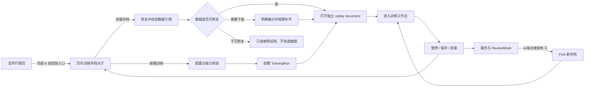

# CandleScope 回放训练 v2 产品合同

状态：`FROZEN_PHASE_11`。用户已于 2026-07-21 确认基础合同；Phase 11 将入口旅程修订为“实时页内存档大厅 → 创建或加载 → 独立 replay document”。该修订不改变 live/replay 运行时隔离或服务端权威语义。2026-07-30 的后续发布决策仅把 v2 产品选择器改为默认开启；回放后端与实时页入口总闸仍默认关闭。

合同版本：`replay.product.v2`

Phase 0 父提交：`2346dba32c0ce9e35dd6941bc4445366da4362a7`（2026-07-21）

配套执行文档：[`KLINE_REPLAY_TRAINING_EXECUTION_zh.md`](KLINE_REPLAY_TRAINING_EXECUTION_zh.md)

---

## 1. 合同地位与解释规则

本文是回放训练 v2 的产品真值，回答“用户最终得到什么、每个操作究竟是什么意思、缺数据时必须怎样表现”。配套执行文档回答“怎样分阶段把现有 Replay v1 迁移到这个产品”。

本文使用以下约束词：

- **必须**：产品或数据正确性的硬合同，不能为了演示而降级。
- **应该**：默认行为；若实现需要偏离，必须先修订本文并记录理由。
- **可以**：非阻塞增强，不得反向削弱硬合同。

若本文与旧版执行记录中的 UI 描述冲突，以本文为准。旧版中已经通过验证的确定性 Actor、虚拟时钟、数据覆盖、账本、checkpoint、恢复、报告和无未来数据边界仍是迁移基线；旧版“固定单商品 Session、专用简化页、替代实时右栏、顶部固定控制条”不再是目标产品合同。

---

## 2. 产品结论

回放训练不是一个单独的 K 线动画页面，而是运行在历史虚拟时间中的完整 CandleScope 交易工作台。

以下结论已经确认并冻结；实施者不得自行改写：

1. 用户从普通实时行情页顶部打开“训练存档大厅”页面内弹窗，可新建训练，也可恢复已有训练。
2. 创建或加载训练后，在独立的 replay document 中运行回放；live 组合根不切换数据源。
3. 一个存档代表一次组合级 `TrainingRun`，不是某一个币的一次回放。它拥有一个全局虚拟时钟、一个模拟账户、多条商品轨道和完整审计记录。
4. 进入训练后，页面必须复用实时行情页的视觉骨架、布局组件和用户布局偏好；差别只能来自 REPLAY 身份、历史能力状态、模拟交易面板和底部操控坞。
5. replay document 只能挂载 replay runtime。它不得在加载、报错、恢复或缺数据时偷偷请求 live K 线、实时价格、实时盘口或实时高级市场数据。
6. BAR 回放是离散基础 K 线事件；成交回放是按历史成交事件推进的连续虚拟时间。两者共用账户、命令、持久化和页面，不共用错误的播放语义。
7. 所有时间隐藏、成交、费用、资金费、保证金、爆仓和快进结果都由服务端权威计算；前端遮字和本地估算不能冒充训练真实性。
8. 历史数据只按需要的商品和能力加载。主图商品、有持仓或活动订单的商品必须全量维护，其余商品可以不订阅或仅预热。
9. 数据能力不足时保留原布局位置并明确显示“不支持、近似、加载中或已降级”；空白、零值和伪实时数据都不合格。
10. 训练配置、规则变更、入金、订单、成交、账本、仓位、爆仓、视图操作、资金曲线和复盘动作必须可保存、恢复和审计。

---

## 3. 核心名词

| 名词 | 合同含义 |
|---|---|
| `TrainingRun` | 一次总训练存档；拥有不可变回放方式、全局虚拟时钟、账户、规则、商品轨道、事件日志和生命周期。 |
| `MarketTrack` | 某个 `exchange + market_type + symbol` 在该训练中的历史数据轨道；按 Run 的回放方式绑定数据源，并拥有 dataset identity、cursor、K 线构建器和订阅级别。 |
| `ViewerState` | 当前查看商品、展示周期、可见范围、面板布局、图表类型和绘图等界面状态；它不是不可变数据源身份。 |
| `BaseInterval` | BAR 数据源能够确定性推进的最小历史 K 线周期，例如 1m。 |
| `DisplayInterval` | 用户当前查看的周期，例如 15m；可随时切换，不改变已经推进到的虚拟时间。 |
| `VirtualTime` | 服务端权威的训练市场时间；一个 `TrainingRun` 只有一个全局虚拟时钟。 |
| `DataFidelity` | 数据本身能证明到什么程度，例如完整 BAR、完整 aggTrade、完整历史 L2。 |
| `ExecutionFidelity` | 模拟订单能证明到什么程度，例如 BAR 保守触价、聚合成交 tape、历史盘口辅助。 |
| `IntegrityMode` | 中途是否允许入金或修改规则，以及结果能否进入严格训练统计。 |
| `TimeDisclosurePolicy` | 真实历史时间向用户显示到何种粒度；必须覆盖全部输出边界。 |
| `SubscriptionTier` | 商品在训练中的维护强度：`NONE`、`WARM`、`FULL`。 |
| `CapabilityState` | 某个历史面板或模型当前是精确、近似、不支持、加载中还是降级。 |
| `ReviewMode` | 对已发生的市场事件、交易动作和视图动作进行只读复盘；不得改写原训练。 |

### 3.1 Phase 0 协议冻结

v2 wire protocol 固定为 `replay.v2`。Python、TypeScript 和 canonical golden 必须逐值一致：

- Python 唯一定义：[`backend/app/replay/training/models.py`](../backend/app/replay/training/models.py)
- TypeScript 唯一定义：[`frontend/src/features/replay/replayV2Types.ts`](../frontend/src/features/replay/replayV2Types.ts)
- 跨语言 golden：[`backend/tests/fixtures/replay/v2_contract_golden.json`](../backend/tests/fixtures/replay/v2_contract_golden.json)

Run 生命周期只允许：

| `RunState` | 合同语义 |
|---|---|
| `PAUSED` | 全局时钟停止；创建成功、恢复、controller 丢失和人工暂停都收口到该状态。 |
| `PLAYING` | 按冻结调度语义连续消费原子事件。 |
| `ADVANCING` | 正在执行有计划、有进度、可审计的 advance/fast-forward；不是跳过领域事件。 |
| `ENDED` | 训练已终结，只能报告、Review 或 Fork。 |
| `ERROR` | 没有可继续推进的可信状态；必须保留最后可信 checkpoint 和可行动原因。 |

创建必须原子提交，因此不定义可持久化、可被大厅当成存档展示的 `CREATING` 半状态。

Track 生命周期只允许：

| `TrackState` | 合同语义 |
|---|---|
| `DORMANT` | 轨道已注册但不读取历史；对应正常的 `NONE` 初态。 |
| `PREPARING` | 正在校验、下载、恢复或对齐到全局 `VirtualTime`；不能发布旧值或 live 值。 |
| `READY` | 当前 tier 所需的身份、覆盖和构建器状态已经验证。 |
| `DEGRADED` | 曾可信的连续性、checksum、identity 或恢复条件失效；精确值立即清空，强制 `FULL` 时暂停整个 Run。 |
| `ERROR` | 轨道无法在当前存档合同下恢复；不得自动换 source 或执行模型。 |

其余硬枚举固定为：

| 枚举 | 唯一值集合 |
|---|---|
| `ReplaySource` | `BAR`, `AGG_TRADE` |
| `StartMode` | `MANUAL`, `RANDOM` |
| `IntegrityMode` | `CHALLENGE`, `PRACTICE`, `SANDBOX` |
| `TimeDisclosurePolicy` | `NONE`, `HIDE_YEAR`, `HIDE_MONTH`, `HIDE_DAY`, `HIDE_HOUR`, `HIDE_MINUTE`, `HIDE_ALL` |
| `SubscriptionTier` | `NONE`, `WARM`, `FULL` |
| `CapabilityState` | `AVAILABLE_EXACT`, `AVAILABLE_APPROX`, `UNSUPPORTED_NO_HISTORY`, `UNSUPPORTED_SOURCE_MODE`, `LOADING`, `DEGRADED` |
| `FastForwardPlan` | `CHECKPOINT_JUMP`, `AGGREGATE_SCAN`, `FULL_EVENT_SCAN`, `BLOCKED` |
| `BookMode` | `OFF`, `BOOK_ASSISTED_REQUIRED` |
| `MarginMode` | `CROSS`, `ISOLATED` |
| `ExecutionModel` | `TOUCH_OR_TAPE_V2`；历史 L2 queue model 尚未冻结，不能自行增加“精确盘口撮合”值。 |

`CapabilityKind`、v2 command type 和 event type 的完整集合以同一 canonical golden 为机器可读真值；新增、删除或改名必须先修订本合同、同步两端定义并更新 golden，未知值一律拒绝。时间披露只能保持或变得更严格；变得更宽松必须通过后续 Phase 实现的显式、不可撤销审计事件，普通 parser/projection 不得静默降级。

Schema 迁移策略固定为 `ADDITIVE_ONLY`：v2 只能新增表、索引和读取路径；不得重命名、删除、就地改写 `replay.v1` 表或旧 JSON/hash。v1 到 v2 的任何转换都创建新 `TrainingRun` 并保留 parent ref。

首个多商品闭环限定在同一交易所、同一市场类型、同一结算资产的线性合约组合，例如同一 USDT 结算账户下的多个商品。跨交易所、跨现货与合约、跨结算币种不属于首个闭环。

---

## 4. 完整用户旅程

### 4.1 实时页入口

- 入口位于正常实时行情页顶部，并明确标为“K 线回放”或“回放训练”。
- 点击后在实时页内打开训练存档大厅；live 页面继续拥有并保持原商品、周期、socket、缓存和布局状态。
- 入口需要同时满足前端展示开关和后端权威 capability；后端不可用时不得展示可创建训练的假入口，也不得打开会回退到 live 的假回放页。
- 入口把当前商品身份、展示周期和自选分组快照作为结构化 launch context 交给服务端保存；不得携带隐藏的历史起点、未来数据、live runtime 对象或从 replay 侧回读 live 浏览器存储。
- 用户创建或加载训练后才打开独立 replay document；新页面只能凭服务端 run/session 身份恢复上下文，不依赖 `window.opener`。
- 直接访问 replay URL 也必须能进入存档大厅，不依赖 `window.opener`。

### 4.2 训练存档大厅

存档大厅是可复用的模态工作区，不是只能新建 Session 的一次性表单。它既可作为实时页内 launcher 呈现，也可供直接访问 replay URL 时独立呈现；两种呈现必须复用同一套服务端列表、创建和恢复合同。

大厅首屏必须包含：

- “新建训练”主操作；
- 可分页的已有训练列表；
- 最近训练、暂停训练、已结束训练和异常训练的明确状态；
- 训练名称、模式、完整性标记、最近查看商品、已订阅商品数、虚拟进度、账户权益、最后保存时间；
- “继续训练”“查看报告”“进入复盘”操作；
- 数据缺失、版本不兼容或需要重新下载时的可行动说明。

打开大厅只允许加载轻量存档元数据，不得为每个存档自动 pin 或下载历史市场数据。

盲测训练在未解密前，存档卡片不得泄露真实日期、dataset 文件名、分区日期或可以反推出起点的错误信息。

### 4.3 新建训练

创建流程应该像游戏新存档：先选训练规则，再进行数据能力校验，最后原子创建。创建失败不得留下一个看似可继续但缺少数据引用的半成品存档。

### 4.4 训练中返回大厅

- 用户可在暂停状态返回大厅；系统先完成 checkpoint，再释放不必要的活动资源。
- 播放中直接关闭页面时，服务端必须在 controller 失联后自动暂停并保存，不允许壁钟时间在无人控制时继续推进。
- 从大厅恢复时始终以服务端 snapshot 为准，前端本地缓存不能覆盖权威状态。

---

## 5. 新建训练配置合同

### 5.1 基础字段

| 字段 | 必须行为 |
|---|---|
| 训练名称 | 可选；为空时由系统生成可辨识名称。改名不影响确定性 hash。 |
| 初始商品 | 默认取进入回放时实时页正在看的商品；用户可在创建前修改。 |
| 市场范围 | 首版固定为同交易所、同市场类型、同结算资产；创建后不可跨范围添加商品。 |
| 回放方式 | `BAR` 或 `AGG_TRADE`。它是整个 TrainingRun 的不可变模式，所有 MarketTrack 必须使用同一模式；UI 必须展示数据与成交真实性差异，不能只写“精确/普通”。 |
| 开始方式 | `MANUAL` 或 `RANDOM`。手动选择可从该商品最早合格历史开始；随机只能从覆盖完整的合格范围抽样。 |
| 开始时间 | 手动模式显示 capability 返回的可用边界、缺口和不可选原因；不能允许任意时间后再静默纠正。 |
| 前向缓存长度 | 表示创建时优先准备的未来历史窗口，不等于训练强制结束时间；用量与预计磁盘占用必须可见。 |
| 初始金额 | 使用结算资产的 Decimal 字符串；创建后只可通过已授权“入金/出金”事件改变。 |
| 最大杠杆 | 是训练级上限；实际商品上限取训练上限、商品规则上限和风险模型上限的最小值。 |
| 手续费 | 至少区分 maker/taker；必须写入版本化 fee policy，不能只保存在前端。 |
| 资金费 | `OFF`、`HISTORICAL_EXACT` 或明确标为沙盒的自定义模型；历史数据不完整时不得宣称 exact。 |
| 保证金模式 | 可允许 `CROSS`、`ISOLATED` 或两者；具体订单/仓位必须记录选择。 |
| 时间隐藏 | 使用第 6 节的服务端权威策略。 |
| 中途修改 | 关闭时规则锁定；开启时必须展开可修改项并将每次修改写入审计事件。 |
| 历史盘口 | 默认关闭；开启后是 Run 级不可变 `BOOK_ASSISTED_REQUIRED` 模式。只有 capability 证明初始范围存在连续历史 L2 时才可选择，后续缺少同等覆盖的商品不能升级为 `FULL`。 |

### 5.2 数据能力校验

点击“创建”前必须显示一份能力摘要：

- 可用历史起止范围；
- BAR 的最小 `BaseInterval`；
- aggTrade 覆盖是否精确、是否存在未知 ID 边界；
- mark/index/funding/OI/市场爆仓/order book/order flow 各自的能力状态；
- 预计需要下载和已经缓存的数据量；
- 选定规则中哪些会导致结果只能标为近似；
- 创建后不能修改的字段。

能力校验与创建必须绑定同一个版本化 catalog/data epoch。校验后数据发生变化时，创建要拒绝并要求刷新，不能使用过期结论。

### 5.3 随机起点

- 随机候选只来自 `BaseInterval` 对齐、warmup 完整、前向缓存窗口完整且没有未知缺口的范围。
- BAR 随机候选必须来自远端 `replay-history` index/manifest 的版本化连续段，不能读取实时 `candlescope.db` 或本地正文缓存的覆盖范围。单个缺口只切分它所在的连续段，不得使缺口后的全部历史失效。
- 每个连续段按其有效候选时间点数量进入前缀和；随机索引映射到所有连续段的候选全集，不能先等概率选段再选时间。
- 随机算法使用服务端生成或保存的 seed，并将候选范围版本写入存档；相同 seed 与 dataset identity 必须得到相同起点。
- catalog 校验、随机选择、冻结快照和 `ALL_AVAILABLE` 历史必须绑定同一个不可变归档 revision；发布新的 `current` revision 不得改变既有 Run。
- 服务端必须先持久化 seed、选中时间、catalog 与 source revision 的 selection commitment，再下载正文。下载失败后的重试只能复用该 commitment，不能重新抽签；本地缓存仅用于加速，可缺失且不得扩大或缩小随机域。
- 不能按未来收益、波动结果或用户未知的事后标签挑选起点。若未来增加“行情场景训练”，标签生成与防泄漏规则必须另立合同。
- 严格盲测只能使用随机起点。用户手动选择具体日期后，存档必须标记 `START_TIME_KNOWN`，不得进入“未知起点”统计。

### 5.4 创建原子性

一次成功创建必须同时完成：

1. `TrainingRun` 元数据与规则版本写入；
2. 初始 `MarketTrack` 与不可变 dataset ref 绑定；
3. 初始账户、账本和 checkpoint 写入；
4. disclosure policy 与 integrity mode 写入；
5. 数据 pin 或可确定重建的 rehydration manifest 写入。

任一步失败都回滚整个创建事务，并释放本次新增的临时 pin。

---

## 6. 时间隐藏与训练完整性

### 6.1 时间隐藏策略

时间隐藏不是一个前端布尔值，而是 `TimeDisclosurePolicy`。用户选择某个粒度时，隐藏该粒度及更粗的真实日历单位，保留更细单位；隐藏部分使用单调的相对时间轴替代。

| 策略 | 隐藏的真实单位 | 允许显示 |
|---|---|---|
| `NONE` | 无 | 完整年月日时分秒 |
| `HIDE_YEAR` | 年 | 月、日、时、分、秒 |
| `HIDE_MONTH` | 年、月 | 日、时、分、秒 |
| `HIDE_DAY` | 年、月、日 | 时、分、秒与合成 `D+N` |
| `HIDE_HOUR` | 年、月、日、时 | 分、秒与合成进度 |
| `HIDE_MINUTE` | 年、月、日、时、分 | 秒、事件序号或 bar 序号 |
| `HIDE_ALL` | 所有真实时间单位 | 只显示合成训练日、相对时长、bar/event 序号 |

该策略必须同时作用于：

- 图表坐标轴、十字线、tooltip 和数据窗口；
- 顶栏、底栏、控制坞和加载提示；
- 订单、成交、资金费、爆仓、日志和资金曲线；
- 存档大厅、报告、CSV/JSON 导出和 ReviewMode；
- URL、DOM 属性、ARIA 文本、错误详情、浏览器存储和客户端日志。

隐藏策略由服务端把实际时间映射为公开时间。前端不能先收到真实时间再用格式化函数遮住。

### 6.2 解密真实时间

- `CHALLENGE` 模式只能在训练结束后解密。
- `PRACTICE` 或 `SANDBOX` 可按创建时规则允许中途解密，但解密是不可撤销的审计事件，结果从该刻起标为非严格训练。
- 解密只改变公开展示，不重写历史事件的实际时间、顺序或 hash。

### 6.3 完整性模式

产品 UI 可以保留“是否允许中途修改参数”的直观开关，但服务端必须映射为明确模式：

| 模式 | 中途规则变更 | 结果标签 |
|---|---|---|
| `CHALLENGE` | 不允许入金、改费率、改杠杆上限、改资金费、解密时间或切换执行模型 | 严格训练，可参与可比统计 |
| `PRACTICE` | 只允许创建时勾选的变更项 | 练习；报告逐项列出变更 |
| `SANDBOX` | 允许所有安全且可审计的规则变更 | 沙盒；不进入严格统计 |

所有变更满足：

- 从服务端接受命令的虚拟时刻起生效，不追溯修改旧成交、旧资金费或旧保证金；
- 写入原值、新值、原因、虚拟时刻和命令 ID；
- 变更失败时不产生部分账本或半更新策略；
- 不允许修改数据源身份、已经揭示的市场事件或 settlement asset。

---

## 7. 训练工作台布局合同

### 7.1 “完全复刻实时行情”是什么意思

它表示 live 与 replay 共用同一套可视组件和布局生命周期，不表示 replay 挂载 live 数据运行时。

| 实时页区域 | 回放页合同 |
|---|---|
| TopBar | 复用同一组件和商品切换体验；增加不抢占空间的 `REPLAY` 标识、训练名称和返回大厅入口。 |
| IntervalSelector | 复用同一周期选择器；周期是 `ViewerState`，可随时切换。 |
| ChartWorkspace | 复用图表、分屏、缩放、坐标轴、图表类型和绘图工具；数据由 replay provider 提供。 |
| 指标与面板 | 能从已揭示历史可靠计算的正常工作；缺少历史源的保留位置并显示 capability 状态。 |
| RightMarketRail | 保留自选与原有 dock 生命周期；模拟交易作为 rail 内正式 dock/tab，不得用一条专用长列表替换整个右栏。 |
| StatusBar | 保留连接和数据状态；增加 source、fidelity、虚拟时钟、controller 和存档状态。 |
| Feature surfaces | 设置、导出、报告等复用现有交互；任何需要 live runtime 的能力必须有 replay adapter 或明确不可用。 |

允许的视觉差异只有：回放身份、历史 capability 提示、模拟交易入口、底部操控坞、训练报告/复盘入口。主题、宽度、高度、折叠状态、图表和面板布局应继承用户实时页偏好。

主题、pane 布局、指标配置和自选分组可以作为 replay 的初始视图模板；绘图、提醒和训练中的视图修改必须 run-scoped。不得把 live 图表上带真实时间锚点的绘图静默挂进盲测，也不得让 replay 修改反向污染 live 状态。

### 7.2 组合根隔离

- `App` 只拥有 live runtimes；`ReplayApp` 只拥有 replay runtimes。
- 可以共享纯组件、view model、store 协议、布局 preference 和图表 adapter。
- replay 不能 value-import 或 mount `useMarketDataRuntime`、live order book、live trade flow、live liquidation、live advanced-market stream 或 live subscription lease。
- capability 为 unavailable 时显示解释面板；不得以 live 数据、mock 数据或上次实时缓存填空。

### 7.3 开始点之前的历史回看

- 新建训练默认使用 `ALL_AVAILABLE`；主图初次打开包含指标 warmup 历史，用户继续向左滚动时应像实时页一样分段加载，直到创建时绑定的连续历史起点。
- 用户向左滚动时复用实时 backfill 的范围规划、去重、取消、缓存和 `SeriesWindowStore` 增量语义，但数据请求必须走 replay-aware history provider。
- 已挂载图表的分页状态不得映射为整图 loading/空白遮罩；ViewerState 投影必须把历史页继续发布为 `prepend`（聚合边界修正可追加 `mid-merge`），把推进发布为 `tick/append`。只有初次装载、身份/周期切换或权威重同步才允许 `replace`。图表实例、pane、缩放和可见时间锚点在左侧分页期间必须保持，体感与实时行情一致。
- `indicator_warmup_bars` 只决定执行/指标初始化快照，不得作为图表可浏览历史上限。`DURATION` 仅作为旧 Run 与显式固定窗口的兼容策略。
- 更早历史必须绑定该 MarketTrack 的 history epoch、创建时确定的 source identity 与连续历史边界。`ALL_AVAILABLE` 可由 replay service 从本地只读 K 线仓库按固定范围分页，但不得触发 live backfill、交易所网络请求、live HTTP/WS 或读取浏览器实时缓存；行数、时间序列、身份或连续性不符时必须 fail closed。
- 前端可以使用有界滑动窗口控制内存；若向左分页淘汰了窗口右端，用户重新向右触边时必须通过 replay 权威快照恢复当前已揭示窗口，并重置 history provider，使其随后仍可再次向左分页。不得把内存上限伪装成历史终点，也不得用 live 数据修补右端。
- backfill 只能返回该 `MarketTrack` 的历史数据，且任何向右数据不得超过当前全局 `VirtualTime`。
- 加载更早历史不推进虚拟时钟、不触发订单、不改变账户，也不把 warmup 数据记作训练期间行情。
- 时间隐藏策略同样覆盖更早历史。

### 7.4 右侧模拟交易

右栏至少提供以下可切换视图：

- 下单；
- 当前持仓与实时未实现盈亏；
- 活动订单；
- 历史成交与已平仓交易；
- 账户权益、可用保证金、保证金率和风险提示；
- 订单簿、盘口或订单流 capability 面板。

有持仓或活动订单的商品必须继续更新，即使用户切到别的主图商品。

### 7.5 底部操控坞

播放操控固定在页面底部的专用 dock，不挤占周期栏。dock 可折叠，但暂停、当前速度、虚拟进度和 controller 状态必须始终可见。

---

## 8. 历史能力与降级合同

### 8.1 统一能力状态

每个历史能力只能处于以下状态之一：

| 状态 | UI 与计算行为 |
|---|---|
| `AVAILABLE_EXACT` | 数据覆盖和模型满足精确合同；展示来源与覆盖。 |
| `AVAILABLE_APPROX` | 可以计算，但必须持续显示近似原因；报告也保留该标签。 |
| `UNSUPPORTED_NO_HISTORY` | 交易所或本地没有所需历史；保留面板位置并说明。 |
| `UNSUPPORTED_SOURCE_MODE` | 当前回放方式无法支持，例如 BAR 下的逐笔订单流。 |
| `LOADING` | 正在按需准备；显示进度和取消入口，不显示旧值。 |
| `DEGRADED` | 曾可用但连续性、checksum、重同步或数据健康失败；立即清空精确值并 fail closed。 |

`UNSUPPORTED` 和 `DEGRADED` 绝不能用 `0`、空白或“暂无数据”混淆。

### 8.2 首版能力矩阵

| 能力 | BAR | AGG_TRADE | 历史 L2 |
|---|---|---|---|
| K 线与 OHLCV | 精确到已验证 BAR 覆盖 | 由已验证 aggTrade 聚合；声明 aggregate-tape fidelity | 可由更高保真事件派生，但不是首版原因 |
| 普通 OHLCV 指标 | 只读已揭示前缀，可支持 | 只读已揭示前缀，可支持 | 同左 |
| 订单流 / tape / CVD | 默认 `UNSUPPORTED_SOURCE_MODE`；若仅用 BAR proxy，必须标 `AVAILABLE_APPROX` | 支持 aggregate-tape 级别，不得改名为 RAW_TRADE | 取决于成交与 book 数据完整性 |
| 历史 OI | 只在独立 OI 历史覆盖存在时支持 | 同左 | 同左 |
| 历史市场爆仓流 | 只在独立爆仓历史覆盖存在时支持 | 同左 | 同左 |
| 模拟账户爆仓 | 取决于 mark、维护保证金阶梯和 intrabar 模型 | 取决于 mark、维护保证金阶梯和成交顺序 | 取决于同样的账户规则；与市场爆仓流是两件事 |
| mark / index / basis | 需要各自历史源；不得拿 last price 冒充 exact mark | 同左 | 同左 |
| funding | 需要历史费率、结算时刻、mark 和商品规则 | 同左 | 同左 |
| 订单簿 / 盘口 | `UNSUPPORTED_SOURCE_MODE` | 没有 L2 archive 时仍不支持 | 只有 snapshot + ordered deltas + 连续性验证后可开放 |

历史“市场爆仓事件”与模拟账户因保证金不足产生的“账户爆仓事件”必须在命名、颜色、数据源和报告中分开。

---

## 9. BAR 回放操控语义

### 9.1 基础原则

- BAR 模式的最小原子市场事件是一根 `BaseInterval` K 线。
- `DisplayInterval` 只是视图聚合周期，不能成为全局 cursor 身份。
- 切换周期不推进时间；新周期从已揭示的基础 K 线前缀确定性重建。
- 一根高周期 K 线尚未收口时，必须作为 forming bar 更新，不能等整个高周期结束后突然出现。

### 9.2 控制项

| 控制 | 权威命令语义 |
|---|---|
| 暂停 / 继续 | 在完整原子事件边界暂停；确认暂停后不得再有市场、订单或账本推进。 |
| 下一根 | 默认执行 `STEP_DISPLAY(1)`：若当前展示 K 尚未收口，本次只把它走完；若已经对齐到收口边界，本次推进一根新的完整展示 K。 |
| 推进展示 K | `STEP_DISPLAY(n)`；`n` 指当前 `DisplayInterval` 的 K 线数。 |
| 推进基础 K | `STEP_BASE(n)`；精确消费 `n` 个 `BaseInterval` 事件。 |
| 按展示 K 自动播放 | 速度是每秒完成多少根当前展示周期 K；仍要消费其内部所有基础事件。 |
| 按基础 K 自动播放 | 速度是每秒多少根基础 K；例如 base=1m、view=15m 时，每秒 1 根 1m，当前 15m forming bar 每秒更新一次并在第 15 次收口。 |
| 快进时长 | 只接受 `BaseInterval` 的整数倍；目标是全局虚拟时刻，不是跳过中间账户事件。 |

### 9.3 多周期对齐

设 base=1m，用户在 15m bucket 中只推进了 1m，然后切到 15m：

1. 图表立即显示由已揭示 1m 前缀构成的正确 15m forming bar；
2. 第一次 `STEP_DISPLAY(1)` 只消费剩余 14 根 1m，使当前 15m 收口；
3. 下一次 `STEP_DISPLAY(1)` 再消费新的 15 根 1m；
4. 若中间存在交易所日历边界、停牌或不可证明缺口，命令必须按该市场日历明确处理或拒绝，不能用毫秒除法猜测。

`STEP_DISPLAY` 的命令 payload 必须带用户操作时的 `display_interval` 和预期 cursor/revision。前端在命令 pending 时切换周期，不得改变已经提交命令的含义。

---

## 10. 成交回放操控语义

### 10.1 数据真实性

当前已实现的数据源是 `AGG_TRADE`，即交易所聚合成交，不是每一笔原始撮合。产品文案必须使用“成交驱动/聚合成交回放”，不得宣称 raw trade 或逐笔撮合完全还原。

### 10.2 控制项

成交回放支持 BAR 能表达的所有派生控制，并额外支持：

- 下一成交事件 `STEP_EVENT(1)`；
- 按历史虚拟时间连续播放；
- 任意正数虚拟时间倍率；
- 按事件数、基础 K 数、展示 K 数或虚拟时长推进；
- 在无路径依赖状态时进行经过证明的加速跳转。

同一毫秒的成交必须用稳定次序键排序；当前 aggTrade 使用 `(trade_time_ms, agg_trade_id)`。播放倍率只影响壁钟调度，不进入领域状态 hash。

### 10.3 快进规划器

每次快进先由服务端生成可解释计划：

| 计划 | 适用条件 | 行为 |
|---|---|---|
| `CHECKPOINT_JUMP` | 目标 checkpoint 与全部依赖状态、dataset identity 一致 | 恢复 checkpoint，再精确处理尾部事件。 |
| `AGGREGATE_SCAN` | 区间内没有持仓、活动订单、条件单、资金费、爆仓或其他路径依赖 | 可用已验证 K 线/聚合结果推进视图，再处理无法聚合的尾部成交。 |
| `FULL_EVENT_SCAN` | 存在任何路径依赖市场状态 | 顺序处理全部相关事件，可显示预计耗时和取消，但结果不能近似。 |
| `BLOCKED` | 数据缺口、身份漂移、资源预算超限或无法证明正确性 | 明确拒绝并给出可行动原因。 |

“有仓位时快进一天”不能通过只看终点价格计算最终盈亏。首版必须 `FULL_EVENT_SCAN` 或 `BLOCKED`；只有未来证明可保持订单、资金费、保证金和爆仓等价时才能增加新的优化计划。

---

## 11. 多商品全局时钟

- 一个 `TrainingRun` 只有一个 `VirtualTime`，所有 `FULL` MarketTrack 按稳定总序合并推进。
- 同一个 TrainingRun 不混用 BAR 与 AGG_TRADE。新增商品若没有该 Run 所选模式的合格覆盖，就不能升级为 `FULL`，也不能偷偷退回另一种 source。
- 总序至少包含实际事件时间、商品稳定 ID、源内序号；规则版本必须写入存档和 hash。
- 同一虚拟时刻内，资金费、市场事件、条件触发、爆仓检查和用户命令采用冻结的原子处理顺序。
- 切换主图商品只改变 `ViewerState`，不改变全局时钟、账户或其他商品 cursor。
- 新增商品轨道不得从 live 当前价格开始，必须在该训练的历史虚拟时刻建立同一时间切片。
- 某个必须 `FULL` 的商品无法推进时，整个 TrainingRun 暂停并进入明确故障状态；不能让账户的一部分商品继续走、另一部分停在过去。

---

## 12. 模拟交易合同

### 12.1 订单与持仓

首个闭环至少支持：

- 市价开多、开空、平多、平空；
- 限价开仓和平仓；
- 撤单；
- 止损市价和止盈市价；
- reduce-only；
- `CROSS` 与 `ISOLATED` 保证金；
- 同一商品首版采用 one-way position，跨商品可以形成组合对冲。

同一商品 hedge mode、组合保证金和期权 Greeks 不属于首个闭环。

### 12.2 未开启历史盘口时

执行模型明确命名为 `TOUCH_OR_TAPE_V2`，并持续显示“不含盘口排队”。

- 市价单：命令被服务端接受时，使用当前已揭示、可执行的权威参考价立即成交，加上配置 slippage，并收 taker fee；没有可执行价时拒绝。不得读取下一条未来事件后再倒填为“立即”。
- 穿价限价单：若下单价在当前已揭示参考价上立即可成交，按 taker 处理。
- 挂单：只在下单之后的市场事件首次触及或穿越价格时成交；绝不追溯到下单前已经发生的高低点。
- BAR 模式：没有 bar 内路径时采用冻结的保守顺序；同一最小 K 内止盈和止损都触发时选择对账户更不利的可行结果并警告。
- AGG_TRADE 模式：按聚合成交顺序和可见成交量约束撮合，但不能证明 aggregate 内部原始 fill 顺序或真实 queue position。
- resting limit 可按 maker fee 计费，但“maker”只表示费用分类，不表示真实排队位置得到还原。

### 12.3 开启历史盘口时

创建界面的盘口选项只有在以下条件全部满足时才能启用：

1. 有时间对齐的 snapshot；
2. 有按交易所序号排序的增量；
3. `U/u/pu` 或等价连续性规则通过；
4. gap/resync 事件被持久化并能 fail closed；
5. dataset 可以 pin 或确定性重建。

即使满足这些条件，是否能宣称 queue-exact 仍取决于排队位置模型；在该模型另行冻结前只能称 `BOOK_ASSISTED`，不能称交易所精确撮合。

盘口开关不允许按商品静默混搭 execution model。`BOOK_ASSISTED_REQUIRED` Run 的任一强制 `FULL` 轨道缺失或失去连续历史 L2 时，整个 Run 暂停；不得自动退回 touch/tape 模型继续成交。

### 12.4 手续费与资金费

- 所有费用使用 Decimal，写入独立账本分录并进入权益、可用保证金和报告。
- maker/taker fee policy 有版本和生效虚拟时刻。
- 历史资金费必须按真实结算时刻、当时持仓、历史费率和权威 mark 结算。
- 缺少费率、mark、商品规则或结算覆盖时，`HISTORICAL_EXACT` 必须拒绝或暂停；不得按 0 静默跳过。
- 自定义固定资金费只能用于 `SANDBOX` 或明确标为近似的练习。

### 12.5 保证金与爆仓

- 逐仓仓位只使用分配给该仓位的保证金；全仓使用同一 settlement account 的可用权益。
- 维护保证金必须使用版本化商品阶梯；最大杠杆不能替代维护保证金规则。
- 爆仓检查使用权威 mark；若只能用 last/trade/bar price 代理，必须标为 approximate，不能写“真实爆仓”。
- 爆仓是领域事件，必须有触发价、mark、维护保证金、费用、前后账户状态和 fidelity。
- 平仓也走正常市价或限价订单流程，不允许直接改 position quantity。

---

## 13. 自选列表与按需订阅

训练继承用户的自选分组和排序，但订阅级别属于该 `TrainingRun`，不能复用 live subscription API 或影响实时页。

| 级别 | 数据行为 | 自选展示 |
|---|---|---|
| `NONE` | 默认；不下载、不解码、不推进该商品历史数据 | 显示商品身份和“未订阅”，不显示伪价格 |
| `WARM` | 在预算内准备当前虚拟时刻附近的 manifest、索引、基础窗口和构建器恢复点；不承担订单/风险计算 | 显示预热状态与覆盖，不保证连续价格推送 |
| `FULL` | 与全局时钟同步推进，维护当前价、K 线、必要市场源、订单、仓位、PnL、资金费和爆仓 | 显示当前虚拟价格、涨跌和风险信息 |

强制规则：

- 当前主图商品强制 `FULL`；
- 有持仓、活动订单、条件单、待结资金费或风险依赖的商品强制 `FULL`；
- 用户不能把强制 `FULL` 直接降级，UI 必须说明锁定原因；
- 风险依赖消失后可以降级，降级前先 checkpoint；
- 从 `NONE/WARM` 切换为主图时，系统先暂停全局时钟、建立与当前 `VirtualTime` 对齐的 `FULL` 轨道，成功后再呈现；失败则保持原商品和账户状态。

所有订阅都有明确内存、磁盘、下载和活动轨道预算。超预算必须让用户选择降级或释放其他非强制轨道，不能自动丢弃有仓位商品。

---

## 14. 保存、数据生命周期与复盘

### 14.1 必须持久化的训练信息

- `TrainingRun` 配置、状态、协议版本和迁移版本；
- 所有 `MarketTrack` identity、dataset ref、cursor、订阅级别和构建器状态；
- 账户、持仓、订单、成交、费用、资金费、爆仓和逐项账本；
- 命令、规则变更、入金/出金和 controller 交接；
- `ViewerState` 的重要动作：商品切换、周期切换、关键面板切换、绘图变更和用户标记；
- journal、训练报告和多分辨率资金曲线；
- checkpoint、state hash、report hash 和数据 pin/rehydration 信息。

高频鼠标移动、每帧缩放等噪声不应逐条持久化；重要视图操作使用合并、采样或语义化事件。

### 14.2 ReviewMode

- ReviewMode 是只读播放器，拥有独立 review cursor，不改变原 TrainingRun 的 cursor、账户或日志。
- 可以同步回放市场、订单、成交、仓位、规则变更、journal、资金曲线和语义化视图操作。
- 用户可跳到某次开仓、平仓、爆仓、最大回撤或手工标记。
- “从这里继续”必须 fork 新 TrainingRun，并记录 parent run、parent event 和继承的数据 identity。

### 14.3 历史数据段

每个可回收数据段至少记录：

- source/exchange/market/symbol/range/schema；
- checksum、coverage、continuity 和审计状态；
- 本地路径或对象 identity；
- 是否可从可信来源重新下载；
- pin owner、引用计数、最近使用时间和大小。

按成交回放可以按需下载历史成交并存入独立历史库；下载完成前 capability 为 `LOADING`，校验失败进入 quarantine，不能被 TrainingRun 引用。

### 14.4 GC

- 活动训练、有仓位训练、正在恢复或 ReviewMode 使用的数据不可回收。
- 已保存训练引用且无法确定性重新取得的数据必须 pin，不得因空间压力静默删除。
- 可从可信源按 checksum 确定性重建的冷数据可以回收，但保留 rehydration manifest；下次恢复前明确重新下载。
- GC 先 dry-run，报告将释放的数据段、字节数、受影响训练和可恢复性。
- GC、下载和 pin 变化都进入审计日志；失败不能破坏仍存活的引用。

---

## 15. 故障、恢复与用户可见状态

- 网络断开：本地页面冻结在最后权威 snapshot；重连使用 sequence/epoch 恢复，未知缺口要求原子 resync。
- controller 丢失：服务端自动暂停；恢复页面不得自动继续播放。
- 数据缺口：受影响的精确能力立即清空或暂停，不沿用旧值。
- 单个 `FULL` MarketTrack 故障：整个组合训练暂停，避免跨商品时钟分叉。
- 存储写失败：命令不得先对用户显示成功；commit-before-publish。
- checkpoint 损坏：只允许回退到经过校验的旧 checkpoint 并重放；没有可信恢复点则 fail closed。
- 版本不兼容：存档大厅显示只读说明和可执行迁移/导出路径，不得静默改写 golden hash。
- 数据需要重下：显示来源、范围、预计大小和进度；取消后存档仍保持可恢复状态。

所有错误都必须区分“产品不支持”“当前没有历史”“正在加载”“数据已降级”“内部故障”，并给出下一步。

---

## 16. 可访问性与输入合同

- 存档大厅、创建表单、操控坞、下单和风险提示必须可用键盘完成。
- 快捷键在输入框、下拉框和编辑器聚焦时不得触发下单或推进。
- 播放、暂停、controller、数据 fidelity、危险规则变更和爆仓不能只靠颜色表达。
- 时间隐藏后的 ARIA 文本也不得泄露真实时间。
- 持续更新区域使用克制的 live region；不能让每笔成交都打断屏幕阅读器。
- 危险动作如结束训练、解密时间、入金和规则修改需要明确确认与结果标签。

---

## 17. 验收场景

以下场景全部通过前，不能称“符合产品合同”：

1. 从 live 的 BTCUSDT/15m 打开页内存档大厅，live 页面不漂移且大厅默认 BTCUSDT/15m；创建或加载后才进入独立 replay document。
2. 大厅能列出、继续、查看和恢复存档；打开大厅不批量下载历史数据。
3. 手动开始能查看最早合格时间与不可选缺口；随机开始可由 seed 重现。
4. `HIDE_DAY` 时所有真实年月日边界都不泄漏，但小时分钟正常显示。
5. `HIDE_ALL` 时 HTTP、WS、DOM、ARIA、浏览器存储、日志和导出均无真实时间。
6. 创建失败回滚数据 pin、账户和半成品存档。
7. 训练页的顶栏、周期栏、图表、绘图、右栏、状态栏与 live 共用视觉骨架。
8. replay 页面在 capability 缺失、报错和恢复期间都不请求 live 数据。
9. 开始点前向左滚动能补历史，向右永远不超过 `VirtualTime`。
10. BAR base=1m/view=15m 时按基础 K 播放会更新 forming 15m 共 15 次。
11. BAR 在 15m 只形成 1m 时执行 `STEP_DISPLAY(1)`，先补完当前 15m；下一次再走完整新 15m。
12. 切换 1m/15m/1h 不改变 cursor，重建结果与离线聚合一致。
13. AGG_TRADE 的 step、连续播放、倍速、暂停和恢复保持同一 state hash。
14. 无持仓快进一天可选择安全加速计划；有持仓/订单时只能 full scan 或明确阻止。
15. BAR 同一最小 K 内止盈止损都触发时采用冻结的保守结果并提示。
16. 未开盘口时市价单以当前已揭示参考价立即成交；挂单只在下单后的首次触价成交。
17. 手续费、资金费、逐仓/全仓保证金和爆仓逐项进入账本且可独立重算。
18. 缺 mark 或维护保证金阶梯时，模拟爆仓不能标为 exact。
19. 切到新商品时只加载该商品；`NONE` 商品保持零历史读取。
20. 有持仓或活动订单的非主图商品被强制 `FULL`，PnL、止盈止损和爆仓继续处理。
21. 两个商品同一虚拟时刻的事件在重启、倍速和不同 UI 操作下总序一致。
22. 某个强制 `FULL` 商品出现数据 gap 时整个 TrainingRun 暂停，不出现部分组合时间。
23. controller 失联自动暂停；刷新恢复后不自动播放。
24. 允许作弊的训练中入金和改费率从事件时刻起生效，旧账本不被追溯修改。
25. ReviewMode 可定位开平仓和最大回撤，原存档 hash 不变；从中继续会创建 fork。
26. GC 不删除不可重建的存档数据；可重建冷数据回收后能按 manifest 恢复到同一 dataset hash。
27. 历史 OI、市场爆仓、订单簿或订单流不支持时，原面板位置明确显示原因而非空白或零。
28. v1 legacy 存档在大厅中有明确版本标识；迁移或只读恢复不会静默改写原 hash。

---

## 18. 明确非目标与待冻结问题

### 18.1 首个 v2 闭环非目标

- 真实资金、交易所 API key 或任何实盘下单；
- 把 aggTrade 宣称为 raw trade；
- 在没有连续历史 L2 时模拟 queue position；
- 跨交易所、跨结算资产或现货与合约的统一保证金；
- 同一商品 hedge mode；
- 同一个 TrainingRun 混用 BAR 与 AGG_TRADE source；
- 期权、组合保证金和 ADL 的完整交易所复刻；
- 用 live 数据填补任意历史能力；
- 为了快进而近似跳过可能触发订单、资金费或爆仓的事件。

### 18.2 后续讨论但不阻塞 Phase 0–8

1. 历史 L2 开放后，排队位置采用何种模型，以及产品最多宣称到 `BOOK_ASSISTED` 还是 queue-exact。
2. 模拟交易 dock 在右栏中的最终 tab 顺序和紧凑布局；无论视觉方案如何，自选不得消失。
3. `WARM` 的默认前向窗口和资源预算；必须通过真实数据测量后冻结，不在文档里拍脑袋定值。
4. 交易所 fee tier、维护保证金阶梯和 mark/funding 数据的首批支持清单。
5. 是否在后续加入同商品 hedge mode；首版 one-way 不受影响。

这些问题未决时必须保持相应 capability 关闭或近似标识，不能阻止已冻结的存档大厅、完整工作台、BAR/AGG 控制、多商品时钟和按需加载主线。
