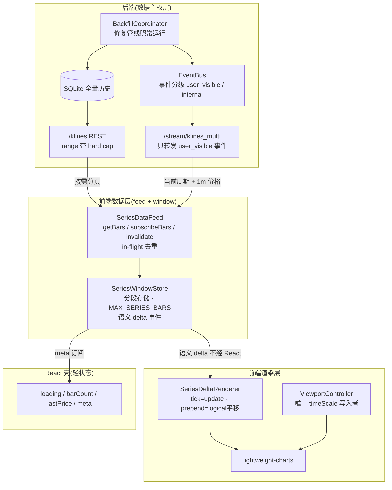

# K 线数据链路视口化重建执行文档(Viewport-Driven Pipeline Rebuild)

> 目标:把 K 线前后端链路从"后端数据库的全量镜像"重建为**视口驱动的窗口渲染架构**——前端只持有并渲染"可见范围 ± 缓冲区",数据主权 100% 归后端;实时 tick O(1) 直通图表;任何历史合并不再引起视口跳动;周期/商品切换首帧毫秒级。对标 TradingView 级看盘软件的 Datafeed 模型,接受大重构,分七个阶段执行,每阶段独立可交付、可验收、可回滚。

关联调查结论:见仓库记忆 `kline-dataflow-bloat-investigation.md`(2026-07-02 根因调查,未改代码)。

---

## 0. 背景:当前根因摘要

| # | 症状 | 根因 | 所在代码 |
|---|------|------|----------|
| R1 | K 线从几百根涨到几万根 | 后端修复事件(`startup_gap_scan` / `background_gap_audit` 每 5 分钟 / `related_interval_warmup` 同跨度放大 / `full_subscription_warmup`)不分 reason 推给前端;前端对每个事件全量搬运(精确 range + 全窗口 history)并 merge 进 chartData | `backend/app/data_engine/runtime.py`、`backend/app/api/v1/klines.py`(`_schedule_related_interval_warmup`)、`backend/app/api/v1/stream_klines.py`、`frontend/src/features/market-data/useBackfillCompletionRuntime.js` |
| R2 | 自我放大回路 | 老数据块 merge 进 chartData 形成"中洞"→ 前端 gap recovery 每 5s 全域扫描 → `fetchKlinesRange` 拉全洞 | `frontend/src/features/market-data/useChartGapRecovery.js` |
| R3 | 无容量闸门 | chartData / interval cache 无上限;前端 GC `preserveActive` 永不裁剪活跃序列;`/klines/range` 无响应上限 | `frontend/src/features/market-data/useChartDataRuntime.js`、`frontend/src/features/cache-gc/cachePolicy.js`、`backend/app/api/v1/klines.py` |
| R4 | 图表位置跳动 | 全量 `setData` + "时间快照恢复"重算 barSpacing;4 级 fallback(scrollPosition 依赖右端 bar 偏移);立即 + rAF 双恢复画错误帧;`fitContent`/savedRange/快照多个 viewport 写入者竞争 | `frontend/src/components/SingleChartPanes.jsx` |
| R5 | 几万根后特别卡 | 每个 WS tick O(N):全量数组拷贝 + 全量 dedup/sort + App 整树重渲染 + 全量 map/Set/Map 重建;16 个周期全订阅,每周期 tick 都 O(N) | `frontend/src/features/market-data/useChartDataRuntime.js`(`commitPatchedChartData`)、`useKlineStreamRuntime.js`、`useChartSession.js`(`trackedIntervals`) |
| R6 | 切周期卡顿 | `clearChartData` 空窗等 REST;指标 `historyLimit = min(chartData.length, 50000)` 跟着膨胀;provisional 1200ms + debounce 500ms 串行延迟 | `frontend/src/features/indicators/indicatorWsRuntime.js`、`indicatorComputeRuntime.js`、`useSessionTransitionReset.js` |

---

## 1. 目标架构

### 1.1 核心原则(不可妥协)

```text
P1 单一数据主权   完整历史只存在于后端 SQLite;前端持有的是"视图窗口",不是副本。
P2 视口驱动取数   前端只按 可见范围 ± 缓冲区 请求数据;翻到哪里取到哪里。
P3 事件不搬数据   backfill 完成事件是"失效通知";只有与持有窗口相交的用户可见修复才触发重取相交部分。
P4 增量渲染      tick 走 series.update();prepend 走 setData + 逻辑区间平移;全量 setData 仅限会话切换。
P5 单一视口仲裁   全应用只有 ViewportController 能写 timeScale;带用户交互锁与优先级。
P6 硬容量上限     每个序列的内存窗口有硬上限,超限从视口远端裁剪;上限即预算,预算即测试断言。
P7 语义化增量     数据层向渲染层发"语义 delta"(tick/append/prepend/mid-merge/replace),渲染层不再靠数组 diff 猜测。
```

### 1.2 数据流总览



### 1.3 关键契约

**SeriesDataFeed(对标 TradingView Datafeed)**

```js
feed.getBars(seriesKey, { from, to, countBack, reason })  // Promise<bars>;内部路由 /history、/history/before、/range;in-flight 去重
feed.subscribeBars(seriesKey, onDelta)                    // WS 当前周期 + 1m 价格
feed.invalidate(seriesKey, { startMs, endMs, reason })    // 失效通知入口;仅相交时重取相交部分
```

**SeriesWindowStore(每序列一个实例)**

```js
store.applyTick(bar)                 // O(1) 尾部追加/替换;发 {type:"tick"} delta
store.applyRange(bars, meta)         // 段合并;发 {type:"prepend"|"append"|"mid-merge"|"replace", addedLeft, addedRight, ...}
store.trimToBudget(viewportHint)     // 超 MAX_SERIES_BARS 时从视口远端裁剪;发 {type:"trim-left"|"trim-right"}
store.snapshot()                     // 当前窗口数组(只读,渲染/指标/绘图共用)
store.coverage()                     // { firstTime, lastTime, gaps[] }
store.subscribe(listener)            // delta 订阅(chart-adapter 直连,不经 React)
```

**ViewportController(chart-adapter 内)**

```js
vc.applySessionRestore(plan)         // 会话切换时一次性恢复(barSpacing + rightOffset + 最右时间)
vc.compensateInsert(addedLeftCount)  // prepend/mid-insert 后逻辑区间平移,像素级稳定
vc.fitOnce()                         // 无保存视口时的唯一 fit 入口
vc.lockDuringUserInteraction()       // 拖动/缩放期间禁止一切程序性写入
```

### 1.4 常量预算表(最终态)

| 常量 | 值 | 位置 | 含义 |
|---|---|---|---|
| `MAX_SERIES_BARS` | 10 000 | frontend window store | 单序列内存窗口硬上限,超限视口远端裁剪 |
| `VIEWPORT_FETCH_BUFFER_BARS` | 1 000 | frontend feed | 可见范围外的预取缓冲 |
| `LOAD_MORE_PAGE_BARS` | 500 | frontend feed | 左翻页页大小(维持现状) |
| `MAX_RANGE_RESPONSE_BARS` | 5 000 | backend `/klines/range` | 单次响应硬上限,超出返回 `truncated: true` + `next_end_ms` |
| `RELATED_WARMUP_TARGET_BARS` | 1 000 | backend klines.py | 相邻周期预热按目标根数,不再按相同时间跨度 |
| `INDICATOR_HISTORY_LIMIT` | 2 000 | frontend indicatorWsRuntime | hosted 指标订阅历史上限(替代 min(chartData.length, 50000)) |
| `WS_KLINE_INTERVALS` | 当前周期 + `1m` | frontend stream runtime | WS 只订阅这两个(当前即 1m 时只订 1 个) |

### 1.5 性能预算(全部作为验收断言)

| 指标 | 预算 |
|---|---|
| 挂机 1 小时活跃序列 bars | ≤ `MAX_SERIES_BARS`,恒定不增长 |
| 挂机 1 小时 JS heap 增幅 | < 10% |
| 实时 tick 处理(数据层,不含图表库内部) | p95 < 2 ms;零全量拷贝/排序 |
| 左翻页 500 根后的视口像素偏移 | 0 px(逻辑平移补偿) |
| 周期切换首帧(内存窗口命中) | < 100 ms |
| 周期切换首帧(冷,网络正常) | < 800 ms |
| 指标出现(快照缓存命中) | < 300 ms |
| WS 每 symbol 订阅周期数 | ≤ 2 |

---

## 2. 阶段总览与依赖

```text
Phase 0  基线与护栏          (无行为变更;性能基线 + 断言工具)
Phase 1  止血闸门            (小改动关阀门,立即消除用户痛苦;后续阶段的安全网)
Phase 2  后端事件分级 + 订阅瘦身 (协议层:audience 字段、WS 过滤、warmup 根数化、range cap)
Phase 3  SeriesWindowStore    (前端数据层重建;strangler 模式,对外契约不变)
Phase 4  SeriesDataFeed       (取数编排收敛:五条 fetch+merge 路径合一)
Phase 5  渲染增量化 + ViewportController (跳动彻底根除;tick 直通)
Phase 6  指标链路对齐         (historyLimit 窗口化、快照优先、range 驱动)
Phase 7  切换丝滑化 + 旧路径退役 (乐观渲染、savedRange 简化、删除全部旧逻辑、文档)

依赖:0 → 1 → 2 → 3 → 4 → 5 → 6 → 7(严格顺序;3/4 可并行开发但按序合并)
```

每阶段交付物 = 代码 + 新增测试 + 本文档对应章节勾选 + 基线指标对比。回滚单位 = 阶段合并提交(每阶段一个 merge point,revert 即回滚)。

**全局回归命令**(每阶段收尾必跑):

```powershell
# 前端
npm --prefix frontend run lint
node --test frontend/src/features/market-data/__tests__/*.test.js
node --test frontend/src/chart-adapter/__tests__/*.test.js
node --test frontend/src/features/indicators/__tests__/*.test.js
# 后端
python -m pytest backend/tests -q
```

---

## Phase 0 — 基线与护栏

### 目标

不改任何行为。建立"改完之后好没好"的客观测量,后续每阶段用同一把尺子。

### 任务

- [ ] **0.1 性能基线采集脚本**:利用现有 `frontend/src/runtime/performance/perfMarks.js` 的 `recordPerfEvent` 事件流,新增 `frontend/scripts/perf-baseline.mjs`(或浏览器 console 导出),采集并存档以下基线(挂机 30 分钟 + 10 次周期切换):
  - `chart.data.commit` 频率与 bars 分布(观测 R1/R2 增长曲线)
  - `chart.candleSeries.setData` vs `.update` 次数比(观测 R4)
  - `indicator.compute.*` 耗时(观测 R6)
  - `performance.memory.usedJSHeapSize` 采样
- [ ] **0.2 基线数据存档**:结果写入 `docs/perf-baselines/2026-07-phase0.json`(数字进版本库,后续阶段对比)。
- [ ] **0.3 测试基线**:跑通全局回归命令,记录当前通过数,作为"不劣化"底线。
- [ ] **0.4 窗口断言工具**:新增 `frontend/src/runtime/performance/windowBudgetAssert.js` — dev 模式下当活跃序列 bars 超过预算时 `console.error`(Phase 1 起启用,先只观测)。

### 验收

- 基线 JSON 已存档;全量测试通过数已记录;无任何运行时行为变化。

---

## Phase 1 — 止血闸门

### 目标

用最小改动切断 R1/R2/R3 的增长回路,让用户立刻不再痛苦,同时为后续大重构提供安全网(即使后面某阶段引入回归,闸门兜底)。**本阶段所有改动在后续阶段都会被保留或被更优实现替代,没有一次性的丢弃工作。**

### 任务

- [ ] **1.1 前端 backfill 事件白名单** — `frontend/src/features/market-data/useBackfillCompletionRuntime.js`
  - 定义 `USER_VISIBLE_BACKFILL_REASONS = new Set(["initial_history", "visible_range_gap", "visible_load_more", "visible_seed_gap", "tail_gap"])`。
  - `detail.reason` 不在白名单 → 只做轻量处理(清 pendingLoadMoreLeft、更新 hasMoreLeft 元数据),**不发任何 fetch,不 merge**。
  - 在白名单内但 `range` 与当前 chartData 覆盖范围**不相交**且不是 pendingInitialHistory → 同样跳过取数。
  - 相交时:只 `fetchKlinesRange(相交部分)`,**删除**"每事件再 `fetchKlinesHistory(days)` 全窗口重拉"的逻辑(保留 initial pending 场景的 history 重拉)。
- [ ] **1.2 gap recovery 限定可见区** — `frontend/src/features/market-data/useChartGapRecovery.js`
  - `recoverGaps` 增加可见范围入参(经由 `session.actions`/chart surface 的 `getVisibleRange`),只修复 `gap ∩ (可见范围 ± VIEWPORT_FETCH_BUFFER_BARS)` 的部分;窗口外的洞交给后端 audit,不在前端拉数据。
  - 单个 gap 修复请求的跨度 clamp 到 `MAX_RANGE_RESPONSE_BARS` 根。
- [ ] **1.3 chartData / interval cache 硬上限** — `frontend/src/features/market-data/useChartDataRuntime.js`
  - `commitMergedChartData` / `mergeCacheData` 合并后若超 `MAX_SERIES_BARS`:以"最新一根"为锚从**左端**裁剪(当前用户场景永远看最新);记录 `recordPerfEvent("chart.data.trim", …)`。
  - 裁剪后同步 `hasMoreLeft = true`(裁掉的可以再翻回来)。
- [ ] **1.4 后端 `/klines/range` hard cap** — `backend/app/api/v1/klines.py`
  - `needed_limit = min(needed_limit, MAX_RANGE_RESPONSE_BARS)`;响应新增 `truncated: bool` 与 `next_end_ms`(截断时给出续拉游标,从最新端往旧端截)。
- [ ] **1.5 `related_interval_warmup` 根数化** — `backend/app/api/v1/klines.py` `_schedule_related_interval_warmup`
  - 每个相邻周期的预热范围改为 `end_ms - RELATED_WARMUP_TARGET_BARS × interval_ms`,不再复用当前周期的整个 days 窗口。

### 新增测试

- `frontend/src/features/market-data/__tests__/backfillCompletionPolicy.test.js`:reason 白名单、相交判断、跳过路径不产生 fetch(注入 mock fetch 计数)。
- `frontend/src/features/market-data/__tests__/chartDataBudget.test.js`:merge 超限裁剪、锚定最新端、hasMoreLeft 语义。
- `backend/tests/test_klines_range_cap.py`:超大 range 请求被 cap、`truncated`/`next_end_ms` 正确。
- `backend/tests/test_related_warmup_target_bars.py`:1d 请求触发的 15m 预热范围 ≈ 1000 根而非 35040 根。

### 验收

- 挂机 30 分钟(打开 1m/15m,不动):状态栏 bars 数恒定 ≤ `MAX_SERIES_BARS`,Network 面板无周期性 MB 级下载。
- `background_gap_audit` 照常运行(后端日志可见),但前端无对应流量。
- 基线对比:`chart.data.commit` 中 `source=backfill-completed` 的事件数下降 > 90%。

### 回滚

单阶段 merge revert;无 schema/协议变更,前后端可独立回滚。

---

## Phase 2 — 后端事件分级 + WS 订阅瘦身

### 目标

把 Phase 1 的前端白名单上移为**协议层契约**:内部维护事件根本不出后端;前端 WS 只订阅真正需要的流。完成后,R1 在协议层被根除,Phase 1 的前端白名单降级为纵深防御。

### 任务

- [ ] **2.1 DataEvent 增加 audience 字段** — `backend/app/data_engine/data_manager/models.py`
  - `DataEvent` 新增 `audience: str = "user"`(`"user"` / `"internal"`)。
  - `backfill_coordinator.py` 发 `BACKFILL_COMPLETED` 时根据 `request.reason` 赋值:`initial_history` / `visible_*` / `tail_gap` → `user`;`related_interval_warmup` / `full_subscription_warmup` / `startup_gap_scan` / `background_gap_audit` / `latest_refresh` / `query_gap` → `internal`。
  - `manager.py` 中另一处 `BACKFILL_COMPLETED` 发射点同步处理。
- [ ] **2.2 WS 转发过滤** — `backend/app/api/v1/stream_klines.py`
  - `event_callback` 中 `BACKFILL_COMPLETED` 且 `event.audience == "internal"` → 不入队。
  - `stream_pyne_subscriptions.py` 的同类订阅按需评估(指标桥接需要 internal 事件驱动重算的,保持订阅但不下发给浏览器)。
- [ ] **2.3 前端 WS 订阅收敛** — `frontend/src/features/chart-session/useChartSession.js` + `frontend/src/features/market-data/useKlineStreamRuntime.js`
  - `trackedIntervals` 从"全部 native + custom"改为 `[interval, "1m"]` 去重(当前周期即 1m 时只有 1 个;custom 周期为当前时 `[custom, "1m"]`)。
  - 周期切换时 `syncSocketSubscriptions` 自动 subscribe 新周期 / unsubscribe 旧周期(机制已存在,行为随 trackedIntervals 收敛自动生效)。
  - 确认 `dm.release_stream` 引用计数在 16→2 收敛后正确释放后端上游流(已有 consumer_id 机制,补充回归测试)。
  - **注意**:watchlist `full` 订阅的后端保活语义不变(那是 SubscriptionService 的职责,与主图 WS 解耦);`useChartBackgroundPrefetch` 的静态预取(500 根/周期)保留,补足切周期缓存命中。
- [ ] **2.4 `1s` 周期特例**:当前周期为 `1s` 时订阅 `["1s", "1m"]`;确认 `updateRealtimePrice` 仍由 1m tick 驱动。

### 新增测试

- `backend/tests/test_backfill_event_audience.py`:各 reason → audience 映射;两个发射点都覆盖。
- `backend/tests/test_stream_klines_event_filter.py`:internal 事件不出现在 WS 队列;user 事件正常转发。
- `frontend/src/features/chart-session/__tests__/trackedIntervals.test.js`:各周期/custom/1s 场景的订阅集合。

### 验收

- WS 抓包:每 symbol 订阅 ≤ 2 个周期;挂机期间无 internal backfill 事件到达浏览器。
- 后端 DataManager 诊断快照:活跃上游流数量随前端收敛下降(16 → ≤ 2 + watchlist full 保活部分)。
- 切周期 10 次:订阅/退订消息序列正确,无泄漏(诊断快照 consumer 计数归零)。

### 回滚

`audience` 字段有默认值 `"user"`,老前端/新后端、新前端/老后端均兼容;revert 安全。

---

## Phase 3 — SeriesWindowStore(前端数据层重建)

### 目标

用**分段窗口存储**替换裸数组 + 五处各自为政的 merge 逻辑。Strangler 模式:`useChartDataRuntime` 对外契约(`chartData`、`chartDataMeta`、`commit*`、`getCache`…)完全不变,内部引擎替换。完成后 R3(容量)、R5(每 tick O(N) 数据层部分)在数据层根除。

### 新目录

```text
frontend/src/features/market-data/window/
  seriesWindowStore.js   # 核心:段合并、tick 快速通道、预算裁剪、语义 delta
  windowDeltas.js        # delta 类型:tick|append|prepend|mid-merge|replace|trim-left|trim-right|clear
  windowRegistry.js      # seriesKey → store 实例;替代 chartDataCacheRef Map;对接 cache-gc registry
```

### 设计要点

- **段(segment)模型**:`segments: [{ bars: BarRow[] }]`,段内连续有序、段间有洞;`applyRange` 用二分定位重叠段,只重建被触碰的段(O(log s + k)),**永不全量 sort**。
- **tick 快速通道**:`applyTick` 对"替换最后一根/追加一根"做原位变更(内部数组可变,对外快照惰性物化),发 `{type:"tick", bar, replaced}` delta;不触发快照重建。
- **快照惰性化**:`snapshot()` 返回缓存的只读数组,仅在结构性 delta(prepend/mid-merge/trim/replace)后重建;tick 只更新末元素引用与 version。
- **预算**:`applyRange` 后自动 `trimToBudget`;裁剪锚点 = 最近一次 `viewportHint`(Phase 5 前默认锚定最新端)。
- **纯 JS、零 React 依赖**:全部可用 `node --test` 单测。

### 任务

- [ ] **3.1** 实现 `seriesWindowStore.js` + `windowDeltas.js` + `windowRegistry.js`,含完整单测(段合并的 12 种重叠关系、tick 快速通道、裁剪锚定、coverage/gaps 查询、delta 正确性)。
- [ ] **3.2** `useChartDataRuntime.js` 改造为 store 适配层:
  - `chartDataRef/chartDataCacheRef` → `windowRegistry`;
  - `commitMergedChartData` → `store.applyRange` + 从 delta 推导 `chartDataMeta`(source/bars/coverage 语义保持);
  - `commitPatchedChartData` → `store.applyTick`(多 tick 循环);**删除** `deduplicateByTime` 全量路径;
  - React `chartData` state 更新策略:结构性 delta → `setChartData(store.snapshot())`;tick delta → 本阶段暂仍 `setChartData`(保持外部行为等价,Phase 5 才切直通),但底层已零拷贝。
- [ ] **3.3** cache-gc 对接:`windowRegistry` 向 `cacheRegistry` 汇报 bars/bytes(替代现有 `registerCacheResource` 调用点);`trimCacheEntries` 委托 `windowRegistry.evict(key)`。
- [ ] **3.4** `watchlist-full-cache` resolver 返回的 warm rows 在进入 store 时同样过 `applyRange`(自动享受预算与段合并)。
- [ ] **3.5** `upsertRealtimeKline` / `mergeByTime` / `deduplicateByTime` 标记 deprecated(保留导出给旧测试,Phase 7 删除)。

### 新增测试

- `frontend/src/features/market-data/__tests__/seriesWindowStore.test.js`(核心,≥ 20 用例)。
- `frontend/src/features/market-data/__tests__/windowRegistry.test.js`:注册/驱逐/GC 汇报。
- 现有 `__tests__` 全部保持绿(对外契约不变的证明)。

### 验收

- 全量测试绿;基线对比:tick 路径 `chart.data.commit` 的 CPU 火焰图中无 sort/全量 Map 构建。
- 挂机 + 左翻页混合操作 30 分钟:bars ≤ 预算、无重复 time、coverage 与实际一致。

### 回滚

适配层单点替换,revert 即回旧引擎;外部契约未变,无连带改动。

---

## Phase 4 — SeriesDataFeed(取数编排收敛)

### 目标

把 **initial load / loadMoreLeft / gap recovery / backfill invalidate / tab recovery / WS reconnect** 六条各自 fetch+merge 的路径收敛为一个编排器。完成后取数逻辑单点可测,竞态(切换中过期响应、并发重叠请求)系统性消除。

### 新目录

```text
frontend/src/features/market-data/feed/
  seriesDataFeed.js      # getBars / subscribeBars / invalidate;路由 REST 端点
  inflightRegistry.js    # (seriesKey, 归一化range) → in-flight Promise 去重合并
  fetchPlanner.js        # 把 {from,to,countBack,coverage} 规划成最小 REST 请求集
```

### 任务

- [ ] **4.1** 实现 feed 三件套:
  - `getBars`:根据 store `coverage()` 计算缺口,经 `fetchPlanner` 生成最小请求(`/klines/history` 首屏、`/klines/history/before` 翻页、`/klines/range` 精确洞),响应统一 `store.applyRange`;
  - 所有请求带会话代际 token(seriesKey + epoch),切换后过期响应直接丢弃(替代散落的 `controller.signal` 判断);
  - `inflightRegistry`:相同/被包含范围的并发请求复用同一 Promise;
  - `invalidate`:实现 Phase 1 白名单 + 相交语义(此时从 `useBackfillCompletionRuntime` 迁入,后者变薄壳)。
- [ ] **4.2** `useChartInitialLoad.js` 重写为 `feed.getBars(seriesKey, { countBack: 首屏根数 })` + latest 5 根种子的组合;保留 warm cache 首帧路径(`resolveInitialRows` → `store.applyRange` → 立即渲染);冷启动重试循环收敛进 feed(单一 retry 策略,替代现有三套 setTimeout)。
  - 首屏请求量语义变更:从 `getIntervalDays(days 时间窗)`改为 `countBack ≈ 1500 根`(向后端 `/klines/history` 传等价 days,或后续给该端点加 `count_back` 参数,二选一,倾向后者)。
- [ ] **4.3** `useChartLoadMoreLeft.js` → `feed.getBars({ to: oldest, countBack: 500 })`;pending/cooldown/safety-retry 状态机迁入 feed 统一实现。
- [ ] **4.4** `useChartGapRecovery.js` → 只保留"检测可见区洞 + 调 `feed.getBars(洞∩可见区)`";tab recovery → `feed.getBars(尾部缺口)`,不再全窗口 history 重拉。
- [ ] **4.5** `useKlineStreamRuntime.js` 的 WS 收敛为 `feed.subscribeBars` 的传输实现;重连后恢复 = `feed.getBars(尾部缺口)`(按 coverage 计算,不再全窗口)。
- [ ] **4.6** `useMarketDataRuntime.js` 组装层简化:向 App 暴露的 public contract(`view/actions/status`)不变。

### 新增测试

- `frontend/src/features/market-data/__tests__/seriesDataFeed.test.js`:缺口规划、in-flight 去重、代际丢弃、invalidate 相交语义。
- `frontend/src/features/market-data/__tests__/fetchPlanner.test.js`:coverage × 请求范围 → 最小请求集(含 cap 分页续拉)。
- 竞态用例:切周期瞬间旧响应到达 → store 无污染。

### 验收

- 代码里 `fetchKlines*` 的直接调用点只剩 `seriesDataFeed.js` 一处(`services/api.js` 不变);
- 快速连续切周期 20 次无错帧、无控制台竞态告警;
- 断网 30s 恢复:一次尾部补齐,流量 = 缺口大小。

### 回滚

feed 是 hooks 之下的新层;每个 hook 的迁移是独立 commit,可逐个 revert。

---

## Phase 5 — 渲染增量化 + ViewportController(跳动根除)

### 目标

R4 彻底解决:渲染层消费语义 delta,不再猜测;视口写入单点仲裁;tick 不经 React。完成后"加载更多导致跳动"物理上不可能发生。

### 新文件

```text
frontend/src/chart-adapter/
  viewportController.js    # 唯一 timeScale 写入者
  seriesDeltaRenderer.js   # delta → series.update / setData + 平移
```

### 任务

- [x] **5.1 ViewportController**:
  - 持有 `chartRef`;API 见 §1.3;内部维护 `userInteracting` 锁(wheel/mousedown/touchstart 置位,交互结束 + 200ms 解除);
  - 锁定期间到达的程序性写入进入"最后意图"槽,解锁后按优先级应用或丢弃;
  - `fitOnce()` 幂等(每会话最多一次)。
- [x] **5.2 SeriesDeltaRenderer**:主蜡烛直接 `store.subscribe`(React `data` prop 仍作指标/crosshair 过渡读路径):
  - `tick` → `series.update(bar)`(含 barcolor 覆盖处理);
  - `append` → 逐根 `series.update`;
  - `prepend(addedLeft)` → `series.setData(snapshot)` + `vc.compensateInsert(addedLeft)`(**同步同帧**,像素零偏移);
  - `mid-merge(addedLeftOfViewport)` → 同上,平移量 = 视口左侧新增根数(store 从 delta 带出);
  - `replace|clear` → `setData` + 会话恢复流程;
  - **删除** `readVisibleRangeSnapshot` / `restoreVisibleRangeSnapshot`(时间快照 4 级 fallback + rAF 双恢复);`canUseTrailingCandleUpdate` 暂保留给 barcolor fallback。
- [x] **5.3 SingleChartPanes 瘦身**:
  - `seriesStore` prop 接入主蜡烛渲染;纯替换 tick 不再发布 React `chartData`;crosshair/绘图索引已从 store 读取;图表层 `data` prop 已退役,指标计算/状态栏等上层兼容仍通过 `marketView.bars` 读取。
  - [x] `data` prop 退役为 `seriesStore` 引用(经 chart-adapter bridge);K 线数据不再走 React props;
  - [x] `dataMapRef/dataIndexMapRef/buildTimeSet` 改为从 store 的惰性索引读取(store 内部维护 time→index,tick O(1) 更新),供 crosshair/绘图/指标对齐复用;
  - [x] 组件 `memo` 化;`onCrosshairMove` 等回调 ref 化(已有模式,补全);
  - React 仍接收的轻状态:`barCount`(状态栏)、`loading`、`meta`;目前由 market-data runtime 低频发布,后续 Phase 7 可继续收敛为 `useSyncExternalStore` meta 通道。
- [x] **5.4 datasetKey 语义收窄**:仅会话切换(symbol/exchange/marketType/interval)时变更;数据到达不再 bump(消除 `setData([])` 清空 + 重复恢复源头)。`useChartSession.js` 的 `setDatasetVersion` 调用点相应清理。
- [x] **5.5 指标线/marker/bgcolor 渲染路径**沿用现有 `applyLineSeriesData` 增量逻辑,但对齐用 time-set 改从 store 索引取(消除每渲染重建 Set)。

### 新增测试

- `frontend/src/chart-adapter/__tests__/viewportController.test.js`:交互锁、最后意图、fitOnce 幂等、compensateInsert 数学。
- `frontend/src/chart-adapter/__tests__/seriesDeltaRenderer.test.js`:各 delta 类型 → 正确的 series 调用序列(mock series)。
- 视觉手测清单(记录在 PR):左翻页 500 根 ×5、可见区 gap 填充、后台 backfill 相交合并、实时推进 — 全程视口无跳动。

### 验收

- `chart.candleSeries.setData` 每分钟 < 1 次(仅结构性 delta);tick 全走 `.update`;
- 左翻页时视口像素偏移 = 0;
- React DevTools:实时 tick 不触发 `SingleChartPanes` 重渲染;
- App 每秒重渲染次数从"每 tick 一次"降为仅 lastPrice 轻状态所在子树。

### 回滚

`seriesDeltaRenderer` 与旧 `useEffect([data])` 路径在迁移 commit 内互斥切换,revert 恢复旧路径;Phase 3/4 不受影响。

---

## Phase 6 — 指标链路对齐

### 目标

指标计算量与**窗口**成正比,与历史膨胀脱钩;切换时快照先行。解决 R6 的指标部分。

### 任务

- [x] **6.1 historyLimit 窗口化** — `frontend/src/features/indicators/indicatorWsRuntime.js`
  - `INDICATOR_WS_SEED_HISTORY_LIMIT` 50 000 → `INDICATOR_HISTORY_LIMIT` 2 000;`historyLimit = min(store.snapshot().length, INDICATOR_HISTORY_LIMIT)`;
  - 更早历史的指标值按需经 range 请求补(机制已有:`requestIndicatorRange`),由 feed 的 prepend delta 驱动(只请求新增范围)。
- [x] **6.2 range 请求接入 feed delta** — `frontend/src/features/market-data/marketDataEvents.js` / `indicatorRangeRuntime.js`
  - prepend/mid-merge delta → 自动发对应范围的指标 range 请求(替代散落在 backfill/gap/loadMore 三处的 `requestIndicatorRangeInChunks` 调用)。
- [x] **6.3 快照优先渲染** — `indicatorResultCacheStore.js` 已有快照缓存:
  - 会话切换时同步渲染缓存快照(哪怕 stale),hosted 订阅结果到达后增量覆盖;
  - `PROVISIONAL_INDICATOR_DELAY_MS`(1200ms)与 `INDICATOR_DATA_DEBOUNCE_MS`(500ms)重新评估:窗口化后计算量小,分别降至 300ms / 150ms(以实测为准,写入常量注释)。
- [x] **6.4 本地 compute 路径(非 hosted 兜底)**:`buildIndicatorOhlcv` 加窗口上限(`INDICATOR_HISTORY_LIMIT`),杜绝几 MB POST。
- [x] **6.5 每 tick 深克隆治理**:`updateCachedIndicatorLines` 的全量 JSON 克隆改为结构共享(只克隆被更新的线尾部)——对应仓库记忆中已记录的风险点。

### 新增测试

- `frontend/src/features/indicators/__tests__/indicatorWindowLimit.test.js`:historyLimit 上限、本地 compute 窗口上限。
- `frontend/src/features/market-data/__tests__/indicatorRangeRuntime.test.js`:prepend/mid-merge 驱动 range 请求范围正确,append/tick/replace 不触发。
- 手测:MA/VOL/自定义 pyne 脚本在翻页、gap 修复、切换场景下线形连续无空洞。

### 验收

- 切周期指标出现:快照命中 < 300ms、冷 < 1s;
- hosted 订阅消息 `historyLimit` ≤ 2000;
- 指标 WS 单条下发 payload < 500KB。

---

## Phase 7 — 切换丝滑化 + 旧路径退役

### 目标

最后的体验打磨与技术债清零。完成后架构达到目标态,进入长期演进模式。

### 任务

- [x] **7.1 乐观切换**:`useSessionTransitionReset.js` 不再 `clearChartData` 立即空窗:
  - 旧序列保持渲染 + 图表加 loading 罩(降透明度);
  - 新会话首屏(warm cache 或首个 REST)就绪后**一帧内原子替换**(一次 `setData` + `vc.applySessionRestore`);
  - 超时(如 3s)仍未就绪才退化为空窗 + spinner。
- [x] **7.2 savedVisibleRange 简化** — `frontend/src/features/chart-session/visibleRangeStorage.js`
  - 存储降为 `{ barSpacing, rightOffset, rightmostTime }` 三元组;恢复 = `vc.applySessionRestore`(单模式,删除 time/logical/scroll 三模式 plan);
  - 迁移:旧格式读取兼容一个版本,写入即新格式。
- [x] **7.3 旧路径删除**:
  - `useBackfillCompletionRuntime.js`(逻辑已并入 feed.invalidate)→ 删除;
  - `useChartGapRecovery.js` 全域扫描/ tab 全窗重拉残余 → 删除;
  - `chartDataRuntime.js` 中 `mergeByTime/deduplicateByTime/upsertRealtimeKline` 及 deprecated 导出 → 删除,更新引用它们的旧测试;
  - `SingleChartPanes.jsx` 中快照恢复函数删除;`canUseTrailing*` 仍由 `barColorRenderer` 使用,暂不删除;
  - `getIntervalDays` 从 market-data 取数职责移除,`SeriesDataFeed` 基于 `countBack + intervalSeconds` 规划。
- [x] **7.4 文档更新**:
  - `frontend/src/features/market-data/README.md`:新契约(window/feed/delta);
  - `frontend/src/chart-adapter/README.md`:ViewportController/SeriesDeltaRenderer;
  - `backend/app/data_engine/DATA_FLOW_PATHS_zh.md` + `README_zh.md`:audience 分级与 WS 过滤;
  - `frontend/ARCHITECTURE_zh.md` 总图更新。
- [ ] **7.5 终验性能采集**:重跑 Phase 0 脚本,产出 `docs/perf-baselines/2026-XX-phase7.json`,逐项对照 §1.5 预算,写入本文档"终验记录"。
  - 2026-07-02 已产出 2 分钟 quick baseline:`docs/perf-baselines/2026-07-phase7.json`;4 次周期切换均成功,latest bars=1502,`setData/update=0.142857`。
  - 2026-07-13 收口后 quick baseline:`docs/perf-baselines/2026-07-release-quick.json`;4/4 周期切换成功,latest/max bars=1501/1502,四类运行时错误均为 0;预热后约 55 秒的首尾窗口 heap 中位数变化 +1.384%(短样本仅记录,不作为 1 小时预算结论)。
  - 已提供 `npm run perf:soak:1h` / `npm run perf:soak:4h`;命令会额外运行 6 分钟覆盖预热,以首尾稳定窗口中位数计算 heap,并对有效观测时长、bars 上限、周期切换、console/runtime/network 错误及 heap <10% 返回失败退出码。
  - 该样本不是 1 小时/4 小时 soak,不能关闭 heap 增幅与长期稳定性预算。

### 验收(终验)

- §1.5 全部预算达标;
- 全局回归命令全绿;`npm --prefix frontend run check:architecture` 通过(如涉及 feature 依赖规则,同步更新规则);
- 挂机 4 小时 soak:bars 恒定、heap 平稳、无 console 错误;
- 手测脚本(记录于 PR):开程序→挂机→翻页→画图→加 5 个指标→切 8 个周期→切 3 个 symbol→断网重连→刷新,全程无跳动、无空窗超 1 帧(乐观切换生效)、无卡顿。

---

## 3. 症状 → 阶段 对照表

| 用户症状 | 根因 | 根除阶段 | 兜底阶段 |
|---|---|---|---|
| K 线涨到几万根 | R1 事件搬数据 | Phase 2(协议层) | Phase 1(白名单+上限) |
| 刷新后又涨回去 | R1+R2 回路 | Phase 2 + 4 | Phase 1 |
| 加载时图表跳动 | R4 快照恢复竞争 | Phase 5 | Phase 1(减少合并次数,间接缓解) |
| 几万根后卡死 | R3+R5 无上限+O(N) tick | Phase 3(数据层)+ Phase 5(渲染层) | Phase 1(上限) |
| 切周期卡顿 | R6 空窗+指标膨胀 | Phase 6 + 7 | Phase 2(预取保留) |

## 4. 长期演进护栏(Phase 7 之后的开发纪律)

1. **任何新数据源/新修复逻辑禁止直接 `setChartData`/`applyRange` 到活跃序列** — 必须经 `SeriesDataFeed`(lint 层可加 import 边界规则到 `scripts/check-architecture.mjs`)。
2. **任何组件禁止直接调 `chart.timeScale()` 写方法** — 必须经 `ViewportController`(同上加边界规则)。
3. **预算常量即断言**:`windowBudgetAssert` 在 dev 常开;CI 中 store 单测断言 `MAX_SERIES_BARS` 不被绕过。
4. **新增后端 backfill reason 必须显式声明 audience**,`priority_for_reason` 表与 audience 表同文件维护,漏声明默认 `internal`。
5. **性能基线季度重采**,存档进 `docs/perf-baselines/`,劣化 > 20% 视为回归。

## 5. 终验记录

| 阶段 | 完成日期 | 合并提交 | 基线对比 | 备注 |
|---|---|---|---|---|
| Phase 0 | | | | |
| Phase 1 | | | | |
| Phase 2 | | | | |
| Phase 3 | | | | |
| Phase 4 | 2026-07-02 | 未提交 | `getBars`/`subscribeBars` 接入;后端原生 `count_back`;fetch/WS/pending 状态收敛到 `feed/`;market-data 单测 42/42;lint/build 通过 | Phase4 核心完成;后续可进入 Phase5 渲染增量化 |
| Phase 5 | 2026-07-02 | 未提交 | `ViewportController`/`SeriesDeltaRenderer` 接入;主蜡烛订阅 `SeriesWindowStore` delta;图表层 `data` prop 退役;纯替换 tick 不发布 React `chartData`;`datasetKey` 收窄;store 索引用于 crosshair/绘图/指标对齐;chart-adapter 14/14、chart-session 6/6、market-data 44/44;lint/build/diff 通过 | 5.1-5.5 完成;上层 `marketView.bars` 兼容留给 Phase6/7 继续收敛;`check:architecture` 仅剩既有 AlertsPanel service import |
| Phase 6 | 2026-07-02 | 未提交 | 指标历史窗口统一收敛到 `INDICATOR_HISTORY_LIMIT=2000`;hosted `historyLimit` 与本地 `buildIndicatorOhlcv` 均按窗口裁剪;prepend/mid-merge 的 `chartDataMeta` 自动发布指标 range 请求,移除 loadMore/backfill/gap 中散落的手动 range 请求;会话切换沿用 `hydrate-cache` 快照优先路径;`updateCachedIndicatorLines` 改为结构共享;新增/更新指标窗口与 range runtime 测试 | 6.1-6.5 完成;indicators 21/21、market-data 46/46、chart-adapter 14/14、chart-session 6/6、lint/build/diff 通过;`check:architecture` 仅剩既有 AlertsPanel service import |
| Phase 7 | 2026-07-02 | 未提交 | 乐观切换接入:session transition 和无 warm-cache 初载保留旧 K 线,3s 后才退化清空;visible-range 存储写入 `{barSpacing,rightOffset,rightmostTime}` 并单一 anchor 恢复;Alerts service import 移至 feature 边界,`check:architecture` allowlist 清零;backfill completion 迁入 `SeriesDataFeed.handleBackfillCompleted`,删除 `useBackfillCompletionRuntime`;删除 `useChartGapRecovery` 全域扫描/tab 全窗重拉;watchlist full-cache 接管旧 `mergeByTime`/`deduplicateByTime`/`upsertRealtimeKline`,market-data 删除这些 deprecated 导出;market-data 不再依赖 `getIntervalDays` 取数;更新 market-data/chart-adapter/backend/前端总图文档 | 7.1-7.4 完成;chart-session 9/9、chart-adapter 15/15、market-data 48/48、indicators 21/21、lint/build/architecture/diff 通过;2m phase7 quick baseline 已产出(4/4 switches,bars latest=1502);1h/4h soak 未跑 |
