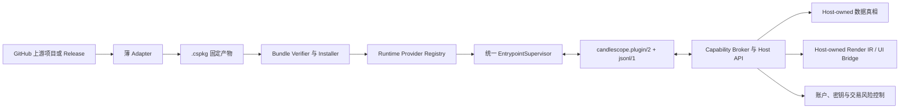

# CandleScope 多运行时与 GitHub 项目接入升级执行文档

> 状态：`IN_EXECUTION`（Phase 0～2 已完成；Phase 3～11 尚未交付）
> 基线：CandleScope `main`，2026-08-03 本地工作树
> 适用范围：Plugin Platform v2 后端、SDK、安装器、Supervisor、Plugin Manager 与 Marketplace
> 首个参考项目：[ta4j/ta4j](https://github.com/ta4j/ta4j)
> 本文是实施计划，不代表下述多运行时能力已经交付。

当前进度证据见 `docs/PLUGIN_PLATFORM_MULTI_RUNTIME_PHASE0_zh.md`、
`docs/PLUGIN_PLATFORM_MULTI_RUNTIME_PHASE1_zh.md` 和
`docs/PLUGIN_PLATFORM_MULTI_RUNTIME_PHASE2_zh.md`。只有明确标记完成并独立提交的阶段才
视为已交付；后续章节仍是计划，不是当前能力声明。

## 1. 决策摘要

CandleScope 应升级为“多运行时插件宿主”，让 Java、Python、Node.js、Rust、Go、C/C++ 和 WASM 项目通过薄适配层接入，而不是把第三方算法重写成 CandleScope 自有 Python 实现。

这次升级不应理解为“关闭安全限制”，而应拆成两个彼此独立的问题：

1. **执行兼容性**：Host 能否可靠安装、启动、探测、监督和回滚不同语言的产物；
2. **信任与能力**：用户愿意让该插件访问哪些文件、网络、账户、密钥和交易能力。

目标状态：

- 现有 schema-v2 Python 插件原样继续运行；
- 新增 manifest schema v3，用类型化 `runtime` 描述入口，不再硬编码 `pythonModule`；
- 继续复用 `candlescope.plugin/2`、`jsonl/1`、Capability Broker、Grant Store、Render IR、原子激活和回滚；
- 本地部署用户可显式选择 `trusted-local`，其执行限制接近普通本地应用；
- Marketplace 插件仍默认进入受限模式，并必须有固定产物、摘要、签名、许可证和供应链证据；
- 网络、文件、账户、密钥和交易权限分别授权；“信任本地代码”不等于自动授权真钱交易；
- ta4j 作为第一个 Java 参考插件，以稳定 Release JAR + CandleScope Java Adapter 运行。

不建议让 Python 插件自行 `subprocess java -jar ...`。这种临时桥接绕过 Host 的进程树管理、资源预算、探针、诊断、签名边界和回滚证据，后续会形成多个互不兼容的“套娃运行时”。

## 2. 当前仓库基线与真实阻塞点

### 2.1 已有能力

当前 Plugin Platform v2 已经具备可复用的主要基础设施：

- `.cspkg` 严格检查、固定 SHA-256、安装收据、隔离安装目录；
- 安装前 probe、`check`、enable/disable、原子 activation、rollback、quarantine；
- `EntrypointSupervisor` 负责 JSONL RPC、handshake、健康检查、取消、超时、退出和故障记录；
- `candlescope.plugin/2` 与 `candlescope.host-api/1`；
- Contributions 与 Host Capabilities 分离；
- Grant Store、权限 diff、显式 grant/deny/revoke；
- Windows AppContainer、Job Object、内存/CPU/磁盘/进程数/墙钟预算；
- Plugin Manager、Marketplace 信任证据和 Host-owned v1 compatibility。

因此，本项目不是重写插件平台，而是在现有平台中抽出“运行时提供器”这一缺失层。

### 2.2 当前硬限制

当前 manifest schema v2 的 backend entrypoint 必须包含：

```json
{
  "id": "main",
  "pythonModule": "some_package.runtime",
  "resourceProfile": "standard",
  "activationEvents": ["onCommand"]
}
```

相应限制分散在：

| 层 | 当前事实 | 升级要求 |
| --- | --- | --- |
| SDK model | `BackendEntrypoint.python_module` | 引入类型化 runtime descriptor |
| JSON Schema | entrypoint 必填 `pythonModule` | 新增 schema v3，保留 v2 |
| Bundle | 主要审计 wheels 与 web assets | 支持 JAR、native、Node、WASM 和 runtime assets |
| Installer | 创建 venv、安装 wheels、记录 module | 将安装过程委托给 Runtime Provider |
| Activation record | `executable + module + workingDirectory` | 记录规范化 launch descriptor 与 runtime identity |
| Core runtime | 固定 `-I -u -m <module>` | 从 Provider 获取 argv，不接受任意 shell 字符串 |
| Marketplace sandbox | 固定 pinned Python 目录 | 按 runtime kind 注入只读运行时根与策略 |

### 2.3 安全不是主要兼容阻塞

当前 `local-developer` 和 `local-trusted` 已映射到 `local-trusted` 执行，默认不会套用 verified-publisher 的 Windows AppContainer；verified-publisher 才走受限 Python 和 `maxProcesses=1`。

所以 ta4j 当前不能成为一等插件，主因不是“安全卡得太严”，而是 manifest、安装器和 Supervisor 启动命令仍是 Python 专用。应先解决类型化多运行时，再改善信任选择与界面说明。

## 3. 目标、非目标与成功标准

### 3.1 产品目标

完成后，插件作者应能：

1. 选择 `python-module`、`java-jar`、`native-executable`、`node-module` 或 `wasm-component`；
2. 使用对应语言 SDK 或直接实现语言无关 JSONL transcript；
3. 将固定产物、许可证和 SBOM 打入 `.cspkg`；
4. 本地 `inspect -> install -> grant -> enable -> check`；
5. 在 Plugin Manager 查看运行时、信任模式、产物摘要、资源占用和崩溃诊断；
6. 更新后原子切换，失败可回滚到精确上一版本；
7. 不需要把第三方库的核心算法复制或翻译进 CandleScope。

### 3.2 非目标

以下能力不属于本轮自动承诺：

- 输入任意 GitHub URL 后自动编译并运行仓库默认分支；
- 执行第三方仓库提供的任意 shell、Gradle、Maven、npm、Make 或安装脚本；
- 直接把完整桌面 GUI 嵌入 CandleScope；
- 允许插件导入 `backend/app/*`、直接连接 CandleScope SQLite、注入宿主 React/DOM；
- 把“用户自己部署”解释为自动开放密钥、账户和实盘交易；
- 在没有许可证权利时重新分发上游二进制或源码；
- 为所有 OS 宣称同等级沙箱；未验证的平台必须明确标为 `trusted-local only`；
- 让 Marketplace 在用户机器上从源码编译作为静默 fallback。

### 3.3 总体成功标准

只有同时满足以下条件，才能称为“很容易支持 GitHub 项目”：

- 接入一个有稳定公共 API 的纯算法库，Adapter 目标不超过约 500 行业务映射代码；
- Adapter 不复制上游核心算法；
- 相同 `.cspkg` 在全新进程重复安装得到相同摘要和语义结果；
- Python v2 插件的 manifest、安装、激活、wire 和回滚回归不变；
- 每种 runtime 都通过语言无关 conformance transcript；
- 插件崩溃、卡死、输出超限、协议违规和取消时 Host 不崩溃；
- 本地信任模式是显式用户动作，Marketplace 不能静默升级为本地信任；
- 权限升级、runtime kind 变化、publisher 变化必须重新确认；
- ta4j 参考插件能在同一时点 K 线输入上稳定产出规范化结果与 Render IR。

## 4. 目标架构



### 4.1 不变的 Host 边界

无论插件是否可信、使用何种语言，以下职责继续由 CandleScope Host 持有：

- 市场数据的来源、时间口径、分页和流式订阅；
- 插件生命周期、generation、健康、取消、重启和熔断；
- 图表 Render IR、UI slot 和 sandbox view；
- settings、private storage、用户文件选择；
- 权限声明、授权、租约、撤销和审计；
- 账户、订单、确认令牌、kill switch 和 Paper/Live 隔离；
- 安装、签名、摘要、激活、升级和回滚。

这不仅是安全边界，也是兼容边界。若插件直接依赖 CandleScope 内部数据库或 DOM，宿主一次重构就可能破坏整个生态。

### 4.2 新增 Runtime Provider 层

在 `backend/app/plugin_core_v2/runtime_providers/` 新增内部接口。接口名称可在 Phase 0 RFC 中调整，但职责必须稳定：

```python
class RuntimeProvider(Protocol):
    kind: str

    def validate_manifest(
        self,
        entrypoint: NormalizedEntrypoint,
        bundle: VerifiedPlatformBundle,
    ) -> None: ...

    def prepare_installation(
        self,
        entrypoint: NormalizedEntrypoint,
        bundle: VerifiedPlatformBundle,
        installation: Path,
    ) -> PreparedRuntime: ...

    def build_probe_launch(
        self,
        prepared: PreparedRuntime,
        trust: ExecutionTrust,
    ) -> PreparedLaunch: ...

    def build_runtime_launch(
        self,
        prepared: PreparedRuntime,
        trust: ExecutionTrust,
    ) -> PreparedLaunch: ...

    def verify_installation(
        self,
        prepared: PreparedRuntime,
        receipt: RuntimeReceipt,
    ) -> None: ...

    def cleanup(self, prepared: PreparedRuntime) -> None: ...
```

`PreparedLaunch` 至少包含：

- 可执行文件绝对路径；
- argv 数组；
- 工作目录；
- 经过白名单过滤的环境变量；
- runtime identity 与摘要；
- 只读 runtime roots；
- 资源预算和可选 sandbox policy；
- 允许的子进程数；
- 诊断用 display command（只展示，不参与执行）。

严禁把 `command: "java -jar ..."` 作为一整段 shell 字符串。Host 必须直接创建进程并传 argv，避免 shell 解释、路径注入和不可审计的二次启动。

## 5. Manifest schema v3

### 5.1 版本策略

- `schemaVersion: 2` 保持冻结，现有 `pythonModule` manifest 不改；
- 新功能使用 `schemaVersion: 3`；
- 平台 wire 仍使用 `candlescope.plugin/2`，因为消息语义没有因启动语言变化；
- Host 将 v2 入口规范化为内部 `python-module` descriptor；
- v2 至少保留两个稳定 Release 周期，并在删除前单独 RFC；
- 不把 v1 `script-runtime/1` compatibility 转换为 v3 activation。

### 5.2 Java 插件示例

```json
{
  "schemaVersion": 3,
  "plugin": {
    "id": "io.candlescope.ta4j-elliott",
    "name": "ta4j Elliott Wave",
    "version": "0.1.0",
    "publisher": "CandleScope Contributors",
    "license": "MIT",
    "engines": {
      "candlescope": ">=0.1.0"
    }
  },
  "backend": {
    "entrypoints": [
      {
        "id": "main",
        "runtime": {
          "kind": "java-jar",
          "artifact": "runtime/ta4j-elliott-adapter.jar",
          "runtimeId": "temurin-25",
          "mainClass": "io.candlescope.ta4j.Main",
          "jvmArgs": ["-Xms32m", "-Xmx256m"]
        },
        "transport": "jsonl/1",
        "resourceProfile": "standard",
        "activationEvents": ["onCommand"]
      }
    ]
  },
  "contributions": [],
  "permissions": {
    "required": [],
    "optional": []
  },
  "probes": [
    {
      "id": "control",
      "kind": "controlTranscript",
      "entrypoint": "main",
      "fixture": "probes/control.json"
    }
  ]
}
```

示例只表达结构，不是已经发布的 manifest。许可证字段必须根据 Adapter 自身和所打包依赖的真实许可证审计结果填写。

### 5.3 Runtime kind 的冻结字段

| kind | 必填字段 | 可选字段 | 第一阶段状态 |
| --- | --- | --- | --- |
| `python-module` | `module`、`runtimeId` | interpreter args | 兼容现有能力 |
| `native-executable` | `artifact` | args、platform、arch | 最先新增 |
| `java-jar` | `artifact`、`runtimeId`、`mainClass` | JVM args | ta4j 所需 |
| `node-module` | `artifact`、`runtimeId` | node args | Java 稳定后 |
| `wasm-component` | `artifact`、`runtimeId`、`export` | WASI profile | 后置 |

字段规则：

- `artifact` 必须是 bundle 内相对路径，不能有 `..`、盘符、绝对路径或 symlink；
- `runtimeId` 必须来自 Host 管理的 Runtime Registry；
- args 必须是字符串数组，并有长度、项数和字符边界；
- 不能声明 shell、PowerShell、cmd.exe、bash 或脚本拼接；
- native artifact 必须声明 OS/arch；安装时不匹配则 fail closed；
- runtime kind、runtimeId、artifact digest 进入 activation identity；
- 任一字段变化都必须重新 probe；
- runtime kind 或 publisher 变化按高风险升级处理，不能继承旧授权。

## 6. Bundle v3 与 Runtime Registry

### 6.1 Bundle 内容

`bundle.json` 继续作为 Host-owned 安装元数据，并扩展不可变 artifact inventory：

```json
{
  "schemaVersion": 3,
  "artifacts": [
    {
      "path": "runtime/ta4j-elliott-adapter.jar",
      "role": "java-jar",
      "sha256": "sha256:<64-hex>",
      "size": 1234567,
      "os": ["windows", "linux", "macos"],
      "arch": ["x86_64", "arm64"]
    },
    {
      "path": "licenses/THIRD_PARTY_NOTICES.txt",
      "role": "license-notice",
      "sha256": "sha256:<64-hex>",
      "size": 12345
    },
    {
      "path": "sbom/cyclonedx.json",
      "role": "sbom",
      "sha256": "sha256:<64-hex>",
      "size": 23456
    }
  ]
}
```

安装器必须逐文件验证声明、摘要、大小、压缩比、重复路径、大小写碰撞、symlink 和解压后总量。未声明 executable/JAR/JS/WASM 不得被入口引用。

### 6.2 Managed Runtime Registry

新增 `backend/app/plugin_runtime_registry_v3/` 或在 Phase 0 决定等价目录，存放 Host 固定的运行时清单：

```json
{
  "schemaVersion": 1,
  "runtimes": [
    {
      "id": "temurin-25",
      "kind": "java",
      "version": "25.0.x",
      "os": "windows",
      "arch": "x86_64",
      "url": "https://<approved-release-asset>",
      "sha256": "sha256:<64-hex>",
      "size": 123456789,
      "license": "GPL-2.0-with-classpath-exception",
      "probe": ["bin/java.exe", "-version"]
    }
  ]
}
```

执行规则：

1. 只允许由 CandleScope Release 固定的 URL、SHA-256、size、license、OS 和 arch；
2. 第一次按需下载，下载到 staging，验证后原子进入 cache；
3. quick repeat 必须命中相同 cache，不能重新下载；
4. 离线且 cache 命中时可运行；
5. 离线且 cache 缺失时返回明确错误，不回退到系统 Java/Node；
6. Marketplace 不允许静默源码编译；
7. `developer-local` 可显式选择系统 runtime，但必须记录绝对路径、版本 probe 和“不可复现”标签；
8. runtime cache 与 plugin installation 分开引用计数，回滚插件不能误删共享 runtime；
9. Runtime Registry 更新必须签名并可撤销；
10. 运行时许可证与第三方 notices 随发行物审计。

## 7. 信任模式与“放宽限制”

### 7.1 模式定义

| 模式 | 适用来源 | 进程隔离 | runtime 来源 | 默认能力 | 用户提示 |
| --- | --- | --- | --- | --- | --- |
| `first-party-pinned` | CandleScope 随包组件 | 按发行策略 | Host 固定 | 仍按 capability | 官方组件 |
| `marketplace-sandboxed` | 已签名 Marketplace | 必须支持的平台沙箱 | Host 固定 | 最小权限 | 已验证发布者，不等于无风险 |
| `trusted-local` | 用户本地安装并明确确认 | 可不启用 AppContainer，但仍受 Supervisor 管理 | 固定或显式系统 runtime | 仅声明且授权的 Host API | 等同运行本地应用代码 |
| `developer-local` | 源码开发、热更新 | 可关闭隔离 | 可用系统 runtime | 开发权限，单独 profile | 不可复现，不可发布 |
| `ui-only-untrusted` | 纯前端内容 | opaque-origin iframe | 无后端 runtime | UI bridge 最小集合 | 无本地后端执行 |

为了兼容当前命名，实现时需要写一次信任迁移 RFC：现有 `verified-publisher` 可映射到 `marketplace-sandboxed`；`local-trusted` 和 `local-developer` 保持兼容 alias，不能直接改坏已有 activation。

### 7.2 本地信任可以放宽什么

`trusted-local` 可允许用户逐项选择：

- 更高的内存、CPU、墙钟和进程数预算；
- 直接网络访问；
- 用户选择目录后的宽文件访问；
- 调用本机 GPU 或本地模型；
- 启动声明过的辅助进程；
- 使用系统安装的 JDK/Node（标为不可复现）。

但以下仍不能因 `trusted-local` 自动获得：

- CandleScope 数据库连接；
- 未经 Host API 的账户/密钥读取；
- 实盘下单；
- 关闭 kill switch 或绕过确认令牌；
- 向宿主 DOM 注入脚本；
- 修改其他插件目录、Host 安装目录或 Runtime Registry；
- 不经用户动作扩大升级后的权限。

### 7.3 进程数策略

ta4j 本身不需要子进程，`java-jar` 参考插件应保持 `maxProcesses=1`。Node、浏览器驱动、模型服务等确需辅助进程时：

1. manifest 声明 `processModel`；
2. Provider 给出最大进程数；
3. Plugin Manager 展示原因；
4. Marketplace 有按 runtime kind 审核的硬上限；
5. `trusted-local` 可由用户提高，但仍由 Job Object 或等价机制管理整个进程树；
6. 插件退出、disable、rollback 和 Host 关闭时，子进程必须一并清理。

## 8. GitHub 项目兼容分类

不能把“GitHub 仓库”直接等同于“插件”。接入前先分类：

| 项目类型 | 推荐接入方式 | 难度 | 示例形态 |
| --- | --- | --- | --- |
| 纯库/SDK | 薄 Adapter 调公共 API | 低 | ta4j、Rust crate、npm package |
| 已有 CLI，支持 stdin/stdout JSON | 协议桥接或直接实现 transcript | 低到中 | 计算器、扫描器 |
| 本地服务/daemon | managed service adapter + health/lifecycle | 中 | 模型推理服务 |
| Web UI 项目 | 静态 assets + sandbox view + UI bridge | 中 | 面板、报表 |
| 完整桌面 GUI | 只暴露命令/结果或外部启动，不宣称嵌入 | 高 | Qt/Electron 桌面软件 |
| 需要内核驱动/系统服务 | 默认不作为 Marketplace 插件 | 极高 | 抓包、硬件驱动 |
| 无稳定 API、只有源码脚本 | 先为上游做稳定 Adapter API | 高 | 研究代码、notebook |

### 8.1 接入评估表

每个候选 GitHub 项目都必须新增 `docs/plugin-adapters/<project>-assessment.md`，至少回答：

- 固定的仓库、tag、commit、Release asset 和摘要是什么；
- 许可证是否允许使用、修改和重新分发，依赖许可证是否兼容；
- 是否有稳定公共 API，还是只能依赖内部类/CLI；
- 输入输出如何映射到 CandleScope schema；
- 是否需要网络、文件、数据库、环境变量、密钥、GPU 或子进程；
- 是否含 native library，支持哪些 OS/arch；
- 是否能离线、确定性运行；
- 冷启动、热调用、峰值内存和输出规模；
- 线程安全、实例隔离和取消语义；
- 升级频率和 breaking change 策略；
- 是否提供预构建产物；若没有，谁负责可复现构建；
- Adapter 预计代码量与测试语料；
- 能否在 Marketplace 沙箱运行；若不能，是否只支持 `trusted-local`；
- 需要哪些 Contributions 与 Host Capabilities；
- 失败时如何诊断和回滚。

评估命令只允许读取仓库元数据、Release manifest 和许可证；不得在 assessment 阶段执行第三方构建脚本。

### 8.2 单个 GitHub 项目的标准接入流程

每个项目都按同一顺序执行，不为 ta4j 另开旁路：

1. **固定来源**：选择稳定 tag/commit 和 Release asset，记录 SHA-256；
2. **审计权利**：确认项目及传递依赖的使用、修改、链接和重新分发条件；
3. **分类项目**：纯库、CLI、service、Web UI、桌面 GUI 或系统组件；
4. **选择 runtime kind**：优先直接使用上游语言；不要为了 Host 当前只支持 Python 而重写算法；
5. **定义边界**：写清 CandleScope 输入、上游 API 调用、规范输出、Render IR 与所需 capabilities；
6. **冻结 golden corpus**：使用逐时点输入、异常输入和取消样本；
7. **实现薄 Adapter**：仅做协议和数据模型转换，不复制上游核心逻辑；
8. **跑 conformance**：先通过语言无关 transcript，再运行项目业务测试；
9. **生成供应链材料**：固定产物、SBOM、licenses、notices 和 build receipt；
10. **构建并 inspect**：生成确定性 `.cspkg`，验证路径、摘要、OS/arch、runtimeId 和 probe；
11. **本地验证**：依次执行 fresh install、grant、enable、semantic probe、quick repeat、update 和 rollback；
12. **选择信任级别**：先以 `trusted-local` 验证；只有沙箱、签名和供应链门禁通过后才进入 Marketplace；
13. **对照现有能力**：若替换既有插件，先并行输出能力矩阵和 point-in-time 分歧报告；
14. **分阶段发布**：internal -> opted-in local -> preview -> stable；
15. **持续升级**：上游每次版本更新都是独立审计和 PR，不自动跟随默认分支。

任一步缺少固定产物、许可证权利、稳定 API 或可验证输出时，应停在 assessment/preview，而不是通过扩大 Host 权限掩盖项目本身不可集成的问题。

## 9. 逐阶段实施计划

### Phase 0：冻结基线与 RFC

**目标**

在不改运行行为的前提下，冻结现有 v2 Python 契约、性能和回滚证据，并确认 schema v3 的字段与迁移规则。

**实施步骤**

1. 新增 `docs/PLUGIN_PLATFORM_MULTI_RUNTIME_PHASE0_zh.md`；
2. 记录当前 v2 manifest schema 与 canonical digest；
3. 固定 reference Python plugin 的 bundle、install、probe、activation、wire 和 rollback fixtures；
4. 增加“v2 manifest -> NormalizedEntrypoint”设计，不在本阶段提交实现；
5. 冻结 runtime kinds、artifact roles、trust aliases 和错误码命名；
6. 记录 ta4j 的固定 Release/tag、JDK 要求、许可证和 Adapter 输入输出；
7. 给每个后续 runtime 设置默认关闭开关；
8. 记录 Windows 当前可验证范围；Linux/macOS 不得从设计推断为已验证。

**建议开关**

```text
CANDLESCOPE_PLUGIN_MULTI_RUNTIME_ENABLED=0
CANDLESCOPE_PLUGIN_RUNTIME_NATIVE_ENABLED=0
CANDLESCOPE_PLUGIN_RUNTIME_JAVA_ENABLED=0
CANDLESCOPE_PLUGIN_RUNTIME_NODE_ENABLED=0
CANDLESCOPE_PLUGIN_RUNTIME_WASM_ENABLED=0
CANDLESCOPE_PLUGIN_GITHUB_IMPORT_ENABLED=0
```

**验证**

```powershell
Push-Location backend
.\.venv\Scripts\python.exe -m pytest tests/test_plugin_bundle_v2.py tests/test_plugin_installer_v2.py tests/test_plugin_core_v2.py tests/test_plugin_runtime_supervisor.py tests/test_plugin_platform_phase13_gate.py -q
Pop-Location

Push-Location frontend
npm run check:plugins
npm run typecheck
Pop-Location
```

**退出门**

- RFC 被确认；
- v2 frozen fixture 可重复生成且 digest 一致；
- 所有新开关默认 `0`；
- 没有运行时代码行为变化。

**回滚**

仅删除 Phase 0 文档、fixtures 和未启用开关；现有 v2 不受影响。

---

### Phase 1：schema v3 与规范化模型（已完成）

**目标**

让 SDK、schema、bundle parser 和 activation model 能表达多运行时，但仍不实际启动非 Python 入口。

**主要文件**

- `packages/candlescope-plugin-sdk/src/candlescope_plugin_sdk/platform_v2/constants.py`
- `packages/candlescope-plugin-sdk/src/candlescope_plugin_sdk/platform_v2/models.py`
- `packages/candlescope-plugin-sdk/src/candlescope_plugin_sdk/platform_v2/schema.py`
- `packages/candlescope-plugin-sdk/src/candlescope_plugin_sdk/platform_v2/schemas/manifest-v3.schema.json`
- `backend/app/plugin_installer_v2/bundle.py`
- `backend/app/plugin_installer_v2/registry.py`
- 对应 SDK/backend tests 与 fixtures

**实施步骤**

1. 新增 `MANIFEST_SCHEMA_VERSION_V3 = 3`，保留 v2 常量和 schema；
2. 新增 `RuntimeEntrypoint`、各 runtime descriptor 和严格 `oneOf`；
3. 新增内部 `NormalizedEntrypoint`：
   - v2 `pythonModule` 规范化为 `python-module`；
   - v3 原样规范化；
4. 扩展 bundle artifact inventory；
5. activation record 新版本记录 `runtimeKind`、`runtimeId`、`artifactSha256` 和 typed launch data；
6. Registry loader 同时读取旧 activation；写新 activation 时使用新版本；
7. 对未知 kind、未知字段、重复 artifact、路径逃逸和 OS/arch 不匹配 fail closed；
8. `candlescope.plugin/2` transcript 不变。

**验证**

- SDK v2 fixtures digest 不变；
- v3 每个 kind 各有合法和非法 fixture；
- v2/v3 round-trip；
- old activation load + new activation write；
- canonical JSON、重复键、NaN、路径、symlink、压缩炸弹回归；
- `CANDLESCOPE_PLUGIN_MULTI_RUNTIME_ENABLED=0` 时 v3 非 Python install 返回稳定的“功能关闭”错误。

```powershell
$backendPy = (Resolve-Path backend/.venv/Scripts/python.exe).Path
Push-Location packages/candlescope-plugin-sdk
& $backendPy -m ruff check .
& $backendPy -m ruff format --check .
& $backendPy -m pytest -q
Pop-Location

Push-Location backend
.\.venv\Scripts\python.exe -m pytest tests/test_plugin_bundle_v2.py tests/test_plugin_installer_v2.py tests/test_plugin_installer_v2_architecture.py -q
Pop-Location
```

**退出门**

- v3 能被严格解析、检查和 inspect；
- 非 Python 仍不能启动；
- v2 manifest/activation 全部回归通过；
- activation migration 有正反测试。

**回滚**

关闭 multi-runtime 开关后只接受 v2；保留只读解析新 activation 的能力，以便安全回滚，不直接删除用户状态。

**完成证据**

见 `docs/PLUGIN_PLATFORM_MULTI_RUNTIME_PHASE1_zh.md`。Phase 1 只交付严格表达、build/inspect、
activation 迁移和默认关闭边界；Runtime Provider 数量仍为 `0`，不能据此宣称 Java、native、
Node 或 WASM 已可安装运行。

---

### Phase 2：Runtime Provider seam 与 Python 等价迁移（已完成）

**目标**

先把现有 Python 启动完整迁移到 `PythonModuleProvider`，证明抽象没有改变行为，再添加新语言。

**主要文件**

- 新增 `backend/app/plugin_core_v2/runtime_providers/base.py`
- 新增 `backend/app/plugin_core_v2/runtime_providers/python.py`
- 新增 `backend/app/plugin_core_v2/runtime_providers/registry.py`
- `backend/app/plugin_core_v2/runtime.py`
- `backend/app/plugin_host/supervisor.py`
- `backend/app/plugin_installer_v2/installer.py`
- `backend/app/plugin_installer_v2/probe_runner.py`

**实施步骤**

1. 定义 Provider 与 `PreparedLaunch`；
2. 将当前 `-I -u -m`、pinned Python、site-packages 和 probe 逻辑移动到 Python Provider；
3. Core 仅按 `runtimeKind` 查 Provider；
4. Supervisor 继续接收 executable + argv，不感知语言；
5. 安装收据绑定 Provider version 与 runtime identity；
6. Provider Registry 对重复 kind、未知 Provider 和版本不兼容 fail closed；
7. 保留旧 Python 路径 behind rollback flag，直到本阶段退出；
8. 做同 bundle 双路径等价测试：descriptor、wire、Render IR、错误码和 stderr redaction 一致。

**验证**

- 现有 Python reference plugins 全通过；
- install/check/quick-repeat/fresh-process probe/rollback 全通过；
- crash、hang、cancel、stale generation、oversized JSON、invalid UTF-8 全通过；
- pinned Python sandbox 仍为同一只读 runtime 与 site-packages；
- Host 关闭后无残留 Python 进程。

**退出门**

- Python Provider 成为默认路径；
- 旧路径和 Provider 路径语义等价；
- 后端全量插件测试无新增失败；
- 运行时启动延迟和内存没有超过 Phase 0 约定阈值。

**回滚**

用内部 rollback flag 切回旧 Python launch path；不修改 manifest、bundle 或用户授权。

**完成证据**

见 `docs/PLUGIN_PLATFORM_MULTI_RUNTIME_PHASE2_zh.md`。Phase 2 已交付 Provider API、
`PythonModuleProvider 1.0.0`、receipt runtime binding、v2 双路径等价门和 v3 Python 完整
生命周期；多运行时总开关仍默认关闭，native、Java、Node 和 WASM Provider 数量仍为 `0`。

---

### Phase 3：`native-executable` Provider

**目标**

先支持无需额外解释器的 Rust/Go/C/C++ 单文件可执行产物，验证 Provider 架构和跨语言 transcript。

**实施步骤**

1. 新增 `NativeExecutableProvider`；
2. artifact 必须在 bundle inventory 中，安装后再校验摘要和可执行类型；
3. 仅允许 Host 直接启动声明的 artifact；
4. 禁止脚本扩展名、shell interpreter 和未声明 DLL 搜索路径；
5. Windows 将整个进程树放入 Job Object；
6. 新增一个最小 Rust 或 Go reference plugin，只实现 handshake/describe/activate/invoke/health/shutdown；
7. 复用相同 protocol conformance fixtures；
8. 在 `trusted-local` 与受限 Windows profile 分别验证。

**验证**

- OS/arch 不匹配拒绝；
- artifact 篡改后 `check` 失败；
- executable 启动失败、崩溃、卡死和输出污染可诊断；
- stdout 只能是协议，日志只能走 stderr；
- disable/rollback/Host stop 后无残留进程树；
- 受限模式不允许加载 bundle 外的未声明二进制。

**退出门**

- reference native plugin 通过完整 transcript；
- 多运行时开关关闭时行为等同 Phase 2；
- Windows sandbox 与 trusted-local 两条路径都有真实进程证据。

**回滚**

关闭 `CANDLESCOPE_PLUGIN_RUNTIME_NATIVE_ENABLED`；已有 native activation 显示“runtime disabled”，不得自动改用别的 executable。

---

### Phase 4：Managed Runtime Registry

**目标**

为 Java、Node 和 WASM 提供固定、可缓存、可审计的 Host-managed runtime。

**实施步骤**

1. 定义并签名 Runtime Registry schema；
2. 实现 download staging、SHA-256/size/license/OS/arch 验证和原子 cache；
3. 运行 fresh-process version probe；
4. 实现 quick repeat、离线 cache hit、cache corruption quarantine；
5. activation 收据记录 runtime registry revision 和 runtime digest；
6. 实现共享 runtime 引用计数与安全清理；
7. Plugin Manager 展示 runtime id、版本、来源、大小和验证状态；
8. developer-local 增加“使用系统 runtime”显式入口，记录不可复现状态。

**验证**

- 首次安装、快速重复、断网 cache hit；
- 下载中断、摘要错误、大小错误、解压错误和磁盘不足；
- Registry 回滚与 runtime 撤销；
- 两个插件共享 runtime，回滚其中一个不破坏另一个；
- 不存在自动源码编译或系统 runtime fallback。

**退出门**

- 至少一个固定 JRE 在干净目录安装并通过 fresh-process probe；
- 供应链证据和许可证清单齐全；
- 缓存损坏可隔离恢复；
- Runtime Registry 默认不开启网络更新。

**回滚**

回滚 Registry revision；已有已验证 runtime cache 保留只读，不删除仍被 activation 引用的版本。

---

### Phase 5：`java-jar` Provider、Java SDK 与 ta4j 参考插件

**目标**

让 ta4j 以原生 Java 库运行，证明 CandleScope 可以复用优秀上游项目而不重写核心算法。

**主要产物**

- `packages/candlescope-plugin-sdk-java/`
- `backend/app/plugin_core_v2/runtime_providers/java.py`
- `examples/plugins/ta4j-elliott-adapter/` 或独立参考仓库
- `docs/plugin-adapters/ta4j-assessment.md`
- 固定 Release JAR、Adapter JAR、SBOM、licenses 与 transcript

**Java SDK 最小范围**

- strict JSONL codec；
- handshake/describe/activate/invoke/healthCheck/cancel/deactivate/shutdown；
- Host call correlation；
- generation 与 request id 验证；
- 消息大小、深度、容器项和字符串边界；
- stdout 协议隔离、stderr 日志；
- graceful shutdown 与取消。

**ta4j Adapter 数据映射**

1. Host 通过 market capability 提供 point-in-time OHLCV；
2. Adapter 转换为 ta4j `BarSeries`；
3. settings 映射到上游公开 Elliott API；
4. 上游结果转换为 CandleScope 规范结果：
   - scenario id；
   - wave degree；
   - pivot 时间、价格、索引；
   - pattern/type；
   - invalidation；
   - confidence/score（只有上游有可信语义时才提供）；
   - warnings 与 provenance；
5. 图形输出转换为 Host-owned Render IR；
6. Adapter 不自行下载 K 线，不访问 CandleScope DB；
7. 固定上游版本，不跟随 GitHub 默认分支；
8. 上游升级独立 PR，必须跑同一 golden corpus。

**与现有 Python Elliott 插件的关系**

本阶段不是立刻删除或替换现有 Python 引擎。两者先作为独立插件并行：

- 使用同一组冻结、逐时点输入；
- 比较 pivot、pattern、invalidation、warning、耗时和失败样本；
- 不用最终走势反向校准决策时结果；
- 明确各自支持矩阵，不能仅凭代码量决定替换；
- 只有产品结果和运行稳定性达到单独迁移门，才讨论默认引擎。

**验证**

- Java conformance transcript；
- JAR/Main-Class/runtimeId/摘要错误负例；
- Unicode、Decimal/双精度边界、时间戳、空数据和超长序列；
- 冷启动、热调用、100 次重复调用和取消；
- 同输入同输出 canonical digest；
- JVM crash、OOM、hang、stderr flood；
- ta4j golden corpus 与当前 Python plugin 对照报告；
- fresh install、quick repeat、fresh-process semantic probe、update、rollback；
- Host 退出无残留 `java.exe`。

**退出门**

- ta4j Adapter 不复制上游 Elliott 算法；
- stable Release 与依赖全部固定；
- Adapter 与 SDK 有独立测试；
- Java runtime 默认仍可由开关关闭；
- Plugin Manager 能清楚显示 Java、JRE 版本、信任模式和上游来源。

**回滚**

关闭 `CANDLESCOPE_PLUGIN_RUNTIME_JAVA_ENABLED` 或回滚 ta4j activation；Python 插件与平台 v2 不受影响。

---

### Phase 6：信任模式、授权 UX 与多运行时沙箱

**目标**

把“用户愿意放宽限制”变成清楚、可撤销、可审计的产品选择。

**实施步骤**

1. 冻结 trust alias migration；
2. Plugin Manager 安装页展示：
   - 代码来源/publisher；
   - runtime kind/id；
   - 是否 Host-managed；
   - sandbox 状态；
   - 网络、文件、密钥、账户、交易和子进程请求；
3. 增加 `trusted-local` 二次确认，不用笼统“我知道风险”替代明细；
4. 权限 diff 与 runtime diff 同屏展示；
5. runtime kind、publisher、签名根或系统 runtime 路径变化时撤销继承；
6. 为 Java/Node/native 定义受限 profile；
7. 对无法提供等价沙箱的平台标注 `trusted-local only`；
8. audit log 记录谁、何时、为何改变信任和权限；
9. 继续独立保护账户、密钥和 Live authority。

**验证**

- Marketplace 不能调用本地信任 API 静默提权；
- CSRF/origin/user-action guard 回归；
- grant/revoke 立即影响 capability lease；
- trusted-local -> sandboxed 降级会终止旧进程并新建 generation；
- runtime/publisher 变化后旧 grant 不生效；
- UI 不把“verified publisher”展示为“安全”或“官方”；
- Windows sandbox attack probes 对每个支持 kind 逐项执行。

**退出门**

- 用户能准确知道运行了什么和开放了什么；
- 所有提权都可撤销并有审计；
- 实盘相关开关默认 `0` 且未因多运行时改造被放宽。

**回滚**

禁用新 trust UX 后保持现有 `local-trusted`/`verified-publisher` 行为；不得丢失或错误扩大授权记录。

---

### Phase 7：`node-module` Provider 与 TypeScript SDK

**目标**

支持 npm 生态中的算法库、数据工具和本地服务。

**实施步骤**

1. 固定 Host-managed Node runtime；
2. 插件产物必须预先 bundle，Marketplace 不在用户机器执行 `npm install`；
3. 禁止生命周期脚本和动态 package manager；
4. 新增 TypeScript SDK、严格 JSONL server 和 reference plugin；
5. 明确 ESM/CJS 只支持一种首发模式；
6. 将 worker/child process 纳入声明和 Job Object；
7. 限制 module resolution 在安装目录和固定 runtime；
8. 记录 source map 作为可选诊断 artifact，不泄漏本机路径。

**验证与退出门**

- 离线安装运行；
- 不读取用户全局 npm cache；
- 不执行 postinstall；
- conformance、崩溃、取消、进程树和回滚通过；
- Node SDK package 有固定 tarball、摘要和 package smoke。

**回滚**

关闭 `CANDLESCOPE_PLUGIN_RUNTIME_NODE_ENABLED`，不影响其他 kind。

---

### Phase 8：`wasm-component` Provider

**目标**

为适合 WASM 的纯计算项目提供高可移植、默认最小能力的路径。

**实施步骤**

1. 固定 WASM runtime 与组件模型版本；
2. 定义最小 WASI profile，默认无网络、无任意文件；
3. Host calls 通过显式 imports 或 JSONL bridge；
4. fuel、memory、wall time 和输出上限由 Host 管理；
5. 新增 Rust-to-WASM reference plugin；
6. 不在首版支持任意 WASI preview 混用。

**退出门**

- Windows/Linux 至少在真实构建上验证；未验证 OS 不宣称支持；
- 相同 module digest 和输入产生一致 canonical output；
- fuel exhaustion、trap、OOM 和 cancel 可诊断；
- WASM 权限模型不回退到 trusted-local 的宽本地访问。

**回滚**

关闭 `CANDLESCOPE_PLUGIN_RUNTIME_WASM_ENABLED`。

---

### Phase 9：GitHub 接入助手与 Adapter 模板

**目标**

把接入流程产品化，但不自动执行不可信仓库。

**CLI 提案**

```powershell
backend\.venv\Scripts\python.exe backend\scripts\candlescope_plugin.py v3 assess-github https://github.com/ta4j/ta4j --tag 0.23.0 --output docs/plugin-adapters/ta4j-assessment.md

backend\.venv\Scripts\python.exe backend\scripts\candlescope_plugin.py v3 scaffold-adapter java-jar --id io.candlescope.ta4j-elliott --output examples/plugins/ta4j-elliott-adapter

backend\.venv\Scripts\python.exe backend\scripts\candlescope_plugin.py v3 build examples/plugins/ta4j-elliott-adapter dist/ta4j-elliott.cspkg
```

命令名称是目标接口，Phase 9 实现前不可当作现有命令运行。

**assessment 行为边界**

- 读取仓库 URL、tag、commit、Release asset、语言、许可证和包元数据；
- 生成待人工填写的兼容评估；
- 不 clone 后自动运行构建；
- 不执行仓库 workflow、install script 或二进制；
- 不把默认分支当固定依赖；
- URL import 必须由用户确认固定 tag/commit 和 artifact digest。

**模板**

- Java library Adapter；
- native CLI Adapter；
- Node library Adapter；
- WASM computation Adapter；
- service Adapter；
- sandbox view；
- conformance fixtures、SBOM、licenses、build receipt 和 CI workflow。

**退出门**

- 使用模板接入第二个非 ta4j 项目；
- 从 assessment 到本地 install 的人工步骤可由新贡献者复现；
- 生成器不写 Host 内部 import；
- 未确认的 GitHub 内容永不进入执行路径。

**回滚**

关闭 `CANDLESCOPE_PLUGIN_GITHUB_IMPORT_ENABLED`；模板和已构建 `.cspkg` 不依赖该助手运行。

---

### Phase 10：Marketplace 多运行时供应链

**目标**

在本地多运行时稳定后，才允许 Marketplace 分发。

**实施步骤**

1. Marketplace release model 加入 runtime kinds、artifact digests、SBOM 和 licenses；
2. 每个 OS/arch 产物独立签名并绑定 release；
3. 发布者身份、runtime registry revision 和 plugin artifact 同时进入信任证据；
4. 增加撤销、恶意版本隔离和最低 Host 版本；
5. 审核规则拒绝源码编译、系统 runtime fallback 和未声明下载；
6. staged rollout：internal -> opted-in local -> Marketplace preview -> stable；
7. telemetry 只收集用户允许的匿名稳定性指标，不上传策略输入、账户或插件私有数据；
8. Marketplace 页面明确区分“发布者已验证”“沙箱可用”“权限范围”和“官方维护”。

**退出门**

- Java 与 native 至少各一个签名 reference release；
- fresh machine、offline repeat、update、rollback、revocation 全通过；
- 所有 runtime artifact 有来源、摘要、许可证和重建说明；
- Marketplace flag 默认仍为现有受控值，不因本项目自动开启。

**回滚**

撤销 Marketplace release 或 runtime registry revision；本地可信插件继续由用户管理，不混用 Marketplace 信任。

---

### Phase 11：GA 门禁、故障注入与文档

**目标**

完成真实端到端验收，并把“支持范围”写成可核查矩阵。

**必须运行的门禁**

1. backend 全量测试；
2. SDK Python、Java、TypeScript、WASM 各自 lint/test/build/package smoke；
3. frontend `npm run check`；
4. 每种 runtime 的 conformance transcript；
5. fresh install、quick repeat、fresh process、update、rollback；
6. crash/hang/cancel/stale generation/network loss/disk full/cache corruption；
7. Windows sandbox 与 trusted-local 真实进程；
8. production build headed Chromium Plugin Manager 流程；
9. ta4j point-in-time corpus 与性能报告；
10. 4 小时多插件 soak；
11. rollback drill：所有新开关为 `0` 后，v2 Python 和 v1 compatibility 仍可用；
12. no-plugin、v1-only、v2-Python-only 和 multi-runtime 四种启动矩阵。

**发布文档**

- 作者指南：如何选择 runtime kind；
- 用户指南：如何理解 trusted-local；
- GitHub 接入指南；
- runtime compatibility matrix；
- Marketplace 发布清单；
- ta4j Adapter provenance 与升级指南；
- 故障诊断和数据收集边界；
- 回滚操作手册。

**GA 退出门**

- 全部门禁保存原始 machine-readable evidence；
- 没有用降低阈值掩盖失败；
- 支持矩阵只声明真实验证过的 OS/arch/runtime；
- 所有新功能可独立关闭；
- 默认关闭新运行时后旧平台行为和 frozen digests 不变。

## 10. 语言无关 Conformance Suite

为了避免每个 SDK 对协议产生不同理解，新增 `packages/plugin-conformance/`，以 JSON fixtures 和 transcript 为唯一事实源。

至少覆盖：

- handshake 前调用其他 method；
- protocol/Host API feature negotiation；
- describe 与 manifest 一致；
- generation mismatch；
- duplicate request id；
- invoke 成功、业务错误和内部错误；
- host.call 请求/响应/取消；
- healthCheck；
- deactivate/prepareUpgrade/shutdown；
- invalid JSON、重复字段、NaN、超深对象、超大消息、invalid UTF-8；
- stdout 日志污染；
- stderr redaction；
- timeout、cancel race、late response；
- process exit、restart budget、circuit breaker；
- capability lease revoke；
- deterministic canonical output。

每个语言 SDK 必须读取同一 fixture，不能复制后再自行修改期望值。

## 11. ta4j 首个参考插件的执行清单

### 11.1 上游冻结

- [ ] 确定稳定 tag，不使用 `master`；
- [ ] 记录 tag 对应 commit；
- [ ] 固定 ta4j 及传递依赖版本；
- [ ] 保存源码/JAR 的 SHA-256；
- [ ] 审计许可证、NOTICE 和重新分发条件；
- [ ] 生成 CycloneDX SBOM；
- [ ] 记录 JDK 最低要求与固定 `runtimeId`；
- [ ] 上游更新使用独立 PR，不自动跟随。

### 11.2 Adapter

- [ ] 只调用 ta4j 公共 API；
- [ ] OHLCV -> `BarSeries` 映射有时区、时间戳和精度测试；
- [ ] settings schema 有默认值、范围和版本；
- [ ] 输出转换为 CandleScope 自有、版本化 schema；
- [ ] Render IR 不依赖前端 DOM；
- [ ] warning、空结果、取消和上游异常可区分；
- [ ] stdout 只输出 JSONL；
- [ ] Adapter 不访问网络/DB；
- [ ] provenance 包含上游版本与 Adapter 版本。

### 11.3 对照验证

- [ ] 冻结不同市场、周期、趋势、震荡和异常数据；
- [ ] 每个时点只给当时可见 K 线；
- [ ] Python 插件和 ta4j 插件分别记录输出；
- [ ] 人工审核分歧案例，不以最终价格反推；
- [ ] 输出支持能力矩阵，而非笼统判定谁“更强”；
- [ ] 测量冷启动、热调用、峰值内存和长序列；
- [ ] 保留原始结果与 canonical digest。

## 12. 测试与证据矩阵

| 维度 | 最低证据 |
| --- | --- |
| 契约 | v2 frozen digest、v3 schema 正反 fixtures、统一 transcript |
| 安装 | inspect、固定 SHA、fresh install、quick repeat、离线、篡改 |
| 生命周期 | lazy activation、health、cancel、disable、shutdown、残留进程检查 |
| 升级 | permission diff、runtime diff、publisher diff、update、rollback |
| 隔离 | sandbox attack probes、trusted-local 明示、进程树预算 |
| 供应链 | Release asset、runtime registry、SBOM、licenses、build receipt |
| 兼容 | Python v2、v1 compatibility、no-plugin、multi-runtime |
| 性能 | 冷启动、热调用、吞吐、峰值内存、4h soak |
| UI | production build、Plugin Manager、错误/授权/回滚流程 |
| 业务 | ta4j point-in-time corpus、Render IR、分歧报告 |

证据文件建议写入 `docs/plugin-platform-multi-runtime-evidence/<date>/`，大体积原始日志放 Release artifact 或 CI artifact，仓库只保留摘要、hash 和检索位置。

## 13. PR 切分与建议顺序

每个 PR 必须能独立回滚，建议如下：

1. **PR-00**：Phase 0 RFC、fixtures、flags；
2. **PR-01**：schema v3 + normalization，不执行新 runtime；
3. **PR-02**：Runtime Provider interfaces；
4. **PR-03**：Python Provider 等价迁移；
5. **PR-04**：native Provider + reference plugin；
6. **PR-05**：Managed Runtime Registry；
7. **PR-06**：Java Provider + Java SDK；
8. **PR-07**：ta4j Adapter；
9. **PR-08**：trust UX + multi-runtime sandbox；
10. **PR-09**：Node Provider + SDK；
11. **PR-10**：WASM Provider；
12. **PR-11**：GitHub assessment/scaffold tooling；
13. **PR-12**：Marketplace preview；
14. **PR-13**：GA gates、soak、rollback 与文档。

不能把 schema、安装器、Java、ta4j、Marketplace 和 UI 一次塞进一个大提交。每个 PR 的描述必须列出：

- 变更契约；
- 默认开关；
- 测试命令与结果；
- 未验证范围；
- 数据/状态迁移；
- 回滚步骤；
- 对 v1/v2 的影响。

## 14. 实施时的硬规则

1. 不改写 schema v2 的已有语义；
2. 不让第三方 Adapter import `app.*`；
3. 不接受任意 shell command；
4. 不在 Marketplace 用户机器静默编译；
5. 不允许不固定的 GitHub 默认分支进入 Release；
6. 不允许缺少摘要的 runtime 或 plugin artifact；
7. 不允许 runtime kind 变化继承旧授权；
8. 不把 trusted-local 自动等同于账户、密钥或 Live authority；
9. 不用单元测试替代真实 fresh-process、浏览器和进程树证据；
10. 不在 rollback 时删除仍被引用的 runtime cache；
11. 不声称 Linux/macOS 沙箱等价，除非有真实验证；
12. 不因 ta4j 接入成功就删除当前 Elliott 插件。

## 15. 最终 Definition of Done

以下全部完成后，本项目才结束：

- [ ] manifest v3 与五种 runtime kind 有冻结契约；
- [ ] v2 Python 原样兼容；
- [ ] Python、native、Java 至少三个 Provider 进入稳定路径；
- [ ] Node/WASM 按真实门禁决定 stable 或 preview，不虚报；
- [ ] Managed Runtime Registry 可固定、缓存、校验、撤销和回滚；
- [ ] 本地信任选择清楚、可撤销、可审计；
- [ ] Marketplace 仍 fail closed；
- [ ] language-neutral conformance suite 被各 SDK 共用；
- [ ] ta4j Adapter 使用固定上游 Release，不重写核心算法；
- [ ] ta4j 与当前 Python Elliott 插件完成 point-in-time 对照；
- [ ] install/check/update/rollback/failure injection/soak 全部有原始证据；
- [ ] 新功能全部关闭时，v1 compatibility 与 v2 Python 回归通过；
- [ ] 作者可以按文档接入第二个 GitHub 项目；
- [ ] 用户能在 Plugin Manager 看懂“运行什么、信任谁、开放什么、如何撤销”。

## 16. 推荐的立即下一步

下一次实施应只做 Phase 0，不直接写 Java Provider：

1. 为本计划开独立分支；
2. 新增 Phase 0 RFC 和 v2 frozen fixtures；
3. 固定 ta4j assessment；
4. 确认 manifest v3、NormalizedEntrypoint、runtime kinds 与 trust alias；
5. 跑现有 backend/frontend/SDK 基线；
6. 提交一个纯契约与证据 PR；
7. Phase 0 审核通过后再进入 schema v3 实现。

这样可以让“支持 GitHub 生态”成为可持续的平台能力，同时避免为了接入 ta4j 再造一个无法复用的 Java 特例。
