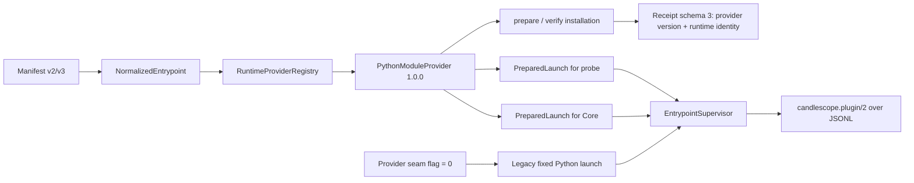

# CandleScope 多运行时插件平台 Phase 2 完成证据

## 1. 阶段结论

Phase 2 已将现有 Python 安装、fresh-process probe 和 Core 运行时启动迁移到
`PythonModuleProvider 1.0.0`。Provider 是默认路径；内部回滚开关关闭时，Host 仍执行
Phase 1 前的固定 Python 路径。两条路径继续向同一个语言无关 Supervisor 传递
`executable + argv + cwd`，没有修改 `candlescope.plugin/2`、Render IR、manifest v2、
v1 registry 或用户授权。

本阶段新增的实际可用能力只有：

- manifest v2 Python 插件默认经 Provider 等价运行；
- 显式打开 `CANDLESCOPE_PLUGIN_MULTI_RUNTIME_ENABLED=1` 后，manifest v3 的
  `python-module` 可以安装、probe、activate、invoke、health 和 shutdown；
- manifest v3 的 native、Java、Node 和 WASM 仍返回
  `PLUGIN_RUNTIME_PROVIDER_UNAVAILABLE`，不得据此宣称这些语言已受支持。

## 2. 实施前审计

Phase 1 结束时，同一个 Python 启动规则分散在三处：

| 路径 | Phase 1 前的职责 | 风险 |
| --- | --- | --- |
| `plugin_installer_v2/installer.py` | 创建 venv、离线装 wheel、pip check、调用 probe runner | 安装与运行命令可能漂移 |
| `plugin_installer_v2/probe_runner.py` | 再次拼接 `-I -u -m` 或 pinned Python bootstrap | probe 通过但生产启动失败 |
| `plugin_core_v2/runtime.py` | 第三次拼接生产 executable/argv | sandbox、args 或 module 可能与 probe 不一致 |
| `plugin_host/supervisor.py` | 消费 executable/argv/cwd 并管理协议生命周期 | 若引入语言判断，会污染通用 Host |

审计还确认：

1. manifest v2 会规范化为 `python-module / python-v2-compat`；
2. manifest v3 已能严格表达 `interpreterArgs`，但 Phase 1 会在执行前拒绝所有 v3；
3. activation registry 已读 schema 2/3、写 schema 3，具备无损 v2 rollback export；
4. verified-publisher 运行使用 Host 固定、只读的 Python runtime 和安装目录内
   site-packages；
5. Supervisor 已经只依赖 `EntrypointProcessSpec`，无需为 Provider 修改协议或进程模型；
6. 旧 Phase 0 性能文件记录 first install 和旧 runtime startup，但没有记录当前
   Plugin Platform v2 子进程 working set，因此内存必须做同次 Provider/rollback 对照，
   不能伪造一个 Phase 0 数字。

## 3. 已执行的阶段计划

1. 冻结 Provider API、默认路径和内部回滚值；
2. 实现 `PreparedRuntime`、`PreparedLaunch`、`RuntimeProviderBinding`；
3. 实现严格 Provider Registry 和唯一的 `PythonModuleProvider`；
4. 将 venv、wheel、pip check、distribution verification 移入 Python Provider；
5. 让 probe 和 Core 都通过同一个 Provider 构建 launch；
6. 将 installation receipt 升级为 schema 3，同时只读兼容 schema 2；
7. 让 v3 `python-module` 在总开关打开时可运行，其他 kind 继续 fail closed；
8. 用同 bundle 双跑 Provider/rollback 路径，并验证交叉读取旧/新 receipt；
9. 跑真实 Core 生命周期、故障矩阵、性能/内存和残留进程门；
10. 保留 Phase 0、Phase 1、Phase 13 和 v1 compatibility 回归；
11. 形成机器可读 contract、gate、性能快照和本完成文档。

## 4. 最终架构



### 4.1 Provider contracts

`backend/app/plugin_core_v2/runtime_providers/base.py` 定义：

- `RuntimeInstallationRequest`：安装目录、Host Python、wheel、distribution 和 runtimeId；
- `RuntimeProviderBinding`：`runtimeKind + runtimeId + providerVersion + runtimeIdentity`；
- `PreparedRuntime`：经 Provider 验证的不可变运行目标；
- `PreparedLaunch`：Supervisor 唯一消费的 executable、arguments、working directory；
- `SandboxRuntime`：pinned executable、只读 site-packages 和可选固定 identity；
- `RuntimeProvider`：validate、prepare、verify、prepare runtime、probe launch 和 runtime
  launch 六个方法。

Provider API 版本固定为 `1`。Provider 的 kind、语义版本和完整方法集均在注册时验证。

### 4.2 Registry 的 fail-closed 规则

`runtime_providers/registry.py` 只注册 `python-module`。以下情况在运行代码前失败：

- 重复 kind：`PLUGIN_RUNTIME_PROVIDER_DUPLICATE`；
- 未知 kind：`PLUGIN_RUNTIME_PROVIDER_UNAVAILABLE`；
- Provider API/version 不兼容：`PLUGIN_RUNTIME_PROVIDER_VERSION_INCOMPATIBLE`；
- receipt Provider binding 不匹配：`PLUGIN_RUNTIME_PROVIDER_RECEIPT_MISMATCH`；
- Provider 对象或 runtime descriptor 不完整：
  `PLUGIN_RUNTIME_PROVIDER_DESCRIPTOR_INVALID`。

Core 的 Provider 路径只用 activation 的 `runtimeKind` 查 Registry，再用不可变 manifest
descriptor 做 Provider 验证。Supervisor 没有导入 Provider 或 Python 实现。

### 4.3 Python Provider 的等价命令

v2 普通运行仍是：

```text
<installation>/venv/Scripts/python.exe -I -u -m <module>
```

v3 的安全 interpreter args 位于 `-m` 前：

```text
<python> -I -u <interpreterArgs...> -m <module>
```

Provider 只接受不会替换声明 module 的 Python flags；`-c`、`-m`、脚本路径和无法识别的
终止参数会返回 `PLUGIN_RUNTIME_PROVIDER_DESCRIPTOR_INVALID`。这不是 shell allowlist，所有
启动仍使用参数数组和 `create_subprocess_exec`。

verified-publisher sandbox 仍使用原有 bootstrap：

```text
<pinned-python> -I -u <interpreterArgs...> -c <fixed-bootstrap> <site-packages> <module>
```

pinned runtime 仍是同一个只读 runtime root；site-packages 必须是 installation 内真实、
非 symlink 目录。

### 4.4 安装与收据

Provider 默认安装路径依次执行：

1. `<host-python> -I -m venv <installation>/venv`；
2. venv Python 通过 `pip --isolated --no-index --no-deps --only-binary=:all:` 安装 bundle
   wheel；
3. `pip --isolated check`；
4. fresh process 读取每个 distribution 的精确版本；
5. Provider 计算 runtime identity；
6. probe runner 通过 Provider 构建同一条 launch；
7. 写 receipt schema 3；
8. installation 原子 rename 后再次 verify、probe。

runtime identity 是以下内容的 canonical SHA-256：runtime kind、runtimeId、Provider version、
Python executable SHA-256 和存在时的 `pyvenv.cfg` SHA-256。bundle/wheel 摘要仍由原有
receipt 和 content inventory 独立绑定。

receipt 行为：

| receipt | Provider 默认路径 | rollback 路径 |
| --- | --- | --- |
| 读取 schema 2 | 支持；现场重新验证 Provider，不重写历史 receipt | 支持 |
| 读取 schema 3 | 严格验证 Provider version/runtime identity | 支持；忽略 Provider 扩展后走旧验证 |
| 新写入 | schema 3 + `runtimeProviders` | schema 2，保持旧路径可执行 |

Provider receipt 的 identity、version、kind、runtimeId 任一不匹配都会在运行插件代码前拒绝。

### 4.5 Probe 与 Core

probe runner 新增内部 `--provider-seam` 参数。默认 installer 会传入；rollback 路径不传，
因此旧 `_entrypoint_command` 仍是可执行代码，不是死分支。probe 输出 schema、descriptor
digest、health digest 和 semantic transcript digest 均未增加 Provider 私有字段，所以两条
路径可以逐字段比较。

`plugin_core_v2/__init__.py` 改为保持公开符号不变的 lazy export。这样 probe/installer 只导入
Provider 子包时，不会额外加载 API、Marketplace、paper/live trading 和整个产品 composition
root。

## 5. 开关与行为矩阵

| manifest | multi-runtime | Provider seam | 结果 |
| --- | ---: | ---: | --- |
| v2 Python | 0/1 | 1（默认） | Python Provider |
| v2 Python | 0/1 | 0 | 旧固定 Python 路径 |
| v3 Python | 0 | 0/1 | `PLUGIN_MULTI_RUNTIME_FEATURE_DISABLED` |
| v3 Python | 1 | 1 | Python Provider |
| v3 Python | 1 | 0 | `PLUGIN_RUNTIME_PROVIDER_UNAVAILABLE` |
| v3 native/Java/Node/WASM | 1 | 1 | `PLUGIN_RUNTIME_PROVIDER_UNAVAILABLE` |

生产多运行时总开关仍默认 `0`：

```text
CANDLESCOPE_PLUGIN_MULTI_RUNTIME_ENABLED=0
```

Phase 2 内部回滚开关默认 `1`：

```text
CANDLESCOPE_PLUGIN_RUNTIME_PROVIDER_SEAM_ENABLED=1
```

## 6. 回滚步骤

回滚不转换 manifest、bundle、activation registry、receipt 或 grants：

1. 停止 CandleScope Host；
2. 设置 `CANDLESCOPE_PLUGIN_RUNTIME_PROVIDER_SEAM_ENABLED=0`；
3. 保持 `CANDLESCOPE_PLUGIN_MULTI_RUNTIME_ENABLED=0`，除非正在诊断已安装 v3 状态；
4. 重启 Host；
5. 对 v2 reference plugin 执行 check、invoke、health 和 shutdown；
6. 确认 v3 activation 显示 runtime unavailable，不自动降级成其他 module/executable；
7. 问题解除后重新设为 `1` 并重启；
8. Provider 会直接读取旧 schema-2 receipt；不需要重装或重新授权。

若要回滚插件版本，继续使用原有 `installer.rollback(plugin_id)`；本阶段 gate 已实际安装
`0.2.0` 并精确恢复到 `0.1.0` activation/installation。

## 7. 故障语义与额外修复

扩大测试暴露了一个与 Provider 抽象相邻的既有竞态：sidecar 可以先写超限 stderr，再让
stdout 响应抢在 stderr drainer 前返回。在高负载全量套件中，这会偶发把成功结果交给上层，
随后进程才被 kill。

`plugin_host/transport.py` 现在在返回成功 frame 前让出一次 event-loop 调度，检查已缓冲的
stderr overflow；超限确定性返回 `PLUGIN_PLATFORM_STDERR_LIMIT_EXCEEDED` 并终止 session。
该检查位于共享 transport，Provider 与 rollback 路径语义相同。新增 stress 证据为 20/20，
invalid UTF-8 也稳定映射到 `PLUGIN_PLATFORM_RESPONSE_INVALID_JSON`。

## 8. 测试与证据

### 8.1 Phase 2 专用测试

`test_plugin_platform_multi_runtime_phase2.py` 覆盖：

- Registry duplicate/unknown/API mismatch/incomplete Provider；
- v2 exact argv、v3 interpreter args 和 sandbox bootstrap；
- 可替换 module、帮助/版本输出和交互模式等会绕过或挂住声明 module 的 Python args 拒绝；
- 基础 installation request 可承载无 wheel runtime，而 Python Provider 单独要求 wheel 和
  distribution；
- installer 保留 Registry 的 Provider API version incompatible 稳定错误码；
- v2 Provider/rollback activation、probe、receipt 和交叉读取；
- v3 Python install/check/Core lazy invoke/stop；
- receipt identity 篡改；
- seam 环境变量默认值和严格解析；
- Supervisor 语言中立。

`test_plugin_platform_multi_runtime_phase2_gate.py` 覆盖冻结 contract、contract drift、完整
真实进程 gate 和 CLI 原子输出。

### 8.2 已通过命令

| 命令/集合 | 结果 |
| --- | --- |
| Host、Supervisor、architecture | 72 passed（transport 修复后 Host/Supervisor 61 passed） |
| bundle、installer、probe、Core | 52 passed |
| Phase 0/1/2/13 + v1 compatibility | 28 passed |
| Phase 2 专用测试 | 9 passed |
| Phase 2 + Phase 1 installer 集合 | 13 passed |
| Phase 2 gate | 4 passed |
| stderr overflow 重复压力 | 20/20 |
| 全部 43 个 `test_plugin*.py` 文件 | 413 passed，4 个既有 FastAPI deprecation warnings，512.19s |
| SDK Ruff + format | PASS，49 files formatted |
| SDK 全量 | 98 passed |
| Frontend `check:plugins` + `typecheck` | PASS |

工作区 `backend/.env` 显式设置了 `REPLAY_ENABLED=1`。第一次全量插件测试因此有两个
`plugin_runtime_main_lifecycle` 用例在进入插件断言前撞到外部 replay archive lock；这不是
Phase 2 回归。单独以文档规定的默认关闭值 `REPLAY_ENABLED=0` 重跑该文件为 `5 passed`。
最终全量门同样显式使用默认关闭值，避免把开发机个人 `.env` 当成产品默认配置。
受控重跑为 `413 passed`，没有新增失败。

### 8.3 机器可读证据

- contract：
  `backend/tests/fixtures/plugin_platform_multi_runtime/phase2_contract_v1.json`；
- gate：`backend/scripts/plugin_platform_multi_runtime_phase2.py --run-gate`；
- 性能快照：
  `docs/perf-baselines/plugin-platform-v2/multi-runtime-phase2-2026-08-03-windows-amd64.json`。

## 9. 性能与进程证据

Windows/AMD64、CPython 3.12.7，本次 gate 结果：

| 指标 | Provider | rollback | 判定 |
| --- | ---: | ---: | --- |
| first install | 7639.808 ms | 7509.230 ms | Provider 低于 Phase 0 9724.601 ms × 1.25 |
| 冷启动中位数（3 次） | 156.890 ms | 156.938 ms | 低于 rollback × 1.20 或 +25 ms |
| working set 中位数 | 4,231,168 B | 4,222,976 B | 低于 rollback × 1.10 或 +8 MiB |
| executable/argv | `python.exe -I -u -m ...` | 完全相同 | PASS |
| Host stop 残留 supervisor | 0 | 0 | PASS |

旧 Phase 0 的 `runtimeStartupMs=104.346` 来自不同的 RuntimeHostService 路径，只作信息对照，
不能与本阶段 Core handshake/describe/activate/invoke 定义混作绝对回归门。安装耗时定义可比，
因此保留绝对 Phase 0 门；启动和内存使用同次 rollback 路径作严格相对门。

## 10. Phase 2 退出门

- [x] Python Provider 是默认路径；
- [x] 旧路径仍可通过内部 flag 实际执行；
- [x] 同一 v2 bundle 的 descriptor/probe/wire/Render transcript/argv 等价；
- [x] Provider version 与 runtime identity 写入并验证 receipt；
- [x] v3 Python 跑通真实 install/check/Core lifecycle；
- [x] crash、hang、cancel、stale generation、oversized JSON、invalid UTF-8、stderr overflow
  故障矩阵通过；
- [x] pinned Python 和只读 site-packages 边界未改变；
- [x] Host stop 无残留 supervisor/transport/process；
- [x] 性能和内存在冻结预算内；
- [x] v1、manifest v2、Phase 0/1/13 回归通过；
- [x] 全部 43 个插件测试文件在默认关闭 replay 环境下 413/413 通过。

## 11. 明确未交付

Phase 2 没有实现：

- native executable Provider 或 Job Object 新策略；
- Managed Runtime Registry、下载、cache、签名或撤销；
- Java/JRE、Node、WASM runtime；
- GitHub repository importer；
- ta4j adapter 或 ta4j JAR；
- Marketplace 对非 Python runtime 的发布资格；
- 系统 runtime 自动 fallback、源码编译或 shell command entrypoint。

Phase 3 必须从当前 Registry 增加独立 `NativeExecutableProvider`，继续复用同一
`PreparedLaunch -> Supervisor` 边界；不得在 Python Provider 中塞 native 分支。
