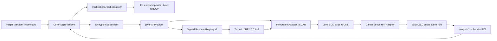

# CandleScope 多运行时插件平台 Phase 5 完成证据

## 1. 阶段结论

Phase 5 已交付 `java-jar` Runtime Provider、零依赖 Java SDK、签名 Runtime Registry
revision 2 和可实际运行的 ta4j 0.23.0 Elliott Wave 参考插件。

本阶段证明的不是“任意 GitHub 仓库可以不经审核直接执行”，而是一个可重复的接入闭环：

- 复用上游稳定公共 API，不复制算法；
- 固定 Release、commit、Maven JAR、JDK、JRE、摘要、许可证与 SBOM；
- 由 Host-managed JRE 启动可执行 fat JAR；
- Java 实现与 Python SDK 相同的 JSONL 协议；
- 行情只经 Host capability 提供，Adapter 不下载、不查 DB；
- 结果映射为 CandleScope 自有 schema 和 Host-owned Render IR；
- 安装、检查、调用、取消、更新、回滚、故障和进程残留均有真实门禁；
- Plugin Manager 能区分插件 JAR、Java runtime、JRE 版本、来源和 trust mode；
- Java Provider 与 Runtime Registry 仍默认关闭；Python v2 和 v1 compatibility 不受影响。

ta4j 与现有 Python Elliott 插件继续作为两个独立引擎。当前 point-in-time 对照不批准替换。

## 2. 实施前背景审计

### 2.1 已有基础

Phase 1～4 已提供：

| 层 | 已有能力 |
| --- | --- |
| manifest v3 | `java-jar` descriptor、artifact、runtimeId、mainClass、jvmArgs |
| Runtime Provider API | 安装准备、静态复核、probe launch、runtime launch |
| installer | immutable `.cspkg`、fresh-process probe、activation/history/rollback |
| Host protocol | `candlescope.plugin/2`、JSONL、capability Host calls、generation/cancel |
| process supervisor | timeout、stderr budget、whole-process-tree termination |
| Runtime Registry | signed revision、content-addressed cache、JRE supply receipt |
| market plane | point-in-time `market.bars.read` 与 `candlescope.market-bars-page/1` |

### 2.2 真实缺口

开始 Phase 5 时仍不能运行 ta4j，原因是：

1. Provider Registry 只有 Python 和 Phase 3 native Provider；
2. installer/probe fresh process 不知道如何恢复 Java Provider 和 managed JRE；
3. Core 仍缺 Java feature flag 和 JAR/JRE 分离启动路径；
4. Java 没有 SDK，直接手写协议容易产生 wire drift；
5. ta4j 没有 CandleScope Adapter、manifest、能力边界和结果 schema；
6. Phase 4 只固定 Java 21 参考 runtime，而 ta4j 0.23.0 要求 Java 25；
7. Maven/JDK/JRE/许可证和构建结果没有固定；
8. 没有相同逐时点输入下的 Python 对照；
9. 没有 JVM crash/OOM/hang/stderr 和残留进程真实证据。

### 2.3 上游审计结论

审计固定 ta4j 0.23.0 annotated tag 和 peeled commit，并确认：

- 它是 MIT Java library，不是 daemon 或 CandleScope plugin；
- parent POM 使用 Java release 25；
- Elliott 公开入口是 `ElliottWaveAnalysisRunner`；
- 运行时依赖为 ta4j-core、slf4j-api、commons-math3 和 gson；
- tag 0.23.0 与 GitHub 默认分支并不完全等价；
- 直接运行仓库构建脚本会扩大供应链和执行权限，不能作为安装 fallback；
- 最小正确形态是固定 fat JAR + thin Adapter + Host-owned data/render。

## 3. 已执行计划

1. 冻结 ta4j tag/commit、Java baseline、公共 API 和许可证边界；
2. 固定 Temurin JDK/JRE 25.0.4+7 与 Maven 运行时依赖；
3. 轮换 Runtime Registry 签名 key，发布连续 revision 2 并保留 revision 1；
4. 实现 `JavaJarProvider` 和独立默认关闭开关；
5. 把 installer、probe runner、Core 和 Plugin Manager 接入 Java；
6. 实现零依赖 Java SDK 与 Python transcript parity；
7. 实现 ta4j Adapter 的 Host call、BarSeries、公开 Elliott API 和结果投影；
8. 生成可重复 fat JAR、SBOM、notices、build receipt 和 semantic transcript；
9. 建立 golden corpus、数值/时间/长度边界和 Python point-in-time 对照；
10. 建立真实 JRE/JAR 安装、运行、故障、更新和回滚门禁；
11. 冻结 Phase 5 contract 和机器证据；
12. 跑 Phase 0～5、SDK、installer、Core 和旧默认路径回归；
13. 只暂存 Phase 5 明确文件，独立提交。

## 4. 最终架构



关键所有权：

- Host 拥有行情、权限、JRE、进程、超时、日志预算和 UI renderer；
- Adapter 拥有输入校验、ta4j 类型转换、输出 schema 与 provenance；
- ta4j 拥有 Elliott 分析算法；
- 插件不能拥有 Host DB/DOM/账户/密钥，也不能再启动构建器或子进程。

## 5. Java SDK

目录：`packages/candlescope-plugin-sdk-java/`。

### 5.1 JSON 合同

SDK 自行实现严格 UTF-8 JSON，避免引入另一份运行时依赖：

| 边界 | 值 |
| --- | ---: |
| frame | UTF-8 JSONL，一行一个对象 |
| message bytes | 1,048,576 |
| maximum depth | 32 |
| container items | 10,000 |
| string bytes | 262,144 |
| safe integer | ±9,007,199,254,740,991 |

它拒绝 duplicate key、invalid UTF-8/Unicode、non-finite、unsafe integer 和超限容器，并
按与 Python SDK 相同的 canonical JSON 规则生成 SHA-256。专项修复覆盖了 Java
`Long.MIN_VALUE` 取绝对值溢出的边界。

### 5.2 生命周期

`Dispatcher` 实现：

- handshake 前状态限制；
- describe 与 manifest descriptor；
- activate capability handles 与 generation；
- invoke / eventBatch；
- Host call request/response correlation；
- healthCheck；
- cancel pending request；
- prepareUpgrade、deactivate、shutdown；
- duplicate request id、stale generation、late Host response 拒绝。

### 5.3 stdout 隔离

`JsonLineServer` 在保留原始协议 stdout 后，把插件普通 `System.out` 重定向到 stderr。
协议帧只由 server 写入原始 stdout。这样库日志不会和 JSONL 混合；Host 仍对 stderr 设置独立
字节预算。

### 5.4 独立验证

`scripts/check.py` 使用固定 JDK、`--release 17` 编译 SDK 与测试插件，并验证：

- Unicode/number/canonical JSON；
- JSON limit 正负例；
- Python/Java hello transcript 逐帧 digest 相同；
- transcript digest
  `d98ebd2fc9f5b0695925caf47ecf961eae47a56b5e8ec110f28acc9365afdd38`；
- Host call correlation 和 late response；
- generation/cancel/lifecycle。

## 6. `java-jar` Provider

入口：`backend/app/plugin_core_v2/runtime_providers/java.py`。

### 6.1 开关

`CANDLESCOPE_PLUGIN_RUNTIME_JAVA_ENABLED` 是独立 flag，默认 `0`。只有同时满足 multi-runtime、
Provider seam、Runtime Registry 和 Java flag，Java activation 才可进入运行路径。

### 6.2 安装与静态验证

Provider 对整个 JAR 执行受限 ZIP 审计：

- canonical relative path；
- 大小写身份唯一；
- 无 symlink、special/executable entry；
- 无 encryption；
- file count、entry size、总 uncompressed size 和 compression ratio 上限；
- 恰好一个 canonical `META-INF/MANIFEST.MF`；
- descriptor Main-Class 与 Manifest Main-Class 完全一致；
- 主类实际存在；
- 所有 `.class` magic 和最高 major 不超过 JRE；
- JAR size/SHA-256 与 immutable inventory 一致。

安装前在线 ensure JRE；复核和启动只允许 offline exact hit。没有源码编译、Maven、Gradle、
PATH 搜索或 system Java fallback。

### 6.3 JVM policy

插件只可声明有界 `-Xms`、`-Xmx` 和批准的 Serial/G1 GC。Host 固定：

- UTF-8、headless、language/country；
- OOM 退出；
- argument array + `shell=false`；
- exact classpath 和 Main-Class；
- isolated search path；
- whole process tree；
- `maxProcesses=1`。

Provider 返回的 executable 是 managed `java.exe`，artifact 是 JAR。Core 运行路径因此必须把
`activation.artifact` 交给 Provider 重新验证，再由 Provider 解析 JRE；本阶段修复了把
managed `java.exe` 错当插件 artifact 的启动目标问题，并由真实 Core gate覆盖。

## 7. Registry revision 2 与 Temurin 25

Phase 4 的 revision 1 仍保留。Phase 5：

- 在 build-pinned roots 中加入新 Ed25519 key；
- 旧 key 仍可验证 revision 1；
- revision 2 由新 key 签名；
- `previousRegistrySha256` 精确引用 revision 1；
- official service 同时 bootstrap 已验证历史与当前 revision；
- state history 因而可以立即、安全回滚到 revision 1；
- 若缺失 revision 1、顺序断裂、Registry ID 不同或 digest 不连续，bootstrap fail closed；
- revocation 集合跨 bootstrap history 单调合并。

新增的 JRE release：

| 字段 | 固定值 |
| --- | --- |
| runtimeId | `temurin-25.0.4.7` |
| version | `25.0.4+7-LTS` |
| archive size | 58,474,646 |
| archive SHA-256 | `5b0d58f043f762fa3ee6cc12b6774b59b245cafdcb357e45ce61f822aa9a56cb` |
| extracted | 320 files / 187,841,444 bytes |
| legal | 183 files / 231,846 bytes |
| executable | `bin/java.exe` |
| license | `GPL-2.0 WITH Classpath-exception-2.0` |

vendor checksum、metadata、SBOM、signature 作为四个独立 evidence 固定。JRE 在真实干净
runtime root 首次安装，随后 quick repeat 和完全 offline hit 均重新 fresh-process probe。

## 8. ta4j 参考 Adapter

目录：`examples/plugins/ta4j-elliott-adapter/`。

### 8.1 数据链

1. command input 只包含 market identity/range 和 settings；
2. Java SDK 用 activation 提供的 opaque handle 发出 `market.bars.read`；
3. Host scope 校验 live/binance/spot/BTCUSDT/1h、数量与并发；
4. Adapter 验证 Host page identity、coverage、时间、OHLCV、终结状态和 5,000-bar 上限；
5. 以 `DecimalNumFactory` 构造 ta4j `BarSeries`；
6. settings 映射到 `ElliottWaveAnalysisRunner.builder()`；
7. 上游结果转换为 `candlescope.elliott-wave-analysis/1`；
8. scenario/pivot/target 转成 `candlescope.render/2`；
9. provenance 写入 Adapter/ta4j/tag/commit/artifact 和 point-in-time 边界。

Adapter 不访问网络、文件、CandleScope DB、账户或交易 API。源码不含 `package org.ta4j`，也
不复制 runner、swing detector、scenario generator 或 confidence model。

### 8.2 输出

结果含 engine、input provenance、settings/digest、scenarios、warnings、Render IR 和
运行边界 provenance。scenario 投影包括 id、rank、degree、pattern、phase、direction、
confidence/breakdown、pivots、invalidation 和 targets。

只有上游有稳定值时才投影 confidence/target；非 finite 值不跨 JSON 边界。empty、短历史、
non-final、coverage incomplete 和上游 notes 都保留为可区分 warnings。

## 9. 可重复构建与供应链

`supply-chain.lock.json` 固定：

- ta4j tag object、commit、Release URL；
- ta4j-core 0.23.0；
- slf4j-api 2.0.18；
- commons-math3 3.6.1；
- gson 2.14.0；
- Temurin JDK/JRE 25.0.4+7；
- 每个制品的 URL、size、SHA-256、purl 和 license；
- Adapter version、Main-Class、release JAR size/SHA-256。

`build_release.py` 完全离线：检查依赖后，用固定 `javac --release 25` 编译 SDK 与 Adapter，
去除依赖 JAR 签名/重复 manifest/module-info，拒绝 path collision，以固定时间、排序、权限和
压缩写 fat JAR。两个干净目录输出均为：

```text
size   = 4,435,729 bytes
sha256 = 19c60a36d178d9e9340c4133ed0d60f4d80e4c19c3e17e01aaca6231bdcd6060
```

许可证和 notices 同时嵌入 JAR 并放入 bundle；CycloneDX SBOM 和 build report 单独保存。
独立检查逐字节验证 8 个法律文件：Adapter 的 Apache-2.0、MIT、GPL、第三方说明和
Commons Math NOTICE，以及从锁定原始 JAR 保留的 Commons Math LICENSE/NOTICE、SLF4J
LICENSE。这样 fat JAR 去除依赖根目录重复文件时不会丢掉上游 attribution。

## 10. Golden corpus 与 Python 对照

### 10.1 Adapter 独立语义测试

五组 frozen cases 覆盖 empty、趋势震荡前缀、impulse profile 和 non-final。每组运行两次并
核对 canonical digest、future pivot、Render IR 和 provenance。整体 digest：

```text
sha256:1c5119a4f990e0c246cff94e23e7b1569e39d4ccdfdac522425531ee7299e17b
```

额外边界不改变 golden digest，但每次 release gate 都重跑：

- 5,000 bars 完整分析；
- 5,001 bars 拒绝；
- 18 位小数文本进入 `DecimalNum`；
- epoch seconds 上界；
- duplicate timestamp 拒绝；
- default-branch-only profile 拒绝。

### 10.2 Python 对照

对照固定本地 sibling worktree commit
`bd2846d4a1d9f83ba965d91b1a6e22340fc22a61`。两个引擎接收完全相同、只含当时可见 bars
的五组输入。stable digest：

```text
sha256:04fa67c73ad3dfedb1c788d7d4fc56d79f1e90ccf08837d386a9251e9c49904c
```

elapsed time 留在原始报告但不进入 stable digest。对照确认两边都无未来 pivot，同时也显示
pattern/pivot/invalidation 语义不能直接等价；迁移决定仍为 `not-approved`。

## 11. 安装、运行与 Manager

完整路径为：

    inspect/build bundle
      -> install immutable content
      -> Provider online JRE ensure
      -> fresh-process Java semantic probe
      -> receipt schema 4 + runtimeSupply
      -> permission grant
      -> enable
      -> Core lazy activate
      -> java-jar invoke / Host call
      -> update
      -> activation rollback

probe runner 由父进程显式传入 Java flag 和 managed runtime root。新进程只重建 official
Registry，且禁用网络更新；它不会继承 Python 对象或使用系统 Java。

Plugin Manager 的 entrypoint 投影新增：

- runtimeKind、runtimeId；
- 插件 artifact digest；
- JRE `runtimeSupply`；
- version、source URL、license、size；
- registry revision/digest；
- verification/reproducible；
- plugin trustLevel。

本阶段参考插件显示 `java-jar`、Temurin 25.0.4+7、`local-trusted`、verified Adoptium
upstream 和精确 JAR digest。

## 12. 真实 release gate

机器证据：
`docs/perf-baselines/plugin-platform-v2/multi-runtime-phase5-2026-08-03-windows-amd64.json`。

最终真实路径覆盖：

- Java SDK 自测；
- Adapter independent golden/boundary 自测；
- 两个干净离线 reproducible builds；
- JRE first/repeat/offline；
- fresh install、permission、enable、quick repeat、check；
- fresh-process semantic transcript；
- update 和 rollback 到精确旧 bundle；
- Core cold invoke、100 hot calls、相同 digest；
- 阻塞 Host call 中取消，health pending=0；
- Manager provenance；
- Java flag off，无 supervisor/fallback；
- crash、hang、real heap OOM、stderr flood；
- Host stop 后无 `java.exe` 和 supervisor；
- Registry revision 2 -> 1 -> 2。

采样值只描述本机，不设为跨机器 SLA：

| 项目 | 结果 |
| --- | ---: |
| cold invoke | 291.717 ms |
| 100 hot median | 62.160 ms |
| 100 hot p95 | 96.953 ms |
| hot result digest drift | 0 |
| residual Java processes | 0 |
| residual supervisors | 0 |

## 13. JVM 故障矩阵

| 场景 | 稳定结果 |
| --- | --- |
| immediate crash | `PLUGIN_PLATFORM_EXITED` |
| startup hang | `PLUGIN_PLATFORM_TIMEOUT` |
| heap OOM | `PLUGIN_PLATFORM_RESPONSE_INVALID_JSON` |
| stderr flood | `PLUGIN_PLATFORM_STDERR_LIMIT_EXCEEDED` |

Temurin 25 Windows 的 `-XX:+ExitOnOutOfMemoryError` 横幅会污染 stdout，Host 因而在 EOF
之前以 invalid JSON 关闭进程。证据冻结真实竞态结果，不把它改写成更好看的 EXITED。

## 14. 冻结 contract 与测试入口

Phase 5 contract：

```text
backend/tests/fixtures/plugin_platform_multi_runtime/phase5_contract_v1.json
file sha256:aeea5ba29fbdc0fe730a875bdfa072d55f73f3b6a3a11efb49d69dad89a5e745
canonical sha256:090a2edf8b446415fb586564771c593a95f9d4524f20f12807858cdf18b2f8b1
```

它绑定 Phase 4 contract、Provider policy、Java SDK limits/methods、Registry revision/JRE、
Adapter JAR/依赖/upstream/法律文件、transcript、golden、Python comparison、默认开关和
rollback。真实证据文件 SHA-256 为
`1fd935c399bbcb447e5454b12ea616459a06febf045062e84fce9fd0df075391`。

常规门禁：

```powershell
$env:PYTHONPATH = 'packages\candlescope-plugin-sdk\src;backend'
python backend\scripts\plugin_platform_multi_runtime_phase5.py
```

独立 SDK：

```powershell
python packages\candlescope-plugin-sdk-java\scripts\check.py `
  --jdk-home C:\path\to\jdk-25.0.4+7 `
  --python-transcript packages\candlescope-plugin-sdk\tests\fixtures\hello_command_transcript_v2.json
```

独立 Adapter：

```powershell
python examples\plugins\ta4j-elliott-adapter\scripts\check.py `
  --jdk-home C:\path\to\jdk-25.0.4+7 `
  --dependency-cache C:\path\to\fixed-maven-cache
```

真实门禁需要用户预先审核并准备 lock 中的 JDK、Maven JAR 和 JRE evidence；脚本本身不从
默认分支或系统环境猜制品：

```powershell
python backend\scripts\plugin_platform_multi_runtime_phase5.py `
  --run-real `
  --jdk-home C:\path\to\jdk-25.0.4+7 `
  --dependency-cache C:\path\to\fixed-maven-cache `
  --jre-evidence-directory C:\path\to\fixed-jre-evidence `
  --output docs\perf-baselines\plugin-platform-v2\multi-runtime-phase5-2026-08-03-windows-amd64.json
```

### 14.1 最终验证结果

| 验证层 | 最终结果 |
| --- | ---: |
| Phase 5 定向 pytest | 16 passed |
| Phase 4～5 联合回归 | 39 passed |
| Phase 0～5 冻结契约链 | 84 passed |
| bundle/Core/installer/Gateway/Provider/Registry v3 受影响面 | 77 passed |
| Python Plugin SDK 全套 | 98 passed |
| Java Plugin SDK 独立编译/语义/wire parity | PASS |
| ta4j Adapter golden/boundary/license byte parity | PASS |
| real JRE gate | PASS |
| Ruff check / format check / JSON parse / diff check | PASS |

## 15. 开关与回滚

| 开关 | 默认 | 作用 |
| --- | ---: | --- |
| `CANDLESCOPE_PLUGIN_MULTI_RUNTIME_ENABLED` | 0 | non-Python manifest 总门 |
| `CANDLESCOPE_PLUGIN_RUNTIME_PROVIDER_SEAM_ENABLED` | 0 | typed Provider launch seam |
| `CANDLESCOPE_PLUGIN_RUNTIME_REGISTRY_ENABLED` | 0 | Host-managed runtime supply |
| `CANDLESCOPE_PLUGIN_RUNTIME_REGISTRY_NETWORK_UPDATES_ENABLED` | 0 | 未来显式 Registry 更新门；无自动拉取 |
| `CANDLESCOPE_PLUGIN_RUNTIME_JAVA_ENABLED` | 0 | Java Provider 独立门 |

产品回滚：

1. disable ta4j activation；
2. Java flag 设为 0；
3. 必要时 Runtime Registry 回滚 revision 2 -> 1；
4. 保留 immutable JAR/JRE/cache/history；
5. 不运行其他 Java 或系统 fallback；
6. Python v2 和 v1 compatibility 保持原路径。

## 16. Phase 5 退出门

- [x] ta4j Adapter 只调用上游 public Elliott API；
- [x] stable tag/commit、Maven dependencies、JDK/JRE 全部固定；
- [x] Adapter JAR 两次干净构建 byte-identical；
- [x] SBOM、licenses、notices、build report 与 transcript 齐全；
- [x] Java SDK 有独立编译和 Python wire-parity 测试；
- [x] Adapter 有独立 golden、Decimal、timestamp、empty、non-final、5,000-bar 测试；
- [x] JAR/Main-Class/runtimeId/digest/class-major/JVM args 负例 fail closed；
- [x] cold、100 hot、cancel 和 deterministic digest 真实通过；
- [x] crash、OOM、hang、stderr flood 真实通过；
- [x] fresh install、quick repeat、fresh-process probe、update、rollback 真实通过；
- [x] Host stop 无残留 `java.exe`；
- [x] Manager 显示 Java、JRE version、trust mode、artifact 和 upstream source；
- [x] Java flag 默认关闭，关闭后无 launch fallback；
- [x] Python 插件未被替换，迁移决定未批准。

## 17. 明确未交付

Phase 5 不包含：

- untrusted Java sandbox 和 trust-mode UX（Phase 6）；
- Node Provider（后续阶段）；
- WASM Provider（后续阶段）；
- Linux/macOS/arm64 Java release matrix；
- 输入任意 GitHub URL 后执行项目脚本；
- 自动 Maven/Gradle 构建或源码编译 fallback；
- Marketplace publisher signing、transparency/revocation（Phase 10）；
- 现有 Python Elliott 引擎迁移或删除；
- 账户、密钥和真实交易权限；
- 跨机器通用性能 SLA。

下一阶段必须在此基础上实现显式 trust mode、权限 UX 和多运行时 sandbox，而不能用“用户本机
部署”作为静默开放网络、文件、账户或交易权限的理由。
