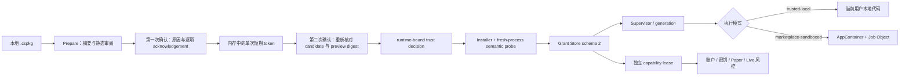

# CandleScope 多运行时插件平台 Phase 6 完成证据

## 1. 阶段结论

Phase 6 已交付可撤销、可审计、绑定精确运行时身份的信任系统，以及 Python、Java、
native 和 Node 的 Host-owned 受限运行配置。真实 Windows 门禁证明当前可执行的
`python-module`、`java-jar`、`native-executable` 都能在 AppContainer 与 Job Object 下运行，
默认无网络能力、单进程、只能写插件私有目录。

本阶段把“用户自己部署，所以可以放宽限制”落实为两个不同的产品选择：

- `trusted-local`：用户经过逐项双重确认后，允许插件像普通本地应用一样以当前用户身份运行；
- `marketplace-sandboxed`：Marketplace 代码继续默认进入受限运行环境。

无论选择哪种信任模式，网络、文件、密钥、账户和交易 capability 都不会自动授权，Live
authority 的所有开关继续默认关闭。`verified publisher` 只表示发布者身份被验证，不表示代码
安全、经过 CandleScope 审核或获得官方背书。

Phase 6 还解决了一个真实运行时兼容问题：Temurin 25.0.4+7 在 Windows AppContainer 中会因
OpenJDK 已知问题无法正确初始化 JVM。本阶段没有放宽沙箱或伪造通过结果，而是发布连续签名的
Runtime Registry revision 3，将 ta4j 包装版本升级到 `0.1.1` 并迁移到已修复的 Temurin
26.0.2+10；Adapter JAR 和算法结果保持不变。

所有新开关仍默认关闭，旧 `local-trusted` / `verified-publisher` 行为在 trust UX 关闭时保持
兼容。

## 2. 实施前背景审计

### 2.1 Phase 1～5 已有基础

进入 Phase 6 前，平台已经具备：

| 层 | 已有能力 |
| --- | --- |
| bundle | immutable `.cspkg`、严格 inventory、SHA-256、安装收据 |
| runtime | Python、native、Java Provider 与类型化 launch descriptor |
| process | Supervisor、generation、超时、取消、故障、整棵进程树终止 |
| registry | 签名 Registry、固定 runtime、内容寻址缓存、fresh-process probe |
| permissions | Grant Store、permission diff、grant/deny/revoke、capability lease |
| marketplace | 发布者签名、透明度证据、固定 artifact、原子更新与回滚 |
| UI | Plugin Manager 的 runtime、来源、权限、健康和回滚投影 |

### 2.2 真实缺口

旧实现的主要问题不是“完全没有安全机制”，而是信任语义与授权继承还不够精确：

1. `local-trusted`、`verified-publisher` 等历史名字混合了来源、身份和执行模式；
2. 本地安装可以直接进入 installer，没有一份在首次执行前冻结的明细审阅单；
3. 旧 grant 绑定 bundle、manifest 和 publisher，但没有绑定完整 runtime 身份；
4. runtime kind、runtime artifact、签名根或 system runtime 路径变化后，旧授权可能被错误继承；
5. UI 没有把 runtime diff 与 permission diff 放在同一屏；
6. Java、Node、native 没有统一、Host-owned 的受限 profile；
7. 非 Windows 平台不能诚实表达“没有验证过等价沙箱”；
8. `trusted-local` 与账户、密钥、Live authority 的独立边界没有形成可测试合同；
9. Java 25 的 AppContainer 兼容性没有真实攻击探针覆盖。

### 2.3 设计决策

本阶段采用以下原则：

- 信任决定绑定“这一份代码 + 这一发布者 + 这一运行时”，不绑定模糊名称；
- 本地安装的 prepare 阶段不得执行 semantic probe 或插件进程；
- 两次确认必须是两个不同的 Host user-action，token 只使用一次并只保存在 React 内存；
- 受限 profile 是 Host 产品策略，插件 manifest 不能自行提高上限；
- 没有等价沙箱的平台标为 `trustedLocalOnly=true`，不能用未验证实现冒充安全隔离；
- 任何信任选择都不授予高风险 capability；
- 遇到 JRE 与 AppContainer 不兼容时修 runtime，不降低 Marketplace 沙箱。

## 3. 已执行计划

1. 冻结历史 trust alias 到 canonical mode 的迁移表；
2. 实现 `PluginTrustService`、严格持久化 schema、候选审阅和单次确认 token；
3. 将本地安装拆成 prepare、review、confirm，阻止旧直装 API 绕过 UX；
4. 将 trust change 拆成 review、confirm，并在切换前停止旧 supervisor；
5. 生成 runtime identity 与 authorization identity，并将 Grant Store 升级为 schema 2；
6. 仅对精确匹配的历史 bundle 做 grant schema 1 -> 2 迁移；
7. 定义 Python、Java、Node、native 的 Host-owned restricted profile；
8. 将 AppContainer sandbox policy 接入精确 runtime root、只读安装目录和私有可写目录；
9. 建立 Python、Java、native 的真实 Windows attack matrix；
10. 调查 Java 25 AppContainer 失败，迁移到固定 Temurin 26.0.2+10；
11. 发布连续签名的 Runtime Registry revision 3，并保留 revision 1/2 回滚历史；
12. 将 ta4j 包装版本升级到 `0.1.1`，只迁移 runtime，不改 Adapter JAR；
13. 实现 Plugin Manager 的来源、runtime、sandbox、权限、diff 与逐项双重确认 UI；
14. 建立后端合同门、真实 Windows 门、前端 parser/component 门和真实浏览器门；
15. 验证默认开关、旧行为、Marketplace 防提权、Live authority 与回滚边界；
16. 只提交 Phase 6 明确文件，保留工作树中的无关 replay/UI 修改。

## 4. 最终信任与执行链



prepare 只做 bundle 验证和审阅投影。直到第二次确认成功，Host 才允许 installer 执行
semantic probe 或创建插件进程。

## 5. Trust alias 与 canonical mode

### 5.1 冻结映射

| 历史/输入值 | canonical mode |
| --- | --- |
| `first-party-pinned` | `first-party-pinned` |
| `verified-publisher` | `marketplace-sandboxed` |
| `marketplace-sandboxed` | `marketplace-sandboxed` |
| `local-trusted` | `trusted-local` |
| `trusted-local` | `trusted-local` |
| `local-developer` | `developer-local` |
| `developer-local` | `developer-local` |
| `untrusted` | `marketplace-sandboxed` |
| `ui-only-untrusted` | `ui-only-untrusted` |

这张表是兼容迁移合同，不能通过 UI 文案临时推断。未知 alias 直接 fail closed。

### 5.2 模式语义

| mode | 语义 |
| --- | --- |
| `first-party-pinned` | Host 固定的一方产物；仍受 capability 与 Live 边界约束 |
| `marketplace-sandboxed` | 签名来源默认模式；要求当前平台支持受限 profile |
| `trusted-local` | 用户明确接受普通本地代码风险；不表示授予 Host capability |
| `developer-local` | 开发者路径，可显式使用 system runtime 并记录不可复现性 |
| `ui-only-untrusted` | 不允许 backend code execution 的 UI-only 边界 |

## 6. 本地安装与信任变更 UX

### 6.1 三段本地安装 API

| 步骤 | API | 行为 |
| --- | --- | --- |
| prepare | `POST /api/v2/plugins/manage/install/prepare` | Host 与浏览器分别复算摘要，冻结 preview；不执行代码 |
| review | `POST /api/v2/plugins/manage/install/review` | 校验原因、逐项确认、candidate/preview digest，签发单次 token |
| confirm | `POST /api/v2/plugins/manage/install/confirm` | 要求第二个 user-action，消费 token，才安装、probe、激活 |

trust UX 开启时，旧 `POST /manage/install` 返回 `409`，不能绕过双重确认。每个管理请求仍需：

- exact Origin；
- trusted desktop management session；
- CSRF token；
- 有界且不同的 `X-CandleScope-User-Action`；
- 浏览器与 Host 一致的 bundle SHA-256。

候选默认 15 分钟失效，review token 默认 5 分钟失效。reason 必须是去除首尾空白后的
12～500 个字符；actor、user-action、candidate id、change id 和 SHA-256 都有严格格式限制。

### 6.2 逐项确认

用户必须逐项确认：

1. 这会以当前 Windows 用户身份执行本地应用代码；
2. 账户、密钥和实盘权限不会随 trust 自动开放；
3. 每个 entrypoint 的 runtime kind、runtime id 和 descriptor；
4. 已核对 sandbox 状态，不是仅凭 publisher 名称判断安全。

第一次确认成功后按钮会锁定，第二次确认按钮才启用。confirmation token 不落 localStorage、
sessionStorage 或 URL，只保存在当前 React state；成功、失败、过期或 candidate 变化都会清除。

### 6.3 已安装插件的 trust change

已安装插件使用：

- `POST /api/v2/plugins/manage/{plugin_id}/trust/review`
- `POST /api/v2/plugins/manage/{plugin_id}/trust/confirm`

切换模式前先停止旧 supervisor，再写入新决定、重新 reconcile 并创建新 generation。这样
`trusted-local -> marketplace-sandboxed` 不会让旧宽权限进程继续存活。

### 6.4 Marketplace 防提权

签名 Marketplace artifact 不能进入 unsigned local-file flow；Marketplace API 也不能代替本地
双重确认创建 `trusted-local` 决定。publisher 身份验证与 execution trust 是两个独立维度。

## 7. Runtime-bound authorization 与 Grant Store schema 2

### 7.1 绑定输入

授权继承现在同时绑定：

- `bundleSha256`；
- `manifestSha256`；
- `publisherIdentity`；
- `authorizationIdentity`。

`authorizationIdentity` 的 canonical 输入包含插件 id、publisher、mode、每个 entrypoint 的
runtime kind/id/descriptor、插件 artifact、Host-managed runtime artifact、Registry、签名根与
system runtime path。完整投影另有 `runtimeIdentity`，用于 UI 和审计说明。

因此下列任一变化都会使旧 grant 或 trust decision 失效：

- runtime kind 或 runtime id；
- 插件 artifact；
- Host-managed runtime artifact；
- publisher 或签名根；
- Registry 绑定；
- developer-local 的 system runtime 路径。

### 7.2 schema 1 迁移

Grant Store 同时能读取 schema 1 和 2，但只对“当前已经安装、bundle/manifest/publisher/major
version 全部精确匹配”的历史记录补写 authorization identity。任何不确定或发生变化的记录都不
继承 grant，而是要求用户重新决定。

回滚 trust UX 不删除 grant 文件；关闭新 UX 后旧行为可以继续读取记录，但不会把 schema 2 的
runtime-bound 授权错误扩大给另一个 runtime。

### 7.3 高风险能力保持不可用

Phase 6 明确冻结以下高风险 permission 为 trust 不可授予：

- `accounts.read`
- `secrets.use`
- `trade.simulate`
- `trade.submit`
- `trade.cancel`

它们仍需独立产品开关、账户选择、confirmation/lease、kill switch 和审计。trust summary 中固定
`grantedByTrust=false`、`independentlyProtected=true`。

## 8. 多运行时受限 profile

这些限制由 Host 决定，插件不能在 manifest 中调高。Phase 6 没有 process model，因此所有
profile 都固定 `maxProcesses=1`、`subprocessDeclared=false`、`networkDefault=denied`。

| kind | profile | memory | CPU rate | probe/runtime CPU | disk | probe wall |
| --- | --- | ---: | ---: | ---: | ---: | ---: |
| Python | `restricted-python-v1` | 256 MiB | 25% | 60s / 300s | 64 MiB | 90s |
| Java | `restricted-java-v1` | 512 MiB | 35% | 120s / 600s | 64 MiB | 180s |
| Node | `restricted-node-v1` | 384 MiB | 30% | 120s / 600s | 64 MiB | 180s |
| native | `restricted-native-v1` | 256 MiB | 25% | 60s / 300s | 64 MiB | 90s |

runtime wall 上限均为 86,400 秒。Windows 投影为 `windows-appcontainer`；未验证平台投影为：

```json
{
  "sandboxMode": "unavailable",
  "sandboxSupported": false,
  "trustedLocalOnly": true
}
```

Node profile 已定义，但 Node Provider 与可执行门在 Phase 7；WASM profile 留到 Phase 8，避免
把 WASI capability 模型硬套进进程型 AppContainer。

### 8.1 路径与环境边界

受限 sandbox 只允许：

- 读取精确安装目录；
- 读取精确 Host-managed runtime 根；
- 读取显式附加的只读依赖路径；
- 写插件自己的 private directory；
- 使用 Host 白名单内的环境变量。

安装目录、私有目录、runtime 目录不能重叠，不能是盘符根；只读路径不能与可写路径重叠。
启动始终使用 argument array、`shell=false` 和 Windows Job Object。

### 8.2 真实攻击矩阵

Phase 6 在 Windows amd64 对 Python、Java、native 分别运行了恶意探针，而不是只检查 policy
对象。三个 kind 的结果完全一致：

| 攻击/能力 | 预期与实测 |
| --- | --- |
| 读取 bundle 外 secret | 拒绝 |
| 读取 Host source | 拒绝 |
| 写 installation | 拒绝 |
| 写 private directory | 允许 |
| loopback 连接 | 拒绝 |
| external network | 拒绝 |
| 启动 child process | 拒绝 |
| AppContainer SID | 存在 |
| network capabilities | 空集合 |
| active process limit | 1 |

Java 使用 512 MiB，Python/native 使用 256 MiB。三项均 exit code 0，表示探针完整执行并观察到
预期拒绝，不是进程根本没有启动。

## 9. Java 25 AppContainer 故障与 Runtime Registry revision 3

### 9.1 故障现象与判断

Phase 6 首次用 Temurin 25.0.4+7 跑 Java attack probe 时，JVM 在 AppContainer 内初始化失败。
同一 JRE 在普通进程和 Phase 5 trusted-local gate 中正常，因此问题不在 Adapter、JAR 或
JSONL 协议。

调查确认这是 OpenJDK Windows AppContainer 的已知问题：

- [JDK-8352728](https://bugs.openjdk.org/browse/JDK-8352728)
- [JDK-8369741](https://bugs.openjdk.org/browse/JDK-8369741)
- [对应 OpenJDK 修复提交](https://github.com/openjdk/jdk/commit/7e1051bfcc01aad538376c86354e16e25d2eaf7a)
- [Microsoft AppContainer 隔离模型](https://learn.microsoft.com/en-us/windows/win32/secauthz/implementing-an-appcontainer)

处理原则是保留 AppContainer 门禁，升级到包含修复的 runtime。

### 9.2 revision 3 固定内容

| 字段 | 值 |
| --- | --- |
| Registry revision | 3 |
| runtimeId | `temurin-26.0.2.10` |
| version | `26.0.2+10` |
| archive size | 60,081,605 bytes |
| archive SHA-256 | `4323e886b6320e2166072bdfd604a4236c3dba6e5ab289e10aef623f09d355a0` |
| extracted | 315 files / 192,461,498 bytes |
| legal | 179 files / 230,270 bytes |
| Registry SHA-256 | `554f494bcd1e1f9f64b035eb0562f959c3c28a11bd05e0b59d359c5e6209cbb4` |
| roots SHA-256 | `ed1aa9d5acb47e1673571860bb3ab76d249f77dc1925b01182ac392d020d88ae` |
| signing key id | `ed25519:9e2c6c7db5620cf3aee64252e87064f49283c4895728bb963c64373f5e3f3a32` |

vendor metadata、checksum、signature、SBOM 和 archive 作为五份独立证据固定。生成 Registry 时使用
一次性 Ed25519 私钥；私钥没有写入仓库或日志。

revision 3 的 `previousRegistrySha256` 精确引用 revision 2。official service bootstrap 同时验证
revision 1、2、3 的 Registry ID、revision 顺序、digest 连续性、签名根和 revocation 单调性。
Temurin 25 仍保留给历史 activation 精确回滚，Phase 5 冻结合同也继续使用 revision 2 snapshot，
没有被“更新当前 Registry”悄悄改写。

### 9.3 ta4j 包装迁移

- plugin version：`0.1.0 -> 0.1.1`；
- runtime：`temurin-25.0.4.7 -> temurin-26.0.2.10`；
- Adapter JAR version：仍为 `0.1.0`；
- Adapter JAR SHA-256：
  `19c60a36d178d9e9340c4133ed0d60f4d80e4c19c3e17e01aaca6231bdcd6060`；
- ta4j、依赖、源码映射、golden corpus 和语义结果不变。

这是一版纯包装/runtime 兼容更新，不冒充算法升级。独立检查同时用 JDK 25 编译基线和冻结
Maven cache 验证，golden case/digest 与 Phase 5 保持一致。

## 10. Plugin Manager 投影

本地安装审阅单现在同时展示：

- plugin 名称、版本、publisher、source 和签名状态；
- 浏览器与 Host 复算的 bundle SHA-256；
- entrypoint、runtime kind/id、runtime 来源、Host-managed 状态；
- system runtime 路径或 managed runtime identity；
- sandbox mode/profile/maxProcesses；
- 网络、文件、密钥、账户、交易和子进程请求；
- runtime diff：kind/id、签名根、system path 等变化；
- permission diff：新增、删除、scope 变化和是否扩权；
- 安装原因、四项 acknowledgement、两次独立确认状态。

已安装详情继续显示 trust decision 是否可撤销、runtime identity、sandbox、permissions、健康、
更新、回滚与数据保留。前端 parser 对所有 Phase 6 wire schema 做 exact-key/type/enum/长度校验，
未知或畸形响应不会被宽松解释为安全状态。

Marketplace 文案固定为：“身份已验证不代表代码安全或官方背书。”

## 11. 测试与机器证据

### 11.1 冻结合同

合同：
`backend/tests/fixtures/plugin_platform_multi_runtime/phase6_contract_v1.json`

合同 SHA-256：
`8e1e9e873d7497a8a2eee047f9bd8a1ba66e38015f5c5a80107606ea6871eae9`

合同冻结：alias、trust state、双重确认、Grant Store 绑定、sandbox profiles、攻击 fixture、
Registry revision 3、ta4j runtime 迁移、API guard、UI parser/surface digest、默认开关、Phase 5
合同引用和后续阶段边界。合同 drift 会 fail closed。

### 11.2 真实 Windows gate

证据：
`docs/perf-baselines/plugin-platform-v2/multi-runtime-phase6-2026-08-03-windows-amd64.json`

证据 SHA-256：
`46c26b4b02d6ba6413d60759478b542365d7fc7c08344107a02a1116dc6e0b76`

真实 gate 覆盖：

- Temurin 26 首次下载、五份供应链证据、fresh-process probe；
- 完全 offline quick repeat；
- Python、Java、native AppContainer attack matrix；
- 签名 Marketplace Python 插件完整安装、health observation、显式 activation；
- sandboxed generation 到 `2`；
- Host stop 后 `0` residual supervisors、`0` residual processes；
- trust UX 与五个 Live flags 默认均为 `false`。

Phase 6 的 signed Marketplace 全生命周期只对 Python 执行。这不是遗漏：Java/native 的
Marketplace SBOM、dependency distribution 与跨 runtime 发布合同属于 Phase 10；本阶段只验证
Provider executable 的真实 sandbox attack boundary。Node executable 属于 Phase 7，WASM 属于
Phase 8。

### 11.3 自动化回归

| 测试组 | 结果 |
| --- | ---: |
| Phase 6 trust/API/gate | 18 passed |
| Phase 5 Java/ta4j/gate | 16 passed |
| capability/security/management/marketplace/API | 27 passed |
| Runtime Registry targeted | 3 passed |
| frontend plugin feature tests | 43 passed |
| backend Ruff | passed |
| frontend TypeScript | passed |
| frontend ESLint | passed |
| plugin architecture check | passed |
| production frontend build | passed |

production build 只有既有 chunk-size warning，没有 Phase 6 error。

### 11.4 真实浏览器门

使用 production frontend 和真实 `CorePluginPlatform` fixture，在 Chromium 中完成：

1. 打开“设置 -> 插件与扩展”；
2. 上传真实 `hello-command-0.1.0.cspkg`；
3. 核对 local-file、未签名、bundle SHA、Python runtime、system path、sandbox 和无权限请求；
4. 核对 runtime diff 与 permission diff；
5. 填写 `Phase 6 browser gate local offline bundle`；
6. 逐项勾选四项 acknowledgement；
7. 第一次确认后才启用第二次确认；
8. 第二次确认后插件显示 `active`，命令 contribution 出现；
9. 已安装详情显示 `trusted-local`、可撤销决定、runtime 与独立权限边界；
10. 浏览器控制台 `0 errors / 0 warnings`；
11. 重启 fixture 后 trust decision 和 active activation 持久化；
12. health 显示 1 个 supervisor、runtime stopped/generation 0，证明启动恢复不会自行执行代码；
13. fixture 停止后端口无监听进程。

测试中还发现 health fixture 错把 activation wire 的 `pluginId` 当作 catalog wire 的 `id`，已修复
并通过重启验证。该问题只在测试健康端点，不在生产 Plugin Manager API。

## 12. 默认值、发布与回滚

### 12.1 默认关闭

| 开关 | 默认值 |
| --- | --- |
| `CANDLESCOPE_PLUGIN_MULTI_RUNTIME_ENABLED` | `0` |
| `CANDLESCOPE_PLUGIN_RUNTIME_PROVIDER_SEAM_ENABLED` | `0` |
| `CANDLESCOPE_PLUGIN_RUNTIME_NATIVE_ENABLED` | `0` |
| `CANDLESCOPE_PLUGIN_RUNTIME_JAVA_ENABLED` | `0` |
| `CANDLESCOPE_PLUGIN_MULTI_RUNTIME_TRUST_UX_ENABLED` | `0` |
| `CANDLESCOPE_PLUGIN_PLATFORM_V2_LIVE_BROKER_FOUNDATION_ENABLED` | `0` |
| `CANDLESCOPE_PLUGIN_PLATFORM_V2_LIVE_ACCOUNT_READONLY_ENABLED` | `0` |
| `CANDLESCOPE_PLUGIN_PLATFORM_V2_LIVE_RECONCILIATION_SHADOW_ENABLED` | `0` |
| `CANDLESCOPE_PLUGIN_PLATFORM_V2_LIVE_NATIVE_CONTROL_ENABLED` | `0` |
| `CANDLESCOPE_PLUGIN_PLATFORM_V2_LIVE_TESTNET_EXECUTION_ENABLED` | `0` |

### 12.2 trust UX 回滚

关闭 `CANDLESCOPE_PLUGIN_MULTI_RUNTIME_TRUST_UX_ENABLED`：

- 恢复旧 direct local install 行为；
- Phase 6 prepare/review/confirm 接口 fail closed；
- 保留 trust state、grant state、安装与私有数据；
- 不扩大或重新解释已有授权；
- 旧 alias 行为继续由冻结迁移表解释。

### 12.3 runtime 回滚

- Java 可通过关闭 Java flag 停用，不回退到 PATH/system Java；
- ta4j activation 可精确回滚到历史版本；
- Registry revision 1/2/3 都保留并验证连续性；
- 已被 activation 引用的 JRE cache 不自动删除；
- Python/native 与 v1 compatibility 不受 Java JRE 迁移影响。

## 13. 阶段退出门

- [x] 用户在首次执行前知道代码来源、runtime、sandbox 和请求能力；
- [x] `trusted-local` 需要逐项、两步、不同 user-action 的确认；
- [x] 所有 trust 决定可撤销且记录 actor、时间、原因和 identity；
- [x] runtime/publisher/signature/system path 变化使旧决定与 grant 失效；
- [x] Marketplace 不能静默进入 local trust flow；
- [x] trust 降级先停止旧进程并新建 generation；
- [x] Python、Java、native Windows attack probes 全部通过；
- [x] 未验证平台明确标记 `trusted-local only`；
- [x] verified publisher 不被展示为安全或官方；
- [x] 账户、密钥与 Live authority 没有因多运行时而放宽；
- [x] Phase 5 ta4j 语义合同与历史 Registry 回滚保持有效；
- [x] 自动化、生产构建、真实浏览器与进程残留门均通过。

## 14. 已知边界与 Phase 7 输入

Phase 6 不宣称以下能力已经交付：

- Node Provider、TypeScript SDK、npm bundle 与 Node executable gate：Phase 7；
- WASM component/WASI/fuel 模型：Phase 8；
- GitHub 接入助手：Phase 9；
- Java/native/Node Marketplace dependency distribution 与 SBOM 发布门：Phase 10；
- 全平台 GA、长时 soak 和最终故障矩阵：Phase 11；
- 非 Windows 等价进程沙箱；当前必须显示 `trusted-local only`；
- arbitrary subprocess；在声明式 process model 交付前固定单进程。

Phase 7 必须复用本阶段的 runtime-bound authorization、restricted profile、双重确认、
AppContainer attack contract 和独立 capability 边界，不能另建一套 Node 专用信任通道。
