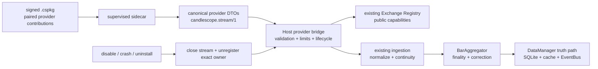

# CandleScope 通用插件平台 v2 — Phase 10 执行记录

日期：2026-07-23
分支：`codex/plugin-platform-v1`
状态：实现与技术验收完成；本文件与实现组成 Phase 10 独立阶段提交

## 1. 阶段结论

Phase 10 已把公开市场数据源从 CandleScope 私有的进程内 exchange adapter 扩展为公开、成对、
fail-closed 的 sidecar 合同：社区插件可声明 `symbol-provider/1` 和
`market-data-provider/1`，向 Host 提供符号、历史 K 线、实时 K 线与 full-depth 订单簿。

插件只产生 canonical provider DTO。exchange 注册、capability 投影、分页、速率与并发、stream
生命周期、重连、sequence 校验、规范化、连续性、BarAggregator、SQLite、GapLedger 和 EventBus
仍由 Host 所有。Phase 10 没有向插件开放数据库、cache、Host Python 对象、账户、secret 或交易能力。

## 2. 冻结贡献合同

一个 exchange ID 必须同时声明一项 `symbol-provider/1` 和一项
`market-data-provider/1`，两者必须属于同一插件、使用同一 backend entrypoint，并声明相同 exchange。
Host 在激活前拒绝缺少配对、重复 exchange、entrypoint 漂移、market 漂移、provider ID 非法、未知字段、
超限 page/batch/rate/concurrency 以及与现有 Binance、OKX 或其他已注册 exchange 的 ID 冲突。

`symbol-provider/1` 声明：

- exchange、展示名和 `spot|futures` market descriptor；
- product type、calendar、timezone；
- `maxPageSize` 与 Host 侧 symbol cache TTL。

`market-data-provider/1` 固定使用 `candlescope.stream/1`。Phase 10 仅允许：

- `kline`：可分别声明 history/realtime、interval、append delivery、finality、correction、page/batch/rate；
- `full_depth`：realtime、snapshot + ordered delta、range sequence、snapshot replay resync、最大档位；
- source quality：`authoritative|verified|best-effort|synthetic`、finality 与 timestamp ownership。

SDK `provider.py` 提供严格 request/response DTO、unknown-field rejection、数值/字符串/排序/边界校验和
以下固定 schema：

- `candlescope.provider-symbols-page/1`；
- `candlescope.provider-history-page/1`；
- `candlescope.provider-stream-open/1`；
- `candlescope.provider-stream-batch/1`；
- `candlescope.provider-stream-close/1`。

sidecar 只处理五个 operation：`symbols.list`、`history.read`、`stream.open`、`stream.poll`、
`stream.close`。不存在任意 method、任意 WebSocket URL 或直接 REST transport 逃生口。

## 3. Host 注册与生命周期

`PluginProviderRuntime` 在插件 entrypoint 启动并完成 contribution validation 后，才把 provider 投影为
`ProviderExchangePlugin` 并原子注册到既有 Exchange Registry。注册失败会按逆序撤销已经写入的动态项；
unregister 需要 exact provider owner，旧插件不能删除同名的新 generation 或内置 exchange。

启动时 Host 绑定既有 `refresh_exchange_metadata`，因此 provider symbols 经过与内置 exchange 相同的
symbol cache/API。provider 内部按 manifest 的 `cacheTtlSeconds` 做逐 market singleflight 缓存；只有完整页集
验证成功才发布。disable、uninstall、entrypoint 失效或 platform stop 会先关闭 provider session，再按
exact owner 删除 exchange registration，并同步清除 Host exchange metadata cache；不会留下指向死亡
sidecar 的 registry 或 symbol cache 项。

重新启用会创建新的 supervisor。旧 supervisor 完全停止后，Host 才忘记对应 owner 的 generation
tombstone，使新 supervisor 可以从 generation 1 激活；同一 supervisor 内 generation 仍严格单调，旧异步
结果仍不能覆盖新 owner。本阶段为该 disable → enable 路径增加了真实 sidecar 与 Manager 回归测试。

公开 `/api/v1/exchanges/` 仍使用 capability schema v3。provider 只新增 transport 枚举
`plugin_stream` 和 connection model `plugin_sidecar`，没有建立第二套前端 exchange contract。

## 4. Symbols 与历史分页

Host 使用声明的 page size 调用 `symbols.list`，逐页验证 exchange、market、全局 symbol 排序、cursor
前进和 source quality。空页未结束、cursor 重复、跨页倒序或超过 256 页都会 fail closed；只有完整验证后
才更新 Host symbol cache。同一 market 的并发读取只触发一次 sidecar 分页；TTL 内复用完整快照，TTL 后
重新取数，disable 时同时逐出 provider 层与 Host 层缓存。

历史查询由现有 BackfillEngine 决定 range、limit 与反向分页。provider bridge 每次最多请求 contribution
声明的 `maxPageSize`，验证 descriptor、row 数、open/close time、OHLCV、finality、correction、
`nextBeforeMs` 和 exhausted，再转换为 `DataSource.PLUGIN` 的 `RawMessage`。之后仍走现有 normalizer、
reconciler、BarAggregator 与 storage；provider 自己不能标记 GapLedger，也不能直接提交 SQLite 事务。

确定性真实 sidecar 测试以 history page size 2 请求 5 根 K 线，恰好产生 3 次 provider history 调用并写入
5 行，证明边界页没有额外 probe 或请求放大。

## 5. 实时、重连与 correction

`ProviderStreamSession` 是 Host-owned L2 session。它生成 opaque Host stream ID，限制 batch 与 wait，
验证 provider stream ID、generation、首尾 transport sequence、descriptor 和 event 数量；不连续 batch
不会进入 normalization。失败使用既有 reconnect backoff，重开时显式传入 `resync=true`，旧 stream 被
best-effort close，其他 exchange registry 与 pipeline 不受影响。

K 线事件区分：

- `bar.updated` / `forming`：更新当前未闭合 bar；
- `bar.closed` / `final`：进入正常 finality 路径；
- `bar.amended` / `corrected`：携带 `is_correction=true`，允许回访已关闭时间戳，但不回退 continuity
  cursor；BarAggregator 以 authoritative correction 合并并发出 `AMENDED`。

普通重复、缺口和乱序仍由既有 continuity 层确定性处理，只有显式 correction 获得窄例外。

full-depth stream 必须从 snapshot 开始。每个 delta 的 previous/final/range ID 必须覆盖前一
`lastUpdateId + 1`；一旦出现 sequence gap，整批 delta 在进入 consumer 前被拒绝，session 重连并要求
snapshot replay。snapshot/delta 的 bids、asks 还必须满足 manifest 声明的 `maxDepthLevels`；超限批次同样
在 consumer 前被拒绝并触发 resync。坏 delta 不会污染现有 order-book state。

## 6. Mock Exchange 参考插件

SDK wheel 新增 `candlescope-mock-exchange-provider` console entry、manifest 与纯公开 SDK 实现。参考插件：

- 提供 `mock` spot 下 BTCUSDT、ETHUSDT；
- history 支持 1m/5m、确定性 reverse-time page 与 explicit finality；
- realtime 循环产生 closed、forming、amended K 线；
- full depth 产生 snapshot 与可连接的 ordered delta；
- source quality 明确为 `synthetic`；
- 不导入 `app.*`，不持有账户、credential、订单或 Host storage handle。

真实 `.cspkg` fixture 会完成 build、SHA-256、install、supervised sidecar activation、catalog、symbol
refresh、history/backfill、stream 和 disable/unregister，而不是用进程内 fake 假装 package 可交付。

本次浏览器 bundle digest 为
`sha256:a7023beb984869f30f5019b152e84854f8b3afb92de93f5998d8a374387fc40a`。

## 7. Plugin Manager 与前端边界

前端 parser 对两类 provider contribution 做独立的严格结构校验。Provider contribution 只进入
Plugin Manager 与公共 exchange capability，不会注册为 command、view、chart layer 或 Sandbox UI。

Manager 展示 exchange/market、symbol page/cache、channel、history/realtime、interval、delivery、
finality/correction、rate、concurrency、data plane 和 source quality，并固定提示：
“Host-owned ingestion only；public data；no account, secrets, or trading access”。

## 8. Binance / OKX 公共合同 parity

这里的 parity 指三者进入相同 capability schema、公开 symbol/history/stream API 和 DataEngine 真相路径；
不声称社区 provider 已复制所有内置交易所频道。

| 能力 | 内置 Binance | 内置 OKX | Phase 10 provider（Mock） |
| --- | --- | --- | --- |
| market | spot、futures | spot、futures | manifest 声明；Mock 为 spot |
| Kline history + realtime | 是 | 是 | 是 |
| Kline 单页上限 | 1000 | 300 | manifest 声明；Mock 为 500 |
| realtime transport | WebSocket / REST poll | WebSocket / REST poll | supervised `plugin_stream` |
| 当前公共频道 | kline、trade、depth、full-depth、ticker、funding 等 | kline、ticker | Phase 10 固定 kline、可选 full-depth |
| full-depth sequence/resync | 内置 adapter | 当前未暴露 | snapshot + range delta + snapshot replay |
| finality/source/correction | 内置 normalizer | 内置 normalizer | wire 上显式声明并由 Host 校验 |
| symbol/history/stream 公共 API | 既有 API | 既有 API | 同一既有 API |
| storage/cache/EventBus owner | Host DataEngine | Host DataEngine | Host DataEngine |
| 账户/交易 | 不属于本合同 | 不属于本合同 | 明确禁止 |

Mock provider 没有真实 quote volume、trade count 或 taker-buy 数据，因此 capability 把这些字段列为
`unavailable_fields`，不会因为 canonical Kline DTO 中存在零占位而虚假宣称可用。

## 9. 真实冷库与浏览器证据

最终 artifact 位于 `output/playwright/phase10-final-lifecycle/`，已由 `.gitignore` 排除。验收使用不存在的
SQLite 文件、全新 platform root、真实安装的 Mock `.cspkg`、真实 supervised sidecar、完整 DataEngine
runtime、production Vite build 和 headed Chromium：

- 启动前 `coldAtStart=true`、`initialRows=0`、`PRAGMA quick_check=ok`；
- 浏览器打开 Mock BTCUSDT/1m 后，首轮历史落库 1500 行、图表 1501 bars、provider restart=0；
- UI 禁用后健康端点仍返回 200，supervisor 计数为 `null`、`registeredExchanges=[]`、Mock symbol count=0，
  内置 Binance/OKX 不受影响；
- UI 重新启用后 catalog 为 `active/available`、Mock registration 与 BTCUSDT/ETHUSDT 立即恢复，没有
  `PLUGIN_PLATFORM_STALE_GENERATION`；
- 客户端重新订阅后命中新 sidecar generation，provider requests 从 4 增至 642、restart 仍为 0；
- realtime/correction 后 BTCUSDT 为 1502 行 1m、300 行 5m、99 行 15m、24 行 1h；
- symbol selector 真实切换 ETHUSDT，得到 1501 行 1m、299 行 5m、99 行 15m、24 行 1h；
- Plugin Manager 显示 active provider、完整 public market-data contract、Health、rollback、retention 与
  no-permission 状态；
- 浏览器控制台 Provider/Plugin Manager 主链路为 0 error。

浏览器保留的重复 warning 来自既有 Volume indicator WS `clientId` 解析，不属于 provider 链路；本阶段
没有扩大范围修改指标协议。截图、server log、SQLite、bundle 与 CLI snapshot 均只保留在上述 artifact。

## 10. 自动化门禁

| 门禁 | 最终结果 |
| --- | --- |
| Phase 10 SDK provider focused | 6 passed |
| SDK 全套 | 76 passed；Ruff check/format check 通过 |
| SDK wheel + sdist + fresh isolated package smoke | 通过；console entry、module、manifest 均进入 wheel |
| Phase 10 backend focused | 9 passed |
| provider、exchange cache、stream、main lifecycle、Manager targeted | 45 passed |
| backend 全仓串行 | 2068 passed；4 个既有 FastAPI lifespan deprecation warnings |
| frontend 全套 | architecture、Plugin Platform architecture、typecheck、lint、2351 tests、production build 全通过 |
| 新增 Provider Python 文件 | Ruff check/format check、compileall 通过 |
| 所有变更 Python 文件 | Ruff check 在忽略 4 个既有 F401 后通过；没有自动重排旧 DataEngine 文件 |
| 真实冷库 headed Chromium | 0 console errors；cold SQLite、两 symbol、禁用/启用、Manager、history/realtime 均通过 |

## 11. 保留边界与下一阶段

Phase 10 没有交付：

- 任意自定义 channel、任意 wire schema、插件自建 Host WebSocket/REST 路由；
- direct cache/SQLite/GapLedger/EventBus access；
- 私有 API key、OAuth、secret broker、账户、余额、持仓、下单、撤单或 risk gate；
- publisher identity、远程 Marketplace、自动下载、签名撤销或更新服务；
- 宣称 Mock synthetic data 是真实交易所连接器。

disable 会立即使旧 generation 的 provider stream 失效；重新启用会恢复 registry、symbol/history 与新
stream，但不会把已打开的客户端订阅静默迁移到新 generation，客户端需要重新订阅。这是本阶段明确的
fail-closed 边界，不能让旧 session 在插件重新启用后自行恢复权限。

下一阶段只能进入 Phase 11A 的 paper-only 账户与订单合同。live trading 必须继续等待 secret broker、
publisher trust、risk gate、idempotency、kill switch 和完整审计全部落地，不能把 public provider
entrypoint 升格为交易权限。

## 12. 回滚

Phase 10 没有产品数据库 schema migration，也没有改变 v1 script runtime wire 或 manifest v2 顶层
schema。独立 revert 本阶段提交会移除 provider SDK DTO/example、Host provider bridge、动态 exchange
registration、`plugin_stream` transport、Manager provider 展示、测试与本文；Phase 0～9 的插件安装、
权限、核心扩展、market consumer、UI 与 integration gateway 仍可工作。

紧急回滚时先 disable provider plugin，确认 `registeredExchanges=[]`、provider session 已关闭，再 revert。
旧 Host 会对未知 `symbol-provider/1` / `market-data-provider/1` fail closed，不会把 bundle 降级为能够
直接联网或写库的普通插件。回滚不会隐式删除已经由 Host DataEngine 合法写入的公共历史数据。
