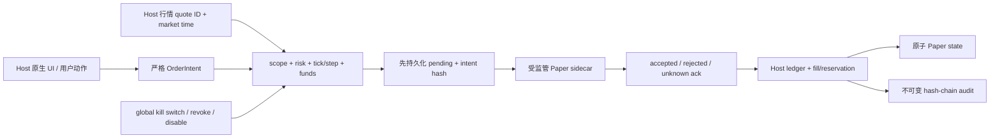

# CandleScope 通用插件平台 v2 — Phase 11A 执行记录

日期：2026-07-23
分支：`codex/plugin-platform-v1`
状态：实现、全量门禁、分发 smoke 与真实浏览器证据全部完成

## 1. 阶段结论

Phase 11A 交付的是 **Paper-only 插件合同**，不是把插件平台变成实盘交易终端。一个显式固定的
first-party bundle 可以声明 `account-provider/1` 与 `order-executor/1`；插件只接收严格请求并返回
`accepted|rejected|unknown` ack。账户账本、持仓、订单、行情选择、成交价、风控、资金冻结、幂等、
恢复、不可变审计和全局 kill switch 全部由 Host 所有。

`secrets.use`、`network.connect`、`trade.submit`、`trade.cancel` 在本阶段仍不可授予。参考 bundle 没有
credential handle、真实账户 endpoint 或 raw socket。即使磁盘上残留此前在 Paper policy 下确认过的 grant，
新进程未显式打开 policy 时也不会把它投影为 effective capability。



## 2. 双重显式策略门

产品 Plugin Platform 继续默认关闭。Paper 还需要独立的显式策略：

```powershell
$env:CANDLESCOPE_PLUGIN_PLATFORM_V2_ENABLED='1'
$env:CANDLESCOPE_PLUGIN_PLATFORM_V2_TRUST='first-party-pinned'
$env:CANDLESCOPE_PLUGIN_PLATFORM_V2_PAPER_TRADING_ENABLED='1'
```

只有 `paper_trading_enabled=True` 且 `trust_level=first-party-pinned` 时，Grant Store 才允许
`accounts.read` 与 `trade.simulate`。`local-trusted`、`untrusted` 或默认环境打开 Paper flag 都会直接失败；
本阶段没有 `verified-publisher`，也没有自动把本地开发 bundle 提升为 pinned。

Grant Store 在 grant mutation、required satisfaction、activation readiness、effective-grant projection 和
capability binding 五个位置重新检查当前 policy。这样关闭 policy 后，旧 grant 记录可以保留作审计，但不能
重新激活 broker 或产生 handle。

## 3. 冻结贡献合同

每个 `brokerId` 必须恰好声明一项 `account-provider/1` 和一项 `order-executor/1`，属于同一插件并使用
同一 backend entrypoint。重复 broker、缺少配对、entrypoint 漂移、未知字段或任何 live environment 都在
sidecar 启动前失败。

账户贡献声明：

- `environment: paper`；
- 展示名与 1–16 个 fixture account；
- account ID、base currency；
- canonical decimal string 形式的初始余额。

执行贡献固定 `protocol: candlescope.paper/1`，声明：

- `market|limit` order type；
- symbol、market type、base/quote asset；
- price tick、quantity step、最小/最大 quantity 与 notional；
- 每单、持仓、open order、每分钟提交限制；
- quote 最大年龄；
- Phase 11A 固定 `allowShort=false`。

manifest 必须把 `accounts.read` 与 `trade.simulate` 列为 required permission，scope 精确覆盖 broker、account、
symbol、market、order type 与所有上限。Paper contribution 一旦同时请求 `network.connect`、`secrets.use`、
`trade.submit` 或 `trade.cancel`，整个 bundle fail closed。

## 4. SDK 与 wire

`platform_v2.paper` 使用 dependency-free exact-shape DTO。金额、价格和数量一律使用最长 128 字符、无指数、
无多余前导/尾随零的 canonical decimal string，禁止用 JSON float 传递金融值。

`OrderIntent` 固定包含：

- broker/account、client order ID、idempotency key；
- symbol/market、buy/sell、market/limit；
- quantity、limit price（market 必须为 null，limit 必须非 null）；
- Host quote ID 与精确 `observedMarketTimeMs`。

sidecar operation 只有：

- `accounts.snapshot`；
- `orders.submit`；
- `orders.cancel`；
- `orders.recover`。

账户使用 `candlescope.paper-account-snapshot/1`；executor 使用
`candlescope.paper-executor-ack/1`。ack 只能表达 operation、target、idempotency identity、
`accepted|rejected|unknown`、opaque executor order ID 或 reason code。插件不能在 ack 中提交 fill price、fee、
balance、position 或 risk override。

## 5. Host-owned ledger 与风控

Host 接受 order 前依次执行：

1. active broker 与当前 effective grant；
2. account、symbol、market 与 order-type scope；
3. global kill switch；
4. exact quote ID、相同 market time、非未来且未过期；
5. quantity step、price tick、symbol min/max；
6. 每单 quantity/notional、position notional、open-order、rate limits；
7. account funds 与重复 client-order identity；
8. idempotency intent hash。

市价单只使用 Host quote 的 ask/bid。可立即成交的限价单也以 Host ask/bid 成交；所有订单在持久化 pending
之前先由 Host 冻结最坏成交所需的 quote/base asset，unknown 与进程重启期间继续保留冻结，rejected/cancelled/
kill 才释放。未穿价限价单由后续 Host quote 在同一串行锁内决定成交。撤单、quote fill 与 kill switch 共用
一条状态序列，避免 cancel/fill 双重结算；持仓上限同时计入 open/unknown/pending 的最坏方向敞口。Phase 11A
不收模拟 fee，也不宣称 queue position 或交易所撮合精度。

Paper state 原子写入：

```text
plugin-platform-v2/paper-v1/paper-state-v1.json
```

disable、uninstall 与 revoke 保留账本和审计，但立即删除 active broker projection；下一次 submit/cancel/recover
因 broker 不可用而失败。重新授权不会绕过原有 persisted idempotency record。

## 6. 幂等、unknown 与恢复

Host 用 `broker/account/idempotencyKey` 绑定 canonical OrderIntent SHA-256。同 key、同 intent 返回已持久化
结果且不再调用 sidecar；订单后续 fill/cancel/kill 会同步该结果的最新状态。同 key、不同 intent 拒绝为
conflict。submit 与 cancel 的幂等记录分别达到 10,000 时 fail closed，不静默逐出仍可能参与恢复的旧 key。

Host 在 sidecar invocation 前先写入 `pending`。进程重启发现 pending 时只转换成 `unknown`，不会盲目重发。
只有显式 `orders.recover` 才查询 executor；accepted recovery 最多执行一次原始 intent，使用记录中冻结的原始
Host quote。timeout、坏 ack、sidecar crash 都收敛为 unknown，不假定“失败就是没下单”。

## 7. 审计与 kill switch

submit、cancel、recover、Host limit fill 与 kill-switch mutation 都进入既有 immutable hash-chain Audit Log。
审计只写 broker/account/order/idempotency/intent hash/quote ID 和结果，不写 secret 或请求 body。

全局 kill switch 持久化在 Paper state 中：

- 打开后立即释放并取消 Host 中 open/unknown/pending Paper order；
- 后续 submit 在 sidecar 调用前拒绝；
- cancel 作为降风险操作不因 switch 被禁止；
- 恢复提交需要 Host 原生管理 session、CSRF 与 user-action；
- switch 不会产生或撤销任何 live capability，因为本阶段根本没有 live capability。

## 8. 管理 API 与原生 UI

所有 Paper API 位于现有 loopback-only、exact-Origin、ephemeral-session 管理边界内：

- `GET /api/v2/plugins/manage/paper/status`；
- `GET /api/v2/plugins/manage/paper/accounts/{brokerId}/{accountId}`；
- `POST /api/v2/plugins/manage/paper/orders/submit`；
- `POST /api/v2/plugins/manage/paper/orders/cancel`；
- `POST /api/v2/plugins/manage/paper/orders/recover`；
- `POST /api/v2/plugins/manage/paper/kill-switch`。

mutation 继续要求 CSRF 与 fresh user-action ID。malformed public DTO 返回 400；风控、kill、撤权和状态冲突返回
稳定 409 code。公开 catalog 不暴露账户 snapshot、Paper state path、sidecar executable 或 capability handle。

前端严格解析两类 Paper contribution，并显式从 command/view/settings registry 排除。Plugin Manager 原生面板
展示 fixture account、symbol/order type、风险上限和全局 kill switch，固定提示“无 live credential、live
submission 或插件网络”。sandbox iframe 没有 management bootstrap token，不能覆盖或伪造 Host 风控/确认。

## 9. Paper Broker 参考 bundle

SDK 新增 `candlescope-paper-broker` console entry、manifest 与纯公开 SDK 实现。fixture broker：

- `fixture-paper/paper-main`，初始 100,000 USDT 与 2 BTC；
- BTCUSDT spot，market/limit，固定 tick/step/limits；
- 普通 submit/cancel 返回 accepted；
- `reject-*` key 提供确定性 rejected fixture；
- `unknown-*` submit 返回 unknown，显式 recover 返回 accepted；
- 不导入 `app.*`，不连接网络，不持有 credential，不修改 Host ledger。

真实 `.cspkg` 测试覆盖 wheel build、outer SHA-256、install、显式双 grant、enable、lazy supervised sidecar、
management API、disable/revoke 和 shutdown，而不是仅用进程内 fake 证明合同。

## 10. 验证矩阵

| 门禁 | 结果 |
|---|---|
| SDK `pytest` | `80 passed`；覆盖 exact-shape、canonical decimal、manifest、unknown/recover |
| SDK `ruff check` / `ruff format --check` | 通过，47 个 Python 文件保持格式 |
| SDK wheel/sdist build + fresh-venv smoke | 通过；安装后新进程验证 Paper protocol、manifest resource 与 console entry；wheel SHA-256 `af7d807f296aa40c4d6861844ba019919cf06e2ec78c9e50c6224466c52b3f20`；sdist SHA-256 `615788786824c931e04b53f44b4a00ce02e1c0b8192ccadf62fd973f7499a295` |
| Paper ledger 聚焦测试 | `7 passed`；含 reservation/cancel/fill、unknown restart/recover、最坏敞口、加权均价、幂等同步 |
| real bundle/Core/grant 聚焦测试 | `9 passed`；含 pinned policy、policy downgrade、真实 supervised sidecar 与 guarded API |
| backend 全量 | `2078 passed, 4 warnings`；warning 均为既有 FastAPI `on_event` deprecation |
| frontend 完整 `npm run check` | architecture、plugin architecture、typecheck、ESLint、`2352 passed`、production build 全通过 |
| real headed browser | production build；Paper 原生面板与 live 边界可见；下单 `200/filled@100.5`；余额 BTC `2.1` / USDT `99989.95`；UI kill switch 为 ON；后续 submit 为 `409 PLUGIN_PAPER_KILL_SWITCH` |
| browser/runtime 健康 | 预期 409 前 console `0 errors / 0 warnings`；server error lines `0`；sidecar restarts `0`；最终 audit events `7` |

浏览器使用真实 `.cspkg`、受监管子进程、loopback management guard 与生产前端，不是 mock DOM。bundle SHA-256 为
`sha256:08feef5b678fe87d04b06915fa2174dcff1e167ab3833e03405496a0856e1820`。截图位于
`output/playwright/phase11a-paper-20260723-d/paper-kill-switch-on.png`，SHA-256 为
`decec99849409079d60e2fd83879f50ee70e7b61d1420ee77769fbe5d234f835`。预期的 409 请求执行后，Chromium 会把
该 HTTP 拒绝额外记为一条 failed-resource console entry；零错误快照在该负向请求之前获取，服务端仍无 traceback。

## 11. 明确保留边界

Phase 11A 没有交付：

- API key、OAuth、secret broker 或 credential handle；
- 实盘账户同步、交易所 order query、submit/cancel network adapter；
- fee、slippage model、queue position、partial fill 或交易所级撮合精度；
- short、margin、leverage、liquidation、funding 或 cross-account netting；
- verified publisher、签名撤销、Marketplace 或自动更新；
- “任意插件可交易”或“Paper 已证明 Live 安全”的声明。

因此 Phase 11B 仍不得直接开始。必须先设计不暴露明文的 secret broker、publisher trust、live account
canonicalization、exchange idempotency/reconciliation、醒目 live confirmation 和网络级 kill/revoke 证据。

## 12. 回滚

本阶段没有业务 SQLite migration，也不改变 v1 script runtime、Pyne/Pine wheel 或公开 indicator wire。
独立 revert 会移除 Paper SDK DTO/example、Host ledger、两类 contribution、受控 API/UI、测试和本文；
Phase 0–10 保持可用。

紧急回滚先打开 global kill switch，再 disable Paper plugin，确认 `paper.status.brokers=[]` 与 sidecar 已停止，
随后 revert。旧 Host 会把 `account-provider/1` / `order-executor/1` 当成 unsupported contribution，且仍不会
授予 `accounts.read`、`trade.simulate` 或任何 live permission。Paper state 与 immutable audit 默认保留，避免
回滚意外删除用户证据；删除数据必须是另一个显式、可审计操作。
