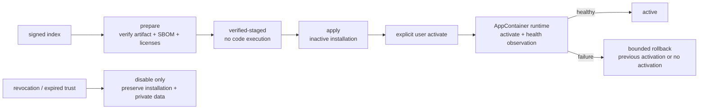

# CandleScope 通用插件平台 v2 — Phase 12 执行记录

日期：2026-07-23
分支：`codex/plugin-platform-v1`
状态：实现与技术验收完成；本文件与实现组成 Phase 12 独立阶段提交

## 1. 阶段结论

Phase 12 已交付默认关闭、fail-closed 的签名 Marketplace 生命周期。CandleScope 现在可以从
Host 配置的 Marketplace root 验证 Ed25519 签名索引、publisher key、不可变 release、
SHA256SUMS、CycloneDX SBOM、依赖许可证和 transparency hash chain；通过验证的 artifact 只能按
“下载并校验 → verified staged → inactive install → 用户显式激活 → 真实运行时健康观察”的顺序进入产品。

这不是“签了名就可信运行”。`verified-publisher` 只证明 bundle 与发布者、索引和不可变 artifact
之间的来源绑定；社区后端仍按 `untrusted` 代码运行于 Windows AppContainer，权限继续由 Grant Store
和 Host capability broker 独立决定。Marketplace 不保存 publisher 私钥、不替 publisher 签名，
也不能增加权限、覆盖本地/第一方 activation、自动更新或自动激活。

本阶段没有执行真实 Demo/真钱网络测试，也没有打开 WP-G。Phase 11B 的 Live 资格仍只接受独立的
build-pinned first-party release evidence；Phase 12 的 `verified-publisher` 不会自动获得 credential、
账户、`trade.submit`、`trade.cancel` 或 production authority。

## 2. 信任链与不可变发布

生产信任从 Host 随构建固定的 `official-marketplace-roots.json` 开始。仓库默认文件故意是空 roots，
Marketplace feature flag 也默认关闭；启用但没有至少一个 `enabled` root 会在组合根构造时失败。
每个 root 固定 marketplace ID、HTTPS index URL、Ed25519 key ID 与公钥。测试/打包流程可通过
`CANDLESCOPE_PLUGIN_PLATFORM_V2_MARKETPLACE_ROOTS` 注入另一份严格 roots 文件，但管理 API 和插件
都不能修改 root。

签名层次如下：

1. root key 签名 canonical Marketplace index；
2. index 固定 sequence、生成/过期时间、前一 index SHA-256、source origin 与 transparency head；
3. index 声明 publisher ID、状态、Ed25519 key ID 和公钥；
4. publisher key 签名每个 release statement；
5. release statement 固定 plugin/version/publisher、artifact URL/size/SHA-256、manifest SHA-256、
   SBOM SHA-256、SHA256SUMS、顶层许可证和每项 wheel 依赖许可证；
6. 每个 release 进入连续、带前驱摘要的 transparency record chain。

严格 JSON parser 拒绝重复 key、未知字段、非 canonical bytes、非有限大小、非 UTC `Z` timestamp、
无效 SemVer、错误 key ID、签名、摘要、顺序或 transparency head。已接受的 index 只能沿
`sequence + 1` 和 `previousIndexSha256` 前进；同 sequence 原地替换、跳号、回退或删除既有
revocation 都被拒绝。一个 artifact digest 也不能同时属于多个 Marketplace root。

## 3. 下载、缓存与离线策略

默认 fetcher 只接受 canonical HTTPS 443 URL，不使用环境 proxy，不跟随 redirect，不接受压缩响应，
限制 index 和 artifact 字节数。DNS 结果在连接前重新解析并逐项验证为 public/global IP，再把 TLS
SNI/hostname verification 固定到原 hostname；loopback、私网、link-local 或伪造 resolver 返回值均
fail closed。

通过验证的 index 与 `.cspkg` 都按 SHA-256 content address 原子写入：

```text
plugin-platform-v2/
├── official roots（Host build/config）
├── marketplace-state-v1.json
├── marketplace-v1.lock
└── marketplace-v1/
    ├── indexes/<index-sha256>.json
    └── artifacts/<bundle-sha256>.cspkg
```

已存在的 content-addressed 文件如果内容不同会被视为 immutability violation，不会覆盖。离线启动会从
缓存重新执行 root、签名、digest、index chain、expiry 与 revocation 校验；root 消失、cache 被改写或
index 过期时，该缓存不能继续授权 `verified-publisher` activation。既有 active release 若失去当前有效
信任或进入撤销范围，会在下一次策略 reconciliation 被 disable，但 installation 与插件私有数据保留。
Host 对运行中的 Marketplace activation 每 60 秒重新执行一次该策略，因此内存中的旧 index 也不能在
过期后无限期继续授权；所有新的目录、prepare、apply、activation 与 trust 查询则立即按当前时间拒绝。

## 4. 更新状态机



`prepare` 下载或接收精确版本 artifact，并重新验证 bundle envelope、manifest、SBOM、SHA256SUMS、
依赖和许可证绑定；只生成 `verified-staged` candidate，不调用插件。candidate 同时记录：

- 当前版本、目标版本、publisher、Marketplace 与 bundle digest；
- permission diff；
- Host compatibility；
- migration policy；
- health observation 状态。

`apply` 再次验证当前 index、revocation、ownership 和 content-addressed artifact，然后以
`enabled=false` 安装为 `activation-staged`。新增权限不会被隐式 grant；即使 permission diff 为空，
也没有自动激活。Phase 12 只允许同一 Marketplace、同一 publisher、同 SemVer major 的更新；major
升级因没有显式迁移合同而拒绝。

`activate` 是独立的 Host management mutation。Host 启用 staged activation 后，对每个 backend
entrypoint 执行真实 sidecar `activate` 和 `health` 请求。全部 ready 才把 candidate 标记为 `active`；
任一 entrypoint 失败会沿 installer history 做最多 8 步的有界回滚，直到恢复先前 digest 或回到无
activation，再把 candidate 标记为 `rolled-back`。回滚失败本身也 fail closed，不把观察失败包装成成功。

Marketplace 的 `automaticUpdates` 永远为 `false`。它可以报告有新版本，但不能代表用户按下 prepare、
apply 或 activate。

## 5. Ownership、撤销与权限边界

- Marketplace 不能覆盖相同 plugin ID 的 `local-developer`、local artifact 或
  `first-party-pinned` activation；
- 一个 Marketplace/publisher 不能替换另一个 Marketplace/publisher 的 activation；
- 本地上传 bundle 会记录独立 `local-developer` 来源，不能把已签名 digest 重新标成本地以绕过撤销；
- revocation 支持 publisher、plugin 和精确 release scope，且只能 append；
- refresh/import index 后立即执行 trust-policy reconciliation；撤销或失去有效 root 的 active
  marketplace plugin 会 disable，下一次启动也不能恢复；
- disable/revocation 不删除 installation、history、settings、Grant Store 或 private storage；
- Marketplace metadata 不参与 Grant Store 决策，不可写入 effective capability；
- `verified-publisher` 不等于 first-party Live release evidence，公开 Live/secret 权限仍不可授予。

## 6. Windows 不可信运行时

签名社区 bundle 的 install probe 和正常 backend entrypoint 都必须使用 Windows AppContainer。
Phase 12 不复用宿主 Anaconda/系统 Python 的大目录授权，而是从当前 Host Python 构建并校验一个
content-addressed pinned runtime：stdlib zip、解释器 DLL/EXE 和必要 runtime 文件逐项散列，缓存命中时
重新验证 manifest。AppContainer 只获得该 runtime root、精确 installation 和协议所需目录的只读访问。

为避免 Windows `MAX_PATH` 破坏隔离启动，本阶段把 sandbox token 和临时 IPC 路径改为有界短名；为保证
JSONL RPC 可以在 stdin 未 EOF 时工作，runner 使用可立即返回的 buffered `read1` 转发。新增原生 C
probe 验证第一条 JSONL 在 writer 保持打开时也能收到响应，不允许把整个 stdin EOF 当作隐含协议条件。

非 Windows Host 不能据此宣称同等 OS sandbox；`verified-publisher` backend 在没有可证明的 sandbox
policy 时仍会在 probe 前失败。

## 7. Host API 与 Plugin Manager

公开、无敏感字段的 Marketplace catalog：

- `GET /api/v2/plugins/marketplace/catalog`

受 loopback、exact Origin、ephemeral session、CSRF 和 fresh user-action 保护的管理 API：

- `GET /api/v2/plugins/manage/marketplace/status`
- `POST /api/v2/plugins/manage/marketplace/{marketplace_id}/refresh`
- `POST /api/v2/plugins/manage/marketplace/{marketplace_id}/index`
- `POST /api/v2/plugins/manage/marketplace/{plugin_id}/prepare`
- `POST /api/v2/plugins/manage/marketplace/{plugin_id}/{version}/artifact`
- `POST /api/v2/plugins/manage/marketplace/{plugin_id}/apply`
- `POST /api/v2/plugins/manage/marketplace/{plugin_id}/activate`

Plugin Manager 严格解析 Marketplace catalog/status，展示 root/cache、publisher key、license、
artifact SHA-256、transparency、兼容性、migration、permission diff 和 observation。Refresh、
Download & verify、Apply inactive 与 Activate 是四个独立按钮/状态，不存在一个“Update”按钮跨越
所有安全门；激活还有 Host 原生确认。

API 返回的 catalog、status 和候选投影不包含 executable、安装绝对路径、publisher 私钥、PID、
stderr、capability handle、credential 或 secret。

## 8. Feature flags 与启动行为

```powershell
$env:CANDLESCOPE_PLUGIN_PLATFORM_V2_ENABLED='1'
$env:CANDLESCOPE_PLUGIN_PLATFORM_V2_MARKETPLACE_ENABLED='1'
$env:CANDLESCOPE_PLUGIN_PLATFORM_V2_MARKETPLACE_ROOTS='C:\build\official-marketplace-roots.json'
```

推荐生产包不设置 roots override，而由构建产物携带已审核 root。两个平台开关默认均为 `0`。默认
`official-marketplace-roots.json` 是空列表，因此当前仓库构建不会在误设单个 Marketplace flag 后开始
访问远端；显式启用但没有 enabled root 会直接报错。

关闭 Marketplace 不会删除 cache 或安装数据；它只使 refresh/prepare 等签名市场动作不可用。关闭整个
Plugin Platform 则继续使用既有 Phase 5 的零状态 disabled facade。

## 9. 自动化与浏览器验收

| 门禁 | 最终结果 |
| --- | --- |
| Phase 12 Marketplace contract/service | 15 passed |
| Phase 12 真实 management API/AppContainer 生命周期 | 1 passed |
| Plugin Core v2 回归 | 10 passed |
| Installer v2 回归 | 7 passed |
| Windows AppContainer（含交互 JSONL、pinned runtime 防重绑定） | 7 passed |
| 新增/变更 Python 文件 | Ruff format/check 通过 |
| frontend 全量 | architecture、Plugin Platform architecture、typecheck、lint、2361 tests、production build 全通过 |
| SDK 全量 | 80 passed；Ruff check/format check 通过 |
| backend 全量 | 2189 passed，4 个既有 FastAPI `on_event` deprecation warnings，446.96s |
| production build headed Chromium | 签名 refresh → verified stage → inactive apply → explicit activate/health → command 全通过；0 console errors、0 warnings |

API 生命周期测试不是纯 mock：它使用真实 `.cspkg`、真实签名 index、真实 inactive install、Windows
AppContainer probe、真实 sidecar activation/health，并注入一次 health failure 验证自动回滚后可再次
应用和成功激活。

最终浏览器 artifact 位于 `output/playwright/phase12-final-20260723-d/`（由 `.gitignore` 排除）：

- `phase12-marketplace-active.png`：production frontend 的 active `verified-publisher`、签名摘要、
  transparency、兼容性和 health observation；
- `browser-dom-evidence.json`：`marketplaceState=enabled`、一个 active candidate、publisher/health/
  command 五项断言；
- `health-final.json`：active registry、`automaticUpdates=false`、passed observation、AppContainer
  supervisor 和零 remote/failure 计数；
- `server.stdout.log` / `server.stderr.log`：最终 fixture 请求与错误流。

最终浏览器 bundle 为
`sha256:8b0cfe8ea330b9ca91cc84bf639649c7352168ade8eb8c15602f0c24b4f61b97`。
验收使用 headed Chromium、production Vite build、真实签名 `.cspkg`、真实 inactive install 和真实
AppContainer sidecar；页面明确显示 `activation-staged` 后才允许第二次用户确认。激活后
`Say hello` 命令从 UI 成功执行，浏览器控制台为 0 error / 0 warning。

## 10. 未交付与风险边界

Phase 12 没有交付：

- Host 内 publisher 私钥托管、在线签名服务、CA/PKI 或 publisher 身份审核业务；
- 用户可随意添加远程 Marketplace root 的产品 UI；
- 自动下载、自动 apply、自动 grant、自动 activate 或跨 major 自动迁移；
- delta update、后台静默更新、跨设备账号同步或商业计费；
- 把签名当作代码安全证明；
- Linux namespace/seccomp 或 macOS sandbox 的等价验收；
- community plugin 的 secret/Live 权限；
- 真实 OKX Demo credential/network smoke、production canary、真钱、WP-G 或资金动作。

真实 Demo/真钱测试以后必须作为独立授权、独立证据和独立回滚阶段处理，不能由 Phase 12 测试通过
自动触发。

## 11. 回滚

紧急情况下先关闭：

```powershell
$env:CANDLESCOPE_PLUGIN_PLATFORM_V2_MARKETPLACE_ENABLED='0'
```

然后重启 Host，确认没有新的 refresh/prepare/apply/activate 请求。对已撤销或可疑插件先执行 disable，
导出必要审计后再决定是否卸载；不要删除 `private/` 或 installation history。Marketplace state/index/
artifact cache 可保留用于取证，关闭 flag 不依赖删除它们。

本阶段没有改变 v1 indicator runtime wire，也没有开放新的 SDK 权限。独立 revert Phase 12 提交会移除
签名索引服务、Marketplace API/UI、pinned Python runtime 与相关测试；Phase 0～11 的本地安装、
Plugin Manager、Paper 与默认关闭的 WP-A～WP-F 技术路径仍可工作。若 registry 中已有
`verified-publisher` activation，revert 前必须先 disable，并确认回退版本不会把未知 trust label
误解释为更高权限。
