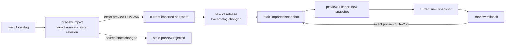

# CandleScope 通用插件平台 v2 — Phase 13 执行记录

日期：2026-07-24
分支：`codex/plugin-platform-v1`
状态：实现与技术验收完成；本文件与实现组成 Phase 13 独立阶段提交

## 1. 阶段结论

Phase 13 已把经过 v1 Host 校验的 Pyne/Pine script runtime 作为 Host 拥有的
`script-runtime/1` compatibility contribution 纳入统一 Plugin Catalog。产品现在只有一个
Plugin Manager 入口；即使 Plugin Platform v2 默认关闭，只要存在 v1 runtime，用户仍能在同一目录看到
runtime、语言、route mode、协议和固定 release digest。

这次收敛没有把 v1 bundle 或 activation 猜测转换成 v2：

- `.cspkg`、v1 registry、RuntimeHost、installer 与 route table 继续由 v1 所有；
- `candlescope.script-runtime/1`、`candlescope.render/1`、HTTP compute、HTTP range 和 Indicator
  WebSocket wire 保持冻结；
- compatibility import 只保存有界的公开 catalog snapshot，不执行脚本、不安装 bundle、不修改
  v1 activation；
- v1 endpoint 从内部 unified catalog envelope 投影回原始 wire，公开 schema 仍为数值型
  `schemaVersion: 1`；
- v2 contribution registry 不接受插件自行声明 `script-runtime/1`，因此 v1 进程不会由此获得任何
  v2 Host capability。

Phase 13 是 GA 技术门禁，不是 Live 交易授权。本阶段没有执行真实 OKX Demo、真钱、production canary
或 WP-G；Phase 11 的 credential、账户、Live submit/cancel 和资金边界完全不变。

## 2. 统一目录与责任边界

内部统一 envelope 为 `candlescope.unified-plugin-catalog/1`，对外 Plugin Catalog 升级为
`candlescope.plugin-catalog/2`，并新增必需的 `compatibility` read model：

```text
Plugin Catalog v2
├── platform / plugins                 # 原生 v2 lifecycle
└── compatibility
    ├── kind: script-runtime/1
    ├── protocol: candlescope.script-runtime/1
    ├── renderProtocol: candlescope.render/1
    ├── import                         # snapshot 状态，不是 activation
    └── contributions                  # 已验证的 live v1 routes
```

compatibility contribution 只公开：

- runtime ID、标题、版本和 package；
- language ID/name/extensions/aliases；
- `legacy`、`shadow` 或 `sidecar` route mode；
- descriptor features、availability；
- managed release 的不可变 bundle SHA-256。

公开响应严格排除 executable、绝对路径、PID、stderr、installation ID、activation ID、capability
handle、credential 和 secret。前端 parser 拒绝未知字段，compatibility contribution 也不会进入
command、view、settings、chart layer 或 sandbox iframe 的可执行 registry。

`/api/v1/indicators/runtimes` 在 `IndicatorRuntimeService` 完成现有 descriptor/route startup
validation 后生成 v1 read model，再经过 Host-owned unified envelope 投影。投影是只读 round-trip，
endpoint wire 不读取 import snapshot，也不会因为 v2 平台关闭或 compatibility state 损坏而停止
已验证的 v1 runtime。若合法 v1 descriptor 超出 compatibility UI 的有界公开约束，兼容目录隔离为
`invalid` 且 mutation fail closed；原 v1 wire 与原生 v2 plugin catalog 仍可继续使用。

## 3. 显式 import 与可逆状态机

独立状态文件为：

```text
plugin-platform-v2/
├── v1-compatibility-import-v1.json
└── v1-compatibility-import-v1.lock
```

状态使用 strict canonical JSON、原子替换和跨进程锁；文件大小、字段、timestamp、digest、snapshot
数量、history 深度、重复 ID、未知 revision 与 symlink 全部受限。最多保留 16 个 snapshot 和 8 层
rollback history。状态损坏时统一目录报告 `invalid`，所有 import/rollback mutation fail closed，
但 v1 endpoint、route 和 activation 不读取该文件。

状态转换为：



import quick repeat 在 source digest 未变化时返回 `changed=false`，不增加 revision。preview digest
覆盖 action、当前 state revision、live source digest、rollback target 和精确 change set；任何 v1
descriptor、route、managed bundle identity 或 state revision 变化都会使旧 preview 失效。

rollback 恢复前一 catalog snapshot，但不会把旧 v1 activation 写回 RuntimeHost。若当前 live release
已升级，回滚后的 snapshot 正确显示为 `stale`；真正的 bundle/activation 回滚继续走保留的 v1
installer 路径。

## 4. Host API、审计与管理 UI

公开目录：

- `GET /api/v2/plugins/catalog`

受 loopback、exact Origin、ephemeral management session、CSRF 和 fresh user-action 保护的兼容 API：

- `GET /api/v2/plugins/manage/compatibility/v1/status`
- `GET /api/v2/plugins/manage/compatibility/v1/import-preview`
- `POST /api/v2/plugins/manage/compatibility/v1/import`
- `GET /api/v2/plugins/manage/compatibility/v1/rollback-preview`
- `POST /api/v2/plugins/manage/compatibility/v1/rollback`

两个 POST 只接受精确的 `previewSha256`，成功 mutation 写入既有 tamper-evident audit chain，
category 为 `v1-compatibility`，action 分别为 `registry-import` 与 `catalog-rollback`。

Plugin Manager 展示 live v1 runtime、协议、route mode、release digest 和
`not-imported/current/stale/invalid` 状态。Import 与 rollback 必须分别 preview，再由浏览器原生确认
精确摘要后 apply；界面明确说明 v1 registry、installer、HTTP、range 和 WebSocket 不会被修改。
v2 disabled 时仍展示同一 runtime 目录，但隐藏 v2 bundle install、Marketplace 和其他 v2 mutation，
也不写 compatibility state。

## 5. SDK 模板、兼容矩阵与发布指南

SDK 中新增：

- `docs/v1-compatibility-adapter.md`
- `docs/v1-compatibility-adapter_zh.md`

文档继续以现有 `hello_runtime`、`hello-runtime.manifest.json`、v1 transcript 和 `protocol-v1.md`
作为作者模板，并固定以下发布顺序：

1. 从目标源码构建并散列每个 wheel；
2. 更新 v1 manifest、精确 wheel 集和 analyze/execute probe digest；
3. 生成一个不可变 `.cspkg` 并记录 release bundle SHA-256；
4. 在全新 Python 3.12/3.13 环境运行 transcript 与 package smoke；
5. 运行 installer check、fresh install、quick repeat、fresh-process semantic probe 和 rollback；
6. 验证 HTTP compute、range、Indicator WS 与 runtime catalog frozen fixture；
7. 在 Plugin Manager 审查并应用精确 compatibility preview。

兼容矩阵覆盖 pinned Pyne/Pine、社区 v1 runtime、原生 v2 plugin、不受支持的 v2
`script-runtime/1` 声明和 v1-only rollback。排障文档覆盖 stale preview、corrupt state、runtime
unavailable、bundle digest 漂移和 import 功能不可用。

## 6. 冻结 v1 契约

Phase 13 gate 重新计算 Phase 0 fixture，结果必须严格等于：

| 契约 | SHA-256 |
| --- | --- |
| SDK transcript | `sha256:021825fb264a63555e0eb331f24f6ea0632b0d2a0c962ef89a35673526391ba2` |
| HTTP compute | `sha256:b2467295cc14ec0e772e97fce195f236739cecb260e967190d73af305ab6f7ee` |
| HTTP range | `sha256:ba66866f0330d62f1121c3a5ff77d6339d786df796672c9795e78a293c1ebb26` |
| Indicator WebSocket | `sha256:6326a43822000618fe2feddcfe9b28b5a02e3663be106ef1dabfa511f6e418f2` |

新增的两版本 release gate 在临时 product root 中依次导入 release N 和 N+1，确认第二次是精确
`update`，再把 catalog snapshot 回滚到 N；最后以 `DisabledCorePluginPlatform` 启动
v1-only facade，确认 v2 plugin count 为 0、平台为 disabled、v1 wire 仍不变。

## 7. 正式门禁

最终提交前门禁结果：

| 门禁 | 本次结果 |
| --- | --- |
| Phase 13 compatibility + two-release gate | 通过；compatibility/two-release `8 passed`，installer lifecycle `7 passed`，受保护 catalog mutation `1 passed` |
| v1 Host/installer/HTTP/range/WS 回归 | 通过；四个 frozen wire digest 精确一致；固定 Release Pyne/Pine 为 `2/2 ready`，两个 fresh-process semantic probe 均 `ok=true` |
| Plugin Core v2、reference plugins、故障注入 | 通过；backend 全量 `2197 passed`，仅 4 条既有 FastAPI `on_event` deprecation warning |
| frontend architecture/typecheck/lint/tests/build | 通过；architecture、plugin architecture、typecheck、lint、`2364 passed`、production build |
| SDK lint/tests/build/package smoke | 通过；Ruff check/format、`80 passed`、隔离 build、fresh offline wheel install/package smoke |
| isolated cold SQLite market consumer/provider | 通过；共享 cold-bar 读取与真实 supervised provider sidecar 共 `2 passed`，产品数据库未改动 |
| Windows AppContainer 与 Marketplace API | 通过；真实 Windows AppContainer/Marketplace 聚焦回归 `8 passed` |
| production build headed Chromium | 通过；compatibility import/rollback 为 0 console error/warning；sandbox `12/12` 隔离探针均按预期阻断 |
| security review | 通过；无未解决 high finding，公开 catalog 未暴露路径、可执行文件、secret、credential 或 capability handle |

frontend 全量仍打印仓库已记录的并发 Vite middleware HMR `24678` 端口诊断和大于 500 kB
chunk 提示；门禁退出码为 0，且它们不是 Phase 13 新增回归。上表的 0 console error/warning
专指独立 headed Chromium compatibility 管理流程，不把测试 runner 噪声包装成浏览器零告警。

Phase 0 `standard` 基线也在相同 Windows 主机重跑。installer fresh、quick repeat、upgrade 与 rollback
分别确认 `changed=true`、`changed=false/reused=true`、`changed=true` 和恢复 `0.1.0`；固定 Release
Pyne/Pine fresh install 后 Host 启动为 `310.558 ms`。disabled registry 冷启动结果为：

| disabled entries | Phase 0 median / p95(max) | Phase 13 median / p95(max) |
| --- | --- | --- |
| 0 | `259.934 / 270.885 ms` | `284.794 / 340.949 ms` |
| 10 | `281.407 / 318.507 ms` | `279.446 / 304.653 ms` |
| 50 | `265.470 / 286.034 ms` | `288.878 / 298.027 ms` |

每档仅 5 个 fresh process，Phase 0 已明确这里的 p95 实际等于 max，不能视为稳定 SLO。0-entry
出现单次高点，但三档 median 仍处于同一数量级；Phase 13 compatibility 模块不在 registry 冷启动
测量进程的导入路径中，因此不把该样本差异归因于本阶段代码，也不隐瞒原始数值。

浏览器使用 production Vite build 与 headed Chromium，完成：

1. 打开单一 Plugin Manager；
2. 验证 Pyne `script-runtime/1` live contribution 与固定 bundle digest；
3. preview `add`，提交 exact import SHA-256，状态变为 `current`；
4. preview `remove`，提交 exact rollback SHA-256，状态恢复 `not-imported`；
5. 验证四个 compatibility management request 均为 HTTP 200；
6. 验证控制台 0 error / 0 warning。

浏览器证据位于被 `.gitignore` 排除的
`frontend/output/playwright/phase13-final-20260723/`：

- `phase13-v1-compatibility-rollback.png`：最终 rollback UI 状态；
- `phase13-sandbox-12-of-12.png`：opaque-origin iframe 与 Host `12/12` 隔离探针；
- `phase13-gate.json`：两版本 import/update/rollback 与 v1-only 结果；
- `phase0-standard-official-regression.json`：固定 Release runtime、installer、wire 与性能原始结果。

sandbox fixture 的主应用数据 API 和 CSP 攻击探针会产生预期的 blocked console noise；验收依据是
12 项探针全部阻断、无 uncaught/`TypeError`/`ReferenceError`/`SyntaxError`，且 health 保持
`runningEntrypoints=0`、`subscriptions=0`、`subresourceProbeRequests=0`。compatibility 管理流程本身
控制台为 0 error / 0 warning。

## 8. 故障与安全边界

本阶段新增或继承的 fail-closed 覆盖：

- stale preview、未知字段、重复 ID、非法 digest/timestamp/revision；
- corrupt/oversized/symlink compatibility state；
- disk full/atomic write failure 不产生部分 state；
- RuntimeHost unavailable、descriptor/route validation failure 不产生伪 contribution；
- Windows `icacls.exe` 失败输出按系统 locale 从 bytes 有界解码，非英文宿主不会因强制 UTF-8
  解码而把 AppContainer 权限失败误报成二次异常；
- crash、hang、cancel、stale generation、network loss 与 sandbox escape 继续由 Phase 2～12
  supervisor/gateway/sandbox 回归覆盖；
- compatibility catalog 不授予 permission，不接触账户、credential 或 Live authority；
- no-plugin 保持零状态，v1-only 不创建 v2 activation 或 compatibility import state。

兼容 snapshot 是公开发现数据，不是代码信任或执行授权。managed bundle SHA-256 只绑定当前 v1
release identity；它不会把 v1 publisher 自动提升为 v2 trust level。

## 9. 两个正式版本周期与回滚政策

从首个包含 Phase 13 的正式版本 N 开始，至少在 N 和 N+1 两个正式版本周期内保留：

- v1 RuntimeHost 与 registry loader；
- v1 `.cspkg` installer/check/quick-repeat/rollback；
- 原 HTTP compute、HTTP range 与 Indicator WebSocket routes；
- `/api/v1/indicators/runtimes` 旧 wire；
- 可关闭 v2 后启动的 v1-only 产品路径；
- 与 N、N+1 对应的固定 release artifact 和 SHA-256。

Phase 13 不授权在 N+2 自动删除 v1。删除必须是新的、显式批准阶段，并证明活跃用户迁移、旧版本
数据/脚本恢复、跨版本 rollback、发布 artifact 可用性和无回退需求。

紧急回滚顺序：

1. 关闭 `CANDLESCOPE_PLUGIN_PLATFORM_V2_ENABLED` 并重启 Host；
2. 确认 Plugin Catalog 显示 platform disabled、v2 plugins 为空，v1 compatibility live discovery
   仍存在；
3. 如需回退 v1 release，使用 v1 installer 对固定 SHA-256 artifact 执行 rollback；
4. 重新验证四个 frozen wire digest 与 fresh-process semantic probe；
5. 保留 compatibility state 与 audit 用于取证，不以删除文件伪造成功。

独立 revert Phase 13 提交会移除 unified compatibility catalog、import/rollback API/UI 和 SDK 适配
文档；v1 registry、runtime bundle、Host、installer 与执行 transports 本身不在该提交中，因此仍可
按既有 v1-only 路径运行。

## 10. 未交付

Phase 13 没有交付：

- 自动把 v1 manifest/bundle/activation 转成 v2；
- 由插件自行声明或实现 `script-runtime/1` compatibility kind；
- 自动 import、自动 rollback、自动安装或自动激活；
- 删除 v1 Host/installer/routes；
- 真实 Demo credential/network smoke、production canary、真钱或 WP-G；
- Linux/macOS 与 Windows AppContainer 等价的社区代码隔离声明；
- 把 GA 技术门禁解释为任意插件均安全、兼容或值得信任。
