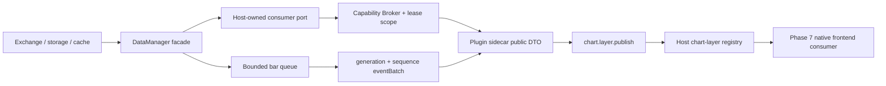

# CandleScope 通用插件平台 v2 — Phase 6 执行记录

日期：2026-07-22
分支：`codex/plugin-platform-v1`
状态：实现与技术验收完成；本文件与实现组成 Phase 6 独立阶段提交

## 1. 阶段结论

Phase 6 已把插件平台从“业务无关核心扩展点”推进到第一个真实领域能力：插件可以在明确
scope 内读取 live symbol、K 线、TradeFlow 和 partial order-book，可以订阅一个或多个精确
K 线 series，并可以向 Host 提交经过预算校验的 marker-only Render IR。插件仍拿不到
`DataManager`、`DataEventBus`、SQLite、exchange adapter、`app.state` 或前端对象。

本阶段不是把内部对象包一层后交给插件，而是建立以下单向数据真相链：



`DataManager` 继续是唯一行情 facade。HTTP K 线、TradeFlow 与插件 consumer 复用
`app.data_engine.public_market_projection`；订单簿插件 read 复用直接 HTTP API 的
`serialize_record()`。因此插件没有第二条抓取、缓存、聚合或最终性判断路径。

## 2. 已交付公开契约

### 2.1 SDK DTO

`candlescope_plugin_sdk.platform_v2` 新增：

- `MarketContext`：强制携带 `mode`、`exchange`、`marketType`；
- `MarketSeries`；
- `SymbolsReadRequest`、`BarsReadRequest`、`BarsSubscribeRequest`、
  `TradesReadRequest`、`OrderBookReadRequest`；
- `candlescope.market-symbols-page/1`；
- `candlescope.market-bars-page/1`；
- `candlescope.market-trades-page/1`；
- `candlescope.market-order-book/1`；
- `candlescope.stream/1` K 线事件 envelope；
- marker-only `candlescope.render/1` 与 `RenderBudget`。

全部请求拒绝未知字段、非有限数、unsafe integer、反向时间范围和越 Host 上限的 limit。
K 线 page 单独声明：

- requested/returned coverage；
- `verifiedContiguous`；
- `allRowsFinal`；
- missing/excluded ranges；
- source、bar source、quality、trusted finality；
- cache/backfill/tail-gap；
- history state、retry、terminal edge 和 availability revision。

没有权威证据时 `verifiedContiguous` 保持 `null`，不会由“看起来根数对”推断为真；只有
`allRowsFinal=true` 且 `verifiedContiguous=true` 同时成立时，`trustedFinal` 才能为真。

### 2.2 Host 方法

| Host 方法 | 权限 | 核心约束 |
| --- | --- | --- |
| `market.symbols.read` | `market.symbols.read` | live context、exchange/market/quote、可选精确 symbol allowlist、每页上限 |
| `market.bars.read` | `market.bars.read` | symbol/interval、history depth、range span、并发、in-flight 去重 |
| `market.bars.subscribe` | `market.bars.subscribe` | 精确 series、每 activation 并发、独立 consumer lease |
| `market.bars.cancel` | `market.bars.subscribe` | 只能取消同 instance/generation 的 subscription |
| `market.bars.resume` | `market.bars.subscribe` | 64-event retained window，否则显式 resync |
| `market.trades.read` | `market.trades.read` | recent 或 1m rollup history、symbol/kind/limit scope |
| `market.order-book.read` | `market.order-book.read` | partial snapshot、depth scope、短期 stream lease、finally release |
| `chart.layer.publish` | `chart.layer.publish` | contribution/layer/context/item scope、Render budget、revision/generation |

Broker 在 adapter 运行前比较 `contexts`、`exchanges`、`marketTypes`、`symbols`、
`intervals`、`dataKinds` 以及所有数值上限。adapter 再次硬拒绝 live handle 的
`mode: replay`；即使错误 grant 同时包含 live/replay，也不能穿透这一隔离。

### 2.3 Host-call 链

`BasePlatformPlugin.complete_host_call()` 现在可以返回下一个 `HostCallInvocation`。dispatcher
保留原始 request context、generation 和 invocation correlation，只允许串行继续；每一步仍独立
经过 handle、scope、rate、activation quota、消息大小和 Host 方法策略。取消、旧 generation 或
context 变化都会使整条链 fail closed。

这个能力不是通用网络请求器。它只让一个贡献调用能在现有 capability broker 上完成有限状态机，
Market Scanner 因此无需获得 Host 对象或开线程。

## 3. 有界 K 线 subscription

每个 subscription 绑定：

```text
plugin + entrypoint + instance + generation
+ live exchange + market type + symbol + interval
+ DataManager consumer_id
```

投递规则：

1. `bar.created`/`bar.updated` 且未闭合：只保留同 series 最新 forming 值；
2. `bar.closed`/`bar.amended`：按到达顺序进入可靠有界队列；
3. close 到来时，同 open time 的 forming 可由 close 覆盖并计入 `coalesced`；
4. 每个成功批次分配连续 sequence，并携带 generation、credit window 和 coalesce 计数；
5. 可靠队列饱和时不静默丢 final event：发送 `resyncRequired=true`，随后退订并释放 stream lease；
6. resume 只重放已成功交付的最多 64 条；窗口外、ahead sequence 或 generation 不同必须 resync；
7. delivery 在独立 task 中执行，DataManager callback 只做有界 enqueue，慢 sidecar 不占用 producer；
8. disable、grant revoke、instance crash、generation 切换和 Host stop 都通过 revocation listener 清理。

`CapabilityHandleAuthority` 新增 fail-safe revocation observer。observer 失败不会阻止 handle 失效；
market runtime 同时保留 stop/reconcile sweep 和 revoked-owner tombstone，阻止正在创建的旧
subscription 或迟到 chart publish 在回收后复活。

## 4. Chart Layer / Render IR

`chart-layer/1` 已进入 Host contribution registry。Phase 6 只接受：

- target：`main-chart`；
- z-order：`above-series` 或 `below-series`；
- item：`marker`；
- position：`aboveBar`、`belowBar`、`inBar`；
- shape：`circle`、`square`、`arrowUp`、`arrowDown`；
- 六/八位 hex color、有限 time/price、受限 text。

configuration、grant 与实际 payload 三层预算取最小值。Host 还检查 layer contribution 所有权、
live context、series、正 revision、instance 和 generation。旧 revision、旧 generation、重复 item
ID、未知 item type、越 item/byte/text budget 都不进入 registry。

Phase 7 才负责把 registry 投影接到原生 chart adapter；Phase 6 没有动态 import 插件 React、
JavaScript 或 CSS，也没有为了某个插件 ID 在 AppShell 写分支。

## 5. Market Scanner 参考插件

SDK wheel 新增 `candlescope-market-scanner`，对应真实 v2 manifest 与可离线安装 sidecar。一次
`scan` 命令依次：

1. 通过 `settings.plugin.read` 读取 Host 校验的 settings；
2. 在固定 live/binance/spot/USDT 与 symbol allowlist 内读取 symbols；
3. 串行读取每个 symbol 的受限 K 线 page；
4. 计算区间涨跌幅并排序；
5. 写入插件自己的 `latest-scan` private document；
6. 为首个匹配结果发布一条 Host-validated marker。

manifest 没有 `network.connect`、filesystem、secret、account 或 trade 权限。真实产品测试覆盖了
bundle SHA-256 安装、staged、逐项 grant、enable、lazy process、六步 Host-call 链、storage、
layer、disable/reconcile 和零残留 layer/subscription。

## 6. 退出门证据

| 退出门 | 自动证据 |
| --- | --- |
| source → DataManager → broker → plugin 与直接 API 一致 | 真实 `DataManager` cache/query 进入 broker；插件 `data` 与 K-line `_bars_to_dicts` 完全相等；K-line/TradeFlow 共用 public projection，订单簿共用 serializer |
| closed/corrected 不丢；forming latest-only | burst forming + closed + amended 测试锁定；可靠溢出只允许 resync+disconnect |
| symbol/interval/generation 无 cross-wire | exact series subscription、lease owner、delivery generation 检查、chart revision/generation tombstone |
| 全市场、过深、超并发拒绝 | strict request shape、symbol scope 负例、range span 负例、read/subscription concurrency quota |
| cold DB/backfill 不产生插件放大 | 相同 read key 共享一个 in-flight task，并有 250ms/128-entry retry absorber；测试两次并发只调用 port 一次 |
| 慢插件断开后 producer 恢复 | delivery 被故意阻塞时 500 次 forming enqueue 仍在 250ms 门内完成；revoke cleanup 后 active=0 且 port unsubscribe=1 |
| live/replay 强隔离 | scope 层拒绝；即使 grant 含 replay，live adapter 仍返回 `MARKET_CONTEXT_ISOLATION_DENIED` |
| 参考插件真实闭环 | 构建真实 wheel/cspkg、安装、grant、sidecar Host-call 链、storage/layer、disable 全通过 |

已完成门禁：

- SDK 全套：65 passed；
- Phase 6 market：10 passed（包含真实 sidecar 集成）；
- Phase 6 + TradeFlow/order-book/core/security 定向：45 passed；
- SDK wheel：sdist/wheel 构建成功；全新临时 venv `--no-index --no-deps` 安装与 package
  smoke 通过，包含 Market Scanner import 和 console entry；
- 所有变更 Python 文件 Ruff check、新增 Python 文件 Ruff format check、`compileall`、
  `git diff --check`：通过。

Backend 全套执行两轮，每轮均为 2040 passed、1 failed。两次失败分别落在两个未被本阶段
修改的 replay `shutdown(step_timeout=0.2)` 时序用例，且失败项不相同；两个失败用例随后各自
连续隔离复跑 3 次，均为 3/3 passed。这里不把 backend 全套误记为全绿：原始红项保留为
全套高负载下的既有 200ms shutdown 门槛波动证据；Phase 6 自身及相关 API/core/security
回归均通过。提交形成后才能执行独立 revert 演练，其结果在阶段交付说明中报告。

## 7. 保留边界

以下能力没有因 Phase 6 被提前宣称：

- 专用 Windows named pipe / Unix domain socket 数据面；
- MessagePack/shared-memory codec；
- 高频 trade/order-book subscribe 或 full-book delta replay；
- replay market consumer（live handle 永远不能代替 replay capability）；
- Phase 7 原生 panel、Plugin Manager 和 chart adapter 消费；
- sandbox iframe/UI Bridge；
- network、filesystem、HTTP endpoint、provider、secret、账户和交易；
- 签名 publisher、远程 Marketplace 与自动更新。

K 线当前通过同步、有界 canonical JSON `eventBatch` 交付。它已经具备 sequence、generation、
credit window、coalesce、resume/resync 和断开回收，但不冒充尚未实测的高频二进制 data plane。

产品 feature flag 仍默认关闭；环境 bootstrap 仍只支持显式 `local-trusted`。Phase 4 已证明的
untrusted AppContainer policy 仍必须由调用方显式注入，不能由环境字符串猜测。

## 8. 回滚

本阶段没有数据库 schema migration，没有改写 v1 script-runtime wire，也没有默认启用 feature
flag。独立 revert Phase 6 提交会移除：

- SDK market/Render DTO、Host-call chaining 与 scanner reference；
- `app.plugin_market_v2`；
- `chart-layer/1` core contribution；
- DataManager/public API 共用 projection 的等价重构；
- main startup 的 market port bind；
- Phase 6 测试和文档。

Phase 5 command/settings/storage/event/job 组合根仍可独立工作。插件 private data 默认保留，
不会因禁用或回滚代码被隐式删除；需要删除数据时仍必须走显式管理动作。
