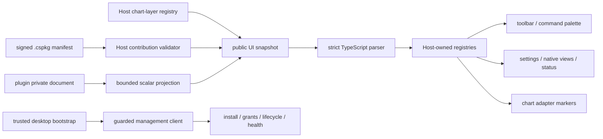

# CandleScope 通用插件平台 v2 — Phase 7 执行记录

日期：2026-07-22
分支：`codex/plugin-platform-v1`
状态：实现与技术验收完成；本文件与实现组成 Phase 7 独立阶段提交

## 1. 阶段结论

Phase 7 已把 Phase 5/6 的 command、settings、private storage、chart layer 与生命周期管理
接入 CandleScope 原生前端。插件现在可以通过静态 manifest 声明命令位置、原生设置、侧栏/
底栏/状态区视图和图表 marker；Host 校验并投影有限 JSON，前端只消费严格解析后的原生模型。

本阶段没有加载插件 JavaScript、CSS、Wasm、iframe 或 React 组件。插件进程也不能向前端发送
HTML、模板或组件名。完整数据链如下：

这使 Market Scanner 从“可由后端运行的参考插件”变成一个没有专用产品分支的真实产品工作流：
用户可以安装 bundle、查看并授予权限、启用、执行扫描、查看表格、修改设置、停用和回滚。

## 2. Host 拥有的声明式契约

### 2.1 command 位置

`command/1` 新增严格 `placements`：

- `commandPalette`；
- `topToolbar`；
- `chartContextMenu`。

manifest 只能声明上述固定位置。Phase 7 已提供 command palette 与 top toolbar 原生 consumer；
`chartContextMenu` 已进入安全 registry 契约，但未为了填满阶段范围而注入插件代码或复制现有图表
私有菜单实现。

### 2.2 `view/1`

`view/1` 只允许以下组合：

| slot | renderer | 数据形状 |
| --- | --- | --- |
| `sidePanel` | `table` / `list` / `detail` | 有界 rows 或 values |
| `bottomPanel` | `table` / `list` / `detail` | 有界 rows 或 values |
| `statusArea` | `status` | 有界 values |

source 固定为插件命名空间内的 `storage.document`，最多 8 段路径；每个 view 最多 16 个字段、
200 个 item。字段格式固定为 `text`、`number`、`percent`、`price`、`boolean`、`timestamp`。
`primaryCommand` 必须属于同一插件，不能跨插件触发命令。

Host 不把 private document 原样暴露给浏览器。它只按 manifest 字段投影 `null`、布尔值、
安全整数、有限浮点数或最多 512 字符的字符串；集合被 `maxItems` 截断。缺失文档返回 empty，
路径或数据形状错误只把该 view 变为 `PLUGIN_VIEW_DATA_INVALID`，不会污染同插件其他 view 或
AppShell。

### 2.3 公共 UI snapshot

`GET /api/v2/plugins/ui/snapshot` 只返回：

- 当前 started、active、可用且已有 live owner 的插件声明式 view；
- Phase 6 Host chart-layer registry 的安全 projection；
- schema 与 registry revision。

disabled、uninstalled、load failure、旧 generation 和尚未启动的插件不会出现在 snapshot。
公开轮询使用 `document_get_if_exists()` / `summary_if_exists()`，不会因为浏览器访问而创建插件
SQLite 文件。平台 feature flag 关闭时返回稳定空 snapshot。

## 3. 原生前端 Host

`frontend/src/features/plugins` 新增以下 Host-owned 组件：

- catalog、UI snapshot 与 management detail 的 exact-shape parser；
- command、settings、view、status 和 chart marker registry；
- command palette、top toolbar、JSON Schema 原生设置表单；
- side/bottom panel 的 table/list/detail renderer 与 status renderer；
- Plugin Manager 的安装、权限、启停、卸载、健康、更新、回滚和数据保留页面；
- 每个插件 surface 的 error boundary 与 stale refresh sequence 防护；
- Phase 6 chart markers 到现有 chart adapter 的组合 source。

AppShell 只挂载通用 `PluginPlatformToolbar`、`PluginPlatformSurfaces`、
`PluginPlatformStatus` 和 `PluginUiErrorBoundary`，没有 Market Scanner、Hello Command 或其他
plugin ID 分支。静态架构门禁止 plugin feature 内出现 dynamic import、iframe、raw HTML、
`eval`、`new Function`、browser persistence 或 Worker。

前端 parser 会再次校验 contribution ownership、完整 ID、slot/renderer 组合、source path、
字段/行上限、有限数、management detail 嵌套 shape 和同插件 primary command。Host 与浏览器
任一侧发现未知字段或不一致都 fail closed。

## 4. Plugin Manager 与本地管理安全

管理页面不从 localStorage、sessionStorage、cookie 或 URL 读取凭据。桌面 Host 通过一次性的
`window.__CANDLESCOPE_PLUGIN_MANAGEMENT_V1__` 注入绝对 loopback API、session token 与 CSRF
token；前端第一次读取后立即删除该全局值，并只保存在当前 JS closure。bootstrap 必须满足：

- `http/https` 且 hostname 为 localhost/loopback；
- 无 username、password、query 或 fragment；
- API path 明确结束于 `/api/v2/plugins`；
- session/CSRF 不相同且各为 32～256 字符。

所有 management route 继续经过 Phase 4 `LocalManagementGuard`。mutation 发送 session、CSRF
和短期 user-action ID；请求使用 `credentials: omit`。公开 catalog/UI snapshot 不携带管理凭据。

安装流程接收真实 raw `.cspkg`，不是浏览器路径或服务器路径字符串：

1. 浏览器限制 `.cspkg` 且不超过 16 MiB，并用 Web Crypto 计算 SHA-256；
2. Host 校验 media type、Content-Length 与摘要格式；
3. Host 边读取 request stream 边重新计算 SHA-256，超过 16 MiB 立即中止；
4. 只有双端摘要一致才把临时文件交给 Phase 3 installer；
5. 成功、拒绝或异常后都删除 incoming 临时文件。

management detail 只返回 UI 所需的 lifecycle、已脱敏权限 scope、entrypoint health、
local-artifact-only 更新策略、rollback status 与 private storage 使用摘要；不返回 token、secret、
bundle 原始内容或审计内部对象。

## 5. Market Scanner 产品闭环

Market Scanner manifest 现在声明：

- `scan` 同时进入 command palette 与 top toolbar；
- `settings/1` 由 Host 原生 schema form 渲染；
- `results` 从 `latest-scan.matches` 投影为 side-panel table；
- `summary` 从同一 document 投影为 status renderer；
- Phase 6 `signals` marker 进入 chart adapter 的 external marker source。

真实浏览器验证使用生产 Vite build、独立 localhost 前端与真实 Core Plugin Platform fixture。
流程从全新 platform root 开始，上传实际构建的 `market-scanner-0.1.0.cspkg`，完成 staged、五项
required grant、enable、scan、settings、disable 与 rollback，不预置 activation 结果。

浏览器证据：

- 扫描结果为 BTCUSDT/ETHUSDT 两行，状态区显示 `Scanned: 2 · Interval: 1h`；
- 设置由 `minimumMovePct=0`、`symbolsLimit=3` 改为 `1`、`2`，关闭并重开后仍为新值；
- command palette 只显示声明的 scanner command；
- disable 后 toolbar/view/status contribution 立即消失，manager 显示 disabled；
- rollback 后插件恢复 active，所有原生 contribution 与原 private data 恢复；
- bootstrap 已删除、浏览器凭据 key 数为 0、插件 executable resource URL 为 0、UI fallback 为 0；
- 最终会话 console 中没有 plugin、uncaught、TypeError、ReferenceError 或 SyntaxError 命中。

截图：`output/playwright/phase7-final/market-scanner-results.png`。夹具有意没有实现普通主应用的
K 线、订单簿和 WebSocket API，所以截图中的主图“Data load failed”及相关 404/重连日志不是
Plugin Platform 错误，也未被计入插件链路通过证据。

## 6. 退出门证据

| 退出门 | 自动/运行时证据 |
| --- | --- |
| descriptor、重复 contribution、未知 slot fail closed | Python contract 负例 + TypeScript exact parser 负例；slot/renderer/ownership/source/primary-command 双端校验 |
| disabled/uninstalled UI 与 command 立即消失 | reconcile 后 public snapshot 过滤 active/live owner；真实浏览器 disable 证据 |
| 不加载插件 JS、不启动 disabled sidecar | 静态架构门禁止所有 executable loader；public projection 不激活插件；浏览器 resource probe 为 `[]` |
| Settings/AppShell/chart adapter 边界不退化 | frontend architecture、plugin architecture、typecheck、lint、全套 test/build 均通过 |
| 安装、授权、panel、查询、禁用、回滚 | 生产 build 上真实 `.cspkg` 浏览器闭环通过 |
| UI 异常不拖垮 AppShell | 每个 surface 由 `PluginUiErrorBoundary` 包围；单 view 投影错误隔离；fallback 数为 0 |
| 管理凭据不落盘 | trusted bootstrap 单次消费后删除；storage key probe 为 0；API client 单测覆盖 |
| 上传边界与摘要 | streaming 16 MiB 上限、browser+Host SHA、mismatch/成功/临时清理测试 |

已完成门禁：

- Phase 7 Core/market 定向：20 passed；
- Plugin Platform v2 backend matrix：110 passed；
- SDK 全套：65 passed；
- frontend Phase 7 focused tests：8 passed；
- frontend 全套：architecture、plugin architecture、typecheck、lint、2342 tests 与 production
  build 全部通过；
- 生产 build 使用绝对 loopback API 后完成真实浏览器闭环与视觉检查；
- 变更 Python 文件 Ruff check/format check、`compileall`、`git diff --check` 作为提交前门禁执行。

Backend 全套结果为 2042 passed、1 failed。唯一失败是本阶段未修改的 Windows sandbox
`test_stderr_overflow_kills_wrapper_and_its_appcontainer_job_tree`：wrapper 已因 stderr overflow
退出，但测试随即以 0ms 等待 child process 时偶发得到 `WAIT_TIMEOUT`。隔离复跑当前树第 1 次
通过、第 2 次同点失败；为判断归属，又在 Phase 6 commit `8f18080` 的 clean detached
worktree 连续运行 10 次，结果为 7 passed、3 failed，且失败堆栈完全相同。因此原始全套红项
保留为既有零等待竞态证据，不将其误报为全绿，也不把无关 sandbox 修复混入 Phase 7；本阶段
新增/相关 backend 测试在全套中全部通过。

## 7. 保留边界

以下能力没有因 Phase 7 被提前宣称：

- 插件自定义 JavaScript/React/CSS/Wasm、iframe 或 `candlescope.ui-bridge/1`；
- digest-addressed asset gateway、独立 UI origin、CSP 与 sandbox attribute；
- 插件直接 fetch、通用 network、filesystem 或 HTTP endpoint；
- secret broker、数据 provider、账户、订单、risk gate 或 live trading；
- 签名 publisher identity、远程 Marketplace、自动下载或自动更新；
- `chartContextMenu` 的产品 surface；当前只冻结安全 placement 契约与 registry；
- feature flag 默认开启；环境 bootstrap 仍只允许显式 `local-trusted`。

Phase 7 的“原生 UI”含义是 Host 用固定组件渲染受限数据，不是插件获得前端执行能力。复杂
自定义界面必须等待 Phase 8 的独立 origin/sandbox/UI Bridge 证明，不能借 `view/1` 绕过。

## 8. 回滚

本阶段没有产品数据库 schema migration，没有改写 v1 script-runtime wire，也没有默认启用
Plugin Platform。独立 revert Phase 7 提交会移除：

- `view/1`、command placements、公共 UI snapshot 与 management detail/install API；
- frontend Plugin Platform parser、registry、原生 surfaces、manager 与 chart marker consumer；
- Market Scanner 的声明式 view/placement；
- Phase 7 browser fixture、架构门、测试与文档。

Phase 6 后端 scanner、market consumer、private document 和 Host chart-layer registry 仍可独立工作，
只是不会再投影到产品前端。插件 private data 与 installation 默认保留；本阶段回滚不会隐式删除
用户数据或改变 activation registry。
