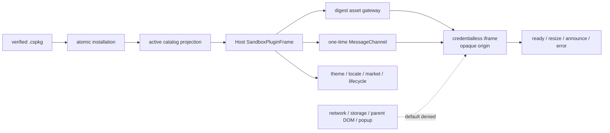

# CandleScope 通用插件平台 v2 — Phase 8 执行记录

日期：2026-07-22
分支：`codex/plugin-platform-v1`
状态：实现与技术验收完成；本文件与实现组成 Phase 8 独立阶段提交

## 1. 阶段结论

Phase 8 已交付复杂自定义界面的第一条安全路径：插件 web assets 由 Host 按 bundle digest
提供，只能在 opaque-origin、`credentialless` iframe 中运行，并通过
`candlescope.ui-bridge/1` 的私有 `MessageChannel` 与 Host 交换少量、有界、严格校验的消息。

这不是把浏览器或 CandleScope 对象交给插件。当前 bridge 的 capability 列表固定为空，插件
没有通用 fetch、WebSocket、DOM、React、Host JS、文件、secret 或交易能力。Phase 8 解锁的是
“可写自定义 HTML/CSS/JavaScript 界面”，不是“可绕过 Host 权限模型执行任意操作”。

完整边界如下：

## 2. 冻结契约与 Sandbox View 声明

Phase 8 没有修改 Phase 1 已冻结的 manifest v2 schema 或其 SHA-256。manifest 中 frontend
surface 继续使用公开的 kebab-case slot `side-panel`；Host 的 `view/1` 产品配置使用
`sidePanel`。Core contract 只接受显式映射：

| manifest surface slot | Host view slot | renderer |
| --- | --- | --- |
| `side-panel` | `sidePanel` | `sandbox` |
| `bottom-panel` | `bottomPanel` | `sandbox` |

一个 sandbox `view/1` 必须与同 ID 的 frontend surface 一一对应，surface、slot 和 HTML entry
任一不一致都会拒绝整个插件贡献。catalog 只为当前 active、available、有 live owner 的安装记录
增加以下 Host 生成字段：

- 当前 bundle 的完整 `sha256:` digest；
- 已验证 HTML entry；
- 固定协议 `candlescope.ui-bridge/1`；
- 固定 iframe profile `allow-scripts`；
- 固定 CSP profile `opaque-origin-v1`。

插件不能从 manifest 注入 URL、sandbox token、CSP、component name 或 React loader。Phase 7 的
声明式 UI snapshot 继续只包含 Host-native view；sandbox view 不会被误投影为 storage document。

参考 Sandbox View 仍带一个 lazy descriptor sidecar，因为当前 manifest v2 要求至少一个 backend
entrypoint。该 sidecar 无权限、无可调用 contribution，打开/关闭 UI 均不会启动它。这不等于已
交付真正 backendless 的 `ui-only-untrusted` 包格式；该格式若需要，应在后续 schema 版本独立设计。

## 3. Digest-addressed asset gateway

公开读取路径固定为：

`GET /api/v2/plugins/assets/{pluginId}/{64-hex bundle digest}/{asset path}`

网关只服务当前 active 安装的当前 digest。平台未启动、disabled、uninstalled、load failure、
旧 digest、未知插件或不存在的资源统一返回泛化 404；已安装文件与 bundle envelope 的 size/hash
不一致返回泛化 409，不泄露安装路径或内部校验细节。

每次响应都重新检查：

- 最多 256 字符的安全 POSIX 相对路径，无 `..`、反斜杠、百分号、冒号或双斜杠；
- resolved target 仍在 installation `content/web` 内，且不是 symlink；
- 文件存在于已验证 bundle envelope，kind 为 `web`；
- 单文件大于 0 且不超过 8 MiB；
- 当前 bytes 的长度和 SHA-256 与 envelope 完全一致；
- extension 只能是 HTML、CSS、JavaScript 或白名单 raster image；额外 HTML 不能绕过 declared
  surface entry。

资源以 quoted digest ETag、`public, max-age=31536000, immutable` 和 `nosniff` 返回，支持精确
`If-None-Match` 304。缓存只缓存不可变 bytes；是否创建 Host iframe、bridge 和能力始终由当前
catalog/lifecycle 决定，不以缓存中的 asset 作为授权证据。

## 4. 浏览器隔离 profile

Host 是插件 iframe 的唯一创建者，静态架构门要求恰好一个 gateway 组件，并冻结：

- `sandbox="allow-scripts"`，明确没有 `allow-same-origin`、popup、form、top-navigation、download；
- `credentialless`、`allow=""`、`referrerPolicy="no-referrer"`；
- 不使用 `srcDoc`、dynamic import、raw HTML、`eval`、Function constructor、Worker 或浏览器持久化；
- 每个 view 有独立 error boundary、height、bridge instance 和 React key。

asset response CSP 为 fail-closed profile：`default-src 'none'`，scripts/styles/images 只允许当前
plugin + 当前 bundle digest 的 asset 目录（不是整个 API origin），images 另允许 data，且
`connect-src 'none'`；同时关闭 font/media/object/frame/child/worker/manifest、base、form，并附加
CSP `sandbox allow-scripts`、Permissions Policy 和 no-referrer。即使 asset gateway 与普通 API 共用
listener，插件也不能用 script/style/img subresource 绕过 connect-src 请求其他 Host API 路径。

真实生产 build 验证 iframe 内 `self.origin === "null"`。测试时 Host UI 与 asset gateway 分别在
127.0.0.1:15188 和 127.0.0.1:18128；安全结论仍不依赖端口不同，因为无 `allow-same-origin` 的
sandbox 会给 document opaque origin，`credentialless` 又切断 ambient credential context。

## 5. UI Bridge v1

opaque origin 无法用固定 `targetOrigin` 标识，因此 Host 只向精确 iframe `contentWindow` 发送一次
connect envelope，并转移一对 MessagePort 的另一端。之后不再接受 window-level bridge message。
每个 envelope 必须同时满足：

- 256-bit Web Crypto 随机 token；
- plugin ID、完整 view ID、256-bit instance ID、单调 generation；
- 严格递增 sequence；
- exact-shape protocol/type/payload，无未知字段；
- JSON UTF-8 编码后不超过 32 KiB；
- type-specific 数值和字符串上限。

Host → sandbox 只发送 connect snapshot 与 `host.lifecycle`；snapshot 只有空 capabilities、theme、
locale 和当前 market identity。lifecycle 支持 visible、suspended、disposed 与 focus。sandbox → Host
首批只允许：

- `sandbox.ready`：完成一次握手；重复 ready 立即失败；
- `view.resize`：整数高度 180～1200 px；
- `view.announce`：最多 256 字符，polite/assertive live region；
- `view.error`：进入独立 failure surface，不传播到 AppShell。

origin spoof、旧 generation、重放 sequence、oversize、未知 type、suspended 后继续发消息都会关闭
channel。reload 和重新打开都会创建新 token、instance 和更大的 generation；close/unmount 会先发
disposed，再关闭 MessagePort。

## 6. 真实浏览器验收

验收从全新 platform root 开始，使用 production Vite build，通过 Plugin Manager 上传真实
`sandbox-view-0.1.0.cspkg`，本次 bundle digest 为
`sha256:ec294c2155e4d5dd82478b8cbf03f41206d0728b04fed2745121870e83ec5bdc`。

Sandbox View 在 iframe 内执行 12 个攻击/隔离探针，结果为 12/12 blocked：

1. parent DOM；
2. Host JavaScript；
3. localStorage；
4. sessionStorage；
5. cookies；
6. IndexedDB；
7. fetch；
8. WebSocket；
9. popup；
10. top navigation；
11. download；
12. service worker registration。

Host 侧同时确认 management bootstrap 已一次性删除，cookie/storage/hash 未受影响，page 数仍为 1，
download 数为 0，service worker registration 数为 0。伪造 window `postMessage` 没有改变 ready
channel；Host performance scope 只看到 iframe HTML navigation，插件 JS/CSS 只出现在 opaque frame
自己的 performance scope。iframe 再用 `` 请求同一 API origin、但不在当前 digest asset 目录
下的探针路径，服务端请求计数仍为 0，证明 path-scoped CSP 在发出请求前已拦截该旁路。

产品交互证据：

- focus、theme=`light`、locale=`en-US` 和 market identity 实时同步；
- 键盘从 “Run probes” Tab 到 “Request 520px height”，Enter 后 iframe 高度为 520px；
- accessibility announcement 到达 Host live region；
- contained error 显示 `PLUGIN_SANDBOX_REPORTED_ERROR`，reload/reopen generation 为 1 → 2 → 3；
- close 后 `runningEntrypoints=0`、`subscriptions=0`；
- disable 后 toolbar/iframe 立即消失，原 digest asset 返回 404；
- rollback 后恢复 active，asset 返回 200、固定 CSP 与 digest ETag。

截图：`output/playwright/phase8-final/sandbox-isolation-12-of-12.png`（本地验收 artifact，不进入
Git）。fixture 不实现普通主应用的 K 线、订单簿和 WebSocket API，因此 console 中这些链路的
404/reconnect 为预期夹具噪声。与插件 asset 相关的 console 只有探针故意触发的 CSP fetch/WS
拒绝、digest 目录外同源图片的 path-scoped CSP 拒绝、popup 拒绝与 download warning，没有插件
uncaught、TypeError、ReferenceError 或 SyntaxError。

## 7. 退出门证据

| 退出门 | 证据 |
| --- | --- |
| 无 parent DOM/Host JS/browser storage | opaque origin 真实探针；Host cookie/storage/hash 前后不变 |
| direct network/navigation/popup/download 默认拒绝 | CSP + iframe sandbox；真实浏览器 fetch/WS/popup/top/download 全 blocked |
| spoof/replay/oversize/旧 generation 拒绝 | exact parser、32 KiB 双向门、私有 port/256-bit token、sequence/generation 单测与浏览器伪造探针 |
| hide/close/dispose 不泄漏 channel 或运行时 | visibility suspend/resume 单测；close/reopen generation 与 health 0/0 浏览器证据 |
| 键盘、焦点、主题、a11y、错误恢复 | production build 真实浏览器逐项通过 |
| asset 不污染 Host bundle cache/SW scope | main/frame performance scope 分离，Host SW registrations=0，worker-src none |
| disabled/old digest fail closed | active-current-only gateway；disable 404、rollback 200；tamper 409 集成测试 |
| Phase 1 public schema 不漂移 | frozen manifest schema hash 测试继续通过；slot 显式映射在 Host contract 内完成 |

已完成门禁：

- Phase 8 SDK focused：1 passed；
- Phase 8 backend focused：2 passed；
- Phase 8 frontend parser/API/bridge focused：13 passed；
- Plugin Platform v2 backend matrix：97 passed；
- SDK 全套：66 passed；
- frontend 全套：architecture、Plugin Platform architecture、typecheck、lint、2348 tests 与
  production build 全部通过；
- 变更 Python 文件 Ruff check/format check、compileall 与 `git diff --check` 通过；
- backend 全仓最终单独串行结果：2045 passed、4 个既有 FastAPI lifespan deprecation warnings。

第一次 backend 全仓与 frontend 全套并行运行得到 2042 passed、3 failed。失败均不在 Phase 8
代码路径：AppContainer CPU elapsed 8093ms 超出 8000ms、已记录的 stderr child 0ms wait 得到
`WAIT_TIMEOUT`，以及 replay 0.2s shutdown 在负载下超时。三项随后无并行前端负载隔离复跑为
3 passed。本记录同时保留最终单独运行的全仓结果，不用隔离通过覆盖原始负载证据。

## 8. 保留边界与下一阶段

Phase 8 没有交付：

- bridge capability invocation、generic Host RPC 或可扩展 message type 注册；
- direct network、Host-mediated HTTP、文件 handle 或插件 HTTP endpoint；
- 真正无 backend entrypoint 的 ui-only bundle；
- Wasm、Worker、nested frame、popup、download 或 service worker；
- secret、数据 provider、账户、订单、risk gate 或 live trading；
- publisher identity、远程 Marketplace、自动下载或自动更新；
- feature flag 默认开启；本地开发仍要求显式 `local-trusted` bootstrap。

下一阶段只进入 Phase 9：受控网络、文件和 HTTP gateway。必须继续保持 direct egress 拒绝，所有
外部交互经 Host broker、精确 scope、redirect/private-network policy、body/rate limit 和审计；
不得为了让 Sandbox View “更有用”而给 iframe 加 `connect-src` 或通用 fetch。

## 9. 回滚

本阶段没有产品数据库 schema migration，也没有修改 v1 runtime wire。独立 revert Phase 8 提交会
移除 asset gateway、sandbox catalog projection、UI Bridge/iframe Host、参考 Sandbox View、测试和
本文；Phase 7 声明式 UI、Plugin Manager、Market Scanner 及 Phase 0～6 后端能力仍可工作。

已安装的 Phase 8 sandbox bundle 在旧 build 下不会被旧 catalog parser 加载为 executable UI；插件
安装记录和 private data 默认保留。回滚不隐式删除用户数据，也不把 sandbox assets 降级为原生
HTML/React 注入路径。
