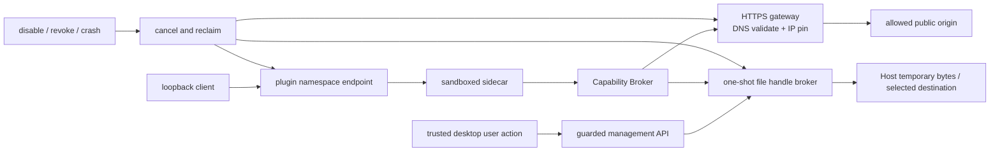

# CandleScope 通用插件平台 v2 — Phase 9 执行记录

日期：2026-07-22
分支：`codex/plugin-platform-v1`
状态：实现与技术验收完成；本文件与实现组成 Phase 9 独立阶段提交

## 1. 阶段结论

Phase 9 已交付三条受控外部集成路径：Host-mediated HTTPS、用户明确选择的单次文件
读写，以及插件命名空间下的 loopback HTTP endpoint。插件获得的是有界 capability 与
opaque handle，不是 socket、文件路径、浏览器对象、Host Python 对象或凭据。

本阶段保持 Phase 8 的 direct egress 默认拒绝：sidecar 的 Windows AppContainer 仍不能直接
访问外网或 loopback；sandbox iframe 的 `connect-src 'none'` 没有放宽。能成功的外部动作必须
经过 Host Broker、安装时声明、用户 grant、运行时 lease、精确 scope、限额、审计和生命周期撤销。

## 2. 冻结合同与贡献声明

Phase 9 没有修改 Phase 1 已冻结的 `manifest-v2.schema.json`、Python manifest model 或 schema
hash。新增语义仍位于 manifest v2 原有的开放 `contribution.configuration` 与 permission scope
中，由当前 Host fail-closed 解释：

- `command/1.configuration.fileInputs`：字段、`open|save`、media type、最大字节和 save 建议名；
- `http-endpoint/1`：固定方法、`buffered|server-events`、请求/响应、并发和速率上限；
- `network.connect`：HTTPS、精确 DNS domain、端口、方法、请求/响应、redirect、并发、速率；
- `filesystem.open-user-selected` 与 `filesystem.save-user-selected`：media type、字节和 TTL；
- `http.endpoint.serve`：endpoint ID、方法及各项上限。

配置与 permission 必须双向收紧：贡献声明不能超过请求的 scope，运行时 registration 又取当前
effective grant 与贡献配置的较小值。文件字段必须是 command input schema 中 required string；
Phase 9 支持多个 open input，但一个命令最多一个 save destination，因为公开结果只允许一个
Host download receipt。未知字段、额外方法、IP、wildcard、大小或 namespace 漂移会拒绝整个贡献。

SDK 新增严格类型：`HostHttpRequest/Response`、`UserFileReadRequest/Response`、
`UserFileWriteRequest/Receipt`、`HttpEndpointRequest/Response`，以及固定 method/schema identifier。
SDK 会先拒绝 authority header、非法 Host handle、非 canonical base64、错误 size/SHA-256、非法文件
名/media type 和不支持的 endpoint 方法；Host 仍是最终授权方。

## 3. Host-mediated HTTPS

`network.http.request` 只接受 GET/POST、credential-free HTTPS URL、canonical base64 body 和小型
header allowlist。`Authorization`、Cookie、Host、代理头、压缩协商和任意 hop-by-hop header 均不能
进入该合同；响应只返回 cache-control、content-type、etag、last-modified，不返回 set-cookie。

每一跳都执行以下步骤：

1. URL canonicalize，拒绝 userinfo、fragment、bare IP、空白和非 HTTPS；
2. 对照 lease 的精确 domain、port、method 和 body limit；
3. DNS 解析所得全部地址必须是 global address；混合 public/private 也整体拒绝；
4. 选择已验证地址并直接连接该 IP，同时保留原 hostname 作为 TLS SNI/证书和 HTTP Host；
5. redirect 重新 canonicalize、重新 scope 检查、重新 DNS 验证和 IP pin；
6. 限制 header 数/字节、拒绝压缩响应、按 Content-Length 与实际读取双重限制 body；
7. 按 capability fingerprint 执行并发、每分钟速率和全局并发限制。

disable、uninstall、permission revoke、generation 替换会关闭关联 socket control。transport 异常只返回
稳定错误，不把 DNS、TLS、socket 或上游私有文本暴露给插件。审计只记录 origin、方法、status、
请求/响应字节、redirect 数和 duration；不记录 URL query、header 或 body。

## 4. 用户选择文件

文件入口只存在于带 trusted management guard 与 user-action nonce 的原生 command palette：

- open：浏览器读取用户选择的 bytes，Host 校验 filename/media type/size 后写入私有临时区；
- save：浏览器先取得用户选择的 native destination，Host 再签发空的 write handle；
- 插件永远只收到 `ufh_...` opaque handle，不收到绝对路径、目录、浏览器 File 或 destination；
- handle 绑定 plugin、contribution、field、read/write direction、permission 与 capability lease；
- handle 最多 600 秒且只消费一次，跨插件、跨贡献、方向错误、复用和过期统一拒绝；
- write 结果生成一次性 `ufd_...` receipt，浏览器下载后复核 size 与 SHA-256，再写 selected destination；
- download receipt 同样绑定插件与 lease，并只消费一次。

临时文件使用随机名且始终限制在 platform-owned root。成功、失败、过期、revoke、disable 和 Host stop
都会执行回收 sweep，运行中到期资源最多 60 秒进入下一次 maintenance sweep；审计只保存
handle/download fingerprint 与字节数，不保存 filename、路径或内容。每次消费前还会重新验证 root、
文件名、文件类型与 canonical path；临时文件被替换、变成目录或 symlink 时 fail closed，并立即耗尽句柄。
Host 同时限制每插件最多 8 个、全局最多 64 个 file resource，并按声明最大值保守预留全局最多
8 MiB；硬崩溃遗留的受控随机文件会在下次启动清扫，临时区出现未知文件、目录或 symlink 则拒绝启动。
command invoke 成功但浏览器完整性/写入失败时，UI 会撤销“成功”提示、保留错误并清空所有一次性
句柄，要求用户重新选择，避免重复使用已消费 authority。

当前 Phase 9 单文件上限为 128 KiB，文件名采用保守 ASCII 白名单，不提供目录 handle、任意路径、
后台无交互读写、文件监听或持久文件权限。

## 5. Loopback HTTP endpoint

公开路由固定为：

`/api/v2/plugins/endpoints/{pluginId}/{endpointId}`

插件不能声明 listen address、port、任意 path、Host 路由或其他插件 namespace。Host 在读取 body 与
调用 sidecar 前同时验证：client 是 loopback、请求 Host 是 loopback、没有 forwarded/x-real-ip、
`Sec-Fetch-Site` 是 same-origin/none；若带 Origin，则 scheme、netloc 和 loopback hostname 必须与
当前 URL 完全一致。因此 DNS rebinding Host、cross-site browser fetch 和代理转发默认得到泛化 404。

进入插件的 request envelope 只有 method、允许的少量 headers、最多 32 个 query key/每 key 16 个
value、canonical base64 body 和固定 schema version；不会转发 Authorization、Cookie 或 Host。
每个 endpoint 独立限 method、body、并发和 rate，并与 contribution generation 绑定。

`buffered` response 只允许 JSON、plain text 或 octet-stream，并强制 `nosniff`、
`default-src 'none'; sandbox`、same-origin CORP、DENY framing、no-referrer 与 no-store。`server-events`
是最多 256 个事件、总字节受限的有限 SSE batch，不是长连接、WebSocket 或任意 streaming socket。
disable/revoke 会先删除 registration 并 cancel in-flight invocation；disabled endpoint 返回 404。

## 6. Reference Integration Gateway

SDK wheel 新增 `candlescope-integration-gateway` console entry 与真实 manifest/package fixture。参考插件：

- 请求 `https://example.com` 的只读 GET scope；
- 导入用户选择的 JSON/text，并只返回名称、类型、size 与 digest；
- 导出一份有界 JSON report；
- 提供一个回显 method/header key/body digest/query key 的 loopback endpoint；
- manifest、源码、输出与审计均不包含 API key、Authorization、cookie、账户或交易能力。

这证明 integration plugin 可以只依赖公开 SDK 与 Host call，不需要导入 `app.*`、访问 CandleScope DB
或自行创建网络/文件句柄。wheel build 后在全新离线 venv 中验证了新 module、manifest 和 console
entry 均实际进入安装产物。

## 7. 真实浏览器与 OS 隔离证据

验收从全新 platform root 和 production Vite build 开始，通过 Plugin Manager 的真实 file chooser
上传 `integration-gateway-0.1.0.cspkg`。本次 bundle digest 为
`sha256:e28de55741ba671fd3030fcd2992b4f706169e9654876b8d2d24a027518c5864`。

浏览器逐项完成：

- 四个权限逐项 grant，enable 后 Commands 出现且 Health=Available；
- endpoint POST 返回 200，response 带 no-store、sandbox CSP、DENY frame；插件看到的 header key 只有
  accept/content-type，浏览器发送的 Authorization 没有进入 sidecar；
- HTTPS command 经确定性 Host resolver/transport 命中 `example.com` 与 pinned
  `93.184.216.34`，请求数恰为 1；该项证明浏览器→Host→Broker→sidecar 线路，不声称访问了真实互联网；
- Playwright 真实 browser file chooser 选择 `selected-input.json`，Host open 与 command invoke 均 200；
- save 经过用户点击、Host save handle、sidecar write、Host download、browser SHA-256 和 Blob writer；
  写入证据为 picker=1、write=1、close=1、abort=0、JSON 90 bytes；
- disable 后 Commands 立即消失、running entrypoint=0，原 endpoint 返回 404。

自动化不能安全操作 Windows 原生 save dialog，因此本次 save destination 用 init-script 注入的内存
`showSaveFilePicker` adapter；真实 UI click、Host handle、sidecar、download、digest 和 writable 生命周期
均为生产代码，只有 OS destination 被替换。正式桌面发布前仍保留一次人工原生 save dialog smoke。

最终代码复核 artifact 位于
`output/playwright/phase9-final-rerun-20260723T010603536/`：截图、trace、network 与
`browser-evidence.json`，不进入 Git。夹具不实现普通 K 线、订单簿和 WebSocket API，因此这些 404/
reconnect 是预期噪声；`browser-evidence.json` 汇总的最终插件管理/文件/command/endpoint 主链路除
disable 后预期 404 外均为 200，未发现插件 TypeError、ReferenceError、SyntaxError 或 unhandled error。

Windows AppContainer 原生 probe 另行确认：sidecar 直接读取外部文件、连接外网、连接 loopback、创建
子进程均被拒绝，memory policy 仍生效。Phase 8 iframe CSP 未改，因此 iframe direct fetch/WebSocket
也仍默认拒绝。

## 8. 退出门与质量证据

| 退出门 | 证据 |
| --- | --- |
| direct egress 仍拒绝，只有 Host proxy 成功 | AppContainer native probe；Phase 8 CSP 不变；browser Host transport 1 次 |
| DNS rebinding/private/redirect 越 scope 拒绝 | bare IP、private、mixed DNS、redirect、Host/Origin/forwarded 单测 |
| 文件越权、复用、过期、方向错误拒绝 | file broker 单测与真实 browser chooser；receipt digest/one-shot |
| endpoint 不覆盖 Host/其他 namespace | 固定 route、loopback/rebinding guard、namespace/HTML/content limit 测试 |
| disable/revoke 及时关闭并回收 | network cancellation、endpoint task cancellation、file/download revoke、diagnostics 全零 |
| 日志不含 body、query、header、路径或 secret | audit byte scan 与 exact event shape |
| Phase 1 public contract 不漂移 | schema.py、models.py、manifest-v2.schema.json 零 diff；frozen hash suite 继续通过 |

已完成门禁：

- Phase 9 SDK focused：4 passed；
- Phase 9 backend focused：12 passed；
- Phase 9 frontend API/parser focused：11 passed；
- Windows AppContainer 原生隔离 probe：1 passed；
- Plugin Platform v2 backend matrix：109 passed；
- SDK 全套：70 passed；
- SDK wheel build + fresh offline venv package smoke：通过；
- frontend 全套：architecture、Plugin Platform architecture、typecheck、lint、2350 tests 与
  production build 全部通过；
- backend 全仓最终串行结果：2057 passed、4 个既有 FastAPI lifespan deprecation warnings；
- 变更 Python 文件 Ruff check/format check、compileall 与 `git diff --check` 通过。

## 9. 保留边界与 Phase 10

Phase 9 没有交付：

- arbitrary TCP/UDP、persistent WebSocket、任意长连接、background browser fetch 或 iframe egress；
- wildcard domain、HTTP 明文、private network、localhost/metadata、代理继承或自定义 CA；
- directory/full-path access、后台文件权限、大文件 streaming 或 OS watcher；
- 对公网暴露插件 endpoint、任意 path/router、中间件、可执行 HTML response 或 persistent SSE；
- secret broker、OAuth/API credential、账户、订单、risk gate 或 live trading；
- market-data provider、history/realtime ingestion ownership 或 exchange adapter；
- publisher identity、远程 Marketplace、自动下载/更新或 feature flag 默认开启。

下一阶段只进入 Phase 10：公开 market-data provider。provider 输出必须经过 canonical schema、分页、
finality、source quality、rate/reconnect/backpressure 与现有 ingestion 真相路径；不得把 Phase 9 HTTPS
proxy 当成绕过 Data Engine、直接写 cache/SQLite/GapLedger 的通用后门，也不得提前引入账户和交易。

## 10. 回滚

本阶段没有产品数据库 schema migration，也没有修改 v1 runtime wire 或 Phase 1 manifest schema。
独立 revert Phase 9 提交会移除 integration SDK types/example、Host gateway/broker/endpoint、文件 command
UI、API、测试和本文；Phase 0～8 的安装、权限、核心扩展、市场 consumer、声明式 UI 与 Sandbox UI
仍可工作。

已安装的 Phase 9 bundle 在旧 Host 中会因未知 Host-owned contribution/configuration 被 fail-closed，
不会降级为 direct network/filesystem。回滚不隐式删除插件 private data；Host-owned 临时文件在正常
shutdown/revoke 时清理。若需要紧急回滚，先 disable Phase 9 integration plugin，再 revert 阶段提交，
确认 endpoint 404、entrypoint=0 与临时 gateway diagnostics=0。
