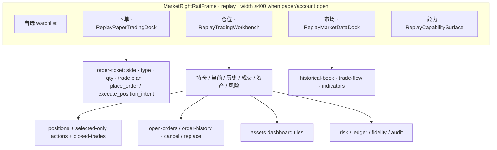
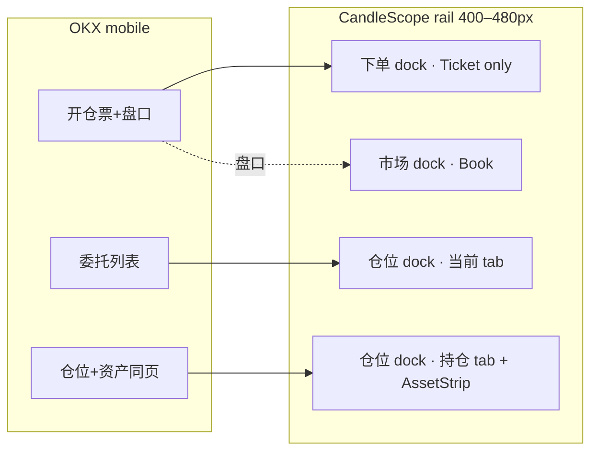
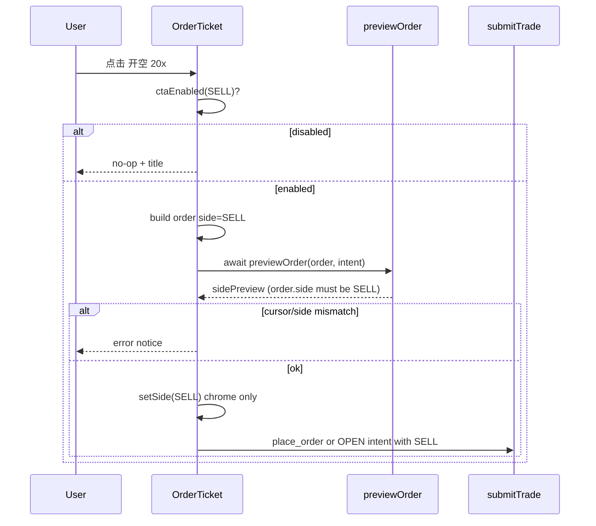
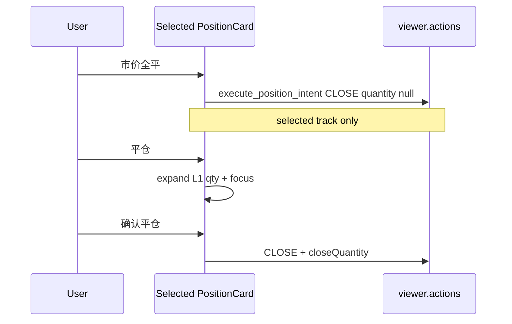
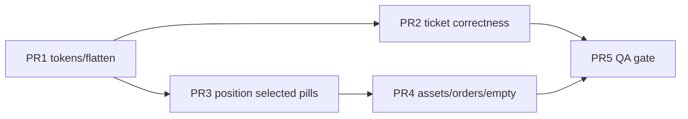

# OKX 启发的 CandleScope 回放右侧交易轨视觉重设计

| 字段 | 值 |
|------|-----|
| **Title** | OKX-inspired visual redesign of K-line Replay right-side trading rail |
| **Author** | TBD |
| **Date** | 2026-08-05 |
| **Status** | Accepted (rev 3 + user OQ lock) |
| **Scope** | `frontend/src/features/replay/components/ReplayRightRail.tsx`, `ReplayRightMarketRail.tsx`, `frontend/src/index.css` (`--trade-*` / workbench / ticket sections ≈ L8980–11060+; line nos drift) |
| **Prior art** | `design-qa.md`（仓位工作台已迁入右侧轨；结构通过，视觉仍偏“管理台”） |

---

## Overview

K 线回放（Replay）右侧轨在上一轮设计迭代中已完成**信息架构迁移**：下单在 `下单` dock、持仓/委托/资产/风险在 `仓位` dock（`ReplayTradingWorkbench`），主图不再被底部 account workbench 挤占。功能与测试稳定（`data-replay-action` / `data-replay-panel` 契约保留），但视觉仍是**密集仪表盘**：metric 使用带边框抬升方块、主数字 8–11px mono、side-switch + 单 CTA、仓位动作区按钮过多、六 Tab 字号/badge 偏挤。

本设计将 **OKX App 交易/仓位视觉语言**（白底、扁平原生 metric、双主 CTA「开多/开空」、三等分 pill 次要操作、扁平 3 列指标、冷静空状态）翻译到 CandleScope **桌面 400–480px 竖轨**，在**不改动交易真值与 broker 语义**的前提下，以 CSS + 展示层 React 结构为主完成 polish。目标不是 1:1 手机克隆，也不是第二次布局架构重写。

**rev 2 补强（相对初稿）**：完整 `placeOrderWithSide` 算法（点击侧必须 await 同侧 preview）；CTA 按开仓/平仓/持仓方向的 enablement 矩阵；仓位主操作**仅选中轨**；「交易计划」与「止盈止损」文案分离；metric 字段与现有 `risk_ratio`（覆盖倍数）对齐；去掉半吊子 feature flag；锁定「平仓 vs 市价全平」；PR1 诚实范围；token alias 表。

**rev 3**：PR1 token **宿主选择器**修正——`--trade-*` 与 `--replay-rail-*` alias 必须定义在同一祖先节点上（custom properties 不向上继承），避免 `.replay-paper-trading` 上 `var(--trade-bg)` 未解析。

**User OQ lock (2026-08-05)**：六 workbench tab **不合并**；≥560px **不**在 ticket 旁嵌 mini book（盘口仅 **市场** dock）。

---

## Background & Motivation

### 当前架构（已落地，保持）



关键源码锚点（行号会随编辑漂移，以符号为准）：

| 组件 / 导出 | 文件 | 职责 |
|-------------|------|------|
| `ReplayPaperTradingDock` | `ReplayRightRail.tsx`（约 L336–681） | 纸面委托票；`submitTrade("place_order" \| "execute_position_intent")`；`previewOrder` |
| `ReplayTradingWorkbench` | `ReplayRightRail.tsx`（约 L683–1178） | 账户轨；`WORKBENCH_TABS`；仓位/委托/成交/资产/风险 |
| `ReplayMarketDataDock` | 同文件（约 L1181+） | 盘口 / 订单流 / 指标 |
| Re-exports | `ReplayPaperTradingDock.ts`, `ReplayTradingWorkbench.ts` | 保持 import 稳定 |
| 宽度策略 | `ReplayRightMarketRail.tsx` **L122–125** | paper/account 打开时 `effectiveRailWidth = max(400, railWidth)`；传给 frame 约 L231 |

### 痛点（代码已核实）

1. **Dashboard tile 美学**：`.replay-rail-metric-grid > div` 使用 `background: var(--trade-surface-raised)` + padding 方块（`index.css` ≈ L10921–10927），像后台控制台而非交易所。
2. **字号层级扁平**：主数字常为 8–11px JetBrains Mono；OKX 主数字约 15–17px 粗体、label 11–12px 灰。
3. **委托 CTA 模式**：`replay-side-switch` + 单一 `replay-submit-order[data-side]`（约 L578–581, L665–672），非 OKX 双堆叠「开多 20x / 开空 20x」。
4. **仓位操作过载**：`replay-position-actions` 平铺 部分平仓 / 市价全平 / 反手 / 止盈止损 / 清除 + 多个输入框（约 L952–1013），缺 progressive disclosure。
5. **Tab 密度**：六项 `持仓/当前/历史/成交/资产/风险`，badge ≈8px 偏小。**交互模型已是下划线选中**（`.replay-workbench-tabs button::after` + `--trade-focus`，约 L10453–10479 / rail L10802–10816），**不是**「蓝底胶囊 → 下划线」的模式翻转，只需字号/badge/横向滚动 polish。
6. **双 token 体系**：`--replay-rail-*`（`.replay-paper-trading` ≈ L8980–9013）与 `--trade-*`（`.replay-order-surface` / workbench ≈ L10085–10117）并存；ticket 同时包在两者内，易出现 header/body 色不一致。
7. **空状态**：`.replay-account-empty` 虚线框 + 小字（约 L10848+），非居中冷静空态。
8. **资产与持仓分离**：OKX 在「仓位和资产」同页滚动；CandleScope `assets` 独立 tab，tile 网格。

### 约束（硬）

- **禁止改变交易真值**：replay-only paper；no-lookahead；`viewer.actions.submitTrade` 命令集与 payload 语义不变。
- 优先 **CSS + presentational structure**；不新增后端 API。
- 桌面轨宽 **~400–480px**；`data-theme` light/dark 均需可用。
- 中文 copy；不复制 OKX logo / 专有插画。
- 训练专属面（风险、fidelity、audit、ledger）**可访问但降权**，不抢主交易面。
- CLOSE / protection / reverse **绑定 viewer 选中轨**（broker 不吃 card 级 `track_id`）；禁止假设多轨就地 CLOSE。

---

## Goals & Non-Goals

### Goals

1. 下单轨与仓位轨视觉接近 OKX：**扁平 metric、清晰数字层级、绿/粉语义色、圆角 pill 按钮**。
2. 委托票改为 **双主 CTA（开多 / 开空）** + 连续 **数量 slider**（保留 25/50/75/100 可点 ticks），且 **submit 前必须持有同侧 preview**。
3. 持仓卡：**3 列扁平原生指标**（DOM 在 PR3 改）+ **仅选中卡**三等分 pill（止盈止损 | 平仓 | 市价全平）；高级动作折叠。
4. **资产条**并入持仓 tab 滚动流；独立 `资产` tab 同构 flat（保留 panel id）。
5. 委托卡 / 空状态 OKX 化；测试选择器 **兼容**（见契约表）。
6. 统一 trade surface token + **显式 `--replay-rail-*` → `--trade-*` alias**（light + dark）。

### Non-Goals

- 实现真实「划转 / 充值 / 跟单 / 策略 tab / 追单」。
- 在 ticket 旁嵌入 L2 盘口（任意轨宽含 ≥560px；盘口仅 `市场` dock）。
- 改 margin_mode / leverage 锁定规则（session 创建时固定；UI 可展示只读 chips）。
- 重写 `MarketRightRailFrame` 多 view 架构或 bottomPanel 回归。
- 引入 OKX 品牌资源或第三方插画包。
- 为预估强平价 / 分侧可开数量新增服务端字段（无数据则 `--` / 共用 `max_quantity`）。
- **半规格 feature flag / A-B skin 开关**（见 Rollout：用 staged PR + git revert）。
- 把 `execute_position_intent` CLOSE 改成 ticket 双 CTA 的两侧提交（全平仍在 workbench，`side: null`）。

---

## Proposed Design

### 1. Information architecture：OKX → CandleScope

| OKX 表面 | CandleScope 映射 | 说明 |
|----------|------------------|------|
| 开仓 / 平仓 + 订单簿 | **下单** dock + 盘口在 **市场** | 400–480px 单列 ticket only |
| 开多 / 开空 CTA | `ReplayPaperTradingDock` 双 CTA | `placeOrderWithSide` + 同侧 preview（§4.3） |
| 委托(n) | workbench tab **当前** (`open-orders`) | 保留批量撤单 |
| 仓位(n)和资产 | **持仓** tab：PositionCard* + **选中轨** actions + AssetStrip | 资产不再是唯一入口 |
| 策略(n) | **不做** | 训练能力在 **风险** tab |
| 当前交易品种 filter | 可选；默认关 = 全组合 | 与现行为一致 |
| 改单 / 撤单 | 现有 `replace_order` / `cancel_order` | **追单** out of scope |

外层 dock 标签保持：`自选 | 下单 | 仓位 | 市场 | 能力`（`ReplayRightMarketRail` view ids）。



### 2. Class naming / skin strategy

**决策：扩展现有 `.replay-*` + 收敛 `--trade-*`，不引入平行 `replay-okx` 命名空间；不引入 `tradeSkin` feature flag。**

理由：

- 测试与 QA 已锁定 `replay-trading-workbench`、`replay-position-card`、`replay-compact-record`、`replay-submit-order` 等。
- 双 skin × 双主题 = 四矩阵；DOM 改动本身也不是 CSS 一键回滚，flag 半规格更糟。
- OKX 差异主要是 **token + 布局密度 + 少量 DOM 重组**：

| 新增 / 强化类 | 用途 |
|---------------|------|
| `.replay-metric-flat` | **opt-in** 无抬升底 3 列 metric（PR3 挂 DOM 后启用；PR1 只定义类） |
| `.replay-size-slider` | range + ticks |
| `.replay-dual-cta` | 双堆叠主按钮容器 |
| `.replay-pill-btn` / `--long` / `--short` / `--secondary` | pill 按钮系统 |
| `.replay-badge-row` / `.replay-chip` | 多/空、全仓、20x、限价 chips |
| `.replay-asset-strip` | 持仓页底部资产卡 |
| `.replay-empty-calm` | 居中空状态（`.replay-account-empty` modifier） |
| `.replay-disclosure` | 折叠「更多操作」/ 交易计划 |
| `.replay-mode-toggle` | 开仓 \| 平仓 → `reduceOnly` |

### 3. Component hierarchy

```
ReplayRightMarketRail
├── ReplayPaperTradingDock (.replay-paper-trading[data-replay-paper-surface=order-ticket])
│   └── .replay-order-surface
│       ├── .replay-ticket-account
│       └── .replay-compact-ticket[data-replay-panel=order-ticket]
│           ├── .replay-mode-toggle              // 开仓 | 平仓 → reduceOnly
│           ├── .replay-ticket-meta-row          // 全仓·杠杆只读 + 委托类型
│           ├── .replay-ticket-fields
│           ├── .replay-size-slider
│           ├── .replay-avail-row                // 可用 + 参考可下（当前 side 的 preview）
│           ├── .replay-trade-plan.replay-disclosure  // 文案「按风险计划反算」，非「止盈止损」
│           ├── .replay-order-preview.replay-metric-flat
│           ├── .replay-dual-cta
│           │   ├── button.replay-submit-order[data-replay-action=place-order][data-side=BUY]
│           │   └── button.replay-submit-order[data-replay-action=place-order][data-side=SELL]
│           └── .replay-trade-notice
│
└── ReplayTradingWorkbench[data-replay-workbench=rail]
    ├── .replay-workbench-header
    │   ├── .replay-workbench-summary
    │   └── .replay-workbench-tabs               // 已有 underline；polish 字号/badge
    └── .replay-workbench-panel
        ├── [positions] .replay-rail-account-scroll[data-replay-panel=positions]
        │   ├── .replay-position-filter          // optional
        │   ├── .replay-position-card*           // 每卡：header + badges + metrics
        │   │   └── 仅 selected：.replay-position-primary-actions + disclosure
        │   │       （非 selected：仅「切换到该轨道」）
        │   ├── .replay-position-actions 可内嵌于 selected card 或紧随其下
        │   ├── .replay-asset-strip
        │   └── .replay-closed-trades            // 可折叠
        ├── [open-orders|order-history] …
        ├── [fills] …
        ├── [assets][data-replay-panel=account-assets]
        └── [risk][data-replay-panel=account-risk]
```

**禁止**：在每张非选中卡上挂可提交的 市价全平 / 平仓（broker 绑定 selected track）。

### 4. Layout specs（400px rail）

#### 4.1 ASCII wireframe — 下单 dock

```
┌─ 下单 400px ─────────────────────────┐
│ BTCUSDT · 合约回放          214.00 U │
│ [全仓] [20x] [已锁定]                 │
│──────────────────────────────────────│
│ ( 开仓 )  平仓          可用 213.3 U  │
│ 限价委托 ▾                            │
│ ┌价格 USDT──────┐ ┌数量 BTC─────┐   │
│ │ 691.70        │ │ 0.02        │   │
│ └───────────────┘ └─────────────┘   │
│ ●────○────○────○────○  0%…100%      │
│ ▸ 按风险计划反算      参考可下 5.88  │  ← 非「止盈/止损」
│ 名义价值    保证金    手续费上限      │
│ …           …         …              │
│ ┌──────────────────────────────────┐ │
│ │         开多 20x                 │ │  green; disabled if matrix says so
│ └──────────────────────────────────┘ │
│ ┌──────────────────────────────────┐ │
│ │         开空 20x                 │ │  pink
│ └──────────────────────────────────┘ │
│ status / preview error…               │
└──────────────────────────────────────┘
```

#### 4.2 ASCII wireframe — 仓位 dock · 持仓

```
┌─ 仓位 400px ─────────────────────────┐
│ 账户权益 214.00 USDT                  │
│ 持仓(1) 当前(0) 历史 成交 资产 风险   │  underline active (已有模式)
│──────────────────────────────────────│
│ BTCUSDT                         收益  │  ← selected
│ [多] [全仓] [20x]           +12.4 U   │  % 可选；见 Data Model
│ 持仓量    维持保证金   风险覆盖       │  flat 3-col；单位见 §4.4
│ 0.02      0.69         12.5×          │  risk_ratio 是 ×，不是 75%
│ 开仓均价  标记价格     预估强平       │
│ 691.7     692.1        --             │
│ ( 止盈止损 ) ( 平仓 ) ( 市价全平 )    │  仅 selected 卡
│ ▸ 更多：数量 / 确认平仓 / 反手 / 清除 │
│──────────────────────────────────────│
│ ETHUSDT  [空] …                       │  非 selected：无 pills
│ [切换到该轨道管理]                    │
│──────────────────────────────────────│
│ ◎ USDT                                │
│ 权益 / 占用 / 可用                    │
│ 浮动 / 风险覆盖 / 会话杠杆            │
│ 余额                                  │
└──────────────────────────────────────┘
```

#### 4.3 OrderTicket 细节

| 元素 | 规格 | 绑定 |
|------|------|------|
| 开仓 \| 平仓 | Segmented；开仓=绿选中 | `reduceOnly = (mode === "close")` |
| 全仓 / 杠杆 | 只读 chips | `contract.margin_mode`, `config.max_leverage` |
| 委托类型 | 现有 select | `orderType` |
| 价格 / 数量 | 输入 + 单位 | `data-replay-field="order-price"` / `order-quantity` **保留** |
| Slider | range 0–100 + ticks | `setQuantityShare`；`max` 用 **当前 UI side** 的 preview `max_quantity`（debounce 预览可仍跟 `side` state） |
| 可用 | `portfolio.available_equity` | 无充值 + |
| **按风险计划反算** | disclosure / checkbox，默认折叠 | 现有 trade plan fieldset；**禁止**标成「止盈/止损」 |
| 预览行 | flat：名义 / 保证金 / 费 +「参考可下」 | 仅展示 **当前 side** 的 `ReplayOrderPreview`；无分侧字段则不伪造 |
| 双 CTA | 两按钮均 `class="replay-submit-order"` + `data-replay-action="place-order"` + `data-side` | `placeOrderWithSide`（下节） |
| side-switch | **从主路径移除** | `side` state 保留；用 CTA / 矩阵更新。a11y：双 CTA 为两个真实 button，带明确 accessible name（`开多 20x` / `开空 20x` 或平仓文案）；无需隐藏的 side-switch |

##### CTA enablement 矩阵（必须实现）

Broker 规则（已核实意图）：reduce-only 仅允许平仓方向；`execute_position_intent` OPEN 不可在反向已有仓上「开」成减仓/反手；workbench CLOSE 用 `side: null`。

令 `pos = sign(selectedPosition.quantity)`：`flat | long | short`。  
**仅对 selected track 的仓位**应用矩阵（ticket 也针对当前选中轨）。

| Mode (`reduceOnly`) | Position | BUY CTA | SELL CTA | 文案 BUY / SELL |
|---------------------|----------|---------|----------|-----------------|
| 开仓 (`false`) | flat | enabled* | enabled* | `开多 {n}x` / `开空 {n}x`（现货：`买入` / `卖出`） |
| 开仓 | long | enabled*（加仓） | **disabled** `title="已有多仓：反向请用仓位·反手或先平仓"` | 同上 |
| 开仓 | short | **disabled** | enabled*（加仓） | 同上 |
| 平仓 (`true`) | long | **disabled** | enabled* | — / `卖出平多` |
| 平仓 | short | enabled* | **disabled** | `买入平空` / — |
| 平仓 | flat | **both disabled** | | `title="无持仓可平"` |

\*enabled 仍受 `commandReady`、数量、价格、以及「该侧提交前 preview 成功」约束（见算法）。

**平仓模式不走 workbench 的 `execute_position_intent` CLOSE**：ticket 平仓 = `place_order` + `reduce_only: true` + 唯一合法 side（或未来若 MARKET reduce 有独立路径，仍须 side 合法）。**市价全平**只在仓位 workbench。

反向开仓（反手）**不在** ticket 双 CTA 上启用；继续用仓位 disclosure `reverse-position`。

##### `placeOrderWithSide` 算法（权威，PR2 必达）

当前 `placeOrder`（约 L512–550）用 state 中的 `side` + 共享 `preview`。双 CTA 必须**禁止**「用 A 侧 preview 提交 B 侧」。

```text
placeOrderWithSide(nextSide: BUY | SELL):
  1. if !ctaEnabled(mode, position, nextSide) → return
  2. if !commandReady → return
  3. Build orderRequest with explicit nextSide
       (client_order_id, side: nextSide, order_type, quantity,
        reduce_only: reduceOnly, limit_price/stop_price as today).
  4. Build tradePlanDraft as today (if enabled & eligible); still side-explicit via order.
  5. positionIntent = (orderType === MARKET && !reduceOnly) ? "OPEN" : "NET"
  6. setNotice(pending, "正在校验委托…")
  7. sidePreview = await previewOrder(orderRequest, positionIntent, tradePlanDraft)
       // click-time await; do NOT trust cached preview unless:
       //   preview.order.side === nextSide
       //   && preview.cursor matches store revision/source_sequence/virtual_time_ms
  8. if sidePreview rejected / throw → setNotice(error); return
  9. Re-check cursor still matches store (same as today).
 10. setSide(nextSide)  // UI chrome only; payload already fixed
 11. Branch submit (same as today, but use nextSide + sidePreview):
       if sidePreview.trade_plan && tradePlanDraft:
         submitTrade("place_order", { ...orderRequest, quantity: planned.quantity, trade_plan })
       else if orderType === MARKET && !reduceOnly:
         submitTrade("execute_position_intent", { intent: "OPEN", side: nextSide, quantity })
       else:
         submitTrade("place_order", { ...orderRequest })
 12. on success: rotate clientOrderId; clear plan fields if needed; setNotice(success)
```

**禁用策略（推荐，无 dual-cache 后端）**：

- Debounce preview 仍按当前 `side` state 跑（驱动「参考可下」与 slider max）。
- 各 CTA 的 `disabled` =
  - `!commandReady` **或**
  - `!ctaEnabled(matrix)` **或**
  - 数量/价格不合法 **或**
  - （可选优化）若缓存 preview 已是该 side 且 ready，可亮；否则**允许点击**但在 click 路径 await preview——若只在「缓存 side 匹配」时 enable，则另一侧会一直灰直到用户先点/hover 切换 side。  
  **采用**：矩阵 + 表单合法性决定 enable；**提交路径永远 await 或校验同侧 preview**（步骤 7）。点击时另一侧不共用旧 preview。
- 提交中：`viewerPending` 时两侧都 disabled。

```tsx
// Sketch — payload side is explicit; never placeOrder() relying on setState(side)
async function placeOrderWithSide(nextSide: "BUY" | "SELL") {
  if (!isCtaEnabled(nextSide) || !commandReady) return;
  const order = { ...buildOrderFields(), side: nextSide, reduce_only: reduceOnly };
  const intent = orderType === "MARKET" && !reduceOnly ? "OPEN" : "NET";
  setNotice({ tone: "pending", message: "正在校验委托…" });
  try {
    const sidePreview = await viewer.actions.previewOrder(order, intent, tradePlanDraft);
    // cursor match checks…
    if (sidePreview.order.side !== nextSide) {
      setNotice({ tone: "error", message: "预览方向不一致，请重试" });
      return;
    }
    setSide(nextSide);
    // submit branches using `order` + `sidePreview` (not React side state)
  } catch (e) {
    setNotice({ tone: "error", message: commandErrorMessage(e) });
  }
}
```

**提交分支语义（不变）**：

```
trade_plan 生效 → place_order + trade_plan
MARKET && !reduceOnly → execute_position_intent OPEN
else → place_order
```

#### 4.4 PositionCard

数据源：`ReplayTrainingPortfolioPosition` + `item.position`（`quantity`, `entry_price`, `mark_price`, `unrealized_pnl`…）、`maintenance_margin`, `isolated_margin?`, `margin_equity?`, `risk_ratio`、`contract.margin_mode`、`config.max_leverage`。

| 区域 | 布局 | 备注 |
|------|------|------|
| 顶行 | 左 `symbol` 14px 粗；右未实现盈亏金额 | % 见 Data Model；无可靠分母则**只显示金额** |
| Badge | `多\|空`；`全仓\|逐仓`；`{lev}x` | 杠杆不编辑；title「运行中锁定」 |
| Metric grid | **3×2 flat**，字段绑定见下表 | **禁止**把 `risk_ratio` 显示成 `%` 维持保证金率 |
| 已实现 | 有 position/portfolio 字段则一行；否则隐藏 | |
| Primary actions | **仅 `item.track_id === selectedTrackId`** | 见 4.5 |
| 非选中 | 「切换到该轨道管理」→ `selectTrack` | **无**提交类 pills |

##### Metric 字段绑定（禁止伪造）

| UI 标签 | 绑定 | 格式 |
|---------|------|------|
| 持仓量 | `abs(position.quantity)` | 数量 + base asset |
| 维持保证金 | `item.maintenance_margin` | 结算币；**不要**标成笼统「保证金」除非另有初始保证金字段 |
| 风险覆盖 | `item.risk_ratio` | **`{n}×`**（与现 UI「覆盖 {n}×」一致）；`null` → `--` |
| 开仓均价 | `position.entry_price` | 价 |
| 标记价格 | `position.mark_price` | 价 |
| 预估强平 | **无字段** | 恒 `--`，`title="回放组合未提供预估强平价"` |

可选第 7 格（若 3×2 要填满「保证金」语义）：

| 保证金（权益） | `margin_equity` 若有，否则 `isolated_margin` 若有 | 有则显示；都无则 **不要** 用 MM 冒充「保证金」，第三列保持「风险覆盖」 |

Wireframe 中的 `12.5×` 为 **illustrative** 覆盖倍数，**不是** 75% MM rate。

#### 4.5 PositionActions — selection-scoped + progressive disclosure

**范围**：仅当 `selectedPosition !== null` 时渲染动作区（与今日约 L952–1013 一致）。可内嵌在 selected `replay-position-card` 底部，或紧随该卡——仍是单轨绑定。

**禁止**：未 `selectTrack` 就对非选中卡调用 CLOSE；也**不**要求 `await selectTrack` 再关（竞态/失败面大）。用户必须先切换轨道。

| 层级 | 控件 | `data-replay-action` | 行为 |
|------|------|----------------------|------|
| L0 | **止盈止损** | —（展开 UI） | 展开 protection 输入；**仅** `set_position_protection` 语义。文案固定「止盈止损」= 仓位保护，**不是**交易计划 |
| L0 | **平仓** | —（展开） | **打开 L1 数量区并 focus 数量输入**；**不**立即 submit |
| L0 | **市价全平** | `close-position` | `execute_position_intent` `{ intent: "CLOSE", side: null, quantity: null }` 一键全平 |
| L1（平仓展开后） | 数量 + 25/50/100% | — | `closeDraft` / `setCloseShare` |
| L1 | **确认平仓** | `close-partial` | `execute_position_intent` CLOSE + `quantity: closeQuantity` |
| L1 disclosure「更多」 | 反手 | `reverse-position` | 不变 |
| L1 | 设置保护 | `set-position-protection` | SL/TP 输入后提交 |
| L1 | 清除保护 | `clear-position-protection` | 双 null |

**空仓**：仅 empty state；**不**挂载 action 节点（与今日一致；源码级测试只 match 字符串存在于组件源文件即可）。

**有仓且 selected**：reverse / protection / close-partial 节点应在动作树内（可用 `<details>` 折叠，**不要**在有 selected position 时 unmount 掉导致 E2E 找不到；空仓除外）。

#### 4.6 OrderCard（当前/历史）

```
QQQUSDT 永续              [改单] | [撤单]
[限价] [开多|买入…] [时间]
委托数量    已成交     委托价格
```

- Badge：类型、side 文案、时间；margin/lev 若 order 记录无则省略。
- 3-col flat metrics。
- **追单**不实现。
- 批量撤单 → secondary pill。

#### 4.7 AssetStrip

| 行 | 标签 | 来源 |
|----|------|------|
| Header | CSS 圆标 + `settlementAsset` | |
| Row1 | 币种权益 / 占用 / 可用 | `equity`, `margin_used`, `available_equity` |
| Row2 | 浮动收益 / 风险覆盖 / 会话杠杆 | `unrealized_pnl`, `contract.risk_ratio` 作 `×`（无则 `--`）, `config.max_leverage` 只读展示（**不要**用无公式的 `margin_used/equity` 冒充「当前杠杆」除非标注「估算」——rev2 **默认用会话 max_leverage 标签「杠杆上限」**） |
| Row3 | 余额 | `cash_balance` |
| CTA | 无划转 | |

`assets` tab：`data-replay-panel="account-assets"` 保留；flat 同构。无法币 $。

#### 4.8 EmptyState

`.replay-account-empty.replay-empty-calm`：居中 min-height ≈160px；本地几何 SVG；文案 `暂无委托` / `当前组合为空仓` / `暂无成交`。

#### 4.9 TabBar

- 六键与 `data-replay-rail-tab` **不变**。
- **已有** underline + `--trade-focus` 选中模式；本设计只做：字号 12–13px、badge 10px、横向 scroll 更顺、间距。
- **不要**重做成蓝底胶囊，也**不要**在文档/PR 中描述为「模式从蓝底改为下划线」。

---

## API / Interface Changes

**无后端 API 变更。**

### Trade commands（权威）

| Command | UI 入口 |
|---------|---------|
| `place_order` | 双 CTA；平仓 reduce-only |
| `execute_position_intent` OPEN | 开仓模式 MARKET CTA |
| `execute_position_intent` CLOSE | 仓位 **市价全平** / **确认平仓**（selected only） |
| `execute_position_intent` REVERSE | 仓位 disclosure |
| `set_position_protection` | 仓位止盈止损 |
| `replace_order` / `cancel_order` / `cancel_orders` | 委托卡 |
| `allocate_isolated_margin` | 风险 tab |

### `ReplayOrderPreview` 可用字段（已核实，保持诚实）

`max_quantity`, `estimated_notional`, `reserved_margin`, `estimated_fee`, `available_equity_after`, `max_leverage`, `trade_plan`, `order.side`, `cursor` — **无** split long/short max、**无** est liquidation。  
文案：**「参考可下」**（当前 side），永不伪造「可开多/可开空」分列数值。

### 测试选择器契约

| Selector | 要求 |
|----------|------|
| `data-replay-action="place-order"` | **两个** CTA 均可带此 action + `data-side`；均带 `replay-submit-order` |
| `data-replay-action="close-partial"` | 源码与 **有 selected position 时** DOM 存在（确认平仓按钮） |
| `data-replay-action="close-position"` | 有 selected position 时存在 |
| `data-replay-action="reverse-position"` / protection | 有 selected position 时存在（可 CSS/details 折叠）；**空仓不要求挂载** |
| `data-replay-panel` / `data-replay-field` / `data-replay-workbench="rail"` / `data-replay-rail-tab` | 保留 |
| `replay-position-card` / `replay-compact-record` | class 保留 |

#### Do-not-break 清单（摘自 `replayTrainingWorkspace.test.tsx`）

**PR1 / 任意 CSS 改动不得破坏（除非同 PR 更新测试）：**

- `[data-theme='light'] .replay-paper-trading` 规则存在
- `--replay-rail-text-muted: #5f7086` **精确字符串**（alias 时 light muted 保持该值，或同 PR 改测试）
- `grid-template-columns: repeat(4, minmax(0, 1fr))` 仍出现在 styles（`.replay-paper-trading .replay-rail-tabs` 历史规则；勿误删）
- `.replay-trading-workbench[data-replay-workbench="rail"]`、`.replay-rail-account-scroll`、`.replay-position-card,`、`.replay-submit-order[data-side="BUY"]`

**PR2 / TSX：**

- `className="replay-paper-trading"`、`role="tablist"` / `tabpanel`、`handleRailTabKeyDown`
- `data-replay-workbench="rail"`、`["open-orders", "当前"]` 等 tab 元组、`close-partial`、`replay-position-card`、`replay-compact-record`、`aria-live="polite"`

---

## Data Model Changes

**无 schema / migration。**

| UI 字段 | 规则 |
|---------|------|
| 持仓方向 | `sign(quantity)` |
| 未实现盈亏 % | **默认不显示**，除非产品后续给定分母；若显示：仅当 `margin_equity` 或 `isolated_margin` 存在且 >0 时用 `unrealized_pnl / margin`，否则省略 % |
| 风险覆盖 | `risk_ratio` → `×` |
| 预估强平 | 恒 `--` |
| 会话杠杆展示 | `config.max_leverage` 标签「杠杆上限」 |

---

## Token 表（light + dark）

### PR1 实现规则（cascade，必读）

**Custom properties do not inherit upward.** 今日树为：

```text
.replay-paper-trading              ← 现有 --replay-rail-* 宿主；不可只 alias 到子节点的 --trade-*
  └── .replay-order-surface        ← 现有 --trade-* 宿主
.replay-trading-workbench          ← --trade-*
.replay-paper-trading.replay-market-context  ← 单节点同时带两套 class（市场 dock 相对安全）
```

若仅在子节点 `.replay-order-surface` 定义 `--trade-*`，父节点写 `--replay-rail-bg: var(--trade-bg)` 会解析失败，paper chrome / dock 背景可能空白。

**规则（一句）**：在**同一组祖先选择器**上先定义完整 `--trade-*`，再在需要兼容旧规则的节点上写 `--replay-rail-*: var(--trade-*)`；禁止只在后代定义 `--trade-*` 再于祖先 alias。

**公共宿主选择器（PR1 唯一真源）** — 不污染 live 交易 UI：

```css
/* 1) Define --trade-* (and [data-theme='light'] overrides) on ALL hosts that
   paint trade chrome OR that alias --replay-rail-*: */
.replay-paper-trading,
.replay-right-rail,
.replay-market-dock[data-active-dock="paper"],
.replay-market-dock[data-active-dock="account"],
.replay-order-surface,
.replay-trading-workbench,
.replay-market-context {
  --trade-bg: …;
  --trade-surface: …;
  /* full table */
}

/* 2) Alias only on nodes that still consume --replay-rail-* in existing CSS: */
.replay-paper-trading,
.replay-right-rail,
.replay-market-dock[data-active-dock="paper"] {
  --replay-rail-bg: var(--trade-bg);
  --replay-rail-surface: var(--trade-surface);
  /* …full alias table… */
  /* light: --replay-rail-text-muted: #5f7086;  literal until test update */
}
```

Children (`.replay-order-surface` 等) 自动继承祖先上的 `--trade-*`；也可留在同一选择器列表中重复定义（幂等，便于对照旧块迁移）。

| Token | Light | Dark | 用途 |
|-------|-------|------|------|
| `--trade-bg` | `#f7f8fa` | `#0b0e11` | 轨背景 |
| `--trade-surface` | `#ffffff` | `#12161c` | 卡片/输入 |
| `--trade-surface-raised` | `#f2f3f5` | `#1a1f27` | hover / 次要按钮；**不作 metric 底** |
| `--trade-border` | `#e5e7eb` | `#2a2f3a` | 细分隔 |
| `--trade-text` | `#1a1d24` | `#f1f3f5` | 主文字 |
| `--trade-secondary` | `#6b7280` | `#9ca3af` | 次级 |
| `--trade-muted` | `#8a93a0` | `#6b7280` | label（trade 语境） |
| `--trade-positive` | `#11c76f` | `#28c77b` | 多/买 |
| `--trade-negative` | `#f6465d` | `#f05a76` | 空/卖 |
| `--trade-focus` | `#3b82f6` | `#38bdf8` | Tab/链接 |
| `--trade-warning` | `#986000` | `#f4b740` | pending / fidelity |
| `--trade-pill-secondary-bg` | `#f2f3f5` | `#1e2430` | 次要 pill |
| `--trade-radius-pill` | `999px` | 同 | |
| `--trade-radius-control` | `8px` | 同 | |

### `--replay-rail-*` → `--trade-*` alias（PR1 必做）

在**已定义 `--trade-*` 的同一元素**上设置（见上节宿主列表），保证 header/body 一致：

| Rail token | Alias |
|------------|--------|
| `--replay-rail-bg` | `var(--trade-bg)` |
| `--replay-rail-surface` | `var(--trade-surface)` |
| `--replay-rail-surface-strong` | `var(--trade-surface-raised)` |
| `--replay-rail-border` | `var(--trade-border)` |
| `--replay-rail-text` | `var(--trade-text)` |
| `--replay-rail-text-secondary` | `var(--trade-secondary)` |
| `--replay-rail-text-muted` | **light 保持字面 `#5f7086` 直到测试更新**；dark 可用 `var(--trade-muted)` |
| `--replay-rail-input` | `var(--trade-surface)` |
| `--replay-rail-active` | `var(--trade-focus)` 或保留蓝 `#1d4ed8` 若需与 tab 测试无关 |
| `--replay-rail-active-soft` | soft focus wash |
| `--replay-rail-warning` | `var(--trade-warning)` |
| `--replay-rail-shadow` | 保留既有阴影 token |

**迁移顺序**：合并旧两处 token 块（≈ L8980 paper-trading 与 ≈ L10085 order-surface）为「公共宿主 + alias」两段；**light `--replay-rail-text-muted: #5f7086` 原样保留**（测试锁）。手测：下单 dock 外层背景、ticket 内 surface、仓位 workbench 三色一致且无 `var()` 回退空白。

### Type scale / controls

| 角色 | Size / Weight |
|------|---------------|
| Symbol | 14–15 / 700 |
| Primary metric | 15–16 / 600–700 tabular |
| Label | 11–12 / 500 muted |
| Tab | 12–13 / 600 |
| Primary CTA | 15 / 700；h=44；pill |
| Secondary pill | 13 / 600；h=36 |
| Input | h=40；r=8 |
| Slider | track 4px；thumb 16px |

### Metric flat（opt-in class）

```css
.replay-metric-flat {
  display: grid;
  grid-template-columns: repeat(3, minmax(0, 1fr));
  gap: 10px 8px;
  margin: 0;
}
.replay-metric-flat > div {
  padding: 0;
  background: transparent;
  border-radius: 0;
}
.replay-metric-flat dt { font-size: 11px; color: var(--trade-muted); }
.replay-metric-flat dd {
  margin-top: 4px;
  font-size: 15px;
  font-weight: 600;
  color: var(--trade-text);
  font-variant-numeric: tabular-nums;
}
```

PR1 可对**现有** `.replay-rail-metric-grid > div` 去掉 raised 背景（仍 2-col DOM）；**不要**在 PR1 声称 3-col 内容完成。

---

## Interaction changes & migration notes

| 变更 | 前 | 后 |
|------|----|----|
| 方向 | side-switch + 单 submit | 双 CTA + 矩阵 disable + `placeOrderWithSide` |
| 仓位比例 | 25/50/75/100 only | slider + ticks |
| 资产 | 独立 tile tab | 持仓 AssetStrip + assets 同构 |
| 仓位动作 | 全平铺于 selected | L0 三 pill；平仓=展开；确认=close-partial；全平=close-position |
| 交易计划 | 常显；易与 TP/SL 混淆 | disclosure「按风险计划反算」 |
| Tab | underline（已有） | 字号/badge polish only |

### 高级/次要 disclosure

| 能力 | 位置 |
|------|------|
| 确认平仓数量 / 反手 / 清除保护 | 仓位 L1（selected） |
| 按风险计划反算 | 下单 disclosure |
| 最近已平仓 | 持仓底部可折叠 |
| 账本 / 审计 / fidelity / 强平分域 / 逐仓分配 | 风险 tab |

---

## Alternatives Considered

### A. Skin-only CSS

- Pros：最低风险。  
- Cons：无双 CTA / 真 3-col DOM / 动作信息架构。  
- **Verdict**：PR1 仅作第一步，非终态。

### B. 组件重组 + token（**Adopt**）

- Pros：对齐 OKX；broker 不变。  
- Cons：PR2 含真实交易路径正确性工作。  

### C. Ticket+book 分栏 @400px

- **Reject**；盘口留市场 dock。**≥560 并排 mini book 已否决**（用户 2026-08-05；KD11）。

### D. `replay-okx` / `tradeSkin` flag

- **Reject**。维护四矩阵；DOM 回滚本就靠 git。用 staged PR + revert。

---

## Security & Privacy Considerations

| 项 | 说明 |
|----|------|
| 威胁模型 | UI-only |
| 交易安全 | click-time 同侧 `previewOrder` + cursor 校验 + `replayOwnsController` |
| 误触 | 非法侧 CTA disabled；市价全平文案明确；平仓需二次确认（确认平仓） |
| 品牌 | 无 OKX 资产入库 |

---

## Observability

| 层 | 策略 |
|----|------|
| 已有 | trade/workbench notice tones |
| 可选 | `trade_cta_click { side, mode, orderType }` |
| 回归 | 1280×720 light/dark 截图 + `npm run test:replay` |

---

## Rollout Plan

1. **无 feature flag**。默认直接交付 exchange 视觉；回滚 = `git revert` 对应 PR（PR1 CSS 最易回滚；PR2/PR3 DOM 需整 PR revert）。
2. **Staged PRs**（文末）— 每 PR 可独立 merge、测试绿。
3. **验收**：OKX 参考构图（非像素克隆）+ design-qa viewport；中文；light/dark；矩阵与 preview 手测。

### Risks

| 风险 | 严重度 | 缓解 |
|------|--------|------|
| **用错误 side 的 preview 提交** | **P0** | `placeOrderWithSide` 步骤 7–9：await/校验 `preview.order.side === nextSide` + cursor |
| 开仓模式对反向仓误点 | P1 | enablement 矩阵 hard-disable |
| 非选中卡误平仓 | P1 | pills **仅 selected**；无 silent selectTrack |
| 止盈止损 vs 交易计划文案混淆 | P2 | 文案分离（已锁定） |
| 测试锁 CSS 字符串 | P2 | PR1 do-not-break 清单；muted hex 保留 |
| 六 tab 仍挤 | P3 | 字号/scroll polish；**已决议不合并**（2026-08-05） |
| `--` 强平被当成 bug | P3 | `title` 说明 |

---

## Key Decisions

1. **保留右侧多 dock 垂直架构** — design-qa 已验收；本轮视觉/交互 polish。  
2. **扩展 `.replay-*` + 统一 `--trade-*` + 显式 rail alias；无 `replay-okx`、无 tradeSkin flag** — 测试耦合与回滚成本。**`--trade-*` 与 alias 同宿主祖先**（paper-trading / dock / workbench 等），禁止子节点定义 `--trade-*`、父节点 `var(--trade-*)`。  
3. **双主 CTA + `placeOrderWithSide`：提交前必须同侧 preview（click-time await 或严格缓存匹配）** — broker preview 对 side 敏感。  
4. **CTA enablement 矩阵**（开仓/平仓 × flat/long/short）— 非法侧 disabled + title；反手不进 ticket。  
5. **仓位主操作仅 selected track**；非选中仅 `selectTrack` — CLOSE 无 card-level track_id。  
6. **「止盈止损」= 仓位保护 only；「按风险计划反算」= trade plan** — 禁止同名。  
7. **Metric：风险覆盖 = `risk_ratio`×；维持保证金 = `maintenance_margin`；预估强平 = `--`** — 禁止 75% 伪 MM 率。  
8. **平仓 pill = 展开数量 + focus；确认平仓 = `close-partial`；市价全平 = `close-position` 一键** — 两按钮语义分离。  
9. **空仓不挂 action DOM；有 selected 仓时 action 可折叠但保持挂载** — 对齐今日条件渲染 + 源码测试。  
10. **Tab：underline 已存在；只做 density polish** — 非交互模式翻转。  
11. **盘口永不并入 ticket（含 ≥560px）** — 仅 **市场** dock；用户 2026-08-05 锁定。  
12. **AssetStrip 并入持仓；`account-assets` panel 保留**。  
13. **PnL% 默认不显示**（无可靠分母时）。  
14. **side-switch 主路径移除**；双真实 button 承担 a11y 名称。  
15. **PR1 不做 3-col 内容完成声明**；`.replay-metric-flat` opt-in 至 PR3。  
16. **六 workbench tab 不合并** — 保持 `持仓/当前/历史/成交/资产/风险` 与 `data-replay-rail-tab`；仅 style polish（用户 2026-08-05 锁定）。

---

## Open Questions

### Resolved (2026-08-05, user lock)

1. **六 tab 是否合并** → **No.** Keep `持仓 / 当前 / 历史 / 成交 / 资产 / 风险`. Style polish only; do not change tab ids or merge into 委托|仓位和资产|更多.  
2. **rail ≥560px mini book beside ticket** → **No.** Order book stays in **市场** dock only; no ticket+book split at any rail width in this design.

### Still open

3. **追单**是否未来 intent？（默认永久 out of scope。）  
4. **是否展示未实现盈亏 %** 若产品指定分母为名义价值？（默认否；有 `margin_equity` 时可开。）  
5. **当前交易品种 filter 默认开/关**？（默认关=全组合。）

_先前已决议：_ 平仓文案与矩阵（§4.3）；平仓 expand-first（§4.5 / KD8）；side-switch 移除与 a11y（KD14）；flag 删除（KD2）；metric 绑定（KD7）。

---

## References

- 用户参考截图（OKX）：  
  `I:\sys\下载\Screenshot_2026-08-03-18-41-17-721_com.okinc.oke.jpg`  
  `I:\sys\下载\Screenshot_2026-08-03-18-40-34-512_com.okinc.oke.jpg`  
  `I:\sys\下载\Screenshot_2026-08-03-18-41-03-039_com.okinc.oke.jpg`
- `H:\program\CandleScope\design-qa.md`
- `ReplayRightRail.tsx` / `ReplayRightMarketRail.tsx`（`effectiveRailWidth` **L122–125**）
- `replayV2Types.ts` — `ReplayOrderPreview`, portfolio position fields
- `replayTrainingWorkspace.test.tsx` — selector / CSS contracts
- Broker 意图（reduce-only side、OPEN 不反向减仓、CLOSE `side: null`）— 实现时以服务端 `risk` / `execution` 为准

---

## Mermaid：双 CTA 提交（含同侧 preview）





---

## PR Plan

### PR1 — Tokens, alias, type scale, flatten existing tiles

- **PR title**: `style(replay): unify trade tokens, rail aliases, and flatten raised metrics`
- **Files**: `frontend/src/index.css` primarily
- **Dependencies**: none
- **In scope**:  
  - 在**公共宿主选择器**上定义完整 `--trade-*` light/dark（`.replay-paper-trading`, `.replay-right-rail`, `.replay-market-dock[data-active-dock="paper"|"account"]`, `.replay-order-surface`, `.replay-trading-workbench`, `.replay-market-context`）  
  - 在 paper / right-rail / paper-dock 上写 **alias** `--replay-rail-*` → `var(--trade-*)`（light muted **字面 `#5f7086`**）— **同节点已有 `--trade-*`，cascade 正确**  
  - 现有 2-col grid 去掉 raised box 背景；提高主数字字号  
  - 定义 **未使用** 的 `.replay-metric-flat` 类  
  - Tab **density**（字号/badge/padding）— **不**改交互模型、不声称「改为下划线」  
- **Out of scope**: 3-col DOM、双 CTA、position pills、AssetStrip  
- **Do-not-break**: 见测试清单（4-col rail-tabs 字符串、muted hex、workbench rail 选择器）  
- **Acceptance**: light/dark 肉眼（paper 外层 + ticket 内 + workbench 无空白/未解析色）；`npm run test:replay` 绿

### PR2 — Dual CTA, slider, mode toggle, preview-safe submit

- **PR title**: `feat(replay): dual open CTAs with side-safe preview and size slider`
- **Files**: `ReplayRightRail.tsx`（`ReplayPaperTradingDock`）、`index.css`
- **Dependencies**: PR1 建议先合
- **Must-have acceptance（正确性，高于皮肤）**:  
  1. `placeOrderWithSide` 完整算法（await 同侧 preview / 拒绝 side mismatch）  
  2. Enablement 矩阵（开仓/平仓 × flat/long/short）+ `title`  
  3. 文案：开仓 `开多/开空`；平仓 `买入平空/卖出平多`；**「按风险计划反算」** disclosure  
  4. Slider + ticks → `setQuantityShare`  
  5. 两侧 `replay-submit-order` + `data-replay-action="place-order"` + `data-side`  
  6. 移除主路径 side-switch  
  7. 手测：flat 开多/开空 MARKET；long 时开空 disabled；平仓模式仅合法侧；trade_plan 路径仍用 planned.quantity  
  8. `npm run test:replay` + typecheck  
- **Description**: 本 PR 是整次 redesign **最高风险逻辑**，审查焦点在 submit/preview，不只是按钮样式。

### PR3 — Position card metrics + selection-scoped pills + disclosure

- **PR title**: `feat(replay): flat position metrics and selection-scoped pill actions`
- **Files**: `ReplayRightRail.tsx`（workbench positions）、`index.css`
- **Dependencies**: PR1
- **Must-have**:  
  - DOM 3×2 + `.replay-metric-flat`；字段绑定表（MM / 风险覆盖× / 强平 `--`）  
  - Primary pills **仅 selected**；非选中 `selectTrack`  
  - 平仓 → expand；`close-partial` 在确认键；`close-position` 一键全平  
  - 止盈止损 = protection only  
  - 有 selected 时 reverse/protection 可折叠仍挂载；空仓不挂载  
- **Acceptance**: 多轨时误点非选中卡无法全平；`test:replay` 源码断言仍过

### PR4 — Asset strip, order card chrome, calm empty

- **PR title**: `feat(replay): asset strip under positions; order cards and empty states`
- **Files**: `ReplayRightRail.tsx`、`index.css`
- **Dependencies**: PR3
- **Description**: AssetStrip 字段表；assets tab 同构；order badges + flat metrics；empty-calm SVG；批量撤单 pill

### PR5 — Workbench density + demote risk chrome + QA

- **PR title**: `style(replay): workbench density polish and demote risk panels`
- **Files**: `index.css`、少量风险区 class、可选 `design-qa.md`
- **Dependencies**: PR1–4
- **Description**: tab/badge 收尾（六 tab **保持不合并**）；风险/ledger/fidelity 降权；截图验收；全量 `test:replay` / build  
- **Not**: tab 交互模式重做、tab 合并、ticket 旁 mini book

### PR 依赖图


