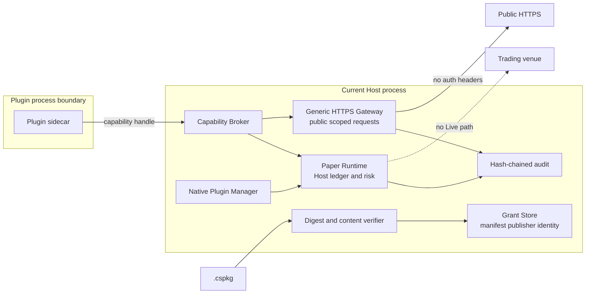
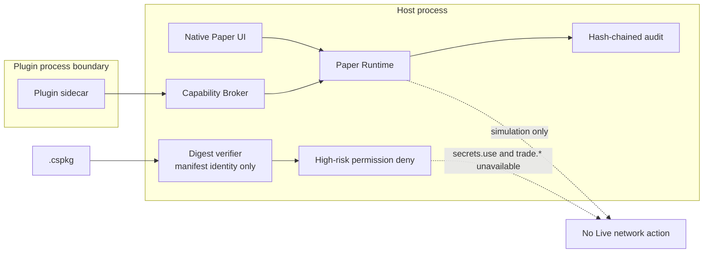
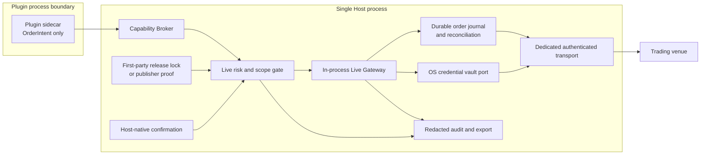
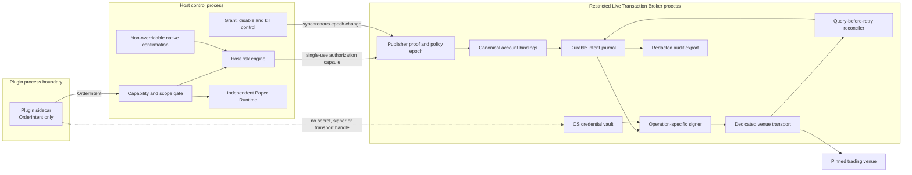

# Security Hardening Proposal: 集中并隔离 Live Authority

## Decision

2026-07-23，用户已选择 **Option 3：独立 Live Transaction Broker**，并授权实施
WP-A 与 WP-B。实现绑定到证据集合
`b025a166090f5ff5947f5ec97f0a102c22fa52c16ca0da9312e3e5765317db6d`
和实施前 revision `d26418e5d45e1e35dc80e8ae307c265ec9a1a3ca`；详细计划见
[implementation plan](../implementation/isolated-live-transaction-broker.md)。

这个选择不是“API key 存在哪里”这么窄：同一个权威边界最终还必须回答 publisher
是否可信、账户是不是用户实际选择的账户、一个订单是否已经发过、超时后能否重试、
kill switch 何时生效，以及用户看到的确认是否来自 Host。当前实现仍保持
Paper-only；本次只交付 build-pinned trust evidence 与零网络 Broker foundation。

## Executive Recommendation

我们有三个完整选项：

- **Option 1：保持 Paper-only**。保留现状的高风险权限拒绝，不尝试 Live。
- **Option 2：主进程内 Live Gateway**。在现有 Host Python 进程中集中凭据、风险、
  journal、对账和认证 transport。
- **Option 3：独立 Live Transaction Broker**。Host 控制面保留授权、风险和原生
  确认；受限 Broker 进程独占凭据、签名、实盘网络、规范账户与持久对账。

我推荐 Option 3。在当前威胁模型里，恶意或被攻陷的插件 sidecar 是我们最需要约束的
主体；独立 Broker 能让它既拿不到 secret，也拿不到通用 signer 或认证 transport。
更重要的是，我们可以把“持久化意图、检查 policy epoch、发送网络动作、记录
unknown、查询交易所”放进一个串行、可故障注入的状态机。

Option 2 的优势是真实且有吸引力的：代码和打包工作明显更少，也能做到不向插件返回
明文。如果项目只支持一个第一方 venue，并明确把整个 Host 后端视为同一可信计算基，
Option 2 可能更合适。让我不放心的是，它把插件生命周期、普通 Host API、数据面和
全部交易凭据放进同一进程故障域；未来开发者更容易从通用网络或日志路径意外绕过
专用边界。

若我们无法证明 Option 3 的 vault、IPC、journal、reconciliation 或 revoke 语义，
Option 1 不是失败，而是正确的 fail-closed 结果。任何情况下都不选择“让插件
sidecar 读取 secret 或自行创建认证网络请求”。

## Evidence

我检查了下表中的文档和源码。最影响诊断的是 E003/E004：现有 grant 绑定虽然有
publisher 字段，但它明确只是 `manifest:<display string>`；bundle verifier 只接受
严格摘要表，并没有 publisher signature。E005/E006 则说明我们已有值得复用的租约
撤销和 durable unknown 基础，但它们尚未组成交易所级 authority。

| Evidence | Finding or document | What it establishes |
| --- | --- | --- |
| `E001` | [Phase 11B 路线与退出门](../../../GENERAL_PLUGIN_PLATFORM_V2_EXECUTION_zh.md) | Live 要求可信 publisher、无明文 secret、精确 scope、醒目标识、query-before-retry、审计导出，并在无法证明 secret 不泄漏时保持 Paper-only。 |
| `E002` | [Phase 11A 明确保留边界](../../../PLUGIN_PLATFORM_V2_PHASE11A_zh.md) | 当前没有 credential handle、真实账户、认证 adapter、verified publisher 或 Live 证明；开始 11B 前必须先设计六个安全边界。 |
| `E003` | Manifest 身份与高风险权限门（`backend/app/plugin_security_v2/grants.py`） | `manifest_publisher_identity()` 只拼接 manifest 字符串；Grant Store 当前只允许选择性开放 Paper permissions，并拒绝其余高风险授权。 |
| `E004` | 摘要完整性但无签名身份（`backend/app/plugin_installer_v2/bundle.py`、`backend/app/plugin_installer_v2/registry.py`） | `.cspkg` 有 expected SHA-256、严格 contents 和 immutable receipt，但 envelope/activation 没有 publisher key、signature、timestamp 或 revocation evidence。 |
| `E005` | 现有租约与网络撤销原语（`backend/app/plugin_security_v2/capabilities.py`、`backend/app/plugin_gateway_v2/network.py`、`backend/app/plugin_core_v2/runtime.py`） | Capability lease 已绑定 plugin/instance/generation/digest/publisher/scope；disable/revoke 可回收 handle 并取消 socket，但现有 HTTPS gateway 刻意不接受认证 header，也不是交易 transport。 |
| `E006` | Paper durable intent 与 unknown recovery（`backend/app/plugin_paper_v2/runtime.py`、`packages/candlescope-plugin-sdk/src/candlescope_plugin_sdk/platform_v2/paper.py`） | Paper 在网络调用前持久化 pending、幂等 fingerprint、风险冻结和 Host kill；crash 后 pending 变 unknown 且不盲重试，但账户仅是 broker/account 字符串，也没有交易所 query 事实。 |
| `E007` | Hash-chain 审计但无用户导出面（`backend/app/plugin_security_v2/audit.py`） | AuditLog 校验 sequence、previous hash 和 event hash；在检查的 API/UI 中未观察到范围化、脱敏、带验证 receipt 的用户导出合同。后一结论是源码范围内的推断。 |
| `E008` | Host 原生管理面与 opaque sandbox（`backend/app/plugin_security_v2/management.py`、`frontend/src/features/plugins/PluginPlatformSurfaces.tsx`、`frontend/src/features/plugins/SandboxPluginFrame.tsx`、`frontend/src/index.css`） | 管理 mutation 要求 loopback/session/CSRF/user-action；Plugin Manager z-index 高于插件 view，iframe 是 opaque-origin/credentialless。当前 UI 却把 digest-only 工件写成 “signed .cspkg”，Paper 也仍使用通用 `window.confirm`，说明 trust label 与 intent-bound confirmation 都需闭合。 |

**Observed**：高风险权限当前不可达；bundle/activation 没有 cryptographic publisher
identity；现有网络 gateway 不转发 Authorization/Cookie；Paper crash 把 pending 变成
unknown；管理 mutation 与 sandbox iframe 已分离；当前安装 UI 的 “signed” 文案没有
对应的 signature evidence。

**Inferred**：如果我们只在 Paper Runtime 旁边增加一个 Live flag，publisher 资格、
secret 使用、账户选择、网络发送和 crash 恢复会由多个调用方分别约定。对普通只读
capability，这种分层是合理的；对可直接造成资金损失的动作，它让关键不变量依赖
开发纪律，而不是一个权威状态机。

本提案提出的是架构选择，不是已修复声明。

## Current Design And Failure Mode

当前设计对 Phase 11A 是合适的。插件 sidecar 只拿到与 generation、digest、scope
绑定的 capability handle；Host 拥有 Paper ledger、risk、quote、idempotency、audit
和 kill switch。通用 HTTPS gateway 只允许受 scope 的公开 HTTPS，并在 revoke 时关闭
socket。bundle verifier 则用 expected SHA-256 和严格内容表阻止工件漂移。

问题出现在我们试图给这些组件加上真实资金语义时。`publisher` 还不是签名身份；
`accountId` 还不是经过认证查询建立的账户；Paper ack 不是交易所的 order query；
generic network capability 也不能安全地变成“签任意字节并发送”。现有各层都做了自己
该做的事，但没有一个组件拥有完整的 Live 事务。

这会产生四类结构性失败：

- **authority confusion**：manifest 名称、全局 `trust_level` 或本地安装动作被误当成
  publisher 证明；
- **secret/signing confusion**：为了适配新 venue，把通用 signer 或认证 header 暴露给
  插件，从而让 scope 退化成“拥有 API key”；
- **state confusion**：timeout 后 sidecar 重启并重发，而 Host/venue 已经接受原订单；
- **control confusion**：UI 显示 kill 已开启，但另一个调用方在 policy 变化后仍发出
  下一次网络动作，或把 socket 关闭误报成交易所已取消订单。

## Desired Invariants

我们希望设计使下列行为可被测试证伪，而不是只写在文档里：

1. 插件进程、插件 UI、public Host API、日志和审计永远得不到 raw secret、OAuth
   refresh token、Authorization header、签名结果或 OS vault handle。
2. Live publisher 资格来自 build-pinned release record 或 Phase 12 的已验证签名证明；
   manifest display string、local-developer 开关和全局 trust label 都不构成资格。Host
   UI 必须准确区分 digest-verified local、first-party pinned 和 verified publisher，
   没有签名证据时不得显示 “signed”。
3. Live account 只能由 Host/Broker 在认证只读查询后建立，绑定 venue、environment、
   venue account/subaccount、credential version、connector digest、publisher proof 和
   用户可识别 label；插件不能自造 canonical account。
4. 每一次 submit/cancel 网络动作之前，都已经 durable 记录 intent hash、稳定 venue
   client order ID、risk decision、confirmation receipt、policy epoch 和 connector
   version。
5. crash、timeout 和 connection revoke 产生 `unknown`，随后必须按稳定 client/order ID
   query；没有 query 证据时不得盲重发，也不得把本地 socket 关闭解释成 venue cancel。
6. grant revoke、plugin disable、credential rotate、publisher revoke 和 global kill
   先同步推进 policy epoch；同一串行边界内，下一次网络动作必须看到新 epoch 并失败。
7. disable/revoke 停止新 submit，但未终态订单仍可由冻结的、最后可信的 drain-only
   connector 执行 query/cancel；如果安全 connector 不可用，状态保持 unresolved 并
   明确告警。
8. Live confirmation 和持续 Live 标识完全由 Host 原生 UI 渲染。confirmation receipt
   单次、短期有效，并绑定 intent hash、账户、plugin、publisher、scope 和 policy epoch。
9. 认证交易 transport 与 `network.connect` 分离：固定 HTTPS origin、无 redirect、
   无系统代理凭据、自有 DNS/TLS/大小/并发策略，且响应先规范化再返回 Host。
10. 审计导出能验证 hash chain，默认脱敏，并包含 unresolved/unknown 订单；任何 secret、
    auth header、完整签名 payload 或敏感响应 body 都不进入导出。

## Constraints And Non-Goals

当前约束是 Windows 桌面、Python Host、`.cspkg` sidecar、AppContainer/Job/ACL、Grant
Store 和 Host 原生 React 管理面。Paper 必须保持独立可回滚，Phase 1 冻结合同不能被
悄悄改写。

我们不在首个 Live 切片支持：

- local-developer、unsigned 或一般社区插件；
- 提现、转账、API key 管理脚本、通用 HMAC/签名、任意认证 HTTP；
- margin、leverage、short、funding、liquidation 或 cross-account netting；
- 插件自行定义风险绕过、直接选择 credential、直接指定 venue endpoint；
- 后台无人确认的生产自动化 Live session；
- 把 publisher signature 当成代码无恶意的证明；
- 在没有订单查询能力时声称 exactly-once；
- Host 主进程或 Windows 用户账户完全失陷后的 secret 保护。

项目没有提供正式性能与内存预算。后续实现计划必须先确认本地 dispatch、Broker
working set、启动时间和 24h testnet soak 的预算，不能把本提案中的建议阈值冒充测量值。

## Before Architecture

下面的 before 视图只画安全相关结构。我们已经有可靠的 digest、grant、capability、
Paper 和 public-network 基础，但 Venue 端没有一条被支持的 Live 路径。

[Mermaid source](../diagrams/live-authority-boundary-before.mmd)

关键不是 before 架构“缺组件”，而是它正确地拒绝了尚无所有者的 authority。我们应
保留这条拒绝，直到 after 架构的全部边被证明。

## Options

### Option 1: 保持 Paper-only

Option 1 保留当前结构与高风险 permission deny。它继续提供完整 Paper、只读市场数据、
公开 HTTPS integration 和 plugin UI，却不建立 Live account，也不接受实盘
`OrderIntent`。这是唯一不新增 credential 或资金风险的选项。

它最强的理由是诚实：Phase 12 publisher signature 尚未交付，我们也没有真实 venue
query/reconciliation 证据。等待能避免为赶进度创造一个临时 signer，后来却因兼容性
永久保留。它的安全效果不是“修好 Live”，而是继续让 Live 不存在。

成本是产品能力延后，且用户可能转向 CandleScope 之外的执行工具。可逆性最好：未来
选择其他方案时不需要迁移 credential 或订单 journal。若任何启用方案在 secret
confinement、unknown reconciliation 或 UI confirmation 上失败，我们应自动回到这个
选项。

[Mermaid source](../diagrams/live-authority-boundary-paper-only-gate-after.mmd)

| Change | Before | After | Security consequence | Cost |
| --- | --- | --- | --- | --- |
| Live permission | 全部不可达 | 保持不可达并作为显式产品状态 | 不引入新 secret/资金攻击面 | 不交付 Live |
| Publisher | manifest identity，UI 误称 signed | 不提升为高风险身份并纠正为 digest-verified local | 不会把显示名或摘要误作签名 | verified publisher 延后 |
| Recovery | Paper unknown | 仍仅 Paper unknown | 不会误称交易所 exactly-once | 无 Live 对账 |
| UI | Paper 原生面 | 持续标记 Paper-only | 不会混淆环境 | 无 Live UX |

与 before 相比，这个 after 主要把“未实现”提升为明确架构决定。它适合风险证据不足或
交付预算不足时采用。

### Option 2: 主进程内 Live Gateway

Option 2 在 `CorePluginPlatform` 所在 Host 进程内增加一个专用 Live Gateway。插件仍
只提交规范化 intent；Live Gateway 通过 OS credential vault port 获取短期明文，
执行 Host risk、canonical account lookup、durable journal、operation-specific signing、
dedicated transport 和 reconciliation。它不复用 `network.connect`，也不把签名结果
返回插件。

这个方案保留现有部署模型，没有新守护进程或私有 IPC。对一个第一方 venue，代码可以
直接复用 Grant Store、AuditLog、management guard、capability revocation 和 Paper
里已经验证过的持久化顺序。多出来的本地延迟很小，故障恢复也只需要一个进程的
lifecycle。

安全收益是实质性的：插件仍无法读 secret，order 网络动作由 Host 独占。残余风险也
同样实质：任何 Host 后端路径遍历、日志误用、调试 dump 或未来模块越权都会与所有
Live credential 共享地址空间。普通插件 control/data plane 与交易权威共享 event
loop 和崩溃域，重负载或死锁也会影响 kill/reconciliation。长期看，开发者可能为了
新 venue 而给这个进程加入越来越通用的 signer。

迁移可以从 read-only account sync 开始，并用 feature flag 保持 submit/cancel 关闭。
回滚时关闭 Live flag、停止新动作、保留 journal，并用同一进程的 drain-only 模式完成
query/cancel。若 Host 本身无法启动，这个恢复路径也不可用；这是相对 Option 3 最重要
的可靠性代价。

[Mermaid source](../diagrams/live-authority-boundary-in-process-live-gateway-after.mmd)

| Change | Before | After | Security consequence | Cost |
| --- | --- | --- | --- | --- |
| Publisher identity | manifest 字符串 | release lock/签名证明对象 | 高风险 grant 不再依赖显示名 | 新 trust store 与 revocation |
| Secret | 不存在 | OS vault port，明文只在 Host 内短期存在 | 插件拿不到明文 | Host 进程成为 secret TCB |
| Account | Paper broker/account 字符串 | 认证查询建立 canonical binding | 插件不能自造账户 | 账户迁移与重绑 UI |
| Execution | Paper invoke | durable Live Gateway + dedicated transport | 可强制 persist-before-send | 与普通 Host 同一故障域 |
| Recovery | local unknown | venue query-before-retry | 降低重复订单 | venue adapter 必须支持查询 |
| Kill/revoke | capability/socket revoke | Host policy epoch + socket cancel | 下一动作可 fail closed | event-loop/锁竞态需证明 |

Option 2 最适合短期单 venue、第一方 connector 和强 Host 信任假设。若我们选择它，应在
设计记录里承认共享故障域，而不是用“Host-owned”掩盖隔离差异。

### Option 3: 独立 Live Transaction Broker

Option 3 把最危险的状态和副作用放进一个受限、Host-owned Broker 进程。插件 sidecar
仍只调用 public capability；Host 主进程完成 manifest/grant scope、风险计算和原生
确认，然后通过继承的私有 IPC 发送单次 authorization capsule。capsule 绑定 intent
hash、canonical account、publisher/release proof、connector digest、policy epoch、
confirmation receipt、有效期和动作类型。

Broker 不信任插件输入，也不接受通用 HTTP 或 sign(bytes)。它自己再次检查 release
lock/revocation、account binding、epoch 和 operation schema；从 OS vault 解密凭据后，
只让 operation-specific signer 构造允许的 submit/cancel/query 请求，并通过无 redirect
的专用 transport 发送到固定 venue origin。raw request、auth header、signature 和 raw
response 都不穿过插件 IPC。

这个方案真正吸引我的地方是状态所有权。Broker 在同一个串行事务边界里写入 intent
journal、分配稳定 venue client order ID、检查 epoch、标记 dispatching，然后才发送。
timeout 或进程崩溃后，新 Broker 从 journal 进入 reconciliation；它按 client/order ID
查询，而不是重新调用 submit。kill/revoke 先推进 epoch 并关闭 in-flight transport，
所以本地只知道 socket 被切断时，订单保持 `unknown`。

隔离并不自动解决 connector 信任。首个切片只能使用 build-pinned 第一方 connector；
connector 的 endpoint/action 模板必须限制为 account/query/submit/cancel。未来的
`verified-publisher` 仍需 Phase 12，而且更适合签名的声明式 request plan 或受限
WASM，而不是把任意 Python 复制进 Broker TCB。publisher 被撤销时，新 submit 立即
停止；为了处理未终态订单，Broker 只保留最后一个已知安全版本的 drain-only
query/cancel adapter。若没有安全 adapter，系统必须导出 unresolved 状态并要求人工处理。

代价来自真实机制：每次动作多一个 IPC hop 和序列化；Broker 有自己的 working set、
升级、健康监控和 crash recovery；Host 与 Broker 的版本必须协商；安装器要原子部署
Broker/connector 资产；测试要覆盖每一个 journal 边界的掉电。我们应把这些成本看成
交易系统的核心工作，而不是插件平台的附属 glue。

回滚不是简单 kill 进程。关闭 feature flag 后，Broker 进入 drain-only：拒绝新 submit，
继续 query/cancel 和导出，直到全部订单终态或明确 unresolved。Paper Runtime 始终独立，
因此 Live 回滚不修改 Paper state。

[Mermaid source](../diagrams/live-authority-boundary-isolated-live-transaction-broker-after.mmd)

| Change | Before | After | Security consequence | Cost |
| --- | --- | --- | --- | --- |
| Privileged boundary | 无 Live owner | 单一受限 Broker TCB | secret/sign/send/reconcile 有唯一所有者 | 新进程与私有 IPC |
| Authorization | capability lease | 单次 capsule + Broker epoch recheck | 旧 grant/确认不能在下一动作使用 | 双重策略与版本协商 |
| Secret | 无 | Broker-only OS vault plaintext lifetime | 插件与 Host 普通模块不接触明文 | vault 集成和内存卫生 |
| Account | Paper 字符串 | Broker 认证建立的 immutable binding | 防止插件换账户/环境 | rotate/rebind 流程 |
| Order state | Paper local state | persist-before-send journal + venue reconciliation | crash/timeout 不盲重发 | durable schema 与故障注入 |
| Network | generic public HTTPS | signer 同进程的 dedicated venue transport | auth 材料不跨公共 gateway | 每 venue 受限 connector |
| Kill/revoke | 回收 handle/socket | policy epoch + socket abort + unknown reconcile | 下一动作 fail closed，不虚报 cancel | drain-only 运维状态 |
| UI/audit | Paper panel/hash chain | intent-bound receipt、持续 Live 标识、可验证导出 | iframe 不能伪造确认，事后可核验 | 新原生流程与导出格式 |

这个选项只有在我们真的保持 Broker API 狭窄时才成立。若它最终演变为“传 URL、headers
和 body 给 Broker 签名发送”，隔离进程只是把通用危险能力搬了位置，应判定为设计失败。

## Comparison

下表不做虚构综合评分。每一列都反映实际的成本机制。

| Dimension | Option 1：Paper-only | Option 2：主进程 Gateway | Option 3：独立 Broker |
| --- | --- | --- | --- |
| Security | 无新增资金/secret 攻击面；不交付 Live | 插件拿不到 secret，但 Host 全进程成为 credential/交易 TCB | secret、签名、transport、journal 收敛到狭窄进程；IPC/Broker 成为新 TCB |
| Performance | 与当前相同 | 无 IPC，只有 journal/vault/签名开销 | 多一次 IPC/序列化；exchange 网络通常仍是主延迟 |
| Memory | 无新增常驻内存 | Host 内增加 vault cache、journal index、reconciler | 新进程、IPC buffer、journal index 和 adapter working set |
| Reliability | 没有 Live 可用性问题 | Host crash 同时中断 UI、执行与对账 | Broker crash 与 Host UI 可分离；需要进程监督、版本协商和 journal 恢复 |
| Operability | 最简单 | 单进程日志/部署简单，但 secret incident blast radius 大 | 新健康、告警、drain-only、vault/IPC 诊断和恢复工具 |
| Migration | 无迁移 | 中等：Host 内新增 schema、账户与 UI | 高：先建 Broker/IPC/vault，再逐步 read-only、shadow、testnet、production |
| Rollback | 保持现状 | Host feature off + 同进程 drain | Broker feature off + 独立 drain/export；Paper 不受影响 |
| Extensibility | 无 Live adapter | 第一方 venue 容易，长期 signer 泛化风险 | 第一方安全边界最好；社区 connector 需受限格式和 Phase 12 trust |

我们还没有 IPC/RSS 实测，因此不能断言 Option 3 的性能成本“可以忽略”。验证计划会把
local dispatch 与 exchange latency 分开；如果本地 hop 超出产品预算，可以优化批次/
序列化，但不能用共享 secret 换取延迟。

## Recommendation

在 Windows 桌面、恶意插件威胁、第一方首发 venue、Phase 12 尚未完成的当前约束下，
我推荐 **Option 3：独立 Live Transaction Broker**。

选择它之后仍不是立即写 submit adapter。我们先做一个零网络、零账户、零交易的
Broker foundation：release-lock evidence、私有 IPC、policy epoch、opaque credential
handle、vault mock/Windows backend 以及 secret byte scan。只有这个边界被证明，才进入
只读 canonical account；只有 query/reconciliation 在 testnet shadow 中稳定，才加入
submit/cancel。

以下情况应改变推荐：

- 如果项目明确把整个 Host 后端视为同一高信任 TCB，只支持一个第一方 venue，且独立
  进程打包/恢复成本不可接受，Option 2 可能更比例适当。
- 如果没有可靠 OS vault、无法保留 drain-only connector、venue 不支持按稳定 client ID
  查询，或无法实现 non-overridable confirmation，Option 1 应获胜。
- 如果未来目标是大量社区 Live connector，必须先完成 Phase 12，并单独评审受限 connector
  格式；本提案不授权任意 verified Python 进入 Broker。

## Evidence Coverage And Residual Risk

| Evidence | Option 1 | Option 2 | Option 3 | Tactical protection still required |
| --- | --- | --- | --- | --- |
| `E001` — Phase 11B 路线与退出门 | `unaffected`：不交付 Live | `mitigates`：可满足大部分门，但共享进程 | `addresses`：组件职责覆盖全部门 | 所有门通过前高风险权限保持 unavailable |
| `E002` — Phase 11A 保留边界 | `addresses`：继续 Paper-only | `mitigates`：逐项补齐 | `addresses`：逐项补齐且隔离 | Paper 与 Live state/schema/feature flag 独立 |
| `E003` — Manifest 身份与权限门 | `unaffected`：缺口不构成 Live 风险 | `addresses`：新增 release proof | `addresses`：Broker 再校验 proof/epoch | 禁止从 manifest/global trust 推导 L4 |
| `E004` — 摘要-only bundle | `mitigates`：纠正 trust label，仍不开放 Live | `mitigates`：第一方 lock 可首发 | `mitigates`：第一方 lock 可首发，社区仍等 Phase 12 | verified-publisher 路径保持不可达 |
| `E005` — 租约/网络撤销原语 | `unaffected` | `mitigates`：复用但同进程竞态 | `addresses`：capsule + Broker epoch + socket abort | 保留现有 revoke listener 和负向测试 |
| `E006` — Paper unknown recovery | `unaffected`：不映射到 Live | `mitigates`：加入 venue query | `addresses`：journal/reconciler 单一所有者 | 未查询前永不重发或宣称 cancelled |
| `E007` — 审计导出缺口 | `unaffected` | `addresses`：新增导出 API/UI | `addresses`：Broker journal 生成验证 receipt | 现有 hash-chain 校验和 secret redaction 保留 |
| `E008` — 原生 UI/sandbox 边界 | `mitigates`：纠正 signed 文案，仍只有 Paper UI | `addresses`：新增 Host Live confirm | `addresses`：intent-bound confirm + capsule | iframe bridge 永不新增 Live mutation |

即使 Option 3 完成，残余风险仍包括：恶意但已 build-pinned 的第一方 connector、Host
风险算法错误、venue API 语义变化、Windows 用户账户完全失陷、API key 本身权限过宽、
用户误确认、市场跳价和交易所故障。publisher signature 只能证明来源，不能证明无恶意；
最小 API key 权限、venue-side withdrawal disable、testnet/shadow 和账户限额仍是必要
防线。

## Migration And Rollout

迁移不采用一次性切换。我们把推荐方案分成命名工作包，避免把阶段编号与三个 Option
混淆：

- **WP-A — Trust evidence**：定义 `PublisherEvidence`，只接受内置 first-party release
  lock；任何 digest/version/publisher/connector mismatch 都 fail closed。
- **WP-B — Broker foundation**：私有继承 IPC、协议版本、policy epoch、健康/重启、
  opaque credential handle、Windows vault port 与 fake backend；没有网络方法。
- **WP-C — Canonical account read-only**：只读认证 query、account binding、credential
  rotate/rebind、环境和 venue identity；仍无 submit/cancel。
- **WP-D — Journal and reconciliation shadow**：Live DTO、persist-before-dispatch 状态机、
  稳定 client ID、fault injection、testnet query shadow；transport 不发送订单。
- **WP-E — Native Live control**：不可覆盖确认、持续 Live banner、单次 receipt、global
  kill、grant/plugin/publisher/credential revoke 与 audit export。
- **WP-F — First-party testnet execution**：一个 build-pinned venue 的 submit/cancel/query，
  每单用户确认，严格 spot/no-short/no-transfer scope。
- **WP-G — Production canary**：小额、单账户、人工触发、明确限额与回滚；完成独立安全
  复核后才可进入。社区 verified publisher 仍不在本工作包。

每个工作包是独立提交和 feature gate。WP-A–E 未全部通过时，Grant Store 仍拒绝
`trade.submit`/`trade.cancel`；WP-B/C 也不应通过偷偷启用 `network.connect` 来探测账户。

升级时，旧 Broker/connector artifact 必须保留到其订单全部终态。新版本先安装、验证
和 shadow，不原地替换 active drain adapter。回滚先关闭新 submit，推进 policy epoch，
再 drain/reconcile；绝不删除 unresolved journal。

## Validation Plan

下面的计划把 security、功能、性能和恢复分开。所有数字都是建议的 go/no-go 预算，
不是当前测量结果；implementation plan 必须确认或调整。

| Area | Workload and evidence | Metric / decision threshold |
| --- | --- | --- |
| Publisher trust | 篡改 manifest publisher、bundle digest、release record、connector digest、revocation epoch | 每一种 mismatch 在 mint credential/account/submit 之前 fail closed；零网络动作 |
| Secret confinement | canary secret 注入 fake/Windows vault；扫描 plugin RPC、Host public RPC、日志、audit、crash report、export、临时目录和进程环境 | canary 字节零出现；插件仅见 opaque account/credential reference |
| IPC authentication | 非继承进程、旧 generation、重放 capsule、过期/改 intent hash/epoch 的 corpus | 全部拒绝且有脱敏审计；capsule 单次消费 |
| Account canonicalization | 同 credential 的 spot/subaccount/testnet/live 组合，rotate/revoke/rebind | identity 无碰撞；environment 不可混淆；rotate 后旧 binding 不可下单 |
| Order state machine | 在 durable write、dispatch、TLS send、response、ack persist 各边界注入 crash/timeout | 每个恢复结果是已证实状态或 `unknown`；从不盲重发；同 client ID 最多一个 venue order |
| Kill/revoke | 与 submit 并发触发 grant revoke、disable、credential rotate、publisher revoke、kill | epoch 线性化后零新网络动作；in-flight socket 被关闭；未证实订单保持 `unknown` 并进入 query |
| Drain-only | disable/revoke 时存在 open/partial/unknown order | 新 submit 为零；安全 adapter 继续 query/cancel；无 adapter 时明确 unresolved/export |
| UI isolation | sandbox iframe 尝试 focus、fullscreen、navigation、message spoof、CSS overlay；Host realm 打开确认 | iframe inert/suspended 且低于确认层；receipt 绑定 Host-rendered exact intent；无 bridge Live mutation |
| Audit export | 10k 混合 allowed/denied/unknown/reconcile events，篡改/截断/重排 | 导出验证 hash chain 和范围 receipt；篡改失败；secret/auth/body 零出现 |
| Local performance | 100 req/s 的 fake venue，分离 Host→Broker 本地 hop 与 transport | provisional：本地 dispatch p95 ≤10 ms、p99 ≤25 ms；超标则停止生产门而不绕过 Broker |
| Memory | idle、10k journal entries、100 concurrent query 的 Broker RSS | provisional：idle ≤64 MiB、压力峰值 ≤128 MiB；超标需有界 index/streaming |
| Reliability | 24h testnet soak、Broker/Host 随机重启、网络抖动、机器休眠恢复 | 零重复 venue order；全部 nonterminal 最终终态或显式 unresolved；Paper 回归全绿 |

除表中测试外，还要运行全量 backend/frontend/SDK、`.cspkg` install/check/rollback、真实
Windows AppContainer/Broker 启动、真实浏览器 UI 和至少一次人工 Windows credential/
native confirmation smoke。测试数量不能替代实测撤销、对账和 secret byte scan。

## Implementation Work Packages

如果选择 Option 3，implementation plan 应把 WP-A–G 各自写成：

- 明确的 schema/API/进程边界；
- 允许和禁止的网络动作；
- migration 与旧 artifact 保留规则；
- focused、full、browser、testnet 和故障注入门；
- feature flag 默认值、enable 前置条件和 rollback 命令；
- 每一条 E001–E008 的重新验证证据。

最先实现 WP-A/WP-B，并强制 Broker protocol 中不存在 network method。该提交的验收应
包括：local/unsigned publisher 被拒绝、secret canary 不越界、revoke epoch 重放失败、
Broker crash 不影响 Paper、关闭 feature 后零进程/零 handle。

WP-C 只能做 read-only account discovery。WP-D 只能做 shadow/query，不得发送 submit。
WP-F 是第一次允许 testnet 订单；它必须在单独提交、单独 feature flag 和明确用户选择
下进入。WP-G 不能由“测试都过了”自动触发。

Option 2 若被选择，也需要同样的 trust/account/journal/UI/reconciliation 工作包，只是
把 Broker process/IPC 替换为一个严格内部 module boundary，并记录共享 TCB 的残余风险。
Option 1 不创建 implementation plan，只更新产品状态并持续运行 Paper 门禁。

## Open Questions

- Windows 首选 vault 是 Credential Manager 还是 DPAPI-protected store？两者的备份、
  rotate、ACL、测试与无头恢复语义需要原型证据。
- 第一个 build-pinned venue 和 testnet 是什么？它是否支持唯一 client order ID、
  query-by-client-ID、细粒度 API key scope 和 venue-side withdrawal disable？
- Host 与 Broker 使用匿名继承 pipe、named pipe + ACL，还是现有 framed transport 的
  受限变体？哪一种能最好地证明非插件进程不可连接？
- Broker journal 使用专用 SQLite/WAL、append-only log 还是原子 JSON segment？需要在
  crash consistency、导出、容量和恢复时间之间测量。
- plugin disable/publisher revoke 后，哪个已知安全 connector 可以承担 drain-only
  query/cancel？如果 connector 本身被判恶意，人工恢复流程是什么？
- 首个 Live 切片是否坚持每单 Host confirmation？我建议是。带 TTL 的自动化 Live
  session 应作为后续独立威胁模型，而不是首发便利开关。
- provisional 的 10/25 ms IPC、64/128 MiB RSS 预算是否符合产品目标？
- Phase 12 的 verified publisher 何时可用？在它之前，本提案明确不开放社区 Live。
